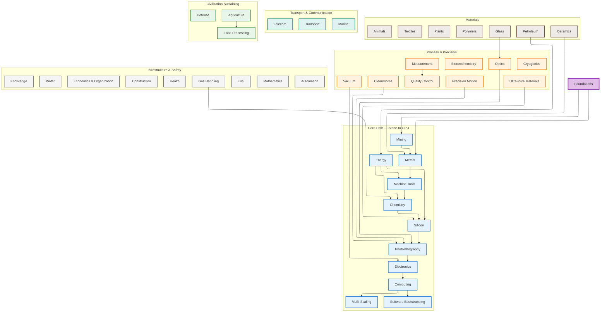

# From Stone to Silicon: Civilization Bootstrap Tech Tree

A structured, visual guide to bootstrapping modern industrial civilization, starting from stone-age materials and reaching high-end semiconductors (GPUs) and solar cells.

This project documents the complete dependency chain from fire and stone tools through metallurgy, machine tools, chemistry, and silicon fabrication to advanced integrated circuits. It includes parallel "side quest" tracks for the supporting infrastructure that makes long-term technological development sustainable across generations.

## Stats

| Metric | Count |
|--------|-------|
| Technology domains | 43 |
| Capability nodes | 459 |
| Dependency edges | 1,061 |
| Content articles | 671 |
| Mermaid diagrams | 59 |
| D2 diagrams | 59 |
| Glossary terms | 11,966 |

## Tech Tree Overview



## Quick Navigation

- [Overview & Introduction](docs/index.md)
- **Core Path** — stone to GPU:
  - [Foundations](docs/foundations/) · [Mining](docs/mining/) · [Energy](docs/energy/) · [Metals](docs/metals/) · [Machine Tools](docs/machine-tools/) · [Chemistry](docs/chemistry/) · [Silicon](docs/silicon/) · [Photolithography](docs/photolithography/) · [Electronics](docs/electronics/) · [Computing](docs/computing/) · [VLSI Scaling](docs/vlsi-scaling/) · [Software Bootstrapping](docs/software-bootstrapping/)
- **Materials**:
  - [Ceramics](docs/ceramics/) · [Glass](docs/glass/) · [Polymers](docs/polymers/) · [Textiles](docs/textiles/) · [Animals](docs/animals/) · [Plants](docs/plants/) · [Petroleum](docs/petroleum/)
- **Process & Precision**:
  - [Vacuum Technology](docs/vacuum/) · [Cryogenics](docs/cryogenics/) · [Cleanrooms](docs/cleanrooms/) · [Ultra-Pure Materials](docs/ultra-pure/) · [Precision Motion](docs/precision-motion/) · [Optics](docs/optics/) · [Measurement](docs/measurement/) · [Quality Control](docs/quality-control/) · [Electrochemistry](docs/electrochemistry/)
- **Infrastructure & Safety**:
  - [Construction](docs/construction/) · [Gas Handling](docs/gas-handling/) · [Water](docs/water/) · [Health](docs/health/) · [EHS](docs/ehs/) · [Automation & Robotics](docs/automation/) · [Mathematics](docs/mathematics/) · [Knowledge](docs/knowledge/) · [Economics & Organization](docs/economics-organization/)
- **Transport & Communication**:
  - [Transport](docs/transport/) · [Marine](docs/marine/) · [Telecommunications](docs/telecom/)
- **Civilization Sustaining**:
  - [Agriculture](docs/agriculture/) · [Food Processing](docs/food-processing/) · [Defense](docs/defense/)
- [Minimum Viable Civilization Checklist](docs/supporting/minimum-viable-checklist.md)
- [Dependencies & Resources](docs/supporting/dependencies.md)
- [All Mermaid Diagrams](diagrams/mermaid/) · [All D2 Diagrams](diagrams/d2/)

## How to Use

1. Start with the [Overview](docs/index.md) to understand the full scope
2. Explore domains in dependency order (see [overview diagram](diagrams/mermaid/overview.mmd))
3. Use the Mermaid diagrams for visual understanding (render at [mermaid.live](https://mermaid.live))
4. Check the [Checklist](docs/supporting/minimum-viable-checklist.md) for prioritization

## Core Principles

- **Iterative bootstrapping everywhere**: Crude tools make better tools. Each generation improves the last.
- **Precision mechanics as the master key**: Machine tools (especially lathes) unlock everything downstream.
- **Energy abundance is non-negotiable**: Silicon reduction, crystal growth, and fabs are energy-intensive.
- **Parallel tracks with feedback**: Develop agriculture/energy/mechanics/chemistry simultaneously where possible.
- **Start simple and scale**: Large-geometry devices before complex logic. Solar-grade silicon before electronic-grade.
- **Purity and control escalate relentlessly**: Trace impurities destroy semiconductor performance.

## Timeline Perspective

Basic solar cells are achievable within decades of establishing solid machine tools + electricity + chemistry. Full high-end GPU capability (advanced nodes, billions of transistors) likely requires **50–200+ years** even with perfect knowledge, due to purity demands, scale, and ecosystem complexity.

## Project Structure

```
tech-tree-bootstrap/
├── docs/               # Domain-organized content (Markdown prose)
│   ├── index.md        # Unified entry point
│   ├── {domain}/       # 43 technology domain directories
│   ├── glossary/       # 6,240 auto-generated glossary entries
│   └── supporting/     # Schema spec, checklist, resources
├── data/               # Structured data (JSON-LD)
│   ├── entities/       # 459 entity files (JSON-LD)
│   ├── products/       # 1,272 product/material files (JSON-LD)
│   ├── schema/         # JSON Schema validation files
│   ├── glossary.json   # 11,966 glossary terms with relevance ratings
│   ├── plants.json     # Plant species catalog
│   └── resources.json  # External resource references
├── diagrams/           # Auto-generated (DO NOT hand-edit)
│   ├── mermaid/        # .mmd flowcharts (44 domains)
│   └── d2/             # .d2 flowcharts (44 domains)
└── scripts/            # Validation, generation, and build tools
```

## Validation

```bash
python3 scripts/validate.py          # 24 checks: schema, DAG, cross-refs, tags, hierarchy, quality audits
python3 scripts/generate-diagrams.py # Regenerate Mermaid from data
```

## License

[CC0 1.0 Universal](LICENSE), a Public Domain dedication.

## Contributing

See [CONTRIBUTING.md](CONTRIBUTING.md) for guidelines.
