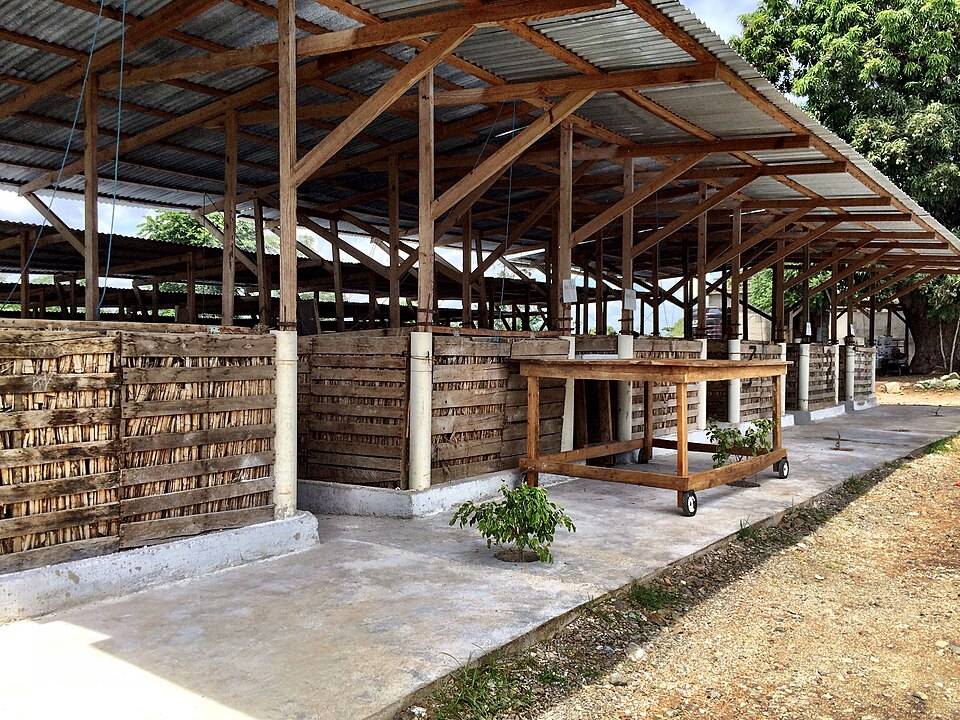
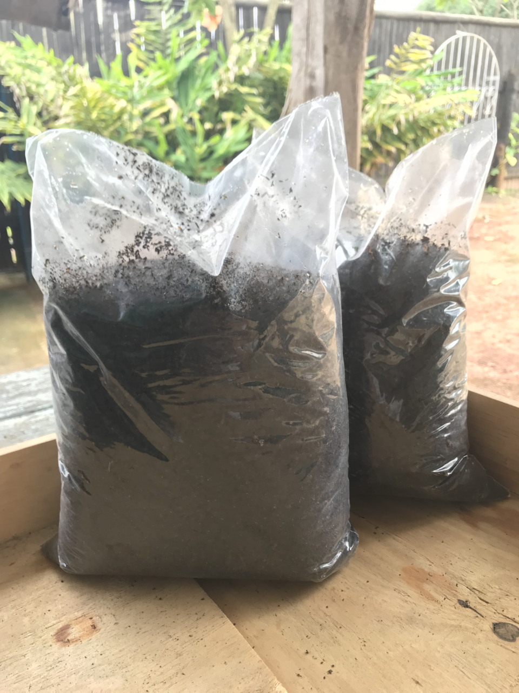
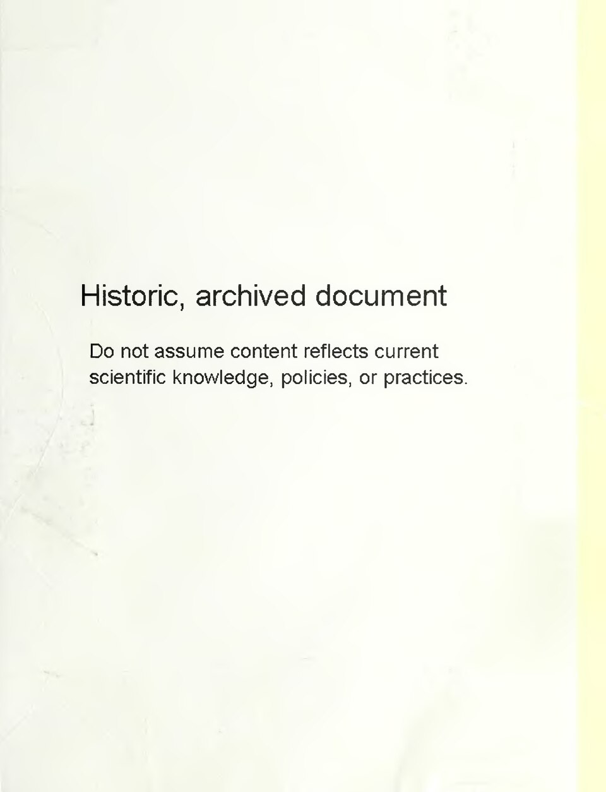
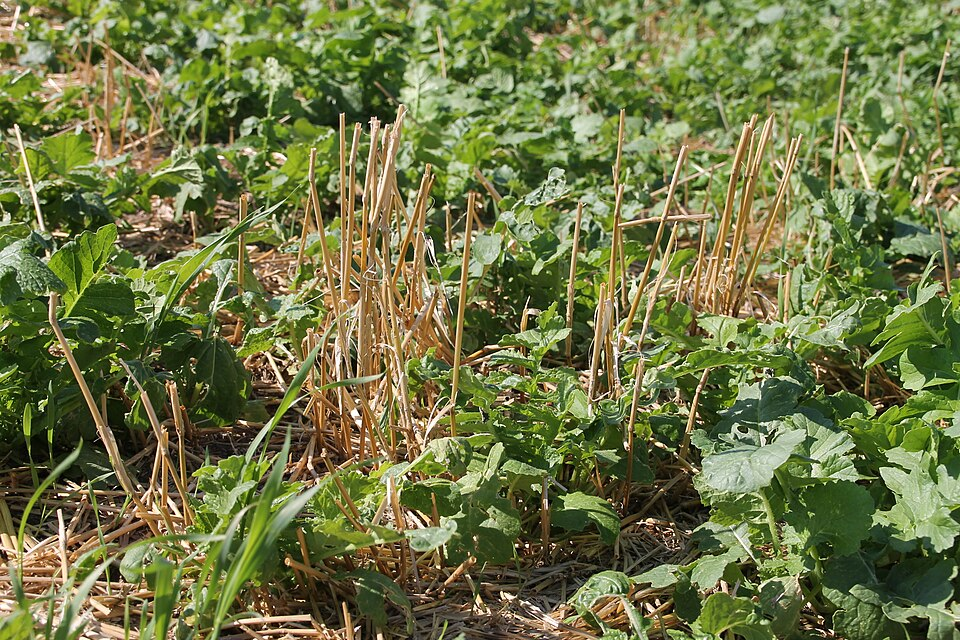
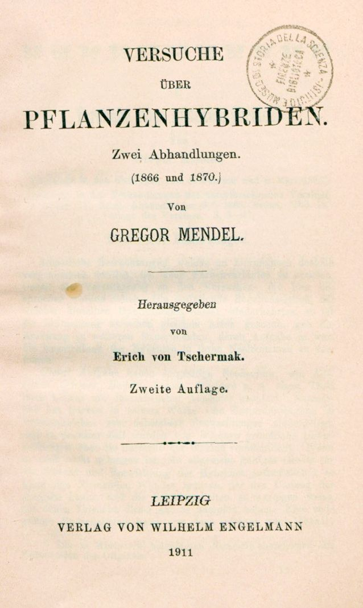
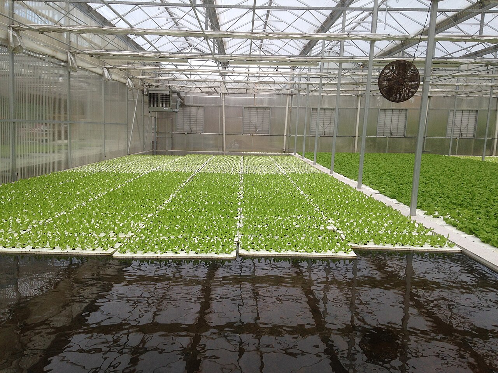

# Agriculture

Capabilities in this domain:

> *Image: SuSanA Secretariat, CC BY 2.0*

- **[Soil Management & Composting](soil-management.md)** — Composting, soil fertility, cover crops, biochar. Foundation of sustained agriculture.

> *Image: Renatotcm, CC BY-SA 4.0*

  - **[Vermiculture](soil-management-vermiculture.md)** — Worm composting for premium fertilizer.

> *Image: Griffith and Turner Co, Public domain*

- **[Seed Saving & Selection](seed-saving.md)** — Harvesting, storing, and selecting seeds for locally adapted crop varieties. The oldest biotechnology.

> *Image: USDA NRCS South Dakota, Public domain*

- **[Crop Rotation & Nutrient Cycling](crop-rotation.md)** — Planned crop sequences to break pest cycles, replenish soil nutrients, and sustain yields indefinitely.

<!-- TODO: source image for Irrigation Systems -->
- **[Irrigation Systems](irrigation.md)** — Controlled water delivery to crops via gravity-fed channels, furrow, basin, and low-pressure drip methods.

<!-- TODO: source image for Pest Management -->
- **[Pest Management](pest-management.md)** — Biological, physical, and cultural pest control strategies for pre-chemical agriculture.

<!-- TODO: source image for Aquaponics -->
- **[Aquaponics](aquaponics.md)** — Combined fish and plant production. Natural biological nutrient cycling.

> *Image: Gregor Mendel, Public domain*

- **[Selective Breeding](selective-breeding.md)** — Systematic genetic improvement of crops and livestock through artificial selection, progeny testing, and record-keeping.

<!-- TODO: source image for SEM Tech Hydroponics -->
- [SEM Tech Hydroponics](sem-tech-hydroponics.md) — electromembrane nutrient and pH control

> *Image: ArcadiYay, CC BY-SA 4.0*

  - **[Hydroponic pH Control](hydroponic-ph-control.md)** — pH targets, acid/base adjustment, monitoring, and calibration

[↑ Back to Tech Tree](../index.md)
