# Animals & Animal Husbandry

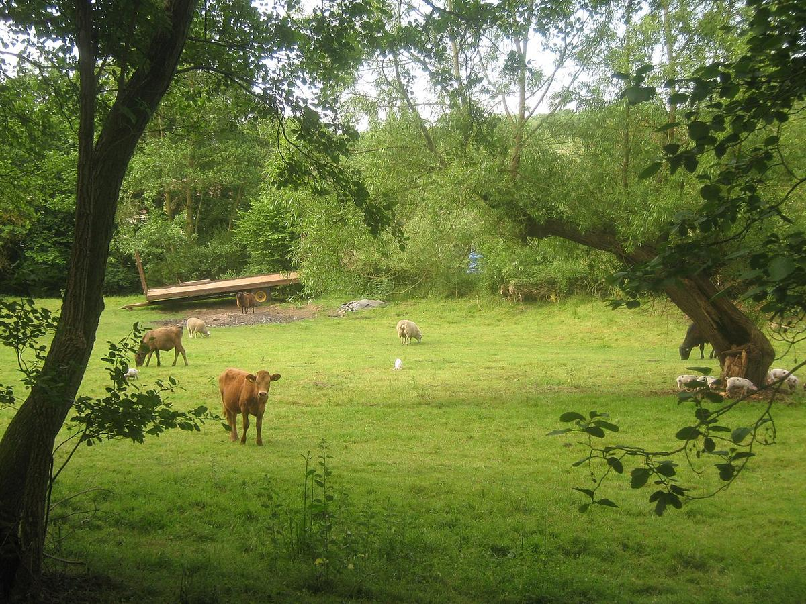

> *Livestock of Brokes Mill Farm*

> *Image: David Anstiss, CC BY-SA 2.0*

> **Organizing Axis**: Functional — capabilities grouped by the human need they serve (same as plants domain).

Capabilities in this domain:

<!-- TODO: source image for Domestication & Husbandry -->
- **[Domestication & Husbandry](domestication.md)** — Cattle, sheep, goats, pigs, poultry, horses, donkeys. Selective breeding, housing, feeding, health.
  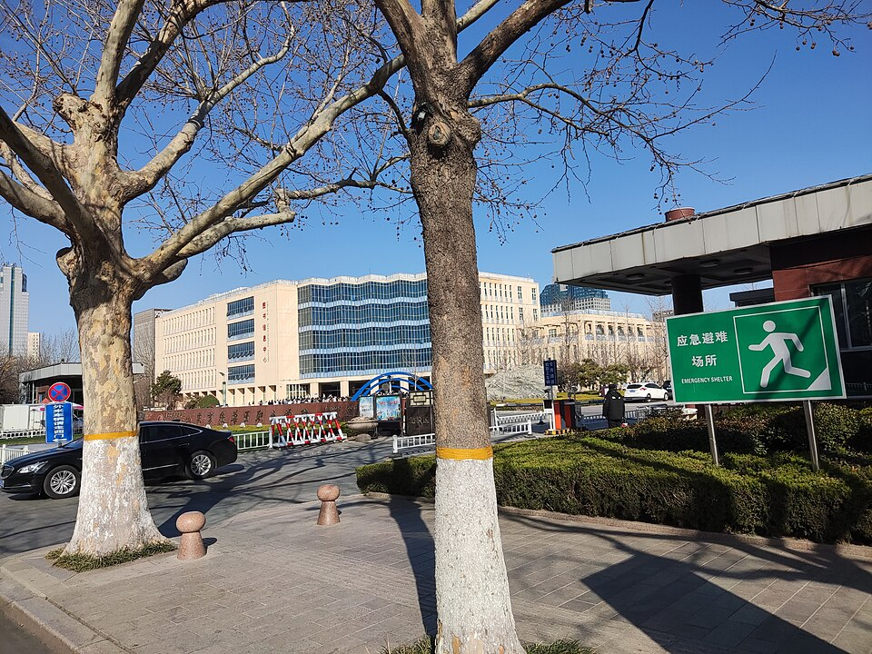
  > *Image: Ngguls, CC BY-SA 4.0*

  - **[Animal Husbandry](animal-husbandry.md)** — Core knowledge for managing all livestock species: breeding, feeding, health, and seasonal planning.
<!-- TODO: source image for Draft Power & Harnessing -->
- **[Draft Power & Harnessing](draft-power.md)** — Yokes, harnesses, plowing, carts, horse whim, animal milling. Primary motive force before steam.
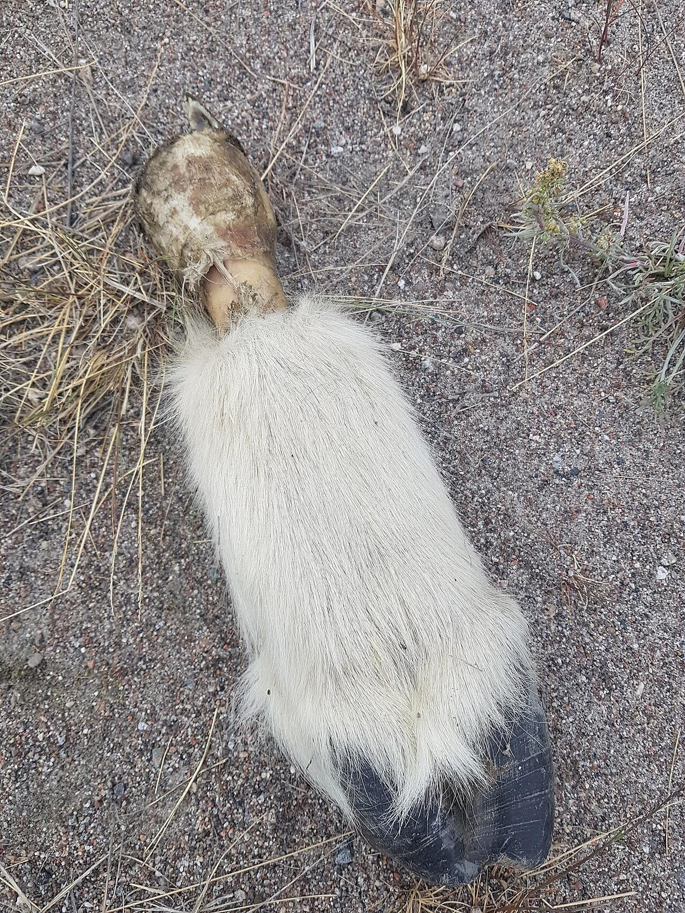
> *Image: Kenny McFly, CC BY-SA 4.0*

- **[Animal-Derived Materials](animal-materials.md)** — Leather/tanning, tallow rendering, wool preparation, horn/bone working, sinew, hide glue, blood.
  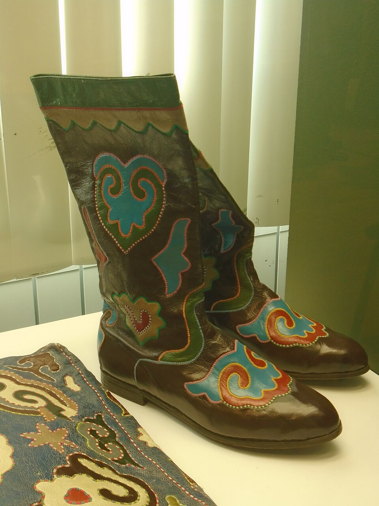
  > *Image: Vyacheslav Kirillin, CC BY-SA 4.0*

  - **[Leather Production](leather.md)** — Tanning hides into durable flexible material for drive belts, footwear, harness, and protective gear.
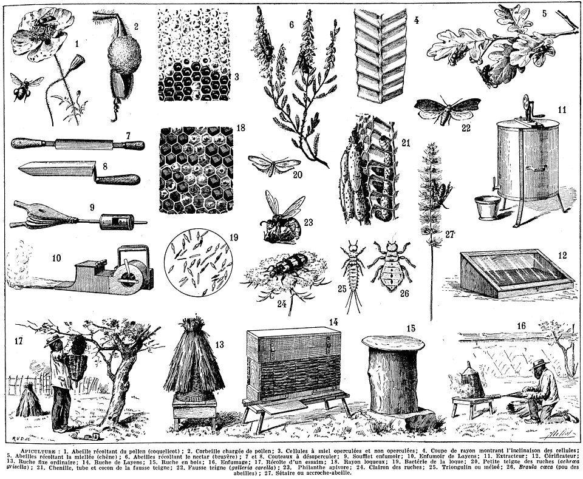
> *Image: EN NOIR &amp; BLANC, CC0*

- **[Beekeeping (Apiculture)](beekeeping.md)** — Log hives, skeps, honey extraction, beeswax, pollination services.
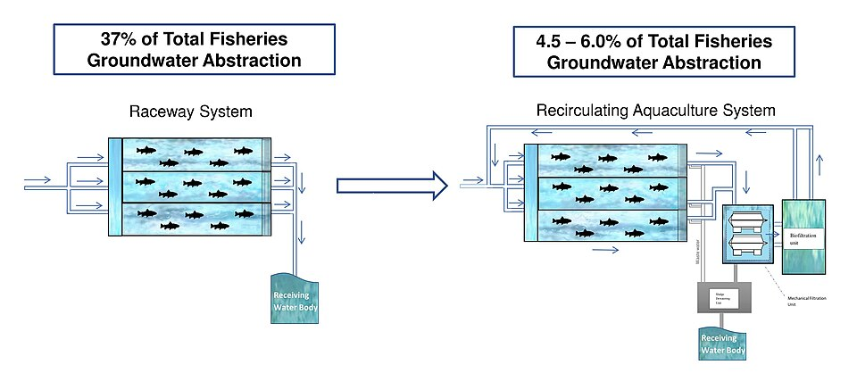
> *Image: Narek75, CC BY-SA 4.0*

- **[Aquaculture & Fisheries](aquaculture.md)** — Fish farming, pond construction, net making, fish processing.
<!-- TODO: source image for Sericulture -->
- **[Sericulture](sericulture.md)** — Silkworm rearing, cocoon processing, silk thread production.
<!-- TODO: source image for Pest Management -->
- **[Pest Management](pest-management.md)** — Biological pest control, guardian animals, integrated management.
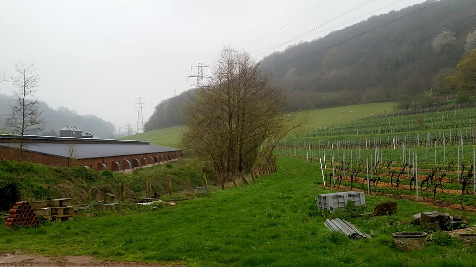
> *Image: Matthew T Rader, CC BY-SA 4.0*

- **[Poultry Farming](poultry.md)** — Chickens, quail, ducks, geese, turkeys, guinea fowl, pigeons. Eggs, meat, feathers, pest control.
  
  > *Image: Jonathan Billinger, CC BY-SA 2.0*

  - **[Chickens](poultry-chickens.md)** — Gateway livestock: eggs, meat, feathers, manure with modest infrastructure.
  
  > *Image: Jonathan Billinger, CC BY-SA 2.0*

  - **[Coturnix Quail](poultry-coturnix.md)** — Fastest-producing micro-livestock: eggs and meat in under two months from egg to table.
  
  > *Image: Jonathan Billinger, CC BY-SA 2.0*

  - **[Ducks](poultry-ducks.md)** — Hardy foragers thriving in wet environments; large eggs, meat, down, and pest control.
  
  > *Image: Jonathan Billinger, CC BY-SA 2.0*

  - **[Geese](poultry-geese.md)** — Largest poultry species; efficient pasture grazers, weeders, guardians, and down producers.
  
  > *Image: Jonathan Billinger, CC BY-SA 2.0*

  - **[Guinea Fowl](poultry-guinea-fowl.md)** — Unmatched tick and insect hunters with loud predator alarm calls.
  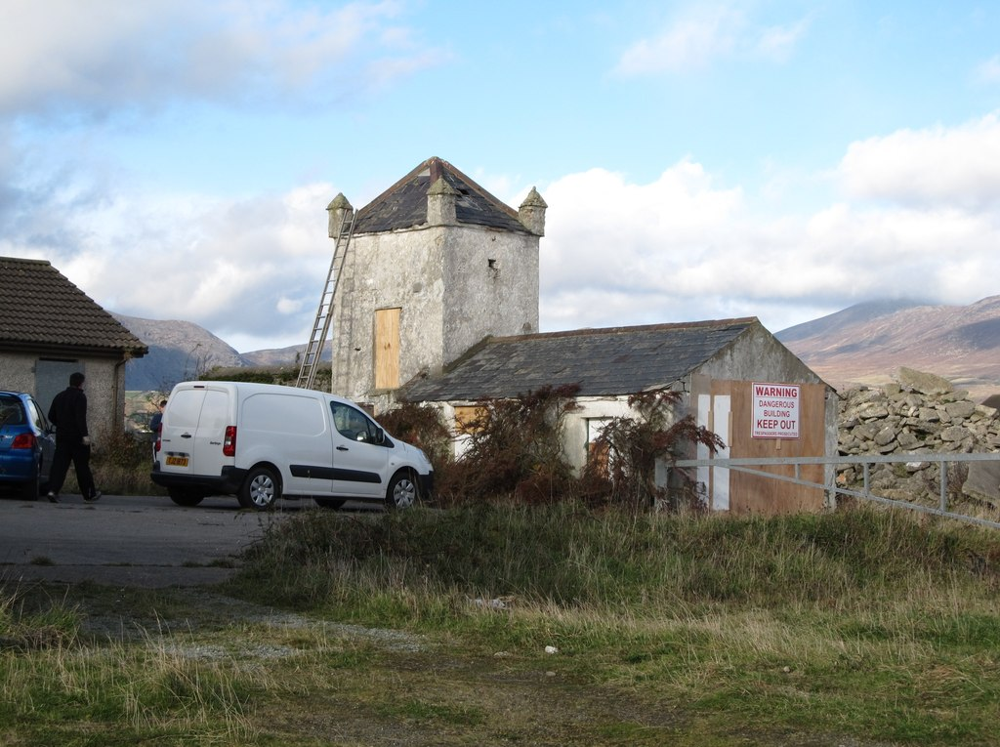
  > *Image: Eric Jones, CC BY-SA 2.0*

  - **[Pigeons](poultry-pigeons.md)** — Self-foraging squab producers and premium guano fertilizer source.
  
  > *Image: Jonathan Billinger, CC BY-SA 2.0*

  - **[Turkeys](poultry-turkeys.md)** — Largest meat bird; premium carcass with nitrogen-rich manure.
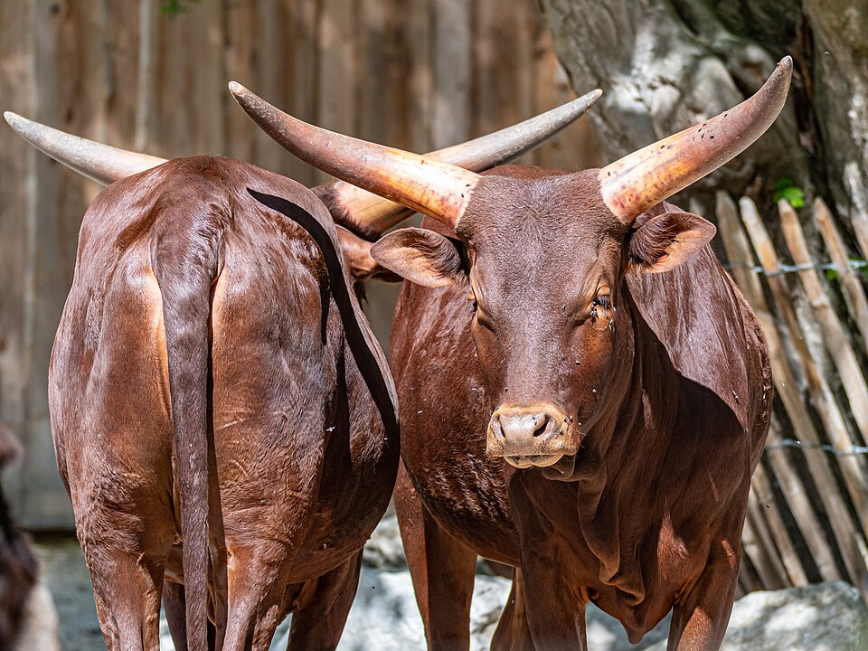
> *Image: Isiwal, CC BY-SA 4.0*

- **[Cattle Husbandry](cattle.md)** — Dairy, beef, draft power. Milk, tallow, leather, manure.
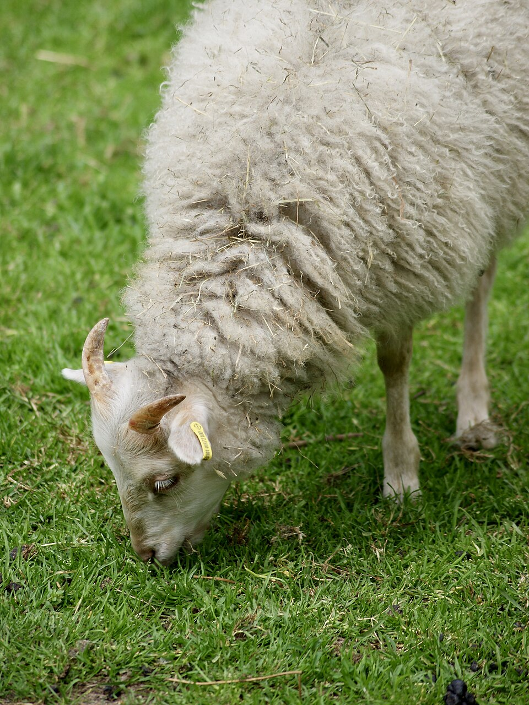
> *Image: Ggia, CC BY-SA 3.0*

- **[Sheep Husbandry](sheep.md)** — Wool, mutton, dairy. Fiber production, pasture management.
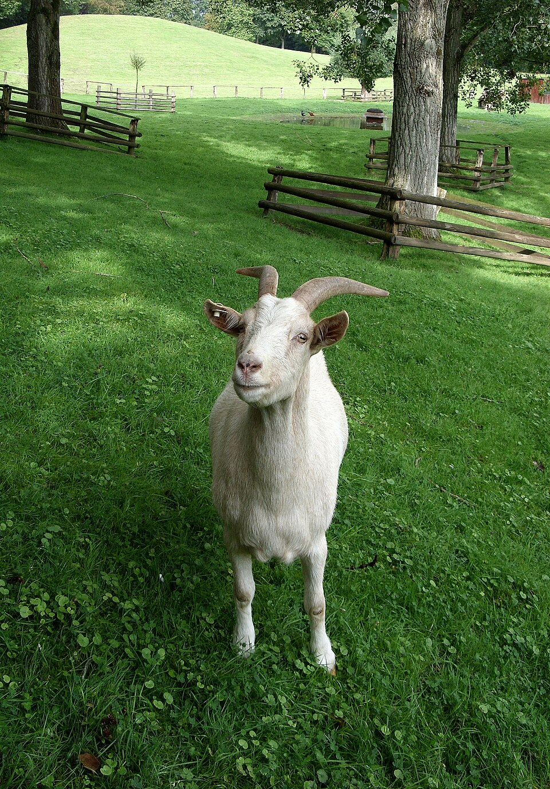
> *Image: Böhringer Friedrich, CC BY-SA 2.5*

- **[Goat Husbandry](goats.md)** — Dairy, meat, fiber, brush clearance. Browsers for land management.
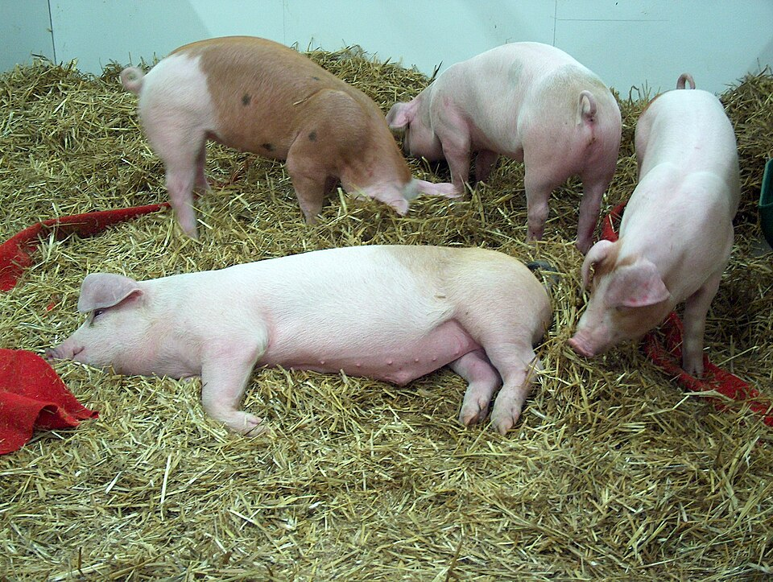
> *Image: Peter O'Connor aka anemoneprojectors, CC BY-SA 2.0*

- **[Pig Husbandry](pigs.md)** — Pork, lard, waste conversion. Omnivore forager.
<!-- TODO: source image for Equine Husbandry -->
- **[Equine Husbandry](equines.md)** — Horses and donkeys for draft, transport, pack.
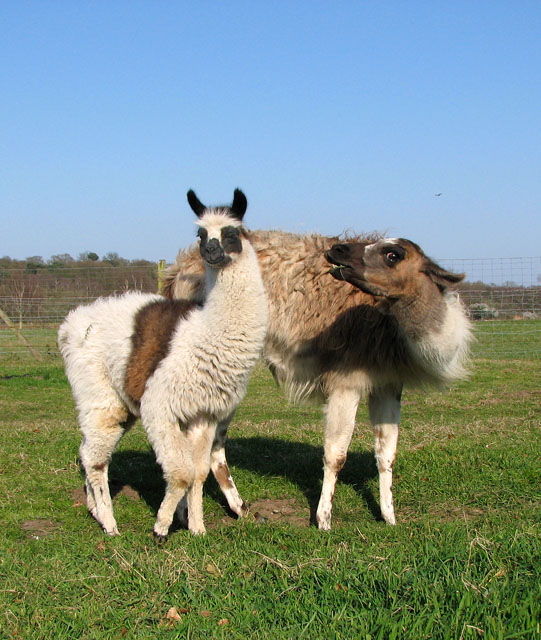
> *Image: Evelyn Simak, CC BY-SA 2.0*

- **[Camelid Husbandry](camelids.md)** — Alpacas and llamas for fiber, pack, guard duty.
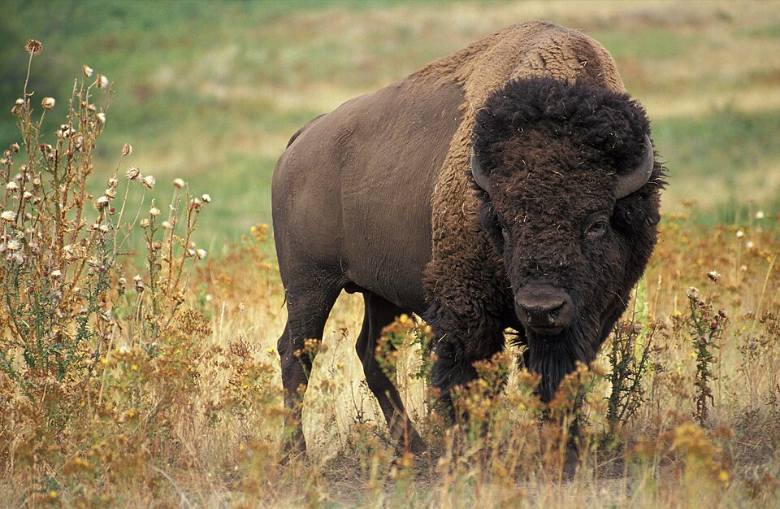
> *Image: Jack Dykinga, Public domain*

- **[Bison Husbandry](bison.md)** — American bison for meat, hardy grassland production.
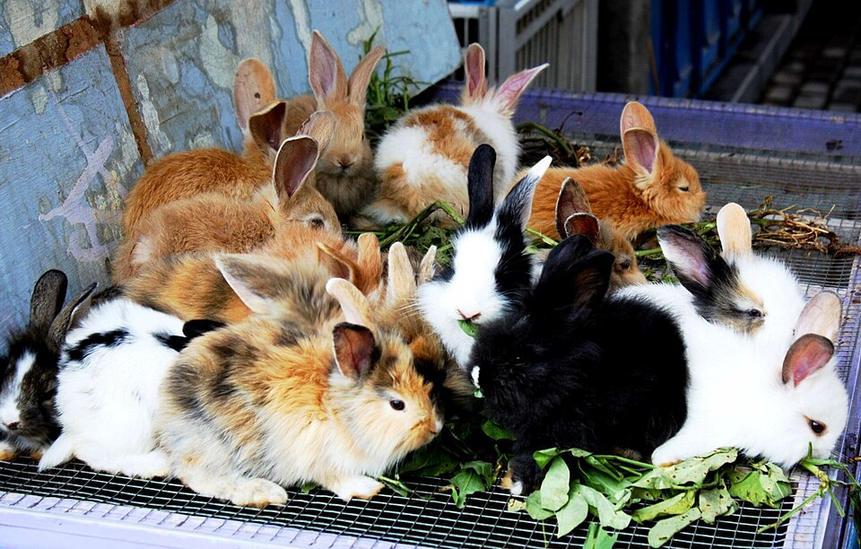
> *Image: DANIEL JULIE from Paris, France, CC BY 2.0*

- **[Rabbit Husbandry](rabbits.md)** — Meat, fur, Angora wool. Small-space livestock.
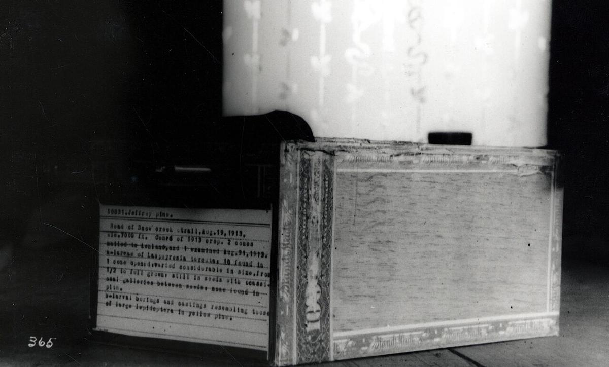
> *Image: U.S. Fish and Wildlife Service Southeast Region, Public domain*

- **[Insect Farming (BSF)](insect-farming.md)** — Black Soldier Fly larvae for protein feed, biowaste conversion.

[↑ Back to Tech Tree](../index.md)
