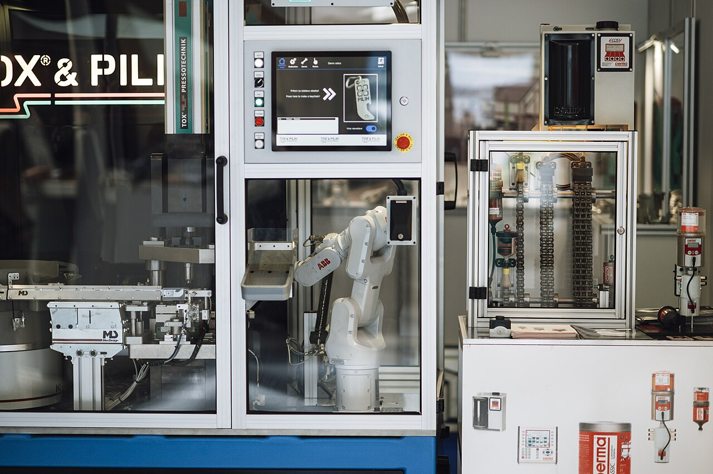

# Automation & Robotics

> *A robot arm uses precise movements to work on machinery inside a factory. Different machines and tools are visible in the workspace. The lighting shows a busy environment.*

> *Image: Shixart1985, CC BY 2.0*

Capabilities in this domain:

- [Equipment Communication](equipment-communication.md) — SECS-I/II, HSMS, GEM protocols for semiconductor equipment data exchange and control; message formatting, state models, and equipment integration.
- [Wafer Handling Robots](wafer-handling.md) — Cleanroom robots, end effectors, vacuum and edge-grip wafer pickup, atmospheric and vacuum load locks, and robot kinematics for wafer transfer.
- [Material Transport](material-transport.md) — FOUP (Front-Opening Unified Pod) handling, Automated Guided Vehicles (AGVs), Overhead Hoist Transport (OHT), rail-guided vehicles, and fab logistics coordination.
- [Process Control & Lot Tracking](process-control.md) — Recipe management, lot and wafer tracking, process sequencing, Fault Detection and Classification (FDC), and automated run-to-run control.

[↑ Back to Tech Tree](../index.md)
