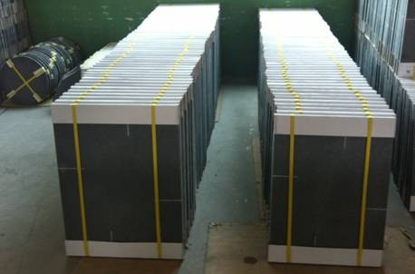
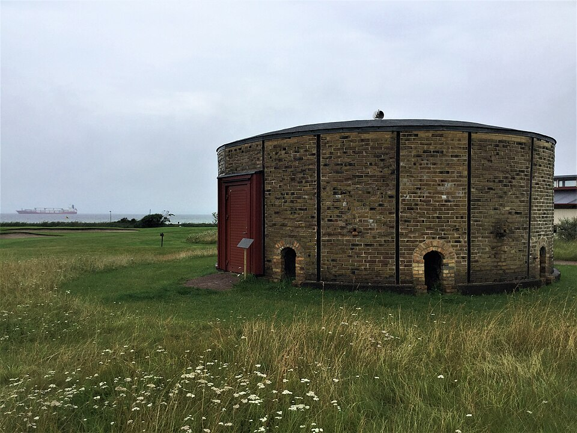
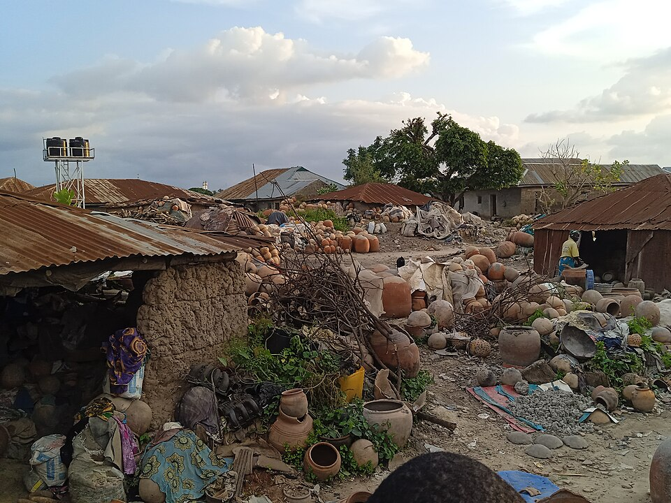
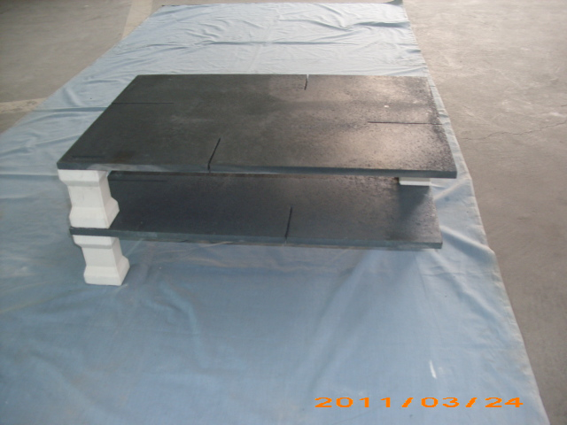
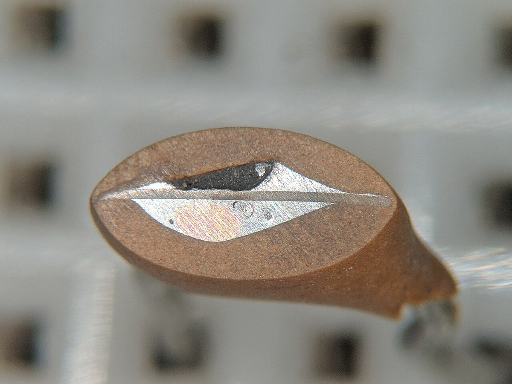
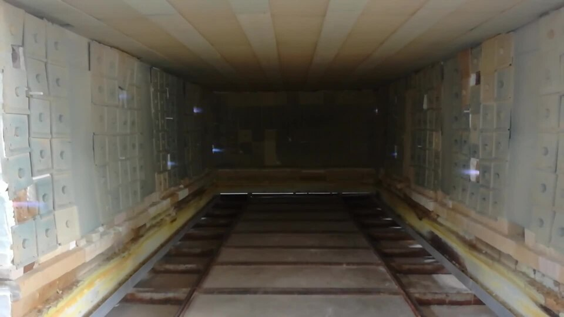

# Ceramics & Refractories

> *Image: Silar, CC BY-SA 4.0*

> *Diamond blades for cutting advanced ceramic materials*

> *Image: Vijesh Gogia, CC BY 4.0*

Capabilities in this domain:

> *Image: Chainwit., CC BY 4.0*

- [Kiln Construction](kilns.md) — Kiln construction: updraft, downdraft, and tunnel kilns for ceramic and lime firing.

> *Image: Daderot, CC0*

- [Lime Production](lime.md) — Lime production by calcining limestone at 900-1000°C for mortar, whitewash, plaster, and chemical feedstock.

> *Image: Silar, CC BY-SA 4.0*

- [Pottery & Clay Products](pottery.md) — Clay identification, processing, tempering, forming (pinch, coil, slab), and basic firing.

> *Image: Hassan7419, CC BY-SA 4.0*

- [Advanced Ceramics & Refractories](advanced-ceramics.md) — High-performance technical ceramics (alumina, zirconia, silicon carbide, silicon nitride) and refractory linings for high-temperature industrial processes.

> *Image: TubeTimeUS, CC BY-SA 4.0*

- [Electronic Ceramics](electronic-ceramics.md) — Functional ceramics for electronics: BaTiO₃ capacitors, ferrite inductors, PZT piezoelectric actuators, getter materials for vacuum maintenance, and ceramic substrates for IC packaging.

> *Image: Omakid, CC BY-SA 4.0*

- [Kiln Firing](kiln-firing.md) — Controlled kiln firing reaching 800-900°C for pottery and up to 1400°C for refractory ceramics.
<!-- TODO: source image for Ceramic & Refractory Recycling -->
- [Ceramic & Refractory Recycling](ceramic-recycling.md) — Reclamation of fired clay products, refractory bricks, and technical ceramics as grog, aggregate, or reprocessed refractory feedstock.

[↑ Back to Tech Tree](../index.md)
