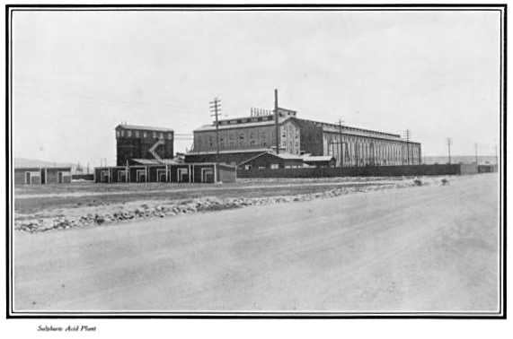

# Acid Regeneration

> **Node ID**: chemistry.acid-regeneration
> **Domain**: [Chemistry](./index.md)
> **Dependencies**: [`Electrodialysis`](electrodialysis.md)
> **Enables**: [`Primary Metal Forming`](../metals/forming.md)
> **Timeline**: Years 25-45
> **Outputs**: regenerated_acid
> **Critical**: No

## Overview

Membrane-based recovery and regeneration of spent acids from industrial processes. Uses diffusion dialysis and electrodialysis to separate acid from dissolved metal salts, enabling closed-loop acid usage in metal processing and chemical manufacturing.

Acid regeneration emerges in the industrial era once metal processing volumes create enough spent acid to justify recovery equipment. It depends on ion-exchange membrane technology (itself a product of polymer chemistry) and DC electrical power for electrodialysis modes. The capability closes the loop on pickling and etching operations, turning a hazardous waste stream back into a usable process input.

The regenerated acid output feeds directly back into pickling, etching, and surface treatment lines. Its quality determines whether downstream metal products meet surface preparation standards, making regeneration fidelity a process-critical parameter.

Acid regeneration addresses a fundamental waste problem in metal processing. Steel pickling dissolves surface oxide scale using hydrochloric or sulfuric acid. As the acid reacts, it accumulates dissolved iron, zinc, chromium, and other metals. Eventually the acid becomes too dilute and contaminated to function effectively. Without regeneration, this spent acid must be neutralized and disposed of as hazardous waste — consuming large quantities of neutralizing chemicals and generating enormous volumes of metal-laden sludge.

Membrane-based regeneration breaks this waste cycle. Rather than neutralizing the spent acid, the acid and dissolved metals are separated: the acid is recovered for reuse and the metals are concentrated for recovery. This reduces fresh acid consumption, eliminates most of the waste sludge, and recovers valuable metals as a byproduct. The economics improve further when the cost of hazardous waste disposal is factored in.

The two principal technologies are diffusion dialysis (passive, driven by concentration gradient) and electrodialysis (active, driven by electric field). Diffusion dialysis is simpler and cheaper to operate but slower and less complete. Electrodialysis is faster and more thorough but requires DC power and more complex membrane stacks. Many production systems combine both: diffusion dialysis for bulk recovery followed by electrodialysis for final polishing.

## Prerequisites

### Materials

- Chemicals — spent acid from pickling, etching, or metal processing operations
- Anion exchange membranes (for diffusion dialysis) or alternating CEM/AEM sets (for electrodialysis)
- Clean water for the dialysate stream and membrane rinsing
- Sodium hydroxide or hydrochloric acid for membrane cleaning solutions

### Equipment

- [Electrodialysis](electrodialysis.md) — tool dependency
- Pre-filtration system (cartridge filters or multimedia filters for suspended solids removal)
- Feed tanks, product tanks, and waste tanks with acid-resistant construction
- DC power supply with current and voltage control (for electrodialysis mode)
- Conductivity and pH instrumentation for process monitoring

### Knowledge

- Acid-base chemistry and metal ion speciation in aqueous solution (how Fe²⁺, Fe³⁺, Zn²⁺, Cr³⁺ behave at varying pH and concentration)
- Membrane transport mechanisms: Donnan exclusion, concentration-driven diffusion across anion exchange membranes, migration under electric field
- Titration and conductivity measurement techniques for tracking acid recovery percentage and metal rejection ratio
- Knowledge of acid-base chemistry and metal ion behavior in solution

### Infrastructure

- Enclosed workspace with corrosion-resistant ventilation rated for acid vapor (HCl fumes from hydrochloric pickling, SO₂ from sulfuric acid decomposition)
- Power supply matching equipment requirements — DC rectifier for electrodialysis mode
- Water supply and drainage where applicable — high-purity rinse water required for membrane maintenance
- Waste handling and disposal facilities for process outputs — metal-bearing waste streams require hazardous waste handling
- Acid-resistant flooring and secondary containment in all process areas
- Membrane storage conditions (humidity and temperature controlled) for replacement inventory

## Process Description

Acid regeneration separates the acid anion from dissolved metal cations using semi-permeable membranes. The driving force is either a concentration gradient (diffusion dialysis) or an applied electric field (electrodialysis). Both exploit the selectivity of ion exchange membranes: anion exchange membranes pass sulfate, chloride, and nitrate ions while rejecting metal cations like iron, zinc, and chromium.

The core mechanism relies on diffusion dialysis, where spent acid solution flows on one side of an anion exchange membrane while water flows on the other. Acid anions (sulfate, chloride, nitrate) migrate through the membrane driven by concentration gradient alone — no external electric field is required for diffusion dialysis. Dissolved metal cations are largely rejected by the anion membrane, producing a recovered acid stream and a metal-rich waste stream. For higher throughput or tighter separation, electrodialysis applies an electric field across alternating cation and anion exchange membranes to actively drive both anions and protons across while retaining metal salts.

### Step-by-Step Procedure

1. Collect spent acid from pickling, etching, or metal processing operations. Analyze composition — acid concentration, dissolved metal content, suspended solids, and any organic contaminants.
2. Pre-filter the spent acid through coarse then fine media to remove suspended solids and particulate contamination. Solids foul membrane surfaces and reduce mass transfer rates.
3. Feed the clarified spent acid to the diffusion dialysis stack. Acid flows counter-current to clean water on opposite sides of the anion exchange membranes. Residence time in the stack determines recovery percentage.
4. Collect the regenerated acid stream (lower concentration than fresh acid but free of most dissolved metals) and the metal-bearing waste stream separately.
5. If higher purity is required, route the regenerated acid through an electrodialysis polishing stage. Apply DC current across alternating cation/anion membrane pairs to drive residual metal ions out of the acid stream.
6. Blend regenerated acid with fresh acid to reach target concentration for reuse. Monitor blend ratio to ensure downstream process quality is maintained.
7. Treat the metal-bearing waste stream for metal recovery (precipitation, cementation, or electrowinning) before discharge or further processing.

### Process Parameters

| Parameter | Diffusion Dialysis | Electrodialysis | Notes |
|-----------|-------------------|-----------------|-------|
| Feed acid concentration | 1-6 M (HCl) or 1-4 M (H₂SO₄) | 0.5-5 M | Higher concentration improves driving force but increases membrane stress |
| Operating temperature | 15-35°C | 20-45°C | Membranes degrade above 50°C for most polymer types |
| Feed flow rate | 0.5-3 L/h per m² membrane | 5-20 L/h per m² membrane | Higher flow reduces residence time and recovery |
| Recovery rate | 70-90% acid recovery | 85-95% acid recovery | Depends on membrane area, feed concentration, and residence time |
| Metal rejection | 80-95% | 90-99% | Fe, Zn, Cr rejection depends on membrane type and feed pH |
| Current density (ED mode) | N/A | 10-50 mA/cm² | Limited by concentration polarization at membrane surface |
| Membrane pair voltage (ED) | N/A | 0.5-2.0 V per cell pair | Rising voltage at constant current signals fouling |
| Energy consumption (ED) | 0.5-1.0 kWh per kg acid recovered | 1.0-3.0 kWh per kg acid | Depends on feed composition and target purity |
| Membrane life | 2-5 years | 3-7 years | Shorter in high-metal or high-temperature service |
| Product acid purity | 80-90% of original concentration | 85-95% of original concentration | Blended with fresh acid to reach process specification |
| Acid flux (diffusion) | 0.5-2.0 mol/h per m² | N/A | Driven by concentration gradient alone |
| Water:feed ratio (diffusion) | 1:1 by volume | N/A | Counter-current flow maximizes driving force |

## Safety Considerations

Working with concentrated spent acid and membrane separation equipment involves hazards that are specific to the acid system being regenerated:

- **Chemical burns**: Concentrated acids cause severe burns on skin contact. Spent pickling acid (hydrochloric, sulfuric, or nitric mixtures) is particularly hazardous because dissolved metals add toxicity to the corrosive effect. Hydrochloric acid at >5 M concentration causes immediate skin damage and eye injury within seconds. Sulfuric acid above 4 M dehydrates tissue, causing deep, slow-healing burns. Emergency flushing: 15 minutes continuous water flush for skin contact; 30 minutes for eye contact. Polypropylene or PTFE pipework and valves are required for all acid-wetted surfaces.
- **Toxic gas inhalation**: Nitric acid regeneration can release nitrogen oxides (NO₂, IDLH 20 ppm, brown gas detectable by color at 5 ppm). Hydrochloric acid systems generate hydrogen chloride vapor (HCl, IDLH 50 ppm, pungent choking odor). Both require local exhaust ventilation at all process points, with minimum 10 air changes per hour in enclosed process areas. Install continuous gas monitors with audible alarms set at 5 ppm for NO₂ and 5 ppm for HCl.
- **Electrical hazards**: Electrodialysis units operate at substantial DC voltage across membrane stacks (typically 50-300 V, 10-100 A depending on stack size). Ensure all equipment is properly grounded and interlocked. Never service membrane stacks with power applied. Post grounding hooks near the power supply. Lockout/tagout required for all maintenance.
- **Membrane failure**: Damaged membranes can allow mixing of acid and waste streams, producing unexpected gas evolution or exothermic reactions. Monitor conductivity on both diluate and concentrate outlets continuously. A sudden conductivity change of >10% indicates a membrane breach. Automatic shutdown triggers at >20% conductivity deviation.
- **Environmental contamination**: Spent membranes and metal-bearing waste streams are classified hazardous waste. Metal concentrations in waste streams must be characterized before disposal: Fe and Zn >5 mg/L, Cr >0.5 mg/L, and Ni >1 mg/L require hazardous waste handling. Segregate and label all waste for proper treatment and disposal.

### Personal Protective Equipment

- Chemical splash goggles and face shield when handling acid or opening process equipment
- Acid-resistant gloves (nitrile or neoprene) rated for the acid type and concentration in use
- Chemical-resistant apron or coveralls when working near open process tanks
- Respiratory protection with acid gas cartridges when ventilation is insufficient
- Emergency eyewash and shower within 10 seconds travel distance from all acid handling points

### Emergency Procedures

- Neutralize small acid spills with sodium bicarbonate or lime. Do not use water alone on concentrated acid spills — the dilution heat can cause splashing.
- For membrane rupture, isolate the affected stack immediately and contain drainage in a secondary containment system.
- Maintain first aid kit rated for chemical burn treatment
- Know locations of emergency shutoffs for power and process fluid circulation

## Quality Control

### Acceptance Criteria

- **Regenerated Acid**: Must meet composition and performance specifications. Acid concentration must be within the target range for reuse in the originating process. Dissolved metal content must be below the threshold that affects downstream product quality.

### Testing Methods

- Titration to determine acid concentration (normality or weight percent)
- Conductivity measurement to estimate total dissolved solids and ionic content
- Inductively coupled plasma (ICP) spectroscopy or atomic absorption for dissolved metal quantification
- pH measurement of the regenerated acid blend to confirm target strength

### Sampling Protocol

- Validate the first batch of regenerated acid against the full reuse specification before returning it to the pickling or etching line
- Sample regenerated acid every production batch or at timed intervals for continuous processes
- Record all measurements for trend analysis — declining membrane performance shows as gradual increase in metal carryover
- Reject and investigate any out-of-specification results; do not blend off-spec acid into production supply

## Scaling Notes

Scaling acid regeneration from laboratory membrane cells to production-scale membrane stacks follows a predictable progression:

- **Bench scale**: Small membrane cell (single membrane pair), batch operation. Output for proof-of-concept and membrane selection testing. Processes liters per day of spent acid.
- **Pilot scale**: Multi-membrane stack (10-50 cell pairs), semi-continuous flow. Validates membrane fouling behavior and long-term performance. Processes tens to hundreds of liters per day.
- **Production scale**: Multiple membrane stacks in parallel, continuous operation with automated monitoring and control. Processes cubic meters per day. Membrane replacement on 2-5 year cycles depending on feed contamination.

Key scaling challenges: membrane fouling from organic contaminants or precipitated salts increases with feed complexity. Pre-treatment requirements (filtration, pH adjustment, temperature control) scale nonlinearly. Membrane stack hydraulic design must ensure uniform flow distribution across all cell pairs to prevent channeling and dead zones.

## Troubleshooting

| Problem | Probable Cause | Solution |
|---------|---------------|----------|
| Acid recovery below 70% | Membrane fouling, insufficient residence time, or feed too dilute (<1 M) | Clean membranes with 2% NaOH for organic fouling or 5% HCl for scaling; increase stack height or reduce flow rate to increase residence time; pre-concentrate dilute feeds |
| Metal carryover >10% in product | Membrane pinhole damage or membrane type too permeable for the metal ion size | Pressure-test stack at 0.5 bar to locate leaks; replace damaged membranes; switch to tighter-rejection membrane (e.g., Neosepta ACM for Fe/HCl systems) |
| Declining flux rate over days | Scaling (CaSO₄, Fe₂(SO₄)₃) or precipitate on membrane surface from pH change | Acid wash stack with 3-5% HCl at 30°C for 2 hours; improve feed pre-filtration to 1-5 μm; adjust feed pH to keep metals in solution |
| High energy consumption (ED mode, >5 kWh/kg acid) | Excessive voltage drop from membrane fouling or electrode scaling | Clean electrodes and membranes; verify electrode rinse flow (minimum 2 L/min); check for gas bubble accumulation in electrode chambers |
| Uneven flow distribution between cells | Blocked flow channels from particulate or gasket degradation | Disassemble stack, clean channels with soft brush; replace compressed or torn gaskets; verify spacer alignment during reassembly |
| Product acid concentration too low for reuse | Feed acid too dilute or water:feed ratio too high (diffusion dialysis) | Pre-concentrate feed by evaporation; reduce dialysate water flow relative to feed; add second diffusion stage in series |
| Spent membranes discolored (brown/yellow) | Organic contamination from degreasing residues or polymer degradation | Pre-filter feed through activated carbon to remove organics; replace membranes if discoloration persists after cleaning |
| Stack leaks at gaskets | Gasket compression loss or chemical attack on gasket material | Re-torque stack bolts in cross-pattern to specification; replace nitrile gaskets with EPDM or PTFE-encapsulated gaskets for acid service |
| pH of regenerated acid drifts upward during storage | Dissolved metals slowly hydrolyzing, consuming H⁺ ions | Use regenerated acid within 48 hours or re-acidify with fresh acid; store in glass-lined or polypropylene tanks, not bare steel |

## Variations and Alternatives

- **Diffusion dialysis**: Passive process driven by concentration gradient. No external power required for the separation itself. Lower throughput but lower operating cost. Best for spent acids with moderate metal loading.
- **Electrodialysis**: Active separation using DC electric field. Higher throughput and better separation than diffusion dialysis. Higher energy cost but can handle a wider range of feed compositions.
- **Bipolar membrane electrodialysis**: Uses bipolar membranes to split water into H⁺ and OH⁻ ions, directly regenerating acid and base from the salt solution without electrode reactions. Higher complexity but can regenerate both acid and base simultaneously.
- **Acid retardation (resin-based)**: Uses ion exchange resins that preferentially adsorb acid over metal salts. Simpler equipment than membrane systems but resin life is limited and regeneration chemicals are consumed.

The choice between these technologies depends on the specific acid/metal system, throughput requirements, and available infrastructure. For hydrochloric acid from steel pickling, diffusion dialysis is the most cost-effective at moderate volumes. For mixed acid systems (nitric/hydrofluoric from stainless steel pickling), electrodialysis provides the selectivity needed to recover both acids separately. For applications where both acid and base recovery are needed, bipolar membrane electrodialysis is the only option that avoids consuming additional chemicals in the regeneration process.

For very small operations where membrane equipment is not justified, simply neutralizing spent acid with lime and recovering the metal hydroxide precipitate may be the most practical approach. This does not regenerate the acid, but it does recover the metals and produces a solid waste that is easier to handle than liquid acid waste. The neutralization product (calcium sulfate from sulfuric acid neutralization, or calcium chloride from hydrochloric acid) has limited commercial value but can be used in construction.

## References

- [Chemistry](index.md) — parent capability
- [Chemistry Domain](./index.md) — domain overview and related capabilities
- [Electrodialysis](electrodialysis.md) — upstream dependency (tool)
- [Primary Metal Forming](../metals/forming.md) — downstream capability

The references above link to related capabilities in the tech tree. The acid regeneration capability depends on electrodialysis technology for the membrane separation equipment and is itself a dependency for primary metal forming, which requires pickling acids for surface preparation of formed metal products.

Without acid regeneration, metal processing operations must continually consume fresh acid and generate large volumes of hazardous waste. The closed-loop approach enabled by membrane separation significantly reduces both operating costs and environmental impact, making it a key sustainability technology for any industrial civilization.

The economic viability of acid regeneration depends on the scale of the consuming process and the cost of fresh acid versus waste disposal. At small scale (workshop-level metal finishing), regeneration may not justify the membrane equipment investment. At industrial scale (continuous steel pickling lines producing tonnes of spent acid per day), regeneration is almost always economically favorable, with payback periods typically under two years.

Membrane selection is critical to system performance. Different membrane materials have different selectivities for acid anions versus metal cations, different chemical resistance to specific acids, and different operating temperature ranges. For hydrochloric acid recovery, standard anion exchange membranes work well. For sulfuric acid, which can damage some polymer chemistries at high concentration, more chemically resistant membrane materials are required. For mixed acid systems (nitric-hydrofluoric from stainless steel pickling), membrane compatibility with both acids simultaneously must be verified. The membrane manufacturer's chemical compatibility data should always be checked against the specific feed composition before committing to a membrane type.

Diffusion dialysis systems have no moving parts in the separation zone — the driving force is purely the concentration gradient between the spent acid and the clean water. This simplicity makes diffusion dialysis highly reliable and energy-efficient (only the feed pumps consume power). The tradeoff is low throughput per unit membrane area, requiring large membrane stacks for high-volume applications. A typical diffusion dialysis installation processes spent acid at a rate of liters per hour per square meter of membrane area. Electrodialysis, by contrast, can achieve much higher throughput per unit area because the electric field actively drives ion transport, but at the cost of DC power consumption and more complex system controls.

For a civilization bootstrapping its chemical industry, acid regeneration is not the first priority — it becomes economically important only when metal processing reaches a scale where acid consumption and waste disposal are significant cost centers. At smaller scales, simply using fresh acid and neutralizing the waste is adequate. But as steel production, electroplating, and surface treatment grow, the waste volumes become unmanageable without regeneration. This capability therefore typically appears in the mid-to-late industrial development phase, alongside other waste minimization and resource recovery technologies.

The quality of regenerated acid is measured primarily by two parameters: acid concentration (how much of the original acid strength has been recovered) and metal content (how completely the dissolved metals have been removed). In most applications, regenerated acid at 80-90% of the original concentration with >90% metal removal is adequate for reuse when blended with fresh acid. Higher purity regeneration is possible but requires more membrane area or more electrodialysis stages, increasing both capital and operating costs.

### Material Handling

Handling spent acid, regenerated acid, and ion exchange membranes each requires specific practices to maintain process integrity and membrane life:

- Store ion exchange membranes in sealed bags with process solution to prevent drying, which permanently damages the polymer structure
- Track spent acid composition batch by batch; variations in metal loading and contamination profile affect membrane fouling rates
- Keep regenerated acid in corrosion-resistant containers (polyethylene, polypropylene, or glass-lined steel), never bare steel or copper
- Maintain a membrane performance log recording recovery rate and metal rejection per batch; declining trends signal when cleaning or replacement is due
- Route metal-bearing waste streams to metal recovery (precipitation, cementation) before discharge; do not commingle with non-hazardous waste
- Pre-filter all spent acid through 5-10 µm cartridge filters before the membrane stack; suspended particles abrade membrane surfaces and block flow channels

Spent acid handling requires particular attention. The composition of spent acid varies with each batch — different metal types, different acid concentrations, different contamination profiles. Batch characterization before feeding to the regeneration system prevents membrane fouling from unexpected contaminants. Silicone oils, organic degreasing residues, and suspended metal particles are common fouling agents that must be removed by pre-filtration.

Regenerated acid should be stored in corrosion-resistant containers (polyethylene, polypropylene, or glass-lined steel). Metal containers leach ions into the acid, undoing the purification. Label regenerated acid clearly to distinguish it from fresh acid — it may have a lower concentration that requires blending adjustment before reuse.

Spent membranes from the regeneration system contain absorbed metals and acid residues. Handle as hazardous waste during disposal. Some membrane types can be regenerated by chemical cleaning (acid wash followed by alkali wash), extending their useful life. Track membrane performance over time — when the recovery rate drops below the economic threshold despite cleaning, the membranes must be replaced. The membrane replacement cycle is typically 2-5 years depending on feed contamination and operating conditions.

---
*Part of the [Bootciv Tech Tree](../index.md) · [Chemistry](./index.md) · [All Domains](../index.md)*

