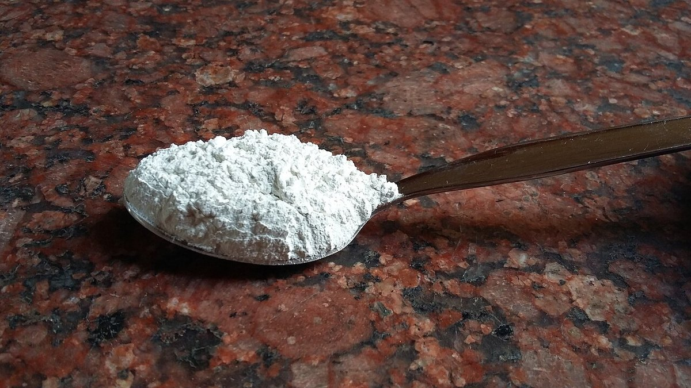

# Bleaching & Chlorine Chemistry

> **Node ID**: chemistry.bleaching
> **Domain**: [Chemistry](./index.md)
> **Dependencies**: [`Textiles, Fiber & Cordage`](../textiles/index.md), [`Basic Water Treatment`](../water/basic-treatment.md)
> **Enables**: [`Electrolysis`](electrolysis.md)
> **Timeline**: Years 15-25
> **Outputs**: sodium-hypochlorite, chlorine-gas, bleached-textiles
> **Critical**: No

## Overview

> *"Bibliographical notes": p. xvii-xviii*

> *Image: Arthur Herbert Church, Public domain*

Electrolytic production of chlorine and sodium hypochlorite for textile bleaching, water treatment, and pulp processing.

Bleaching enters the industrial timeline once brine electrolysis produces chlorine gas and caustic soda in usable quantities. The chemistry converts salt and electricity into sodium hypochlorite, an oxidizing agent that destroys chromophores in textile fibers and kills microorganisms in drinking water. Before electrochemical chlorine, textile whitening relied on months of sun exposure or sour milk treatment.

The three outputs, sodium hypochlorite solution, chlorine gas, and bleached textiles, each serve distinct downstream chains: hypochlorite for water disinfection and household use, chlorine gas for PVC synthesis and pulp processing, and bleached cloth as the base for dyeing and finishing.

Chlorine chemistry begins with passing an electric current through brine (concentrated sodium chloride solution). At the anode, chloride ions oxidize to chlorine gas. At the cathode, water reduces to hydrogen and hydroxide ions. The chlorine can be collected directly as a gas, or absorbed into cold sodium hydroxide solution to produce sodium hypochlorite (bleach). Before electrochemical methods, textile bleaching relied on sunlight exposure (crofting) or sour milk treatment — processes taking weeks. Chlorine-based bleaching reduced textile processing time from weeks to hours, transforming the textile industry.

Sodium hypochlorite solutions are unstable over time, decomposing to sodium chloride and oxygen. This decomposition accelerates with heat, light, and heavy metal contamination. Production must therefore be matched to consumption, and storage conditions must be cool, dark, and in non-metallic containers.

Beyond textile bleaching, chlorine chemistry is foundational to water treatment, pulp and paper processing, and the synthesis of numerous chlorinated compounds including PVC plastic. The ability to produce chlorine on demand from salt and electricity is one of the key enabling technologies of industrial chemistry. Chlorine gas is also used directly for water disinfection — bubbling chlorine through drinking water kills bacteria and viruses, making water safe for consumption. This single application has prevented more disease than perhaps any other chemical technology.

The hypochlorite bleaching mechanism involves oxidation of colored organic compounds (chromophores) in the textile fibers. The hypochlorite ion breaks double bonds in the conjugated ring structures that absorb visible light, converting them to colorless fragments. The challenge is controlling the oxidation to affect only the unwanted chromophores without degrading the cellulose polymer chains that give the fiber its strength. Over-bleaching produces oxycellulose — weakened, brittle fiber that fails in use.

## Prerequisites

### Materials

- Chemicals — sodium chloride (purified salt), sodium hydroxide, water
- Electrolysis cell (undivided for hypochlorite, or membrane cell for chlorine + caustic)
- Drying tower (concentrated sulfuric acid for chlorine drying)
- Absorption column (for chlorine-to-hypochlorite conversion)

### Equipment

- [Textiles, Fiber & Cordage](../textiles/index.md) — material dependency
- [Basic Water Treatment](../water/basic-treatment.md) — material dependency
- DC power supply for electrolysis
- Gas collection and handling system for chlorine
- Fabric processing equipment (padder, jig, or winch for textile bleaching)

### Knowledge

- Brine electrolysis fundamentals: how chloride oxidizes at the anode to Cl₂ and water reduces at the cathode to H₂ and OH⁻
- Oxidative bleaching chemistry: how hypochlorite ion breaks conjugated double bonds in natural chromophores (lignin, melanin, carotenoids) without attacking cellulose polymer chains
- Iodometric titration for measuring available chlorine and spectrophotometric whiteness testing for fabric quality

### Infrastructure

- Workspace with ventilation appropriate to the process — chlorine gas handling requires forced ventilation with gas detection
- Power supply matching equipment requirements — DC power supply for electrolysis cells
- Water supply and drainage where applicable — clean water for brine preparation and fabric rinsing
- Waste handling and disposal facilities for process outputs — chlorinated waste streams require special treatment

## Process Description

Bleaching starts with brine electrolysis to generate chlorine, followed by either direct chlorine absorption into cold NaOH (for hypochlorite) or separate collection of the gas and caustic streams. The textile bleaching step applies dilute hypochlorite to pre-scoured fabric under controlled pH and temperature.

### Step-by-Step Procedure

1. Prepare saturated brine solution by dissolving purified salt in water. Remove calcium and magnesium impurities by precipitation with sodium carbonate and sodium hydroxide — these hardness ions form scale on electrodes and membranes.
2. Electrolyze the purified brine in an undivided cell for hypochlorite production, or a membrane cell for separate chlorine and caustic production. Monitor cell voltage and current density throughout the run.
3. For chlorine gas production: collect the anode gas through a drying tower filled with concentrated sulfuric acid to remove moisture. Store dry chlorine under slight positive pressure in steel cylinders or feed directly to consuming processes.
4. For sodium hypochlorite production: absorb chlorine gas into cooled sodium hydroxide solution (below 40°C to prevent chlorate formation). The reaction is exothermic — cooling capacity must match the chlorine feed rate.
5. For textile bleaching: dilute sodium hypochlorite to working concentration. Immerse pre-scoured fabric in the bleach solution at controlled temperature and pH. Rinse thoroughly after bleaching, then treat with an antichlor (sodium bisulfite) to neutralize residual chlorine.
6. Test the bleached fabric for whiteness index and tensile strength. Over-bleaching degrades cellulose fibers, reducing fabric strength.

### Process Parameters

| Parameter | Range | Notes |
|-----------|-------|-------|
| Brine concentration | 250-320 g/L NaCl (near-saturated at 20°C) | Lower concentrations reduce current efficiency and increase energy per kg of chlorine |
| Cell current density | 15-30 mA/cm² (diaphragm cell), 20-40 mA/cm² (membrane cell) | Higher density increases production rate but also heat generation and electrode wear |
| Cell voltage | 3.0-4.5 V per cell | Operating above 5 V wastes energy as heat and accelerates electrode degradation |
| Bleach absorption temperature | Below 40°C (optimal 15-25°C) | Above 40°C, sodium chlorate (NaClO₃) forms as an unwanted byproduct, reducing hypochlorite yield |
| Textile bleach concentration | 2-5 g/L available chlorine | Higher concentrations attack cellulose; lower concentrations require longer contact time |
| Textile bleach pH | 9-11 (alkaline) | Below pH 9, chlorine gas evolves; above pH 11, bleaching is too slow |
| Bleach contact time | 30 minutes to 4 hours | Cotton: 1-2 hours at 3-5 g/L; linen: 2-4 hours at 2-3 g/L |
| Bleach temperature (textile) | 20-40°C | Above 45°C, cellulose oxidation accelerates, weakening the fabric |
| NaOH absorption solution strength | 5-10% NaOH by weight | Stronger solutions produce more concentrated bleach but increase heat release |
| Hypochlorite shelf life | 10-20% loss per month at 25°C | Store at 15°C: loss drops to 3-5% per month; at 35°C: loss exceeds 30% per month |
| Chlorine gas moisture content | <50 ppm H₂O | Moist chlorine corrodes steel; dry chlorine can be stored in steel cylinders |
| Hydrogen gas generation | ~0.37 L per ampere-hour (cathode) | Must be vented; flammable at 4-75% concentration in air |

## Safety Considerations

Chlorine gas and concentrated hypochlorite present hazards that demand specific precautions beyond general chemical safety:

- **Chlorine gas toxicity**: Chlorine is a severe respiratory irritant. At 1 ppm, chlorine causes detectable odor and mild irritation. At 10 ppm, it causes intense coughing and chest pain. At 430 ppm for 30 minutes, it is lethal. IDLH: 10 ppm. All chlorine handling must occur under forced ventilation with gas detection alarms set at 0.5 ppm (TLV-TWA). Chlorine is 2.5× denser than air and accumulates in low-lying areas (trenches, basements, sumps). Evacuate upwind if a leak occurs.
- **Chemical burns**: Sodium hypochlorite at household concentration (5-6% available chlorine) causes skin irritation within minutes. Industrial bleach (12-15%) causes immediate skin damage and eye injury. Sodium hydroxide solutions (used in chlorine absorption) at 5-10% cause deep chemical burns. Emergency flushing: 15 minutes continuous water for skin contact, 30 minutes for eye contact. Polypropylene or PVC pipework for all bleach-wetted surfaces (metals corrode rapidly).
- **Hazardous gas mixtures**: Mixing bleach with acid (HCl, H₂SO₄, toilet bowl cleaners, rust removers) releases chlorine gas: NaClO + 2HCl → NaCl + H₂O + Cl₂. Mixing bleach with ammonia (glass cleaners, some detergents) produces chloramine gas (NH₂Cl): NaClO + NH₃ → NH₂Cl + NaOH. Chloramine causes respiratory distress at 5 ppm and pulmonary edema at higher concentrations. Both scenarios have caused fatalities. Never store bleach and acid in the same area. Clear labeling is mandatory.
- **Fire and explosion risks**: Hydrogen gas produced at the cathode during electrolysis is flammable and explosive when mixed with air (LEL 4%, UEL 75%). At 20 A current, hydrogen generation is approximately 7.4 L/hour. Ensure adequate ventilation of electrolysis areas (minimum 10 air changes per hour) and never allow hydrogen to accumulate. Install hydrogen detectors with alarms at 1% (25% of LEL).

### Personal Protective Equipment

- Chemical splash goggles and face shield for all bleach and chlorine handling
- Rubber gloves (natural rubber or neoprene) resistant to hypochlorite and caustic solutions
- Chemical-resistant apron and boots in production areas
- Self-contained breathing apparatus (SCBA) for emergency chlorine leak response
- Chlorine gas mask with appropriate canister as minimum protection in chlorine areas

### Emergency Procedures

- For chlorine leaks: evacuate upwind, isolate the source if safe to do so. Chlorine is heavier than air and accumulates in low-lying areas.
- For skin contact with bleach: flush with copious water for 15 minutes. Remove contaminated clothing.
- Maintain chlorine leak detectors with audible alarms in all chlorine storage and use areas
- Train all personnel on the incompatibility of bleach with acids and ammonia

## Quality Control

### Acceptance Criteria

- **Sodium Hypochlorite**: Must meet concentration specification (typically expressed as available chlorine percentage). Solution must be clear with minimal suspended solids. pH must be alkaline to prevent decomposition.
- **Chlorine Gas**: Must be dry (moisture below specification) to prevent corrosion of steel cylinders and piping. Purity above specification (nitrogen, oxygen, and hydrogen are the main impurities).
- **Bleached Textiles**: Whiteness index must meet specification. Tensile strength retention must be above minimum (over-bleaching degrades cellulose). No yellowing or uneven bleaching (streaks indicate non-uniform exposure).

### Testing Methods

- Iodometric titration for available chlorine content in bleach solutions
- Gas analysis (absorption or chromatographic methods) for chlorine purity
- Spectrophotometric whiteness measurement for bleached textiles
- Tensile testing of fabric strips before and after bleaching to quantify strength loss

### Sampling Protocol

- Test bleach concentration at production start and periodically during storage (decomposition monitoring)
- Analyze chlorine gas purity at compressor discharge
- Test textile whiteness and strength from each batch of processed fabric

## Scaling Notes

Scaling from a beaker-sized electrolysis cell to a production bleach plant follows these stages:

- **Bench scale**: Small electrolysis cell (beaker-scale), manual chlorine absorption into NaOH solution. Produces enough bleach for laboratory testing and small fabric samples.
- **Pilot scale**: Bench electrolysis cell with gas collection and absorption column. Produces liters of bleach per day. Validates electrode materials and brine purification requirements.
- **Production scale**: Industrial membrane or diaphragm electrolysis cells, continuous chlorine absorption tower, automated fabric processing line. Produces tonnes of chlorine and bleach per day.

Key scaling challenges: electrode durability under continuous high-current operation, brine purification at scale (hardness removal becomes a significant chemical processing step), and safe handling of large chlorine inventories. Textile bleaching lines must maintain consistent fabric speed and bleach bath concentration to avoid streaky or uneven whitening.

## Troubleshooting

| Problem | Probable Cause | Solution |
|---------|---------------|----------|
| Low chlorine production (current efficiency <80%) | Spent electrodes (anode coating consumed), impure brine (Ca/Mg scale on electrodes), or cell voltage too low | Clean or replace anodes (titanium/RuO₂ coating, life 2-5 years); purify brine feed (precipitate Ca with Na₂CO₃ at 2 g/L, Mg with NaOH at 1 g/L, then filter to <5 ppm hardness); increase cell voltage to 3.5-4.5 V |
| Bleach decomposition in storage (>20% available chlorine loss per month) | Storage temperature >25°C, exposure to sunlight, metal contamination (Cu, Fe, Ni catalyze decomposition) | Store in cool, dark location at 15°C in polyethylene containers; avoid all metal contact (use plastic or glass only); test available chlorine weekly with iodometric titration |
| Fabric damage after bleaching (tensile strength loss >15%) | Over-bleaching: concentration too high (>5 g/L), temperature too high (>40°C), or contact time too long | Reduce available chlorine to 2-3 g/L; maintain pH 9-11; limit contact to 1-2 hours for cotton; test fabric tensile strength before and after each batch |
| Chlorine gas leak (detected by odor or monitor) | Corroded steel fittings, failed gasket on cylinder valve, or overpressure in absorption column | Evacuate upwind immediately; don SCBA before approaching; isolate leak by closing cylinder valve; check all connections with ammonia torch test (white NH₄Cl smoke indicates Cl₂) |
| Yellowing of bleached fabric after rinsing | Residual iron (Fe²⁺/Fe³⁺) in process water, incomplete rinsing, or insufficient scouring before bleach | Improve pre-scouring (boil in 2% NaOH for 1 hour); add chelating agent (EDTA, 0.5-1.0 g/L) to bleach bath; increase rinse cycles to 3× with clean water; test process water for Fe content (<0.1 ppm required) |
| Sodium chlorate formation reducing bleach yield | Absorption temperature above 40°C during chlorine-to-hypochlorite conversion | Install cooling on absorption column (target 15-25°C outlet); verify NaOH feed concentration (5-10%); monitor chlorate levels (should be <1% of hypochlorite) |
| Electrolysis cell voltage rising above 5 V | Electrode fouling from hardness scale, membrane fouling (diaphragm/membran cells), or brine impurities | Clean electrodes with 5% HCl to remove scale; replace diaphragm if clogged; improve brine purification; check electrolyte temperature (higher temp lowers voltage) |
| Hypochlorite solution pH drops below 9 during storage | CO₂ absorption from air neutralizes NaOH buffer, or decomposition produces acidic byproducts | Store in sealed containers with minimum headspace; check pH weekly (target 11-13); discard if pH drops below 10 (chlorine gas evolution risk) |
| Uneven bleaching (streaks on fabric) | Non-uniform fabric speed through bleach bath, inconsistent scouring leaving hydrophobic spots, or variable bleach concentration | Standardize fabric speed (continuous process: 10-30 m/min); verify complete scouring before bleaching (fabric should absorb water uniformly); check bleach bath concentration every 30 minutes |

## Variations and Alternatives

- **Hydrogen peroxide bleaching**: For textiles and pulp, peroxide is less aggressive than chlorine bleach and does not produce chlorinated organic byproducts. Requires stabilizers to prevent premature decomposition.
- **Ozone bleaching**: Ozone gas as a bleaching agent for pulp. No liquid waste stream, but ozone must be generated on-site from air or oxygen using corona discharge.
- **Reduction bleaching (hydrosulfite)**: Used for specific dyes and stains resistant to oxidative bleaching. Sodium hydrosulfite provides reducing rather than oxidizing conditions.
- **Chlorine dioxide bleaching**: For pulp processing, ClO₂ is more selective than elemental chlorine, producing fewer chlorinated organic compounds. Generated on-site by reducing sodium chlorate.

Each bleaching method has distinct environmental and product quality tradeoffs. Elemental chlorine bleaching produces chlorinated organic byproducts (dioxins, furans, chloroform) that are persistent environmental pollutants. This is the main driver toward chlorine dioxide, peroxide, and ozone bleaching in modern pulp mills. For textile bleaching, hypochlorite remains common but peroxide is preferred for cotton because it causes less fiber damage and produces no chlorinated residues.

## References

- [Chemistry](index.md) — parent capability
- [Chemistry Domain](./index.md) — domain overview and related capabilities
- [Textiles, Fiber & Cordage](../textiles/index.md) — upstream dependency (material)
- [Basic Water Treatment](../water/basic-treatment.md) — upstream dependency (material)
- [Electrolysis](electrolysis.md) — downstream capability

The bleaching capability sits between raw textile production and advanced electrolysis. Textile fibers come from the textiles domain, clean water from water treatment, and the electrolysis capability enables the electrochemical chlorine production that replaces older chemical bleaching methods.

Bleaching chemistry also connects to water treatment and public health. The same sodium hypochlorite used for textile bleaching is the most common drinking water disinfectant worldwide. Small-scale hypochlorite production (from solar-powered electrolysis of brine) provides safe drinking water in off-grid communities, making this capability directly relevant to the water treatment infrastructure chain.

The environmental impact of chlorine bleaching has driven significant innovation in the pulp and paper industry. Elemental chlorine produces chlorinated dioxins and furans as byproducts, which are persistent organic pollutants. Modern mills use elemental chlorine free (ECF) or totally chlorine free (TCF) bleaching sequences, relying on chlorine dioxide, hydrogen peroxide, and ozone instead. For a bootstrapping civilization, the tradeoff is between the simplicity of hypochlorite bleaching and the environmental consequences of chlorinated waste discharge.

The economics of chlorine production are dominated by electricity cost, since the process is essentially the conversion of electrical energy into chemical products. The theoretical minimum voltage for brine electrolysis is modest, but practical cells operate at higher voltages due to electrode overpotentials and electrolyte resistance. A small-scale operation can produce useful quantities of bleach with a simple undivided cell, but the product will contain both hypochlorite and chlorate. For pure chlorine and pure caustic, the divided cell (membrane or diaphragm) is necessary, adding membrane or diaphragm fabrication to the prerequisites.

The relationship between bleach concentration and stability is inverse — stronger solutions degrade faster. Household bleach (about 5-6% available chlorine) loses about half its strength in six months when stored at room temperature. Industrial-strength bleach (12-15%) degrades noticeably within weeks. This means that bleach production should be matched to consumption, and storage times minimized. The degradation products (sodium chloride and oxygen) are benign, but the loss of available chlorine means the bleach becomes less effective for its intended purpose. Cooling, dark storage, and avoidance of metal contamination all slow the degradation rate.

Textile bleaching is a multi-step process that must be carefully sequenced with other finishing operations. Raw fabric (greige goods) first undergoes singeing (burning off surface fibers), then desizing (removing the starch used in weaving), then scouring (removing natural waxes and oils), then bleaching, then dyeing or printing. Each step prepares the fabric for the next. Bleaching after scouring removes the natural yellowish color of cotton and linen, producing a uniform white base that takes dye evenly. Skipping the scouring step before bleaching leads to uneven results because residual oils create hydrophobic spots that resist bleach penetration.

The transition from artisanal to industrial bleaching parallels the broader industrialization of textile manufacturing. Before chlorine, fulling (beating the fabric in fermented urine or Fuller's earth) and crofting (spreading fabric on grass fields for months of sunlight exposure) were the main whitening methods. These processes were slow, land-intensive, and weather-dependent. Chlorine bleaching, once established, collapsed the bleaching timeline from months to hours, enabling the massive throughput increases that characterized the factory system. The same chemical also enabled mass-produced white paper from wood pulp, replacing rag paper and dramatically reducing the cost of printed materials.

The toxicity of chlorine gas cannot be overstated. It was used as a chemical weapon in World War I, and even trace leaks in industrial settings cause immediate respiratory distress. Any facility producing or using chlorine gas must have gas detection alarms, emergency scrubbing systems (caustic solution circulation capable of absorbing the full chlorine inventory), evacuation plans, and trained emergency response personnel. The combination of chlorine's toxicity, its density (heavier than air, it accumulates in low-lying areas), and its reactivity with common materials (moisture in lungs produces hydrochloric acid) makes it one of the most hazardous industrial chemicals in routine use.

Sodium hypochlorite also poses underappreciated hazards in household settings. Mixing bleach with acid-containing cleaning products (toilet bowl cleaners, rust removers) releases chlorine gas. Mixing bleach with ammonia-containing products (glass cleaners, some detergents) produces chloramine gas. Both scenarios have caused fatalities. Clear labeling, worker/consumer education, and physical separation of incompatible chemicals in storage are essential safety measures.

The detection of chlorine leaks can be done safely using the ammonia torch method: a cloth wad soaked in ammonia solution held near suspected leak points produces white ammonium chloride smoke where chlorine is present. This method is sensitive enough to detect very small leaks and does not require expensive electronic detectors. Modern plants use continuous chlorine monitors with electrochemical sensors, but the ammonia torch remains a useful backup verification method.

### Material Handling

Chlorine, hypochlorite, and brine each have handling requirements dictated by their chemical behavior:

- Store chlorine gas in dry steel cylinders only; moisture corrodes the steel and produces ferric chloride contamination
- Keep sodium hypochlorite in cool, dark, non-metallic containers (polyethylene or fiberglass) and track available chlorine content weekly, as it degrades 10-20% per month at room temperature
- Never store bleach and acid in the same area; accidental mixing releases lethal chlorine gas within seconds
- Purify brine by precipitating calcium with soda ash and magnesium with caustic before electrolysis; hardness ions form scale on electrodes and reduce current efficiency
- Route chlorinated waste streams to neutralization (sodium thiosulfate or bisulfite) before discharge; residual chlorine is toxic to aquatic life
- Label hypochlorite containers with production date and measured available chlorine; a batch that has aged beyond its tested strength gives unreliable bleaching results

Chlorine gas must be stored in dry steel cylinders or tanks — moisture causes severe corrosion. Sodium hypochlorite degrades over time, losing available chlorine content. Store in cool, dark conditions in non-metallic containers (polyethylene or fiberglass). Never store bleach and acid in the same area — accidental mixing releases lethal chlorine gas. Bleached textiles are more susceptible to oxidative damage than raw textiles and should be processed through subsequent dyeing or finishing steps promptly.

Brine quality directly affects electrolysis efficiency and electrode life. Brine must be purified to remove calcium and magnesium hardness before electrolysis — these ions precipitate on electrodes and membranes, reducing current efficiency and increasing maintenance. Iron and manganese contaminants discolor the bleach product. Brine purification involves chemical precipitation with soda ash and caustic, followed by settling and filtration. The purified brine is then resaturated to the target salt concentration before feeding to the electrolysis cell.

For small-scale operations, a simple undivided electrolysis cell producing hypochlorite directly from brine is the most practical starting point. The equipment is minimal: two electrodes in a brine solution, a DC power supply, and a collection vessel for the hypochlorite product.
---
*Part of the [Bootciv Tech Tree](../index.md) · [Chemistry](./index.md) · [All Domains](../index.md)*

