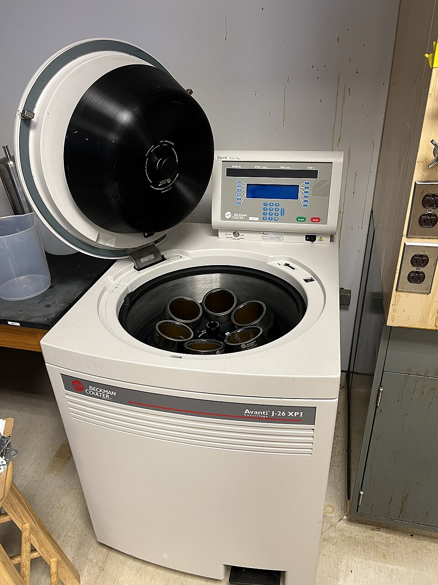

# Centrifuge

> **Node ID**: chemistry.centrifuge
> **Domain**: [Chemistry](./index.md)
> **Dependencies**: [`metals.iron-steel`](../metals/iron-steel.md), [`machine-tools.machining`](../machine-tools/machining.md), [`metals.bearings`](../machine-tools/bearings-abrasives.md)
> **Enables**: [`chemistry.fermentation`](fermentation.md), [`chemistry.water-treatment`](water-treatment.md), [`metals.metal-recycling`](../metals/metal-recycling.md)
> **Timeline**: Years 20-35
> **Outputs**: separated_solids, clarified_liquid
> **Critical**: No — filter presses and settling tanks can substitute for most centrifuge applications at lower throughput and higher labor cost

## Overview

> *Image: Ivangiesen, CC0*

A centrifuge separates solids from liquids (or two immiscible liquids) by applying centrifugal force many times greater than gravity. Where gravity settling takes hours or days, a centrifuge accomplishes the same separation in minutes or seconds. The centrifugal acceleration is proportional to the square of the rotational speed multiplied by the bowl radius: a = ω²R. At 5,000 RPM in a 200 mm radius bowl, the centrifugal acceleration reaches approximately 5,500 × g — a force that drives even micron-sized particles to the bowl wall rapidly.

Three main configurations serve chemical processing: **disc-stack** (stack of closely spaced conical discs inside a bowl, continuous or semi-continuous, for fine particles and liquid-liquid separation), **basket** (perforated cylindrical basket lined with filter cloth, batch operation, for coarser particles and dewatering), and **decanter** (horizontal scroll-discharge centrifuge, continuous, for high-solids slurries). The disc-stack handles fine particles down to 0.5 µm and is standard for fermentation broth clarification, oil-water separation, and catalyst recovery. The basket centrifuge is simpler to construct and suited for crystalline product recovery. The decanter handles the highest solids loading (up to 60% feed solids) and operates fully continuously.

The key engineering challenge is dynamic balancing. A rotating assembly at 5,000 RPM with even 1 gram of imbalance at 200 mm radius generates 55 N of vibration force. Precision balancing to ISO 1940 G6.3 or better is mandatory. Bearings must handle radial loads, axial loads, and the high-speed rotation with minimal vibration. At 10,000+ RPM, even small imbalances cause bearing failure within hours.

The g-force generated by a centrifuge is determined by the rotational speed and bowl radius: G = (ω² × R) / g = (π × RPM / 30)² × R / 9.81. A 300 mm diameter bowl at 10,000 RPM generates approximately 16,700 × g. The separation cutoff diameter (the smallest particle that can be separated) is inversely proportional to the square root of the g-force and directly proportional to the square root of the liquid viscosity. Higher g-force, lower viscosity, and larger particle density difference all improve separation.

Centrifuges consume 2-20 kWh per m³ of slurry processed, depending on the application. Basket centrifuges are the least energy-intensive (2-5 kWh/m³) because they operate at lower g-forces. Disc-stack centrifuges consume 5-15 kWh/m³. Decanters consume 5-20 kWh/m³. Energy cost is dominated by the acceleration of the feed slurry to bowl speed and the friction losses in the bearings and seals.

## Prerequisites

- **[Precision machining](../machine-tools/machining.md)**: Shaft tolerances of ±0.02 mm, bearing seat grinding, dynamic balancing capability
- **[Bearings](../machine-tools/bearings-abrasives.md)**: Angular contact ball bearings, precision grade P5 or better, rated for the operating speed and load
- **[Electric motor](../energy/electricity.md)**: 1-30 kW, 3-phase, with belt drive or direct coupling for speed control
- **[Stainless steel](../metals/iron-steel.md)**: 316L for bowl and wetted parts (corrosion resistance, weldability)
- **[Vibration monitoring](../measurement/index.md)**: Vibration meter or accelerometer for balancing verification

## Bill of Materials

| Material | Quantity | Specifications | Source | Alternatives |
|----------|----------|----------------|--------|-------------|
| [Stainless steel](../metals/iron-steel.md) (bowl) | 50-200 kg | 316L, centrifugally cast or fabricated, balanced | [Iron & Steel](../metals/iron-steel.md) | Titanium (corrosive), Hastelloy (acid service) |
| [Steel shaft](../metals/iron-steel.md) | 20-50 kg | 4140 or 316 SS, 40-80 mm diameter, ground and polished | [Iron & Steel](../metals/iron-steel.md) | — |
| [Bearings](../machine-tools/bearings-abrasives.md) | 2-4 units | Angular contact ball bearings, precision grade P5 or better | [Bearings](../machine-tools/bearings-abrasives.md) | Tapered roller bearings (higher load, lower speed) |
| [Electric motor](../energy/electricity.md) | 1 unit | 1-30 kW, 3-phase, 1,500-3,600 RPM (with belt drive for higher speed) | [Electricity](../energy/electricity.md) | Hydraulic motor (hazardous area) |
| [V-belts or gears](../machine-tools/machining.md) | 1 set | Step-up drive 1:2 to 1:5 ratio for bowl speed | [Machining](../machine-tools/machining.md) | Direct drive (motor at bowl speed — requires special motor) |
| [Filter cloth](../textiles/fibers.md) | 1-4 sheets | Polyester or polypropylene, 50-200 µm pore | [Textiles](../textiles/fibers.md) | Stainless mesh (reusable, finer filtration) |
| [Steel plate](../metals/iron-steel.md) (frame) | 100-300 kg | A36 structural, vibration-damped base | [Iron & Steel](../metals/iron-steel.md) | Cast iron base (heavier, better damping) |
| [Vibration isolators](../polymers/rubber.md) | 4-8 units | Rubber or spring mounts, rated for centrifuge weight at operating speed | [Elastomers](../polymers/rubber.md) | Concrete inertia block (stationary installation) |

## Process Description

### Basket Centrifuge (Batch, Simple Design)

1. **Fabricate the basket**: Spin-form or fabricate a cylindrical bowl (200-600 mm diameter, 150-400 mm tall) from 316L stainless steel, 3-5 mm wall thickness. The bottom is solid; the top is open. Drill 3-6 mm diameter perforations over the cylindrical wall on 10-20 mm triangular pitch (15-30% open area). Machine the inside surface smooth (Ra <1.6 µm) for cleanability.

2. **Machine the shaft**: Turn the drive shaft from 4140 or 316 stainless steel bar stock. Diameter: 40-60 mm. The shaft must be straight within 0.02 mm over its full length. One end has a precision taper (Morse taper or custom) for mounting the basket; the other end has a keyway and pulley mounting surface.

3. **Mount bearings**: Install two angular contact ball bearings (precision grade P5 or better) in the bearing housing. Bearing arrangement: back-to-back (DB) configuration to handle both radial and axial loads. Preload the bearings per manufacturer specification to eliminate internal clearance at operating speed. The bearing housing is a rigid steel casting or weldment bolted to the frame.

4. **Assemble shaft and basket**: Mount the basket on the tapered shaft end. Secure with a locknut. Install a retaining collar. The basket-shaft assembly must be dynamically balanced: spin the assembly in a balancing machine at 50-70% of operating speed. Add or remove material (drill holes or weld weights) at the correction planes until imbalance is below ISO 1940 G6.3 grade (e.g., for a 20 kg rotor at 3,000 RPM, permissible imbalance per plane ≈ 20 g·mm).

5. **Fabricate the housing and frame**: Weld a cylindrical housing around the basket to contain any splashed liquid and direct filtrate to a drain. The housing has a hinged lid with a lock that prevents opening while the basket is spinning (safety interlock). Mount the bearing housing and motor on a rigid base frame with vibration isolator pads.

6. **Install drive system**: Mount the electric motor on adjustable slides. Install V-belt drive with step-up pulleys (motor pulley small, centrifuge pulley large) to achieve the target bowl speed: bowl RPM = motor RPM × (motor pulley diameter / centrifuge pulley diameter). For a 1,750 RPM motor and a 1:2 step-up, bowl speed = 3,500 RPM. Install a belt guard.

  7. **Install filter media**: Line the inside of the perforated basket with filter cloth, secured at the top rim by a retaining ring. The cloth must overlap itself by at least 50 mm to prevent solids bypassing through gaps.

  **Strengths:**
  - Simplest centrifuge design to fabricate — no disc stack, scroll, or gearbox required
  - Handles wide particle size range (5 µm to 5 mm) with appropriate filter cloth selection
  - Batch operation allows different products in the same unit with cleaning between runs
  - Lowest capital cost of the three centrifuge types for equivalent processing volume

  **Weaknesses:**
  - Batch operation limits throughput — each cycle requires spin, discharge, and cloth replacement
  - Manual cake discharge exposes operators to product and requires physical labor
  - Lower g-force (500-2,000 × g) limits separation to particles >5 µm
  - No liquid-liquid separation capability — single-phase liquid discharge only

### Disc-Stack Centrifuge (Continuous, High Performance)

8. **Fabricate the bowl**: Machine the bowl from a centrifugally cast 316L stainless steel blank (150-300 mm diameter). The bowl is a pressure vessel — it must withstand the centrifugal stress at operating speed. Minimum wall thickness: σ = ρ × ω² × R² / (2 × S), where ρ = material density, ω = angular velocity, R = bowl radius, S = allowable stress. At 10,000 RPM and 150 mm radius, the centrifugal stress in stainless steel is approximately 50-100 MPa — within allowable limits for 316L (allowable stress ~115 MPa at 200°C).

9. **Machine disc stack**: Cut 20-100 conical discs from 0.5-1.0 mm 316L stainless sheet. Each disc has a cone angle of 35-50° and 3-6 spacing pins (1-3 mm tall) welded to the upper surface to maintain disc separation. The disc stack provides a large settling area in a small volume: effective settling area = number of discs × disc area × (sin θ), where θ is the half-cone angle. For 50 discs at 45° cone angle in a 250 mm bowl, the equivalent gravity settling area exceeds 50,000 m².

10. **Assemble bowl and disc stack**: Stack the discs on the central feed pipe inside the bowl. Secure the disc stack with a top nut. Install the bowl on the drive shaft. Dynamic balance the complete rotating assembly. Disc-stack centrifuge bowls typically operate at 5,000-15,000 RPM and require balancing to G2.5 grade (tighter than basket type).

  11. **Install feed and discharge systems**: The feed slurry enters through the central feed pipe and is distributed to the disc stack. Clarified liquid (light phase) discharges through a top centripetal pump. Separated solids accumulate in the bowl periphery and are discharged either manually (batch), through nozzle ports at the bowl periphery (continuous), or by periodic full-bowl ejection (self-cleaning type).

  **Strengths:**
  - Highest g-force (5,000-15,000 × g) separates particles down to 0.5 µm — finest separation of all types
  - Continuous or semi-continuous operation with automatic solids discharge options
  - Handles liquid-liquid separation (oil-water, solvent extraction) as well as solid-liquid
  - Compact footprint for the throughput — disc stack multiplies settling area by 5-10× vs. tubular design

  **Weaknesses:**
  - Most mechanically complex — disc stack alignment tolerance ±0.1 mm, balancing to G2.5 grade
  - Limited solids capacity — bowl solids accumulation restricts run time before cleaning (50-500 g per batch for small units)
  - Disc stack nozzle plugging with fibrous or oversized solids requires pre-screening feed to 0.5-1 mm
  - Highest precision machining cost of the three types for bowl and disc fabrication

### Decanter Centrifuge (Continuous, High-Solids)

12. **Fabricate the bowl**: Construct a horizontal cylindrical-conical bowl (300-600 mm diameter, 1.5-3 m long) from 316L stainless steel, 5-10 mm wall thickness. The conical section (beach angle 8-15°) allows solids to be conveyed up and out of the liquid pool. The bowl operates at 3,000-5,000 RPM, generating 2,000-4,000 × g.

13. **Install scroll conveyor**: Fabricate a helical scroll (auger) that fits inside the bowl with 1-3 mm clearance. The scroll rotates at a slightly different speed than the bowl (differential speed: 1-30 RPM), conveying settled solids toward the conical discharge end. The scroll is driven by a planetary gearbox connected to the main drive.

14. **Install feed tube and discharge ports**: The feed slurry enters through a stationary tube along the bowl axis, entering the bowl through nozzles near the cylindrical-conical junction. Clarified liquid overflows a weir at the cylindrical end. Solids discharge from the conical (narrow) end. Adjust weir height to control the liquid pool depth (typically 50-150 mm from the bowl wall).

15. **Install the gearbox and back-drive**: The scroll conveyor requires a separate speed control from the main bowl drive. Install a planetary gearbox (ratio 20:1 to 80:1) between the bowl drive and the scroll. The differential speed between bowl and scroll (1-30 RPM) determines the solids conveyance rate. Use a variable-frequency drive on the back-drive motor to adjust differential speed during operation. Higher differential speed moves solids faster but produces wetter cake.

  16. **Mount on vibration isolators**: Decanter centrifuges generate significant vibration due to the high rotating mass (bowl + scroll = 200-2,000 kg). Mount the entire centrifuge on heavy-duty spring isolators or a concrete inertia block (2-3× the centrifuge weight). The vibration isolator reduces force transmission to the building structure by 80-95%. Ensure the feed and discharge piping uses flexible connections to accommodate the centrifuge vibration.

  **Strengths:**
  - Handles highest solids loading (up to 60% feed solids) without pre-thickening the feed
  - Fully continuous operation — feed, solids discharge, and liquid discharge all simultaneous
  - Largest throughput capacity (5-100 m³/h) for high-volume industrial applications
  - Adjustable weir height and scroll differential speed allow on-the-fly optimization of cake dryness vs. liquid clarity

  **Weaknesses:**
  - Largest physical size — bowl 1.5-3 m long, total unit 2-5 m with drive, gearbox, and frame
  - Lowest g-force of the three types (2,000-4,000 × g) — cannot match disc-stack separation sharpness
  - Scroll conveyor, planetary gearbox, and back-drive motor add maintenance complexity and failure points
  - Highest power consumption (10-75 kW) due to scroll drive mechanism and large rotating mass

## Calibration and Verification

1. **Vibration test**: Run the centrifuge at full speed unloaded (empty bowl). Measure vibration velocity at the bearing housing with a vibration meter. Acceptable: <2.5 mm/s RMS. Above 4.5 mm/s indicates imbalance, misalignment, or bearing damage — do not operate.

2. **Balance verification**: After any maintenance involving the rotating assembly, re-check dynamic balance. Run at 50%, 75%, and 100% of rated speed. Vibration must remain below 2.5 mm/s at all speeds. Document the vibration reading at each speed in the maintenance log.

3. **Separation test**: Process a test slurry of known particle size and concentration. Measure the solids content in the centrate (clarified liquid) and the cake. For a disc-stack centrifuge processing fermentation broth: centrate should have <0.5% suspended solids (from an initial 5-20% in the feed). For a basket centrifuge: cake solids should be 40-70% by weight after spin-drying. For a decanter: centrate solids <1% from a 5-20% feed slurry.

4. **Motor current check**: Measure motor current at full load. Should not exceed motor nameplate rating. Excessive current indicates feed rate too high, solids loading too heavy, or bearing friction. Record the no-load and full-load current values as baseline references for future troubleshooting.

5. **Speed verification**: Verify actual bowl RPM with a tachometer. Compare to the design speed. Belt-driven systems lose speed as belts wear — a 5% speed loss reduces g-force by 10%. Adjust belt tension or replace worn belts to maintain rated speed.

6. **Temperature rise test**: Run the centrifuge at full load for 1 hour. Measure bearing housing temperature every 15 minutes. Temperature rise should stabilize within 30 minutes and not exceed 40°C above ambient. A continuing temperature rise indicates inadequate lubrication, excessive preload, or bearing damage.

## Operating Procedure (Basket Centrifuge)

1. **Startup**: Close the lid and engage the safety interlock. Start the motor. Allow the basket to reach operating speed (2-5 minutes). Verify vibration is below 2.5 mm/s at the bearing housing.
2. **Feeding**: Open the feed valve. Feed slurry at a controlled rate (start at 50% of design rate, increase gradually). Monitor filtrate clarity — if cloudy, reduce feed rate until the cake forms a precoat layer on the cloth.
3. **Spin-drying**: When filtrate flow drops below 10% of initial rate (chambers full), close the feed valve. Continue spinning at full speed for 5-15 minutes to drain residual liquid from the cake. Monitor filtrate drip rate — when dripping stops, spin-drying is complete.
4. **Wash (optional)**: Open the wash water valve. Spray wash water over the cake at 5-10% of the feed rate for 5-20 minutes. Collect wash filtrate separately if recovering product from the mother liquor.
5. **Shutdown and discharge**: Stop the motor. Apply the mechanical brake to decelerate the basket. Wait until rotation has fully stopped (2-5 minutes). Open the lid. Remove the retaining ring and lift out the filter cloth with the cake. Discharge cake by inverting the cloth over a collection bin.
6. **Cloth cleaning**: Rinse the filter cloth with water or solvent. Inspect for tears, holes, or blinding. Reinstall the cloth with 50 mm overlap at the seam. Replace the retaining ring. Close the lid for the next cycle.

## Quantitative Parameters

| Parameter | Basket Centrifuge | Disc-Stack Centrifuge | Decanter Centrifuge |
|-----------|-------------------|----------------------|---------------------|
| Bowl diameter | 200-600 mm | 150-300 mm | 300-600 mm |
| Operating speed | 1,000-3,500 RPM | 5,000-15,000 RPM | 3,000-5,000 RPM |
| Centrifugal force | 500-2,000 × g | 5,000-15,000 × g | 2,000-4,000 × g |
| Minimum particle size separated | 5-20 µm | 0.5-5 µm | 2-20 µm |
| Throughput (liquid) | 0.5-10 m³/h | 1-50 m³/h | 5-100 m³/h |
| Cake solids (after spin) | 40-70% | 20-50% (solids discharge slurry) | 20-50% |
| Feed solids concentration | 5-50% | 0.1-20% | 5-60% |
| Cycle time (batch) | 10-60 min | — (continuous) | — (continuous) |
| Motor power | 1-15 kW | 5-30 kW | 10-75 kW |
| Operation mode | Batch | Continuous or semi-continuous | Continuous |
| Bearing life | 10,000-30,000 hours | 5,000-15,000 hours | 10,000-25,000 hours |
| Bowl L/D ratio | 0.5-1.0 | 0.5-1.0 | 3-5 |

## Scaling Notes

- **Laboratory to pilot**: A bench-top centrifuge (100 mm bowl, 10,000 RPM) processes 1-10 L/h. Scale to pilot by increasing bowl diameter: throughput scales approximately with bowl diameter² × length for decanters, and with disc count × disc diameter² for disc-stack. A 200 mm disc-stack processes roughly 4× the throughput of a 100 mm unit.
- **Pilot to production**: The primary scaling constraint is bowl stress. At constant g-force, bowl stress is proportional to diameter². A 600 mm bowl at 3,000 × g is near the material limit for 316L stainless. Above this diameter, reduce RPM or switch to higher-strength alloys (duplex stainless, titanium).
- **Bearing life scaling**: Bearing life follows the P-N relationship (load-life equation). L₁₀ life ∝ (C/P)^3 for ball bearings, where C = dynamic load rating and P = equivalent dynamic load. Doubling the operating speed reduces bearing life by roughly 8×. Plan for bearing replacement at scheduled intervals.
- **Minimum economic scale**: A 200 mm basket centrifuge processing 0.5-2 m³/h is the smallest unit that justifies the precision machining cost. Below this, a [filter press](filter-press.md) or settling tank is more economical.
- **Feed pre-treatment scaling**: As throughput increases, the feed system becomes the bottleneck. Decanter centrifuges handling 50-100 m³/h require 75-150 kW feed pumps and large-bore piping (100-200 mm). Pre-screen the feed (1-2 mm mesh) to remove oversized solids that could plug disc-stack nozzles or damage the scroll.
- **Maintenance scheduling**: Bearing replacement requires complete disassembly of the rotating assembly. Plan annual maintenance shutdowns. Stock spare bearings, seals, and filter cloth. Critical spare for disc-stack: a complete bowl assembly (lead time 3-6 months for custom fabrication).

## Troubleshooting

| Problem | Probable Cause | Solution |
|---------|---------------|----------|
| Excessive vibration at operating speed | Rotor imbalance from uneven cake deposit, bearing wear, or shaft misalignment | Stop and clean the bowl; re-balance the rotating assembly; check bearing preload; verify shaft straightness (<0.02 mm TIR); inspect coupling alignment |
| Centrate (clarified liquid) cloudy with suspended solids | Feed rate exceeding clarification capacity; particle size below cut point for current RPM; disc stack gaps plugged | Reduce feed rate by 30-50%; increase bowl speed (if within design limits); clean disc stack; use finer filter cloth (basket type) |
| Motor overloading (current exceeds nameplate) | Feed slurry too concentrated; bowl overloaded with cake; bearing seizure; drive belt slipping | Reduce feed solids concentration; stop and discharge cake; check bearing temperature (should be <70°C above ambient); inspect and tension belts |
| Cake discharge wet (solids <30% by weight) | Insufficient spin time (basket); or scroll differential speed too high (decanter), not allowing drainage | Extend spin cycle by 50-100%; reduce scroll differential speed; increase g-force by raising RPM; pre-thicken feed slurry |
| Bearing overheating (>80°C above ambient) | Bearing preload too high; lubrication failure; misalignment; contamination in bearing | Verify preload matches specification; re-lubricate or replace grease; check housing alignment; replace bearings if noise or roughness detected |
| Disc-stack nozzle plugging (continuous discharge type) | Oversized solids or fibrous material in feed; nozzle bore too small for solids loading | Install a coarse screen (0.5-1 mm) on the feed line; increase nozzle bore diameter; switch to self-cleaning (ejection) discharge type |
| Scroll conveyor jamming (decanter) | Foreign object in the feed; solids buildup between scroll flights; gearbox failure | Install magnetic separator and coarse screen on the feed line; flush the bowl with hot water between runs; check gearbox oil level and temperature |
| Uneven cake distribution in basket | Feed pipe nozzle misaligned; feed rate too high causing splashing; basket not level | Adjust feed pipe to discharge at the basket center at low velocity; reduce feed rate during initial filling; level the centrifuge base (check with spirit level) |
| Product contamination between batches | Residual solids from previous batch trapped in bowl crevices; filter cloth not properly seated | Clean the bowl interior with water or solvent between products; verify cloth overlap at seams (>50 mm); use dedicated cloths for different products in multi-product facilities |
| Excessive noise (>95 dB) | Bearing damage; loose belt guard resonance; cavitation in feed pump | Replace bearings immediately; tighten guard fasteners and add rubber vibration dampers; verify feed pump is not running dry or cavitating |

## Safety

- **Rotor burst**: A bowl failure at 10,000 RPM releases fragments with kinetic energy comparable to a small explosion. The centrifuge housing must contain a rotor burst without penetration. Reinforced steel housing, minimum 10 mm plate. Never operate with the lid open. Safety interlock prevents motor start with lid open.
- **Imbalance vibration**: Running an imbalanced centrifuge causes catastrophic bearing failure and possible structural damage. Install vibration switch: automatic motor shutdown if vibration exceeds trip level (typically 7-10 mm/s). Investigate and correct any imbalance before restarting.
- **Chemical exposure**: Centrifuge feed and discharge may contain corrosive or toxic chemicals. Seal all feed and discharge connections. Secondary containment under the centrifuge. PPE for chemical handling during basket cleaning and cloth replacement.
- **Pinch points and rotation**: The rotating basket is the primary hazard. Never reach into the housing while the basket is spinning (coasting down after motor stop counts). Mechanical brake or regenerative braking to stop the basket within 2-5 minutes. Do not open the lid until rotation has fully stopped.
- **Noise**: Centrifuges at 5,000+ RPM generate 80-95 dB noise. Hearing protection required in the operating area. Enclose the centrifuge in a sound-dampened housing for continuous operation.
- **Feed pressure hazard**: Positive-displacement feed pumps can generate pressures exceeding the centrifuge housing rating if the feed line is blocked. Install a pressure relief valve on the feed line set to 1.1× the housing design pressure. Route the relief discharge back to the feed tank.
- **Electrical safety**: The motor and drive system operate at 380-480V 3-phase. Ground the motor frame and all metal parts. Use lockout/tagout before any maintenance. Ensure the vibration switch trips the motor power directly (not through the control system — control system failures must not prevent emergency shutdown).

## Quality Control

- **Centrate clarity**: Measure suspended solids in the clarified liquid by gravimetric filtration (filter 100 mL through pre-weighed 0.45 µm filter paper, dry, weigh). Acceptable: <0.5% for fermentation broth, <50 ppm for oil-water separation.
- **Cake moisture**: Weigh a wet cake sample, dry at 105°C for 4 hours, reweigh. Moisture content = (wet − dry) / wet × 100%. Basket centrifuge: target 30-60% moisture. Decanter: 40-70%.
- **Bearing temperature trend**: Log bearing housing temperature at each startup. A gradual rise of >10°C over baseline indicates bearing degradation. Schedule replacement when trend exceeds 75% of alarm setpoint.
- **Vibration trend**: Record vibration velocity weekly at operating speed. Track the trend. A 50% increase from baseline indicates developing imbalance or bearing wear. Schedule investigation.
- **G-force verification**: Calculate actual centrifugal force from measured RPM and bowl radius: G = (π × RPM / 30)² × R / 9.81. Compare to nameplate rating. A 10% drop in RPM from belt wear reduces g-force by 19% (proportional to RPM²). Replace worn belts promptly.

- **Throughput verification**: Measure feed rate and centrate flow rate with calibrated flow meters. Mass balance: feed rate = centrate rate + cake rate. The mass balance should close within ±5%. Larger discrepancy indicates measurement error or unaccounted losses (leaks, splashing).

- **Wear monitoring**: Inspect the bowl interior and scroll flights (decanter) every 6 months for erosion and corrosion. Measure wall thickness by ultrasonic testing at the feed zone (highest wear area). Replace or repair when wall thickness reaches 75% of the original value. For disc-stack centrifuges, inspect the disc spacing pins for wear — worn pins reduce disc separation and decrease separation efficiency.

- **Seal leak rate**: For centrifuges with mechanical seals, monitor the seal flush flow rate. An increase of >50% from baseline indicates seal face wear. Schedule seal replacement before leakage becomes visible.

## Variations and Alternatives

- **Tubular-bowl centrifuge**: A simple high-speed tube (50-100 mm diameter, 300-700 mm long) spinning at 15,000-50,000 RPM. Generates 15,000-60,000 × g. Batch operation — solids accumulate on the tube wall and must be scraped out manually. Used for difficult separations (bacteria, sub-micron particles) at small scale. Throughput: 10-500 L/h. Very limited solids capacity (50-500 g per batch).
- **Filter press** ([Filter Press](filter-press.md)): Lower cost, no precision machining required, handles wider particle size range. Throughput limited by batch operation. Cake moisture comparable to basket centrifuge. Preferred for large-scale batch operations where continuous operation is not required.
- **Settling tank**: Gravity settling requires hours to days and large floor area. Zero energy input. Suitable for coarse particles (>50 µm) with large density difference. Used as pre-clarification before centrifugation to reduce solids loading.
- **Hydrocyclone**: No moving parts — uses pump pressure to create a vortex. Separation cut size 5-40 µm. Low cost, high throughput. Limited to liquid-solid separation. Cannot achieve the fine separation of disc-stack centrifuges.
- **Peeler centrifuge**: A horizontal basket centrifuge with an automated peeler blade that scrapes cake from the basket wall without stopping rotation. Reduces cycle time by 50-70% compared to manual basket discharge. Used for high-value products (pharmaceuticals, fine chemicals) where batch-to-batch cleanliness is required. More complex than a vertical basket centrifuge but enables semi-continuous operation.
- **Pusher centrifuge**: A horizontal basket with a reciprocating pusher plate that advances the cake along the basket in incremental steps. Continuous feed and discharge. Handles coarse crystals (0.1-5 mm) and granular solids. Throughput: 5-50 tonnes/h solids. Requires relatively uniform particle size — fines wash through the cake and re-enter the filtrate. Used in salt, soda ash, and fertilizer production.
- **Three-phase decanter**: A decanter centrifuge modified to separate two immiscible liquids and a solid simultaneously (e.g., oil + water + solids). Uses a second liquid discharge weir at a different radial position. Used in edible oil processing, fish meal production, and waste oil recycling.
- **Centrifugal extractor**: A disc-stack centrifuge designed for liquid-liquid extraction (not solid-liquid separation). Two immiscible liquids of different densities enter the bowl and are separated into light and heavy phases. Used for solvent extraction in pharmaceutical and nuclear fuel processing. Handles density differences as small as 0.01 g/cm³ between the two phases.
- **Solid-bowl centrifuge (scroll discharge)**: Similar to the decanter but without the conical beach section. Used for thickening slurries (removing liquid from high-solids feeds) rather than producing a dry cake. The discharged solids are a pumpable sludge (15-30% solids) rather than a crumbly cake. Used in wastewater treatment and mineral processing.

## References

- [Filter Press](filter-press.md) — alternative solid-liquid separation (batch, lower cost)
- [Fermentation](fermentation.md) — cell and mycelium recovery from broth
- [Water Treatment](water-treatment.md) — sludge dewatering
- [Crystallizer](crystallizer.md) — crystal recovery by centrifugation
- [Reactor Vessel](reactor-vessel.md) — shared pressure vessel construction principles
- [Evaporator](evaporator.md) — concentration by evaporation (often paired with centrifuge for crystal recovery)
- [Distillation Column](distillation-column.md) — liquid-liquid separation by boiling point (alternative to centrifugal separation)
- [Chemical Recovery](chemical-recovery.md) — catalyst and precipitate recovery using centrifuges
- [Acids](acids.md) — acid production processes often use centrifuges for product recovery

## Decanter Operating Parameters

The decanter centrifuge requires careful adjustment of three operating parameters: bowl speed, scroll differential speed, and weir height (pool depth).

- **Bowl speed**: Higher speed increases g-force and separation sharpness. Maximum speed is limited by bowl material stress. For 316L stainless steel bowls, the maximum rim stress at 5,000 RPM with a 500 mm diameter bowl is approximately 130 MPa — approaching the allowable stress. Above this speed or diameter, switch to higher-strength alloys or reduce the bowl diameter.
- **Scroll differential speed**: Controls the solids conveyance rate. Low differential speed (1-5 RPM) produces drier cake (more drainage time on the beach) but lower solids throughput. High differential speed (15-30 RPM) increases solids throughput but produces wetter cake. Adjust by changing the gearbox ratio or the back-drive motor speed.
- **Weir height**: Controls the liquid pool depth inside the bowl. A deep pool (long settling path) gives better liquid clarity but less beach area for cake drainage. A shallow pool gives better cake dryness but poorer liquid clarity. Typical pool depth: 50-150 mm from the bowl wall. Adjust by changing the weir ring at the liquid discharge end.

## Disc Stack Centrifuge Design

The disc stack centrifuge (also called a disc bowl centrifuge) uses a stack of closely spaced conical discs (typically 50-150 discs) inside a rotating bowl to multiply the settling area. Each disc pair forms a narrow channel (0.5-2 mm gap) through which the feed flows. Particles settle to the underside of the upper disc and slide along the disc surface to the bowl periphery. The disc angle (typically 35-50° from horizontal) must be steep enough for solids to slide but shallow enough to maximize the projected horizontal settling area.

Compared to a tubular centrifuge of the same diameter and speed, the disc stack provides 5-10× the effective settling area. This allows either higher throughput at the same separation sharpness, or sharper separation at the same throughput. The trade-off is mechanical complexity: the disc stack must be precisely aligned (disc spacing tolerance ±0.1 mm), and disassembly for cleaning requires careful reassembly. Disc materials are typically 316L stainless steel, with the disc stack pressed onto a central spindle nut.

---
*Part of the [Bootciv Tech Tree](../index.md) • [Chemistry](./index.md) • [All Domains](../index.md)*
