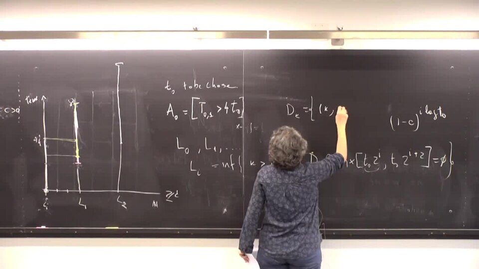

# Contact Process (H₂SO₄)

> **Node ID**: chemistry.acids.contact-process
> **Domain**: [Chemistry](./index.md)
> **Dependencies**: [`Mineral Acid Production`](acids.md)
> **Enables**: Various downstream capabilities
> **Timeline**: Years 20-35
> **Outputs**: contact_process_sulfuric_acid, oleum, vanadium_catalyst
> **Critical**: No

## Overview

> *Speaker: Maria Eulalia Vares – IM - UFRJ..Abstract: This talk is based on joint works in collaboration with L. R. Fontes, D. Marchetti, and T. Mountford. We investigate a non-Markovian analogue of the Harris contact process on Z^d. An individual is attached to each site and it can be infected or healthy; the infection propagates to healthy neighbors as in the usual contact process, according to independent exponential times with a fixed rate. Nevertheless, the possible recovery times for an individual are given by the points of a renewal process with heavy tail; the renewal processes are assumed to be independent for different sites..In [1], we show that if the interarrival distribution has a tail bounded from below by t^{-a} for some a less than 1 (plus some regularity conditions), then the process survives for any positive value of the infection rate. .In [2], a robust argument shows that the critical infection rate is positive in any dimension whenever the interarrival distribution has finite second moment. We also show that in one dimension the same holds when the interarrival distribution has decreasing hazard rate and tail bounded by t^{-a} with a greater than 1...[1] L. R. Fontes, T. S. Mountford, D. H. U. Marchetti, M. E. Vares. Contact process under renewals I. arXiv:1803.01458 [math.PR] .[2] L. R. Fontes, T. S. Mountford, M. E. Vares. Contact process under renewals II. arXiv:1803.01460 [math.PR]*

> *Image: Comunicação NeuroMat, CC BY-SA 4.0*

Production of concentrated sulfuric acid (96-98%) via the contact process: sulfur combustion to SO₂, catalytic oxidation to SO₃ over vanadium pentoxide catalyst at 400-450°C, and absorption in concentrated H₂SO₄ to form oleum. Supersedes the lead chamber process (65-70%) for high-purity industrial acid.

The contact process becomes the standard sulfuric acid route once a civilization can produce vanadium pentoxide catalyst, build gas-tight converters, and fabricate acid-resistant absorption towers. It superseded the lead chamber process (limited to 65-70% acid) because the vanadium-catalyzed SO₂ → SO₃ oxidation followed by absorption into concentrated acid yields 96-98% H₂SO₄. Per-capita sulfuric acid consumption is a rough proxy for industrial development, making this process a bellwether capability.

The three outputs span the acid concentration spectrum: 96-98% sulfuric acid (the workhorse of industrial chemistry), oleum (fuming H₂SO₄ with dissolved free SO₃, used for sulfonation and nitration), and vanadium pentoxide catalyst pellets (a consumable that lasts 5-10 years per charge).

Sulfuric acid is often called the "king of chemicals" because of its central role in industrial chemistry. It is used in fertilizer production (phosphate rock acidulation), petroleum refining (alkylation), metal processing (pickling), chemical synthesis (nitration, sulfonation), and battery electrolyte. A civilization's sulfuric acid production capacity is a rough proxy for its overall industrial development level. The contact process produces the high-concentration acid (96-98%) needed for most of these applications.

The contact process replaced the older lead chamber process because it could produce much higher concentrations. The lead chamber process, which relies on nitrogen oxide catalysts in large lead-lined rooms, is limited to about 70% acid concentration by the chemistry of the process. The contact process achieves 96-98% because the SO₃ absorption step is thermodynamically more favorable at high acid concentrations. The vanadium pentoxide catalyst is also more selective and longer-lasting than the nitrogen oxide system, producing fewer side products.

The name "contact process" refers to the direct contact between the reactant gases (SO₂ and O₂) and the solid vanadium pentoxide catalyst. The vanadium catalyst works through a redox cycle: V₂O₅ oxidizes SO₂ to SO₃ while being reduced to a lower vanadium oxidation state, and the reduced catalyst is then re-oxidized by atmospheric oxygen. This catalytic cycle operates continuously without the catalyst being consumed.

## Prerequisites

### Materials

- Chemicals — elemental sulfur or sulfide ore (pyrite), air (dry and filtered), concentrated sulfuric acid (for absorption)
- Vanadium pentoxide catalyst on silica support
- Materials of construction resistant to hot SO₂ and SO₃ (stainless steel, lead-lined steel)

### Equipment

- [Mineral Acid Production](acids.md) — material dependency
- Sulfur burner or roaster furnace
- Gas purification system (dust removal, arsenic scrubbing)
- Multi-bed converter with interstage cooling
- Absorption tower (packed column with acid circulation)
- Tail gas scrubber for environmental compliance

### Knowledge

- Catalytic oxidation thermodynamics: why the SO₂ + ½O₂ → SO₃ equilibrium shifts toward SO₃ at lower temperatures but the reaction rate drops, requiring multi-bed converters with interstage cooling
- Vanadium pentoxide catalyst behavior: the V⁵⁺/V⁴⁺ redox cycle, the role of potassium sulfate promoter, and how arsenic and fluorine poison the active phase
- Gas-phase reactor engineering: heat recovery from exothermic beds, quench vs. heat-exchanger intercooling, and the difference between single and double absorption configurations
- Acid concentration measurement by density (hydrometer) and titration, plus dew-point moisture analysis for dry chlorine-grade acid

### Infrastructure

- Workspace with ventilation appropriate to the process — SO₂ and SO₃ gas handling requires acid-resistant ventilation
- Power supply matching equipment requirements — blowers and pumps for gas circulation
- Water supply and drainage where applicable — cooling water for interstage heat exchangers
- Waste handling and disposal facilities for process outputs — tail gas scrubbing for environmental compliance
- Acid-resistant materials of construction throughout (stainless steel, lead-lined steel, PTFE-lined piping)

## Process Description

The contact process chains three reaction stages: sulfur combustion to SO₂, catalytic oxidation to SO₃ over V₂O₅, and absorption of SO₃ into concentrated acid to form oleum. The critical constraint is temperature: below ~400°C the catalyst is too slow, above ~600°C the equilibrium reverts toward SO₂. The multi-bed converter with interstage cooling navigates between these limits.

The process chain consists of three main reaction stages. First, elemental sulfur (or sulfide ore) is burned in air to produce sulfur dioxide gas. Second, the SO₂ is oxidized to sulfur trioxide over a vanadium pentoxide catalyst at controlled temperature — too cold and the reaction rate is unacceptably slow, too hot and the equilibrium shifts back toward SO₂. Third, SO₃ is absorbed into concentrated sulfuric acid (not water — direct hydration produces a corrosive sulfuric acid mist that is nearly impossible to condense) to form oleum (fuming sulfuric acid), which is then diluted to the desired final concentration.

### Step-by-Step Procedure

1. Burn elemental sulfur or roasted sulfide ore in a furnace with dry, filtered air. Control the air supply for complete combustion to SO₂ with minimal oxygen excess (excess air wastes energy heating inert nitrogen).
2. Cool the gas stream and remove dust and impurities. Arsenic, which is common in pyrite-derived SO₂, is a severe catalyst poison and must be removed by scrubbing before the gas reaches the converter.
3. Preheat the cleaned SO₂ gas to the catalyst ignition temperature and pass through the first catalyst bed (vanadium pentoxide on silica support). The oxidation reaction is exothermic — the gas heats as it converts.
4. Cool the gas between catalyst beds (typically 4-5 beds in series with interstage cooling) to maintain the temperature in the optimal conversion window. The equilibrium conversion increases at lower temperatures, but the reaction rate decreases.
5. Pass the SO₃-rich gas through an absorption tower where it contacts concentrated (98%) sulfuric acid flowing counter-current. The SO₃ dissolves in the acid to form oleum.
6. Dilute the oleum with water or weaker acid to produce the desired final sulfuric acid concentration (typically 96-98%).

### Process Parameters

| Parameter | Value | Notes |
|-----------|-------|-------|
| Sulfur burner temperature | 800-1,500°C | Must maintain complete combustion; excess air kept to 10-20% above stoichiometric |
| SO₂ concentration in burner gas | 7-10% by volume | Higher SO₂ (from pure sulfur) gives smaller equipment; lower SO₂ (from pyrite) needs larger converters |
| Converter inlet temperature (first bed) | 410-440°C | Catalyst ignition temperature; below 400°C V₂O₅ is too slow |
| Converter outlet temperature (first bed) | 580-620°C | Temperature rises ~50-80°C per bed due to exothermic reaction |
| Interstage cooling target | Cool to 410-440°C between beds | Lower temperature favors equilibrium but catalyst must stay above 400°C |
| Final bed temperature | 410-440°C | Lowest feasible temperature for maximum equilibrium conversion |
| Number of catalyst beds | 4-5 (single absorption), 5-6 (double absorption) | More beds = higher conversion but more equipment |
| Overall SO₂ conversion | 97-98% (single), >99.5% (double) | DCDA achieves >99.5% via intermediate absorption |
| V₂O₅ catalyst loading | 150-250 L per tonne/day acid capacity | Ring-shaped pellets, 6-10 mm diameter |
| Absorption tower acid concentration | 98.0-98.5% H₂SO₄ | Optimal for SO₃ absorption without forming acid mist |
| Oleum production | 20-65% free SO₃ | Higher free SO₃ = more concentrated oleum |
| Product acid concentration | 96-98% H₂SO₄ | Diluted from oleum with water or weaker acid |
| Sulfur feed rate | ~330 kg S per tonne H₂SO₄ (from pure sulfur) | From pyrite: ~600 kg pyrite per tonne H₂SO₄ |
| Energy balance | Net exporter (exothermic) | 1 tonne H₂SO₄ produces ~1.5 tonnes of steam from waste heat |

## Safety Considerations

The contact process handles hot concentrated acid, toxic gases, and exothermic catalytic reactors. The hazard profile differs at each stage of the process:

- **Concentrated sulfuric acid (96-98%)**: Causes severe dehydration burns on skin contact within seconds. Reacts violently with water, generating substantial heat (690 J/g dilution heat from 98% to 50%). Always add acid to water, never water to acid. Oleum (fuming sulfuric acid, 20-65% free SO₃) is even more hazardous — it releases SO₃ gas on exposure to air and has a higher vapor pressure than concentrated acid.
- **Sulfur dioxide (SO₂)**: Severe respiratory irritant. IDLH 100 ppm; PEL 5 ppm (8-hr TWA); immediately detectable by odor at 1-3 ppm. Causes bronchoconstriction at 5-10 ppm, pulmonary edema above 50 ppm. Heavier than air (density 2.26× air) — accumulates in low-lying areas.
- **Sulfur trioxide (SO₃)**: Combines with moisture in respiratory tract to form sulfuric acid in the lungs. IDLH is effectively that of the H₂SO₄ mist it forms. The combination of SO₃ + H₂O → H₂SO₄ aerosol produces a dense, persistent acid mist that is far more damaging than dry gas.
- **Vanadium pentoxide (V₂O₅) catalyst**: Toxic by inhalation. OSHA PEL 0.5 mg/m³ (respirable dust, as V₂O₅). Causes respiratory irritation, green tongue, and chronic bronchitis. Handle catalyst pellets with dust suppression and respiratory protection during loading and unloading operations. Spent catalyst may contain arsenic and other accumulated poisons.
- **Exothermic reactions**: Multiple process stages generate substantial heat (SO₂ oxidation releases ~99 kJ/mol). Temperature excursions can damage catalyst (sintering above 650°C) and create runaway reaction conditions in the converter.

### Personal Protective Equipment

- Acid-resistant clothing (PVC or neoprene apron, boots, gloves) for all acid handling
- Full face shield and chemical splash goggles in acid transfer areas
- Respiratory protection with acid gas cartridges for SO₂/SO₃ exposure potential
- Hard hat with acid-resistant coating in process plant areas

### Emergency Procedures

- For acid spills: contain with sand or acid spill absorbent. Do not flush with water until the acid has been neutralized with lime or soda ash.
- For SO₂ release: evacuate upwind. SO₂ is heavier than air and accumulates in low areas.
- Emergency eyewash and deluge shower within 10 seconds of all acid handling points
- Maintain stock of neutralizing agents (lime, sodium bicarbonate) near all acid storage

## Quality Control

### Acceptance Criteria

- **Contact Process Sulfuric Acid**: Concentration within target range (96-98%). Free SO₃ content below specification. Color (clear to pale yellow) indicating absence of organic or metallic impurities. Residual dissolved SO₂ below threshold.
- **Oleum**: Free SO₃ content within specification (typically 20-65% expressed as percent free SO₃). Consistent concentration batch-to-batch.
- **Vanadium Catalyst**: Mechanical strength (resistance to crushing and abrasion). Activity verification by standard SO₂ conversion test. Potassium content within range for optimal promoter function.

### Testing Methods

- Density measurement (hydrometer or digital densitometer) for acid concentration
- Titration with standard base for precise acid concentration determination
- Color comparison against standards for impurity assessment
- Catalyst activity testing in a laboratory converter with standard SO₂/air feed

### Sampling Protocol

- Sample acid from storage tanks at defined intervals for concentration verification
- Monitor converter gas composition continuously (SO₂ and SO₃ analysis)
- Test catalyst samples from each production batch before loading into converter

## Scaling Notes

Growing from a quartz-tube bench reactor to a multi-hundred-tonne-per-day plant follows these stages:

- **Bench scale**: Small quartz tube reactor with catalyst charge, heated externally. Produces grams of sulfuric acid. Demonstrates the catalytic conversion principle.
- **Pilot scale**: Small converter (single catalyst bed) with sulfur burner, absorption column. Produces kilograms per day. Validates catalyst performance and gas purification requirements.
- **Production scale**: Multi-bed converter with interstage cooling, double absorption (for >99.5% conversion), large absorption towers. Produces hundreds of tonnes per day.

Key scaling challenges: heat recovery from the exothermic oxidation becomes a significant energy efficiency factor at scale. Catalyst bed design must balance pressure drop against conversion efficiency. Gas purification to remove catalyst poisons (especially arsenic) requires multi-stage scrubbing and filtration. Acid-resistant materials of construction (lead-lined steel, stainless steel, or specialized alloys) are necessary throughout.

## Troubleshooting

| Problem | Probable Cause | Solution |
|---------|---------------|----------|
| Low SO₂ conversion (<95%) | Catalyst deactivation (arsenic poisoning, thermal sintering), sub-optimal bed temperatures, or interstage cooling failure | Test catalyst activity in lab converter; replace beds with <80% of original activity; verify interstage coolers hold gas at 410-440°C between beds |
| Catalyst poisoning (rapid activity loss) | Arsenic, selenium, or fluorine in feed gas from impure ore or inadequate gas purification | Install or upgrade electrostatic precipitator and scrubbing tower before converter; target arsenic <1 mg/m³ in feed gas; switch to cleaner sulfur source if ore quality is poor |
| Acid mist from absorber (visible white plume) | Absorption tower acid concentration outside 98.0-98.5% window (too dilute or too concentrated), or insufficient acid circulation rate causing temperature rise | Adjust circulating acid to 98.0-98.5% H₂SO₄ (measure by density — 1.836 g/cm³ at 15°C); increase circulation rate to keep acid exit temperature below 80°C |
| Excessive stack SO₂ (>500 ppm) | Incomplete conversion (single absorption plant below 97%), absorber bypass, or DCDA interstage absorber failure | For single-absorption: add 4th or 5th catalyst bed, or convert to DCDA; verify absorption tower packing integrity; check DCDA interstage absorber for acid level and concentration |
| Converter hot spots (>650°C locally) | Uneven gas distribution, catalyst channeling (gas bypassing through voids), or dust accumulation blocking flow | Repack catalyst bed with proper ring-pellet geometry (6-10 mm); install or repair gas flow distributors at bed inlet; screen catalyst for fines after each shutdown |
| Rising converter pressure drop (>150% of design) | Catalyst pellet breakage (thermal cycling, mechanical vibration), dust accumulation, or liquid acid carryover into converter | Shut down and screen catalyst to remove fines (<2 mm); fix upstream mist eliminator if acid carryover detected; minimize thermal cycling during startups |
| Oleum freezing in storage or lines | Oleum with 20-45% free SO₃ freezes at 10-35°C; inadequate heat tracing on piping | Maintain storage temperature 15°C above freezing point for the specific oleum grade; install heat tracing on all transfer lines; verify freeze point with SO₃ concentration analysis |
| Product acid off-spec (below 96% or discolored) | Dilution from water ingress, absorption tower flooding, or organic/metallic contamination from dirty sulfur feed | Check for water leaks in acid cooling system; verify sulfur purity before burning; test absorption tower for flooding (excessive gas velocity); re-distill if metallic impurities suspected |
| Vanadium catalyst dusting during loading | Fresh or spent catalyst pellets crumbling, releasing V₂O₅ dust (toxic by inhalation — PEL 0.5 mg/m³ as V₂O₅) | Load catalyst with dust extraction ventilation and wet methods; workers wear P100 respirators and disposable coveralls; vacuum (do not sweep) spilled catalyst |

## Variations and Alternatives

- **Lead chamber process**: The older method for sulfuric acid production, using nitrogen oxides as homogeneous catalyst in large lead-lined chambers. Produces only 65-70% acid. Simpler equipment but lower concentration and purity. Largely superseded by the contact process.
- **Double contact / double absorption (DCDA)**: Adds a second absorption tower partway through the converter to remove SO₃ before the final catalyst beds, shifting the equilibrium to achieve >99.5% conversion. Required by environmental regulations in most jurisdictions.
- **Single contact / single absorption**: Simpler process with one absorption step. Lower capital cost but lower conversion efficiency, resulting in more SO₂ in the tail gas.
- **Wet catalysis**: For processes using sulfur from smelter gas or H₂S combustion where the gas contains water vapor. Uses special catalyst formulations resistant to moisture.

The lead chamber process deserves mention as a historical stepping stone. Invented in the 1740s, it used nitrogen oxides (generated from saltpeter or ammonia oxidation) as a homogeneous catalyst dissolved in the sulfuric acid itself. The process operated in large lead-lined chambers where SO₂, NOₓ, water vapor, and oxygen reacted in the gas and liquid phases. While it could only produce dilute acid, it was the main industrial method for over 150 years. The contact process supplanted it because of higher acid concentration, higher purity, and the ability to produce oleum.

## References

- [Mineral Acid Production](acids.md) — parent capability
- [Chemistry Domain](./index.md) — domain overview and related capabilities
- [Mineral Acid Production](acids.md) — upstream dependency (material)

The contact process is the modern industrial method for sulfuric acid production. It builds on the earlier mineral acid production capability and produces the high-concentration acid needed for advanced chemistry, metal processing, and semiconductor manufacturing.

Sulfuric acid consumption per capita is sometimes used as an indicator of industrial development. Every major manufacturing sector uses it: fertilizer (by far the largest consumer), chemicals, metals, petroleum, textiles, and electronics. Semiconductor fabrication uses ultra-pure sulfuric acid for wafer cleaning. A civilization that cannot produce sulfuric acid at industrial scale cannot sustain modern chemical manufacturing, cannot produce phosphate fertilizers at scale, and cannot process metals effectively.

The choice of raw material for SO₂ production affects plant economics and complexity. Elemental sulfur (produced from underground deposits or recovered from petroleum refining) is the cleanest feedstock — it burns to produce nearly pure SO₂ with minimal impurities. Pyrite (iron sulfide ore) roasting produces SO₂ mixed with large volumes of nitrogen and dust, requiring extensive gas cleaning. Smelter off-gas from copper or lead smelting contains SO₂ as a byproduct that must be captured for environmental reasons, and the contact process serves double duty as pollution control and acid production.

For a bootstrapping civilization, the lead chamber process may be the first sulfuric acid production method, as it is mechanically simpler (no high-temperature catalyst or special catalyst support needed). However, the contact process becomes necessary as soon as concentrated acid is needed for applications like nitration, organic synthesis, or oleum production. The vanadium catalyst, while more complex than nitrogen oxides, is not particularly difficult to prepare — vanadium is a moderately common element and the catalyst preparation involves standard calcination and impregnation techniques.

The interstage cooling between catalyst beds is a critical design element. The SO₂ oxidation reaction is strongly exothermic, and the gas temperature rises significantly in each bed. Without cooling, the gas would quickly exceed the temperature where the equilibrium shifts back toward SO₂, limiting overall conversion. The cooling is typically achieved by injecting cold air (quench cooling) or by passing the gas through shell-and-tube heat exchangers that generate steam. The steam is a valuable byproduct that can be used elsewhere in the plant, improving overall energy efficiency.

The absorption step is where SO₃ gas is dissolved into concentrated sulfuric acid rather than water. Direct absorption of SO₃ into water produces a dense, persistent sulfuric acid mist that is nearly impossible to condense — the fine droplets pass through any demister or separator. Absorbing SO₃ into 98% sulfuric acid avoids this problem because the acid already has low vapor pressure and the SO₃ dissolves without forming a mist phase. The product of this absorption is oleum (H₂SO₄ with dissolved SO₃), which can be diluted with water to any desired concentration. The heat of absorption is significant and must be removed by cooling the circulating acid through heat exchangers.

The double contact double absorption (DCDA) variation adds a second absorption tower partway through the conversion process. After the first two or three catalyst beds have converted most of the SO₂ to SO₃, the gas passes through an intermediate absorber that removes the SO₃. The gas, now depleted in SO₃ and enriched in O₂, then passes through the remaining catalyst beds where the favorable equilibrium (Le Chatelier's principle — reduced product concentration) drives the remaining SO₂ conversion to near-completion. A final absorber captures the last SO₃. This two-stage approach achieves overall conversion above 99.5%, compared to 97-98% for single absorption.

The construction materials for a contact process plant must withstand hot, concentrated acid and SO₃ at various points in the process. The sulfur burner and gas ducting operate at high temperature but are dry, so carbon steel is adequate. The converter, operating at moderate temperatures with SO₂ and SO₃, requires stainless steel. The absorption towers, where concentrated acid circulates, require acid-resistant materials — traditionally lead-lined steel, now more commonly stainless steel alloys or PTFE-lined equipment. Piping for concentrated acid is carbon steel (above 90% concentration, sulfuric acid passivates steel). Dilute acid piping requires plastic or glass-lined steel.

Tail gas from the absorption tower contains residual SO₂ that was not converted or absorbed. Environmental regulations in most jurisdictions limit the allowable SO₂ emission rate, requiring tail gas treatment. Common approaches include additional catalytic conversion (for plants not already using DCDA), wet scrubbing with caustic or ammonia solutions, or activated carbon adsorption. The choice of tail gas treatment depends on the stringency of local emission limits and the value placed on maximizing acid recovery versus the cost of additional treatment equipment.

A civilization bootstrapping its chemical industry will likely first produce sulfuric acid via the lead chamber process or simple batch roasting of sulfur, before progressing to the contact process. The leap to catalytic oxidation requires a reliable source of vanadium (for the catalyst), the ability to fabricate porous catalyst supports, and the engineering skill to build and operate multi-bed converters with gas-tight construction and interstage temperature control. These requirements place the contact process firmly in the mid-industrial development phase, after basic metalworking and simple chemistry are established.
A minimum viable contact process plant requires a sulfur burner, two catalyst beds with intercooling, and a single absorption tower — a simpler configuration than the full DCDA plant.

### Material Handling

Proper handling of input materials and products is essential for consistent results:

- Store concentrated sulfuric acid (above 90%) in carbon steel tanks; the acid passivates the steel surface. Dilute acid attacks steel and needs glass-lined, rubber-lined, or plastic tanks
- Keep oleum warm enough to prevent freezing (freezing point varies from 10°C to 35°C depending on SO₃ content) but not so warm that SO₃ vapor fills the headspace
- Maintain secondary containment around all acid storage capable of holding the full tank volume; a ruptured oleum tank releases dense SO₃ fumes that travel along the ground
- Pre-filter sulfur feed to remove ash and organic contaminants; impurities in the burner gas poison the vanadium catalyst over time
- Route tail gas through scrubbing (caustic or ammonia) before stack release; residual SO₂ above regulatory limits triggers fines and community health complaints

Concentrated sulfuric acid is stored in steel tanks (the acid passivates steel at concentrations above 90%). Dilute acid attacks steel and must be stored in glass-lined, rubber-lined, or plastic tanks. Oleum must be kept warm to prevent freezing (oleum freezes at elevated temperatures depending on concentration) but not so warm that SO₃ vapor pressure creates hazardous fuming. All acid storage areas must have secondary containment capable of holding the full tank volume in case of rupture.

The vanadium pentoxide catalyst is produced by impregnating a silica or diatomaceous earth support with vanadium and potassium salts, then calcining. The potassium sulfate acts as a promoter that increases the catalyst activity and widens the effective temperature window. The catalyst is supplied as shaped pellets or rings (ring shape reduces pressure drop in the converter bed). Catalyst lifetime is typically 5-10 years before replacement is needed. The main deactivation mechanisms are arsenic poisoning (if gas purification is inadequate), thermal sintering (loss of surface area at high temperatures), and mechanical attrition from gas flow.
These requirements place the contact process firmly in the mid-industrial development phase, after basic metalworking and simple chemistry are established.
A minimum viable contact process plant requires a sulfur burner, two catalyst beds with intercooling, and a single absorption tower — a simpler configuration than the full DCDA plant.

---
*Part of the [Bootciv Tech Tree](../index.md) · [Chemistry](./index.md) · [All Domains](../index.md)*
