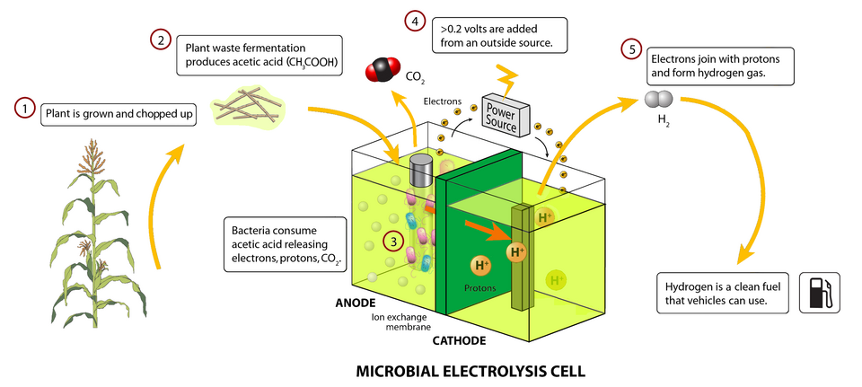

# Electrolysis Cell

> **Node ID**: chemistry.electrolysis-cell
> **Domain**: [Chemistry](./index.md)
> **Dependencies**: [`metals.iron-steel`](../metals/iron-steel.md), [`energy.electricity`](../energy/electricity.md), [`chemistry.electrolysis`](electrolysis.md)
> **Enables**: [`chemistry.alkalis`](alkalis.md), [`metals.aluminum`](../metals/aluminum.md), [`chemistry.hydrogen-silane`](hydrogen-silane.md)
> **Timeline**: Years 15-30
> **Outputs**: chlorine, hydrogen, caustic_soda, aluminum
> **Critical**: Yes — the chlor-alkali cell produces chlorine, hydrogen, and NaOH simultaneously, enabling PVC production, HCl synthesis, semiconductor-grade hydrogen, and aluminum smelting. Electrolysis cells are among the most electricity-intensive industrial equipment.

## Overview

> *Image: Zina Deretsky, National Science Foundation (NSF), User:KVDP, Public domain*

An electrolysis cell drives a non-spontaneous chemical reaction by applying direct current (DC) electricity between two electrodes immersed in an electrolyte. The anode (positive electrode) oxidizes species (loses electrons), while the cathode (negative electrode) reduces species (gains electrons). The minimum voltage required equals the thermodynamic reversible potential (determined by the Nernst equation), plus overpotentials for activation kinetics, concentration polarization, and resistive losses in the electrolyte and electrodes.

For the chlor-alkali process: 2NaCl + 2H₂O → Cl₂ + H₂ + 2NaOH. The reversible potential is approximately 2.2V at 25°C. Actual operating voltage is 3.2-3.8V per cell due to overpotentials and ohmic losses. Current efficiency (fraction of current producing desired product) is 90-97%. Energy consumption: 2,100-2,500 kWh per tonne of Cl₂ produced.

Individual cells operate at 3-4V but draw 5-200 kA current. Cells are stacked in electrical series (50-200 cells) to match available DC supply voltage (200-400V). This bipolar filter-press configuration is the standard industrial arrangement. Three main cell designs serve the chlor-alkali industry: **diaphragm cells** (asbestos or polymer fabric separator, simplest to build), **membrane cells** (ion-exchange membrane, most energy-efficient, requires fluoropolymer chemistry), and **mercury cells** (liquid mercury cathode, historically common but being phased out due to mercury pollution).

Energy efficiency in electrolysis is determined by the ratio of the thermodynamic minimum voltage to the actual operating voltage. For chlor-alkali: thermodynamic minimum ≈ 2.2V, actual operating voltage ≈ 3.2-3.8V. Voltage efficiency = 2.2/3.5 = 63%. The remaining 37% is lost as heat in overpotentials (activation, concentration) and ohmic resistance (electrolyte, electrodes, diaphragm). Current efficiency (fraction of current producing the desired product) further reduces the overall energy efficiency to 60-65% for diaphragm cells and 63-70% for membrane cells.

Cell room design is dominated by electrical and safety considerations. A chlor-alkali plant drawing 200 kA at 400V DC consumes 80 MW of electrical power. Bus bars carrying this current are massive copper bars (200,000 mm² cross-section — multiple 200 × 1000 mm bars in parallel). Magnetic fields around the bus bars are strong enough to attract steel tools and affect pacemakers. The cell room floor must be electrically insulated, and all metal structures within 2 m of the bus bars must be non-ferromagnetic.

## Prerequisites

- **[Electrolysis theory](electrolysis.md)**: Understanding of Faraday's law, Nernst equation, overpotentials, and current efficiency
- **[DC power supply](../energy/electricity.md)**: Rectifier providing 100-400V DC at 5-200 kA — silicon diode or thyristor rectifier
- **[Stainless steel](../metals/iron-steel.md)**: 316L for cell bodies and wetted parts in corrosive electrolyte
- **[Graphite or DSA anodes](electrolysis.md)**: Carbon anodes (consumed at 2-5 kg/t Cl₂) or dimensionally stable anodes (Ti + RuO₂/IrO₂, 5-8 year life)
- **[Gasket materials](../polymers/rubber.md)**: EPDM rubber for cell sealing, PTFE for aggressive chemical resistance

## Bill of Materials

| Material | Quantity | Specifications | Source | Alternatives |
|----------|----------|----------------|--------|-------------|
| [Steel plate](../metals/iron-steel.md) (cell body) | 100-1,000 kg | Carbon steel, 6-12 mm thick | [Iron & Steel](../metals/iron-steel.md) | Concrete (large stationary cells), fiberglass (corrosive) |
| [Graphite electrodes](../metals/iron-steel.md) | 50-500 kg | Electrode grade, 50-100 mm thick × 300-600 mm wide | [Carbon Products](../mining/index.md) | DSA (Ti + RuO₂/IrO₂, 5-8 year life vs 2-5 kg C/tonne Cl₂ for graphite) |
| [Nickel electrodes](../metals/iron-steel.md) | 20-200 kg | Nickel-plated steel or pure Ni sheet | [Iron & Steel](../metals/iron-steel.md) | Steel cathode (adequate for chlor-alkali) |
| [Diaphragm or membrane](../polymers/rubber.md) | 1-20 m² | Asbestos fiber (diaphragm) or ion-exchange membrane (Nafion type) | [Polymers](../polymers/rubber.md) | Polymer fabric (polypropylene) for water electrolysis |
| [Copper bus bar](../metals/iron-steel.md) | 50-500 kg | Electrolytic tough pitch copper, sized for current density <1.5 A/mm² | [Iron & Steel](../metals/iron-steel.md) | Aluminum bus (lighter but higher resistance) |
| [EPDM rubber gaskets](../polymers/rubber.md) | 1 set | 3-6 mm thick, die-cut to cell frame shape | [Elastomers](../polymers/rubber.md) | Neoprene (lower temperature limit) |
| [Bolts and tie rods](../metals/steelmaking.md) | 50-200 kg | Stainless steel 316, sized for compression force | [Fasteners](../metals/steelmaking.md) | — |
| [Titanium mesh](../metals/iron-steel.md) | 10-100 kg | Expanded or woven, for DSA substrate | [Iron & Steel](../metals/iron-steel.md) | — (only for DSA anodes) |
| [DC power supply](../energy/electricity.md) | 1 unit | Thyristor or IGBT rectifier, 100-400V, 5-200 kA | [Electricity](../energy/electricity.md) | Motor-generator set (older technology) |

## Process Description

### Chlor-Alkali Diaphragm Cell

1. **Fabricate cell body**: Weld a rectangular steel tank (1-2 m wide × 0.5-1 m deep × 2-3 m long) from 6-12 mm carbon steel plate. The cell must be electrically insulated from ground — mount on ceramic or rubber insulators. Weld internal brackets for electrode mounting and diaphragm support. Install brine inlet, Cl₂ outlet (anode side), H₂ outlet and NaOH outlet (cathode side) nozzles.

2. **Prepare cathode assembly**: Fabricate a perforated steel mesh or screen (2-3 mm wire, 3-5 mm openings) sized to fit inside the cell body as a vertical divider. This mesh serves as both cathode (where H₂ evolves and NaOH forms) and diaphragm support. Weld a steel frame around the mesh perimeter for structural support.

3. **Deposit asbestos diaphragm**: Prepare an asbestos fiber slurry (10-20 g/L in water). Place the cathode mesh in a vacuum chamber. Draw the asbestos slurry through the mesh by applying vacuum on one side. Asbestos fibers deposit on and within the mesh to form a 1-3 mm thick permeable layer. The diaphragm allows Na⁺ ions and water to pass but retards OH⁻ back-migration and prevents Cl₂/H₂ mixing. Cure at 100-120°C. Diaphragm life: 6-12 months before replating.

4. **Install anodes**: Mount graphite anode plates (50-100 mm thick, 300-600 mm wide, 600-1,200 mm tall) on copper bus bars inside the anode compartment. Multiple plates in parallel. Anode spacing: 10-20 mm from diaphragm surface. Alternative: mount DSA anodes (titanium mesh coated with RuO₂/IrO₂ mixed metal oxide, 5-15 µm coating) for longer life (5-8 years vs. graphite consumption at 2-5 kg per tonne Cl₂).

5. **Assemble cell**: Place the cathode-diaphragm assembly inside the cell body, dividing it into anode and cathode compartments. Install gaskets between the cathode frame and the cell body flanges. Bolt the cell cover in place. Ensure all gas passages are sealed — Cl₂ and H₂ must never mix (explosive at 4-93% H₂ in Cl₂).

  6. **Connect electrical bus**: Weld copper bus bars to the anode mounting frame (positive terminal) and the cathode mesh (negative terminal). Size bus bars for the design current: cross-section (mm²) = current (A) / 1.5 (A/mm² maximum current density for copper). Connect to the DC power supply via flexible braided copper jumpers.

  **Strengths:**
  - Simplest cell design — steel tank with asbestos-deposited cathode and graphite anodes
  - Tolerates impure brine (Ca²⁺, Mg²⁺ <50 ppm) without membrane damage
  - Lowest capital cost of the three chlor-alkali cell types
  - Well-established technology with decades of operating data

  **Weaknesses:**
  - Produces dilute NaOH (10-12%) requiring evaporation to 50% — adds steam cost and evaporation equipment
  - Asbestos diaphragm is a carcinogen — handling during deposition and replacement requires P100 respirator
  - Diaphragm life only 6-12 months before replating — frequent maintenance shutdowns
  - NaOH product contains 15% NaCl — unacceptable for some applications (rayon, pharmaceutical)

### Chlor-Alkali Membrane Cell

7. **Assemble filter-press membrane cell**: Stack alternating anode and cathode compartments separated by ion-exchange membrane sheets (perfluorinated sulfonic acid, Nafion type, 100-200 µm thick). Each compartment has an electrode (DSA anode, nickel cathode) and flow channels for electrolyte. The membrane allows Na⁺ through but blocks Cl⁻ and OH⁻. Compress the entire stack between thick steel end plates with tie rods.

8. **Connect brine and caustic circuits**: Feed ultra-purified brine (Ca²⁺, Mg²⁺ <20 ppb) to the anode compartments. Feed dilute NaOH to the cathode compartments. Cl₂ gas exits the anode; H₂ gas and 30-35% NaOH exit the cathode. The membrane produces higher-purity NaOH directly — no evaporation required as with diaphragm cells.

  9. **Install SEM Tech membrane alternative**: For bootstrap applications where Nafion is unavailable, [SEM Tech](sem-tech.md) membranes (pulverized ion-exchange resin in PVC/CPVC binder, <$1/ft² vs. $500-2,000/m² for Nafion) can substitute. Performance: months to ~1 year of continuous use at pH 0, ORP >1.5V. Shorter life but dramatically lower cost and simpler manufacturing. Cut SEM Tech membrane sheets to cell frame dimensions. The membrane is thicker (0.5-2 mm) than Nafion (0.1-0.2 mm), so adjust gasket thickness to maintain the correct electrode gap (8-15 mm). Handle SEM Tech membranes carefully — they are less mechanically robust than Nafion and can tear during installation.

  **Strengths:**
  - Produces 30-35% NaOH directly — no evaporation required for most applications
  - Lowest energy consumption of the three chlor-alkali types (2,100-2,500 kWh/t Cl₂)
  - NaOH product contains <50 ppm NaCl — suitable for high-purity applications
  - Current efficiency 93-97% — highest of the three types

  **Weaknesses:**
  - Requires ultra-pure brine (Ca²⁺, Mg²⁺ <20 ppb) — demands ion exchange polishing step
  - Nafion membrane costs $500-2,000/m² and must be replaced every 2-4 years
  - Filter-press cell stack is mechanically complex — many gaskets, tie rods, and fluid connections
  - Membrane contamination by hardness ions causes irreversible performance loss

### Alkaline Water Electrolysis Cell

10. **Fabricate electrode plates**: Cut nickel-plated steel or pure nickel plates (1-3 mm thick, 200-1,000 mm square or rectangular) to serve as bipolar electrodes. In a bipolar stack, each plate is the cathode of one cell on one face and the anode of the adjacent cell on the other face. Drill or punch flow channels for electrolyte and gas passage.

11. **Prepare electrolyte**: Dissolve KOH (potassium hydroxide) in deionized water to 25-30% concentration (specific gravity 1.23-1.28). KOH is preferred over NaOH for water electrolysis because it has higher conductivity. The electrolyte is not consumed — only water is split.

12. **Assemble filter-press stack**: Stack alternating electrode plates and diaphragm separators (asbestos cloth, polypropylene fabric, or polysulfone membrane, 0.5-2 mm thick) between two thick steel end plates. Insert EPDM gaskets between each plate and diaphragm to seal the electrolyte channels. Compress the entire stack with tie rods through the end plates. Tighten in cross-pattern to achieve uniform gasket compression.

13. **Connect electrolyte manifolds**: Pipe the KOH electrolyte to feed manifolds on the stack. Each cell in the stack receives electrolyte in parallel. Gas outlets at the top of each cell carry H₂ (cathode side) and O₂ (anode side) to separate gas-liquid separators.

  14. **Install gas-liquid separators**: Two vertical steel tanks (one for H₂, one for O₂) separate gas from entrained electrolyte. Gas rises to the top and exits through a demister pad (removes KOH mist). Liquid KOH returns to a circulation tank and is pumped back to the stack. Electrolyte circulation removes waste heat and maintains concentration.

  **Strengths:**
  - Produces high-purity hydrogen (>99.5%) and oxygen without chlorine — simpler gas handling than chlor-alkali
  - KOH electrolyte is not consumed — only water is split, reducing operating cost
  - Nickel electrodes have long life (10+ years) with no consumption or coating degradation
  - Scalable from small (0.2 Nm³/h) to large (2,000+ Nm³/h) by adding cells to the stack

  **Weaknesses:**
  - Higher energy consumption per unit of product than chlor-alkali (50-55 kWh/kg H₂)
  - KOH electrolyte is corrosive (25-30% concentration) — requires corrosion-resistant materials throughout
  - Cell voltage (1.8-2.2V) is sensitive to electrolyte purity — iron and carbonate contamination increase resistance
  - Hydrogen output pressure is low (1-30 bar) — mechanical compression needed for storage applications

### Commissioning

15. **Pressure test**: Fill all compartments with water. Pressurize to 1.5× design pressure. Hold 30 minutes. Inspect all gaskets, welds, and connections. Zero leaks acceptable. For electrolysis cells, even small leaks allow gas mixing — this is a critical safety hazard.

16. **Electrolyte fill**: Fill with process electrolyte (saturated brine for chlor-alkali, 25-30% KOH for water electrolysis). Purge all air from the system with nitrogen before applying voltage.

17. **Apply voltage at low current**: Energize the DC supply at 20-50% of rated current. Verify gas production at both electrodes: Cl₂ (greenish-yellow, pungent) at the anode, H₂ (colorless, flammable) at the cathode for chlor-alkali; H₂ at the cathode, O₂ at the anode for water electrolysis. Verify gas purity by sampling.

18. **Ramp to full current**: Increase current to design value over 1-4 hours while monitoring cell voltage, current, temperature, and gas production rate. Cell voltage should stabilize at 3.2-3.8V (chlor-alkali) or 1.8-2.2V (water electrolysis) per cell.

## Calibration and Verification

1. **Current efficiency**: Measure actual Cl₂ or H₂ production rate (gas flow meter). Calculate theoretical production: Faraday's law — 1 Faraday (96,485 C) produces 1 equivalent of product. Current efficiency = actual production / theoretical production × 100%. Acceptable: 90-97%. Below 85% indicates side reactions, diaphragm failure, or short circuits.

2. **Cell voltage monitoring**: Record voltage across each cell in the stack at operating current. All cells should be within ±0.1V of the average. A cell with significantly higher voltage has higher resistance (scale, blockage, electrode damage) and will overheat. A cell with significantly lower voltage may be short-circuited (diaphragm failure, gas mixing).

3. **Gas purity test**: Sample H₂ from the cathode and Cl₂ or O₂ from the anode. H₂ purity must be >99.5% (main impurity: O₂ traces). Cl₂ purity must be >97% (main impurities: O₂, CO₂, H₂). Gas mixing is an immediate safety hazard — shut down if H₂ appears in the Cl₂/O₂ stream above 2%.

## Operating Procedure (Chlor-Alkali Diaphragm Cell)

1. **Brine preparation**: Dissolve salt (NaCl) in hot water to achieve 25-26% concentration (310-340 g/L at 25°C). Purify the brine: add Na₂CO₃ to precipitate CaCO₃, add NaOH to precipitate Mg(OH)₂, add BaCl₂ if sulfate exceeds 5 g/L. Filter through sand or leaf filters. For membrane cells: pass through chelating resin to reduce Ca²⁺ + Mg²⁺ to <20 ppb. Heat the purified brine to 70-80°C before feeding the cells.
2. **Cell startup**: Verify all gas connections are sealed. Purge the anode and cathode compartments with nitrogen. Fill the anode compartment with purified brine. Fill the cathode compartment with dilute NaOH (if starting cold). Apply DC voltage at 20-50% of rated current. Verify gas production: Cl₂ at the anode (greenish-yellow), H₂ at the cathode (colorless). Sample both gas streams for purity.
3. **Steady-state operation**: Ramp current to design value over 1-4 hours. Monitor cell voltage (3.2-3.8V per cell), temperature (80-90°C), and gas production rates. Feed brine continuously to maintain the anode compartment level. Withdraw NaOH solution from the cathode compartment at a rate that maintains 10-12% concentration (diaphragm cell) or 30-35% (membrane cell). Collect Cl₂ and H₂ gases separately for downstream processing.
4. **Cell monitoring**: Record individual cell voltages every 4-8 hours. All cells should be within ±0.1V of the average. A high-voltage cell has increased resistance (check for blockage, diaphragm fouling, or electrode damage). A low-voltage cell may be shorted (check for diaphragm failure — test for H₂ in Cl₂ stream).
5. **Normal shutdown**: Reduce current to 20% over 1 hour. Stop the brine feed. Drain the cell compartments. Purge with nitrogen. Disconnect DC power. Lock out the rectifier.
6. **Emergency shutdown**: If Cl₂ is detected in the cell room (>1 ppm alarm, >10 ppm IDLH), activate the emergency NaOH scrubber, evacuate the cell room, and shut down the DC power immediately. If H₂ is detected in the Cl₂ stream (>2%), shut down immediately — H₂/Cl₂ mixtures are explosive over 4-93% H₂ in Cl₂.

## Quantitative Parameters

| Parameter | Chlor-Alkali Diaphragm | Chlor-Alkali Membrane | Alkaline Water |
|-----------|----------------------|----------------------|----------------|
| Cell voltage | 3.5-4.0V | 3.0-3.5V | 1.8-2.2V |
| Current density | 1-3 kA/m² | 2-5 kA/m² | 2-4 kA/m² |
| Current efficiency | 90-95% | 93-97% | 95-99% |
| Energy consumption | 2,300-2,800 kWh/t Cl₂ | 2,100-2,500 kWh/t Cl₂ | 50-55 kWh/kg H₂ |
| Operating temperature | 80-90°C | 80-90°C | 60-90°C |
| NaOH concentration (product) | 10-12% (requires evaporation) | 30-35% (direct use) | N/A |
| Electrode life | Graphite: continuous consumption; DSA: 5-8 years | DSA: 5-8 years | Nickel: 10+ years |
| Diaphragm/membrane life | 6-12 months (asbestos) | 2-4 years (Nafion) | 5-10 years (polymer fabric) |
| Cells per stack | 10-100 | 10-100 | 50-200 |
| Production rate (per cell) | 0.5-5 kg Cl₂/h | 0.5-5 kg Cl₂/h | 0.2-2 Nm³ H₂/h |

## Scaling Notes

- **Cell count scaling**: Production rate is directly proportional to total current. To double chlorine production, double the number of cells in the stack (at constant current per cell) or double the electrode area (at constant current density). Series stacking increases voltage but keeps current constant.
- **Current density optimization**: Higher current density increases production per unit area but also increases cell voltage (higher ohmic losses, higher overpotentials). The economic optimum balances production revenue against electricity cost. Typical optimum: 2-3 kA/m² for membrane cells at electricity prices of $0.05-0.10/kWh.
- **Brine purification scaling**: Membrane cells require ultra-pure brine (Ca²⁺, Mg²⁺ <20 ppb). As cell count increases, the brine purification system must scale proportionally. The ion exchange polishing step is often the bottleneck — size chelating resin beds for the full plant flow rate.
- **Heat management**: At 3.5V and 200 kA, a single chlor-alkali cell dissipates ~100 kW as waste heat (the excess voltage above the thermodynamic minimum). At 100 cells, total waste heat is ~10 MW. Cell room ventilation and electrolyte cooling systems must handle this heat load.
- **Gas handling scaling**: Cl₂ gas from a large cell room (100+ cells) can exceed 10 tonnes/day. The gas handling system (cooling, drying, compression, and liquefaction) must be sized for the full production rate. Cl₂ compressors require materials resistant to wet chlorine (titanium, Hastelloy C, or FRP).
- **Electrolyte management**: For alkaline water electrolysis, the KOH electrolyte is not consumed but accumulates impurities over time (iron, carbonate, chloride). Schedule electrolyte replacement every 5-10 years. For chlor-alkali, the brine is continuously recycled through the purification system — maintain the chemical addition rates (Na₂CO₃, NaOH, BaCl₂) proportional to the feed rate.

## Troubleshooting

| Problem | Probable Cause | Solution |
|---------|---------------|----------|
| Cell voltage rising above 4.0V per cell | Electrode gap widening from graphite consumption; diaphragm clogging from Ca²⁺/Mg²⁺ precipitation; brine concentration below 25% | Replace consumed graphite anodes or adjust electrode gap; clean or replace diaphragm; verify brine purification system (Na₂CO₃ for Ca, NaOH for Mg, BaCl₂ for sulfate >5 g/L); maintain NaCl at 25-26% |
| NaOH contaminated with NaCl (diaphragm cell) | Diaphragm too thin or breached; insufficient evaporation | Replate diaphragm (6-12 month cycle); verify triple-effect evaporators are crystallizing NaCl; check for diaphragm tears |
| H₂ detected in Cl₂ stream (>2%) | Diaphragm or membrane failure allowing gas crossover; pressure imbalance between anode and cathode compartments | Shut down immediately — H₂/Cl₂ mixture is explosive at 4-93%; replace failed diaphragm or membrane; verify pressure balance (cathode slightly positive relative to anode) |
| Current efficiency below 85% | Side reactions (O₂ evolution at anode instead of Cl₂); OH⁻ back-migration through diaphragm; short circuits between electrodes | Check brine purity (sulfate >5 g/L promotes O₂ evolution); verify diaphragm integrity; inspect for metallic bridges between electrodes; measure individual cell voltages |
| Electrolyte temperature exceeding 95°C | Excessive current density; inadequate electrolyte circulation; heat exchanger fouling | Reduce current to lower heat generation; increase electrolyte circulation rate; clean heat exchanger; verify temperature control system |
| Gas purity below specification | Diaphragm/membrane degradation allowing gas mixing; electrolyte carryover in gas stream; air leak into gas system | Replace diaphragm or membrane; install or clean demister pads in gas separators; check gas piping for air leaks (soap test all connections) |
| Anode coating loss (DSA) | Fluoride or organic contamination in brine attacking RuO₂/IrO₂ coating; excessive current density causing anodic dissolution | Improve brine purification (remove fluoride sources); reduce current density to design range; inspect DSA coating with microscope during annual shutdown — recoat when coating loss exceeds 30% |
| Cathode hydrogen overpotential increasing | Nickel cathode surface roughening or contamination with iron or mercury; loss of catalytic coating | Clean cathode with dilute HCl to remove iron deposits; test for mercury contamination (amalgam formation increases overpotential); re-apply catalytic coating (Raney nickel) during scheduled maintenance |

## Safety

- **Chlorine gas**: Cl₂ is toxic (IDLH 10 ppm, immediately dangerous to life and health). Yellow-green gas, heavier than air, causes severe respiratory damage. Continuous Cl₂ monitoring with alarm at 1 ppm. Emergency scrubbing system (NaOH circulation tower) to neutralize any Cl₂ release. Full-face respirator with acid gas cartridges available at all cell room exits.
- **Hydrogen gas**: H₂ forms explosive mixtures with air at 4-75% concentration. Ignition energy as low as 0.02 mJ. Ventilate cell rooms to keep H₂ below 1% (25% of LEL). Bond and ground all metal. Explosion-proof electrical equipment. Never allow H₂ and Cl₂ or O₂ to mix.
- **High DC voltage**: Stacks at 200-400V DC present electrocution hazard. Insulate all bus bars and connections. Lockout/tagout before any cell maintenance. Use insulated tools. Post warning signs.
- **Caustic burns**: NaOH at 10-35% causes severe skin and eye burns. Chemical-resistant gloves, face shield, apron. Eyewash and safety shower within 10 seconds travel.
- **Asbestos handling**: Diaphragm cells use asbestos fiber — a known carcinogen. Use respirator with P100 filter during diaphragm deposition and replacement. Wet methods to suppress dust. Enclosed vacuum system for fiber handling.

## Quality Control

- **NaOH concentration**: Measure product NaOH by titration with standard HCl. Diaphragm cell: 10-12% NaOH (pre-evaporation). Membrane cell: 30-35% NaOH. NaCl contamination: <50 ppm for membrane cell, ~15% for diaphragm cell (removed by evaporation).
- **Cl₂ purity**: Sample Cl₂ gas and analyze by gas chromatography or Orsat analyzer. Acceptable: >97% Cl₂, <2% O₂, <0.5% H₂, <0.5% CO₂. H₂ above 2% is a critical safety hazard.
- **H₂ purity**: Sample H₂ gas. Acceptable: >99.5% H₂, <0.5% O₂. For semiconductor-grade hydrogen, further purification to >99.999% is required via catalytic recombination and PSA.
- **Current efficiency tracking**: Calculate daily current efficiency from production rate vs. total charge passed (Faraday's law). Trend this value. A decline of >2% from baseline indicates developing problems (diaphragm degradation, electrode fouling).
- **Electrolyte composition**: For chlor-alkali, measure brine NaCl concentration daily (target 25-26%). For alkaline water electrolysis, measure KOH concentration monthly (target 25-30%, specific gravity 1.23-1.28). Dilution from water feed or concentration from evaporation shifts the operating point.
- **Electrode condition**: Graphite anodes should be inspected monthly for consumption rate. Measure anode thickness at a reference point. DSA anodes require no regular measurement but should be inspected for coating damage during annual shutdown.
- **Diaphragm/membrane integrity**: For diaphragm cells, monitor the NaCl contamination level in the NaOH product. Rising NaCl indicates diaphragm thinning. For membrane cells, monitor NaOH concentration — a drop below 30% suggests membrane damage.

## Variations and Alternatives

- **Membrane cell**: Replaces the asbestos diaphragm with an ion-exchange membrane (perfluorinated sulfonic acid, 100-200 µm thick). Produces 30-35% NaOH directly (no evaporation needed). Lower energy consumption (2,100-2,500 vs. 2,300-2,800 kWh/t Cl₂). Requires ultra-pure brine (Ca²⁺, Mg²⁺ <20 ppb). The membrane itself requires fluoropolymer chemistry (Nafion) — not available until the polymer industry is mature.
- **PEM electrolysis**: Proton exchange membrane replaces liquid KOH electrolyte. Higher current density (5-20 kA/m²), more compact, >99.99% H₂ purity. Requires Nafion membrane and platinum catalyst — not bootstrap-appropriate until fluoropolymer chemistry is established.
- **Hall-Héroult aluminum cell**: A specialized electrolysis cell operating at 950-1000°C in molten cryolite (Na₃AlF₆). Carbon anodes consumed as reactant. 4.0-4.5V per cell, 150-400 kA. See [Electrolysis](electrolysis.md) for detailed Hall-Héroult cell construction.
- **Downs sodium cell**: Molten NaCl electrolysis at 580-600°C (NaCl-CaCl₂ eutectic). Produces sodium metal and chlorine. Steel cell, carbon anode, iron cathode. 4-6V, 30-40 kA. Sodium metal used for titanium reduction (Kroll process) and organic synthesis.
- **Electrodialysis**: Uses ion-exchange membranes to desalinate water or concentrate ionic solutions. Alternating cation and anion exchange membranes create alternating concentrate and diluate compartments. No electrodes in the process stream (only at the ends of the stack). Energy consumption: 0.5-3.0 kWh/m³ for brackish water desalination. Not a replacement for chlor-alkali but complementary for water treatment.
- **Mercury cell (historical)**: Liquid mercury cathode forms sodium amalgam (Na-Hg), which is decomposed in a separate reactor with water to produce NaOH and H₂. Produced 50-73% NaOH directly. Phaseout due to mercury pollution (Minamata Convention 2017). Remaining plants converted to membrane cells. Documented here for understanding legacy installations.

## References

- [Electrolysis](electrolysis.md) — electrochemical theory and all process variants
- [Alkalis](alkalis.md) — NaOH and KOH production and uses
- [Hydrogen and Silane](hydrogen-silane.md) — hydrogen purification and semiconductor applications
- [SEM Tech](sem-tech.md) — low-cost ion exchange membrane manufacturing
- [SEM Tech Water Electrolysis](sem-tech-water-electrolysis.md) — PEM hydrogen production with SEM Tech membranes
- [Water Treatment](water-treatment.md) — chlor-alkali products used in water treatment
- [Chemical Recovery](chemical-recovery.md) — electrolytic recovery of metals from process streams
- [Fermentation](fermentation.md) — fermentation products may require electrolytic processing

## Cell Room Design Requirements

A chlor-alkali cell room housing 100 membrane cells at 200 kA total current requires:

- **Floor space**: 30 × 15 m = 450 m² (cells, bus bars, gas separators, brine system)
- **Electrical**: 80 MW rectifier room adjacent to cell room, with transformer and harmonic filters
- **Ventilation**: 6-12 air changes per hour to prevent H₂ accumulation. H₂ detectors at ceiling level (H₂ rises) and Cl₂ detectors at floor level (Cl₂ sinks). Emergency NaOH scrubber sized to absorb the entire cell room Cl₂ inventory in 30 minutes.
- **Floor**: Electrically insulated (rubber or epoxy coating over concrete). Non-sparking surfaces. Drainage to a contained sump for chemical spill capture.
- **Bus bar routing**: Copper bus bars (total cross-section ~300,000 mm²) run along the cell row. Magnetic field at 1 m distance from 200 kA bus: ~40 mT — keep steel tools and pacemakers at least 2 m away.
- **Gas handling**: Separate titanium or FRP piping for Cl₂ (anode) and steel piping for H₂ (cathode). Cl₂ line includes a cooling tower, drying tower (H₂SO₄), and compressor. H₂ line includes a water separator and optional purification unit.
- **Safety systems**: Emergency NaOH scrubber (automatic activation on Cl₂ detection), H₂ flashback arrestors on all gas lines, and automatic cell shutdown on high voltage, low flow, or gas detection alarms. All safety systems must be fail-safe (de-energize to trip).

## Membrane Selection and Care

The ion-exchange membrane is the most critical and expensive component of a membrane electrolysis cell (accounting for 30-40% of cell capital cost). Membrane lifetime is 2-4 years under normal operation. Failure modes include:

- **Mechanical damage**: Tears, pinholes, or abrasion from improper installation or gas bubble impingement. Install with careful handling — no sharp tools, no folding. Membrane tension must be even across the cell frame.
- **Chemical degradation**: Membranes are designed for specific pH and temperature ranges. Operating outside these limits (e.g., feed brine pH < 2 or > 12, temperature > 95°C) accelerates polymer chain scission and loss of ion-exchange capacity.
- **Contamination**: Hardness ions (Ca²⁺, Mg²⁺) in the feed brine precipitate inside the membrane structure as hydroxides, blocking ion transport. Brine must be purified to <20 ppb Ca²⁺ and <10 ppb Mg²⁺ before entering the cell. This requires secondary brine purification (ion exchange) after primary salt dissolution and settling.
- **Drying out**: The membrane must remain fully hydrated. Operating below minimum current density (typically 1.5 kA/m²) allows the membrane to dry on the anode side, causing irreversible damage. Never shut down a cell without flooding both compartments.

## Energy Consumption Benchmarks

| Cell Type | Voltage (V) | Current Efficiency (%) | Energy (kWh/t NaOH) | Notes |
|-----------|-------------|----------------------|---------------------|-------|
| Diaphragm cell | 2.2-2.5 | 95-96 | 2,300-2,600 | Low capital, high steam for concentration |
| Membrane cell (bipolar) | 2.9-3.2 | 95-97 | 2,100-2,300 | Modern standard, low steam |
| Membrane cell (monopolar) | 3.0-3.4 | 95-97 | 2,200-2,400 | Simpler electrical connection |
| Oxygen depolarized cathode (ODC) | 1.8-2.1 | 95-97 | 1,400-1,600 | 30% less energy, requires pure O₂ feed |

---
*Part of the [Bootciv Tech Tree](../index.md) • [Chemistry](./index.md) • [All Domains](../index.md)*
