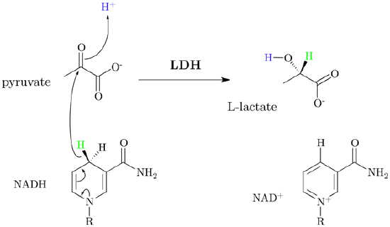

# Fermentation Chemistry

> **Node ID**: chemistry.petroleum-alternatives.fermentation
> **Domain**: [Chemistry](./index.md)
> **Dependencies**: [`Solvent Production`](solvents.md), [`Brewing & Distilling`](../food-processing/brewing.md), [`Food Preservation`](../food-processing/preservation.md)
> **Enables**: [`Petroleum & Alternative Chemistry`](petroleum-alternatives.md)
> **Timeline**: Years 10-30
> **Outputs**: ethanol, acetone, butanol, acetic_acid, methanol
> **Critical**: No

## Overview

> *Image: Unknown authorUnknown author, CC BY-SA 4.0*

Microbial and chemical production of solvents and fuels without petroleum: ethanol via grain malting/mashing/fermentation/distillation, acetone-butanol via Weizmann process (Clostridium acetobutylicum), acetic acid via vinegar oxidation or catalytic route, methanol from wood pyrolysis or synthesis gas. Critical non-petroleum chemical feedstock path.

Primary outputs: `ethanol`, `acetone`, `butanol`, `acetic_acid`, `methanol`. These materials or products serve as inputs for downstream manufacturing and processing steps.

Fermentation chemistry is the biological route to chemical feedstocks that would otherwise require petroleum. Before the petrochemical industry existed, all industrial solvents came from fermentation and wood distillation. The Weizmann process, developed during World War I to produce acetone for cordite manufacture, demonstrated that bacteria could produce industrial quantities of specific chemicals. This process also produces butanol, which became valuable as a lacquer solvent for the automobile industry.

Ethanol is the highest-volume fermentation product. It serves as a solvent, a fuel, a feedstock for ethylene production (via dehydration), and a precursor for ethyl ether and ethyl esters. The choice of feedstock determines the economics: grain (wheat, corn) provides starch that is easily converted to sugar, while cellulosic feedstocks (wood, straw) require more complex pretreatment to break down lignin and hemicellulose before the cellulose can be fermented.

Acetic acid from vinegar fermentation is limited to dilute concentrations (typically below 15%) because the bacteria are inhibited by their own product at higher concentrations. For industrial concentrations (>90%), catalytic routes (methanol carbonylation or acetaldehyde oxidation) are required. The vinegar route is valuable for food-grade acetic acid and for situations where high-purity industrial chemicals are not needed.

## Prerequisites

### Materials

- Biomass — grain (wheat, corn, barley), starch sources, or cellulosic feedstock
- Chemicals — malt enzymes or fungal amylase for starch saccharification, nutrient supplements (nitrogen, phosphorus)
- Microorganism cultures — yeast (Saccharomyces), Clostridium acetobutylicum (for ABE), Acetobacter (for vinegar)

### Equipment

- [Solvent Production](solvents.md) — material dependency
- [Brewing & Distilling](../food-processing/brewing.md) — tool dependency
- [Food Preservation](../food-processing/preservation.md) — tool dependency
- Fermentation vessels with temperature control and venting
- Distillation apparatus (pot still or continuous column)
- Mash tun and lautering equipment for starch conversion

### Knowledge

- Microbiology fundamentals: yeast and bacterial metabolism, anaerobic vs aerobic respiration, and how metabolic pathways determine fermentation products
- Saccharification chemistry: converting starch to fermentable sugars using malt enzymes or fungal amylase, and how mash temperature affects enzyme activity
- Distillation principles: fractional distillation cuts, azeotrope behavior (ethanol-water at 95.6%), and reflux ratio control for product purity
- Sterile technique: preventing contamination by wild yeast, lactic acid bacteria, and mold that would outcompete the production organism

### Infrastructure

- CO₂ venting for enclosed fermentation areas — fermentation produces large volumes of carbon dioxide that displace oxygen and create asphyxiation risk in poorly ventilated spaces
- Heating for mash preparation (gelatinization at 65-70°C) and distillation (energy is the dominant operating cost)
- Large volumes of cooling water for fermenter temperature control and condenser operation
- Sterile area for culture maintenance and inoculation, separate from the main production floor
- Stillage (spent grain) handling — can be dried and sold as animal feed, reducing waste disposal costs

## Process Description

Industrial fermentation covers several distinct microbial processes. Ethanol production uses Saccharomyces yeast to convert sugars to ethanol and CO₂ under anaerobic conditions. The Weizmann process uses Clostridium acetobutylicum to produce a mixture of acetone, butanol, and ethanol (ABE fermentation) from starch. Acetic acid production proceeds via Acetobacter bacteria oxidizing ethanol to acetic acid (the vinegar process). Each organism has specific temperature, pH, nutrient, and sterility requirements that must be maintained throughout the fermentation.

### Step-by-Step Procedure

1. Prepare the growth medium: gelatinize starch by cooking with water (mashing at 65-70°C), then saccharify using malt enzymes (barley malt) or fungal amylase to produce fermentable sugars. For ABE fermentation, the medium must contain sufficient starch without excessive sugar concentration that would inhibit Clostridium growth.
2. Sterilize the fermentation vessel and medium by heating (pasteurization at 72°C for 15 seconds, or autoclaving at 121°C for spore-forming contaminants). Contaminating organisms compete for substrate and may produce off-products that ruin the batch.
3. Inoculate with the selected microorganism culture (yeast, Clostridium, or Acetobacter). Maintain a pure culture — cross-contamination between fermentation types produces unusable mixed products.
4. Control fermentation conditions: temperature within the organism's optimal range (25-30°C for yeast, 35-37°C for Clostridium), anaerobic conditions for ethanol and ABE, aerobic conditions for acetic acid. Monitor pH — fermentation produces acids that self-limit growth if not controlled.
5. Allow fermentation to proceed to completion (2-7 days depending on organism and product). Monitor specific gravity (ethanol) or gas production rate (ABE) to track progress.
6. Separate the product from the fermentation broth. Distill ethanol and butanol from the liquid. Acetone comes off in the distillation as well. Filter or settle the cell mass.
7. Further purify by fractional distillation to achieve the desired product purity. Note that ethanol forms an azeotrope with water at 95.6% — anhydrous ethanol requires additional dehydration (molecular sieves or azeotropic distillation with cyclohexane).

### Process Parameters

| Parameter | Value | Notes |
|-----------|-------|-------|
| Yeast fermentation temperature | 25-30°C (optimal 28°C) | Above 35°C yeast dies; below 20°C fermentation slows dramatically. Exothermic — large fermenters generate 3-5 kW per 1000 L |
| Clostridium ABE temperature | 35-37°C (narrow window ±1°C) | Below 33°C shifts metabolism to acid production instead of solvents; above 38°C culture dies |
| Acetobacter (vinegar) temperature | 28-32°C | Aerobic — requires forced aeration at 0.5-1.0 vvm (volumes air per volume liquid per minute) |
| Yeast fermentation pH | 3.5-5.5 (optimal 4.0-4.5) | Yeast tolerates acidity; pH below 3.0 stalls fermentation |
| Clostridium ABE pH | 5.0-6.5 (initial), shifts to 4.0-4.5 (solvent phase) | Acidogenic phase pH 5.5-6.0; solventogenesis triggers at pH ~4.5 — critical metabolic switch |
| Sugar concentration (yeast) | 15-25° Plato (150-250 g/L) | Higher concentrations cause osmotic stress; above 300 g/L yeast activity ceases |
| Starch concentration (ABE) | 50-80 g/L total carbohydrates | Clostridium is inhibited by sugar concentrations above 60-80 g/L |
| Ethanol tolerance (yeast) | 12-18% ABV (most strains) | Turbo yeast reaches 20%; above tolerance yeast self-destructs. Fortified wines bypass this limit by adding neutral spirit |
| Butanol tolerance (Clostridium) | 12-15 g/L (1.2-1.5% w/v) | Butanol is toxic to producing organism at far lower concentrations than ethanol — limits ABE batch concentration |
| Yeast fermentation time | 2-5 days (batch) | Faster at higher temperature and with nutrient supplementation |
| ABE fermentation time | 3-7 days (batch) | Slower than yeast; 3:6:1 butanol:acetone:ethanol product ratio typical |
| Ethanol yield (yeast, theoretical) | 0.511 g ethanol / g glucose (100%) | Practical yield: 90-95% of theoretical (0.46-0.49 g/g) due to biomass and byproduct formation |
| Mashing temperature (starch saccharification) | 63-68°C for 60-90 min | α-amylase active at 65-72°C (liquefaction); β-amylase active at 60-65°C (saccharification). Step mash optimizes both |
| Sterilization | 72°C for 15 s (pasteurization) or 121°C for 15 min at 15 psi (autoclave) | Autoclave required for spore-forming contaminants; pasteurization sufficient for bulk mash |
| Distillation energy | 2.5-3.5 MJ/L ethanol (single-effect) | Multi-effect distillation cuts this 40-60%; stillage heat recovery saves additional 15-25% |
| CO₂ production rate (yeast) | ~0.96 g CO₂ per g ethanol produced | 1 mol glucose → 2 mol ethanol + 2 mol CO₂. In sealed rooms, displaces oxygen — asphyxiation hazard above 5% CO₂ |

## Safety Considerations

This process involves specific hazards requiring trained personnel and protective measures:

- **Ethanol flammability**: Ethanol solutions above 20% ABV are flammable. Flash point of pure ethanol: 13°C (55°F); LEL 3.3%, UEL 19% in air. Distillation concentrates ethanol to the point where vapors can ignite. All distillation equipment must be well-ventilated and separated from ignition sources. Auto-ignition temperature: 363°C.
- **CO₂ asphyxiation**: Fermentation produces ~0.96 g CO₂ per g ethanol. CO₂ IDLH 40,000 ppm (4%); PEL 5,000 ppm (8-hr TWA). At 7% CO₂, unconsciousness occurs within minutes. CO₂ is odorless and heavier than air (density 1.52× air) — it pools in low-lying areas, pits, and basement fermenter rooms. Ventilation must provide ≥6 air changes per hour in enclosed fermentation areas.
- **Acetone and butanol toxicity**: Both are central nervous system depressants and flammable solvents. Acetone PEL 1,000 ppm (8-hr TWA); n-butanol PEL 100 ppm (ceiling). n-Butanol causes eye irritation at 50 ppm. ABE fermentation product handling requires the same precautions as solvent manufacturing. Acetone flash point −20°C; n-butanol flash point 35°C.
- **Biological hazards**: While production organisms (yeast, Clostridium, Acetobacter) are not pathogenic, contaminated batches can harbor unknown organisms. Clostridium species can include C. botulinum in contaminated feedstock (spore-forming, toxin-producing). Practice good hygiene and dispose of spent culture safely. Autoclave all waste culture at 121°C for 30 min before disposal.
- **Pressure buildup**: Fermentation vessels producing CO₂ must be vented or pressure-regulated. A 10,000 L fermenter producing 5% ABV ethanol generates ~4,800 L of CO₂ over the fermentation period. Sealed vessels can rupture from gas accumulation. All sealed vessels must have pressure relief devices rated to 1.5× design pressure.

### Personal Protective Equipment

- Chemical splash goggles and face shield when handling concentrated solvents or adding acids for pH adjustment
- Heat-resistant gloves for distillation operations and mash preparation
- Respiratory protection available for solvent vapor exposure in distillation areas
- Non-sparking tools (brass or beryllium copper) in solvent storage and distillation areas

### Emergency Procedures

- For ethanol or solvent fires: use foam, dry chemical, or CO₂ extinguishers. Do not use water on solvent fires.
- For CO₂ buildup: evacuate and ventilate before re-entering. CO₂ is odorless and heavier than air — it pools in low areas.
- For fermentation vessel overpressure: ensure pressure relief devices (burst discs or spring-loaded relief valves) are installed and functional on all sealed vessels.

## Quality Control

### Acceptance Criteria

- **Ethanol**: Concentration above specification after distillation. Methanol content below toxic threshold (methanol is a fermentation byproduct at trace levels, concentrated in the "foreshots" distillation cut). Aldehyde and fusel oil content below taste/smell limits for beverage applications.
- **Acetone**: Purity above 99%. Water content below 0.5%. Must be free of butanol contamination.
- **Butanol**: Purity above 99%. Water content below 0.1% for solvent applications.
- **Acetic Acid**: Concentration within target range (5-15% for vinegar, >90% for industrial). Free of ethanol residue. Ester content below specification.

### Testing Methods

- Specific gravity and alcoholometer for ethanol concentration (quick field method, accurate to ~0.5%)
- Gas chromatography for detailed composition analysis of all fermentation products
- pH and titratable acidity for acetic acid concentration (titration with standardized NaOH)
- Sensory evaluation for beverage ethanol (taste and odor panels)

### Sampling Protocol

- Monitor fermentation progress by specific gravity measurement every 4-6 hours during active fermentation
- Test distillate composition at each cut point during fractional distillation (foreshots, heads, hearts, tails)
- Final product analysis per batch before release for use, including methanol testing on the first distillation run after any process change

## Scaling Notes

Transitioning from bench-scale to production involves these considerations:

- **Bench scale**: Flask fermentation (100 mL to 5 L) with airlock. Laboratory distillation apparatus. Produces milliliters to liters of product. Used for organism selection and medium optimization.
- **Pilot scale**: Stainless steel fermenter (100-1000 L) with temperature and pH control. Pilot-scale distillation column. Produces tens of liters of product per batch. Validates contamination control and product recovery.
- **Production scale**: Large fermenters (10,000-100,000+ L) with automated controls, continuous or batch operation. Industrial distillation columns with heat integration. Produces cubic meters of product per batch.

Key scaling challenges: maintaining sterility at large scale is difficult — a single contaminant organism can ruin an entire production batch. Heat removal from large fermenters (fermentation is exothermic) requires cooling jackets or coils. Distillation energy is the dominant operating cost — stillage heat recovery and multi-effect distillation significantly reduce energy consumption. Clostridium acetobutylicum is a strict anaerobe, making large-scale anaerobic fermentation technically demanding.

## Troubleshooting

| Problem | Probable Cause | Solution |
|---------|---------------|----------|
| Stalled fermentation (SG unchanged for 12+ hours) | Temperature excursion (>35°C killed yeast, or <20°C slowed metabolism), nutrient depletion (nitrogen <150 mg/L), or sugar concentration >300 g/L causing osmotic shock | Check temperature — bring to 28°C for yeast; add diammonium phosphate (DAP) at 200-300 mg/L nitrogen; dilute mash if over-concentrated; verify yeast viability with methylene blue stain (>90% viable cells needed) |
| Bacterial contamination (visible turbidity, sour smell, pH drop <3.0) | Inadequate sterilization, airlock failure admitting wild organisms, or unsanitary inoculation technique | Discard batch if contamination is advanced (>10⁶ CFU/mL foreign organisms); improve CIP (clean-in-place) cycle with 2% NaOH at 80°C for 30 min; check airlock liquid level; sterilize inoculation tools between uses |
| Low ethanol yield (<85% of theoretical 0.51 g/g glucose) | Wrong yeast strain for feedstock, suboptimal pH (<3.5 or >5.5), insufficient mash saccharification (residual starch), or temperature fluctuations | Check culture viability with microscopy; adjust pH to 4.0-4.5 with CaCO₃ or Ca(OH)₂; verify starch conversion with iodine test (no blue-black color = fully saccharified); maintain temperature at 28±2°C |
| Off-flavors or fusel oils (>0.1% higher alcohols) | Wild organism contamination, fermentation temperature too high (>30°C for yeast), or nitrogen excess promoting amino acid metabolism to fusel alcohols | Lower fermentation temperature to 25-28°C; reduce nitrogen supplementation to 200-300 mg/L (avoid excess); improve sterilization; discard "heads" and "tails" distillation cuts more aggressively |
| Distillation foaming or puking | Protein carryover from grain mash, excessive boil rate, or insufficient headspace in still pot | Add silicone antifoam at 10-50 ppm; reduce heat input by 20-30%; increase headspace (fill still to max 70% capacity); pre-centrifuge or settle mash before distillation |
| Butanol toxicity stalling ABE (butanol <12 g/L, fermentation stops) | Butanol concentration exceeds Clostridium tolerance (12-15 g/L); product inhibition halts solventogenesis | Use continuous in-situ extraction: gas stripping (N₂ sparge at 0.5 vvm), pervaporation membrane, or oleyl alcohol liquid-liquid extraction; these keep broth butanol below 5 g/L |
| Acetone yield too low in ABE (<15% of total solvents) | pH not dropping to 4.0-4.5 to trigger solventogenesis, or starch concentration too low (<40 g/L) | Allow pH to drop naturally (do not buffer above 5.0); increase starch concentration to 50-80 g/L; verify Clostridium strain is solvent-producing (not degenerated acid-producer) |
| Vinegar acetic acid stalls below 8% | Oxygen transfer limitation (Acetobacter is strictly aerobic), temperature outside 28-32°C range, or ethanol depleted below 1% | Increase aeration rate to 0.5-1.0 vvm; maintain temperature at 30°C; feed ethanol incrementally to maintain 2-5% concentration; check for vinegar eel contamination (nematodes visible as tiny white threads) |
| Methanol in distillate above safe limits (>0.4% in spirits) | Pectin-rich feedstock (fruit, especially apples/grapes) producing methanol during fermentation; methanol concentrated in "foreshots" | Discard first 50-100 mL per 20 L batch ("foreshots") — methanol boils at 64.7°C, below ethanol (78.4°C); avoid using spoiled fruit (pectin methylesterase increases methanol); test foreshots with chromotropic acid assay |
| Fermenter overheating (above 33°C in yeast batch) | Insufficient cooling capacity — yeast generates 3-5 kW per 1000 L; large fermenters in warm climates exceed cooling jacket capacity | Increase cooling water flow; install external heat exchanger with pump-around loop; reduce initial sugar concentration (lower metabolic heat generation); split batch into smaller fermenters |

## Variations and Alternatives

- **Solid-state fermentation**: Substrate (grain, bran) is moistened but not submerged. Used for traditional food fermentations and some enzyme production. Lower water usage but harder to control temperature.
- **Continuous fermentation**: Feed medium continuously into the fermenter while removing product at the same rate. Higher throughput per vessel volume than batch fermentation. Requires careful contamination control since the vessel is never emptied.
- **Immobilized cell fermentation**: Microorganisms are trapped in a gel matrix or attached to a solid support. Allows higher cell density and continuous operation without cell washout. Used for vinegar production (trickle-bed reactors).
- **Synthetic catalytic route**: Methanol from synthesis gas (syngas) rather than fermentation. Industrial ethanol is often produced by hydration of ethylene (petrochemical route). Fermentation is preferred when petrochemical feedstocks are unavailable.

The ABE fermentation process deserves particular attention because it was historically significant and may become so again if petroleum becomes scarce. Clostridium acetobutylicum naturally shifts its metabolism from acid production (acetic and butyric acids) to solvent production (acetone, butanol, ethanol) as the culture matures and the pH drops. The typical product ratio is approximately 3:6:1 butanol:acetone:ethanol. Butanol is valuable as a fuel (higher energy density than ethanol, miscible with gasoline) and as an industrial solvent. The challenge is that butanol is toxic to the producing organism at moderate concentrations, limiting the achievable concentration in the fermentation broth and increasing distillation energy costs.

Despite these challenges, fermentation remains the most accessible route to industrial solvents in a civilization that lacks petroleum. The feedstocks are renewable (grain, starch, cellulosic biomass), the microorganisms are self-replicating, and the equipment (fermenters and stills) can be built with basic metalworking and glassworking skills. As a bonus, the CO₂ produced during ethanol fermentation can be captured and used for other chemical processes, including e-methanol synthesis.

Sterile technique is the single most critical skill for successful fermentation at any scale. A single contaminating organism — wild yeast, lactic acid bacteria, or mold — can outcompete the production organism and convert the entire batch into waste. Small-scale operations can get by with good hygiene and careful technique, but production-scale fermenters require clean-in-place (CIP) systems, sterile air filtration, and aseptic transfer valves. The level of contamination control needed scales with batch size: a spoiled homebrew batch is a disappointment, but a spoiled 100,000-liter production fermenter is a major economic loss.

The connection between fermentation and distillation is fundamental. Fermentation alone can only produce dilute products — ethanol reaches about 15-20% before the yeast dies from alcohol toxicity, and ABE fermentation stops at much lower concentrations. Distillation concentrates these dilute products to useful purity. The energy required for distillation is substantial — it is often the largest energy consumer in a fermentation plant. Heat integration (using the hot stillage to preheat the next fermentation batch, multi-effect distillation) significantly reduces the energy penalty.

The byproducts of fermentation are often as valuable as the primary products. Distiller's grains (the residual grain solids after ethanol fermentation) are a high-protein animal feed. Carbon dioxide from ethanol fermentation can be captured, compressed, and sold for carbonation, welding gas, or as a feedstock for chemical processes. The spent Clostridium culture from ABE fermentation contains proteins and vitamins that can be used as fertilizer. Viewing fermentation as a biorefinery — where every output stream has a use — dramatically improves the overall economics compared to treating fermentation waste as a disposal problem.

The cultural knowledge required for fermentation predates scientific microbiology by millennia. Every civilization that brewed beer, made wine, or baked leavened bread practiced fermentation without understanding the underlying biology. The key empirical observations — that warmth speeds fermentation, that cool conditions slow it, that adding fruit or grain from a successful batch to a new one improves results (inoculation with wild yeast) — were encoded in traditional practice long before Louis Pasteur identified yeast as the responsible organism. This accumulated practical knowledge provides a robust starting point for industrial fermentation development.

The transition from traditional brewing to industrial fermentation requires several conceptual leaps: understanding that fermentation is caused by living microorganisms (not spontaneous generation), that different organisms produce different products (yeast makes ethanol, Clostridium makes acetone-butanol, Acetobacter makes acetic acid), that these organisms can be selected and cultivated as pure strains, and that sterilization prevents contamination. Each of these insights was historically hard-won and non-obvious. The path from brewing to industrial solvent production spans roughly a century of microbiological research and process engineering development.

Fermentation economics are dominated by three factors: feedstock cost (typically 50-70% of total production cost for grain-based ethanol), energy for distillation (15-25%), and capital recovery on the fermentation and distillation equipment (10-20%). Labor, maintenance, and utilities make up the balance. The feedstock cost can be reduced by using lower-value biomass (agricultural residues, wood waste) instead of food-grade grain, but this requires more complex pre-treatment and hydrolysis steps that add capital and operating costs. The optimal feedstock choice depends on local agricultural conditions, the relative prices of food and fuel, and the available processing technology.

The temperature control of fermentation is a non-negotiable requirement. Yeast generates heat as it metabolizes sugar, and in large fermenters, this self-heating can raise the temperature above the yeast's tolerance range, stalling or killing the culture. Cooling jackets, external heat exchangers, or immersion coils must remove heat at the same rate it is generated. For Clostridium acetobutylicum, which operates in a narrower temperature window than yeast, precise temperature control is even more critical. Conversely, in cold climates, the fermentation may need to be heated to reach the organism's optimal range, consuming energy that must be factored into the process economics.

## References

- [Petroleum & Alternative Chemistry](petroleum-alternatives.md) — parent capability
- [Chemistry Domain](./index.md) — domain overview and related capabilities
- [Solvent Production](solvents.md) — upstream dependency (material)
- [Brewing & Distilling](../food-processing/brewing.md) — upstream dependency (tool)
- [Food Preservation](../food-processing/preservation.md) — upstream dependency (tool)
- [Petroleum & Alternative Chemistry](petroleum-alternatives.md) — downstream capability

### Material Handling

Biological materials require strict hygiene. Fermentation substrates (grain, starch, sugar solutions) are excellent growth media for a wide range of organisms. Keep grain storage areas clean and dry to prevent mold growth, and screen incoming grain for signs of spoilage before milling. Fermentation vessels must be cleaned and sanitized between batches — residual culture from a previous batch contaminates the next. Ethanol and acetone are classified as flammable liquids; store in approved flammable storage cabinets or dedicated tank farms with proper ventilation and fire suppression.

Distillation is the primary purification method for all fermentation products. Ethanol forms an azeotrope with water at about 95.6% ethanol — simple distillation cannot exceed this concentration. For anhydrous ethanol, additional dehydration is needed (azeotropic distillation with benzene or cyclohexane, molecular sieve adsorption, or membrane dehydration). Butanol has a higher boiling point than water, so distillation requires significant energy input for the large water fraction in the fermentation broth. Acetone is the lowest boiling of the ABE products and comes off first in fractional distillation.

The energy for temperature management and distillation must be factored into the overall process economics. Multi-effect distillation (using the vapor from one column to heat the next) can cut distillation energy consumption by 40-60% compared to single-effect operation. Stillage heat recovery (using hot spent mash to preheat the next fermentation batch) captures additional energy that would otherwise be wasted.

The integration of fermentation with other chemical processes creates opportunities for cascade utilization of biomass. Grain can be fermented to ethanol, the distiller's grains fed to livestock, the manure used as fertilizer, and the CO₂ from fermentation captured for use in carbonated beverages or as a chemical feedstock. The waste heat from the distillation boiler can be used for grain drying or building heating. This integrated biorefinery approach maximizes the value extracted from each unit of biomass and minimizes waste, but requires coordination across multiple industries and the infrastructure to transport and process the various co-products.

Methanol from wood pyrolysis (destructive distillation) is a separate route that does not involve microbial fermentation. Hardwood is heated in a retort without air, producing wood gas, wood tar, and an aqueous condensate that contains methanol, acetic acid, and acetone. This "pyroligneous acid" is fractionated by distillation to recover the individual chemicals. The yield is low (1-2% methanol by wood weight), but the process requires no microorganisms or sterile technique. Before synthetic methanol production from synthesis gas became dominant, wood pyrolysis was the primary source of both methanol and acetone.

Cellulosic ethanol represents the long-term goal for fermentation fuel production, because cellulosic feedstocks (agricultural residues, wood chips, grasses) do not compete with food production. The challenge is that cellulose is locked in a lignin-hemicellulose matrix that resists enzymatic attack. Pretreatment methods (dilute acid hydrolysis, steam explosion, ammonia fiber expansion) break open this matrix, but each adds cost and complexity. Enzymatic hydrolysis then converts the liberated cellulose to glucose using cellulase enzymes produced by fungi (Trichoderma reesei). The glucose is fermented to ethanol by conventional yeast. The total process has more steps than starch-based ethanol, and each step has an yield loss, but the feedstock cost is dramatically lower.

The choice of fermentation organism determines the product spectrum and the process design. Saccharomyces cerevisiae (baker's yeast) is the workhorse for ethanol production because it tolerates relatively high ethanol concentrations (up to 15-20%), grows quickly, and is easy to maintain as a pure culture. Clostridium acetobutylicum is more demanding — it requires strictly anaerobic conditions and a narrow temperature range — but produces acetone and butanol alongside ethanol. Acetobacter aceti requires aerobic conditions (unlike the other two) and produces acetic acid by oxidizing ethanol. The process design must match the organism's requirements: anaerobic fermenters for yeast and Clostridium, aerobic fermenters with forced aeration for Acetobacter.

Vinegar production by the Orleans method (surface fermentation) is the oldest industrial acetic acid process. Wine or cider is placed in open barrels, and Acetobacter bacteria form a film on the liquid surface where they have access to both the alcohol substrate and atmospheric oxygen. The process takes weeks to months, but requires no equipment beyond barrels. The quick vinegar process (generator method) trickles the alcohol solution over beechwood shavings inoculated with Acetobacter, with air blowing upward through the bed. This dramatically increases the oxygen transfer rate and reduces fermentation time to days rather than weeks.

For a bootstrapping civilization, the most accessible fermentation product is ethanol from grain or fruit sugar using wild yeast. No pure culture is needed initially — wild yeast is present on grain surfaces and fruit skins, and will initiate fermentation spontaneously if crushed fruit or sweet mash is left in a container. The jump from spontaneous fermentation to controlled pure-culture fermentation is the key enabling step for consistent industrial production. This requires the ability to sterilize vessels (boiling water or steam), maintain stock cultures (slant tubes with agar nutrient medium), and practice aseptic transfer technique.

---
*Part of the [Bootciv Tech Tree](../index.md) · [Chemistry](./index.md) · [All Domains](../index.md)*
