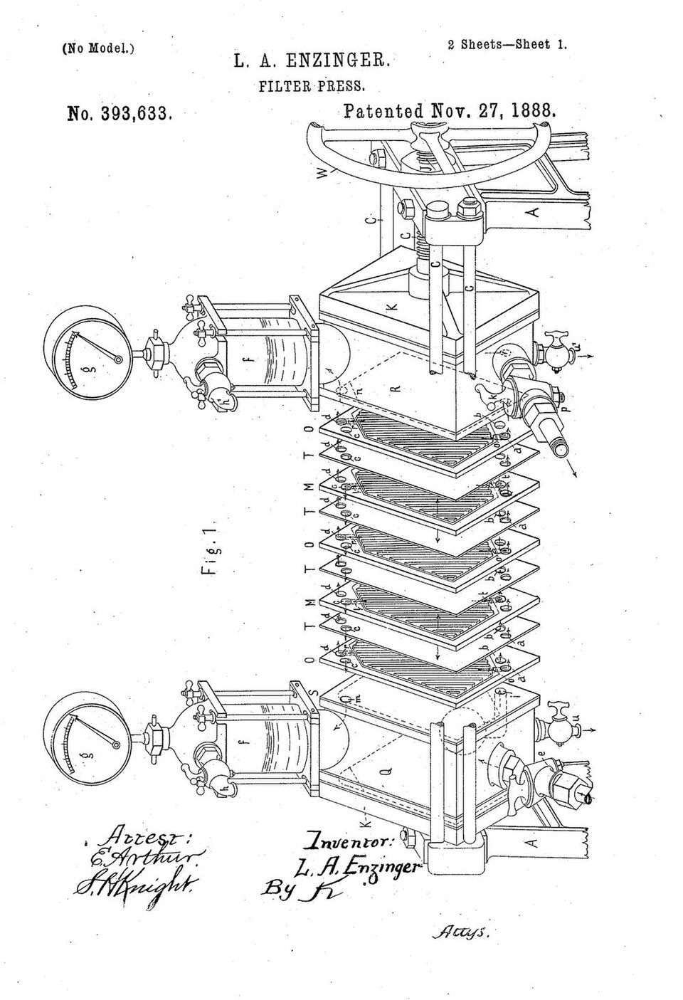

# Filter Press

> **Node ID**: chemistry.filter-press
> **Domain**: [Chemistry](./index.md)
> **Dependencies**: [`metals.iron-steel`](../metals/iron-steel.md), [`metals.welding`](../machine-tools/welding-equipment.md), [`polymers.elastomers`](../polymers/rubber.md)
> **Enables**: [`chemistry.water-treatment`](water-treatment.md), [`chemistry.chemical-recovery`](chemical-recovery.md), [`metals.metal-recycling`](../metals/metal-recycling.md)
> **Timeline**: Years 10-25
> **Outputs**: filter_cake, filtrate
> **Critical**: No — filter presses are the workhorse of solid-liquid separation but settling tanks, centrifuges, and vacuum filters can substitute at lower performance

## Overview

> *Specification forming part of Letters Patent No. 393,633*

> *Image: L.A. Enzinger, Public domain*

A filter press separates solids from liquids by forcing a slurry under pressure through a porous filter medium (cloth, paper, or membrane) that retains solid particles as a cake while allowing clear liquid (filtrate) to pass. The plate-and-frame design sandwiches filter cloth between alternating plates and frames (or recessed chamber plates) compressed by a hydraulic or screw mechanism. Slurry is pumped into the chambers at 5-15 bar pressure. Solids accumulate as cake in each chamber; filtrate drains through the cloth and exits through internal channels.

Filtration continues until the chambers fill with cake (indicated by decreasing filtrate flow or increasing feed pressure). The press is then opened, and the filter cake is discharged by gravity. Filter cloth is cleaned or replaced between cycles. Typical cycle time: 1-8 hours depending on slurry characteristics and cake compressibility.

The filter press achieves higher solids content in the cake (30-60% by weight) than vacuum filtration (15-40%) or settling (5-20%). The trade-off is batch operation and manual cake discharge for standard designs. The filter press is the lowest-cost option for solid-liquid separation at small to medium scale (1-50 m³ slurry per batch). Two principal designs exist: **plate-and-frame** (separate plates and frames, versatile, easy to change cloth) and **recessed chamber** (each plate has a recessed cavity, simpler, more common in modern practice). A third variant, the **membrane filter press**, adds inflatable membranes behind the filter cloth for post-filtration squeezing to achieve maximum cake dryness (up to 70% solids).

Filter press performance depends on the filterability of the slurry — a measure of how readily the solid particles form a permeable cake. The specific cake resistance (α) ranges from 10⁹ m/kg for easy-to-filter materials (coarse crystals) to 10¹³ m/kg for difficult materials (fine precipitates, biological sludges). High cake resistance requires higher feed pressure, longer cycle time, and sometimes a filter aid (diatomaceous earth or perlite precoat) to create a permeable initial layer on the cloth.

The filter cloth is a consumable item with a finite life of 100-2,000 cycles depending on the abrasiveness of the solids and the chemical environment. Cloth selection is the single most impactful decision for filter press performance — the wrong cloth produces either cloudy filtrate (pores too large) or slow filtration (pores too small). For a new application, test 3-5 cloth types on a laboratory-scale filter before committing to a production-scale purchase.

## Prerequisites

- **[Steel fabrication](../metals/iron-steel.md)**: Structural frame, end plates, and guide rails
- **[Cast iron or polypropylene plates](../metals/casting.md)**: Recessed chamber plates in the target size range
- **[Filter cloth](../textiles/fibers.md)**: Polypropylene or polyester felt, 200-800 g/m², pore size matched to particle size
- **[Hydraulic system](../water/positive-displacement-pump.md)**: Cylinder and pump for plate stack compression (5-20 tonnes closure force)
- **[Feed pump](../water/positive-displacement-pump.md)**: Diaphragm or progressive cavity pump rated for 5-15 bar discharge pressure

## Bill of Materials

| Material | Quantity | Specifications | Source | Alternatives |
|----------|----------|----------------|--------|-------------|
| [Steel plate](../metals/iron-steel.md) (end plates) | 100-500 kg | A36, 20-40 mm thick, machined flat | [Iron & Steel](../metals/iron-steel.md) | Cast iron end plates (heavier) |
| [Steel plate](../metals/iron-steel.md) (frame) | 200-1,000 kg | Structural steel channel or I-beam | [Iron & Steel](../metals/iron-steel.md) | Concrete frame (stationary installation) |
| [Cast iron plates](../metals/casting.md) | 10-50 units | Recessed chamber, 400-1200 mm square | [Casting](../metals/casting.md) | Polypropylene plates (corrosive slurries) |
| [Filter cloth](../textiles/fibers.md) | 10-50 sheets | Polypropylene or polyester felt, 200-800 g/m² | [Textiles](../textiles/fibers.md) | Cotton (lower chemical resistance), nylon (higher strength) |
| [Hydraulic cylinder](../water/positive-displacement-pump.md) | 1 unit | 50-200 mm bore, rated to 200 bar, manual or powered pump | [Hydraulics](../water/positive-displacement-pump.md) | Handwheel screw (slower, no hydraulics needed) |
| [Steel pipe](../metals/forming.md) (feed manifold) | 10-50 kg | Carbon steel or 316L SS, 25-50 mm | [Forming](../metals/forming.md) | — |
| [Diaphragm pump](../water/positive-displacement-pump.md) | 1 unit | 5-15 bar, corrosion-resistant wetted parts | [Hydraulics](../water/positive-displacement-pump.md) | Progressive cavity pump (continuous feed) |

## Process Description

### Frame and Structural Assembly

1. **Fabricate the structural frame**: Weld a rectangular frame from structural steel channel (100-200 mm) or I-beam. The frame consists of two vertical end plates connected by four horizontal tie bars. The fixed head plate (stationary end) has the feed inlet connection. The movable head plate (driven by the hydraulic cylinder) presses the plate stack closed. Overall frame dimensions: 1-3 m long (depending on number of plates) × 0.5-1.5 m wide × 1-2 m tall.

2. **Fabricate or procure filter plates**: Cast or machine recessed chamber plates from cast iron or polypropylene. Standard plate sizes: 400 × 400 mm, 630 × 630 mm, 800 × 800 mm, or 1000 × 1000 mm. Each plate has a recessed chamber (15-40 mm deep on each side), a central feed hole (25-50 mm diameter), filtrate drainage channels on the surface (grooved or studded pattern at 20-40 mm spacing), and four corner filtrate discharge holes. Plate thickness: 30-60 mm. Chamber volume per plate: 5-40 L depending on plate size and depth.

3. **Install guide rails**: Mount two horizontal steel rails on the inside of the frame's side members. The filter plates slide on these rails during opening and closing. Ensure rails are parallel within 1 mm over their full length to prevent plate misalignment.

4. **Mount hydraulic closure system**: Install the hydraulic cylinder (50-200 mm bore) on the movable head end of the frame. The cylinder rod connects to the movable head plate. When pressurized, the cylinder pushes the head plate toward the fixed end, compressing the plate stack. Closure force: 5-20 tonnes (sufficient to seal all gaskets under maximum feed pressure). Manual hydraulic pump (hand-lever) for small presses; powered hydraulic pump unit for larger presses.

5. **Assemble the plate pack**: Thread filter cloths over each plate (each cloth is cut to cover both faces of the plate, with a hole for the central feed port). Stack the clothed plates on the guide rails, alternating plates and frames (for plate-and-frame type) or stacking recessed chamber plates directly (for recessed plate type). Install a tail plate (solid, no feed hole) at the end.

6. **Connect feed manifold**: Pipe the slurry feed pump to the central feed hole in the fixed head plate. The feed manifold runs through the center of all plates — slurry enters each chamber simultaneously when the pump runs. Install a pressure gauge (0-20 bar) on the feed line. Install a pressure relief valve set to 1.1× maximum operating pressure.

7. **Connect filtrate drain**: Pipe the corner filtrate discharge holes to a common filtrate collection manifold visible at the front of the press. Individual filtrate streams from each plate allow visual inspection — a cloudy stream indicates a torn or leaking filter cloth.

8. **Install drip tray**: Mount a steel drip tray under the plate pack to catch filtrate drips and cake discharge. The tray should be sized to hold the full cake volume from one cycle. Include a drain connection to the filtrate collection tank.

### Filter Cloth Selection

9. **Select cloth by particle size**: The filter cloth pore size must retain the smallest particles while allowing acceptable filtration rate. General guidance: cloth pore size = 1/3 to 1/5 of the minimum particle size to be retained. For particles >50 µm: monofilament polypropylene (100-200 µm pore, 200-400 g/m²). For particles 10-50 µm: multifilament polyester (20-80 µm pore, 400-600 g/m²). For particles <10 µm: felted polypropylene or needled felt (5-20 µm pore, 500-800 g/m²), or use a pre-coat of diatomaceous earth on the cloth.

10. **Select cloth by chemical compatibility**: Polypropylene: resists acids, bases, and most organics up to 90°C. Polyester: resists acids and most organics up to 150°C, degraded by strong bases. Cotton: resists weak acids and bases up to 100°C, low chemical resistance. For strongly corrosive slurries (concentrated H₂SO₄, NaOH >30%), use polypropylene or PTFE-coated cloth. For high-temperature applications (>120°C), use polyester or PTFE.

11. **Install and seat cloth**: Place the filter cloth over each plate, aligning the central hole. Ensure the cloth lies flat without wrinkles — wrinkles create channels where slurry bypasses the cloth. Secure the cloth at the top edge with a retaining clamp or sewn sleeve. Overlap cloth at the edges by at least 25 mm to prevent edge leakage.

11a. **Filter aid precoat (optional)**: For fine particles that blind the cloth, apply a precoat of diatomaceous earth before each cycle. Mix 1-3 kg/m² of filter aid with water to form a thin slurry. Pump through the press before the process slurry. The precoat forms a permeable layer that captures fine particles while maintaining flow rate. After filtration, the precoat discharges with the cake. Filter aid cost: $0.5-2.0 per kg — justify by the reduction in cycle time and cloth replacement frequency.

### Operating Cycle

12. **Close and seal the press**: Activate the hydraulic pump to close the plate stack. Apply closure force until the hydraulic gauge reads the design pressure (typically 100-200 bar hydraulic, producing 5-20 tonnes closure force). Verify the gap between movable head and frame is uniform at all four corners (<1 mm deviation).

13. **Feed slurry**: Start the feed pump. Slurry enters the chambers through the central feed manifold. Filtrate begins flowing from the corner discharge ports. Initially, filtrate may be cloudy (fine particles passing through the cloth before the cake forms a precoat layer). After 1-5 minutes, the filtrate should run clear. Feed pressure gradually increases as the cake builds. Continue feeding until the chambers are full (filtrate flow drops to <10% of initial rate, or feed pressure reaches 12-15 bar).

14. **Wash the cake (optional)**: If the cake must be washed free of mother liquor, switch the feed to wash water. Wash at 5-10 bar pressure for 15-60 minutes. Wash ratio: 0.5-3.0 kg wash water per kg cake. Monitor wash effluent conductivity — washing is complete when conductivity approaches that of fresh wash water.

15. **Air blow (optional)**: After washing, blow compressed air (3-6 bar) through the feed manifold to displace residual liquid from the cake. This reduces cake moisture by 5-15%. Duration: 5-15 minutes until no more liquid drains from the filtrate ports.

16. **Open and discharge**: Release hydraulic pressure. The movable head retracts. Separate the plates one by one (manually or with automatic plate shifter). The filter cake drops by gravity into the drip tray below. Collect cake for disposal, drying, or further processing.

17. **Clean cloths**: Rinse filter cloths with water or appropriate solvent to remove residual cake. Inspect for tears, holes, or blinding (pore plugging). Replace damaged cloths. Restore hydraulic pressure and close the press for the next cycle.

## Operating Procedure

1. **Close the press**: Activate the hydraulic pump. Apply closure force until the gauge reads the design pressure (100-200 bar hydraulic). Verify uniform gap at all four corners (<1 mm deviation). Confirm the safety interlock is engaged.
2. **Start feeding**: Start the diaphragm feed pump at 30-50% of maximum flow. Slurry enters the chambers through the central feed manifold. Initially, filtrate may run cloudy for 1-5 minutes as fine particles pass through the cloth before the cake forms a precoat layer. After this initial period, filtrate should run clear (<50 NTU).
3. **Increase pressure**: As the cake builds, gradually increase feed pressure to the design maximum (5-15 bar). Do not exceed the plate rating. Monitor filtrate flow rate — it decreases as cake resistance increases. When filtrate flow drops below 10% of the initial rate, the chambers are full.
4. **Wash the cake (if required)**: Switch the feed from slurry to wash water. Maintain 5-10 bar pressure. Wash until the effluent conductivity matches the fresh wash water (within 10%). Typical wash water volume: 0.5-3.0 kg per kg of wet cake.
5. **Air blow (if required)**: Close the feed valve. Open the compressed air line to the feed manifold. Blow at 3-6 bar for 5-15 minutes to displace residual liquid from the cake. This reduces cake moisture by 5-15%. Stop when no more liquid drains from the filtrate ports.
6. **Open and discharge**: Release hydraulic pressure. Retract the movable head. Pull plates apart one by one (manually or with automatic shifter). Cake drops by gravity into the drip tray. For sticky cakes that do not release: tap the plate with a rubber mallet, or use a cake release agent on the cloth.
7. **Clean and close**: Rinse the filter cloths with water while the plates are open. Inspect for tears (cloudy filtrate from a specific chamber identifies the torn cloth). Re-stack plates. Apply hydraulic closure for the next cycle.

## Calibration and Verification

1. **Closure pressure test**: Close the press under full hydraulic pressure. Measure the gap between the movable head and the fixed head at four corners. Maximum deviation: <1 mm. Uneven closure indicates frame misalignment or worn guide rails.

2. **Leak test (empty)**: Close the press. Fill the chambers with water via the feed pump at 5 bar. Inspect all plate edges for leaks. Zero leaks at the plate gasket faces. Minor weeping at the filter cloth edges is acceptable during water test (solids in real slurry will seal these leaks).

3. **Filtration trial**: Process a batch of test slurry. Measure filtrate clarity (turbidity <50 NTU for most applications), filtration rate (L/min at specified pressure), and cake solids content (30-60% by weight depending on slurry). Adjust feed pressure and cloth type if filtrate is cloudy (indicating cloth pores too large) or filtration is too slow (cloth too tight).

## Quantitative Parameters

| Parameter | Small Press | Medium Press | Large Press |
|-----------|-------------|--------------|-------------|
| Plate size | 400 × 400 mm | 630 × 630 mm | 1000 × 1000 mm |
| Number of chambers | 10-20 | 15-40 | 20-60 |
| Chamber depth (per side) | 15-25 mm | 20-35 mm | 25-40 mm |
| Cake volume per chamber | 2-5 L | 8-25 L | 30-80 L |
| Total cake capacity | 20-100 L | 120-1,000 L | 600-4,800 L |
| Operating pressure | 5-10 bar | 7-15 bar | 7-15 bar |
| Filtration cycle time | 1-4 hours | 2-6 hours | 3-8 hours |
| Cake moisture content | 30-60% | 30-55% | 25-50% |
| Filtrate clarity | <50 NTU | <50 NTU | <50 NTU |
| Throughput | 0.5-5 m³ slurry/cycle | 3-30 m³/cycle | 15-50 m³/cycle |
| Closure force | 5-10 tonnes | 8-15 tonnes | 12-20 tonnes |
| Filter cloth life | 200-2,000 cycles | 100-1,500 cycles | 100-1,000 cycles |
| Plate life | 5-15 years (cast iron) | 5-15 years | 5-15 years |

## Scaling Notes

- **Plate count scaling**: Add plates to increase cake capacity without increasing filtration time (each chamber operates in parallel). A 30-plate press has 3× the capacity of a 10-plate press at the same cycle time. The limiting factor is the structural frame length and hydraulic closure force.
- **Pressure scaling**: Higher feed pressure produces drier cake and faster filtration but requires heavier plates and frame. Above 15 bar, cast iron plates may crack — switch to ductile iron or reinforced polypropylene. Membrane filter presses (with squeeze) can reach effective pressures of 30 bar on the cake.
- **Continuous operation**: Standard filter presses are batch devices. For near-continuous throughput, install two presses operating in alternating cycles — while one is filtering, the other is discharging and closing.
- **Minimum economic scale**: A 400 mm press with 10 chambers processes 0.5-2 m³ per cycle. Below this, a vacuum filter or settling tank is simpler and cheaper.

## Troubleshooting

| Problem | Probable Cause | Solution |
|---------|---------------|----------|
| Cloudy filtrate from one or more chambers | Torn or worn filter cloth; cloth pore size too large for the particle size; improper cloth installation (wrinkles creating bypass channels) | Identify the leaking chamber (visual inspection of individual filtrate streams); replace torn cloth; switch to finer pore cloth; re-install cloth flat without wrinkles; apply diatomaceous earth precoat |
| Filtration rate too slow (cycle >8 hours) | Filter cloth blinded (pores plugged with fine particles); feed solids concentration too low (thin cake, high resistance); slurry temperature too low (high viscosity) | Chemical cloth cleaning (acid or alkali soak to dissolve deposits); increase feed solids concentration (pre-thicken with settling tank); heat slurry to 40-60°C to reduce viscosity; switch to coarser cloth |
| Uneven cake thickness (thick at bottom, thin at top) | Inadequate feed pressure; slurry settling in chambers before cake forms; feed inlet at bottom only | Increase feed rate to fill chambers faster; install top-feed inlet for uniform distribution; add slurry agitation during feeding |
| Cake sticking to plates (difficult discharge) | Cake too thin (<10 mm) and cohesive; filter cloth surface too smooth (no release); no air blow before opening | Increase chamber fill by extending filtration time; apply non-stick cloth treatment (silicone spray for non-food applications); blow compressed air through cake before opening; install automatic plate vibration for cake release |
| Hydraulic system losing pressure | Hydraulic pump worn; cylinder seals leaking; hydraulic fluid overheating | Rebuild or replace hydraulic pump; replace cylinder seals (check for scoring on cylinder bore); verify hydraulic oil temperature (<65°C); check for internal bypass in hydraulic control valve |
| Frame cracking at weld joints | Fatigue from repeated closure cycles; misalignment causing bending stress; weld quality insufficient | Inspect frame welds monthly for cracks; re-align guide rails (parallel within 1 mm); reduce hydraulic closure pressure to minimum needed for sealing; repair cracks by grinding out and rewelding with preheat |
| Slurry leaking from plate edges during feeding | Insufficient closure force; worn or distorted plates; gasket surface damaged | Increase hydraulic closure pressure (do not exceed frame rating); replace warped plates; machine gasket surfaces flat; verify plates are properly aligned on guide rails |
| Feed pump losing prime | Feed tank empty; suction line blocked; pump diaphragm ruptured; air leak on suction side | Verify feed tank has adequate slurry level; clear suction line; inspect and replace pump diaphragm; check suction piping for air leaks (soap test under vacuum) |
| Cloth blinding (pores permanently plugged) | Fine particles (clay, biological matter) penetrating cloth and not releasing; chemical precipitation in cloth pores; oil or grease contamination | Switch to monofilament cloth (smoother surface, releases cake better); chemical cleaning (acid or solvent soak); install a precoat of diatomaceous earth (1-3 kg/m²) before each filtration cycle to protect the cloth |
| Cake too thin for effective discharge (<10 mm) | Insufficient feed volume; excessive feed pressure causing cake compression; high solids loss in filtrate (cloth too permeable) | Increase feed volume to fill chambers; reduce feed pressure for less compressible cake; switch to tighter cloth to retain more solids; consider a membrane press for thin cakes (squeeze to dryness) |
| Uneven filtration (some chambers fill fast, others slow) | Uneven slurry distribution from feed manifold; partially blocked central feed holes in some plates; worn cloth on some plates creating preferential flow | Clean the central feed manifold and plate feed holes; replace worn cloths on fast-filling chambers; verify all cloths are the same specification; consider installing a top-feed design for more uniform distribution |

## Safety

- **High pressure**: The feed pump delivers 5-15 bar to the chambers. A plate failure under pressure releases hot or corrosive slurry. Never open the press while under feed pressure. Install a pressure relief valve on the feed line. Close the feed valve and depressurize before releasing the hydraulic closure.
- **Heavy plates**: Cast iron filter plates (630-1,000 mm) weigh 20-60 kg each. Manual handling of plates during maintenance causes back injuries. Use lifting equipment for plates larger than 630 mm. Two-person minimum for plate replacement.
- **Hydraulic system**: The closure cylinder operates at 100-200 bar hydraulic pressure. Hydraulic injection injuries from pinhole leaks require immediate surgical debridement. Never use hands to search for hydraulic leaks — use cardboard.
- **Chemical exposure**: Slurries containing acids, bases, or heavy metals present splash and contact hazards. Chemical-resistant gloves and face shield during cake discharge. Secondary containment under the press for chemical slurries.
- **Pinch points**: The plate stack closes with tonnes of force. Keep hands clear of plate edges during closure. Two-hand operation of the hydraulic control.
- **Dust during cake discharge**: Dry cakes generate dust when dropped from the press. For toxic or hazardous materials, install local exhaust ventilation at the drip tray. Wet the cake surface with a fine water spray before discharge to suppress dust. Provide respiratory protection (N95 or better) for operators during cake discharge of hazardous materials.
- **Trip hazard from spillage**: Slurry and filtrate spills make the floor slippery. Install a grated floor over the drip tray area. Clean up spills immediately. Non-slip flooring in the filter press area.

## Quality Control

- **Filtrate clarity**: Measure turbidity of filtrate from each chamber individually. Acceptable: <50 NTU for most applications, <10 NTU for drinking water or pharmaceutical. A cloudy individual stream indicates a torn cloth — tag that chamber for cloth replacement.
- **Cake solids content**: Weigh a wet cake sample (200-500 g), dry at 105°C for 4 hours, reweigh. Cake solids = dry weight / wet weight × 100%. Target: 30-60% depending on material. Below 30%: extend filtration time, increase pressure, or add air blow.
- **Cake washing efficiency**: Measure conductivity or target impurity in the wash effluent. Washing is complete when wash effluent conductivity is within 10% of fresh wash water conductivity. Under-washing leaves impurities in the cake; over-washing wastes water and extends cycle time.
- **Cloth condition monitoring**: Record the number of cycles per cloth set. Track filtration time per cycle — a gradual increase (>20% from baseline) indicates cloth blinding. Schedule cloth replacement before filtration time exceeds the economic cycle limit.
- **Plate condition**: Inspect plates every 6 months for cracking, warping, and erosion of the drainage surface. Cast iron plates crack under thermal shock — avoid rapid temperature changes during cake washing. Polypropylene plates warp at temperatures above 80°C. Replace cracked or warped plates promptly — they cause leaks and uneven cake formation.
- **Hydraulic system health**: Check hydraulic oil level and color monthly. Dark or milky oil indicates contamination (water ingress or oxidation). Replace hydraulic oil every 2,000 operating hours. Check cylinder rod for scoring — scored rods damage seals and cause pressure loss.

## Variations and Alternatives

- **Membrane filter press**: Each plate has an inflatable rubber or polypropylene membrane behind the filter cloth. After filtration, the membrane is inflated with compressed water (up to 30 bar) to squeeze the cake, reducing moisture by 10-20% compared to standard filter presses. Higher capital cost but produces significantly drier cake. Used for sludge dewatering, mining concentrates, and chemical precipitates where maximum dryness is required.
- **Centrifuge** ([Centrifuge](centrifuge.md)): Continuous operation, higher throughput per unit footprint. Lower cake moisture for fine particles. Higher capital cost, requires precision machining. Preferred when continuous operation is required and the slurry is pumpable.
- **Vacuum filter**: A rotating drum covered with filter cloth, partially submerged in a slurry trough. Vacuum draws filtrate through the cloth; cake forms on the drum surface and is scraped off. Continuous operation. Lower driving force (vacuum ≈ 0.8 bar vs. 5-15 bar for filter press) produces wetter cake (15-40% solids).
- **Settling tank**: Gravity settling of solids to the bottom of a tank. Zero energy input (beyond feed pump). Very slow (2-24 hours). Very wet underflow (5-20% solids). Used as pre-thickening before a filter press to reduce the filtration load.
- **Sand filter**: A bed of graded sand (0.5-2 mm grain size) through which the slurry percolates by gravity. Low cost, simple construction. Limited to low solids concentration feeds (<0.1%). Used for water treatment and final polishing of filtrates. Cannot handle high solids loading — pre-treat with coagulant and settling.
- **Bag filter**: A fabric bag inside a pressure vessel. Slurry is pumped through the bag; solids collect inside. Disposable bags (polypropylene felt, 1-100 µm rating). Used for small batches, polishing filtration, and applications where cross-contamination between batches must be avoided (pharmaceuticals, food). Lower capacity than plate filter presses but simpler to operate and clean.

## References

- [Water Treatment](water-treatment.md) — sludge dewatering with filter presses
- [Chemical Recovery](chemical-recovery.md) — catalyst and precipitate recovery
- [Centrifuge](centrifuge.md) — alternative solid-liquid separation (continuous, higher cost)
- [Crystallizer](crystallizer.md) — crystal recovery by filtration
- [Reactor Vessel](reactor-vessel.md) — reactor discharge often goes to filter press for product recovery
- [Acids](acids.md) — acid plant product filtration
- [Alkalis](alkalis.md) — caustic purification by filtration

## Filter Press Sizing Example

A filter press processing a crystallization mother liquor with 15% solids (by weight) at a feed rate of 10 m³/batch:

- **Slurry density**: 1,100 kg/m³. Total batch mass: 11,000 kg. Solids: 1,650 kg. Liquid: 9,350 kg.
- **Cake solids content** (target): 50% by weight → cake mass = 1,650 / 0.50 = 3,300 kg. Filtrate = 11,000 − 3,300 = 7,700 kg.
- **Cake volume** (cake density ≈ 1,400 kg/m³): 3,300 / 1,400 = 2.36 m³ = 2,360 L
- **Plate selection**: 800 × 800 mm recessed chamber plates, 30 mm chamber depth per side. Volume per chamber: 800 × 800 × 30 × 2 / 10⁹ = 38.4 L per plate. Number of chambers: 2,360 / 38.4 = 62 → use 65 chambers (with safety margin).
- **Filtration time** (estimated from laboratory test at 10 bar): 4 hours.
- **Wash water** (2× cake weight): 6,600 kg = 6.6 m³. Wash time: 45 minutes.
- **Air blow**: 5 minutes at 4 bar.
- **Discharge time** (manual): 30 minutes for 65 plates.
- **Total cycle time**: 4:00 + 0:45 + 0:05 + 0:30 + 0:15 (close/open) = 5 hours 35 minutes.
- **Throughput**: 10 m³ per 5.5-hour cycle ≈ 1.8 m³/h average.

## Plate and Frame Types

| Plate Type | Chamber Depth (mm) | Cake Dryness | Filtrate Clarity | Best For |
|------------|-------------------|--------------|-----------------|----------|
| Recessed chamber | 15-50 | Good | Good | General purpose, most common |
| Plate-and-frame (flush plates + frames) | 20-60 | Fair | Good | Filter aid precoat applications |
| Diaphragm (membrane) squeeze | 15-40 (pre-squeeze), 8-15 (post-squeeze) | Excellent (5-15% drier) | Good | Products requiring maximum dryness |
| Centrifuge-discharge | 20-40 | Good | Good | Frequent batch cycles, automated |

Diaphragm (membrane) filter presses add a flexible membrane (polypropylene or rubber) behind the filter cloth on one side of each plate. After the filtration cycle completes, the membrane is inflated with water or compressed air (typically 10-16 bar) to squeeze the cake, removing additional liquid. This reduces the cake moisture by 5-15 percentage points compared to simple recessed chamber plates. The trade-off is higher capital cost (membrane plates cost 2-3× more than recessed plates) and a more complex hydraulic system. Membrane plates are standard in the sugar industry, municipal sludge dewatering, and fine chemical processing where downstream drying costs are high.

## Filter Aid Selection

Filter aids are inert, permeable materials added to the feed slurry or pre-coated onto the filter cloth to improve filtration rate and prevent cloth blinding. The two most common filter aids are diatomaceous earth (DE, also called kieselguhr) and perlite.

**Diatomaceous earth**: Fossilized remains of diatoms (single-celled algae), mined and calcined at 800-1200°C to create a fine, rigid, highly porous powder. Particle size: 5-50 µm. Bulk density: 100-250 kg/m³. Permeability: 0.5-20 Darcy depending on grade. Precoat application: 1-3 kg/m² of filter area, applied as a 2-5% slurry before the process feed. Body feed (mixed with the process slurry): 0.5-5 kg per kg of dry solids in the feed. DE creates a rigid, incompressible cake with low flow resistance, maintaining filtration rate even with fine or gelatinous solids. Cost: $0.3-1.5/kg. Used in brewing, juice clarification, pharmaceutical filtration, and chemical processing.

**Perlite**: Expanded volcanic glass, heated to 800-1000°C to pop the trapped moisture, creating lightweight, porous particles. Particle size: 10-150 µm. Bulk density: 50-150 kg/m³. Lower cost than DE ($0.2-0.8/kg) but less effective for very fine particles (<5 µm). Used for swimming pool filtration, waste oil treatment, and large-scale industrial filtration where DE-grade clarity is not required.

**Selection criteria**: Use DE when filtrate clarity is paramount (brewing, pharmaceuticals, fine chemicals). Use perlite for bulk filtration where moderate clarity suffices. Apply as precoat (1-3 kg/m²) plus body feed (0.5-5 kg/kg solids) to maintain cake permeability throughout the filtration cycle.

---
*Part of the [Bootciv Tech Tree](../index.md) • [Chemistry](./index.md) • [All Domains](../index.md)*
