# Chemistry

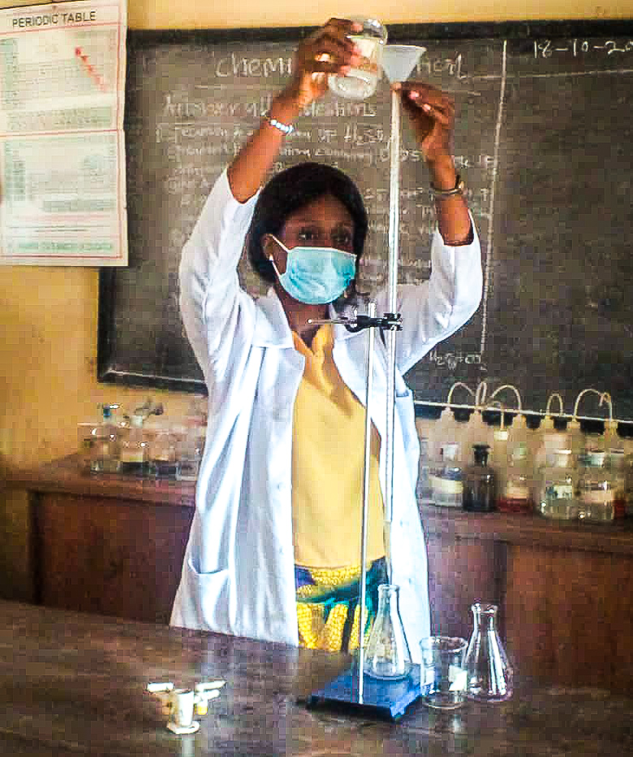
> *Image: Frankincense Diala, CC0*

> *A Scientist in a chemistry laboratory, in Awka, Anambra State, Nigeria*

> *Image: Frankincense Diala, CC0*

Capabilities in this domain:

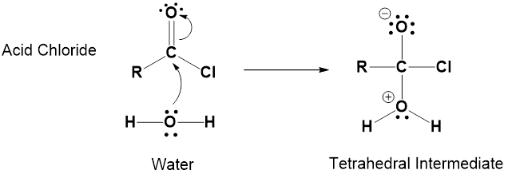
> *Image: Unknown authorUnknown author, CC BY-SA 4.0*

- [Mineral Acid Production](acids.md) — Sulfuric acid (lead chamber process 65-70%, contact process 96-98%), nitric acid (from nitrates + H₂SO₄, later Ostwald process), hydrochloric acid (NaCl + H₂SO₄ or direct H₂ + Cl₂ synthesis), and hydrofluoric acid (CaF₂ + H₂SO₄, extremely hazardous).

> *Image: Anaconda Copper Mining Company, Public domain*

- [SEM Tech Acid Regeneration](sem-tech-acid-regeneration.md) — bipolar membrane electrodialysis for acid recovery

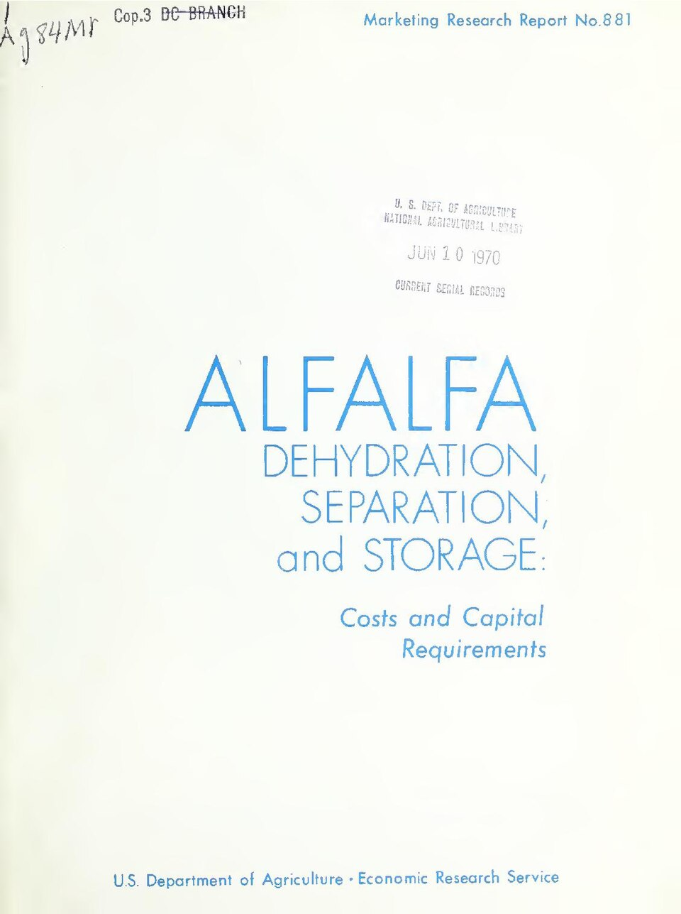
> *Image: Giacomo Alessandroni, CC BY-SA 4.0*

- [Air Separation & Bulk Gas Production](air-separation.md) — Linde fractional distillation of liquid air producing nitrogen (99-99.99%), oxygen (95-99.5%), and argon (99-99.999%).

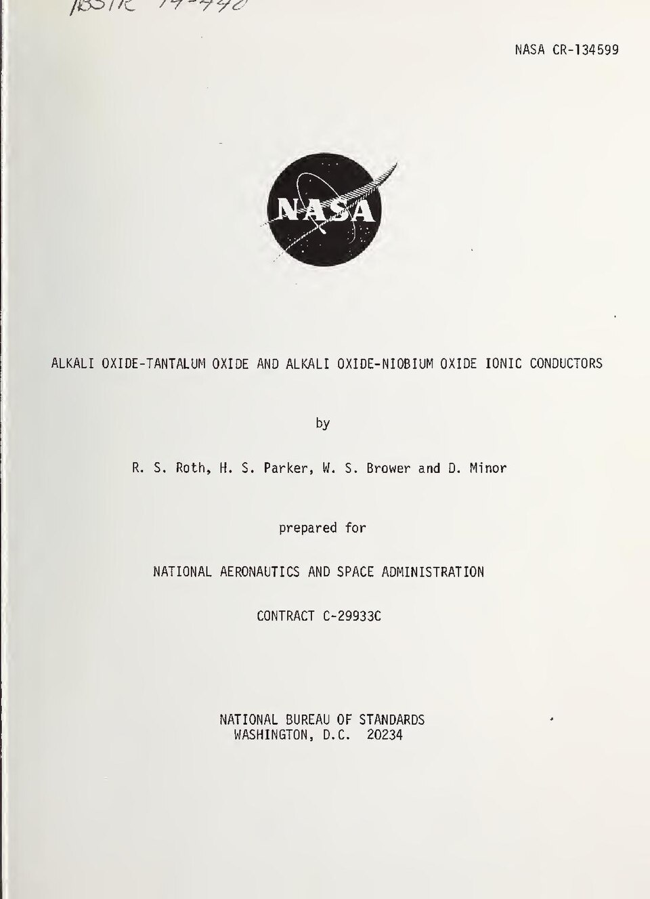
> *Image: 7Nene, CC BY-SA 4.0*

- [Alkali Production](alkalis.md) — Leblanc process (first synthetic soda ash) and Solvay process (more efficient, later) for Na₂CO₃, lime-soda process and chlor-alkali electrolysis for NaOH.

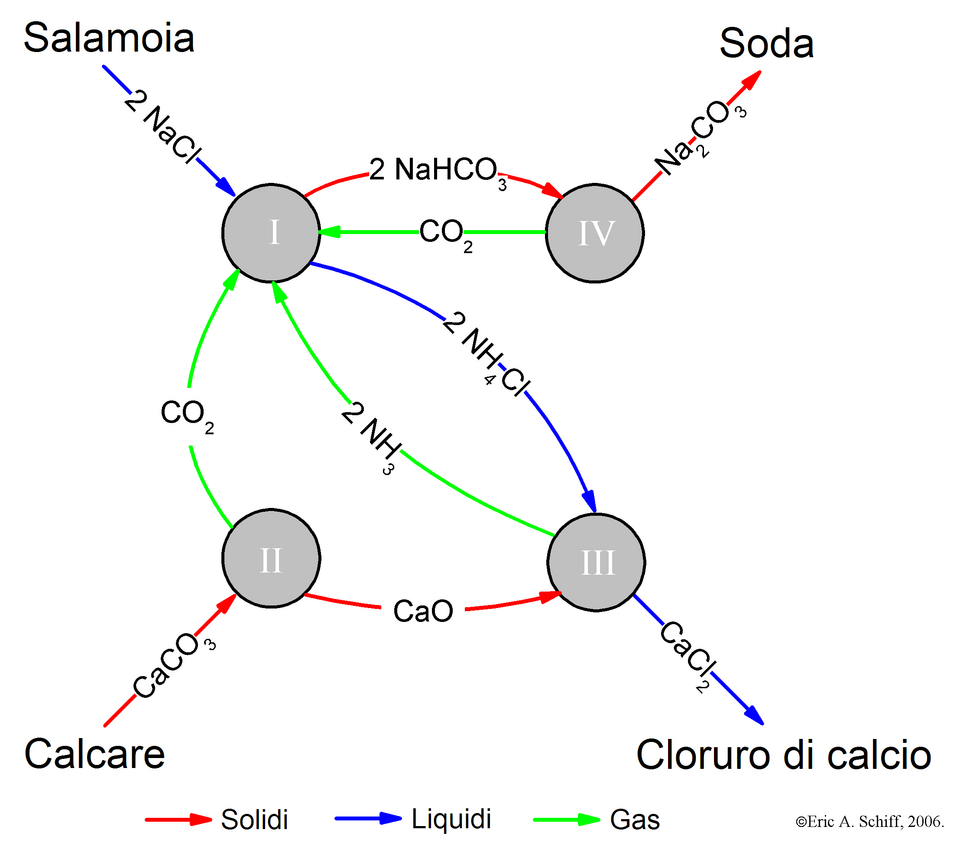
> *Image: Original uploader was Easchiff, CC BY-SA 3.0*

- [Solvay Process](solvay.md) — Sodium carbonate (soda ash) production from brine and limestone using ammonia as a recyclable catalyst, the most efficient route to Na₂CO₃ for glass, soap, and chemical synthesis.

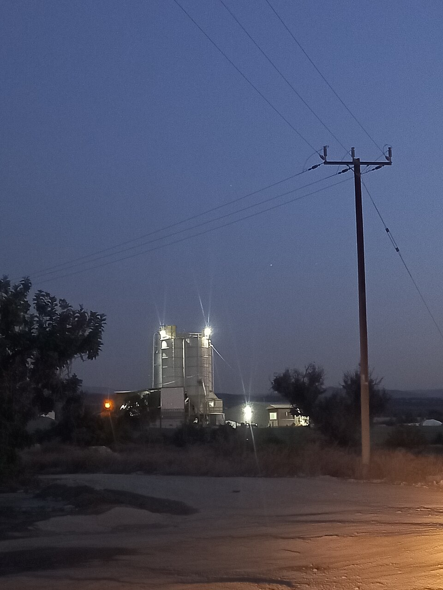
> *Image: Unknown author, Public domain*

- [Cement & Concrete](cement.md) — Portland cement from limestone + clay heated to 1450°C, ground with gypsum.

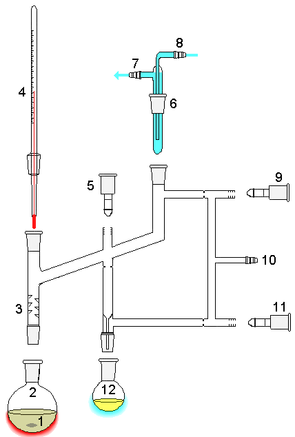
> *Image: Quantockgoblin, Public domain*

- [Distillation](distillation.md) — Distillation columns (2-10 m, copper or steel, packed with ceramic Raschig rings), batch and continuous flow reactors, shell-and-tube heat exchangers, Portland cement production, and polymer feedstock chemistry.

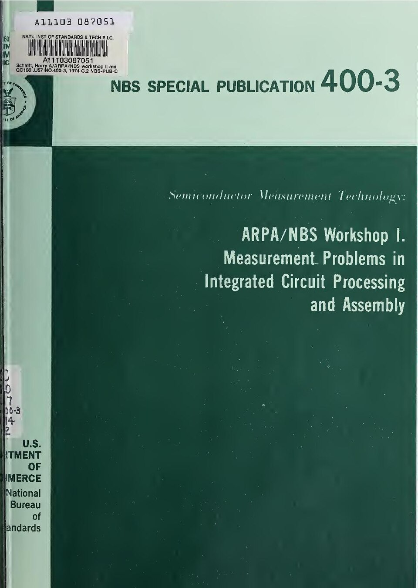
> *Image: E-gabrielyan, CC BY-SA 4.0*

- [Dopant & Etch Gases](dopant-etch-gases.md) — Dopant gases (PH₃, AsH₃, B₂H₆ — extremely toxic, lethal at ppm concentrations) and etch gases (CF₄, SF₆, Cl₂, F₂).

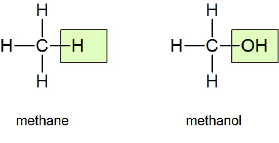
> *Image: Unknown authorUnknown author, CC BY 4.0*

- [SEM Tech e-Methanol](sem-tech-e-methanol.md) — power-to-liquids methanol synthesis

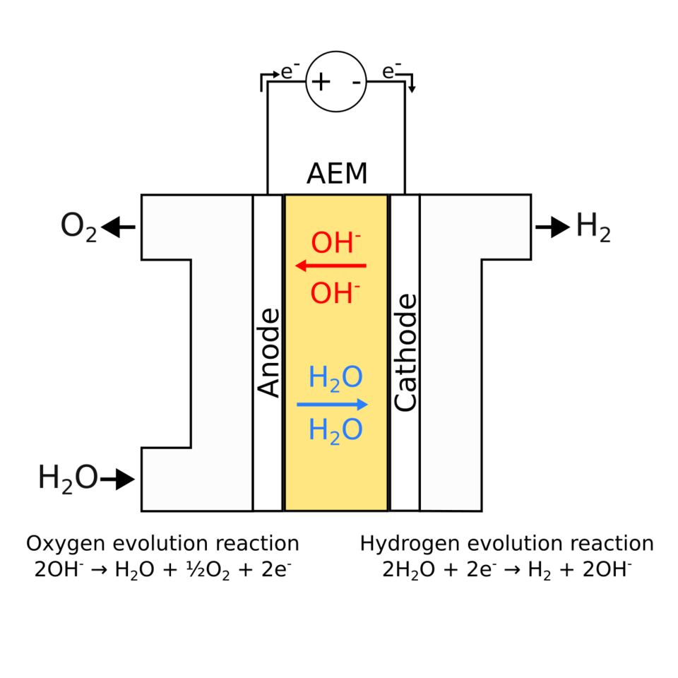
> *Image: Kavin Teenakul, CC BY-SA 4.0*

- [Electrolysis](electrolysis.md) — Electrolytic cells for chlor-alkali (NaCl → Cl₂ + NaOH), water splitting (H₂ + O₂), aluminum Hall-Héroult process, and copper refining.

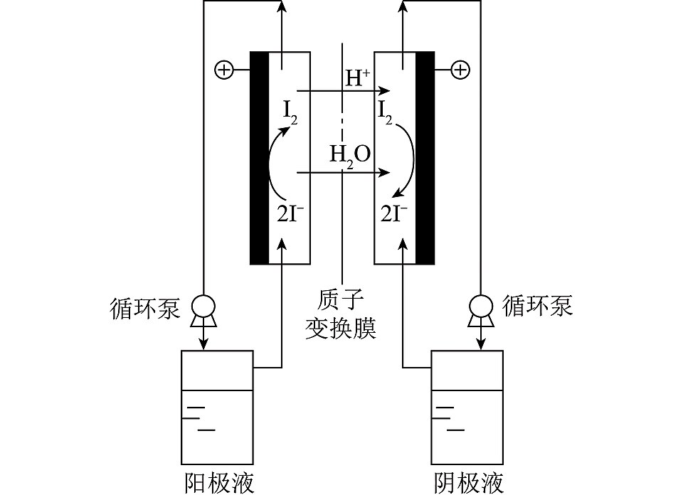
> *Image: NoteDamn, Public domain*

- [SEM Tech Electrodialysis](sem-tech-electrodialysis.md) — electrochemical ion separation

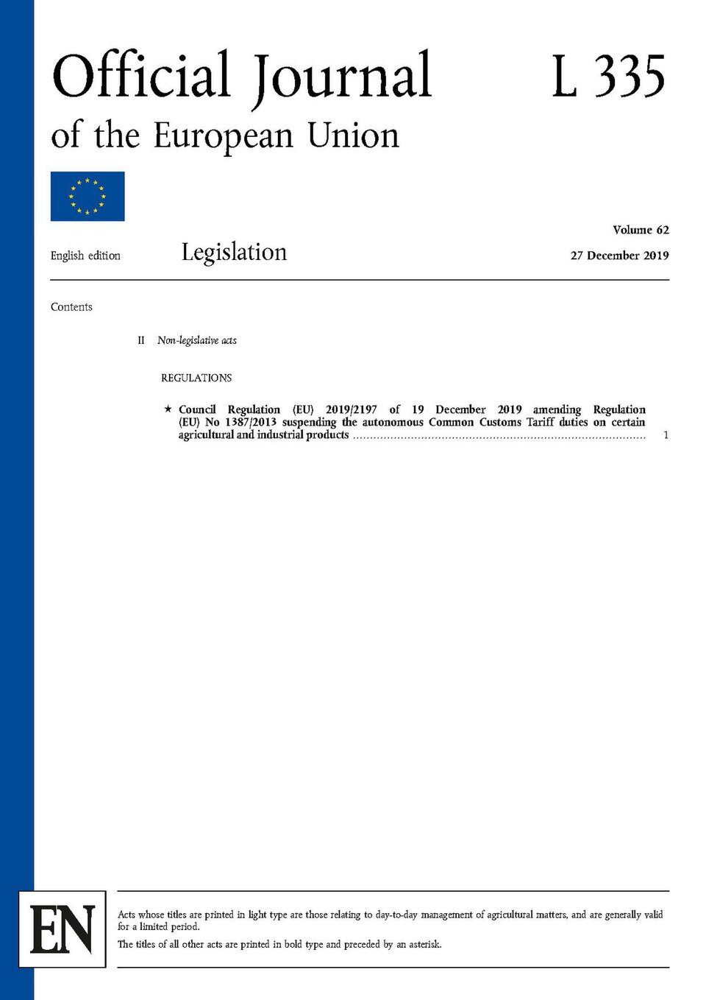
> *Image: E-gabrielyan, CC BY-SA 4.0*

- [Hydrogen & Silane Production](hydrogen-silane.md) — Hydrogen via electrolysis (4-5 kWh/Nm³) with Pd membrane purification, steam reforming of methane, and silane (SiH₄) production from MG-Si via trichlorosilane redistribution.

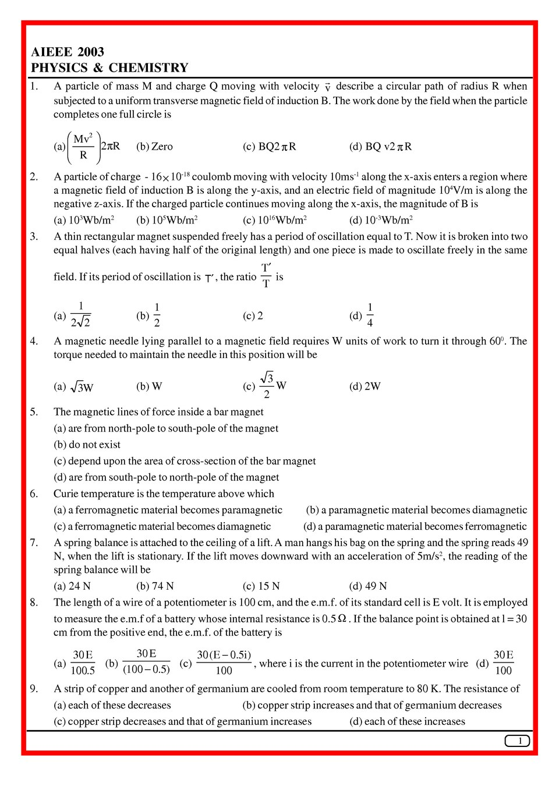
> *Image: Myself, Public domain*

- [SEM Tech Ion Exchange Membrane](sem-tech.md) — open-source cation exchange membrane for chlor-alkali electrolysis

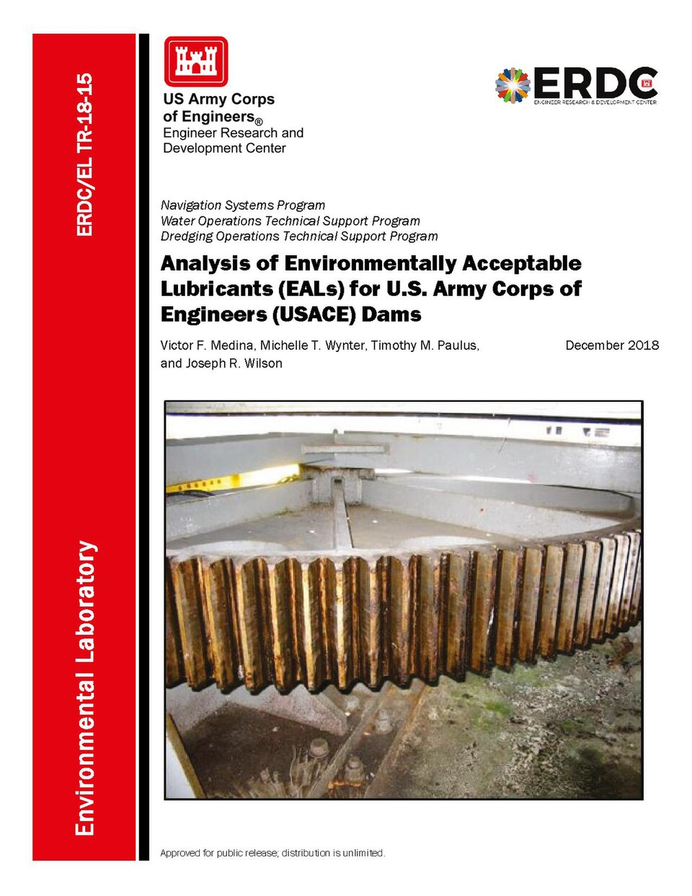
> *Image: Carbamatesalts, CC BY-SA 4.0*

- [Lubricants, Oils & Fluid Mechanics](lubricants.md) — Overview of lubrication theory (boundary, hydrodynamic, EHL), selection guide, and cross-cutting topics. Links to focused articles:

<!-- TODO: source image for Natural Lubricants -->
  - [Natural Lubricants](lubricants-natural.md) — Rendering animal fats (tallow, lard) and pressing vegetable oils (castor, rapeseed, olive, linseed) for boundary lubrication.

> *Image: Unknown author, Public domain*

  - [Grease, Solid Lubricants & Bearing Lubrication](lubricants-grease-solid.md) — Grease production (sodium, calcium, lithium soap thickeners), solid lubricants (graphite, MoS₂, PTFE), and bearing lubrication methods.

<!-- TODO: source image for Mineral Oil Lubricants, Cutting Fluids & Hydraulic Fluids -->
  - [Mineral Oil Lubricants, Cutting Fluids & Hydraulic Fluids](lubricants-mineral.md) — Refined petroleum lubricants, ISO VG grading, cutting fluid formulations, and hydraulic fluid types.

<!-- TODO: source image for Synthetic Lubricants & Specialty Fluids -->
  - [Synthetic Lubricants & Specialty Fluids](lubricants-synthetic.md) — PAO, ester, silicone, and PFPE synthetics; vacuum oils; cleanroom-compatible lubricants.

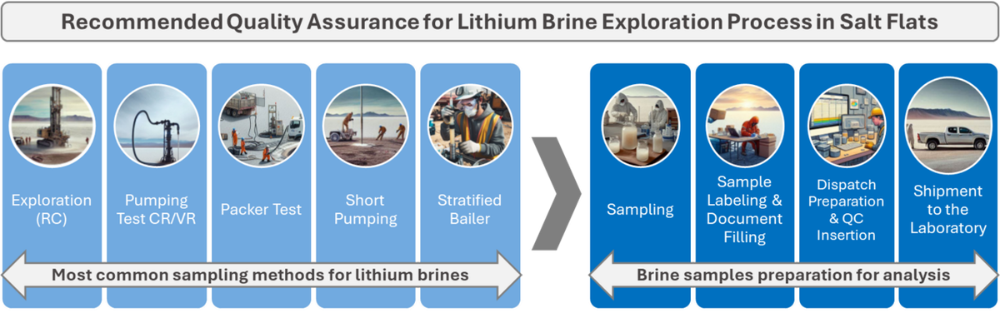
> *Image: Levy Fuentes, Public domain*

- [SEM Tech Lithium Separation](sem-tech-lithium-separation.md) — selective ion recovery from brines

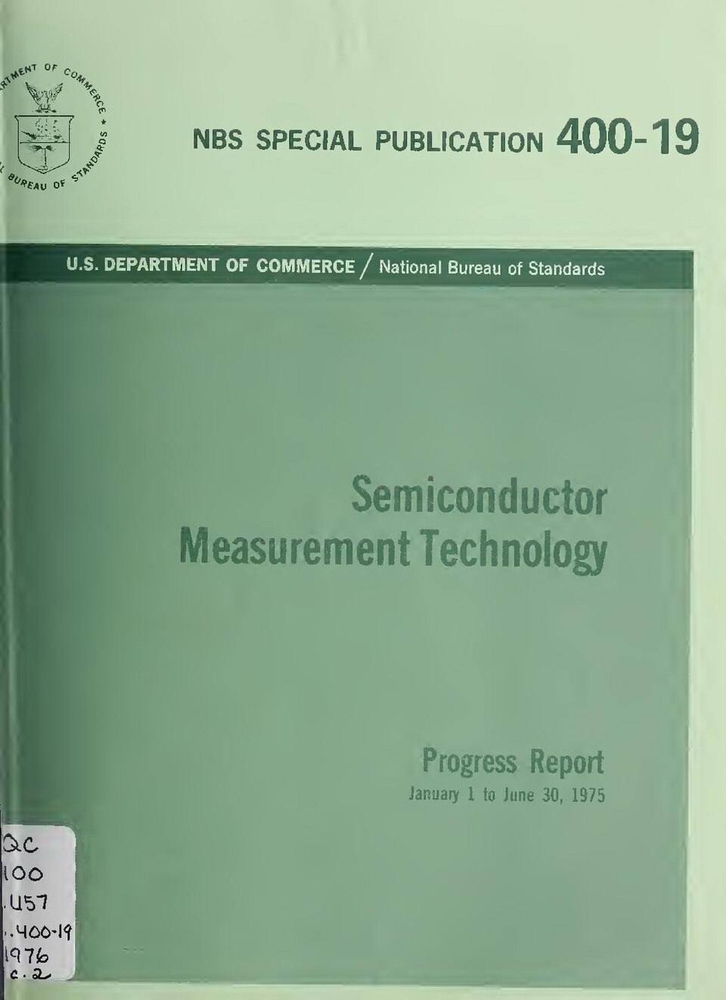
> *Image: Retired electrician, CC0*

- [Semiconductor Packaging & Testing](packaging-testing.md) — Wafer backgrinding, die singulation (diamond blade dicing), die attach (eutectic or epoxy), wire bonding (Au ball bonding, Al wedge), encapsulation (transfer molding with epoxy-silica compound), lead forming, wafer probing (DC parametric + functional), burn-in, and final test.

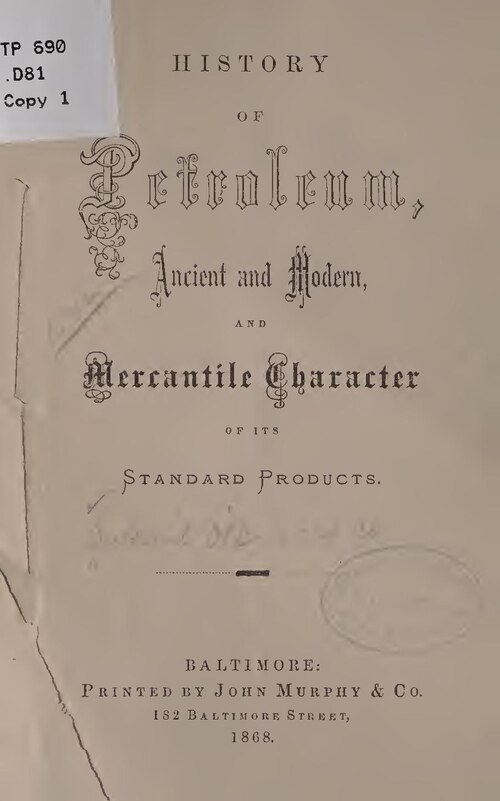
> *Image: Carbamatesalts, CC BY-SA 4.0*

- [Petroleum & Alternative Chemistry](petroleum-alternatives.md) — Petroleum extraction (surface seeps → cable-tool → rotary drilling), refining (batch distillation → fractional distillation → thermal cracking), coal tar chemistry (benzene, phenol, naphthalene from coke ovens), fermentation (ethanol, acetone, acetic acid, methanol), and wood gasification.

> *Image: Choij, Public domain*

- [Explosives & Propellants](explosives.md) — Black powder, nitrocellulose, dynamite, and smokeless powder manufacture for mining and industrial applications.

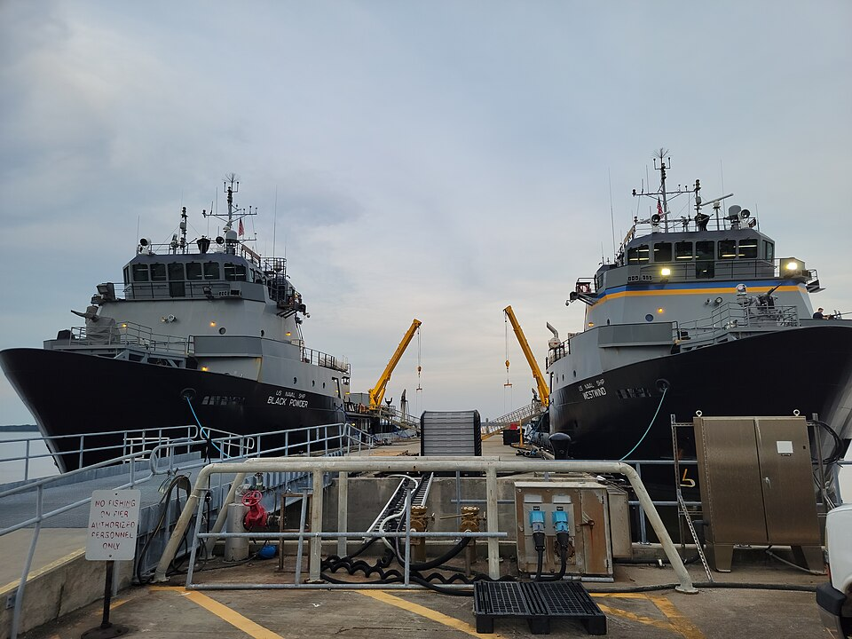
> *Image: Fritzmann2002, CC BY-SA 4.0*

  - [Black Powder](black-powder.md) — KNO₃/charcoal/sulfur manufacture, corning, and granulation for mining and firearms.

<!-- TODO: source image for Nitrocellulose & Smokeless Powders -->
  - [Nitrocellulose & Smokeless Powders](nitrocellulose.md) — Guncotton, pyroxylin, single-base and double-base propellant production.

<!-- TODO: source image for Nitroglycerin & Dynamite -->
  - [Nitroglycerin & Dynamite](nitroglycerin-dynamite.md) — Nitroglycerin synthesis and dynamite cartridge manufacture.

<!-- TODO: source image for High Explosives (TNT, RDX, ANFO) -->
  - [High Explosives (TNT, RDX, ANFO)](high-explosives.md) — TNT, RDX, and ANFO for industrial mining and military munitions.

<!-- TODO: source image for Detonation & Blasting -->
  - [Detonation & Blasting](detonation-blasting.md) — Blasting caps, initiating systems, detonation physics, blasting design, and safety.

> *Image: Unknown author, CC BY-SA 4.0*

- [Fermentation Chemistry](fermentation.md) — Microbial production of ethanol, acetone, butanol, acetic acid, and methanol from biomass feedstocks.

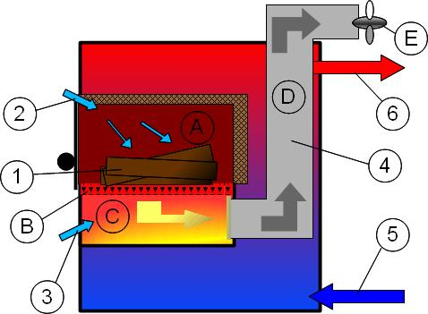
> *Image: Ignatus, CC BY-SA 3.0*

- [Wood Gasification](wood-gasification.md) — Producer gas generation from biomass via partial combustion for engine fuel and chemical feedstock.

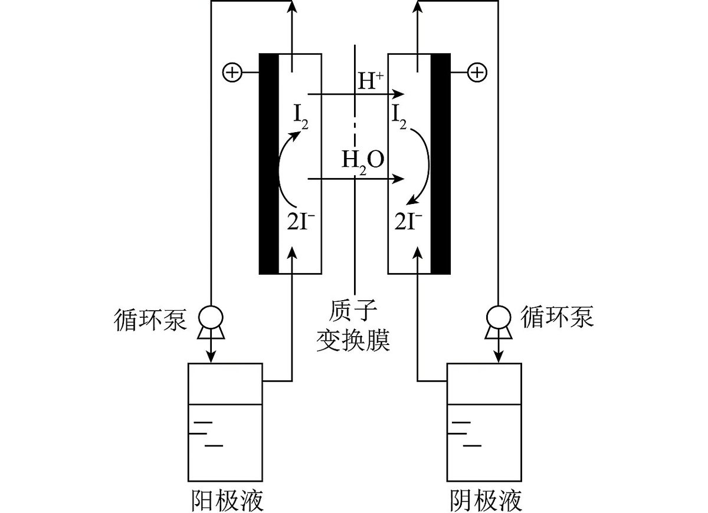
> *Image: NoteDamn, Public domain*

- [SEM Tech Water Electrolysis](sem-tech-water-electrolysis.md) — PEM water electrolysis for green hydrogen

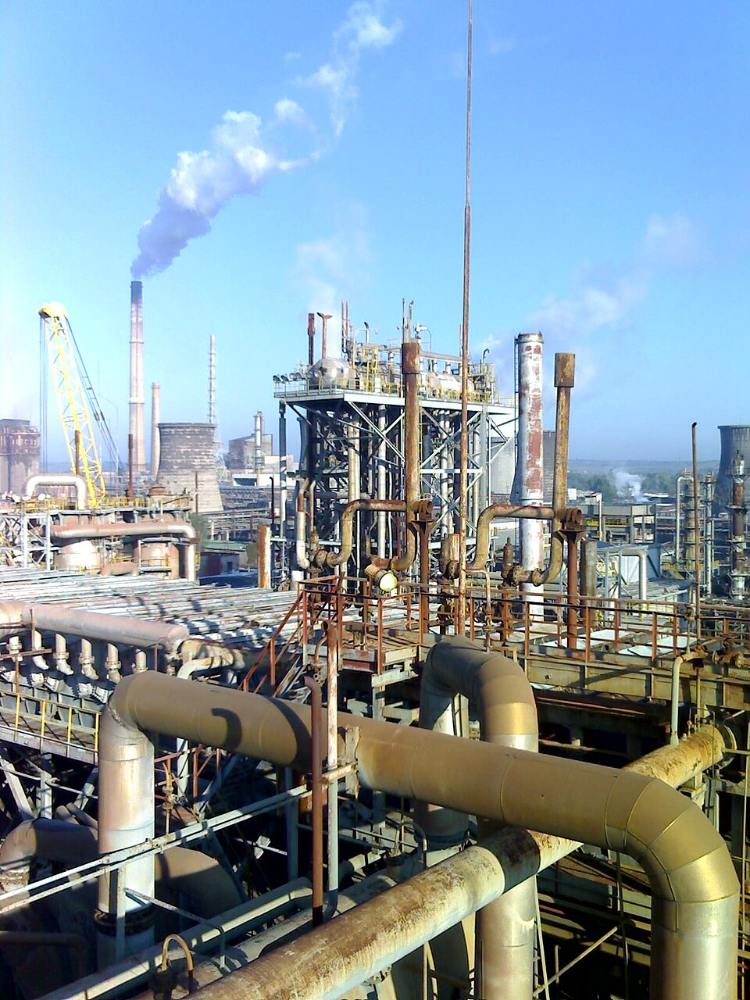
> *Image: Tseno Tanev, CC BY-SA 3.0*

- [Ammonia & Fertilizer Production](ammonia.md) — Haber-Bosch synthesis (N₂ + 3H₂ → 2NH₃), Ostwald nitric acid, fertilizer production (ammonium nitrate, urea, superphosphate).

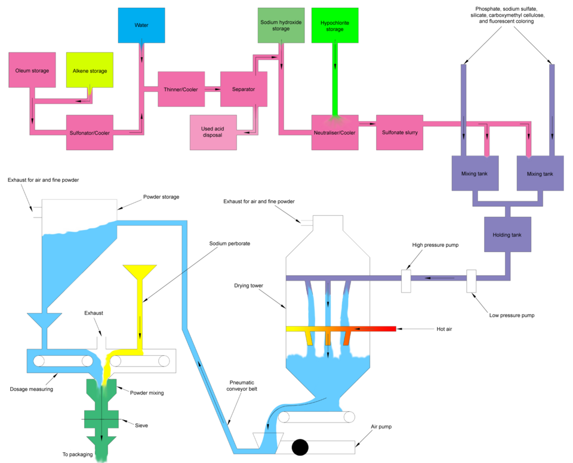
> *Image: KVDP derivative, Public domain*

- [Soap & Detergent Production](soap.md) — Saponification of fats with NaOH/KOH, glycerol recovery, synthetic detergents.

<!-- TODO: source image for Solvent Production -->
- [Solvent Production](solvents.md) — Ethanol, methanol, ether, turpentine, hydrogen peroxide, chlorinated solvents, and solvent selection guide.

<!-- TODO: source image for Chemical Recovery & Solvent Regeneration -->
- [Chemical Recovery & Solvent Regeneration](chemical-recovery.md) — Regeneration of spent industrial chemicals (solvents, acids, catalysts, process water) via distillation, membrane separation, and chemical regeneration for reuse in manufacturing.

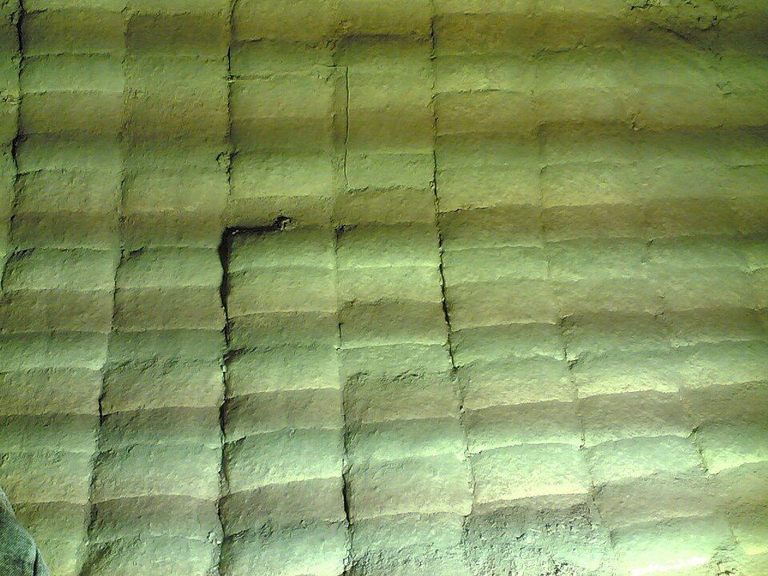
> *Image: Alexknight12, CC BY-SA 3.0*

- [Refractory Materials](refractories.md) — Firebrick, alumina, magnesite, and insulating refractories for furnace linings above 1500°C.

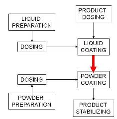
> *Image: Denoyelle, Public domain*

- [Paints, Coatings & Inks](coatings.md) — Paint chemistry, nitrocellulose dope, varnishes, ink chemistry, rust prevention.

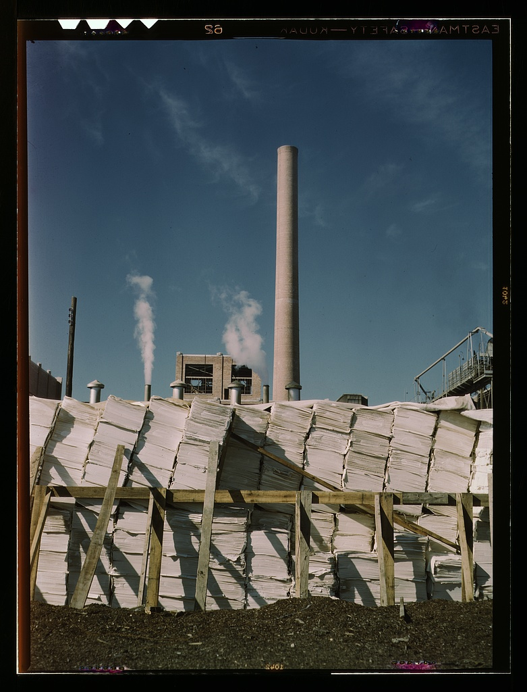
> *Image: John Vachon, Public domain*

- [Pulp & Paper Chemicals](pulp-chemicals.md) — Kraft pulping white liquor, bleaching chemistry, sizing agents, recovery boiler cycle.

<!-- TODO: source image for Adhesives & Specialty Coatings -->
- [Adhesives & Specialty Coatings](adhesives-coatings.md) — Natural adhesives (hide glue, casein, starch paste, birch tar), synthetic adhesives (phenolic, epoxy, cyanoacrylate, silicone, UV-cure), semiconductor adhesives (EMC, die attach films), anodizing, and galvanizing.

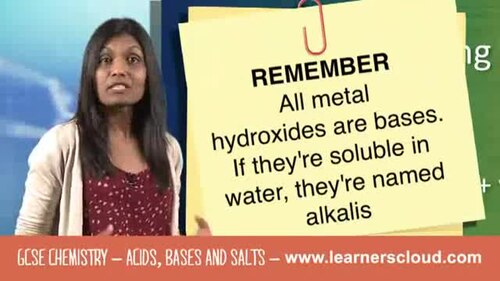
> *Image: FrozenMan (talk) (Uploads), CC0*

- [Acids & Bases (Comprehensive Reference)](acids-bases.md) — Cross-referenced guide to sulfuric, HCl, HNO₃, HF, phosphoric acid, NaOH, Na₂CO₃ production processes, safety, and bootstrap sequencing.

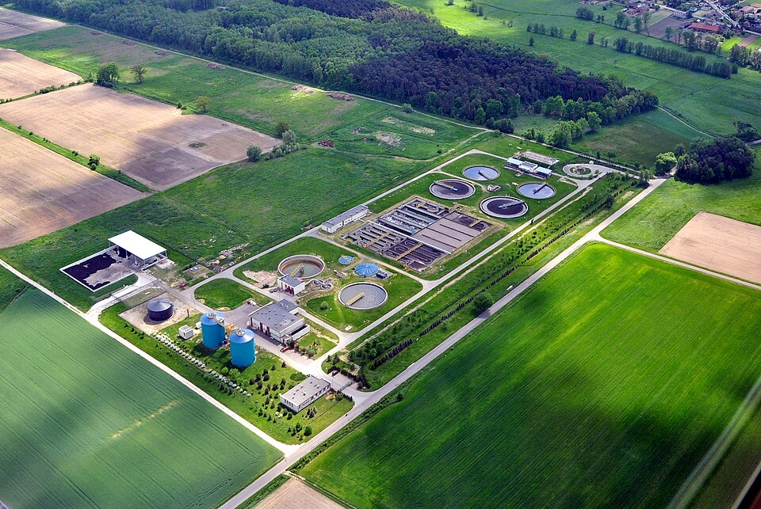
> *Image: Stiopa, CC BY-SA 3.0*

- [Industrial Water Treatment](water-treatment.md) — Water purification hierarchy from coagulation to ultrapure water (18.2 MΩ·cm) for semiconductor fabrication.

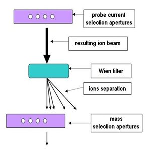
> *Image: Kriegor27, Public domain*

- [Semiconductor Process Chemicals](semiconductor-chemicals.md) — Photoresist chemistry (DNQ/novolak, chemically amplified resists), TMAH developer (2.38%), buffered oxide etch (BOE), CMP slurry (colloidal silica, Preston's equation), piranha etch, RCA clean (SC-1/SC-2), and cleanroom chemical specifications.

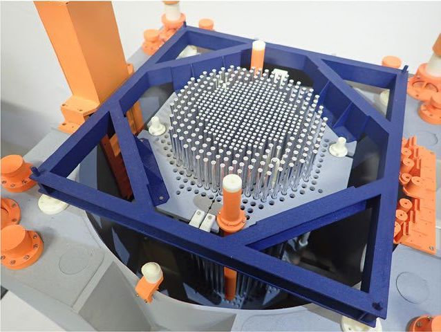
> *Image: Vincent Lamirand, CC BY 4.0*

- [Reactor Vessel](reactor-vessel.md) — Pressure vessels and stirred-tank reactors for chemical synthesis, polymerization, and process chemistry.

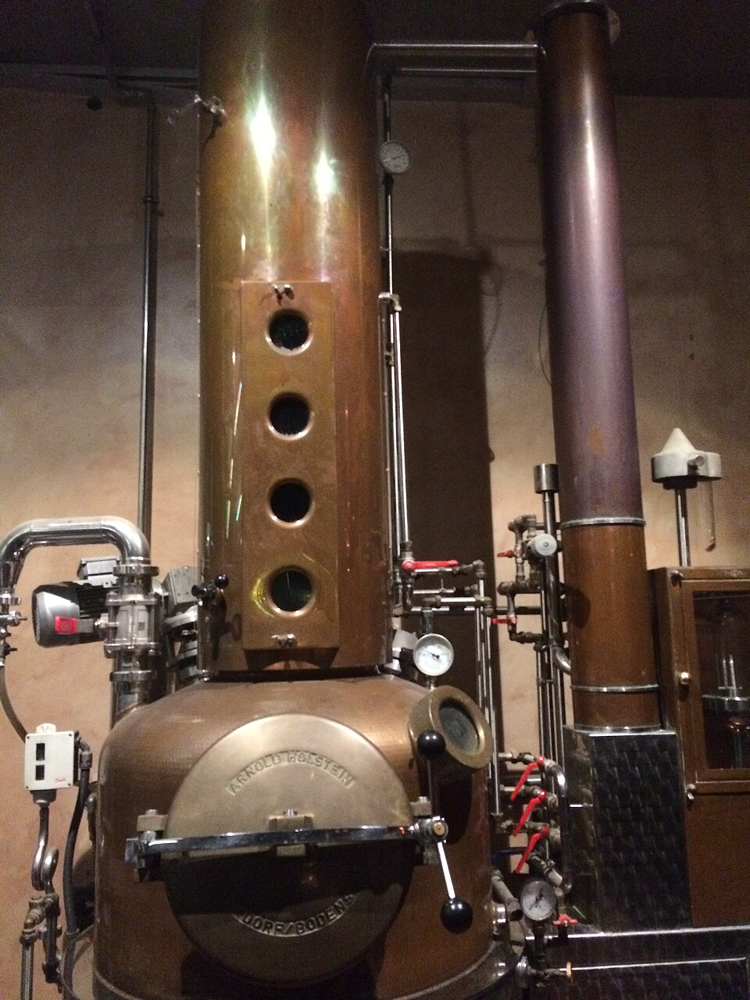
> *Image: Heribert3, CC BY-SA 4.0*

- [Distillation Column](distillation-column.md) — Fractional distillation columns (packed and tray) for separating liquid mixtures by boiling point.

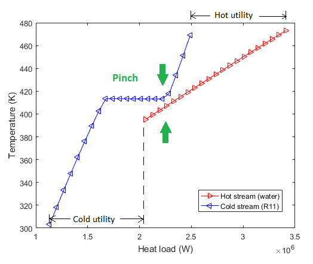
> *Image: Engineering Guy, CC BY-SA 4.0*

- [Heat Exchanger](heat-exchanger.md) — Shell-and-tube, plate, and coil heat exchangers for thermal energy transfer between process streams.

> *Image: Mahdieh.keshmiri, CC BY-SA 4.0*

- [Electrolysis Cell](electrolysis-cell.md) — Electrolytic cells for chlor-alkali production, water splitting, metal refining, and electrochemical synthesis.

> *Image: L.A. Enzinger, Public domain*

- [Filter Press](filter-press.md) — Plate-and-frame filter presses for solid-liquid separation in chemical processing and wastewater treatment.

> *Image: Bausch &amp; Lomb Optical Company, Public domain*

- [Centrifuge](centrifuge.md) — Centrifugal separation equipment for liquid-liquid and solid-liquid separation in chemical and biological processing.

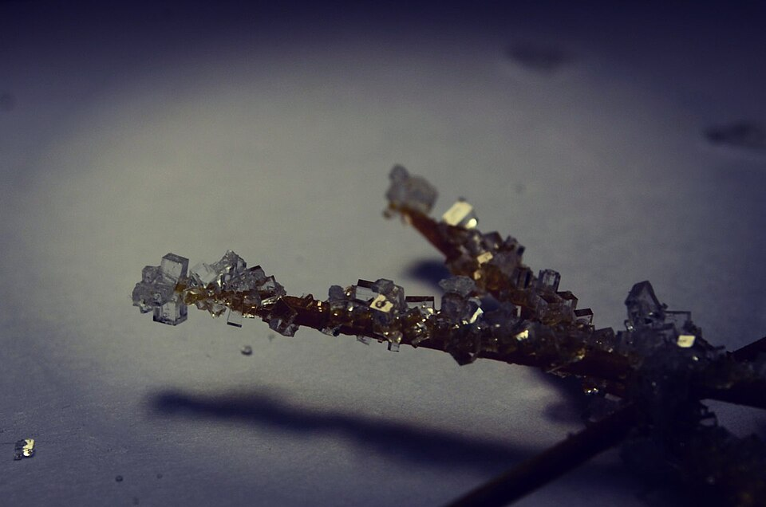
> *Image: AntoninaSmir, CC BY-SA 4.0*

- [Crystallizer](crystallizer.md) — Evaporative and cooling crystallizers for producing solid crystals from solution.

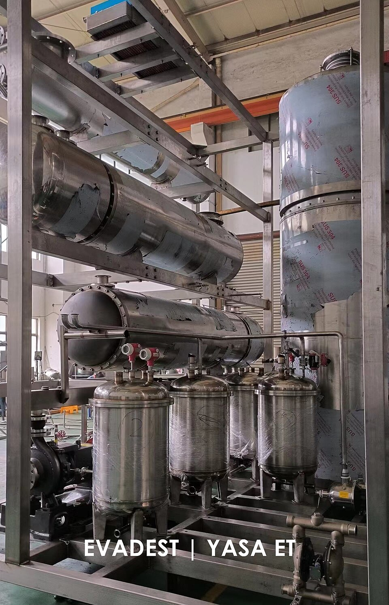
> *Image: Filosig, CC BY-SA 4.0*

- [Evaporator](evaporator.md) — Falling film, forced circulation, and multiple-effect evaporators for concentrating solutions by solvent removal.
[↑ Back to Tech Tree](../../index.md)
