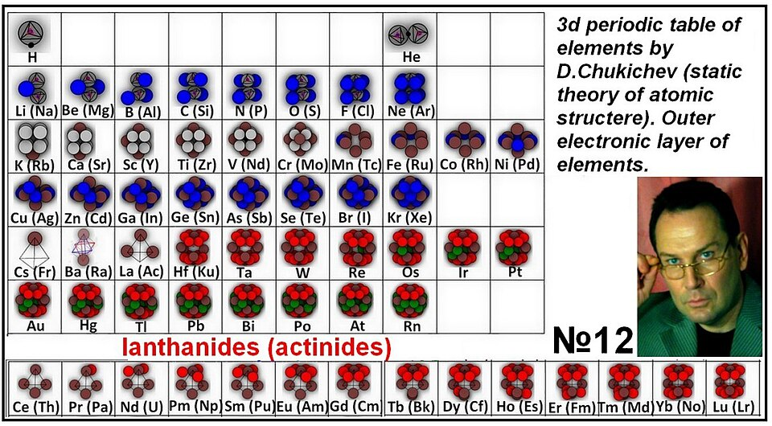

# Lithium Separation

> **Node ID**: chemistry.lithium-separation
> **Domain**: [Chemistry](./index.md)
> **Dependencies**: [`Electrolysis`](electrolysis.md)
> **Enables**: Various downstream capabilities
> **Timeline**: Years 30-50
> **Outputs**: lithium_compounds
> **Critical**: No

## Overview

> *The static theory of the structure of the atom, or the model of the atom (Chukichev D.V. 2014) (Ста́тика (from the Greek στατός, "immovable") - the basic model of the atom, based on the static position of electrons in the atom due to the combined electromagnetic forces of electrons. Based on because the electron is a complex, combined dipole structure arising from the fusion of elementary carriers of both positive and negative charges. the charges do not annihilate, but retain their physical properties, creating sectors of negative and positive magnetic fields. At the same time, the total conventional charge of the dipole electron is -1. Electrons interact with each other, attracted by different poles of magnetic fields, until the same magnetic fields of different electrons stop. convergence, both between the electrons themselves and between the electrons and the nucleus of the atom.Thus, the volume of the atom is created from the combination of the voltages of the different magnetic fields. These fields align the locations of electrons around the nucleus in the form of electron layers (spheres). These same magnetic fields of electrons of different atoms create chemical and physical interactions between atoms in the form of molecules, crystal structures, aggregate states, etc. The static structure of an atom is a self-regulating stable structure with a balance of electromagnetic forces, where the charge of the nucleus is equal to the number of electrons. The static model of the atom falls under the laws of classical mechanics, eliminating the inventions of quantum physics, which invented more and more new postulates to somehow justify the volume of the atom. Over time, the static model of the atom may replace Rutherford's model, Thomson's model Nothing can be relatively eternal than a static state of matter. Static theory of atomic structure. (The author of the theory is Dmyro Vitaliyovych Chukichev (Ukraine) 2014). Details of the proofs of the theory on the Facebook page https://www.facebook.com/profile.php?id=100069923056093 (Each theory has the right to exist until it has been disproved by irrefutable evidence.) The dynamic (planetary) theory of the atom model is based on the dynamics of the movement of electrons around the nucleus. In the planetary theory, an electron is an elementary carrier of an elementary negative charge. The nucleus of an atom has a positive charge. According to Coulomb's law, a negatively charged particle is attracted to a positively charged particle. And the smaller the distance between them, the more the force of attraction increases in geometric progression. According to the logic of the laws of physics, an electron should fall on the nucleus of an atom (nuclear reaction). Despite this absurdity, scientists of that time accepted the planetary theory of the structure of the atom, based on the assumption of the movement of electrons around the nucleus of the atom. Scientists of the beginning of the 20th century looked at the sky, at the "eternal" movement of the planets around the Sun and extrapolated the model of the Solar System to the structure of the atom. The basis of the existence of the solar system is described by Newton's laws, where the mass of bodies, the force of attraction of bodies (gravity), the distance between bodies and their speed are mutually related. The smaller the distance between the bodies at constant mass, the greater the radial velocity, which compensates for the gravitational attraction of the bodies by the centrifugal force of orbital motion. The balance of these forces creates the conditions for the "eternal" circular motion of the planets around the Sun. The influence of a cosmic body from outside the Solar System is enough, as the balance of "eternal" motion will be disturbed and destroy the stability of the Solar System. The atom is constantly affected by external forces. These include mechanical effects, chemical reactions, thermal, electrical, and magnetic effects. But the atom remains unchanged and almost "eternal". What ensures its incredible strength? What cement held together the electrons, which according to Coulomb's law should have moved as far as possible. Instead, the outer electron layers of different atoms attract each other, creating strong molecules from atoms, which contradicts Coulomb's law. Science currently has no practical evidence of the "eternal" circular motion of electrons around the nucleus of an atom. The movement of electrons itself requires constant energy. Therefore, scientists of that time began to supplement the planetary model of the atom with new inventions about the wave duality of the electron, where energy is not wasted. Although, the movement of an electron along a conductor (electric current) creates a magnetic field. This field does the work. Therefore, the energy of the electron's motion is transferred outside the conductor and the electron loses energy. On the other hand, the movement of an electron around the nucleus in an atom, according to the invention of Bohr, Planck, does not create a magnetic field and does not lose energy. The electron thus turns into a wave and a material particle at the same time. But the creation of a wave (a manifestation of energy) also requires energy consumption. Wind energy creates waves on the sea. No energy will be applied, there will be no waves. In the planetary theory of the model of the atom, the main law of physics - the law of conservation of energy - is violated. Static theory of the atom model. The static theory of the atom model is based on only one assumption - the electron is a complex, combined, dipole structure, which is based on a new law of physics discovered in 2014. : "elementary carriers of elementary charges cannot exist for long and necessarily merge with the carrier of the opposite charge, creating a combined particle where the charges are stored and create different fields of magnetic influence." An electron is such a combined particle, where elementary carriers of opposite charges create sectoral electromagnetic fields. Opposite fields of neighboring electrons attract. Electrons converge to a distance as long as the same magnetic fields stop the electrons from approaching. The same thing happens between the positively charged nucleus of an atom and an electron. The positive charge of the electron stops the electron from approaching the nucleus. Electrons in combinations of different sectors of different magnetic fields hang in the space of the atom, being clearly distributed relative to other electrons and the nucleus of the atom. Therefore, the atom has the shape of a sphere with the nucleus of the atom in the center and electron layers. Since the masses of electrons are small relative to the nucleus, the atom appears to us to be hollow. This volume of the atom is filled with static forces of various magnetic fields. If another atom intervenes in this combination of fields during a chemical reaction, the magnetic fields of the outer electronic layers in the molecule are redistributed with the release of energy (exothermic chemical reactions). It is also worth mentioning the electrons in the electric current. The loss of an electron by an atom will lead to redistribution of the outer electronic layer, physical and chemical changes in the properties of the atom. A lithium atom cannot turn into a helium atom due to the loss of an electron. Therefore, the electric current The static theory of the structure of the atom explains differently. An electron loses one of its elementary particles, the carrier of a negative charge. This carrier, moving in an electric current, returns to the electron due to the change in the total charge of the electron from negative to positive. According to Coulomb's law, an electron particle is attracted back, and the energy of separation of an electron particle is equal to the energy of attraction to this electron. That is, the energy of the electric current generator after the detachment of an electron particle is equal to the work of this particle during its return. A logical question arises: if an electron has lost an elementary particle, the carrier of an elementary negative charge, then the electron becomes positively charged and can leave the atom due to repulsion with the positively charged nucleus. But this is not happening. Conclusion: an electron can have several elementary carriers of negative charges, and the loss of one of them does not significantly change the properties of the electron. The minimum volume in space is created by four points (tetrahedron). Currently, science has recorded the existence of a new particle - the positron, which is similar in mass to the electron, but has the opposite positive charge. Based on logic, I can assume that the positron is nothing but an electron that has lost its elementary carriers of elementary negative charges, or lost only a part of such carriers, changing the total charge to positive. The logical structure of the electron arises. At the center of the electron is a positron with a positive charge. Along the perimeter, there are several carriers of negative charges, their total value is greater than the charge of a positron. Therefore, science conventionally noted the charge of an electron as -1. Several carriers of negative charges can be many (the number is unknown). Science has neither proven nor disproved this. Therefore, I took as a basis four carriers of negative charges, the minimum number of which can create volume. He called them tetrons. Thus, the electron is a complex combined dipole particle consisting of a positive positron and four negative tetrons. (The tetron is the basic particle of electric current.) https://www.facebook.com/media/set/?set=a.206752963141722&amp;type=3 )*

> *Image: Чукічев Дмитро Віталійович, CC0*

Selective lithium extraction from brines and clays using lithium-ion selective membranes and electrodialysis. Produces battery-grade lithium compounds essential for energy storage and electronics manufacturing.

Primary outputs: `lithium_compounds`. These materials or products serve as inputs for downstream manufacturing and processing steps.

Lithium is the lightest metal and a critical material for battery technology, ceramics, and pharmaceuticals. It occurs in two main deposit types: hard rock pegmatite ores (spodumene, petalite, lepidolite) and brine deposits (salars or salt flats). Each requires different extraction and separation approaches. Hard rock mining involves conventional quarrying, crushing, and thermal treatment followed by acid leaching. Brine extraction pumps lithium-rich groundwater into evaporation ponds where solar energy concentrates the lithium over months.

The separation challenge is that lithium is chemically similar to sodium and potassium (all are alkali metals), making selective separation difficult. In brine processing, the lithium must be separated from much larger quantities of sodium, potassium, and magnesium. In hard rock processing, the lithium must be liberated from the aluminum-silicate mineral matrix. Both routes require significant chemical processing infrastructure, placing lithium separation in the mid-to-late industrial development phase.

## Prerequisites

### Materials

- Lithium-containing brine (from salar deposits) or spodumene ore (LiAlSi₂O₆) from hard rock pegmatites
- Sulfuric acid (concentrated, >93%) for acid leaching of beta-spodumene
- Sodium carbonate (soda ash) for lithium carbonate precipitation
- Calcium hydroxide (lime) for conversion to lithium hydroxide
- Flocculants and precipitation reagents for impurity removal

### Equipment

- [Electrolysis](electrolysis.md) — tool dependency
- Evaporation pond system (lined with HDPE or compacted clay) for brine concentration
- Rotary kiln or multiple-hearth furnace for spodumene decrepitation (1100°C)
- Ball mill for ore grinding to <150 μm particle size
- Leaching tanks with agitation and heating for acid digestion
- Filter press or vacuum belt filter for solid-liquid separation
- Crystallizer and dryer for lithium carbonate product finishing

### Knowledge

- Spodumene phase chemistry: the α-to-β phase transformation at 1100°C opens the crystal lattice, increasing lithium extraction from <10% to >90% during acid leaching
- Brine evaporation kinetics: how temperature, wind, and humidity affect evaporation rate, and the sequential precipitation order of NaCl → KCl → Mg salts → Li concentration
- Carbonate precipitation control: how pH, temperature, and sodium carbonate addition rate affect lithium carbonate crystal size and purity
- Impurity management: how iron, aluminum, magnesium, and calcium co-precipitate and must be removed before the final lithium carbonate precipitation step

### Infrastructure

- Large flat land area for evaporation ponds (brine route) — typically 1-3 km² per facility, lined to prevent brine leakage into groundwater
- High-temperature furnace capable of sustained 1100°C operation for spodumene decrepitation (hard rock route)
- Acid-resistant leaching tanks and piping (rubber-lined steel or HDPE) for sulfuric acid leaching at 250°C
- Large-volume water supply for washing and purification steps
- Tailings management for spent ore (hard rock) or concentrated brine reject (brine route)

## Process Description

The two lithium extraction routes differ fundamentally in their approach. Brine extraction uses solar energy to concentrate lithium over months, then chemical precipitation to recover the product. Hard rock extraction uses thermal and chemical energy to liberate lithium from the mineral matrix in hours.

### Step-by-Step Procedure

**Brine Route:**

1. Pump lithium-rich brine (typically 500-1500 ppm Li) from subsurface aquifers into the first of a series of shallow evaporation ponds. The brine also contains high concentrations of sodium, potassium, magnesium, and boron.
2. Allow solar evaporation over 12-24 months, transferring concentrated brine between ponds as salt precipitates. Sodium chloride precipitates first, followed by potassium chloride (sold as potash). The lithium concentration increases to 1-2% in the final pond.
3. Remove magnesium by adding lime (Ca(OH)₂) to precipitate magnesium hydroxide. Boron is removed by solvent extraction or ion exchange.
4. Precipitate lithium carbonate by adding sodium carbonate (soda ash) to the purified brine, heated to 80-90°C. Li₂CO₃ is relatively insoluble in hot water and crystallizes out.
5. Filter, wash, and dry the lithium carbonate. Redissolve and reprecipitate if higher purity is needed.

**Hard Rock (Spodumene) Route:**

1. Mine spodumene ore (LiAlSi₂O₆) from pegmatite deposits. Crush and grind to <150 μm. Concentrate by froth flotation to increase spodumene content to 6-7% Li₂O.
2. Decrepitate (roast) the concentrate at 1050-1100°C in a rotary kiln. The α-spodumene (monoclinic) converts to β-spodumene (tetragonal), expanding the crystal structure by ~30% and making the lithium accessible to acid attack.
3. Cool the roasted β-spodumene and mix with concentrated sulfuric acid (93% H₂SO₄) at 250°C in a leaching reactor. The reaction produces lithium sulfate: β-LiAlSi₂O₆ + H₂SO₄ → Li₂SO₄ + Al₂O₃ + SiO₂ + H₂O.
4. Dissolve the lithium sulfate in water. Adjust pH to 10-12 with lime to precipitate iron, aluminum, and other impurity hydroxides. Filter.
5. Precipitate lithium carbonate by adding sodium carbonate to the purified Li₂SO₄ solution at 80-90°C. Filter, wash, and dry.
6. For battery-grade lithium hydroxide (LiOH·H₂O), convert Li₂CO₃ by reaction with calcium hydroxide, or crystallize directly from purified lithium sulfate solution.

### Process Parameters

| Parameter | Range | Notes |
|-----------|-------|-------|
| Decrepitation temperature | 1050-1100°C | Below 1000°C: incomplete conversion; above 1150°C: sintering reduces reactivity |
| Acid leaching temperature | 200-250°C | Autoclave conditions; higher temperature increases extraction rate |
| H₂SO₄ dosage | 30-40% excess | Ensures >90% lithium extraction from β-spodumene |
| Carbonation temperature | 80-90°C | Li₂CO₃ solubility decreases with temperature (unusual; most salts increase) |
| Evaporation rate (brine) | 2000-3000 mm/year | Depends on climate; arid, windy locations preferred |
| Li₂CO₃ purity target | >99.5% (battery grade) | Na <200 ppm, Ca <100 ppm, Fe <10 ppm, magnetic particles <25 ppb |

## Safety Considerations

This process involves specific hazards requiring trained personnel and protective measures:

- **Sulfuric acid handling**: Concentrated H₂SO₄ (93%) causes severe chemical burns. The acid leaching step operates at 250°C under pressure, creating risk of flash evaporation and acid spray if seals fail. All acid piping and vessels must be rated for both corrosion and pressure.
- **High-temperature roasting**: The decrepitation furnace operates above 1100°C. Contact with hot equipment causes severe burns. Refractory lining failure can create a kiln breach with molten material ejection.
- **Lithium reactivity**: Lithium metal (not produced in this process, but a downstream product) reacts violently with water. Lithium carbonate and lithium hydroxide are irritants to skin, eyes, and respiratory tract.
- **Dust exposure**: Grinding spodumene ore generates silica-containing dust. Prolonged inhalation causes silicosis. Dust collection and respiratory protection are mandatory in the grinding area.
- **Brine pond hazards**: Evaporation ponds contain concentrated salt solutions with high density. Falls into ponds are difficult to escape due to buoyancy changes and crystallized salt crusts that may not support weight.

### Personal Protective Equipment

- Chemical splash suit and face shield for acid leaching operations, with acid-resistant gloves (neoprene or nitrile)
- Heat-resistant clothing and face shield for decrepitation furnace area (aluminized apron for extended exposure)
- P100 respirator for ore grinding and dry powder handling areas
- Steel-toe rubber boots with metatarsal guard for both acid and hot material handling areas

### Emergency Procedures

- For acid contact: flush immediately with water for 15 minutes. For H₂SO₄ splash to eyes, flush and seek medical attention — acid burns continue penetrating tissue until diluted.
- For furnace breach: evacuate the area, do not attempt to approach or seal the breach. Hot material ejection can extend several meters.
- For brine pond fall: use rescue pole or boat. Do not enter the pond without a safety line. Concentrated brine is denser than freshwater and swimming is difficult.

## Quality Control

### Acceptance Criteria

- **Lithium Carbonate (Li₂CO₃)**: Purity >99.5% for battery grade. Sodium <200 ppm, calcium <100 ppm, iron <10 ppm, magnetic impurities <25 ppb. Moisture content <0.5% after drying.
- **Lithium Hydroxide Monohydrate (LiOH·H₂O)**: Purity >99.0% for battery grade. CO₂ content <0.5% (indicates incomplete conversion or CO₂ absorption from air). Calcium <50 ppm.
- **Technical Grade Li₂CO₃**: Purity >99.0%, acceptable for ceramics and glass applications with higher impurity tolerance.

### Testing Methods

- ICP-OES (inductively coupled plasma optical emission spectroscopy) for multi-element impurity analysis at ppm level
- X-ray diffraction for phase identification of decrepitated spodumene (α vs β content)
- Loss-on-drying at 250°C for moisture content
- Magnetic susceptibility measurement for magnetic particle contamination (critical for battery cathode manufacturing)
- Titration with standardized HCl for lithium content (quick production check)

### Sampling Protocol

- Sample brine at each pond stage weekly — track lithium concentration and impurity buildup
- Test decrepitated spodumene for phase conversion completeness (XRD) before leaching — incomplete conversion wastes acid
- Sample leachate after impurity precipitation and filtration — check iron, aluminum, calcium levels before carbonation
- Test final Li₂CO₃ product from each batch against full battery-grade specification

## Scaling Notes

Transitioning from bench-scale to production involves these considerations:

- **Bench scale**: 100 g spodumene samples roasted in a muffle furnace, leached in beakers with stirring. Evaporation experiments in glass trays. Produces grams of Li₂CO₃. Used to optimize decrepitation temperature, acid dosage, and carbonation conditions.
- **Pilot scale**: 100-1000 kg batches through a pilot rotary kiln and leaching circuit. Small evaporation pond series (0.1-1 hectare). Produces kilograms of Li₂CO₃ per batch. Validates process flow and identifies impurity control issues before full-scale investment.
- **Production scale**: Continuous rotary kiln processing 50-100 tonnes of spodumene per day, or brine operation pumping 100-1000 L/s from production wells. Produces 10,000-50,000 tonnes Li₂CO₃ per year.

Key scaling challenges: the decrepitation step is energy-intensive (heating to 1100°C consumes 2-3 GJ per tonne of spodumene). Heat recovery from kiln exhaust is essential at production scale. Brine evaporation requires enormous land area and is weather-dependent — a cold or rainy year slows production. Battery-grade purity requires multiple crystallization and washing steps that reduce overall lithium recovery (typically 80-85% for hard rock, 50-60% for brine).

## Troubleshooting

| Problem | Probable Cause | Solution |
|---------|---------------|----------|
| Low lithium extraction from spodumene (<80%) | Incomplete α→β conversion during decrepitation — kiln temperature below 1050°C, insufficient residence time, or uneven heating in rotary kiln | Check kiln temperature profile with embedded thermocouples (must hold >1050°C for ≥30 min); increase kiln rotation speed to improve mixing; verify β-spodumene content by XRD (target >95% conversion); increase residence time to 60-90 min |
| High impurity levels in Li₂CO₃ (Na >200 ppm, Fe >10 ppm) | Insufficient pH adjustment during purification — iron precipitates above pH 3, aluminum above pH 4.5, but if pH not raised high enough, residual dissolved impurities carry into carbonation | Raise pH to 10-12 with Ca(OH)₂ in stages; add second impurity precipitation stage; filter through 1 μm cartridge filter before carbonation; test filtrate by ICP-OES (Fe <1 ppm, Al <1 ppm before proceeding) |
| Li₂CO₃ crystals too fine for filtration (slower than 50 L/m²·hr) | Carbonation temperature too low (<80°C), Na₂CO₃ addition rate too fast (nucleation dominates over crystal growth), or insufficient stirring | Heat solution to 85-90°C before adding Na₂CO₃; add Na₂CO₃ slowly over 60-90 min with vigorous stirring; hold at 90°C for 30 min after addition to allow crystal ripening; Li₂CO₃ solubility decreases with temperature (unusual — 1.3 g/100 mL at 20°C, 0.7 g/100 mL at 100°C) |
| Magnesium breakthrough in brine route (Mg >50 ppm in carbonation feed) | Incomplete Mg(OH)₂ precipitation — pH below 10.5, insufficient lime, or Mg(OH)₂ sludge resuspending during transfer | Add Ca(OH)₂ in excess (1.2-1.5× stoichiometric for Mg content); verify pH >10.5 before proceeding; allow Mg(OH)₂ sludge to settle 4-6 hours before decanting; consider second lime treatment stage for brines with Mg:Li ratio >10:1 |
| Low Li concentration in final brine pond (<1.0% Li) | Cold or humid climate reducing evaporation rate (target 2000-3000 mm/year in arid climates); excessive rainfall diluting ponds; or brine leakage through pond liner | Extend evaporation time; cover ponds with greenhouse structures (5-10°C temperature increase); repair or replace HDPE liner if leakage detected; consider supplemental mechanical evaporation (spray evaporators) for cold climates |
| Li₂CO₃ recovery below 75% (hard rock route) | Cumulative losses at multiple stages: flotation (70-85% recovery), decrepitation dust carryover, leaching (<90% extraction), impurity precipitation co-losses (1-3% per stage), and carbonation filtrate Li loss | Monitor Li in all waste streams by ICP-OES; recycle carbonation mother liquor to leaching circuit; optimize flotation pH to 8-9 with fatty acid collector; target overall recovery 80-85% — if below 75%, identify which stage is losing the most lithium |
| Spodumene flotation concentrate below 6% Li₂O | Ore grade too low (<1% Li₂O), grind size too coarse (>150 μm, poor liberation), or collector dosage insufficient | Regrind to <75 μm for better mineral liberation; increase fatty acid collector to 300-500 g/tonne; adjust pH to 8-9 with Na₂CO₃; add depressant (sodium silicate at 500 g/tonne) to suppress quartz gangue |
| LiOH product absorbs CO₂ during storage (CO₂ content >0.5%) | Lithium hydroxide is a strong base that reacts with atmospheric CO₂: 2LiOH + CO₂ → Li₂CO₃ + H₂O; storage containers not airtight | Store LiOH·H₂O in sealed, air-tight containers with desiccant; purge container headspace with dry N₂ before sealing; minimize open-time during dispensing; test CO₂ content by TGA (thermogravimetric analysis) before use in battery manufacturing |
| Sulfuric acid leaching autoclave corrosion | 93% H₂SO₄ at 250°C attacks standard stainless steel — pitting and stress corrosion cracking at welds | Use rubber-lined steel or HDPE-lined vessels for leaching; inspect welds monthly for cracking; monitor acid concentration — dilution below 85% reduces extraction efficiency; replace lining per manufacturer schedule (typically 2-5 years) |

## Variations and Alternatives

- **Direct lithium extraction (DLE)**: Uses ion-selective adsorbents (lithium aluminum layered double hydroxides) or membranes to extract lithium from brine without evaporation ponds. Reduces processing time from months to hours and land use by >90%. Requires higher energy input and more complex equipment.
- **Clay deposits (sedimentary lithium)**: Lithium-bearing clays (hectorite, jadarite) are acid-leached or roasted and water-leached. Lower grade than spodumene but potentially large resources. Process is still being commercialized.
- **Geothermal brine extraction**: Some geothermal power plant brines contain 100-200 ppm lithium. DLE technology can recover lithium from these brines while generating geothermal electricity. Dual revenue stream.
- **Lithium recycling from batteries**: Spent lithium-ion batteries are shredded, metals separated by hydrometallurgical or pyrometallurgical processes, and lithium recovered. Currently recovers <5% of lithium from end-of-life batteries, but growing as collection infrastructure matures.

The geographic concentration of lithium resources is a strategic concern. The largest brine deposits are in the "lithium triangle" of South America (Chile, Argentina, Bolivia), while the largest hard rock deposits are in Australia. Countries without domestic lithium supplies must import this material, creating supply chain vulnerabilities. Developing diversified lithium sources, including geothermal brines, clay deposits, and recycling, is a long-term strategic priority for any industrial civilization.

Environmental impact is a significant consideration for both routes. Brine extraction in arid regions consumes water that local communities and ecosystems depend on. The evaporation ponds cover large areas and the pumping of brine can affect freshwater aquifers. Hard rock mining creates open pits, waste rock piles, and tailings that must be managed. The sulfuric acid leaching process generates acidic waste that must be neutralized. Environmental impact assessments and community consultation are required before new extraction projects proceed, and the cost of environmental compliance is a significant fraction of total production cost.

For a bootstrapping civilization, the simplest lithium source would be pegmatite deposits that can be hand-mined and processed in small batches through a roasting furnace and acid leaching circuit. The brine route requires less energy but much more land and time. The decrepitation step is the primary energy bottleneck for hard rock processing — the furnace must reach and sustain 1100°C, consuming significant fuel. Once lithium carbonate is produced, it can be converted to lithium hydroxide or lithium metal through electrolysis, enabling battery manufacturing and downstream electronics.

## References

- [Chemistry](index.md) — parent capability
- [Chemistry Domain](./index.md) — domain overview and related capabilities
- [Electrolysis](electrolysis.md) — upstream dependency (tool)

### Material Handling

Lithium carbonate is a fine white powder that is mildly hygroscopic. Store in sealed containers in a dry location to prevent moisture absorption and caking. Lithium hydroxide is more reactive and absorbs CO₂ from air, gradually converting back to lithium carbonate — store in airtight containers and use within a specified shelf life. Both materials should be handled with dust protection to avoid respiratory irritation. Spent brine from evaporation ponds has a high salinity that can damage freshwater ecosystems if released without treatment.

Spodumene ore dust contains crystalline silica. Use dust collection at all grinding and transfer points, and require respiratory protection when handling dry ore or concentrate. Sulfuric acid for leaching must be stored in acid-compatible containers (steel with acid-resistant lining or HDPE) and handled with full chemical splash protection. The combination of acid, heat, and pressure in the leaching circuit makes this one of the higher-risk unit operations in lithium processing.

Lithium-ion battery recycling is an emerging source of lithium that may eventually supplement primary production. Spent batteries are shredded, the metals are separated by hydrometallurgical or pyrometallurgical processes, and the lithium is recovered from the resulting solutions or slags. Current recycling rates are low because the collection infrastructure is immature and the economics favor new production, but as lithium demand grows and primary sources become more expensive, recycling will become increasingly attractive. The hydrometallurgical route (acid leaching of black mass) produces a lithium-bearing solution that is processed similarly to primary hard rock leachate, meaning the same chemical processing infrastructure serves both primary production and recycling.

The conversion of lithium carbonate to lithium hydroxide deserves attention because battery manufacturers increasingly prefer LiOH for NMC (nickel-manganese-cobalt) cathode production. The conversion uses the causticization reaction: Li₂CO₃ + Ca(OH)₂ → 2LiOH + CaCO₃. The calcium carbonate precipitate is filtered out, and the lithium hydroxide is crystallized from solution as the monohydrate (LiOH·H₂O). The process adds cost and complexity, but the higher nickel cathodes that require LiOH offer better energy density, making the additional processing economically justified for battery applications.

The evaporation pond route for brine lithium is inherently slow but energy-efficient. The ponds rely entirely on solar energy to evaporate water, which is free but uncontrollable. In the Atacama Desert, evaporation rates of 2000-3000 mm per year allow brine concentration from ~1500 ppm Li to ~1.5% Li in 12-18 months. In less arid climates, the evaporation time extends to 24-36 months or becomes impractical entirely. The ponds must be lined with HDPE or compacted clay to prevent brine leakage into groundwater. Each pond in the series has a different salt crust composition, and the brine is transferred between ponds as the concentration increases. The final concentrated brine is a viscous, dense liquid that must be pumped rather than gravity-fed.

The froth flotation step in spodumene concentration exploits the difference in surface chemistry between spodumene and the surrounding gangue minerals (quartz, feldspar, mica). After grinding to <150 μm, the ore slurry is treated with fatty acid collectors at pH 8-9. The collectors adsorb onto the spodumene surface, making it hydrophobic. Air bubbles carry the spodumene to the surface as a mineral-rich froth, while the gangue minerals remain in the slurry. A typical flotation circuit produces a spodumene concentrate grading 6-7% Li₂O from an ore feed of 1-2% Li₂O, with lithium recovery of 70-85%. The concentrate quality directly affects the downstream decrepitation and leaching efficiency.

The magnesium removal step in brine processing is one of the most challenging separations. Magnesium and lithium have similar ionic behavior, and brines from the lithium triangle can contain magnesium-to-lithium ratios of 5:1 to 20:1. Lime addition (Ca(OH)₂) precipitates magnesium as Mg(OH)₂, but the voluminous magnesium hydroxide sludge entrains significant lithium, reducing overall recovery. Some operations use solvent extraction with organophosphorus extractants to selectively remove magnesium without the voluminous sludge. The choice between lime precipitation and solvent extraction depends on the magnesium concentration and the capital available for the solvent extraction plant.

The energy balance for hard rock lithium production is dominated by the decrepitation step. Heating spodumene concentrate to 1100°C consumes approximately 2-3 GJ per tonne of concentrate, which represents 40-60% of the total processing energy. The phase transformation from α-spodumene to β-spodumene is accompanied by a volume expansion of about 30%, which creates a network of microfractures in the roasted material. These fractures dramatically increase the surface area available for acid attack, which is why the decrepitation step is non-negotiable — direct acid leaching of unroasted spodumene recovers less than 10% of the lithium content.

The sulfuric acid leaching of β-spodumene operates at elevated temperature and pressure in an autoclave or heated agitation tank. The acid dosage is typically 30-40% excess above stoichiometric to ensure high lithium extraction. The resulting lithium sulfate solution (Li₂SO₄) contains dissolved impurities including iron, aluminum, and calcium. Purification proceeds by raising the pH with calcium hydroxide: iron precipitates as Fe(OH)₃ above pH 3, aluminum as Al(OH)₃ above pH 4.5, and calcium remains in solution as CaSO₄. The purified Li₂SO₄ solution is then treated with Na₂CO₃ to precipitate Li₂CO₃. Each purification step has a lithium co-precipitation loss of 1-3%, and the cumulative losses through the entire process reduce overall lithium recovery to 80-85%.

For a bootstrapping civilization, the brine route to lithium carbonate may be more practical than the hard rock route, despite its slowness, because it avoids the need for 1100°C roasting and concentrated sulfuric acid. If a lithium-bearing brine deposit is available, the main inputs are solar energy (free), sodium carbonate (producible from the Solvay process), and flat land for ponds. The primary challenges are the long lead time (1-2 years from first brine pumping to first Li₂CO₃ product) and the large land requirement. The hard rock route is faster once operational but requires a more developed industrial base.

The particle size of the final lithium carbonate product affects both its handling and its downstream use. Battery manufacturers require Li₂CO₃ with a d50 (median particle size) of 5-20 μm and a narrow size distribution, because the carbonate is milled with other cathode precursors before calcination. Oversize particles lead to incomplete reaction during cathode sintering, while excessive fines create dust and flow problems. The particle size is controlled during the carbonation precipitation step by adjusting the sodium carbonate addition rate, temperature, and stirring intensity. Slower addition and higher temperature produce larger, more filterable crystals.

---
*Part of the [Bootciv Tech Tree](../index.md) · [Chemistry](./index.md) · [All Domains](../index.md)*
