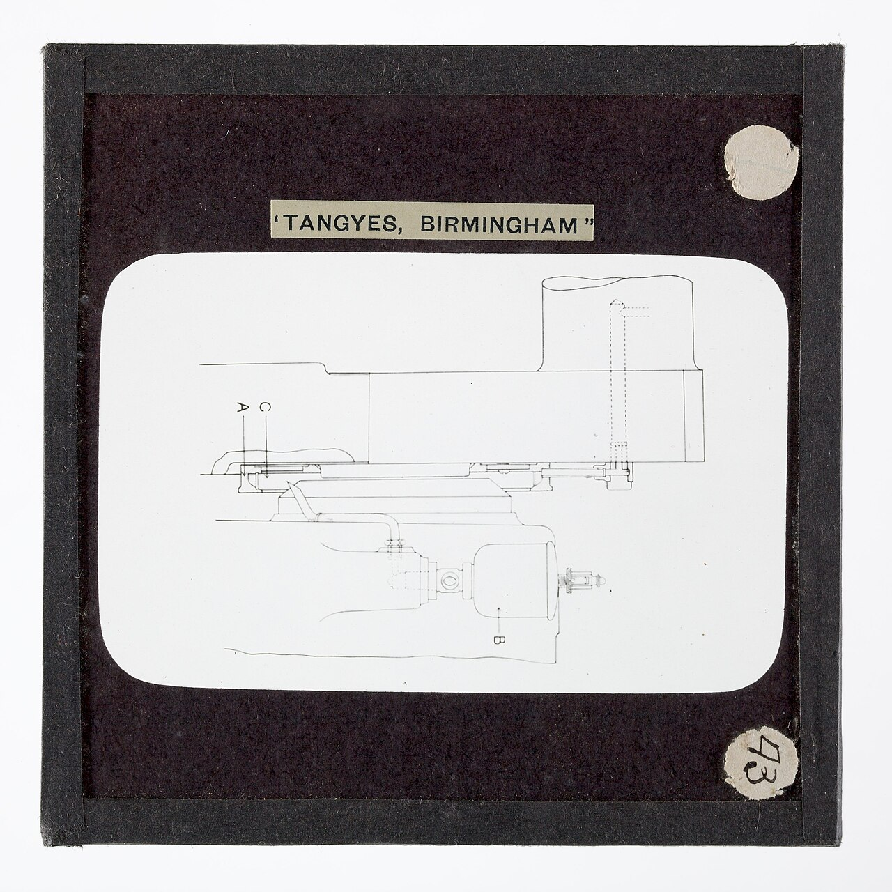

# Grease, Solid Lubricants & Bearing Lubrication

> **Node ID**: chemistry.lubricants-grease-solid
> **Domain**: [Chemistry](./index.md)
> **Parent**: [Lubricants, Oils & Fluid Mechanics](lubricants.md)
> **Dependencies**: [`chemistry.lubricants-natural`](lubricants-natural.md), [`chemistry.alkalis`](alkalis.md)
> **Enables**: [`machine-tools.machining`](../machine-tools/machining.md)
> **Timeline**: Years 5-20
> **Outputs**: grease, solid_lubricant, bearing_lubrication
> **Critical**: No — grease and solid lubricants extend machine life and simplify bearing design but are not prerequisites for core capabilities

Grease stays in bearings that would drain liquid oil. Solid lubricants work where liquids fail: extreme temperatures, vacuum, and contamination-sensitive environments. Bearing lubrication methods deliver oil or grease to the right place at the right rate. Together these technologies enable rolling element bearings, sealed bearing units, high-temperature machinery, and vacuum mechanisms.

## Grease Production

**Composition**: Base oil (70-90%) + thickener (5-25%) + additives (0-10%). The thickener turns liquid oil into a semi-solid that stays in place and does not drain out of bearings.

**Prerequisites**:
- Base oil (mineral oil, vegetable oil, or animal fat)
- Alkali for saponification: NaOH (sodium hydroxide), Ca(OH)₂ (calcium hydroxide, slaked lime), or LiOH (lithium hydroxide)
- Heated vessel with stirrer (iron or steel)
- Roller mill or colloid mill for homogenizing
- [Soap making](../glossary/soap-making.md) capability (saponification: fat/oil + alkali → soap + glycerol)

**Materials**:
- Base oil (mineral or vegetable)
- Fat (tallow, lard, or vegetable oil) for saponification
- Alkali (NaOH, Ca(OH)₂, or LiOH)
- Additives (optional): graphite, molybdenum disulfide (MoS₂), zinc dialkyldithiophosphate (ZDDP)

**Manufacture**:

**Soap thickeners**:

- **Sodium soap (NaOH + fat)**: Sodium stearate. Water-soluble grease. NOT water-resistant. For general-purpose applications and open gears where low cost matters. Melts at ~150°C.
- **Calcium soap (Ca(OH)₂ + fat)**: Calcium stearate. Water-resistant (insoluble). The most common grease thickener historically. "Lime soap" grease. Dropping point ~90°C (relatively low; grease softens and runs at high temperature). For wheel bearings, water pumps, and marine applications.
- **Lithium soap (LiOH + fat)**: Lithium stearate. Water-resistant AND higher dropping point (~190°C). Multi-purpose grease: a single grease type covers most applications. The modern standard. Requires LiOH (from lithium ore: lepidolite or spodumene, roasted with CaO, leached with water, electrolyzed to produce LiOH). Lithium is less common than sodium or calcium, so save lithium grease for applications requiring both water resistance and high temperature.

**Grease making process**:
1. Heat base oil to 80-100°C in a heated vessel.
2. Add alkali (NaOH, Ca(OH)₂, or LiOH) and fat simultaneously. Saponification occurs.
3. Stir and heat to 150-200°C (depending on soap type) to complete saponification and drive off water.
4. Cool slowly while stirring. Mill the product (pass through roller mill or colloid mill) to homogenize texture and break up soap fibers.
5. Add additives (graphite, MoS₂, ZDDP) if required. Mix thoroughly.
6. Test: penetration (cone penetration test measures how far a standardized cone sinks into grease at 25°C, giving the NLGI grade: 000 = very soft, 2 = typical bearing grease, 6 = very hard). Dropping point (heat until grease melts and drips, giving the maximum usable temperature).

**[Clay-thickened grease](../glossary/clay-thickened-grease.md)** (non-soap):
- Bentonite clay (organically modified with quaternary ammonium salts to make it oil-compatible) + base oil. No dropping point (clay does not melt), usable to 250°C+. For high-temperature applications where soap grease fails. Simpler to make than lithium grease if bentonite clay is available.

**Properties**: NLGI grades from 000 (fluid) to 6 (hard block). Dropping point ranges from 90°C (calcium soap) to 190°C (lithium soap) to 250°C+ (clay). Grease stays in place in bearings that would drain oil, provides sealing against contamination, and allows simplified housing design (no oil reservoir needed).

**Safety & Handling**:

> **Safety warning**: Caustic soda (NaOH and KOH) causes severe chemical burns and permanent eye damage. Wear chemical splash goggles, rubber gloves, and a rubber apron when handling caustics. Have an eye wash station within 10 seconds of the work area. If caustic contacts skin, flush immediately with copious water for at least 15 minutes.

The saponification reaction is exothermic. Add alkali gradually to avoid violent foaming and splashing of hot caustic. Work in a well-ventilated area. Molten grease at 150-200°C causes severe burns. Use appropriate heat protection when handling hot vessels.

**Applications**: Rolling element bearings (grease-packed), wheel bearings, open gears, chassis lubrication points, water pump bearings, marine equipment (calcium or lithium soap), high-temperature bearings (clay-thickened).

**Strengths**:
- Stays in place; does not drain from bearings like liquid oil
- Lithium grease is multi-purpose, covering most applications with a single product
- Calcium soap provides water resistance for marine and pump applications
- Additives (MoS₂, graphite) extend performance into extreme pressure and temperature regimes
- Simplifies bearing housing design (no oil reservoir, seals, or return plumbing needed)

**Weaknesses**:
- Lithium supply chain depends on rare ore (spodumene/lepidolite)
- Dropping point limits soap greases to ~190°C maximum (calcium only ~90°C)
- Over-greasing bearings causes churning and overheating
- Grease cannot be filtered and reused like oil; it is consumed and replaced
- Additives are consumed during service; grease gradually degrades in use

## Solid Lubricants

**Principle**: Solid materials with layered crystal structures or low-shear-strength surfaces provide lubrication by allowing easy sliding between atomic layers. Used where liquid lubricants fail: extreme temperatures, vacuum, radiation, or environments where oil would contaminate the product.

**Prerequisites**:
- Varies by material (see individual entries below)

**Materials**:
- Graphite (natural or synthetic)
- Molybdenum disulfide (MoS₂, mined or synthesized)
- PTFE (polytetrafluoroethylene, synthesized from tetrafluoroethylene)
- Polymer stock (acetal, nylon, UHMWPE)

**Individual materials**:

**Graphite**: Layered carbon structure. Weak van der Waals forces between layers allow easy shear. Effective in air (adsorbed water film aids layer sliding) but poor in vacuum or dry environments. Withstands temperatures to 450°C in air (oxidizes above this). Used in packings, gaskets, high-temperature bearings, lock mechanisms, and mold release agents. Applied as powder, dispersion in oil or grease ("graphited grease"), or bonded coating (graphite + sodium silicate binder).

**Molybdenum disulfide (MoS₂)**: Similar layered structure to graphite but effective in vacuum and dry environments, making it the dominant solid lubricant for space applications. Coefficient of friction: 0.02-0.1. Temperature range: -180 to +350°C in air (oxidizes to MoO₃ above 350°C), up to 800°C in vacuum. Applied by burnishing (rubbing powder into the surface), sputtering (PVD thin film 0.5-2 μm), or bonded coating (MoS₂ + epoxy/phenolic binder + solvent). MoS₂ coatings are standard for spacecraft mechanisms, satellite deployment hinges, and vacuum-chamber bearings.

**PTFE (Teflon)**: Polytetrafluoroethylene. Ultra-low coefficient of friction (0.04-0.10). Chemically inert. Temperature range -200 to +260°C. Used as bearing liners, sliding plates (bridge expansion bearings), piston rings (non-lubricated compressors), and tape (thread sealing). Limitations: poor wear resistance (filled with glass fiber, bronze, or carbon to improve), creep under load ("cold flow"), and cannot be melt-processed like typical plastics (must be sintered from powder).

**Polymer bearings**: Acetal (Delrin), nylon, and ultra-high-molecular-weight polyethylene (UHMWPE) are self-lubricating, requiring no external lubricant. UHMWPE is used in artificial hip joints, conveyor wear strips, and marine bearings (water-lubricated). Nylon suits gear wheels, low-load bearings, and sprockets. Acetal serves in precision gears, valve seats, and food-processing bearings (no lubricant contamination of product).

**Safety & Handling**:

> **Safety warning**: MoS₂ and graphite dust are respiratory irritants. Use dust masks when handling fine powders. PTFE decomposes above 350°C, releasing toxic fumes including hydrogen fluoride and perfluoroisobutylene. Never heat PTFE above 260°C. Use local exhaust ventilation if PTFE components are machined or heated.

**Applications**: High-temperature bearings, vacuum mechanisms, space applications, lock mechanisms, food processing (polymer bearings), bridge bearings (PTFE sliding plates), mold release (graphite).

**Strengths**:
- Effective at extreme temperatures where liquid lubricants fail
- MoS₂ works in vacuum (unlike graphite)
- PTFE and polymer bearings need no external lubricant supply
- Solid lubricants do not evaporate, drip, or drain away
- Compatible with cleanroom and food-contact applications

**Weaknesses**:
- Limited replenishment: solid films wear through and must be reapplied
- Graphite ineffective in vacuum or dry environments
- PTFE has poor wear resistance and cold-flows under load
- Polymer bearings limited to low PV values (see Bearing Design Parameters)
- MoS₂ and PTFE require industrial synthesis (not available at early bootstrap stages)

## Bearing Lubrication Methods

**Principle**: The method of delivering lubricant to a bearing is as important as the lubricant itself. Different bearing types and operating conditions require different lubrication approaches, ranging from simple self-contained systems to complex forced-circulation designs.

**Prerequisites**:
- Appropriate lubricant (oil or grease, matched to bearing type and speed)
- Bearing housing with lubricant reservoir or grease cavity
- For forced systems: pump, filter, and plumbing

**Lubrication methods**:

**Plain (journal) bearings**:

- **Oil-ring lubrication**: A brass or steel ring (20-40 mm diameter) rides on the shaft and dips into an oil reservoir below the bearing. Shaft rotation carries the ring, which drags oil up to the shaft top. Oil flows along the shaft into the bearing. Continuous, automatic, and self-contained. For horizontal shafts at moderate speed (100-3000 RPM).
- **Wick lubrication**: A felt or cotton wick submerged in an oil reservoir contacts the shaft or bearing surface. Capillary action draws oil to the bearing. Low flow rate, suitable for light-duty bearings. Quiet and simple.
- **Splash lubrication**: A gear or rotating element in an oil bath throws oil onto the bearing. Common in gearboxes where no separate oiling system is needed. Oil level: gears dip 1-2 tooth depths.
- **Forced lubrication**: A gear pump draws oil from a reservoir, forces it through a filter, and delivers it to the bearing under pressure (0.1-0.5 MPa). Oil flows through the bearing and drains back to the reservoir. Provides positive, controlled oil supply regardless of speed. Essential for high-speed or heavily loaded bearings such as steam turbine bearings and large generators.

**Rolling element bearings**:

- **Grease-packed**: Fill bearing cavity 30-50% with grease (do not overfill; churning generates heat). Grease lasts months to years depending on speed and temperature. Sealed bearings (rubber seals) retain grease for life. Shielded bearings (metal shields) allow some grease exchange.
- **Oil mist lubrication**: Atomize oil with compressed air and pipe the mist to the bearing. Provides continuous fine lubrication. Excellent for high-speed spindle bearings. Requires clean, dry compressed air.

### Bearing Design Parameters for Bootstrap Machinery

**Bearing PV limits**: The product of bearing pressure P (MPa) and surface velocity V (m/s) determines the heat generation rate in plain bearings. Each bearing material has a maximum PV rating: bronze (phosphor bronze) 1.75 MPa·m/s, Babbitt metal 1.05 MPa·m/s, PTFE (unfilled) 0.35 MPa·m/s, acetal (Delrin) 0.15 MPa·m/s, nylon 0.10 MPa·m/s. Exceeding the PV limit causes rapid temperature rise, lubricant breakdown, and bearing failure. For applications above the PV limit, use rolling element bearings (which have much higher speed/load capability) or provide forced lubrication with external cooling.

**Bearing clearance design**: Journal bearing radial clearance (difference between housing bore and shaft diameter) must accommodate thermal expansion, lubricant film thickness, and manufacturing tolerances. Rule of thumb: 0.001 × shaft diameter (e.g., 50 mm shaft = 0.05 mm radial clearance). Tight clearance reduces vibration and improves positional accuracy but increases friction and risk of seizure if temperature rises. Loose clearance allows more oil flow and better cooling, tolerates misalignment, but permits vibration. Length-to-diameter ratio (L/D) of 0.5-1.5 is typical. Shorter bearings (L/D < 1) run cooler and tolerate misalignment; longer bearings (L/D > 1) carry more load.

**Oil selection for bootstrap machinery**: For a bootstrap workshop without access to refined petroleum products, the practical lubricant sequence is: (1) rendered animal fat (tallow/lard) for slow-speed plain bearings and sliding surfaces; (2) vegetable oil (rapeseed, castor) for moderate-speed bearings and cutting fluid base; (3) clarified tallow + lime soap grease for wheel bearings and open gears. As refining capability develops, mineral oil from petroleum distillation replaces vegetable and animal oils for most applications due to better oxidation stability and wider viscosity range. The viscosity grade is selected by the Sommerfeld number calculation: for a 50 mm shaft at 1500 RPM carrying 500 N radial load, ISO VG 32 provides adequate film; for the same shaft at 300 RPM, ISO VG 68 is needed. In cold climates (below -10°C startup), use the lowest viscosity that still provides adequate film at operating temperature, or pre-heat the oil with a waste-heat system before starting machinery.

**Safety & Handling**:

> **Safety warning**: Oil mist lubrication systems generate airborne oil particles that are a respiratory hazard. Enclose mist-lubricated bearings where possible and provide local exhaust ventilation. Forced lubrication systems operate under pressure; check fittings and lines for leaks before each shift.

**Applications**: Every rotating and sliding machine element. Oil-ring for horizontal shafts in pumps and fans. Wick for light-duty instrument bearings. Splash for enclosed gearboxes. Forced for turbines and large generators. Grease-packed for rolling element bearings in motors, wheels, and machine tools. Oil mist for high-speed spindle bearings.

**Strengths**:
- Oil-ring and wick systems are self-contained and require no external pump
- Forced lubrication provides reliable oil supply at any speed
- Grease-packed bearings simplify housing design and maintenance
- Splash lubrication is the simplest approach for gearboxes

**Weaknesses**:
- Oil-ring and wick systems fail at very low speeds (not enough oil delivery) and very high speeds (ring cannot keep up)
- Forced lubrication adds complexity (pump, filter, plumbing) and a potential failure point
- Grease-packed bearings have limited speed capability due to churning heat
- Oil mist requires clean, dry compressed air and creates a respiratory hazard

## Troubleshooting

| Problem | Probable Cause | Solution |
|---------|---------------|----------|
| Grease is too soft (NLGI grade below target) | Insufficient saponification (incomplete reaction), too much base oil, or soap fibers too short | Extend saponification at 150-200°C for additional 30-60 minutes to complete reaction; reduce base oil by 5-10% in next batch; ensure adequate milling to develop soap fiber structure |
| Grease is too hard or grainy | Over-saponification, insufficient base oil, or incomplete milling of soap fibers | Add 5-10% more base oil and re-mill; pass through colloid mill 2-3 times to break up grainy soap aggregates |
| Calcium soap grease softens and runs at 60-70°C | Normal limitation of calcium soap (dropping point ~90°C) | Switch to lithium soap (dropping point ~190°C) or clay-thickened grease (no dropping point) for high-temperature bearings |
| Grease separates (oil bleeds from thickener) | Overheating above dropping point, or soap structure degraded by water contamination | Keep bearing temperature below grease dropping point; for water-exposed bearings, use water-resistant calcium or lithium soap; replace grease that has separated (thickener cannot re-absorb oil once separated) |
| Bearing runs hot with fresh grease pack | Over-greasing: bearing cavity filled >50%, causing churning and viscous heating | Fill only 30-50% of bearing cavity; run bearing for 30 minutes, then remove excess grease that has been pushed out; grease guns can over-pressurize, use manual fill for precision |
| MoS₂ coating wears off quickly (<100 cycles) | Poor surface preparation or coating too thin | Clean surface to bare metal (solvent degrease then abrasive blast); apply by burnishing (rub MoS₂ powder into surface under pressure) for 0.5-2 μm film; bonded coating (MoS₂ + phenolic binder) lasts 10,000+ cycles |
| Graphite lubrication fails in dry/vacuum environment | Graphite requires adsorbed water film for low friction; in vacuum or dry air, friction rises to ~0.5 | Switch to MoS₂ (effective in vacuum, coefficient of friction 0.02-0.1); graphite only works in humid air (>40% RH) |
| PTFE bearing cold-flows under heavy load | PTFE creeps plastically under sustained stress above 7 MPa | Fill PTFE with 15-25% glass fiber or bronze powder to increase compressive strength; reduce bearing pressure below 7 MPa; use wider bearing surface to distribute load |
| Lithium grease not available (no LiOH) | Lithium supply chain not yet established in bootstrap | Use calcium soap grease (water-resistant, dropping point ~90°C) for most applications; sodium soap for dry, low-temperature applications; clay-thickened grease if bentonite is available |
| Oil-ring lubrication fails to deliver oil | Shaft speed too low (<100 RPM, ring doesn't carry enough oil) or oil viscosity too high for ring lift | Switch to wick or forced lubrication for slow-speed bearings; use lower viscosity oil (ISO VG 32 instead of VG 68); verify ring rotates freely and dips into oil reservoir |

## Scaling Notes

Grease production scales from small batch to continuous operation:

- **Workshop scale** (5-50 kg/batch): Iron kettle over a fire or simple gas burner. Manual stirring with a wooden paddle. Small roller mill or hand-cranked colloid mill for finishing. Adequate for a single workshop or small factory. One operator, 2-4 hours per batch.
- **Factory scale** (500-5,000 kg/batch): Stainless steel reactor vessel (500-5,000 L) with mechanical agitator, heating jacket, and temperature control. Three-roll mill or high-shear mixer for homogenization. Automated filling lines for containers. 5-10 workers per shift. This is the standard commercial grease plant scale.
- **Industrial scale** (continuous, 10,000+ kg/day): Continuous saponification reactor with inline mixing, followed by continuous finishing (milling, deaeration, filling). Requires process control instrumentation (temperature, viscosity, pH monitoring). Capital-intensive but consistent quality and high throughput.

Solid lubricant production (MoS₂, graphite) scales with mining and refining capacity. MoS₂ is mined as molybdenite ore and purified by flotation and chemical processing. PTFE requires fluoropolymer synthesis (tetrafluoroethylene polymerization), a demanding chemical process typically done at industrial scale.

## Quality Control

Grease and solid lubricant quality is verified by standardized tests:

1. **Penetration test** (ASTM D217, cone penetration): A standardized cone is released into the grease surface at 25°C. The depth of penetration in tenths of a millimeter gives the NLGI grade. NLGI 2 (typical bearing grease): penetration 265-295 (0.1 mm units). This is the most fundamental grease quality test.

2. **Dropping point** (ASTM D2265): Heat a grease sample in a standardized cup until a drop of oil falls through the orifice. Calcium soap: ~90°C. Lithium soap: ~190°C. Clay: no dropping point (passes 250°C+). Below-spec dropping point indicates incomplete saponification or contamination.

3. **Oil separation test** (ASTM D6184): Place 10 g of grease on a 74 μm sieve at 100°C for 24 hours. Weigh the oil that passes through. Acceptable: <5% separation. Higher values indicate poor soap structure.

4. **Water washout test** (ASTM D1264): Pack a bearing with grease, run it at 79°C under a water spray (5 mL/s) for 1 hour. Weigh the grease lost. Acceptable: <10% loss for water-resistant grades.

5. **MoS₂ purity** (for solid lubricants): Test by wet chemical analysis or X-ray fluorescence. Technical grade MoS₂: >97% MoS₂, <1% acid-insoluble contaminants. Impurities (iron, silica) are abrasive and increase wear rather than reducing it.

6. **Quick field test for grease**: Rub a small amount between thumb and forefinger. Good grease feels smooth and uniform. Grainy texture indicates incomplete milling. Oil on the fingers (without pressing hard) indicates excessive oil separation.

## Variations and Alternatives

| Lubricant | NLGI Grade | Temp Range | Water Resistant | Load Capacity | Best For |
|-----------|-----------|------------|-----------------|---------------|----------|
| Sodium soap grease | 1-3 | -10 to 150°C | No | Moderate | Open gears, general purpose (dry locations) |
| Calcium soap grease | 1-3 | -20 to 90°C | Yes | Moderate | Wheel bearings, water pumps, marine |
| Lithium soap grease | 1-3 | -30 to 190°C | Yes | Moderate-high | Multi-purpose: most bearing applications |
| Clay-thickened grease | 1-3 | -20 to 250°C+ | Yes | High | High-temperature bearings, ovens, kilns |
| MoS₂ grease (5-10%) | 1-3 | -30 to 190°C | Yes | Very high | Extreme pressure, slow-speed heavy loads |
| Graphited grease (5-10%) | 1-3 | -30 to 190°C | Varies | High | Open gears, sliding surfaces |
| PTFE-filled grease | 1-3 | -50 to 200°C | Yes | Moderate | Food processing, clean environments |

## Safety & Hazards

Grease and solid lubricant production involves several distinct hazard categories:

- **Caustic burns**: NaOH and KOH cause severe chemical burns and permanent eye damage. The saponification reaction is exothermic — adding alkali too fast causes violent foaming and splashing of hot caustic. Wear chemical splash goggles, rubber gloves, and rubber apron. Have eye wash station within 10 seconds of work area. If caustic contacts skin, flush with copious water for at least 15 minutes.
- **Molten grease burns**: Grease at 150-200°C causes severe thermal burns. Use appropriate heat protection (insulated gloves, face shield) when handling hot vessels. Never lean over a vessel of molten grease.
- **MoS₂ and graphite dust**: Fine powder inhalation is a respiratory irritant. Use dust masks or local exhaust ventilation when handling dry powders. MoS₂ dust has an occupational exposure limit of 10 mg/m³ (total particulate, 8-hour TWA).
- **PTFE thermal decomposition**: PTFE decomposes above 350°C, releasing toxic fumes including hydrogen fluoride (HF, IDLH 30 ppm) and perfluoroisobutylene (PFIB, IDLH unknown, extremely toxic). Never heat PTFE above 260°C. If PTFE components are machined, use local exhaust ventilation. Polymer fume fever from PTFE overheating causes flu-like symptoms 4-8 hours post-exposure.
- **Grease fires**: Grease at operating temperature in bearings can ignite if overheated. Never use water on a grease fire — it will spread the burning grease. Extinguish with sand, fire blanket, or smothering. Keep fire suppression materials near grease-heating operations.
- **Environmental disposal**: Used grease must not be dumped on ground or in waterways. Collect in sealed containers. Soap-based greases can be broken down with hot water and acid to recover the base oil for re-refining. Clay-based greases are inert and can be landfilled. MoS₂-containing greases should be treated as hazardous waste due to heavy metal content.

## See Also

- **[Lubricants Overview](lubricants.md)**: Theory, selection guide, and cross-cutting topics
- **[Natural Lubricants](lubricants-natural.md)**: Animal fats and vegetable oils (base oils for grease)
- **[Mineral Oil Lubricants](lubricants-mineral.md)**: Petroleum-derived lubricants and fluids
- **[Synthetic Lubricants](lubricants-synthetic.md)**: Engineered lubricants for demanding applications

---

*Part of the [Bootciv Tech Tree](../index.md) • [Chemistry](./index.md) • [Lubricants](lubricants.md)*

