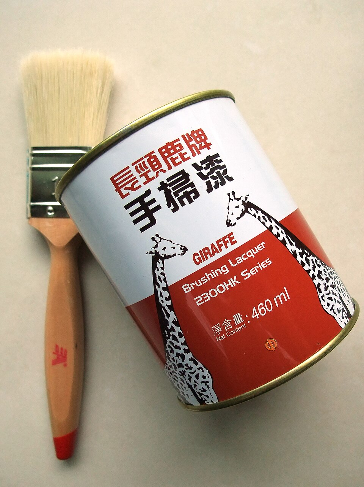

# Paint & Coating Manufacturing

> **Node ID**: chemistry.paint
> **Domain**: [Chemistry](./index.md)
> **Dependencies**: [`Metal Finishing & Surface Treatment`](../metals/finishing.md), [`Construction & Structural Engineering`](../construction/index.md)
> **Enables**: [`Paints, Coatings & Inks`](coatings.md)
> **Timeline**: Years 15-25
> **Outputs**: tio2-pigments, alkyd-paints, zinc-oxide-coatings
> **Critical**: No

## Overview

> *Brushing lacquer (460ml) by the China Paint Manufacturing Company (1932) Limited.*

> *Image: Mk2010, CC BY-SA 3.0*

Pigment grinding, binder formulation, and coating production including titanium dioxide whites, alkyd paints, and zinc oxide anti-corrosion coatings.

Paint is a complex mixture of pigments (for color and opacity), binders (for adhesion and film formation), solvents (for application viscosity), and additives (for specific properties like drying time, flow, and mold resistance). The two main categories are organic coatings (paints, varnishes, lacquers) and inorganic coatings (ceramic glazes, cementitious coatings). This article focuses on organic paint production, specifically titanium dioxide pigment manufacture and alkyd resin binder synthesis.

Titanium dioxide (TiO₂) is the most important white pigment, with unmatched opacity and brightness. It is used in paints, plastics, paper, and cosmetics. Two production routes exist: the sulfate process (older, more polluting) and the chloride process (newer, more efficient). Both require significant chemical processing infrastructure. The alkyd resin binder, made from polyols, dibasic acids, and drying oils, forms the film-forming component of many oil-based paints.

## Prerequisites

### Materials

- Ilmenite ore (FeTiO₃) or rutile (TiO₂) for titanium dioxide pigment production
- Sulfuric acid (concentrated) for the sulfate process, or chlorine gas for the chloride process
- Glycerol or pentaerythritol (polyols), phthalic anhydride (dibasic acid), and drying oils (linseed, soybean) for alkyd resin synthesis
- Zinc oxide (ZnO) pigment for anti-corrosion primers
- Mineral spirits (white spirit) as paint solvent and thinner
- Driers (cobalt, manganese, or zirconium octoates) to catalyze oxidative drying of alkyd films

### Equipment

- [Metal Finishing & Surface Treatment](../metals/finishing.md) — material dependency
- [Construction & Structural Engineering](../construction/index.md) — material dependency
- Digestion tanks (acid-resistant, lead-lined or rubber-lined steel) for ilmenite acid attack
- Rotary kiln or fluidized bed calciner for TiO₂ calcination at 800-1000°C
- Three-roll mill or bead mill for pigment dispersion into the binder
- Jacketed resin reactor with stirring, temperature control, and inert gas blanket for alkyd synthesis
- Ball mill for grinding TiO₂ to optimal pigment particle size (0.2-0.3 μm)

### Knowledge

- Pigment optics: why TiO₂ has unmatched hiding power (high refractive index of 2.7, compared to 1.5-1.6 for most binders), and why particle size must be controlled to approximately half the wavelength of visible light for maximum scattering
- Alkyd resin chemistry: the esterification reaction between polyol hydroxyl groups and phthalic anhydride carboxyl groups, controlled by acid number monitoring to achieve target molecular weight
- Pigment dispersion: how surface energy, binder viscosity, and shear force during milling determine whether pigment agglomerates break down to primary particles
- Drying oil chemistry: how unsaturated fatty acids in linseed oil cross-link through oxidative polymerization, converting liquid paint film to solid

### Infrastructure

- Acid-resistant processing area for TiO₂ sulfate process — concrete floors with acid-proof coating, drainage to acid waste treatment
- High-temperature calcination furnace (800-1000°C) with exhaust gas treatment for TiO₂ production
- Solvent storage and handling area with flammable liquid cabinets, ventilation, and fire suppression
- Dust collection system for dry pigment handling — TiO₂ powder is an inhalation hazard
- Waste acid treatment capability — the sulfate process generates 3-4 tonnes of dilute sulfuric acid and iron sulfate per tonne of TiO₂

## Process Description

Paint manufacturing involves three parallel production streams: pigment synthesis (TiO₂ from ilmenite or rutile), binder synthesis (alkyd resin from polyols and fatty acids), and paint formulation (combining pigment, binder, solvent, and additives through milling and mixing).

### Step-by-Step Procedure

**TiO₂ Pigment (Sulfate Process):**

1. Grind ilmenite ore (FeTiO₃) to <200 μm. Digest in concentrated sulfuric acid (91-95% H₂SO₄) at 150-200°C in a lead-lined digestion tank. The reaction produces titanium sulfate and iron sulfate in solution.
2. Reduce the solution with scrap iron to convert all iron to the ferrous state (Fe²⁺). Cool to crystallize out copperas (FeSO₄·7H₂O), which is separated by centrifugation.
3. Hydrolyze the purified titanium sulfate solution by heating to 110°C with seeded nucleation. Hydrous titanium oxide (TiO₂·nH₂O) precipitates as a fine white solid.
4. Wash the precipitate, then calcine at 800-1000°C in a rotary kiln. The calcination temperature determines the crystal form: 800°C produces anatase (softer, used in paper), 1000°C with rutile seeding produces rutile (higher refractive index, preferred for paint).
5. Mill the calcined TiO₂ in a ball mill with a dispersing agent to achieve the target particle size of 0.2-0.3 μm (optimal for visible light scattering).

**Alkyd Resin Synthesis:**

1. Charge the resin reactor with phthalic anhydride, glycerol or pentaerythritol, and drying oil (linseed or soybean). Purge with nitrogen to prevent premature oxidation.
2. Heat to 230-260°C with continuous stirring. The alcoholysis reaction first combines the oil with the polyol, then esterification links in the phthalic anhydride. Monitor acid number (mg KOH per gram) to track reaction progress.
3. Cool and thin with mineral spirits when the acid number drops to the target value (typically 5-10 mg KOH/g) and the viscosity reaches specification. The finished resin solution is the paint vehicle.

**Paint Formulation:**

1. Premix TiO₂ pigment, alkyd resin vehicle, and drier additives in a high-speed disperser.
2. Pass the premix through a three-roll mill or bead mill to break down pigment agglomerates and achieve uniform dispersion. The Hegman grind gauge measures dispersion quality (target: Hegman 7-8, indicating particles <15 μm).
3. Adjust viscosity with mineral spirits thinner. Add anti-skin agent (methyl ethyl ketoxime) to prevent surface skinning in the can. Filter and fill into containers.

### Process Parameters

| Parameter | Range | Notes |
|-----------|-------|-------|
| TiO₂ calcination temperature | 800-1000°C | Anatase at 800°C; rutile at 1000°C with seeding |
| TiO₂ particle size (final) | 0.2-0.3 μm | Optimal for light scattering; measured by laser diffraction |
| Alkyd resin reaction temperature | 230-260°C | Above 260°C: gelation risk; below 230°C: slow reaction |
| Alkyd acid number (finished) | 5-10 mg KOH/g | Higher acid number = more residual carboxylic acid = shorter shelf life |
| Pigment volume concentration (PVC) | 15-40% | Below critical PVC: glossy; above: matte and porous |
| Hegman grind fineness | 7-8 (Hegman scale) | 0 on gauge = 100 μm; 8 = 0 μm. Target <15 μm for smooth film |

## Safety Considerations

This process involves specific hazards requiring trained personnel and protective measures:

- **Sulfuric acid handling**: The TiO₂ sulfate process uses concentrated acid at elevated temperature. Splashes cause severe chemical burns. The acid digestion step releases SO₂ gas. Full acid splash protection and local exhaust ventilation are required.
- **Solvent fire hazard**: Mineral spirits and other paint solvents have flash points of 30-60°C. Vapors are heavier than air and can travel to ignition sources. Flammable liquid storage and handling procedures are mandatory. Oil-soaked rags can self-heat and ignite spontaneously due to oxidative cross-linking of the drying oil.
- **TiO₂ dust inhalation**: Dry TiO₂ powder is classified as an IARC Group 2B carcinogen (possibly carcinogenic to humans) based on rat inhalation studies. Nanoparticle forms can penetrate biological membranes. Dust collection and respiratory protection are required during dry pigment handling.
- **Heavy metal pigments**: Some colored pigments contain chromium, cadmium, or lead. These require the same handling precautions as the heavy metals themselves: no ingestion, no inhalation, and proper waste disposal.

### Personal Protective Equipment

- Chemical splash goggles and acid-resistant face shield for ilmenite digestion and acid handling operations
- Leather or heat-resistant gloves for calcination furnace area
- P100 respirator with organic vapor cartridges for solvent blending and dry pigment handling
- Anti-static cotton work clothing in solvent areas (synthetic fabrics generate static sparks)

### Emergency Procedures

- For acid splash: flush with water for 15 minutes. For sulfuric acid on skin, remove contaminated clothing while flushing — do not pull clothing over the head if acid-soaked.
- For solvent fire: evacuate and use dry chemical, CO₂, or foam extinguisher. Do not use water on solvent fires — it spreads the burning liquid.
- For oil rag self-heating: if rags in a container begin smoking, do not open — smother with a metal lid or sand. Dispose of oil-soaked rags in sealed metal containers filled with water.

## Quality Control

### Acceptance Criteria

- **TiO₂ Pigment**: TiO₂ content >93% (the remainder is coating and treatment agents). Brightness >94% (reflectance at 457 nm). Oil absorption value 15-25 g oil per 100 g pigment. Particle size distribution centered at 0.2-0.3 μm.
- **Alkyd Paint**: Viscosity within specification (measured by Ford cup or Stormer viscometer). Hiding power (contrast ratio) >0.98 at specified film thickness. Drying time: set-to-touch <4 hours, through-dry <24 hours at 25°C and 50% RH. Adhesion >4B (cross-hatch test). Gloss at 60° within specification.
- **Zinc Oxide Primer**: ZnO content >95%. Dry film thickness 30-50 μm per coat. Salt spray resistance >500 hours (for marine anti-corrosion applications).

### Testing Methods

- Spectrophotometer for color measurement (CIE L*a*b* values) and brightness
- Hegman grind gauge for pigment dispersion quality
- Ford cup (ASTM D1200) or Stormer viscometer (ASTM D562) for paint viscosity
- Contrast ratio measurement on black/white substrate for hiding power
- Cross-hatch adhesion test (ASTM D3359) for film adhesion

### Sampling Protocol

- Sample TiO₂ from each calciner batch — test crystal form, brightness, and particle size before packaging
- Test resin acid number and viscosity at 30-minute intervals during alkyd synthesis — stop reaction at target values
- Check paint viscosity and Hegman grind after each mill pass — additional passes required if dispersion is insufficient
- Test finished paint hiding power, drying time, and gloss on witness panels before batch release

## Scaling Notes

Transitioning from bench-scale to production involves these considerations:

- **Bench scale**: Hand mixing of pigment and binder in small containers. Laboratory three-roll mill. Produces 100 mL to 1 L batches. Used for formulation development and pigment evaluation.
- **Pilot scale**: 50-200 L high-speed disperser and pilot three-roll mill. Bench-scale TiO₂ synthesis in crucibles. Produces 10-50 L of paint per batch. Validates pigment dispersion, film properties, and shelf stability.
- **Production scale**: Dedicated TiO₂ plant processing 50-100 tonnes of ilmenite per day. 2000-10,000 L paint production batches in automated mixing and milling lines. Fills 500-2000 cans per hour.

Key scaling challenges: TiO₂ pigment quality is sensitive to calcination conditions — production-scale rotary kilns must maintain uniform temperature across the bed. Pigment dispersion in large mills requires careful viscosity control to maintain shear rate. The sulfate process generates enormous quantities of dilute sulfuric acid waste that must be recycled or neutralized. Alkyd resin batch-to-batch consistency depends on precise endpoint control (acid number), which becomes harder at larger scale due to thermal inertia.

## Troubleshooting

| Problem | Probable Cause | Solution |
|---------|---------------|----------|
| Poor hiding power | Pigment under-dispersed or PVC too low | Additional mill passes; increase TiO₂ loading toward 20-25% PVC |
| Paint skins in can | Insufficient anti-skin agent or headspace too low | Add methyl ethyl ketoxime at 0.1-0.3%; ensure adequate container headspace |
| Slow drying | Drier under-dosed or low temperature/humidity | Increase cobalt drier concentration; check drying conditions (target 25°C, 50% RH) |
| Pigment settling in can | Viscosity too low or inadequate thixotrope | Add bentonite clay or fumed silica thixotrope; increase pigment volume slightly |
-| Color mismatch between batches | TiO₂ lot variation or grind fineness difference | Match TiO₂ lots; verify Hegman grind is identical; adjust with tinting colorants

## Variations and Alternatives

- **Chloride process for TiO₂**: Ilmenite or rutile is chlorinated at 900°C to form TiCl₄ vapor, which is purified by distillation and then oxidized at 1500°C to TiO₂. Produces a purer, more consistent pigment than the sulfate process but requires chlorine handling and very high temperatures.
- **Water-based (latex) paints**: Use acrylic or vinyl acetate polymer emulsions as binders instead of alkyd resins, eliminating organic solvents. Lower VOC emissions but require emulsion polymerization technology and surfactant chemistry more complex than simple alkyd production. For a bootstrapping civilization, oil-based alkyd paints are the more accessible starting point.
- **Zinc-rich primers**: Contain >80% zinc dust in the dry film, providing galvanic (sacrificial) corrosion protection to steel. The zinc particles must be in electrical contact with each other and the steel substrate. Require specialized binders (often epoxy) that tolerate very high pigment loading.
- **Powder coating**: Dry thermoplastic or thermoset powder applied by electrostatic spray and melted to form the film. Eliminates solvents entirely but requires electrostatic application equipment and thermal curing ovens (180-200°C).

The environmental impact of paint is dominated by VOC emissions from solvent-based formulations. A single gallon of oil-based paint can release several pounds of VOCs into the atmosphere during drying. These VOCs contribute to ground-level ozone formation and smog. Regulatory pressure has driven the development of low-VOC and zero-VOC paints (water-based formulations with reduced solvent content), but these typically have different application characteristics and may not match the performance of traditional solvent-based paints in all applications.

Paint application methods include brushing, rolling, spraying (airless, conventional, electrostatic), dipping, and powder coating. Each method has different requirements for paint viscosity, drying time, and film thickness. Brushing and rolling are the simplest methods and require no special equipment. Spray application provides smooth, even films but generates overspray waste and requires respiratory protection. Powder coating applies dry powder that is then melted to form the film, eliminating solvents entirely but requiring electrostatic application equipment and thermal curing ovens.

The pigment dispersion process, grinding the pigment particles into the binder to achieve uniform distribution and the desired particle size, is a critical manufacturing step. Poorly dispersed pigment forms agglomerates (clusters) that reduce opacity, cause color streaking, and create surface roughness. The dispersion is achieved by high-speed mixing, ball milling, or three-roll milling. The viscosity of the paint vehicle (binder + solvent) must be carefully controlled during dispersion — too thin and the grinding force is insufficient, too thick and the material cannot flow through the mill.

TiO₂ nanoparticles (used in some specialty paints and sunscreens) have raised health concerns because their small size allows them to penetrate biological membranes. While bulk TiO₂ is considered safe, the nanoparticle form may pose different risks. Standard industrial hygiene practices (dust control, respiratory protection) mitigate these concerns during manufacturing.

## References

- [Chemistry](index.md) — parent capability
- [Chemistry Domain](./index.md) — domain overview and related capabilities
- [Metal Finishing & Surface Treatment](../metals/finishing.md) — upstream dependency (material)
- [Construction & Structural Engineering](../construction/index.md) — upstream dependency (material)
- [Paints, Coatings & Inks](coatings.md) — downstream capability

### Material Handling

TiO₂ pigment is a fine powder that poses inhalation hazards — the International Agency for Research on Cancer (IARC) classifies TiO₂ as a Group 2B carcinogen (possibly carcinogenic) based on rat inhalation studies. Use dust collection and respiratory protection when handling dry pigment. Oil-based paints and solvents are fire hazards requiring flammable liquid storage. Drying oil films can self-heat and ignite if stored in bulk with poor ventilation (spontaneous combustion of oil-soaked rags is a well-documented fire cause).

Alkyd resin is a viscous liquid that should be stored in sealed containers at moderate temperature (15-25°C). High temperature accelerates oxidative cross-linking in the resin, increasing viscosity and eventually gelling the product. Driers (cobalt and manganese octoates) are toxic heavy metal compounds — handle with gloves and avoid skin contact. Mineral spirits should be stored in flammable liquid cabinets with proper grounding to prevent static discharge ignition.

Zinc oxide anti-corrosion coatings work by a different mechanism than barrier coatings. When ZnO is incorporated into a paint film applied to steel, the zinc ions migrate to the steel surface and form zinc hydroxycarbonate complexes that passivate the steel, inhibiting rust formation. Zinc-rich primers (with >80% ZnO in the dry film) go further, providing galvanic protection where the zinc sacrificially corrodes instead of the steel. The choice between simple ZnO coatings and zinc-rich primers depends on the severity of the corrosion environment and the expected service life.

The sulfate process for TiO₂ generates approximately 8 tonnes of waste per tonne of product, including dilute sulfuric acid (20-25% H₂SO₄), iron sulfate (copperas), and metal-bearing waste. The copperas can be sold for water treatment (flocculant) or as a soil amendment, but the dilute acid has little economic value and must be neutralized with limestone or recycled by vacuum concentration. The chloride process generates much less waste but requires chlorine gas handling and very high temperatures (1500°C for the oxidation step), making it a more complex and capital-intensive process.

The drying oil component of alkyd paint is what causes the paint film to harden after application. Linseed oil (from flax) and soybean oil contain unsaturated fatty acids (linoleic acid, linolenic acid) with carbon-carbon double bonds. When exposed to atmospheric oxygen, these double bonds undergo oxidative cross-linking, forming a three-dimensional polymer network that converts the liquid binder to a solid film. Cobalt drier accelerates this process by catalyzing the decomposition of hydroperoxides that form during oxidation. The drying time depends on the oil type (linseed dries faster than soybean due to higher unsaturation), the drier concentration, the film thickness, and the ambient temperature and humidity.

The pigment volume concentration (PVC) is the single most important formulation parameter for paint. It is the ratio of pigment volume to total dry film volume (pigment + binder). Below the critical PVC (CPVC), there is enough binder to fill the spaces between pigment particles, producing a glossy, continuous film. Above CPVC, there is insufficient binder, leaving air voids that scatter light and produce a matte, porous film. House paints typically operate above CPVC for hiding power and breathability, while glossy enamels operate below CPVC for film integrity and cleanability.

The three-roll mill is the traditional workhorse for pigment dispersion in paint production. The paste of pigment and binder is fed between three horizontally arranged steel rollers that rotate at increasing speeds (typically 1:2:4 ratio). The differential speed generates intense shear forces that break pigment agglomerates. The paste forms a thin film on the fastest roller, which is removed by a doctor blade. Multiple passes through the mill may be required to achieve the target Hegman grind fineness. Modern production increasingly uses bead mills (vertical or horizontal chambers filled with small ceramic or glass beads) for higher throughput and continuous operation.

The hiding power of a paint film depends primarily on the TiO₂ content and the quality of pigment dispersion. TiO₂ has a refractive index of 2.7 (rutile), far higher than any other white pigment (zinc oxide: 2.0, lithopone: 1.8) and much higher than typical paint binders (1.5). This large difference in refractive index causes strong light scattering at each pigment-binder interface, making TiO₂-loaded paint films opaque at very low film thickness. The minimum film thickness for complete hiding (contrast ratio 0.98) is typically 25-50 μm for a well-formulated TiO₂ paint, compared to 100+ μm for paints using cheaper white pigments.

---
*Part of the [Bootciv Tech Tree](../../index.md) · [Chemistry](./index.md) · [All Domains](../../index.md)*
