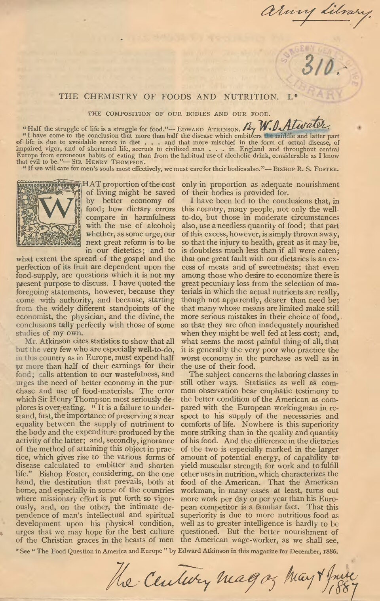

# Phosphorus and Phosphate Chemistry

> **Node ID**: chemistry.phosphorus
> **Domain**: [Chemistry](./index.md)
> **Dependencies**: [`Silicon Purification`](../silicon/purification.md), [`Agriculture`](../agriculture/index.md)
> **Enables**: [`Mineral Acid Production`](acids.md), [`Mining Engineering & Extractive Metallurgy`](../mining/index.md)
> **Timeline**: Years 15-30
> **Outputs**: phosphoric-acid, phosphate-fertilizer, phosphorus-compounds
> **Critical**: No

## Overview

> *Image: W. O. (Wilbur Olin) Atwater, Public domain*

Extraction of phosphorus from phosphate rock via acidulation or thermal reduction, and production of phosphoric acid and phosphate fertilizers. Phosphorus compounds are essential for agriculture (fertilizer), food additives, detergents, and semiconductor doping. The phosphorus cycle is a key civilizational bottleneck.

Primary outputs: `phosphoric-acid`, `phosphate-fertilizer`, `phosphorus-compounds`. These materials or products serve as inputs for downstream manufacturing and processing steps.

Phosphorus is an essential element for life (DNA, ATP, bones) and for agriculture (phosphate fertilizers). Industrial phosphorus production involves reducing phosphate rock with coke in an electric arc furnace at high temperature, producing white phosphorus vapor that is condensed under water. White phosphorus is pyrophoric (ignites spontaneously in air) and extremely toxic, requiring careful handling and storage under water. Subsequent processing converts white phosphorus to red phosphorus (stable, non-toxic), phosphoric acid, and phosphate salts.

Phosphate fertilizers — primarily monoammonium phosphate (MAP), diammonium phosphate (DAP), and triple superphosphate (TSP) — are the largest-volume use of phosphorus. Without phosphate fertilizers, agricultural yields drop dramatically as soil phosphorus is depleted by successive crops. The phosphorus cycle is one-way at human timescales: phosphate rock is mined, applied to fields, and eventually washed into the ocean as insoluble sediments. Recovering phosphorus from wastewater and agricultural runoff is an emerging sustainability priority.

## Prerequisites

### Materials

- Phosphate rock (fluorapatite Ca₅(PO₄)₃F or hydroxyapatite Ca₅(PO₄)₃OH) — typically 30-40% P₂O₅ content
- Sulfuric acid (concentrated) for wet-process phosphoric acid production
- Coke (carbon) and silica (sand) for thermal reduction to white phosphorus
- Ammonia (for MAP and DAP production)

### Equipment

- [Silicon Purification](../silicon/purification.md) — material dependency
- [Agriculture](../agriculture/index.md) — material dependency
- Electric arc furnace for thermal phosphorus production (1500°C)
- Acid-resistant reaction tanks (rubber-lined steel) for wet-process acidulation
- Vacuum filtration system (tilting pan filter or belt filter) for phosphogypsum separation
- Granulator and dryer for fertilizer prill production

### Knowledge

- Phosphate rock mineralogy: fluorapatite and hydroxyapatite compositions, and how impurity levels (cadmium, uranium, iron, aluminum) affect processing requirements and product quality
- Wet-process acidulation chemistry: the stoichiometry of Ca₃(PO₄)₂ + 3H₂SO₄ → 2H₃PO₄ + 3CaSO₄, and how reaction temperature and acid concentration control gypsum crystal habit (which determines filtration rate)
- Thermal reduction: Ca₃(PO₄)₂ + 3SiO₂ + 5C → 3CaSiO₃ + 5CO + P₄, and why the silica flux is essential to lower the reaction temperature and form fluid slag
- White phosphorus handling: storage under water to prevent spontaneous ignition, and conversion to red phosphorus by heating in an inert atmosphere at 250-300°C

### Infrastructure

- Electric arc furnace capable of sustained 1500°C operation for thermal phosphorus route, with off-gas condensation system (phosphorus vapor must be condensed under water)
- Large acid-resistant reaction tanks for wet-process acidulation — concrete with acid-proof lining, 500-2000 m³ capacity
- Phosphogypsum disposal area — 5 tonnes of gypsum waste per tonne of phosphoric acid produced, requiring engineered stacks or beneficial use pathways
- Ammonia storage and handling for fertilizer production (ammonia is toxic and stored under pressure or refrigeration)
- Water treatment for fluoride-containing waste streams — phosphate rock contains 2-4% fluoride that becomes soluble during acidulation

## Process Description

Two primary routes produce phosphorus compounds: the wet process (acidulation of phosphate rock with sulfuric acid) and the thermal process (electric arc furnace reduction to elemental phosphorus). The wet process is simpler and cheaper but produces impure acid suitable for fertilizer. The thermal process produces very pure phosphoric acid but requires enormous electrical energy input.

### Step-by-Step Procedure

**Wet-Process Phosphoric Acid:**

1. Grind phosphate rock to <150 μm. Feed into a reaction tank with diluted sulfuric acid (maintained at 70-80°C). The acidulation reaction produces phosphoric acid and calcium sulfate dihydrate (phosphogypsum): Ca₃(PO₄)₂ + 3H₂SO₄ + 6H₂O → 2H₃PO₄ + 3(CaSO₄·2H₂O).
2. Control reaction temperature at 70-80°C and sulfuric acid concentration at 25-30%. These conditions favor dihydrate gypsum crystals that are large and easy to filter. Higher temperatures produce hemihydrate (CaSO₄·½H₂O) which gives higher P₂O₅ concentration but is harder to filter.
3. Filter the slurry on a tilting pan filter or belt filter to separate phosphoric acid (typically 25-32% P₂O₅) from the phosphogypsum. Wash the gypsum cake counter-currently to recover entrained phosphoric acid.
4. Concentrate the dilute phosphoric acid by vacuum evaporation to 40-54% P₂O₅ for fertilizer production, or to 70% for shipping.
5. For fertilizer production: react concentrated phosphoric acid with ammonia to produce monoammonium phosphate (MAP, 11-52-0) or diammonium phosphate (DAP, 18-46-0). Granulate and dry the product.

**Thermal Phosphorus (Electric Arc Furnace):**

1. Mix ground phosphate rock, silica sand, and coke. Charge to an electric arc furnace operating at 1400-1500°C.
2. The carbon reduces phosphorus pentoxide while the silica forms calcium silicate slag: 2Ca₃(PO₄)₂ + 6SiO₂ + 10C → 6CaSiO₃ + 10CO + P₄↑.
3. Phosphorus vapor (P₄) and CO gas leave the furnace through the off-gas duct. The gas is cooled and the P₄ condenses as white phosphorus under a water spray. CO is burned as fuel.
4. White phosphorus is stored under water to prevent spontaneous ignition. It can be burned to P₄O₁₀ and hydrated to very pure phosphoric acid (thermal acid, >85% H₃PO₄).
5. Alternatively, convert white phosphorus to red phosphorus by heating at 250-300°C in an inert atmosphere for several hours. The conversion is exothermic — temperature control prevents runaway reaction.

### Process Parameters

| Parameter | Range | Notes |
|-----------|-------|-------|
| Wet-process acidulation temperature | 70-80°C | Controls gypsum crystal form (dihydrate) |
| Sulfuric acid concentration | 25-30% | Higher concentration gives viscous slurry; lower reduces reaction rate |
| P₂O₅ concentration (product) | 25-54% | 25-32% from filter; concentrated by evaporation |
| Electric arc furnace temperature | 1400-1500°C | Below 1300°C: incomplete reduction; above 1500°C: excessive refractory wear |
| White → red phosphorus conversion | 250-300°C | Exothermic; requires inert atmosphere (N₂ or CO₂) |
| Fertilizer granule size | 2-4 mm | Standard prill size for mechanical spreading |

## Safety Considerations

This process involves specific hazards requiring trained personnel and protective measures:

- **White phosphorus (P₄)**: Ignites spontaneously in air (auto-ignition 30°C), causing severe thermal burns. Skin contact leads to deep tissue penetration and necrosis — phosphorus particles embedded in skin continue to burn as they oxidize. Chronic exposure causes jaw bone deterioration (phossy jaw, osteonecrosis — historically endemic in match factories before red phosphorus substitution). All handling must be done under water or inert atmosphere, with emergency water baths at every workstation. P₄ is insoluble in water but soluble in CS₂ and benzene.
- **Phosphine gas (PH₃)**: Generated when phosphides in the rock contact moisture or acid. Extremely toxic — IDLH 50 ppm, PEL 0.3 ppm (8-hr TWA), TLV-TWA 0.3 ppm. Detectable by odor at 0.15-2 ppm (decaying fish smell), but olfactory fatigue occurs within minutes. Symptoms: headache, nausea, pulmonary edema at 5-10 ppm; death at >100 ppm. Detectors and ventilation are mandatory in areas where phosphine may accumulate.
- **Sulfuric acid (93% H₂SO₄)**: Concentrated acid for wet-process acidulation causes severe chemical burns. Dehydration damage continues until acid is diluted or neutralized. The acidulation reaction is exothermic (−285 kJ/mol for Ca₃(PO₄)₂ + 3H₂SO₄) and must be temperature-controlled at 70-80°C to prevent boilover. Add acid to water/rock slurry, never the reverse.
- **Fluoride release**: Phosphate rock contains 2-4% fluoride, released as HF (PEL 3 ppm, IDLH 30 ppm) or SiF₄ during acidulation. HF causes severe deep-tissue burns that may not be immediately painful but penetrate to bone, binding tissue calcium. Scrubbers (NaOH or water) are required on all process off-gas streams. Calcium gluconate gel must be staged near all fluoride exposure points.

### Personal Protective Equipment

- Full chemical splash suit with acid-resistant apron and face shield for acidulation and acid handling areas
- Heat-resistant gloves and aluminized clothing for electric arc furnace area
- Self-contained breathing apparatus (SCBA) for emergency response to white phosphorus or phosphine releases
- Phosphine gas detector badges for all personnel in thermal phosphorus production areas

### Emergency Procedures

- For white phosphorus skin contact: immerse the affected area in water immediately. Cover with wet cloth. Do not allow the phosphorus to dry and ignite. Seek medical attention — phosphorus particles must be surgically removed.
- For phosphine gas release: evacuate immediately, do not re-enter without SCBA. Phosphine poisoning has delayed symptoms (24-48 hours) including pulmonary edema.
- For acidulation boilover: evacuate the reaction area, do not attempt to approach the tank. Hot acid spray extends several meters.

## Quality Control

### Acceptance Criteria

- **Phosphoric Acid (wet process)**: P₂O₅ content 52-54% (merchant grade). Heavy metals below limits (Cd <10 ppm, As <3 ppm, Pb <10 ppm). Sulfate content below specification (excess SO₄ indicates incomplete gypsum filtration).
- **Phosphoric Acid (thermal)**: P₂O₅ content >61% (>85% H₃PO₄). Heavy metals below detection limits. Suitable for food-grade and semiconductor-grade applications.
- **MAP Fertilizer**: 11% N, 52% P₂O₅ (grade 11-52-0). Moisture <2%. Granule crush strength >30 N. Free acidity <4%.
- **DAP Fertilizer**: 18% N, 46% P₂O₅ (grade 18-46-0). Moisture <2%. Granule crush strength >30 N.
- **Red Phosphorus**: P₄ content <0.01% (residual white phosphorus). Moisture <0.5%. Particle size per specification.

### Testing Methods

- Titration with standardized NaOH for total P₂O₅ content (quinoline phosphomolybdate gravimetric method for referee analysis)
- ICP-OES for heavy metal impurities (Cd, As, Pb, Hg, U)
- Moisture content by loss-on-drying at 105°C
- Granule crush strength by compression testing

### Sampling Protocol

- Sample phosphate rock at mine reception — check P₂O₅ content and impurity levels before committing to processing
- Monitor acidulation slurry temperature and density continuously — deviations indicate feed composition changes
- Test phosphoric acid product after each evaporation stage — verify P₂O₅ concentration and impurity levels
- Test fertilizer granules from each production hour — check N-P-K grade, moisture, and crush strength

## Scaling Notes

Transitioning from bench-scale to production involves these considerations:

- **Bench scale**: 100 g phosphate rock digested in beakers with sulfuric acid. Vacuum filtration through Buchner funnel. Produces milliliters of dilute phosphoric acid. Used to characterize rock reactivity and impurity behavior.
- **Pilot scale**: 100-500 kg batch acidulation in a pilot reactor with filter. Small electric arc furnace for thermal phosphorus. Produces kilograms of phosphoric acid or elemental phosphorus. Validates process parameters and identifies scaling issues.
- **Production scale**: Continuous acidulation with 500-2000 m³ reactors, belt filters with 50-100 m² filtration area. Electric arc furnace consuming 40-60 MW for thermal route. Produces 1000-5000 tonnes P₂O₅ per day.

Key scaling challenges: phosphogypsum management is the dominant waste issue — 5 tonnes of gypsum per tonne of acid, containing residual acid, heavy metals, and naturally occurring radioactive materials (uranium and radium from the phosphate rock). Electric arc furnace energy consumption for thermal phosphorus is enormous (12,000-14,000 kWh per tonne of P₄). Fluoride recovery from process off-gas (as fluorosilicic acid) is necessary to meet emissions standards at production scale.

## Troubleshooting

| Problem | Probable Cause | Solution |
|---------|---------------|----------|
| Low P₂O₅ recovery in wet process (<85%) | Fine gypsum crystals entraining phosphoric acid, excessive agitation breaking crystals, or sulfuric acid concentration too high (>30%) causing viscous slurry | Increase sulfuric acid concentration to 25-30% (not higher); reduce agitation speed to 40-60 RPM to promote larger dihydrate crystals (target >50 μm length); add crystal habit modifier (sulfonic acid) to promote needle-shaped gypsum that filters faster; check filter cloth — if blinded, backwash with dilute acid |
| High sulfate in product acid (>3% SO₄) | Incomplete gypsum filtration — filter cloth blinded with fine crystals, insufficient wash water, or filter cake cracking allowing acid bypass | Increase wash water volume to 2-3× cake volume; check filter cloth condition — replace if pore size <10 μm from scaling; maintain vacuum at 0.5-0.7 bar; add flocculant (polyacrylamide at 0.5-2 ppm) to improve crystal settling before filtration |
| Phosphine gas detected in thermal process area (>0.3 ppm) | Moisture contacting phosphide-bearing material in the furnace charge, or white phosphorus leaking from condensation system and contacting moist air | Check raw material moisture content (target <0.5% H₂O in furnace charge); inspect condensation system water seals for integrity; verify off-gas duct for leaks; evacuate area if PH₃ >5 ppm (IDLH 50 ppm); install continuous PH₃ electrochemical monitors at furnace floor level (PH₃ heavier than air, density 1.18× air) |
| Red phosphorus conversion incomplete (>0.1% residual white P₄) | Temperature too low (<250°C), residence time insufficient, or inert atmosphere contaminated with O₂ allowing white P₄ to ignite instead of convert | Increase conversion temperature to 280-300°C; extend hold time to 4-8 hours; verify N₂ or CO₂ blanket purity (<100 ppm O₂); test product by CS₂ extraction — white phosphorus dissolves in CS₂, red does not (residual P₄ must be <0.01% for safe handling) |
| Fertilizer granules too soft (crush strength <30 N) | Insufficient drying (moisture >2%), low reaction temperature during granulation, or wrong N:P ratio in DAP/MAP production | Increase granulator temperature to 80-90°C; extend dryer residence time to achieve <1.5% moisture; check ammonia:phosphoric acid molar ratio (MAP target 1.0, DAP target 2.0); verify product pH (MAP ~4.0, DAP ~7.5) |
| Electric arc furnace refractory failure | Silica slag eroding carbon refractory lining at >1500°C, or thermal cycling causing spalling; furnace campaign life typically 6-12 months | Limit furnace temperature to 1400-1500°C; maintain consistent charge rate to minimize thermal cycling; monitor slag composition (CaO/SiO₂ ratio 1.0-1.2 minimizes refractory attack); plan refractory replacement when sidewall thickness <50% of original |
| Fluoride emissions exceeding permit limits | Phosphate rock contains 2-4% fluoride released as HF and SiF₄ during acidulation; scrubber system overloaded or NaOH scrubbing solution depleted | Verify scrubber circulation rate and NaOH concentration (maintain pH >10 in scrubber); add second-stage scrubber if single stage insufficient; recover fluorosilicic acid (H₂SiF₆) as saleable co-product from scrubber liquor; target <10 mg/Nm³ F in stack gas |
| Phosphogypsum stack leachate contaminating groundwater | Phosphogypsum contains residual phosphoric acid (pH 2-3), heavy metals, and naturally occurring radioactive materials (uranium, radium at 10-30 pCi/g); stack liner compromised | Install double HDPE liner with leachate collection system between layers; monitor groundwater wells downgradient for pH, fluoride, and radioactivity; treat leachate with lime neutralization before discharge; consider beneficial use (wallboard, road base) to reduce stack volume |

## Variations and Alternatives

- **Hydrochloric acid acidulation**: Using HCl instead of H₂SO₄ produces calcium chloride instead of gypsum as the byproduct. Avoids the phosphogypsum disposal problem but requires solvent extraction to separate the phosphoric acid from the CaCl₂ brine. Used where gypsum disposal is restricted.
- **Single superphosphate (SSP)**: Direct reaction of phosphate rock with sulfuric acid without separating the gypsum. Product contains 16-22% P₂O₅ mixed with gypsum. Simpler process, lower capital cost, but lower nutrient density than MAP or DAP.
- **Phosphorus recovery from wastewater**: Struvite (magnesium ammonium phosphate) precipitation from municipal wastewater recovers 80-90% of dissolved phosphorus as a slow-release fertilizer. Reduces phosphorus pollution of waterways while producing a marketable product.
- **Bone ash as primitive phosphorus source**: Heating bones to 1000°C produces calcium phosphate ash that can be applied directly to soil. Limited by the number of animals in the agricultural system, but requires no industrial chemistry.

Red phosphorus is produced by heating white phosphorus in an inert atmosphere to approximately its conversion temperature. The amorphous red allotrope is stable in air, non-toxic, and much safer to handle than white phosphorus. Red phosphorus is used in safety matches, flame retardants, and semiconductor doping. The conversion from white to red phosphorus is exothermic and must be controlled to prevent runaway reaction.

The match industry historically used white phosphorus, causing phossy jaw (osteonecrosis of the jaw) among factory workers. The shift to red phosphorus and later to phosphorus sesquisulfide eliminated this occupational disease. This history illustrates the importance of process safety in chemical manufacturing — the technology to produce phosphorus safely existed, but it took decades of worker illness to drive the transition away from white phosphorus handling.

For a bootstrapping civilization, the simplest phosphorus source is bone ash (calcium phosphate from heated bones), which can be applied directly to soil as a phosphorus fertilizer. As the chemical industry develops, the wet process for phosphoric acid becomes accessible, enabling phosphate fertilizer production at scale from mined phosphate rock.

The phosphorus cycle in agriculture illustrates a fundamental sustainability challenge. Phosphate rock is a finite resource, and at current consumption rates, economically accessible reserves may be depleted within centuries. Unlike nitrogen (which can be fixed from the unlimited atmospheric supply) and potassium (which is abundant in evaporite deposits), phosphorus has no substitute in biological systems and no synthetic alternative. Research into phosphorus recovery from wastewater, manure, and food waste is driven by this long-term supply concern.

Phosphogypsum is the major waste product of wet-process phosphoric acid production. For every tonne of phosphoric acid produced, approximately 5 tonnes of phosphogypsum (calcium sulfate) are generated. This material contains residual phosphoric acid, heavy metals, and naturally occurring radioactive materials from the phosphate rock. Disposal of phosphogypsum in stacks (large engineered piles) is the standard practice, but these stacks occupy significant land area and pose long-term environmental management challenges.

## References

- [Chemistry](index.md) — parent capability
- [Chemistry Domain](./index.md) — domain overview and related capabilities
- [Silicon Purification](../silicon/purification.md) — upstream dependency (material)
- [Agriculture](../agriculture/index.md) — upstream dependency (material)
- [Mineral Acid Production](acids.md) — downstream capability
- [Mining Engineering & Extractive Metallurgy](../mining/index.md) — downstream capability

### Material Handling

Phosphate rock dust is a respiratory irritant that requires dust control during mining, crushing, and transport. Phosphoric acid is corrosive and requires the same handling precautions as other mineral acids — rubber-lined or HDPE piping, acid-resistant pump seals, and chemical splash protection for operators. Phosphate fertilizer products (MAP, DAP, TSP) are hygroscopic and must be stored in dry conditions to prevent caking and degradation. The radioactive content of some phosphate rock deposits (uranium and radium) requires monitoring in mining and processing operations.

White phosphorus must be stored under water in sealed containers, never in contact with air. Any spill of white phosphorus must be kept covered with wet sand or water until it can be recovered under water. Red phosphorus is stable in air and can be stored as a dry powder, but should be kept away from strong oxidizers and ignition sources. Thermal phosphoric acid is highly concentrated (>85%) and requires the same acid handling precautions as concentrated sulfuric acid.

Phosphorus compounds find applications far beyond fertilizer. Sodium tripolyphosphate (STPP) is used in detergents as a water softener, though phosphate detergent bans in many regions have reduced this use. Food-grade phosphoric acid is added to cola beverages and processed cheese. Phosphorus oxychloride (POCl₃) is a dopant source in semiconductor manufacturing, where it introduces phosphorus atoms into silicon wafers to create n-type semiconductor regions. Ammonium phosphate serves as a component in dry chemical fire extinguishers. These diverse applications mean that phosphorus chemistry infrastructure, once established for fertilizer production, enables a wide range of downstream industries.

The uranium content of phosphate rock (typically 50-200 ppm) is both a concern and an opportunity. In the wet process, most of the uranium reports to the phosphoric acid product rather than the phosphogypsum. Solvent extraction can recover this uranium as yellowcake (U₃O₈), providing a secondary revenue stream from phosphate processing. Several plants in the United States and Morocco have recovered uranium from phosphoric acid commercially. For a bootstrapping civilization, this uranium recovery pathway could provide nuclear fuel without dedicated uranium mining, assuming the solvent extraction technology is available.

The electric arc furnace for thermal phosphorus production is one of the most energy-intensive pieces of chemical processing equipment. A typical furnace consumes 40-60 MW of electrical power, operating continuously to maintain the 1400-1500°C temperature needed for the reduction reaction. The furnace consists of a cylindrical steel shell lined with carbon refractory, with three large carbon electrodes entering from above. The charge (phosphate rock, silica, coke) is fed continuously, and molten calcium silicate slag is tapped from the bottom while phosphorus vapor and CO gas exit through the off-gas duct. The furnace must operate under a slight vacuum to draw the phosphorus vapor to the condensation system.

Triple superphosphate (TSP) is produced by reacting phosphate rock with phosphoric acid rather than sulfuric acid. The reaction produces monocalcium phosphate monohydrate: Ca₃(PO₄)₂ + 4H₃PO₄ + 3H₂O → 3Ca(H₂PO₄)₂·H₂O. The advantage over single superphosphate is that no gypsum byproduct is produced, so the P₂O₅ content is much higher (44-46% vs. 16-22%). TSP is preferred where transportation costs make the higher nutrient density worthwhile, but it requires wet-process phosphoric acid as an input, adding a processing step compared to direct sulfuric acid acidulation.

The fluoride byproduct of wet-process phosphoric acid production can be recovered as a valuable co-product. Phosphate rock contains 2-4% fluoride, which is released during acidulation as hydrofluoric acid and silicon tetrafluoride gas. Scrubbing the process off-gas with water produces fluorosilicic acid (H₂SiF₆), which can be sold for water fluoridation, aluminum smelting (cryolite production), or converted to aluminum fluoride for use in aluminum reduction cells. In some plants, fluoride recovery revenue offsets a meaningful fraction of phosphoric acid production costs. Without recovery, the fluoride would be an air pollutant requiring expensive abatement.

The dihydrate process for wet-process phosphoric acid operates at 70-80°C and produces calcium sulfate dihydrate (CaSO₄·2H₂O, gypsum) as the byproduct. The hemihydrate process operates at higher temperature (90-100°C) and produces calcium sulfate hemihydrate (CaSO₄·½H₂O), which yields phosphoric acid at higher P₂O₅ concentration (40-50% vs. 25-32%) directly from the filter, reducing evaporation requirements. The hemihydrate process is more energy-efficient overall but produces a less filterable crystal form. The choice between the two processes depends on the specific phosphate rock composition and the energy cost for evaporation at the plant location.

For a bootstrapping civilization, single superphosphate (SSP) is the most accessible phosphate fertilizer. The process is simple: grind phosphate rock and mix with sulfuric acid in a pan or den. The mixture cakes as the reaction proceeds over several days, and the resulting solid is crushed and screened to the desired particle size. No filtration, evaporation, or granulation equipment is needed. The product contains 16-22% P₂O₅ and some sulfur (from the sulfuric acid), which is itself a plant nutrient. SSP was the first commercial phosphate fertilizer, patented by Lawes in 1842, and remained the dominant phosphate fertilizer for over a century.

---
*Part of the [Bootciv Tech Tree](../index.md) · [Chemistry](./index.md) · [All Domains](../index.md)*
