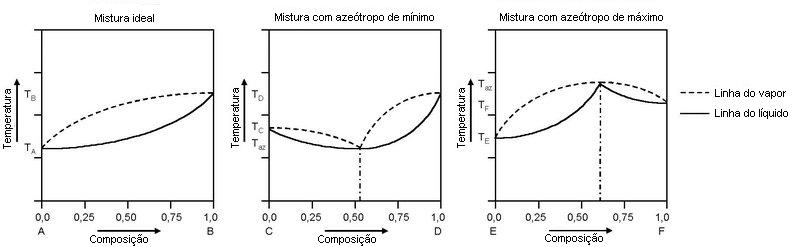

# Photographic Chemistry

> **Node ID**: chemistry.photographic-chemistry
> **Domain**: [Chemistry](./index.md)
> **Dependencies**: [`Photoresists, Masks & Lithography`](../photolithography/resists-masks.md)
> **Enables**: [`Chemistry`](index.md), [`Knowledge Preservation & Education`](../knowledge/index.md)
> **Timeline**: Years 20-35
> **Outputs**: silver-halide-emulsions, photographic-plates, photoresist-precursors
> **Critical**: No

## Overview

> *Existem diagramas T-x de três misturas binárias. O gráfico à esquerda é de uma mistura ideal de A e B, sem formação de azeótropo, com as linhas de líquido e vapor saturados variando desde a temperatura de ebulição de A, a mais baixa, até a de B, a mais alta. O gráfico central é de uma mistura binária de C e D que forma um azeótropo de mínimo. Veja que a temperatura no azeótropo é menor do que as temperaturas de ebulição de C e de D quando puros. O gráfico à direita é de uma mistura binária E e F que forma um azeótropo de máximo. A temperatura no azeótropo é maior do que as temperaturas de ebulição de E e F quando puros.*

> *Image: U.m at Portuguese Wikipedia, Public domain*

Silver halide emulsion preparation, photographic plate coating, and light-sensitive chemical synthesis for imaging and photoresist precursor production.

Primary outputs: `silver-halide-emulsions`, `photographic-plates`, `photoresist-precursors`. These materials or products serve as inputs for downstream manufacturing and processing steps.

Silver halide photography was the dominant imaging technology for over 150 years before digital sensors replaced it. The chemistry involves three main stages: sensitization (forming silver halide crystals in gelatin emulsion), exposure (creating a latent image by photolytic decomposition of silver halide), and development (amplifying the latent image by chemical reduction of exposed silver halide to metallic silver). While no longer the primary imaging technology, photographic chemistry remains relevant for understanding photosensitive materials, chemical amplification processes, and the handling of silver compounds.

The silver halide emulsion consists of microscopic crystals of silver bromide, silver chloride, or silver iodide suspended in gelatin on a film or paper substrate. The sensitivity (speed) and contrast of the emulsion depend on the crystal size, shape, and halide composition. Smaller crystals produce finer detail but require more light. Larger crystals are more sensitive but produce grainier images. The gelatin matrix protects the crystals, controls their growth during manufacture, and provides mechanical support for the emulsion layer.

## Prerequisites

### Materials

- Silver nitrate (AgNO₃) — the source of silver for halide precipitation
- Potassium bromide (KBr) and/or potassium chloride (KCl) — the halide source
- Photographic gelatin — high-purity, with controlled bloom strength and isoelectric point
- Developing agents — hydroquinone, metol (4-methylaminophenol sulfate), or phenidone
- Sodium thiosulfate (Na₂S₂O₃·5H₂O, "hypo") — the fixing agent that dissolves unexposed silver halide
- Acetic acid and sodium sulfite — for stop bath and preservative in developer

### Equipment

- [Photoresists, Masks & Lithography](../photolithography/resists-masks.md) — material dependency
- Emulsion kettle with controlled stirring and temperature (for silver halide precipitation and ripening)
- Coating machine (blade or dip coater) for applying emulsion to glass plates or film base
- Darkroom with safelighting (Wratten series filters for the appropriate spectral sensitivity)
- Processing tanks (developer, stop bath, fixer, wash) with temperature control at 20°C ±0.5°C
- Enlarger or contact printing frame for image reproduction

### Knowledge

- Silver halide precipitation: how the rate of AgNO₃ addition, temperature, gelatin concentration, and pAg (silver ion activity) control crystal size, shape, and size distribution in the emulsion
- Latent image formation: how photolytic decomposition creates clusters of 3-5 silver atoms on the crystal surface that act as catalytic centers for chemical development
- Developer chemistry: how reducing agents like hydroquinone and metol selectively reduce exposed silver halide (with latent image catalysts) while leaving unexposed crystals intact, producing the visible image
- Fixing chemistry: how sodium thiosulfate forms soluble silver-thiosulfate complexes (Ag(S₂O₃)₂³⁻ and Ag(S₂O₃)₃⁵⁻) that dissolve unexposed silver halide from the emulsion

### Infrastructure

- Darkroom with temperature-controlled water supply (20°C ±0.5°C) for consistent processing — temperature deviations as small as 1°C cause visible density and contrast changes
- Safelight illumination matched to the emulsion type: red safelight (Wratten 1A) for orthochromatic emulsions, deep red (Wratten 2) for panchromatic, complete darkness for infrared-sensitive materials
- Silver recovery system for spent fixer — electrolytic plating cell or metallic replacement cartridge (steel wool) to recover silver from thiosulfate solution
- Ventilation for darkroom chemical vapors — developer fumes (metol) and acetic acid vapors from stop bath

## Process Description

Photographic chemistry operates through a sequence of light-sensitive emulsion preparation, image exposure, and chemical processing. The emulsion manufacturing step determines the film's speed (ISO), contrast, and resolution. The exposure step creates a latent image that is invisible to the eye. The development step amplifies the latent image by a factor of 10⁹ or more.

### Step-by-Step Procedure

**Emulsion Preparation (Precipitation and Ripening):**

1. Dissolve potassium bromide (and/or KCl, KI) in a gelatin solution at 40-60°C in the emulsion kettle. This is the halide solution.
2. Add silver nitrate solution to the halide solution with controlled stirring. Silver halide (AgBr, AgCl, or AgI) precipitates as microscopic crystals. The rate of addition, temperature, and halide excess control the crystal size and shape. Fast addition with high excess produces many small crystals (high speed, coarse grain). Slow addition with low excess produces fewer, larger crystals.
3. Ripen the emulsion by holding at 50-70°C for 30-120 minutes. During ripening (Ostwald ripening), small crystals dissolve and re-deposit on larger ones, broadening the size distribution and increasing average crystal size. This increases emulsion speed but reduces resolution.
4. Chill the emulsion to set the gelatin (below 10°C). Wash to remove soluble salts (KNO₃ byproduct). Re-melt and add sensitizing dyes if spectral sensitization beyond blue light is needed.
5. Coat the finished emulsion onto glass plates or cellulose acetate film base at controlled thickness (typically 5-15 μm dry). Dry in a controlled-humidity atmosphere.

**Exposure and Processing (Black-and-White):**

1. Expose the film or plate to light through a lens or contact negative. The exposure must fall within the film's characteristic curve (Hurter-Driffield curve) to produce a usable image. Overexposure compresses highlight detail; underexpression loses shadow detail.
2. Develop in a reducing solution (developer) at 20°C for a specified time with agitation. A typical developer contains metol + hydroquinone (MQ developer), sodium sulfite (preservative), sodium carbonate (alkali to activate the developer), and potassium bromide (restrainer to prevent fog). Exposed crystals are reduced to metallic silver; unexposed crystals are unaffected.
3. Transfer to a stop bath (1-2% acetic acid) for 30 seconds to halt development by neutralizing the alkaline developer. Without the stop bath, development continues unevenly during transfer to the fixer.
4. Fix in sodium thiosulfate solution (typically 25-40% Na₂S₂O₃) for 5-10 minutes with agitation. The thiosulfate dissolves the remaining unexposed silver halide by forming soluble silver-thiosulfate complexes. The image becomes permanent.
5. Wash in running water at 20°C for 20-30 minutes to remove residual thiosulfate from the gelatin. Incomplete washing causes image staining and fading over years as residual thiosulfate attacks the silver image.
6. Dry in a dust-free environment.

### Process Parameters

| Parameter | Range | Notes |
|-----------|-------|-------|
| Emulsion precipitation temperature | 40-60°C | Higher temperature = larger crystals = higher speed |
| Silver halide crystal size | 0.1-3 μm | 0.1 μm: slow film, fine grain (ISO 25); 3 μm: fast film, coarse grain (ISO 3200) |
| Development temperature | 20°C ±0.5°C | +1°C ≈ +10% development activity; causes visible density shift |
| Development time | 4-12 minutes | Determined by film type, developer strength, and desired contrast |
| Fixer concentration | 25-40% Na₂S₂O₃ | Below 20%: fixing too slow; above 40%: gelatin swelling and reticulation |
| Wash time | 20-30 minutes | Minimum for archival permanence (residual hypo <0.01 g/m²) |

## Safety Considerations

This process involves specific hazards requiring trained personnel and protective measures:

- **Silver compounds**: Silver nitrate stains skin and clothing brown-black (reduced to metallic silver by skin proteins). Chronic silver absorption causes argyria (irreversible blue-gray skin discoloration). Silver nitrate is also a strong oxidizer and can ignite organic materials on contact.
- **Developing agents**: Metol (4-methylaminophenol sulfate) is a skin sensitizer that causes allergic contact dermatitis in sensitized individuals. Hydroquinone is a suspected carcinogen with chronic exposure. Phenidone is less toxic but still requires handling precautions.
- **Acetic acid (stop bath)**: Concentrated acetic acid causes chemical burns. The glacial form (99%) can cause severe eye damage. Dilute working solutions (1-2%) are mild irritants but the concentrated stock requires splash protection.
- **Selenium toner**: Used in print toning, selenium dioxide is highly toxic by inhalation and ingestion. Toning solutions must be handled with gloves in a ventilated area.

### Personal Protective Equipment

- Nitrile gloves for all developer and fixer handling — silver nitrate and developing agents penetrate latex
- Chemical splash goggles for silver nitrate and concentrated acetic acid handling
- Apron to protect clothing from silver nitrate splashes (stains are permanent)
- Local exhaust ventilation when mixing dry developer powders (inhalation hazard) or handling selenium toner

### Emergency Procedures

- For silver nitrate skin contact: wash immediately with water. Stains cannot be removed — they fade over weeks as the silver oxidizes. For eye contact: flush with water for 15 minutes and seek medical attention.
- For metol dermatitis: discontinue handling, apply corticosteroid cream, and switch to phenidone-based developers. Sensitization is permanent — once sensitized, even trace exposure triggers dermatitis.
- For acetic acid splash: flush with water. For concentrated (glacial) acid eye splash: flush continuously and seek immediate medical attention.

## Quality Control

### Acceptance Criteria

- **Silver Halide Emulsion**: ISO speed within specification (e.g., ISO 100 ± 1/3 stop). Contrast index within specification. Base fog density <0.3. Resolving power (line pairs per mm) at specified contrast.
- **Photographic Plates**: Emulsion coating uniformity ±10% across the plate. No pinholes or coating defects visible under safelight inspection. Glass flatness within specification for optical applications.
- **Processed Image**: Density range 0.1-2.5 (typical for pictorial photography). D-max above 2.0 for negative film. No fog or streaks. Uniform development across the entire image area.

### Testing Methods

- Sensitometric testing: expose a step wedge (21-step density tablet) on a sample sheet, process, and measure density with a densitometer. Plot the characteristic curve (density vs. log exposure) to determine speed, contrast, and fog.
- Resolving power: photograph a resolution test target and examine under magnification to determine the finest line pairs per mm that are distinguishable.
- Residual thiosulfate test: methylene blue method (ASTM PH4.30) to verify adequate washing for archival permanence.
- Visual inspection under safelight for coating defects, pinholes, and edge effects.

### Sampling Protocol

- Test each emulsion batch by coating a sample sheet and running a sensitometric strip — compare characteristic curve to specification before releasing the batch for production coating
- Process control strip with every batch of film processed — compare to a reference strip to detect developer exhaustion, temperature drift, or timing errors
- Test fixer activity with residual silver test paper before each processing session — exhausted fixer leaves silver halide in the emulsion, causing long-term image degradation

## Scaling Notes

Transitioning from bench-scale to production involves these considerations:

- **Bench scale**: Hand-coated glass plates or paper, tray processing in small dishes. Produces individual sheets. Used for emulsion formulation development and understanding the precipitation-ripening relationship.
- **Pilot scale**: Small coating machine for continuous emulsion application to roll film. Tank processing with temperature-controlled solutions. Produces 100-1000 sheets or short film rolls. Validates coating uniformity and process control.
- **Production scale**: High-speed coating machines applying emulsion at 30-60 m/min to roll film or paper. Continuous processing machines for high-throughput development. Produces millions of sheets or thousands of film rolls per day.

Key scaling challenges: emulsion precipitation scale-up is non-trivial — mixing conditions, addition rate, and temperature uniformity in large kettles must reproduce the bench-scale crystal size distribution. Coating uniformity on high-speed machines requires precise viscosity and coating gap control. Silver recovery from production-scale fixing operations is economically mandatory — a large photofinishing lab can recover kilograms of silver per day from spent fixer.

## Troubleshooting

| Problem | Probable Cause | Solution |
|---------|---------------|----------|
| High base fog (density >0.3 in unexposed areas) | Light leak in darkroom (check door seals, safelight filter integrity), contaminated developer (oxidized metol produces fogging agents), or insufficient KBr restrainer in developer formulation | Check darkroom light-tightness with a test film strip left 5 minutes in the darkroom; replace safelight filter if cracked or faded; mix fresh developer from dry chemicals; increase KBr restrainer to 1.0-2.0 g/L; check emulsion storage temperature (above 25°C causes fog increase) |
| Low contrast (gamma <0.5 for normal-contrast film) | Developer exhausted (sulfite depleted, developer oxidized), underdevelopment (time too short or temperature <18°C), or film underexposed | Mix fresh developer; extend development time by 25-50% or increase temperature to 20°C ±0.5°C; verify developer activity with control strip — compare density to reference; check exposure meter calibration |
| Uneven development (streaks, mottle, edge density difference >0.2) | Insufficient agitation during development (developer exhausts locally in highlight areas), or temperature gradient across processing tank | Agitate continuously for first 30 seconds, then 5 seconds every 30 seconds (inversion method for tanks, nitrogen burst for trays); verify tank temperature uniformity (±0.5°C); check for air bells on film surface — tap tank to dislodge |
| Image fading or yellowing after months of storage | Incomplete fixing (fixer exhausted, >2,000 mL·min/L silver capacity exceeded), or incomplete washing (residual thiosulfate >0.01 g/m²) — thiosulfate slowly reacts with silver to form Ag₂S staining | Extend fix time to 2× clearing time (typically 5-10 min in fresh fixer); test fixer activity with residual silver test paper before each session; extend wash to 30 min minimum with running water at 20°C; verify residual hypo with methylene blue test (ASTM PH4.30, target <0.01 g/m²) |
| Crystalline deposits on dry film or print | Residual sodium thiosulfate from incomplete washing crystallizes in the gelatin layer; or hardener crystals from alum-hardened fixer | Re-wash in running water at 20°C for 30 min; use hypo-clearing agent (2% Na₂SO₃ solution, 2 min soak) before final wash to reduce wash time by 60-70%; check wash water flow rate (target 12 complete water changes per hour) |
| Pinholes in emulsion coating | Dust on film base before coating, air bubbles in emulsion during precipitation, or contaminated gelatin | Filter emulsion through 5-10 μm cartridge filter before coating; degas emulsion under vacuum after precipitation; clean coating area with HEPA-filtered air; pre-wash glass plates with ethanol and lint-free cloth |
| Emulsion grain structure too coarse (resolving power <40 lp/mm for ISO 100 target) | Precipitation temperature too high (>60°C), ripening time too long (>120 min), or halide excess too low during AgNO₃ addition causing uncontrolled Ostwald ripening | Reduce precipitation temperature to 40-50°C; limit ripening to 30-60 min; maintain 10-20% halide excess during AgNO₃ addition to control crystal growth rate; for fine-grain emulsions, use double-jet precipitation (simultaneous AgNO₃ and KBr addition at controlled rate) |
| Silver recovery from spent fixer below 90% (economic loss) | Electrolytic recovery cell current density too low (<5 mA/cm²), or metallic replacement cartridge exhausted (steel wool depleted) | For electrolytic recovery: maintain cathode current density at 5-15 mA/cm², rotate cathode to prevent dendrite buildup; for metallic replacement: replace steel wool cartridge when silver concentration in effluent exceeds 50 mg/L; monitor silver concentration in spent fixer by atomic absorption (typical: 2-8 g/L Ag) |
| Metol dermatitis (red, itchy skin on hands after developer handling) | Allergic contact dermatitis from metol (4-methylaminophenol sulfate) — sensitization is permanent once established; affects ~5-10% of frequent darkroom users | Switch to phenidone-based developer (less sensitizing); wear nitrile gloves (metol penetrates latex); once sensitized, even trace exposure triggers reaction — strict glove discipline is mandatory; apply corticosteroid cream for active dermatitis |
| Color cast in "black and white" prints (warm brown or green tones) | Incomplete washing leaving residual developer or fixer, or paper base not neutral (warm-tone papers have optical brighteners that shift color); selenium toning at wrong dilution | Extend wash time; use fiber-based paper for neutral tone; for cold-tone prints, use cool-tone developer (higher hydroquinone:metol ratio); check selenium toner dilution (1:20 to 1:40 for archival toning, not full color shift) |

## Variations and Alternatives

- **Color photography (chromogenic)**: Three silver halide emulsion layers sensitized to red, green, and blue light. During development, each layer produces a dye image (cyan, magenta, yellow) in addition to the silver image. The silver is bleached out, leaving only the dye image. Requires precise temperature control (37.8°C ±0.3°C for C-41 process) and multiple processing steps through developer, bleach, fixer, and stabilizer.
- **Toning processes**: Alter the color and permanence of silver prints by converting metallic silver to silver compounds (sepia toning with sulfur, selenium toning with SeO₂) or replacing silver with other metals (gold toning). Selenium and gold toning improve print archival permanence.
- **Gelatin dry plate vs. wet collodion**: The dry gelatin emulsion replaced the wet collodion process in the 1880s. Wet collodion required the plate to be coated, exposed, and developed while still wet — a major logistical constraint. The dry plate allowed factory-coated plates to be stored and exposed at the photographer's convenience.
- **Photolithographic applications**: Photoresist chemistry shares conceptual foundations with silver halide photography — light creates a latent chemical change that is amplified during development. Diazonium salts and other photoactive compounds replace silver halide for industrial photolithography, but the principle of selective photochemical reaction followed by differential solubility is the same.

The latent image in silver halide photography is a remarkable phenomenon. Exposure to light creates only a few atoms of metallic silver on the surface of each exposed crystal — too few to be visible or measurable. These few silver atoms act as catalytic centers during development, accelerating the reduction of the entire crystal (which may contain billions of silver ions) to metallic silver. This amplification factor, from a few atoms to a visible deposit, is what makes silver halide photography so sensitive. Without this catalytic amplification, the amount of light needed to create a visible image would be impractically large.

Gelatin serves multiple functions in the photographic emulsion beyond simply holding the silver halide crystals in place. It acts as a protective colloid during crystal growth, controlling crystal size and preventing aggregation. It provides a medium that allows the developer solution to reach the crystals while preventing them from dissolving. It swells in water to allow developer penetration but remains solid enough to maintain the physical structure of the emulsion. The specific properties of the gelatin (its bloom strength, isoelectric point, and impurity content) significantly affect emulsion quality and must be tightly controlled.

The transition from photographic to digital imaging eliminated the need for most photographic chemistry, but the underlying principles remain relevant. Photolithography in semiconductor manufacturing uses photoresist chemistry that shares conceptual foundations with silver halide photography — light creates a latent chemical change that is amplified during development. Understanding photographic chemistry provides a foundation for understanding photoresist technology and other photosensitive material applications.

Silver recovery from spent fixing solutions is both economically and environmentally important. Silver is a precious metal, and photographic processing generates significant quantities of silver-bearing waste. Metallic replacement (passing the spent fixer through a cartridge packed with steel wool, which displaces silver by electrochemical replacement) or electrolytic recovery (plating silver onto a cathode) are the standard recovery methods. Recovered silver can be refined and reused in new emulsion production. The environmental legacy of photographic chemistry includes significant soil and groundwater contamination near former manufacturing sites where silver and other heavy metals were discharged without adequate treatment.

## References

- [Chemistry](index.md) — parent capability
- [Chemistry Domain](./index.md) — domain overview and related capabilities
- [Photoresists, Masks & Lithography](../photolithography/resists-masks.md) — upstream dependency (material)
- [Chemistry](index.md) — downstream capability
- [Knowledge Preservation & Education](../knowledge/index.md) — downstream capability

### Material Handling

Silver nitrate is a strong oxidizer and must be stored separately from organic materials and reducing agents. It stains everything it touches (skin, clothing, lab benches) a permanent brown-black. Store in brown glass bottles away from light. Developing agents (metol, hydroquinone, phenidone) are susceptible to oxidation — store in tightly sealed containers with minimal air headspace. Sodium thiosulfate fixer solutions are relatively benign but release sulfur dioxide gas in acidic conditions; do not mix fixer with acid stop bath in the same container.

Dry photographic chemicals (developer powders, fixer crystals) are hygroscopic and should be stored in sealed containers in a dry location. Once mixed into solutions, developers oxidize in air over days to weeks — use within the recommended working life. Spent fixer containing dissolved silver is classified as hazardous waste in many jurisdictions and must be processed through silver recovery before disposal.

The spectral sensitization of silver halide emulsions is what makes panchromatic (full-color sensitive) film possible. Pure silver halide crystals are sensitive only to blue and ultraviolet light. By adsorbing cyanine dyes to the crystal surface, the spectral sensitivity can be extended to green (orthochromatic) or across the entire visible spectrum (panchromatic). The dye molecules absorb photons of specific wavelengths and transfer the energy to the silver halide crystal, creating the same latent image that direct UV/blue exposure would produce. This discovery, made by Vogel in 1873, transformed photography from a blue-sensitive medium to one that could record the full range of visible tones.

Photographic emulsion making is as much art as science, particularly in the precipitation and ripening steps. Small changes in the order and rate of reagent addition, the gelatin type and concentration, and the ripening temperature produce emulsions with dramatically different speed, contrast, and grain characteristics. Industrial emulsion makers developed proprietary recipes over decades that were closely guarded trade secrets. For a bootstrapping civilization, systematic experimentation with precipitation variables (documented in photographic emulsion making textbooks) provides the path from laboratory curiosity to reproducible manufacturing process.

The archival preservation of photographic materials depends on two factors: thorough washing to remove residual thiosulfate, and proper storage conditions. Residual thiosulfate in the gelatin slowly reacts with atmospheric sulfur compounds to produce silver sulfide, which causes yellow-brown staining. The methylene blue test can detect thiosulfate at concentrations as low as 0.01 g/m², which is the threshold for archival permanence. Properly processed and stored silver gelatin prints have demonstrated stability exceeding 150 years, making silver halide photography one of the most durable image recording technologies available.

The connection between photographic chemistry and photolithography is more than conceptual — early semiconductor manufacturing used actual silver halide emulsions on glass plates as photomasks for contact printing circuit patterns onto photoresist-coated silicon wafers. The photomask was a photographic negative of the circuit pattern, made by photographing a large-scale drawing of the circuit through a precision reducing lens. As circuit features shrank below 10 μm, the grain structure of silver halide emulsions became a limiting factor, and the industry transitioned to chrome-on-glass masks made by electron beam lithography. But the principle remains identical: a patterned mask blocks light in some areas and transmits it in others, transferring the pattern to a photosensitive layer.

The economics of silver halide photography are dominated by the cost of silver. A single 36-exposure roll of 35mm film contains approximately 1.5 grams of silver. At scale, this means photographic film manufacture was one of the largest industrial consumers of silver, second only to jewelry and electronics. Silver recovery from spent fixer was not optional — it was an economic necessity. A busy photofinishing lab processing thousands of rolls per day could recover kilograms of silver per week from its fixer solutions, providing a revenue stream that offset a significant fraction of the lab's operating costs.

The silver halide precipitation reaction is straightforward: AgNO₃ + KBr → AgBr↓ + KNO₃. The potassium nitrate byproduct remains dissolved in the gelatin and must be washed out after the emulsion sets (by chilling the gelatin to a gel, then washing with cold water). The critical variables are the rate of silver nitrate addition, the temperature, and the concentration of halide in excess. These variables control nucleation rate versus crystal growth rate, which determines the final crystal size distribution. A narrow size distribution produces more predictable emulsion speed and contrast, while a broad distribution gives higher overall speed but less consistent results.

Photographic film base (the substrate that carries the emulsion) evolved from glass plates to cellulose nitrate to cellulose acetate to polyester over the history of photography. Glass plates were heavy, fragile, and required immediate processing before the wet collodion dried. Cellulose nitrate film was flexible and could be manufactured in rolls, but it was highly flammable and decomposed unpredictably. Cellulose acetate (safety film) eliminated the fire hazard but was dimensionally unstable in humid conditions. Polyester (PET) film base, introduced in the 1950s, provided dimensional stability, chemical resistance, and excellent mechanical strength, and remains the substrate for specialty photographic films today.

The developer solution is the most chemically complex component of the photographic processing chain. A typical MQ (metol-quinone) developer contains five components: the developing agents (metol for shadow detail, hydroquinone for highlight contrast), a preservative (sodium sulfite to prevent oxidation of the developing agents), an alkali (sodium carbonate to activate the developers — they are inactive at neutral pH), and a restrainer (potassium bromide to prevent unexposed crystals from developing, which would cause fog). The balance between these components determines the developer's activity, contrast characteristics, and shelf life. Fine-tuning developer formulation is how photographers control the artistic qualities of the final image.

The characteristic curve (Hurter-Driffield curve) of a photographic emulsion plots optical density against the logarithm of exposure. The curve has three regions: the toe (underexposure, where density increases slowly), the straight-line portion (correct exposure, where density is proportional to log exposure), and the shoulder (overexposure, where density saturates). The slope of the straight-line portion is the gamma (γ), which defines the contrast of the emulsion. A high-gamma emulsion produces stark black-and-white images, while a low-gamma emulsion captures a wider tonal range. Film selection is essentially the choice of which characteristic curve best suits the subject and the intended use of the image.

---
*Part of the [Bootciv Tech Tree](../index.md) · [Chemistry](./index.md) · [All Domains](../index.md)*
