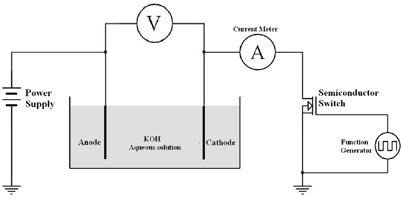
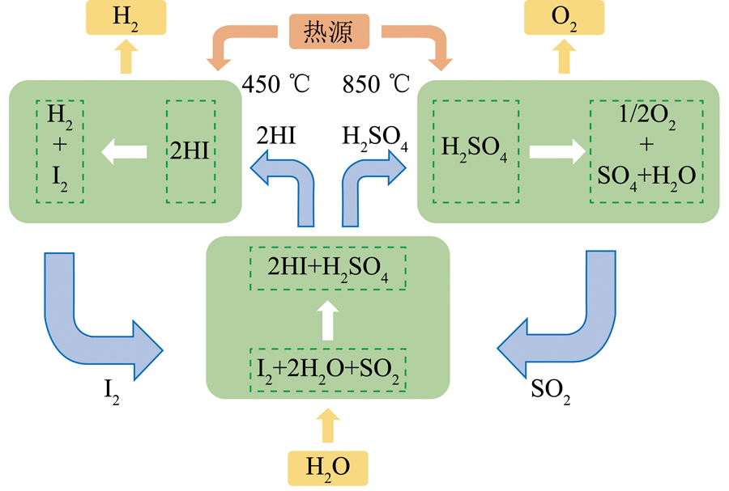
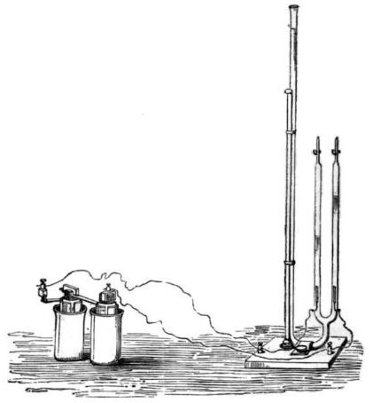

# Water Electrolysis (H₂/O₂)

> **Node ID**: chemistry.electrolysis.water-splitting
> **Domain**: [Chemistry](./index.md)
> **Dependencies**: [`Fuel Cell`](../energy/fuel-cell.md)
> **Enables**: Various downstream capabilities
> **Timeline**: Years 20-35
> **Outputs**: electrolytic_hydrogen, electrolytic_oxygen
> **Critical**: No

## Overview

> *An experimental electrolysis cell attached to a function generator so the voltage, waveform and frequency of the current can be changed and tested for different results.*

> *Image: Hossein Moayedi, CC BY 4.0*

Electrolytic splitting of water into hydrogen and oxygen gases. Alkaline electrolysis (KOH electrolyte, 70-90°C) or PEM electrolysis (solid polymer membrane). Produces ultra-pure hydrogen for ammonia synthesis, semiconductor processing, and fuel cells. Efficiency 60-80%, requires DC electricity at 1.8-2.2V per cell.

This article covers non-electrolytic water splitting: thermochemical cycles and photocatalytic methods that decompose water using heat or light rather than electricity. Where electrolysis converts electricity to hydrogen, thermochemical cycles convert heat directly, avoiding the Carnot efficiency loss of the electricity generation step. Photocatalytic splitting converts sunlight directly to hydrogen without any intermediate energy conversion.

The fundamental constraint is the same regardless of method: breaking the O-H bond in water requires a minimum energy input equal to the Gibbs free energy of water formation (237 kJ/mol at 25°C). Electrolysis supplies this as electricity. Thermochemical cycles supply it as heat cycled through a series of reactions. Photocatalysis supplies it as absorbed photons. The energy accounting is inescapable; no method can produce hydrogen with less energy than this thermodynamic minimum.

Primary outputs: `electrolytic_hydrogen`, `electrolytic_oxygen`. Thermochemical cycles also produce hydrogen and oxygen, but through chemical intermediates (sulfuric acid, iodine, metal oxides) rather than direct electrical splitting.

## Prerequisites

### Materials

- Sulfuric acid (H₂SO₄, concentrated) and iodine (I₂) for the S-I thermochemical cycle
- Metal oxides (ZnO/Zn, Fe₃O₄/FeO, CeO₂/Ce₂O₃) for metal oxide thermochemical cycles
- Semiconductor photocatalysts (TiO₂, modified with dopants for visible light absorption)
- High-temperature reactor materials (silicon carbide, quartz, or high-alloy steels resistant to acid at 800°C+)

### Equipment

- [Fuel Cell](../energy/fuel-cell.md) — material dependency (hydrogen utilization downstream)

### Knowledge

- Thermochemical cycle chemistry: the Bunsen reaction (I₂ + SO₂ + 2H₂O → 2HI + H₂SO₄), sulfuric acid decomposition at 850°C, and hydrogen iodide decomposition at 300-450°C
- Metal oxide redox cycling: thermal reduction at 1500-2000°C, followed by water-splitting oxidation at 800-1000°C
- Photocatalytic band gap engineering: matching semiconductor band gap to the water splitting potential (1.23V minimum) while absorbing visible light
- Concentrated solar power (CSP) system design for achieving 800-2000°C process temperatures

### Infrastructure

- High-temperature heat source: concentrated solar (parabolic dish or heliostat field achieving 800-2000°C) or nuclear reactor (high-temperature gas-cooled, 750-950°C outlet)
- Corrosion-resistant reactor vessels (SiC-lined, quartz, or Hastelloy) for acid decomposition at extreme temperatures
- Gas separation and purification equipment (condensers, scrubbers, membranes) for separating H₂ and O₂ from cycle intermediates
- Heat recovery system: thermochemical cycles are only efficient when the heat released in exothermic steps is captured and reused in endothermic steps

## Process Description

### Sulfur-Iodine (S-I) Thermochemical Cycle

The S-I cycle is the most studied thermochemical water splitting process, originally developed by General Atomics for coupling with nuclear reactors. Three reactions sum to the overall water splitting:

**Step 1 (Bunsen reaction, 120°C)**: I₂ + SO₂ + 2H₂O → 2HI + H₂SO₄. Sulfur dioxide, iodine, and water react to form two acids: hydriodic acid and sulfuric acid. The two acids are immiscible in excess iodine and spontaneously separate into a light HI phase (upper) and a heavy H₂SO₄ phase (lower), enabling liquid-liquid separation.

**Step 2 (Sulfuric acid decomposition, 850°C)**: H₂SO₄ → H₂O + SO₂ + ½O₂. Sulfuric acid vaporizes and decomposes in two stages. First it loses water to form SO₃ (at 400-500°C). Then SO₃ decomposes to SO₂ and O₂ over a catalyst (platinum or chromium oxide on a ceramic support) at 800-900°C. This is the most technically demanding step because it involves hot, concentrated sulfuric acid and requires materials that resist extreme corrosion.

**Step 3 (HI decomposition, 300-450°C)**: 2HI → H₂ + I₂. Hydrogen iodide thermally decomposes to hydrogen gas and iodine. The reaction is equilibrium-limited (only about 20% conversion per pass at 450°C), requiring either membrane separation to remove H₂ and shift the equilibrium, or reactive distillation to drive conversion higher.

The net reaction is H₂O → H₂ + ½O₂. All other chemicals (I₂, SO₂, H₂SO₄, HI) are recycled in a closed loop. The theoretical cycle efficiency is 50-55%, though practical systems achieve 30-40% due to heat exchange losses and separation energy costs.

The theoretical advantage of thermochemical cycles over electrolysis is thermodynamic. Converting heat to electricity incurs Carnot efficiency losses (typically 35-45% for steam turbines). Electrolysis then converts that electricity to hydrogen at 60-80% efficiency, for an overall heat-to-hydrogen efficiency of 20-35%. A thermochemical cycle skips the electricity step entirely, using heat directly to drive chemical reactions. In principle, this avoids the Carnot penalty and achieves higher overall efficiency. In practice, the severe materials requirements (corrosion-resistant reactors at 850°C+, near-perfect chemical separation between cycle steps) and the energy cost of separating intermediates erode much of the theoretical advantage.

### Metal Oxide Thermochemical Cycles

Metal oxide cycles use a two-step redox process. In the first step (thermal reduction, 1500-2000°C), a metal oxide is heated to release oxygen: MOₓ → MOₓ₋₁ + ½O₂. In the second step (water splitting, 800-1000°C), the reduced oxide reacts with steam to produce hydrogen and re-form the oxide: MOₓ₋₁ + H₂O → MOₓ + H₂.

The zinc oxide cycle (ZnO → Zn + ½O₂ at 2000°C, then Zn + H₂O → ZnO + H₂ at 400-700°C) and the cerium oxide cycle (CeO₂ → CeO₂₋δ at 1500°C, then CeO₂₋δ + H₂O → CeO₂ + H₂ at 800-1000°C) are the most studied. The cerium oxide cycle is particularly attractive because ceria retains its fluorite crystal structure during reduction, avoiding the phase-change stresses that crack ZnO-based reactors. The peak temperature requirement (1500°C for ceria) is achievable with concentrated solar power using heliostat fields or parabolic dishes.

### Photocatalytic Water Splitting

Semiconductor photocatalysts absorb photons and generate electron-hole pairs. The electrons reduce water to H₂; the holes oxidize water to O₂. The band gap of the semiconductor must straddle both the hydrogen evolution potential (0V vs. NHE) and the oxygen evolution potential (+1.23V vs. NHE), requiring a minimum band gap of 1.23 eV. In practice, overpotentials for both half-reactions push the required band gap to 1.6-2.0 eV.

Titanium dioxide (TiO₂, band gap 3.2 eV for anatase) was the first photocatalyst discovered (Fujishima-Honda effect, 1972). It is chemically stable and cheap but absorbs only ultraviolet light (4% of solar energy). Doping TiO₂ with nitrogen, carbon, or transition metals narrows the band gap to capture visible light, but doped materials typically have lower quantum efficiency because dopant sites also act as electron-hole recombination centers.

Current photocatalytic systems achieve solar-to-hydrogen efficiencies of 1-3%, well below the 10-15% needed for economic viability. Tandem cells (two photocatalysts with complementary absorption, analogous to multi-junction solar cells) and photoelectrochemical cells (a photovoltaic cell integrated with an electrolysis function in one device) are the most promising paths to higher efficiency.

Photocatalytic water splitting has a fundamental materials challenge. The semiconductor must simultaneously absorb visible light (band gap 1.6-2.0 eV), have conduction and valence band edges that straddle the water reduction and oxidation potentials, resist photocorrosion in aqueous solution under illumination, and be cheap enough for large-area deployment. No known material satisfies all four constraints well. Metal oxides (TiO₂, Fe₂O₃, BiVO₄) are stable and cheap but have poor visible light absorption or rapid electron-hole recombination. Chalcogenides (CdS, GaAs) absorb visible light well but corrode in aqueous solution. The search for the "holy grail" photocatalyst remains one of the most active areas in materials science.

### Step-by-Step Procedure

The following describes a bench-scale S-I cycle demonstration, the most practical thermochemical route for initial experimentation:

1. Prepare the Bunsen reaction mixture: dissolve iodine in water (excess I₂ ensures phase separation), then bubble SO₂ gas through the solution at 50-70°C. The solution separates into a brown HI-rich upper phase and a clear H₂SO₄-rich lower phase.
2. Separate the two phases using a separatory funnel or gravity decantation. The HI phase goes to the decomposition reactor. The H₂SO₄ phase goes to the acid decomposition furnace. Verify separation quality: a cloudy or emulsified interface indicates excess water. Add more I₂ to sharpen the phase boundary.
3. Decompose H₂SO₄ in a quartz or SiC tube furnace. Heat gradually: 200°C to vaporize water, 400°C to decompose to SO₃, then 850°C over a Pt/C catalyst to crack SO₃ into SO₂ and O₂. Collect SO₂ for recycle. Vent or capture O₂. The SO₃ decomposition step is the rate-limiting step of the entire cycle and determines the maximum hydrogen production rate.
4. Decompose HI in a heated tube reactor at 300-450°C. The product gas mixture (H₂, HI vapor, I₂ vapor) passes through a condenser to recover I₂ (solid, sublimes at 184°C) and HI (condenses to liquid). The non-condensable H₂ is collected over water or in a gas bag.
5. Return recovered I₂ and SO₂ to the Bunsen reaction vessel. Add makeup water equal to the hydrogen and oxygen produced. The cycle is now closed. Weigh all recovered intermediates to verify material balance; any loss indicates a leak or incomplete separation.

### Process Parameters

| Parameter | Range | Notes |
|-----------|-------|-------|
| S-I Bunsen reaction temperature | 50-120°C | Higher temperature speeds reaction but worsens phase separation |
| H₂SO₄ decomposition temperature | 800-900°C | Below 750°C, SO₃ decomposition is incomplete; above 950°C, materials corrode rapidly |
| HI decomposition temperature | 300-450°C | Equilibrium limited: 20% conversion at 450°C, 10% at 300°C |
| Metal oxide reduction temperature | 1500-2000°C | Requires concentrated solar or nuclear heat source |
| Photocatalyst band gap (ideal) | 1.6-2.0 eV | Must straddle both H₂ and O₂ evolution potentials |
| Cycle heat input (S-I) | ~750 kJ/mol H₂ | Theoretical; practical systems require 30-50% more due to heat exchange losses |
| Photocatalyst solar-to-hydrogen efficiency | 1-3% (current best) | Below 10% is not economically viable for large-scale hydrogen production |

## Safety Considerations

- **Concentrated sulfuric acid at 850°C**: The combination of extreme temperature and extreme corrosivity is uniquely hazardous. A breach in the acid decomposition reactor sprays molten, fuming acid. Reactor materials (SiC, quartz) are brittle and can crack from thermal shock. Heat gradually and avoid rapid temperature changes.
- **Hydrogen iodide (HI) gas**: Strong acid gas. Irritating to respiratory tract and corrosive to skin. The HI decomposition reactor operates at 300-450°C with toxic gas under pressure. Leak detection and forced ventilation are mandatory.
- **Iodine vapor**: I₂ sublimes at 184°C and the vapor is toxic, irritating eyes and respiratory tract at concentrations above 1 ppm. The purple vapor is visible at dangerous concentrations, providing a crude warning. Handle solid iodine in a fume hood.
- **Sulfur dioxide**: SO₂ is a toxic gas (IDLH 100 ppm) with a sharp, choking odor. The Bunsen reaction generates it as an intermediate, and any SO₂ leak from the recycle loop is a respiratory hazard. Continuous SO₂ monitoring in the work area.
- **High-temperature burn hazards**: The H₂SO₄ decomposition reactor operates at 850°C. The metal oxide reduction step operates at 1500-2000°C. Surface temperatures on reactor exteriors, piping, and heat exchangers can cause severe contact burns. Thermal insulation on all hot surfaces is mandatory.
- **Hydrogen**: Same hazards as electrolysis-derived hydrogen (flammable at 4-75% in air, low ignition energy, invisible flame). All hydrogen handling rules apply.

### Personal Protective Equipment

- Full acid-resistant suit (PVC or butyl rubber) for handling concentrated H₂SO₄ and HI at any temperature
- Full-face shield over chemical splash goggles when working near reactors or separation equipment
- Heat-resistant gloves (Kevlar or aluminized) for handling hot reactor tubes and furnace components
- Supplied-air respirator when entering an area with SO₂ or HI leak potential (cartridge respirators have limited capacity for acid gases)
- UV-blocking face shield when working near concentrated solar furnace (reflected sunlight can cause retinal damage)

### Emergency Procedures

- **Acid splash from H₂SO₄ decomposition circuit**: The acid is both hot and concentrated. Flush with cold water for 30 minutes minimum. The combination of thermal and chemical burns makes immediate medical attention essential. Do not attempt to neutralize with base; the exothermic neutralization adds to the thermal injury.
- **SO₂ or HI gas leak**: Evacuate the area. Ventilate with fresh air. Re-enter only with supplied-air respirator. Shut down the Bunsen reaction and seal the SO₂ and HI reservoirs.
- **Reactor tube failure (SiC or quartz)**: The furnace contains hot, corrosive chemicals. Evacuate immediately. Do not attempt to contain the spill. Let the furnace cool before cleanup. The released SO₂ and HI gases will dissipate with ventilation. After cooling, collect solid residues (iodine crystals, solidified sulfur compounds) for proper disposal or recycle.
- **Hydrogen fire at HI decomposition outlet**: Shut off HI feed to the reactor. Isolate the hydrogen collection system. Do not extinguish the flame if hydrogen is still flowing; let it burn off.
- **Concentrated solar misalignment**: If the heliostat field or parabolic dish drifts off-target, the concentrated solar beam can strike unintended surfaces. Install limit switches on all solar tracking mechanisms. Never stand in the beam path. Use a visual target (a water-cooled steel plate) at the reactor aperture to verify beam alignment before introducing chemicals.

## Quality Control

### Acceptance Criteria

- **Electrolytic Hydrogen**: Purity >99.9% for ammonia synthesis, >99.99% for semiconductor use. CO below 1 ppm (for fuel cell applications). Moisture below 10 ppm after drying.
- **Electrolytic Oxygen**: Purity >99.5%. Hydrogen content below 2%.

### Testing Methods

- **Gas chromatography**: Detects H₂, O₂, N₂, CO, CO₂, and trace SO₂ or HI carryover in product streams. Essential for verifying that cycle chemicals are not contaminating the product hydrogen.
- **Cycle efficiency measurement**: Track total heat input (Bunsen reaction enthalpy, H₂SO₄ decomposition enthalpy, HI decomposition enthalpy) vs. hydrogen lower heating value (286 kJ/mol). The ratio should exceed 30% for a viable system.
- **Chemical balance accounting**: Weigh or measure all inputs and recycled intermediates. Any loss represents either a leak (safety hazard) or incomplete separation (efficiency loss). In the S-I cycle, iodine loss is the most common issue because I₂ is volatile and can escape at multiple points.
- **Corrosion monitoring**: Periodically inspect reactor internals and pipe walls for thinning, pitting, or cracking. Use ultrasonic thickness gauges on metal components. Replace SiC or quartz tubes at the first sign of thermal crack propagation.

### Sampling Protocol

- Continuous gas monitoring at hydrogen outlet for purity and SO₂ contamination
- Daily check of Bunsen reaction phase separation: the HI and H₂SO₄ phases should be cleanly separated with a sharp interface. A cloudy interface indicates incomplete separation or contamination.
- Weekly analysis of recycled SO₂ and I₂ for purity (acid decomposition and HI decomposition products can cross-contaminate if separation is imperfect)
- Monthly corrosion inspection of all wetted components in the H₂SO₄ decomposition circuit (the most corrosive section). Use ultrasonic thickness measurement on metal components and visual inspection of SiC or quartz tubes for crack initiation
- Quarterly review of overall cycle efficiency (heat input vs. hydrogen output). If efficiency drops below 25%, investigate heat exchanger fouling, membrane degradation in the HI decomposition unit, or increasing parasitic losses from side reactions

## Scaling Notes

- **Bench scale (grams of H₂ per cycle)**: Glass or quartz reactors, electric tube furnaces, manual phase separation. Demonstrates each reaction step independently and verifies chemical yields. A university lab with fume hoods and tube furnaces can run the S-I cycle at this scale.
- **Pilot scale (kilograms of H₂ per day)**: SiC or Hastelloy reactors, continuous flow separation, heat recovery heat exchangers between the exothermic Bunsen reaction and the endothermic decomposition steps. Requires concentrated solar test facility or process heat from a nuclear test reactor.
- **Industrial scale (tonnes of H₂ per day)**: Coupled to a high-temperature nuclear reactor (750-950°C outlet) or a large heliostat field. Full heat recovery network achieving 35-45% overall efficiency. Not yet demonstrated at this scale; the S-I cycle has been validated in integrated bench-scale loops but not in commercial plants.

The primary scaling barrier is materials. No metal alloy survives concentrated H₂SO₄ at 850°C for extended periods. SiC and quartz work but are brittle and expensive to fabricate into large, complex reactor geometries. The heat exchangers between high-temperature acid circuits and lower-temperature Bunsen reaction must be made from corrosion-resistant materials while maintaining high heat transfer efficiency.

For a bootstrapping civilization, the thermochemical water splitting approach is a later-stage technology. It requires either a high-temperature nuclear reactor (beyond the reach of early industrial development) or a concentrated solar power system with heliostat field (achievable with mature glass and metalworking). The S-I cycle chemicals (sulfuric acid, iodine) are available from earlier chemistry developments. The materials challenge (corrosion resistance at 850°C) is the gating constraint. Metal oxide cycles, particularly the ceria cycle, are more accessible because they avoid the acid chemistry but require even higher temperatures (1500°C) for the reduction step.

## Troubleshooting

| Problem | Probable Cause | Solution |
|---------|---------------|----------|
| Bunsen reaction phases not separating cleanly | Excess water diluting the HI phase; insufficient I₂ to drive phase separation; temperature too high (above 120°C) | Reduce water input. Add more I₂ to create a heavier lower phase. Cool the Bunsen reactor to 50-80°C for better phase contrast. |
| H₂SO₄ decomposition incomplete (residual SO₃ in product gas) | Catalyst bed temperature below 800°C; catalyst deactivation from acid attack on the support material; residence time too short | Verify furnace temperature at the catalyst bed (not just the furnace setpoint). Replace Pt/C catalyst if activity has dropped. Increase tube length or reduce flow rate for longer residence time. |
| HI decomposition yield below 15% per pass | Temperature too low (below 300°C); equilibrium not shifted by product removal | Increase temperature toward 450°C. Install a membrane separator to remove H₂ from the product gas, shifting equilibrium toward further decomposition. |
| Iodine loss from the cycle | I₂ vapor escaping at HI decomposition temperature (sublimes at 184°C); or dissolved I₂ carried into H₂SO₄ phase during imperfect phase separation | Install cold traps on all vent lines (I₂ deposits as shiny black crystals on cold surfaces). Improve Bunsen phase separation. Add an iodine recovery scrubber on exhaust gas. |
| Photocatalyst produces no H₂ | Band gap too wide (TiO₂ in visible light); catalyst surface poisoned by organic contaminants; sacrificial reagents consumed | Switch to a narrower bandgap material (CdS, GaN:ZnO). Clean catalyst surface with acid wash. Add sacrificial electron donors (methanol, Na₂S) for initial testing to verify that the catalyst works at all. |

## Variations and Alternatives

- **Hybrid sulfur (HyS) cycle**: A two-step cycle that eliminates iodine handling. Step 1: electrochemical oxidation of SO₂ to H₂SO₄ while producing H₂ at the cathode (80°C). Step 2: thermal decomposition of H₂SO₄ to SO₂, O₂, and H₂O (850°C). Simpler chemistry than S-I but requires an electrolysis step (electricity input), reducing the advantage of purely thermal hydrogen production.
- **Copper-chlorine (Cu-Cl) cycle**: Operates at lower maximum temperature (530°C) than S-I or metal oxide cycles, making it compatible with a wider range of heat sources including current nuclear reactors. Involves solid-solid reactions and molten salt handling. Cycle efficiency is lower (30-35%).
- **Photoelectrochemical (PEC) cells**: A semiconductor electrode immersed in electrolyte absorbs light and directly drives water splitting at the semiconductor-liquid junction. Combines photovoltaic and electrolysis functions in one device. Higher efficiency than suspended photocatalysts but requires transparent, corrosion-resistant semiconductor materials.
- **Direct thermal dissociation**: Heat water to above 2500°C and it dissociates directly into H₂ and O₂. Theoretically simple but practically impossible because separating H₂ from O₂ at that temperature requires a ceramic membrane (zirconia, ceria) that survives 2500°C while maintaining gas-tightness. No material currently meets these requirements.
- **Plasma water splitting**: Water passed through a thermal plasma (10,000-20,000°C) dissociates completely into atomic H and O. The quench rate must be extremely fast to prevent recombination. Energy-intensive and technically demanding. Not practical for bulk hydrogen production but used in specialized synthesis applications.

## References

- [Electrolysis](electrolysis.md) — parent capability
- [Chemistry Domain](./index.md) — domain overview and related capabilities
- [Fuel Cell](../energy/fuel-cell.md) — upstream dependency (material)

### Material Handling

Sulfuric acid for the S-I cycle must be handled at all concentrations from dilute Bunsen reaction mixture to the concentrated acid fed to the decomposition furnace. Store concentrated H₂SO₄ in glass, PTFE, or steel containers (steel is acceptable for >90% H₂SO₄ due to passivation; never store dilute acid in steel). Always add acid to water, never the reverse, to control the exothermic dilution heat.

Iodine is a solid at room temperature (melting point 114°C) that sublimes readily. Store in sealed glass containers in a cool, dark place. I₂ vapor stains skin and clothing brown (the stain fades over days). The purple vapor is visible and serves as a warning at hazardous concentrations. Recover iodine from vent streams with cold traps; the cost of continuous iodine makeup would make the cycle uneconomic.

SO₂ gas cylinders must be stored outdoors or in a ventilated gas cabinet. SO₂ is heavier than air and accumulates in low points. Cylinder valves should be checked for leakage with an ammonia vapor test (SO₂ + NH₃ forms a white ammonium sulfite smoke at the leak point).

Metal oxide powders (ZnO, CeO₂) are fine particulates that pose inhalation hazards. Handle with dust masks in a ventilated area. The reduced metal forms (Zn vapor, Ce₂O₃ powder) are pyrophoric in some conditions; store under inert atmosphere.

Each thermochemical water splitting approach has different tradeoffs in temperature requirements, materials compatibility, efficiency, and scalability. The S-I cycle is the most studied but requires the most demanding materials (acid at 850°C). The metal oxide cycles avoid acid chemistry but need even higher temperatures (1500-2000°C). The Cu-Cl cycle operates at lower temperatures (530°C maximum) but involves more reaction steps and molten salt handling. The choice for a bootstrapping civilization depends on the available heat source and the maturity of high-temperature materials technology. In all cases, thermochemical water splitting is a later-stage technology that becomes attractive only after basic electrolysis is well established and the civilization has access to high-temperature heat sources.

The photocatalytic approach has one advantage that thermochemical cycles cannot match: it requires no high-temperature heat source, no corrosive chemical loops, and no complex reactor engineering. A tank of water with suspended photocatalyst powder, illuminated by sunlight, produces hydrogen and oxygen bubbles that can be collected. The barrier is not complexity but efficiency. Current photocatalysts convert less than 3% of incident solar energy to hydrogen. If this could be raised to 10-15%, photocatalytic water splitting would be the cheapest route to hydrogen, requiring only water, sunlight, and a tank of catalyst. Research continues on modified TiO₂, doped strontium titanate, and solid solution photocatalysts (GaN:ZnO) that extend absorption into the visible spectrum.

For any thermochemical or photocatalytic water splitting method, the ultimate benchmark is cost per kilogram of hydrogen delivered. Electrolysis currently produces hydrogen at $3-6/kg (depending on electricity cost). Steam methane reforming produces it at $1-2/kg. For thermochemical or photocatalytic methods to compete, they must deliver hydrogen below $3/kg, which requires high cycle efficiency (above 30%), long reactor life (above 10 years), and low capital cost for the heat source or photocatalyst system. No non-electrolytic method has yet demonstrated these economics at scale.

---
*Part of the [Bootciv Tech Tree](../../index.md) · [Chemistry](./index.md) · [All Domains](../../index.md)*

