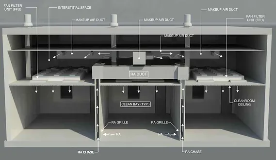
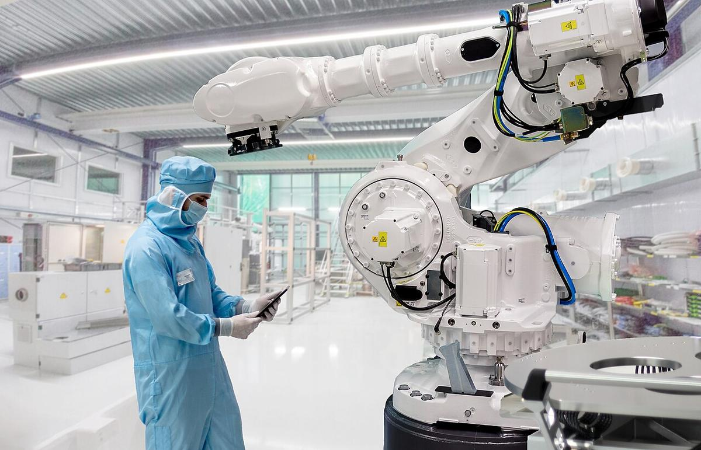
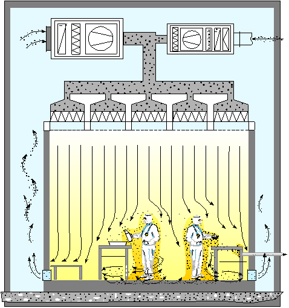

# Clean Room Technology

> *Free picture about the big hard drive disk that is open from the comp of digital technology. This historical picture was created for you by  the super conductive friend epSos.de  and it  can be used for free, if you link epSos.de as the original author of the image.

A hard disk drive ( english h...*

> *Image: epSos.de, CC BY 2.0*

Capabilities in this domain:

> *Image: GRIZZ24, CC BY-SA 4.0*

- [HEPA/ULPA Filtration & Laminar Flow](hepa-ulpa-filtration.md) — Filter media construction (borosilicate glass microfibers, 99.97% @ 0.3 μm for HEPA, 99.999% @ 0.12 μm for ULPA), fan-filter unit design, laminar flow principles, pre-filtration stages, and filter integrity testing (DOP/PAO challenge).

> *Image: Clemenspool, CC0*

- [Contamination Control](contamination-control.md) — Gowning protocols and garment materials, particle monitoring systems (laser scattering counters), electrostatic discharge (ESD) control (ionizers, wrist straps, conductive flooring), ISO 14644-1 classification (ISO Classes 1-9), and personnel training requirements.

> *Image: Rudolf Simon, M+W Group GmbH, Stuttgart, Germany, CC BY-SA 3.0*

- [Facility Design & HVAC](facility-design.md) — Positive pressure cascading (10-25 Pa), modular wall panel construction, raised perforated flooring, ceiling grid systems, make-up air handling, temperature/humidity control (22±0.5°C, 43±3% RH), and airlock pressure cascade design.

[↑ Back to Tech Tree](../index.md)
