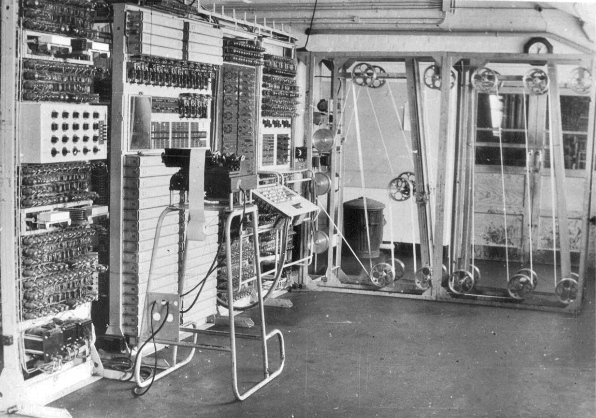
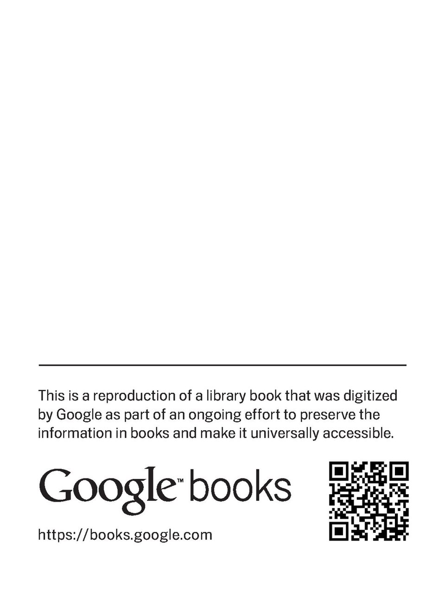
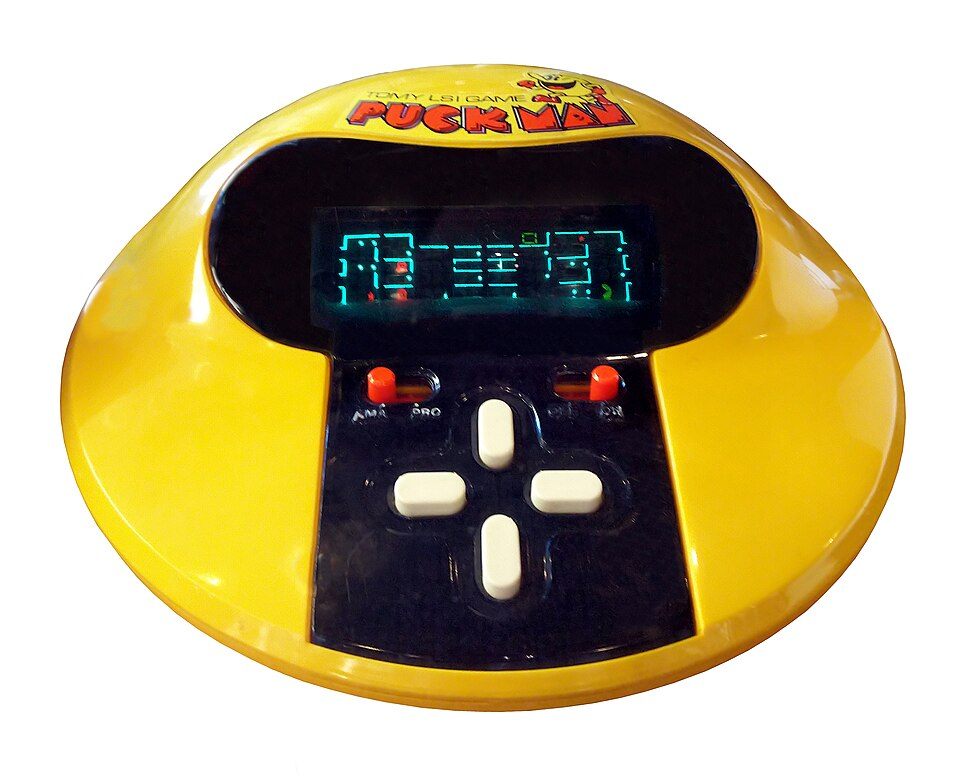
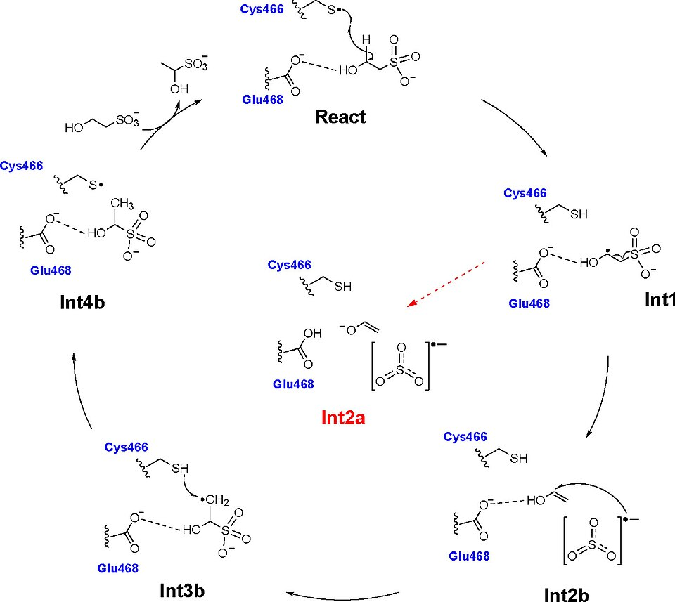

# Computing & Automation

> *Image: Good, Jack; Michie, Donald; Timms, Geoffrey (1945), General Report on Tunny: With Emphasis on Statistical Methods, UK Public Record Office HW 25/4 and HW 25/5, Public domain*

> *Wartime photo of Colossus 10*

> *Image: Good, Jack; Michie, Donald; Timms, Geoffrey, Public domain*

Capabilities in this domain:

> *Image: Unknown authorUnknown author, Public domain*

- [Electromechanical Computing](electromechanical.md) — Difference engines, automated machine tools (turret lathe, screw machine), punch card data processing, and tabulating machines.

> *Image: MBH, CC BY 4.0*

- [Electronic Computing](electronic.md) — Vacuum tube and early transistor computing, stored-program architecture, and electronic data processing.

> *Image: US War Dept., Public domain*

- [Mechanical Calculation](mechanical.md) — Manual and mechanical calculation aids: abacus, slide rules, nomograms, mathematical tables, Pascaline, stepped drum calculators.
<!-- TODO: source image for Digital Logic -->
- [Digital Logic](digital-logic.md) — Boolean algebra, logic gate families (TTL, CMOS), combinational and sequential circuit design, and arithmetic circuits.
<!-- TODO: source image for Logic Design -->
- [Logic Design](logic-design.md) — Engineering discipline of transforming Boolean algebra into physical circuits: combinational/sequential circuit design, state machines, HDL specification, and timing analysis.
<!-- TODO: source image for Computer Architecture -->
- [Computer Architecture](computer-architecture.md) — Structure and behavior of computing systems: instruction set architecture, register organization, memory hierarchy, I/O mechanisms, and bus topology.
<!-- TODO: source image for Embedded Systems -->
- [Embedded Systems](embedded-systems.md) — Dedicated computing systems for real-time industrial control: microcontroller-based firmware for motor drives, temperature controllers, and automated equipment.
<!-- TODO: source image for Data Storage -->
- [Data Storage](data-storage.md) — Punch cards, paper tape, magnetic media, optical storage, and solid-state memory technologies.

[↑ Back to Tech Tree](../index.md)
