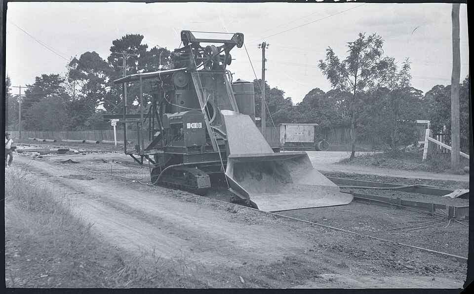
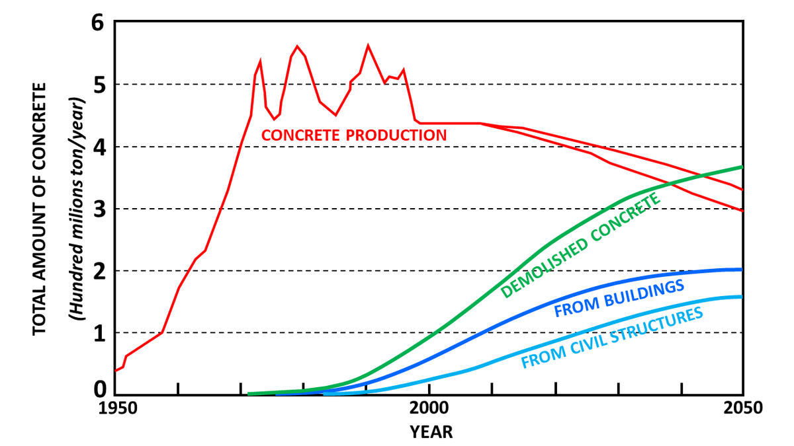

# Concrete Mixer

> **Node ID**: construction.concrete-mixer
> **Domain**: [Construction](./index.md)
> **Dependencies**: [`metals.iron-steel`](../metals/iron-steel.md), [`chemistry.cement`](../chemistry/cement.md)
> **Enables**: [`construction.industrial-buildings`](./industrial-buildings.md), [`transport.roads`](../transport/roads.md)
> **Timeline**: Years 10-25
> **Outputs**: mixed_concrete
> **Critical**: Yes — consistent concrete mixing is required for all reinforced concrete construction; hand mixing produces inconsistent strength and inadequate distribution of aggregate

## Overview

> *QSA Item ID 1820216 The Transport and Main Roads Visual Resource Library collection contains over 200.000 photographs and other resources from the 1920’s to 2005 from the many and varied road, transport and maritime departments over that time. View this and other original records at the Queensland State Archives: Series ID 20074*

> *Image: Queensland State Archives, Public domain*

> *Diagram illustrating the concrete production in Japan from 1950 and projected to 2050; the waste concrete production is reported. Modified from: Sara Shomal Zadeh, Navid Joushideh, Behrokh Bahrami e Sahel Niyafard, A review on concrete recycling, in World Journal of Advanced Research and Reviews,...*

> *Image: Antonov - Antonio Valdisturlo, CC BY-SA 4.0*

A concrete mixer combines cement, sand, aggregate, and water into a homogeneous mixture by tumbling the ingredients inside a rotating drum. Internal baffles (fixed blades welded to the drum interior) lift and fold the batch with each rotation, ensuring uniform distribution of cement paste around aggregate particles. The rotating-drum tilting design is the simplest effective mixer: a conical or cylindrical drum mounted on a frame, rotated by a hand crank or motor, and tilted to discharge the mixed batch.

Mixing effectiveness depends on drum geometry, rotation speed, and baffle design. Too slow: ingredients slide without mixing. Too fast: centrifugal force pins material to the drum wall, preventing folding. The optimal speed keeps the material in a cascading motion — lifted by baffles to the top of the drum, then falling through itself. Drum rotation rate: 15-25 RPM for hand-cranked, 12-20 RPM for powered mixers.

Position in the dependency chain: the concrete mixer depends on [Iron & Steel](../metals/iron-steel.md) for the drum, frame, and drive components, and on [Cement & Concrete](../chemistry/cement.md) for the material being mixed. It enables [Industrial Buildings](./industrial-buildings.md) (foundations, floor slabs, structural walls) and [Road & Bridge Construction](../transport/roads.md) (pavement, bridge decks, culverts). Without a mechanical mixer, concrete is mixed by hand on a board or sheet — a process that produces inconsistent batches with strength variations of ±30%, compared to ±5% for machine-mixed concrete.

## Prerequisites

- [Iron & Steel](../metals/iron-steel.md) — steel sheet for drum, angle iron for frame, bar stock for baffles
- [Welding](../metals/forming.md) — fillet welding for drum seams, baffle attachment, frame assembly
- [Cement & Concrete](../chemistry/cement.md) — Portland cement, aggregate, and water for the material being mixed
- [Bearings](../machine-tools/bearings-abrasives.md) — pillow block or journal bearings for drum trunnion and crank shaft
- [Power source](../energy/index.md) — hand crank (no power required) or 1.5-3 kW electric motor / 5-8 HP engine

## Bill of Materials

### Hand-Cranked Tilting Drum Mixer (150-200 L batch)

| Material | Quantity | Specifications | Source | Alternatives |
|----------|----------|----------------|--------|-------------|
| Steel sheet (drum) | 30-50 kg | 3-5 mm thick, mild steel A36 or equivalent | [Iron & Steel](../metals/iron-steel.md) | Hardwood drum with metal bands (shorter life, absorbs water) |
| Steel bar (baffles) | 5-10 kg | 10 × 50 mm flat bar, 4-6 pieces | [Iron & Steel](../metals/iron-steel.md) | None — baffles are essential |
| Steel bar (frame) | 40-60 kg | 40 × 40 mm or 50 × 50 mm angle iron | [Iron & Steel](../metals/iron-steel.md) | Timber frame (heavier, rots) |
| Steel shaft (drum trunnion) | 5-10 kg | 30-40 mm diameter, 400-500 mm long, turned | [Iron & Steel](../metals/iron-steel.md) | Hardwood shaft with iron journals |
| Cast iron gears or chain drive | 1 set | 4:1 to 6:1 reduction ratio | [Foundry](../metals/casting.md) | V-belt and pulley (requires rubber belts) |
| Crank handle | 1 | Forged steel, 250-350 mm arm length | [Forging](../metals/forming.md) | Timber handle with iron ferrule |
| Bearings | 4 | Pillow block or plain journal bearings, 30-40 mm bore | [Bearings](../machine-tools/bearings-abrasives.md) | Hardwood bearings with grease (higher friction) |
| Bolts and nuts | 3-5 kg | M10-M16, grade 4.6 or 8.8 | [Fasteners](../metals/steelmaking.md) | Riveted joints (non-adjustable) |

### Powered Conversion (adds to hand-cranked base)

| Material | Quantity | Specifications | Source | Alternatives |
|----------|----------|----------------|--------|-------------|
| Electric motor | 1 | 1.5-3 kW, 1400-1500 RPM, three-phase or single-phase | [Motors](../energy/electric-motor.md) | Petrol/diesel engine (5-8 HP) |
| V-belts and pulleys | 2-3 | A-section or B-section belts, cast iron pulleys | [Machine Tools](../machine-tools/index.md) | Roller chain and sprockets |
| Motor mount plate | 1 | 6-10 mm steel plate, adjustable slot for belt tension | [Iron & Steel](../metals/iron-steel.md) | Timber motor mount (less rigid) |

## Process Description

### Drum Fabrication

1. **Cut drum shell**: Mark and cut a rectangular sheet of 3-5 mm steel plate. For a 200 L mixer: approximately 900 mm wide × 1200 mm long (forming a cylinder 400 mm diameter × 900 mm long, with a conical discharge section). Roll the sheet into a cylinder on a plate roller or by bending over a mandrel. Overlap the seam 30-50 mm for welding.

2. **Form the conical discharge end**: Cut a truncated cone section from the same plate (small diameter 250 mm, large diameter matching the cylinder). Roll and weld the cone. Weld the cone to the cylinder with a continuous fillet weld, 4 mm leg size, inside and outside.

3. **Weld internal baffles**: Cut 4-6 flat bar baffles (10 × 50 mm, 350-400 mm long) to fit the drum interior at equal angular spacing. Weld each baffle to the drum wall with 30 mm fillet welds at each end. Baffle orientation: angled 30-45° from the drum axis to promote axial mixing (material moves toward the closed end during rotation). Ensure baffles are staggered — alternating left-hand and right-hand angles — to prevent material from migrating to one end.

4. **Fabricate trunnion rings**: Cut two rings from 6-8 mm steel plate, matching the drum outside diameter. Weld one ring near each end of the cylindrical section. These rings ride on the support rollers and transmit the drum weight to the frame. Grind the outer surface of each ring smooth and concentric with the drum axis (runout <2 mm).

5. **Install discharge chute**: Cut a rectangular opening (200 × 300 mm) in the closed end of the drum (opposite the cone). Weld a steel chute (formed from 2 mm sheet) over the opening, angled 45° downward for gravity discharge. The drum tilts to pour through this opening.

6. **Weld drive ring**: Weld a flat bar ring or sprocket mounting ring around the drum center. This provides the drive surface for the gear or chain. For chain drive: weld mounting lugs for a sprocket. For gear drive: the ring itself may be the driven gear if cast with teeth.

### Frame and Tilting Mechanism

7. **Fabricate frame**: Cut and weld the frame from 40 × 40 mm or 50 × 50 mm angle iron. The frame supports the drum via two pairs of rollers (one pair at each trunnion ring) and provides a mounting point for the crank/motor and the tilting mechanism. Frame dimensions: approximately 1200 mm long × 800 mm wide × 900 mm high (at the drum axis). Cross-brace the frame for rigidity.

8. **Mount support rollers**: Install four rollers (steel or cast iron, 50-80 mm diameter, 80-100 mm long) on shafts bolted to the frame. Two rollers per trunnion ring, positioned at 4 o'clock and 8 o'clock relative to the drum centerline. The drum rests on these rollers by gravity. Roller spacing: slightly wider than the trunnion ring width to allow the drum to rotate freely without lateral wandering. Clearance between drum and rollers: 0.5-1.0 mm.

9. **Build tilting mechanism**: Pivot the drum and roller assembly on a horizontal shaft mounted across the frame at the drum's center of gravity. The tilting shaft: 25-30 mm diameter steel rod through two pillow block bearings on the frame. Attach a lever arm (800-1000 mm long) to the tilting shaft. The operator pushes the lever to tilt the drum for discharge and pulls it back for loading. Lock the lever in the mixing position with a pin through the lever and frame.

10. **Install crank and drive**: Mount the crank shaft on the frame with two bearings. Connect the crank shaft to the drum via a gear reduction (4:1 to 6:1 ratio) or chain and sprocket. The crank handle mounts on the output shaft. Crank arm length: 250-350 mm. At a 5:1 ratio, one crank revolution rotates the drum 1/5 turn, reducing operator effort while maintaining adequate mixing speed.

### Powered Conversion

11. **Mount motor**: Bolt the motor to an adjustable slide plate on the frame. The slide plate allows belt tension adjustment. Motor position: below the drum axis, driving through a secondary shaft with a 3:1 to 4:1 reduction to the drum. Total reduction from motor to drum: 12:1 to 20:1 (1500 RPM motor → 75-125 RPM shaft → 12-20 RPM drum after all reduction stages).

12. **Install belts and guards**: Install V-belts from the motor to the intermediate shaft, and from the intermediate shaft to the drum drive. Adjust belt tension to 1-2% belt deflection under 10 N finger pressure at mid-span. Fabricate and install sheet-metal belt guards over all rotating components. Guards are mandatory — exposed belts and chains amputate fingers.

### Mixing Operation

13. **Charge the mixer**: Load ingredients in the correct order — first approximately 10% of the water, then coarse aggregate, then sand, then cement, then the remaining water. This order prevents dry cement from sticking to the drum walls and ensures the aggregate scrubs the drum clean as it tumbles.

14. **Mix for the required time**: Hand-cranked: 3-5 minutes per batch. Powered: 2-3 minutes per batch. The concrete is fully mixed when it is uniform in color and consistency with no pockets of dry cement or segregated aggregate. Under-mixing produces weak, non-uniform concrete; over-mixing (beyond 5 minutes) does not improve quality and can cause aggregate segregation.

15. **Discharge the batch**: Tilt the drum by pushing the lever arm. Discharge in one continuous pour — do not stop and restart the pour, as this causes segregation. All concrete should be placed within 90 minutes of mixing (45 minutes in hot weather >30°C).

16. **Clean immediately**: Rinse the drum interior with water and a stiff brush immediately after each batch. Concrete that hardens in the drum is extremely difficult to remove and reduces effective drum volume.

### Verification and Calibration

17. **Drum runout check**: Before first use and after any drum repair, mount a dial indicator against the trunnion ring outer surface. Rotate the drum by hand. Maximum radial runout: ≤2.0 mm. Excessive runout causes uneven roller wear and vibration during operation.

18. **Baffle integrity inspection**: After every 50 batches (or weekly, whichever comes first), inspect all baffle welds for cracks. Strike each weld with a hammer — a solid ring indicates a sound weld; a dull thud indicates a crack requiring re-welding. A missing or broken baffle reduces mixing uniformity by 15-25%, producing weak spots in the cured concrete.

19. **Mixing uniformity test (calibration)**: Mix a standard 1:2:4 batch at 0.55 water-cement ratio. After the specified mixing time (3 minutes for powered, 5 minutes for hand-cranked), discharge the batch and take three samples from different points (beginning, middle, end of discharge). Test each sample for slump (target: 75 ±25 mm). If slump varies more than ±25 mm between samples, increase mixing time by 60 seconds and re-test.

20. **Drive system verification (powered)**: Run the empty drum at operating speed for 5 minutes. Check motor current draw: should be 30-50% of rated current (no-load). Vibration at the drum: ≤0.5 mm amplitude measured at the trunnion ring. Belt deflection: 1-2% of center-to-center distance under 10 N finger pressure.

21. **Tilting mechanism test**: Load the drum with 200 kg of dry sand (simulating approximately half the wet concrete weight). Tilt the drum to full discharge position and return to mixing position three times. The lever arm should move smoothly without jerking. The locking pin must engage positively in the mixing position — if the drum drifts from the mixing position under load, the pin hole has elongated and must be re-drilled.

## Quantitative Parameters

### Operating Parameters by Power Source

| Parameter | Hand-Cranked (200 L) | Powered (200 L) |
|-----------|:--------------------:|:---------------:|
| Batch volume | 150-200 L (0.15-0.20 m³) | 150-200 L |
| Mix cycle time | 3-5 minutes | 2-3 minutes |
| Output per hour | 1.5-3.0 m³ | 3-5 m³ |
| Drum rotation speed | 15-25 RPM (crank speed dependent) | 12-20 RPM |
| Maximum aggregate size | 40 mm | 40 mm |
| Discharge time | 30-60 seconds (tilt and pour) | 30-60 seconds |
| Operator effort | 1 person cranking continuously, 1 person loading | 1 person loading and operating |
| Weight (empty) | 200-350 kg | 250-400 kg |
| Drive power | Manual (≈150 W sustained) | 1.5-3.0 kW electric or 5-8 HP engine |
| Drum wall life | 5-10 years (concrete abrasion) | 5-10 years |
| Bearing life | 1-2 years (grease monthly) | 1-2 years |
| Mixing uniformity (coefficient of variation) | ±5-8% strength | ±3-5% strength |

### Concrete Mix Design Reference

| Mix Type | Cement : Sand : Aggregate (by volume) | Water-Cement Ratio | 28-Day Strength | Application |
|----------|:-------------------------------------:|:------------------:|:--------------:|-------------|
| Lean mix | 1 : 4 : 8 | 0.7-0.8 | 10-15 MPa | Fill, blinding, non-structural |
| Standard | 1 : 2 : 4 | 0.5-0.6 | 20-25 MPa | Foundations, walls, slabs |
| Rich mix | 1 : 1.5 : 3 | 0.4-0.5 | 30-40 MPa | Columns, beams, structural |
| Mortar | 1 : 3-4 (cement : sand) | 0.5-0.6 | 10-15 MPa | Bricklaying, plastering |

Water-cement ratio is the single most important parameter: each 0.05 increase in w/c ratio reduces 28-day compressive strength by approximately 5-8 MPa. A mixer that produces uniform distribution of water throughout the batch is critical to consistent strength.

## Scaling Notes

- **50 L hand-cranked mixer**: The smallest practical size. Produces 0.05 m³ per batch, sufficient for small masonry work and fence post foundations. One person can operate and move it. Weight: 80-120 kg. Appropriate for a crew of 2-3 workers. Transport on a hand cart or small trailer.
- **150-200 L mixer**: The standard village-scale mixer. Produces 0.15-0.20 m³ per batch, sufficient for house foundations, small slabs, and septic tanks. Hand-cranked version requires 1 operator cranking + 1-2 loading. Powered version frees the operator for loading and placing. Weight: 200-350 kg. The most common mixer size for community-scale construction projects.
- **350-500 L mixer**: For continuous pours (building floor slabs, road sections). Always powered (1.5-5 kW motor or 8-15 HP engine). Output: 5-10 m³/hour. Requires 3-4 workers: 1 operating the mixer, 2 transporting concrete, 1 placing and finishing. Weight: 400-800 kg.
- **Scaling bottleneck**: At outputs above 10 m³/hour, the mixer is no longer the bottleneck — concrete transport from mixer to placement point becomes the limiting factor. Wheelbarrows carry 0.05-0.08 m³ per trip at 2-3 minutes per round trip, delivering 1-2 m³/hour per barrow. A single 200 L mixer outputting 3 m³/hour needs 2-3 wheelbarrows in constant rotation.
- **Batch plant (10+ m³/hour)**: Multiple mixer units feeding a central hopper, with aggregate and cement stored in separate bins and measured by weight. Requires powered conveyors and a dedicated cement silo (20-50 tonnes). This scale is justified only for major infrastructure projects (bridge decks, large building foundations) and represents a significant capital investment. See [Road & Bridge Construction](../transport/roads.md) for continuous-pour logistics.
- **Drum volume vs. batch volume**: Never fill the drum more than 50-60% of its total volume. The empty space is required for the material to cascade and mix. A 200 L rated mixer has a drum of approximately 350-400 L total internal volume. Overfilling prevents proper mixing and overloads the drive.

## Troubleshooting

| Problem | Probable Cause | Solution |
|---------|---------------|----------|
| Concrete not mixing uniformly | Baffles broken or missing, drum speed too low | Inspect and re-weld baffles; increase crank speed to maintain 15-25 RPM |
| Drum difficult to turn | Overloaded, bearings failing, trunnion rings misaligned | Reduce batch size to rated capacity; replace bearings; realign trunnion rings |
| Concrete leaking from seams | Weld cracks in drum shell | Drain, clean, and reweld seams; test with water before returning to service |
| Motor stalling (powered) | Overloaded, belt slipping, motor undersized | Reduce batch size; tighten belts; verify motor rating ≥1.5 kW for 200 L drum |
| Drum wobbles during rotation | Trunnion ring not concentric, frame bent, rollers worn | Measure runout with dial indicator; replace worn rollers; shim frame to level |
| Material sticks to drum wall | Insufficient water, drum not cleaned after previous batch | Adjust water-cement ratio; clean drum immediately after each use |
| Drum does not tilt smoothly | Pivot shaft bent, pivot bearings dry, or frame twisted | Straighten or replace pivot shaft; lubricate bearings; shim frame to level |
| Concrete settles during discharge (segregation) | Discharging too slowly, wrong aggregate gradation, over-wet mix | Discharge in one continuous pour; reduce water; verify aggregate has proper gradation |
| Motor overheating (powered) | Overloaded drum, blocked ventilation, motor undersized | Reduce batch size to rated capacity; clean motor ventilation openings; verify motor rating |
| Belt or chain jumping off drive pulleys | Misalignment, worn pulleys, incorrect belt tension | Align pulleys with straightedge; replace worn pulleys; adjust belt tension |
| Excessive wear on drum interior | Abrasive aggregate (hard rock), high daily usage | Install replaceable wear plates (6 mm steel) inside the drum; use rounded river aggregate when available |
| Hand crank kickback | Ratchet mechanism missing, operator fatigue | Install a ratchet and pawl on the crank shaft so the drum cannot reverse; take breaks every 15 minutes |

## Safety

- **Pinch points**: The drum-to-roller contact point and the gear/chain drive are primary pinch hazards. Install guards over all drive components. Never reach into the drum while it is rotating.
- **Heavy load**: A 200 L batch of wet concrete weighs approximately 480 kg. The mixer must be on stable, level ground before loading. An overloaded mixer can tip over during tilting.
- **Dust**: Loading dry cement produces respirable dust containing crystalline silica. Wear a dust mask (minimum P2/N95) during loading. Position the mixer upwind of the loading point.
- **Electrical hazard** (powered version): Motors and switches near water (concrete mixing) are an electrocution risk. Use ground-fault circuit interrupters (GFCI). Keep electrical connections above the mixing zone. Route cables away from water splash zones.
- **Noise**: Powered mixers produce 80-95 dB at the operator position. Prolonged exposure causes hearing damage. Wear hearing protection for continuous operation exceeding 30 minutes.

## Quality Control

- **Water measurement**: Measure water by volume (bucket or calibrated tank) — never estimate. A 200 L batch at 1:2:4 mix and 0.55 w/c ratio requires approximately 35 L of water. A 5 L error (14%) in water content changes the w/c ratio from 0.55 to 0.63, reducing 28-day strength by 7-11 MPa. Use a graduated container, not a hose with a guess.
- **Slump test**: The simplest field test for concrete consistency. Fill a slump cone (300 mm tall, 200 mm base, 100 mm top) with fresh concrete in three layers, rodding each layer 25 times. Remove the cone and measure how much the concrete slumps. Target: 50-150 mm slump for general construction. Below 50 mm: too dry, difficult to place. Above 150 mm: too wet, reduced strength.
- **Uniformity check**: Discharge a batch onto a clean surface. Examine for pockets of dry cement (insufficient mixing time), segregated aggregate (over-wet mix), or color variation (uneven cement distribution). If non-uniform, increase mixing time by 30-60 seconds.
- **Batch-to-batch consistency**: Weigh or measure ingredients for each batch using the same containers. Volume measurement (buckets, boxes) is acceptable for site work provided the same containers are used consistently. A 10% variation in water content between batches causes a 5-10 MPa variation in 28-day strength.
- **Drum cleaning verification**: After cleaning, run your hand along the drum interior and baffle surfaces. Any rough or raised deposit will accumulate cement progressively, reducing drum volume and mixing efficiency. Remove all deposits before the next batch.
- **Batch record**: For structural concrete, record the mix proportions, water volume, mixing time, and ambient temperature for each batch. This provides traceability if strength testing reveals a defective batch and allows the crew to maintain consistency across days of pouring.

## Maintenance Schedule

| Interval | Action | Notes |
|----------|--------|-------|
| After every batch | Rinse drum interior with water; check for stuck material | Prevents cement buildup |
| Daily | Wash drum thoroughly with water and stiff brush; inspect baffles for cracks | Check baffle welds for cracks |
| Weekly | Grease all bearings (2-3 pumps of grease gun per bearing); check belt tension | Use lithium-based grease |
| Monthly | Inspect drum weld seams for cracks; check trunnion ring runout; tighten all bolts | Measure runout with dial indicator |
| Quarterly | Check drum wall thickness at wear points (minimum 2 mm remaining); replace worn rollers | Replace rollers if grooved >2 mm |
| Annually | Full inspection: remove drum from frame, check all welds, replace bearings if rough | Repaint frame to prevent rust |

## Variations and Alternatives

- **Tilting drum vs. non-tilting drum**: Tilting drums discharge by tilting the entire drum, which is simpler to build. Non-tilting drums use an internal screw or reverse rotation to discharge, which is more complex but allows higher discharge points.
- **Hand-cranked vs. powered**: Hand-cranked is appropriate for output <3 m³/hour (small foundations, masonry work). Powered mixers are justified for continuous pours (floor slabs, road paving) where output >3 m³/hour is needed.
- **Transit mixer (truck-mounted)**: A large-scale variant where the mixing drum is mounted on a truck chassis. Not a construction-site build — requires truck chassis, hydraulic drive, and large drum fabrication.
- **Pan mixer**: A stationary pan with rotating blades (instead of rotating drum). Better for stiff, low-slump concrete mixes. More complex to build (sealed pan bottom, blade drive shaft through pan wall).
- **Continuous mixer**: A screw-feed mixer that continuously mixes ingredients as they flow through a horizontal trough. Appropriate for large paving operations where a steady output is more important than batch consistency. Requires accurate continuous feeding of cement, aggregate, and water — a non-trivial metering challenge. See [Road & Bridge Construction](../transport/roads.md) for paving applications.
- **Hand mixing on a board**: For very small quantities (<0.05 m³), mixing on a clean timber or steel board with shovels is acceptable. Turn the dry mix three times, add water, and turn three more times. Strength is 20-30% lower than machine-mixed due to poor uniformity — use a richer mix (1:1.5:3 instead of 1:2:4) to compensate.

## References

- [Cement & Concrete](../chemistry/cement.md) — concrete mix design, water-cement ratio, and curing
- [Industrial Buildings](./industrial-buildings.md) — heavy-duty concrete construction requiring mixer output
- [Road & Bridge Construction](../transport/roads.md) — road paving requiring continuous concrete supply
- [Iron & Steel](../metals/iron-steel.md) — steel for drum, frame, and drive components
- [Machine Tools](../machine-tools/index.md) — turning and boring for shafts and bearings
- [Building Materials](./building-materials.md) — aggregate sourcing and cement storage
- [Welding](../metals/forming.md) — welding procedures for drum and frame assembly
- [Electric Motors](../energy/electric-motor.md) — motor selection for powered mixers
- [Bearings](../machine-tools/bearings-abrasives.md) — bearing selection for drum trunnion and crank shaft
- [Water Supply](../water/index.md) — water quality requirements for concrete mixing (potable water preferred; pH 6.0–8.0)

---

*Part of the [Bootciv Tech Tree](../index.md) • [Construction](./index.md) • [All Domains](../index.md)*
