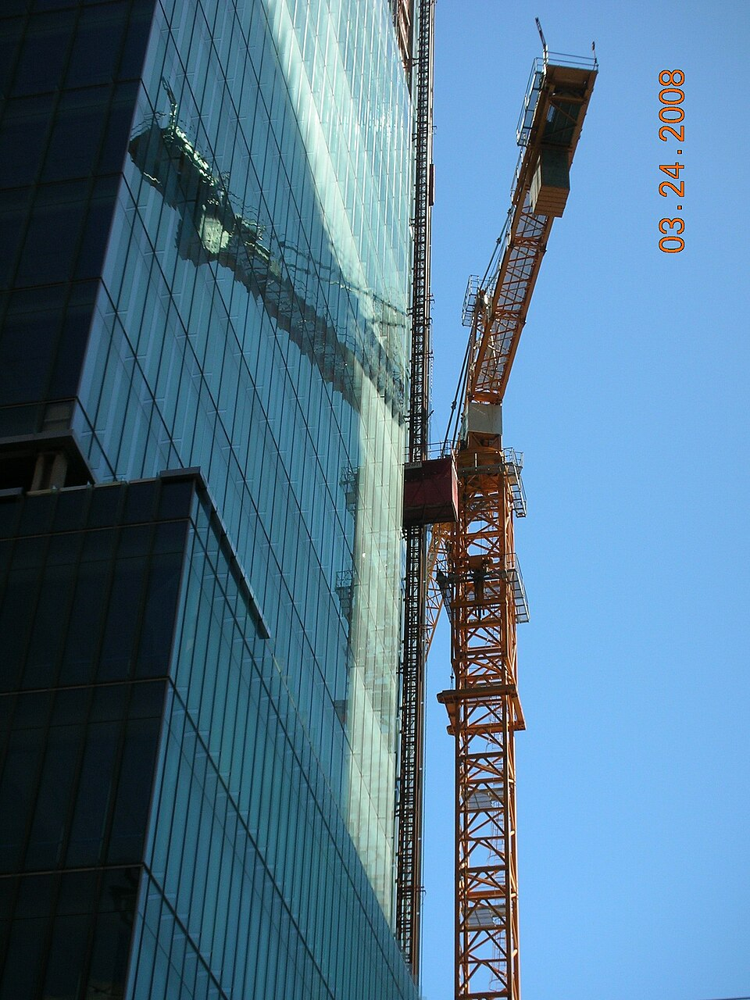
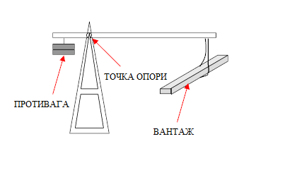

# Crane

> **Node ID**: construction.crane
> **Domain**: [Construction](./index.md)
> **Dependencies**: [`construction.hoist-winch`](./hoist-winch.md), [`metals.iron-steel`](../metals/iron-steel.md)
> **Enables**: [`construction.industrial-buildings`](./industrial-buildings.md), [`metals.casting`](../metals/casting.md)
> **Timeline**: Years 12-25
> **Outputs**: vertical_lifting, horizontal_reaching
> **Critical**: Yes — overhead lifting is required for steel erection, heavy machinery installation, and all construction involving loads exceeding manual carry capacity (>100 kg)

## Overview

> *View of 555 Mission Street's curtainwall glass facade and the tower crane removal process.*

> *Image: Cheers. Trance addict - Armin van Buuren - Oceanlab, Public domain*

> *Схема роботи противаги. Файл створений на основі File:Simple Crane diagram..png*

> *Image: File:Simple Crane diagram..png: Theresa knott
derivative work: В.Галушко, CC BY-SA 4.0*

A crane combines a vertical mast, a horizontal or angled boom (jib), and a hoisting mechanism to lift and place heavy loads at distances beyond human reach. The boom acts as a lever: the load moment (load × radius from mast) is balanced by the crane structure and counterweight. A derrick crane uses guy ropes to stabilize the mast, while a jib crane uses a fixed or pivoting horizontal beam.

Two fundamental constraints govern crane design: **tipping moment** (the load × radius must not exceed the stabilizing moment from counterweight and structure weight) and **structural capacity** (each member must carry its share of the load in compression or tension without buckling or yielding). A 5-tonne crane lifting at 6 m radius generates a 300 kN·m tipping moment — the mast, boom, guys, and anchorage must resist this without excessive deflection.

Position in the dependency chain: the crane depends on [Hoist & Winch](./hoist-winch.md) for the lifting mechanism and on [Iron & Steel](../metals/iron-steel.md) for structural members. It enables [Industrial Buildings](./industrial-buildings.md) (steel erection, machinery installation) and [Metal Casting](../metals/casting.md) (lifting molds, pouring ladles). Without a crane, all heavy lifting relies on manual block-and-tackle and ramp systems — limited to loads under 200 kg on site.

## Prerequisites

- [Hoist and winch](./hoist-winch.md) — for the lifting mechanism (rope drum, ratchet, block and tackle)
- [Rope](../textiles/rope-making.md) — for hoisting lines and guy ropes (16-32 mm diameter, breaking strength ≥50 kN)
- [Steel fabrication](../metals/iron-steel.md) — cutting, welding, and bolting of structural members
- [Structural engineering](./structural-engineering.md) — load calculations for boom, mast, and guys

## Bill of Materials

### Guyed Derrick Crane (5-tonne capacity)

| Material | Quantity | Specifications | Source | Alternatives |
|----------|----------|----------------|--------|-------------|
| Steel tube or built-up section (mast) | 200-400 kg | 150-200 mm diameter tube, or 4 × angle iron laced, 6-12 m length | [Iron & Steel](../metals/iron-steel.md) | Timber mast (hardwood, 200-300 mm square, heavier) |
| Steel tube or I-beam (boom) | 150-300 kg | 100-150 mm diameter tube or IPE 200-300, 6-10 m length | [Iron & Steel](../metals/iron-steel.md) | Timber boom (limited to ≈3 tonne capacity) |
| Guy ropes | 4-6 | 20-32 mm wire rope or manila, 15-30 m each | [Rope Making](../textiles/rope-making.md) | Steel rod tie-backs (less adjustable) |
| Winch (hoisting) | 1 | 20-30 kN capacity, per [Hoist & Winch](./hoist-winch.md) | [Hoist](./hoist-winch.md) | Multiple hand-spliced tackles (slower) |
| Block and tackle | 1 set | 4-6 fall, 30-50 kN capacity | [Hoist](./hoist-winch.md) | Direct rope to winch (no mechanical advantage) |
| Turnbuckles | 4-6 | M20-M30, for guy rope tensioning | [Fasteners](../metals/steelmaking.md) | Spanish windlass (timber lever twist — less precise) |
| Base plate and anchors | 1 set | 20-30 mm steel plate, 4-8 anchor bolts M24-M30 | [Iron & Steel](../metals/iron-steel.md) | Timber crib base (limited to ≈3 tonne) |
| Boom foot pin | 1 | 30-40 mm steel rod, forged eye at each end | [Forging](../metals/forming.md) | Bolted flange (heavier, less articulation) |
| Hook | 1 | Forged steel, swivel type, rated ≥50 kN | [Forging](../metals/forming.md) | Rope sling through load (slower, less secure) |

### Pillar-Mounted Jib Crane (1-tonne capacity)

| Material | Quantity | Specifications | Source | Alternatives |
|----------|----------|----------------|--------|-------------|
| Steel tube (pillar/post) | 80-150 kg | 150-200 mm diameter, 3-5 m tall, 10 mm wall | [Iron & Steel](../metals/iron-steel.md) | Built-up section from angle iron |
| Steel I-beam (jib) | 50-100 kg | IPE 180-250, 3-5 m long | [Iron & Steel](../metals/iron-steel.md) | Timber beam (limited to ≈500 kg) |
| Thrust bearing | 1 | Spherical roller or plain bearing, rated for jib + load moment | [Bearings](../machine-tools/bearings-abrasives.md) | Greased bronze plate (higher friction) |
| Trolley (for jib) | 1 | Steel frame with 4 rollers, for horizontal load travel along jib | [Iron & Steel](../metals/iron-steel.md) | Fixed hoist point (no horizontal travel) |
| Winch or chain hoist | 1 | 10-15 kN capacity | [Hoist](./hoist-winch.md) | Hand-spliced tackle |
| Base plate | 1 | 25-30 mm steel plate, 400-500 mm square, with anchor bolts | [Iron & Steel](../metals/iron-steel.md) | Embedded in concrete foundation |

## Process Description

### Guyed Derrick Crane

1. **Fabricate the mast**: Cut steel tube (150-200 mm diameter, 8-10 mm wall) to the required length (6-12 m). Weld a base plate (300 × 300 mm, 20 mm thick) to the bottom, drilled for 4 anchor bolts (M24). Weld a top cap plate (200 × 200 mm, 15 mm) to the top with a central lifting eye (30 mm diameter hole in a 15 mm plate ear). If using a built-up mast from angle iron: fabricate four corner angles (70 × 70 × 7 mm) connected by lattice bracing (40 × 40 × 4 mm) at 500 mm intervals, all welded or riveted.

2. **Fabricate the boom**: Cut the boom member (100-150 mm steel tube or IPE 200-300, 6-10 m long). Weld a foot pin connection at the base end: two forged lugs (15 mm plate, 100 mm wide, with 35 mm holes) spaced 50 mm apart, positioned so the boom pivots in the vertical plane at the mast base. Weld a sheave bracket at the tip: two plates with a pin hole for the hoisting sheave (100-150 mm diameter pulley).

3. **Install hoisting sheave**: Mount a sheave pulley (turned cast iron or steel, 100-150 mm diameter, with groove matching the hoisting rope) on a pin through the boom tip bracket. The sheave must rotate freely — verify with hand spin, 3+ revolutions from a flick. Grease the pin before assembly.

4. **Prepare the base**: Cast a concrete pad footing (1.5 × 1.5 m, 0.6-1.0 m deep) at the crane location. Embed 4 anchor bolts (M24, 500 mm embedment with hook) in a pattern matching the mast base plate. Allow concrete to cure 7 days minimum before erecting the crane.

5. **Erect the mast**: Bolt the mast base plate to the anchor bolts with leveling nuts. Plumb the mast using a spirit level or plumb bob on two faces: deviation ≤15 mm per 6 m height. Attach guy rope attachment points (shackles or eye bolts) at 2/3 to 3/4 of the mast height, equally spaced around the mast circumference (4-6 attachment points).

6. **Attach guy ropes**: Connect pre-measured guy ropes (20-32 mm wire rope or manila) from the mast attachment points to anchorage points on the ground. Guy rope anchors: driven steel stakes (50 mm angle, 1.5-2.0 m driven depth), buried deadmen (timber or concrete blocks in excavated pits with cable loop), or existing structures. Guy anchor distance from mast base: 1.0-1.5× the guy attachment height. Install turnbuckles in each guy for tension adjustment.

7. **Attach the boom**: Pin the boom foot to lugs welded at the mast base. The boom pivots vertically on this pin. Attach a topping lift (rope from mast top to boom tip at 2/3-3/4 of boom length) to support the boom angle. The topping lift controls boom angle (radius) and is adjusted by a second winch or by reeving through a block at the mast top.

8. **Reeve the hoisting system**: Thread the hoisting rope from the winch, up through a sheave at the mast top (or a block attached near the mast top), down to the boom tip sheave, and down to the hook block. For a 4-fall tackle: add a multi-sheave hook block at the load end. Secure the dead end of the rope at the boom tip or mast top, depending on the reeving pattern.

9. **Tension guy ropes**: Tighten all guy ropes using turnbuckles. Check mast plumb after tensioning each pair of opposing guys. Final plumb: ≤10 mm deviation at the top. Guy rope tension: taut enough that the guy does not sag more than 100 mm at mid-span under no load, but not so tight as to pre-compress the mast excessively.

10. **Verify derrick operation**: Before first lift, hoist a test load of 25% of rated capacity (1,250 kg for a 5-tonne derrick) to 1 m height and hold for 5 minutes. Check all guy ropes for movement, mast plumb deviation, and anchor point settlement. Measure boom tip deflection: ≤L/200 of boom length. If all checks pass, proceed to the 125% load test described in Quality Control.

**Strengths**:
- High lifting capacity (3-5 tonnes) at a fraction of the weight of a rigid-frame crane
- Can be erected with basic fabrication tools — no precision machining required beyond the boom foot pin
- Adjustable guy rope angles allow setup on uneven ground
- Boom can be swung manually through a wide arc for flexible load placement

**Weaknesses**:
- Large footprint — guy ropes extend 1.0-1.5× mast height from the base, requiring clear space around the crane
- Not portable — setup and teardown require 4-8 hours with a crew of 4-6
- Wind-sensitive — guy ropes transmit wind-induced oscillation to the mast; operations must cease above 40 km/h sustained wind
- Manual slewing provides no precise positioning; load swing is difficult to control

### Pillar-Mounted Jib Crane

10. **Fabricate the pillar**: Cut steel tube (150-200 mm diameter, 8-10 mm wall) to the required height (3-5 m). Weld a base plate (25 mm thick, 400 × 400 mm) to the bottom with 6-8 anchor bolt holes (M24). Weld a thrust bearing seat at the top: a flat ring (20 mm thick, matching the bearing outer diameter) centered and leveled within 0.5 mm.

11. **Assemble the slewing mechanism**: Mount the thrust bearing on the pillar top seat. Fabricate a slewing ring (steel plate ring, 300-400 mm diameter, 20 mm thick) that sits on the thrust bearing and rotates. Weld a sleeve (matching the inner bearing race) to the slewing ring center. The jib mounts to this ring. For manual slewing, the operator pushes the load on the trolley — no powered rotation needed for 1-tonne capacity.

12. **Mount the jib**: Weld or bolt the jib beam (IPE 180-250, 3-5 m long) to the slewing ring, centered on the pillar axis. Install a diagonal strut (steel angle or tube) from the jib tip back to the pillar top to support the jib against downward deflection. The strut takes the tension load from the jib overhang. Jib tip deflection under rated load: ≤L/200 (where L = jib length).

13. **Install the trolley**: Fabricate a trolley frame (steel plate and angle) with four rollers (steel or cast iron, 50-80 mm diameter) that ride on the bottom flange of the jib I-beam. The trolley moves along the jib to position the load horizontally. Attach the hoisting mechanism (winch or chain hoist) to the trolley. Provide a pull chain or rope for the operator to move the trolley along the jib from the ground.

14. **Anchor the pillar**: Cast a reinforced concrete foundation (1.0 × 1.0 m, 0.8-1.2 m deep) at the crane location. Embed anchor bolts matching the pillar base plate. Grout under the base plate after plumbing the pillar to ensure full bearing. Pillar plumb: ≤5 mm per 3 m height.

15. **Verify jib crane operation**: Before first lift, hoist a test load of 50% of rated capacity (500 kg for a 1-tonne jib). Rotate the jib 360° with the load suspended. Check slewing friction, trolley travel smoothness, and jib tip deflection (≤L/200). If satisfactory, proceed to the 125% load test described in Quality Control.

**Strengths**:
- Small footprint — requires only a 1.0 × 1.0 m foundation; no guy ropes needed
- 360° slewing allows load placement anywhere within the jib radius
- Fast setup — 2-4 hours with 2 workers once the foundation is cured
- Permanent installation suitable for workshops and warehouses — no teardown required

**Weaknesses**:
- Limited to 0.5-1.0 tonne capacity — cannot handle structural steel or heavy machinery
- Fixed location — the pillar is bolted to a concrete foundation and cannot be moved
- Jib reach limited to 3-5 m — inadequate for large construction sites
- Trolley and hoist are manual; no powered horizontal travel

15. **Pre-lift inspection**: Verify load weight does not exceed crane capacity at the planned working radius. Check all guy ropes and turnbuckles for damage — replace any rope with >10% broken wires. Inspect anchor points for movement or soil softening (after rain). Verify mast plumb within 10 mm per 6 m height. Check hoisting rope for wear, kinks, or bird-caging. Test the ratchet and pawl on the winch — it must hold the full load without slipping.

16. **Rig the load**: Attach the hook to the load using appropriate slings (wire rope, chain, or synthetic). Ensure the sling angle is ≥60° from horizontal — flatter angles multiply the sling tension. Attach two tag lines (light rope, 10-15 m) to opposite sides of the load for controlling swing.

17. **Lift and place**: Hoist the load slowly. Guide the load with tag lines from outside the fall zone. Never stand or walk under a suspended load. Position the load over the placement point and lower gently. Ensure ground crew are clear before releasing the sling.

## Quantitative Parameters

### Guyed Derrick Crane

| Parameter | Value |
|-----------|-------|
| Lifting capacity | 3-5 tonnes at rated radius |
| Boom length | 6-10 m |
| Working radius | 3-12 m (boom angle dependent) |
| Maximum lifting height | Mast height + 1-3 m (boom angle dependent) |
| Hoisting speed (hand winch, 4-fall tackle) | 1-3 m/min |
| Slewing | Manual (pull on load or tag line) |
| Setup time | 4-8 hours (4-6 workers) |
| Mast weight | 200-400 kg |
| Total assembled weight | 500-1000 kg (excluding guys and anchors) |
| Guy rope breaking strength | ≥50 kN (each) |

### Pillar-Mounted Jib Crane

| Parameter | Value |
|-----------|-------|
| Lifting capacity | 0.5-1.0 tonne |
| Jib reach | 3-5 m from pillar center |
| Slewing angle | 360° (full rotation) |
| Hoisting speed (hand winch, 2-fall tackle) | 2-4 m/min |
| Trolley travel | Manual pull chain |
| Jib tip deflection at rated load | ≤L/200 |
| Foundation | 1.0 × 1.0 m × 0.8-1.2 m deep concrete |
| Total weight (crane only) | 200-400 kg |

### Capacity vs. Radius Trade-off

| Crane Type | Rated Capacity | Maximum Radius | Capacity at Max Radius |
|------------|:--------------:|:--------------:|:----------------------:|
| Pillar jib (1 tonne) | 1,000 kg | 5 m | 1,000 kg (full capacity at all radii) |
| Guyed derrick (5 tonne) | 5,000 kg | 12 m | 2,000 kg (capacity drops with radius) |
| Guyed derrick (5 tonne) | 5,000 kg | 6 m | 5,000 kg (rated at minimum radius) |

The load moment (load × radius) must not exceed the crane's rated moment. For the 5-tonne derrick rated at 300 kN·m: at 12 m radius, maximum load = 300/12 = 25 kN = 2,500 kg. At 6 m radius, maximum load = 300/6 = 50 kN = 5,000 kg. Always calculate the actual capacity for the working radius before lifting.

## Scaling Notes

- **0.5-1 tonne jib crane**: Workshop-scale. Handles machinery components, electric motors, gearboxes, and steel stock. Serves a single workstation. Minimum economic scale for any machine shop doing assembly work.
- **3-5 tonne derrick**: Construction-site scale. Erects steel framing, lifts precast concrete elements, installs heavy equipment (boilers, generators). Requires 4-6 workers for setup (4-8 hours).
- **10-20 tonne derrick**: Heavy industrial. Lifts large pressure vessels, bridge beams, and building columns. Requires proportionally heavier mast and boom sections — a 20-tonne derrick mast weighs 800-1500 kg and requires a 15-25 tonne concrete foundation.
- **50+ tonne**: Requires purpose-built structural steel (built-up box sections, trussed booms). Beyond village-scale construction — represents a significant industrial investment.

## Troubleshooting

| Problem | Probable Cause | Solution |
|---------|---------------|----------|
| Mast leaning under load | Guy ropes unevenly tensioned, anchor pulling out | Stop lifting; re-tension guys in pairs (opposing guys equal); check anchor movement |
| Boom bouncing under load | Topping lift too loose, boom undersized | Tighten topping lift; reduce load; stiffen boom with cover plates or reduce radius |
| Load swings excessively | No tag line control, sudden starts/stops | Attach two tag lines (opposing sides) and guide load smoothly; start and stop hoisting gradually |
| Jib crane difficult to slew | Thrust bearing dry, misaligned, or overloaded | Clean and grease bearing; check pillar plumb; reduce load to rated capacity |
| Trolley sticks on jib | Debris on jib flange, rollers misaligned, flange bent | Clean jib track; realign rollers; straighten bent flange with hammer and block |
| Rope jumps off sheave | Sheave groove worn, rope slack, side-pulling | Replace worn sheave; maintain rope tension during operation; never pull sideways on the boom tip |
| Anchor bolts loose in concrete | Foundation too small, cyclic loading has cracked concrete, bolts too short | Torque bolts to specification; if concrete is cracked, pour a larger foundation with deeper embedment (minimum 500 mm for M24 bolts) |
| Boom sagging under load | Boom undersized or damaged | Reduce load; inspect boom for dents or buckling; add cover plates to reinforce |
| Topping lift rope stretching | Rope fiber creep under sustained tension, incorrect rope type | Use wire rope instead of fiber for topping lift; re-tension after first week of use; replace if stretch exceeds 5% of original length |
| Base plate cracking (jib crane) | Foundation settling unevenly, repeated overloading, weld defect | Grout under base plate to restore full bearing; reduce loads to rated capacity; inspect welds with dye penetrant |

## Safety

- **Load drop**: The primary hazard. Never stand or walk under a suspended load. Use tag lines to control swing from outside the fall zone. A 1-tonne load falling 5 m delivers 50 kJ — lethal.
- **Tipping (derrick)**: If the load moment exceeds the guy rope stabilizing moment, the mast topples toward the load. Never exceed rated capacity at maximum radius. Use a load moment indicator (spring scale on the topping lift) if available.
- **Guy rope failure**: A broken guy rope releases the mast, which falls in the direction of the failed guy. Inspect all guy ropes before each use. Replace any rope with visible damage. Keep guy rope paths clear — workers tripping over guys can dislodge turnbuckles.
- **Structural failure**: Overloading the boom or jib causes buckling (compression) or yielding (tension). A collapsing boom drops the load and whips the hoisting rope, endangering anyone within the boom's arc. Never exceed rated load.
- **Crane collision**: A swinging derrick boom can strike workers or structures. Establish an exclusion zone (boom length + 3 m radius) around the crane during operation. Only the operator and signal person should be inside this zone.
- **Wind**: Cease crane operations when sustained wind exceeds 40 km/h (Beaufort 6). Wind load on the boom and load adds unpredictably to the tipping moment. A 5-tonne derrick with a 10 m boom in 60 km/h wind experiences an additional 2-4 kN·m of overturning moment on the boom alone.
- **Electrical contact**: Before erecting a crane, survey the site for overhead power lines. Maintain a minimum clearance of 3 m between any crane component (including load and hoist rope) and energized power lines up to 50 kV. Add 1 m clearance per additional 50 kV above that.
- **Two-blocking**: When the hook block is hoisted into the boom tip sheave, the rope breaks and the load drops. Install a mechanical stop or anti-two-block device that prevents hoisting beyond the safe limit. Mark the hoist rope with a painted warning band 1 m below the maximum safe hoist height.

## Quality Control

- **Pre-lift inspection checklist**: Before each lift, verify: (1) load weight does not exceed crane capacity at the planned working radius, (2) all guy ropes and turnbuckles are undamaged, (3) anchor points show no movement or soil softening, (4) mast plumb is within 10 mm per 6 m height, (5) hoisting rope shows no wear, kinks, or bird-caging, (6) winch ratchet and pawl hold full load without slipping, (7) all personnel are outside the exclusion zone.
- **Load test**: For both crane types, lift 125% of rated load (6.25 tonnes for a 5-tonne derrick, 1.25 tonnes for a 1-tonne jib). Hold suspended for 5 minutes. Inspect all connections, guy ropes, welds, and anchorages for signs of distress (elongation, crackling sounds, visible deformation). Lower the load. Zero permanent deformation acceptable.
- **Boom deflection measurement**: Under rated load, measure boom tip deflection with a tape or level. Maximum: L/200 of boom length. For a 10 m boom: ≤50 mm deflection.
- **Jib crane slewing friction**: Push the unloaded jib to rotate. Starting force: ≤50 N at 2 m from the pillar. Higher force indicates thrust bearing problems or misalignment.
- **Wire rope inspection**: Discard wire rope when: >6 broken wires in any one rope lay (one complete spiral), >3 broken wires in one strand within one lay, diameter reduction >5% from new, or visible kinks, bird-caging, or core protrusion. See [Rope Making](../textiles/rope-making.md) for fiber rope discard criteria.
- **Annual guy rope replacement**: Even if no damage is visible, replace fiber guy ropes annually (UV and weather degradation reduce strength 15-25% per year). Wire rope guys should be replaced every 3-5 years or immediately if corrosion pitting is visible on individual wires.

## Variations and Alternatives

- **Gin pole**: The simplest crane — a single pole held vertical by guy ropes, with a block and tackle at the top. Lifts loads straight up; the load is then swung manually to position. Limited to ≈1 tonne and minimal radius, but requires almost no fabrication. A useful stepping stone before building a full derrick. See [Rope Making](../textiles/rope-making.md) for the required rigging lines.
- **A-frame derrick**: Two legs forming an inverted V, with a crossbar at the top for the hoisting block. Self-supporting without guy ropes if the legs are spread wide enough. Used for vertical lifts in confined spaces where guy ropes are impractical.
- **Guyed derrick vs. stiff-leg derrick**: A stiff-leg derrick replaces the guy ropes with two rigid inclined struts (legs) that resist the boom's overturning moment. Less area required (no guy rope footprint) but more complex to build and less adjustable.
- **Pillar jib vs. wall-mounted jib**: A wall-mounted jib bolts to a building column or wall, eliminating the pillar and foundation. Limited to locations with sufficiently strong existing structure.
- **Overhead traveling crane**: Runs on elevated runway beams along the building length. Highest capacity and most versatile crane type, but requires the building to be designed with crane runways from the outset (see [Industrial Buildings](./industrial-buildings.md)).
- **Mobile crane (truck-mounted)**: Not a construction-site build — requires truck chassis, hydraulic cylinders, telescoping boom sections, and outriggers.

## References

- [Hoist & Winch](./hoist-winch.md) — the lifting mechanism used by all crane types
- [Industrial Buildings](./industrial-buildings.md) — crane runway design and factory crane requirements
- [Building Materials](./building-materials.md) — structural timber for temporary crane mats and dunnage
- [Rope Making](../textiles/rope-making.md) — rope for hoisting lines and guy ropes
- [Structural Engineering](./structural-engineering.md) — beam and column design for crane structures
- [Iron & Steel](../metals/iron-steel.md) — structural steel for mast, boom, and jib
- [Concrete Mixer](./concrete-mixer.md) — concrete for crane foundations

---

*Part of the [Bootciv Tech Tree](../index.md) • [Construction](./index.md) • [All Domains](../index.md)*
