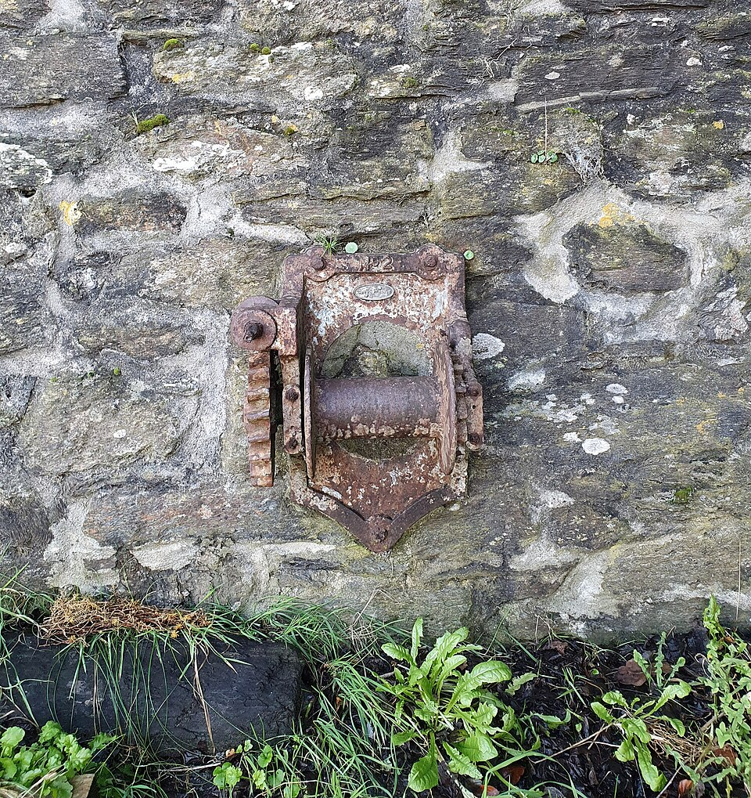

# Hoist & Winch

> **Node ID**: construction.hoist-winch
> **Domain**: [Construction](./index.md)
> **Dependencies**: [`metals.iron-steel`](../metals/iron-steel.md), [`textiles.rope-making`](../textiles/rope-making.md)
> **Enables**: [`construction.crane`](./crane.md), [`construction.industrial-buildings`](./industrial-buildings.md), [`mining`](../mining/index.md)
> **Timeline**: Years 8-20
> **Outputs**: lifting_force, hauling_force
> **Critical**: Yes — mechanical lifting and pulling are fundamental to all construction, mining, and industrial operations above hand-carry capacity

## Overview

> *Image: Jowaninpensans, CC BY-SA 4.0*

A winch converts rotational force (from a hand crank or motor) into linear pulling force by winding rope or cable around a drum. The mechanical advantage comes from the leverage ratio between the crank arm and the drum radius. A crank arm of 300 mm turning a drum of 100 mm radius gives a 3:1 force advantage — a 100 N push on the crank produces 300 N of pull on the rope. Combined with a ratchet and pawl mechanism, the winch holds loads in any position without continuous operator effort.

A hoist adds a pulley system (block and tackle) to the winch for vertical lifting. A single fixed pulley changes direction without adding force. A block and tackle with N rope segments between pulleys multiplies the lifting force N× while dividing the lifting speed by N. A 4-sheave block and tackle (4 rope segments) on a 5 kN winch lifts 20 kN (≈2 tonnes) at one-quarter the rope speed.

Position in the dependency chain: the winch depends on [Iron & Steel](../metals/iron-steel.md) for the drum, frame, and ratchet, and on [Rope Making](../textiles/rope-making.md) for the hoisting line. It enables [Cranes](./crane.md) (lifting mechanism), [Industrial Buildings](./industrial-buildings.md) (material hoisting for multi-story construction), and [Mining](../mining/index.md) (ore bucket hoisting in vertical shafts). Without a winch, all heavy lifting relies on block and tackle with human pull — limited to what a team can haul by hand.

## Prerequisites

- [Iron & Steel](../metals/iron-steel.md) — steel bar for drum, steel plate for frame, forged steel for ratchet
- [Rope Making](../textiles/rope-making.md) — manila, hemp, or wire rope for hoisting lines
- [Machining](../machine-tools/machining.md) — lathe for turning drum, boring bearing holes
- [Forging](../metals/forming.md) — ratchet wheel, pawl, crank handle, hooks
- [Bearings](../machine-tools/bearings-abrasives.md) — journal or pillow block bearings for shaft

## Bill of Materials

### Hand-Cranked Winch (5 kN rated)

| Material | Quantity | Specifications | Source | Alternatives |
|----------|----------|----------------|--------|-------------|
| Steel bar (drum) | 10-15 kg | 100-150 mm diameter solid or thick-walled tube, 200-300 mm long | [Iron & Steel](../metals/iron-steel.md) | Hardwood drum on iron shaft (lower capacity, ≈2 kN) |
| Steel shaft | 5-8 kg | 30-40 mm diameter, 500-600 mm long, turned | [Iron & Steel](../metals/iron-steel.md) | Forged square shaft (needs bored drum) |
| Steel plate (frame) | 15-25 kg | 6-10 mm thick, for side plates and base | [Iron & Steel](../metals/iron-steel.md) | Timber frame with iron straps |
| Ratchet and pawl | 1 set | Forged steel, ratchet teeth 8-12 mm pitch | [Forging](../metals/forming.md) | Worm gear (self-locking, higher friction) |
| Crank handle | 1 | Forged steel, 250-350 mm arm, with grip | [Forging](../metals/forming.md) | Timber handle with iron ferrule |
| Bearings | 4 | Plain journal bearings, 30-40 mm bore, bronze or oil-impregnated iron | [Bearings](../machine-tools/bearings-abrasives.md) | Hardwood bearings with heavy grease |
| Rope | 20-50 m | Manila or hemp, 16-25 mm diameter, breaking strength ≥25 kN | [Rope Making](../textiles/rope-making.md) | Wire rope (requires specialized splicing) |
| Bolts and nuts | 2-4 kg | M12-M16, grade 8.8 | [Fasteners](../metals/steelmaking.md) | Riveted joints |

### Block and Tackle (for hoisting, adds to winch)

| Material | Quantity | Specifications | Source | Alternatives |
|----------|----------|----------------|--------|-------------|
| Sheave pulleys | 2-4 | 100-150 mm diameter, turned from hardwood or cast iron, with groove for rope | [Machine Tools](../machine-tools/index.md) | None — pulleys are essential for mechanical advantage |
| Pulley pins | 2-4 | 15-20 mm steel rod, 100-150 mm long | [Iron & Steel](../metals/iron-steel.md) | Hardwood dowels (weaker) |
| Pulley blocks | 2 | Steel or hardwood housings for pulleys | [Iron & Steel](../metals/iron-steel.md) | Timber blocks with iron straps |
| Hook or shackle | 1-2 | Forged steel, rated ≥2× working load | [Forging](../metals/forming.md) | Rope sling (slower to attach) |

## Process Description

### Winch Drum

1. **Turn the drum**: Mount a solid steel bar (100-150 mm diameter) in the lathe. Turn the outer surface to a consistent diameter (±0.5 mm over the full length). Cut a rope groove: turn a shallow channel (2-3 mm deep, matching the rope diameter) in a spiral pattern along the drum length. This guides the rope to wind evenly and prevents overlapping. If a spiral groove is impractical, turn the drum with a slight barrel shape (1-2 mm larger at center than at ends) to encourage center-first winding.

2. **Bore the drum**: Drill or bore the drum through its center axis for the shaft. Bore diameter: 0.05-0.10 mm larger than the shaft diameter for a sliding fit. If using a solid bar, drill 30-35 mm through the full 200-300 mm length. Ream to final diameter for smooth bearing surface.

3. **Key the drum to shaft**: Cut a keyway (5 × 5 mm for a 30 mm shaft) in the drum bore and on the shaft. Fabricate a steel key (5 × 5 × 40 mm) for a press fit. The key prevents the drum from rotating independently of the shaft under load.

### Frame and Bearings

4. **Cut frame side plates**: Cut two side plates from 8-10 mm steel plate, each approximately 200 × 400 mm. Mark and drill bearing bores (30-40 mm) at the drum shaft location and the crank shaft location (if separate). Bearing bore tolerance: ±0.1 mm for journal bearings. Drill mounting holes for the ratchet mechanism and base plate.

5. **Install bearings**: Press journal bearings (bronze bushings) into the side plate bores. Bearing outer diameter: interference fit (0.02-0.05 mm larger than the bore). If pillow block bearings are used, bolt them to the side plates with the bearing centers aligned to ±0.5 mm.

6. **Assemble drum in frame**: Insert the shaft through one side plate bearing, through the drum, and into the opposite bearing. Verify the drum rotates freely with no binding. End play (axial movement): 0.5-1.0 mm. If the drum binds, shim the bearings or ream the bores.

### Ratchet and Pawl

7. **Fabricate ratchet wheel**: Forge or machine a ratchet wheel from 8-12 mm steel plate. Diameter: 120-180 mm. Number of teeth: 16-24 (more teeth = finer holding increments). Tooth profile: asymmetrical — steep face (≈70° from tangent) bears the load, shallow face (≈30°) allows pawl to engage. Hardness: heat-treat to 40-50 HRC for wear resistance.

8. **Mount ratchet to shaft**: Key the ratchet wheel to the drum shaft (same keyway as the drum, or a separate keyway on the same shaft). The ratchet must be pinned to the shaft so it cannot rotate independently. Secure with a setscrew or nut.

9. **Install pawl**: Pivot the pawl (forged steel, 15-20 mm wide, 80-120 mm long) on a pin bolted to one side plate. Pawl tip profile matches the ratchet tooth steep face. Gravity or a light spring holds the pawl engaged with the ratchet. Verify the pawl seats fully in each tooth with an audible click when the crank is released. The pawl must hold the full rated load without slipping — test with a 5 kN load before putting into service.

10. **Install crank handle**: Mount the crank arm (250-350 mm long forged steel) on the shaft end, on the side opposite the ratchet. Secure with a key and nut. The handle grip: a freely rotating sleeve (25-30 mm diameter tube) over the crank arm end, to prevent palm abrasion during cranking.

### Block and Tackle Assembly

11. **Turn sheave pulleys**: Mount hardwood blanks (or cast iron discs) in the lathe. Turn to 100-150 mm diameter, face flat, then cut a semi-circular groove (matching the rope diameter) around the circumference. Bore the center hole for the pin (15-20 mm diameter). Smooth all edges to prevent rope chafing.

12. **Assemble pulley blocks**: For each block (upper fixed block and lower moving block), house 1-2 sheave pulleys in a steel or hardwood housing. Insert the pins through the pulleys and housing. The pulleys must rotate freely on the pins — verify with hand spin, 5+ revolutions from a firm flick. If using multiple sheaves per block, space them 5-10 mm apart with washers on the pin.

13. **Reeve the tackle**: Thread the rope through the block and tackle. Start at the winch, pass the rope down to the moving block, up to the fixed block, and repeat for the desired number of falls (rope segments between blocks). For a 4-fall tackle: rope → fixed block sheave 1 → moving block sheave 1 → fixed block sheave 2 → moving block sheave 2 → free end (to be wound on the winch). Verify the rope runs freely through all sheaves with no crossing or twisting.

### Hoisting Operation

14. **Rig the load**: Attach the hook or shackle on the moving block to the load using a sling (wire rope, chain, or webbing). Ensure the sling is rated for the load and is not twisted or knotted. The sling angle from horizontal must be ≥60° — flatter angles multiply the tension in the sling legs.

15. **Hoist the load**: Crank the winch to take up rope and lift the load. Crank at a steady pace — do not jerk or rush. The ratchet clicks with each tooth, holding the load if you pause. Monitor the rope winding on the drum: it should coil evenly without overlapping.

16. **Lower the load**: Disengage the pawl (or use a controlled release mechanism) and reverse-crank to lower the load slowly. Never release the pawl without maintaining control of the crank — the load will free-fall. For safety, install a friction brake (band brake) on the drum for controlled lowering.

### Verification and Calibration

17. **Drum runout check**: Mount a dial indicator against the turned drum surface. Rotate the drum through one full turn by hand. Maximum radial runout: ≤1.0 mm. Excessive runout causes uneven rope winding and vibration, which accelerates bearing wear and rope fatigue.

18. **Ratchet holding test**: Mount the winch securely to a fixed anchor. Apply 125% of rated load (6.25 kN for a 5 kN winch) to the rope end using a come-along or weighted lever. Release the crank. The pawl must hold the load without slipping or clicking forward. If the pawl disengages under test load, increase the pawl spring tension, re-cut the ratchet teeth with steeper load faces (≈70° from tangent), and re-test.

19. **Free-running effort test**: With no load on the rope, crank the winch through 20 full revolutions at a steady pace. Measure the average effort at the crank handle grip with a spring scale: ≤30 N. Higher effort indicates binding bearings, a bent shaft, or drum misalignment — disassemble and correct before putting into service.

20. **Block and tackle friction test**: Reeve a 4-fall tackle and apply a known 1,000 kg load. Measure the pull force required at the winch crank to hold the load stationary. Theoretical pull (neglecting friction): 1,000 × 9.81 / (4 × 3) ≈ 820 N (with 3:1 crank advantage). Actual pull should be ≤1,200 N (≤50% friction loss). Higher losses indicate seized sheaves, undersized pins, or grooves that are pinching the rope.

21. **Rope anchorage check**: Verify the dead-end attachment of the rope on the drum. The rope must be secured with a clamp or wedged termination rated for the full rope breaking strength. Apply the rated load and verify zero slippage at the dead end. A rope that pulls free from its anchor drops the load without warning.

## Quantitative Parameters

### Winch Performance

| Parameter | Hand-Cranked Winch | With 4-Fall Tackle |
|-----------|:------------------:|:-------------------:|
| Line pull (rope) | 5 kN (≈500 kg) | 20 kN (≈2,000 kg) lift |
| Line speed (no load) | 15-25 m/min | 4-6 m/min lift speed |
| Drum capacity (16 mm rope) | 40-60 m | 40-60 m (reduced lift height) |
| Crank effort at rated load | 80-120 N | 20-30 N (4× mechanical advantage) |
| Drum diameter | 100-150 mm | — |
| Overall weight | 25-45 kg | +10-15 kg for blocks and rope |
| Rope breaking strength (16 mm manila) | 25-35 kN | Working load: 5 kN per fall |
| Duty cycle | Intermittent — 5 min on, 2 min off | Same |
| Ratchet tooth life | 2-5 years with regular use | — |

### Wire Rope vs. Fiber Rope

| Property | Manila/Hemp Rope | Wire Rope (6×19) |
|----------|:----------------:|:-----------------:|
| Breaking strength (16 mm) | 25-35 kN | 80-120 kN |
| Working load (16 mm, 5:1 safety) | 5-7 kN | 16-24 kN |
| Weight per meter (16 mm) | 0.20-0.25 kg | 0.90-1.10 kg |
| Minimum bending radius | 4× rope diameter | 20× rope diameter |
| UV degradation | Significant (replace yearly) | Negligible |
| Abrasion resistance | Poor | Excellent |
| Inspection for damage | Visual (broken fibers) | Requires gauges (broken wires, diameter reduction) |
| Splicing | Hand-spliced (skilled labor) | Requires swaging or socketing |
| Temperature limit | 80°C (degrades above) | 200°C (grease degrades above) |

Wire rope is preferred for all lifting applications above 1 tonne and for permanent installations. Fiber rope is acceptable for light loads, temporary rigging, and situations where flexibility and ease of handling matter more than strength.

## Scaling Notes

- **5 kN hand winch**: The standard utility winch. Lifts 500 kg directly or 2,000 kg with a 4-fall tackle. Serves construction sites, workshops, and farms. One person operates the crank. Minimum economic scale for any site doing overhead lifting.
- **5 kN winch with 2-fall tackle**: A common intermediate configuration. Lifts 1,000 kg at half the rope speed. The 2-fall tackle is simpler to reeve and inspect than a 4-fall, and the reduced mechanical advantage is acceptable for loads under 1 tonne. Appropriate for [Concrete Mixer](./concrete-mixer.md) bucket hoisting and light steel erection.
- **10-20 kN hand winch**: Larger drum (150-200 mm diameter) and heavier frame. Direct lift capacity 1-2 tonnes. Requires 2 operators on the crank arm or a motor conversion. Used for erecting medium structures and pulling heavy loads. Weight: 50-80 kg.
- **Powered winch (2-5 kW motor)**: Replaces hand cranking for continuous operation. Line speed: 10-30 m/min (no load). Used for mine hoisting, construction material hoists, and ship docking lines. The motor and gearbox add 30-50 kg to the winch weight but eliminate operator fatigue. Requires a reliable power source (see [Energy](../energy/index.md)).
- **Mine hoist (20-100 kW)**: A specialized application — the winch is mounted at the top of a mine shaft and raises/lowers ore buckets or cages. Drum capacity: 100-500 m of wire rope. Line speed: 2-8 m/s. Requires a dedicated braking system (band brake or disc brake) in addition to the ratchet. See [Mining](../mining/index.md).

## Troubleshooting

| Problem | Probable Cause | Solution |
|---------|---------------|----------|
| Rope winds unevenly (overlaps, bunches) | No groove on drum, drum too narrow for rope length | Cut spiral groove in drum; use wider drum; guide rope by hand during first few wraps |
| Ratchet slips under load | Pawl not seating fully, teeth worn, spring weak | Check pawl pivot for binding; file teeth to restore profile; replace pawl spring; re-harden ratchet wheel |
| Excessive crank effort | Bearings dry, shaft bent, drum overloaded | Lubricate bearings; check shaft with straightedge; reduce load to rated capacity |
| Rope slips on drum under load | Insufficient wraps (minimum 4 wraps needed for friction grip), drum surface too smooth | Ensure ≥4 wraps of rope on drum before applying load; score drum surface lightly for friction |
| Pulleys squeak or resist rotation | Pins dry, pulley bore worn oval | Lubricate pin with grease; re-bore pulley and install bushing; replace worn pulleys |
| Load drifts down when crank is held | Ratchet tooth worn on one side, pawl not fully engaging | Inspect ratchet teeth for uneven wear; replace ratchet wheel if teeth are rounded; verify pawl spring tension |
| Rope fraying at drum entry point | Sharp edge on frame slot, rope rubbing on frame | Smooth the frame slot edges with a file; install a roller or fairlead at the rope entry point |
| Drum shaft creeping laterally | Missing or worn retaining collar, excessive end play | Install a retaining collar (setscrew or keyed) on the shaft outside the bearing; limit end play to 0.5-1.0 mm |
| Block and tackle twists during lift | Rope twisted during reeving, pulleys misaligned | Un-reeve and re-thread the tackle, ensuring the rope enters each sheave in the plane of the sheave groove; check pulley alignment with a straightedge |

## Safety

- **Rope failure**: Rope under tension stores energy proportional to the load. A rope breaking under 5 kN of tension snaps back violently. Never stand in the line of a tensioned rope. Inspect the entire rope length before each lifting operation.
- **Load drop**: If the pawl disengages or the rope breaks, the load falls. Never stand or walk under a suspended load. Use tag lines to control loads from a safe distance.
- **Pinch points**: The drum-to-frame gap, the ratchet-to-pawl engagement point, and the sheave-to-block gap are all pinch hazards. Keep hands clear of rotating parts during operation.
- **Winch mounting**: The winch must be anchored to a structure capable of holding 2× the rated load. A 5 kN winch must be bolted to a frame or post that can resist a 10 kN pull without moving. Verify anchorage before every lift.
- **Overloading**: Never exceed the rated working load. A sudden overload can strip the ratchet teeth, shear the key, or burst the rope — all without warning. If the load feels heavier than expected (crank effort suddenly increases), stop and verify the actual load weight before continuing.
- **Controlled lowering**: Never free-spool the drum to lower a load. Always maintain a grip on the crank and lower by reverse-cranking against the ratchet. Free-spooling allows the drum to accelerate uncontrollably — the resulting rope tangles and drum overspeed can destroy the winch and drop the load.

### Rope Inspection Criteria

Discard fiber rope when:
- >10% of fibers broken in any 1 m length
- Diameter reduced by >10% from new
- Stiffness or hardness indicating internal rot or chemical damage
- Cuts, gouges, or melted sections >10% of rope diameter deep

Discard wire rope when:
- >6 broken wires in any one rope lay (one complete spiral)
- >3 broken wires in one strand within one lay
- Diameter reduction >5% from new (indicates core failure)
- Kinks, bird-caging, or core protrusion
- Severe corrosion (pitting visible on individual wires)

## Quality Control

- **Drum runout**: Mount a dial indicator against the drum surface. Rotate the drum by hand. Maximum radial runout: ≤1.0 mm. Excessive runout causes uneven rope winding.
- **Ratchet holding test**: With the winch mounted securely, apply 125% of the rated load (6.25 kN for a 5 kN winch) to the rope. Release the crank. The pawl must hold the load without slipping. If the pawl disengages, increase the pawl spring tension or re-cut the ratchet teeth with steeper load faces.
- **Free-running test**: With no load, crank the winch through 20 full revolutions. Average effort: ≤30 N at the crank handle (measured with a spring scale). Higher effort indicates bearing problems, shaft misalignment, or drum binding.
- **Load test with block and tackle**: Apply 100% of the rated lifting load through the block and tackle. Lift the load 1 m, hold for 5 minutes, lower. Verify: no rope slip on the drum, no bearing overheating (warm is acceptable, hot is not), no frame deflection >2 mm at any point.
- **Sheave inspection**: Check each sheave for groove wear. A worn groove (flat bottom or oversize) allows the rope to flatten and abrade. Replace sheaves when the groove radius exceeds 1.15× the rope radius. Verify each sheave spins freely on its pin — a seized sheave forces the rope to slide, causing rapid wear.

## Variations and Alternatives

- **Hand-cranked vs. worm-gear winch**: Worm-gear winches are self-locking (no ratchet needed) but have lower efficiency (40-60% vs. 80-90% for spur gears). The worm gear is harder to build but provides inherent load-holding safety.
- **Chain fall (chain hoist)**: Uses roller chain instead of rope, with a differential pulley mechanism for very high mechanical advantage (10-40×). Slower but more compact than a winch with block and tackle. Requires precision chain manufacturing.
- **Powered winch**: Replaces the hand crank with an electric motor (0.5-2 kW) and gearbox. Same drum and ratchet mechanism. Motor drives through a friction clutch that slips at 110% of rated load, providing overload protection that hand winches lack.
- **Capstan**: A vertical drum winch where the rope wraps around a rotating vertical cylinder. The operator holds the free end of the rope; friction between the rope and drum does the pulling. No drum storage — the rope feeds through continuously. Useful for pulling long lengths (mooring lines, cable pulling) where storage on a drum is impractical. See [Marine](../marine/index.md) for shipboard capstan applications.

## References

- [Crane](./crane.md) — cranes use winches for hoisting and slewing
- [Building Materials](./building-materials.md) — timber framing construction using hoisting systems
- [Rope Making](../textiles/rope-making.md) — rope specifications, splicing, and strength ratings
- [Iron & Steel](../metals/iron-steel.md) — steel for frame, drum, and ratchet components
- [Mining](../mining/index.md) — mine hoists for vertical shafts using similar winch principles
- [Concrete Mixer](./concrete-mixer.md) — concrete bucket hoisting for multi-story pours
- [Forging](../metals/forming.md) — forged components for ratchet, pawl, crank handle, and hooks

---

*Part of the [Bootciv Tech Tree](../index.md) • [Construction](./index.md) • [All Domains](../index.md)*
