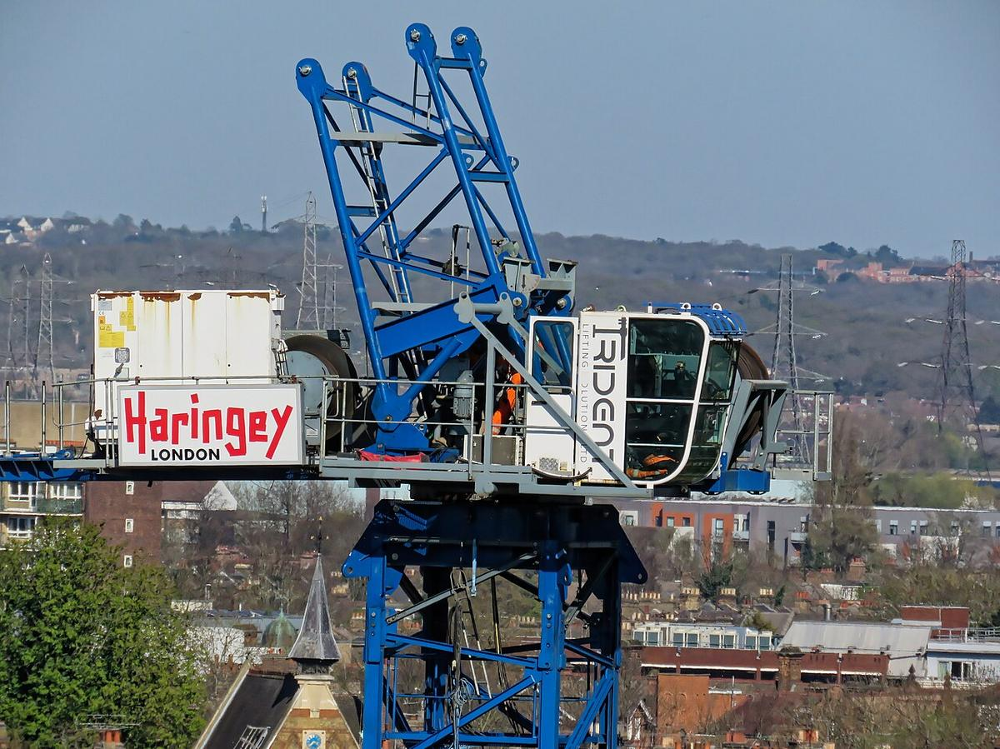

# Construction & Structural Engineering

> *Building construction crane with men at work, at Moira Close, in the Borough of Haringey in London, England, in April 2025.Wikimedia (2025) makes it difficult to immediately view photo groups related to this image. To see its most relevant allied photos, click  on Tottenham, this uploader's Build...*

> *Image: Acabashi, CC BY-SA 4.0*

Capabilities in this domain:

<!-- TODO: source image for Building Materials & Methods -->
- [Building Materials & Methods](building-materials.md) — Timber framing and joinery (mortise-tenon, dovetail, scarf joints), stone and masonry construction, roofing systems, waterproofing, and scaffolding/hoisting systems.
<!-- TODO: source image for Structural Engineering -->
- [Structural Engineering](structural-engineering.md) — Beam theory, column buckling, arch and vault design, truss analysis, reinforced concrete design, steel connections, and foundation engineering with specific load tables and formulas.
<!-- TODO: source image for Industrial Buildings & Heavy Foundations -->
- [Industrial Buildings & Heavy Foundations](industrial-buildings.md) — Steel-frame and reinforced concrete factory buildings, machine tool foundations, vibration isolation, crane runways, and industrial flooring for heavy industry.

> *Image: Huangdan2060, CC BY 3.0*

- [Concrete Mixer](concrete-mixer.md) — Batch and continuous concrete mixing equipment for producing uniform concrete on construction sites.

> *Image: Jowaninpensans, CC BY-SA 4.0*

- [Hoist & Winch](hoist-winch.md) — Lifting equipment: hand-operated and powered hoists, winches, and chain blocks for construction material handling.

> *Image: Kurt Kaiser, CC0*

- [Crane](crane.md) — Construction cranes (derrick, jib, gantry, tower) for heavy lifting and placement on building sites.
[↑ Back to Tech Tree](../index.md)
