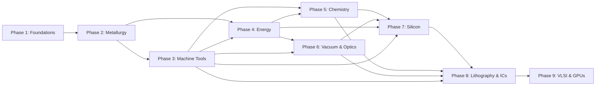

# Core Tech Tree: Phases 1–9

The core tech tree traces the primary dependency chain from stone-age materials to advanced semiconductors. Each phase builds directly on the outputs of prior phases.

## Dependency Overview

## Phase Summaries

### [Phase 1: Foundations — Surplus &amp; Basics](phase-01-foundations.md)
**Timeline**: Years 0–10  
**Goal**: Food security, population growth, basic materials extraction.  
**Key outputs**: Charcoal, stone tools, food surplus, early kilns, pottery.

### [Phase-02: Early Metallurgy](phase-02-metallurgy.md)
**Timeline**: Years 5–15  
**Goal**: Durable tools, casting, early chemistry.  
**Key outputs**: Copper, bronze, wrought iron, steel, anvils, hammers, basic glass.

### [Phase 3: Machine Tools Bootstrap](phase-03-machine-tools.md) ★ CRITICAL
**Timeline**: Years 10–25  
**Goal**: Precision manufacturing capability — the single most important parallel track.  
**Key outputs**: Lathe, shaper, mill, drill press, surface grinder, precision metrology.

### [Phase 4: Energy Revolution](phase-04-energy.md)
**Timeline**: Years 15–30  
**Goal**: Abundant, controllable power.  
**Key outputs**: Coke, steam engines, generators, motors, electric arc furnaces.

### [Phase 5: Chemical Industry Scale-Up](phase-05-chemistry.md)
**Timeline**: Years 20–35  
**Goal**: Bulk reagents, gases, and materials processing.  
**Key outputs**: Sulfuric/nitric/hydrofluoric acids, alkalis, electrolysis products, distillation.

### [Phase 6: Vacuum, Optics &amp; Glass](phase-06-vacuum-optics.md)
**Timeline**: Years 25–40  
**Goal**: Controlled environments and inspection capability.  
**Key outputs**: Vacuum pumps/chambers, glass apparatus, lenses, microscopes.

### [Phase 7: Silicon Production &amp; Basic Devices](phase-07-silicon.md) ★ EARLY WIN
**Timeline**: Years 30–50  
**Goal**: Usable silicon and simple semiconductor devices (solar cells first).  
**Key outputs**: Metallurgical-grade silicon, Czochralski crystals, wafers, solar cells, diodes.

### [Phase 8: Photolithography &amp; Integrated Circuits](phase-08-photolithography.md)
**Timeline**: Years 40–70  
**Goal**: Patterned devices and early ICs.  
**Key outputs**: Cleanrooms, photoresists, masks, lithography tools, planar process, MSI.

### [Phase 9: VLSI, GPUs &amp; Advanced Solar](phase-09-scaling.md)
**Timeline**: Years 70–200+  
**Goal**: Complex, high-performance chips.  
**Key outputs**: VLSI, advanced lithography, high-end solar, GPUs, design automation.

## Key Insights

- **Machine tools (Phase 3) are the master enabler** — every later stage depends on precision parts.
- **Solar cells (Phase 7) are the early practical win** — they provide power feedback that accelerates everything.
- **Photolithography (Phase 8) is where complexity explodes** — this is the steepest part of the curve.
- **High-end GPUs (Phase 9) are the long-term pinnacle** — they require a mature ecosystem + generations of refinement.

[← Back to Index](../index.md)
