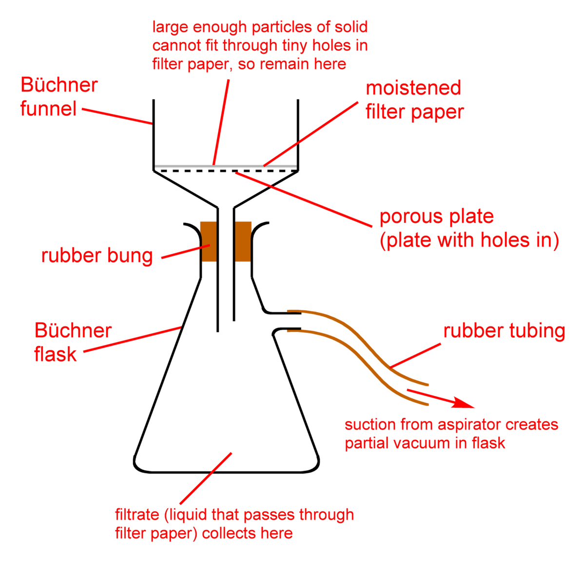

# Dewar Vessel (Cryogenic Storage Container)

> **Node ID**: cryogenics.dewar
> **Domain**: [Cryogenics](./index.md)
> **Dependencies**: [`metals.iron-steel`](../metals/iron-steel.md), [`gas-handling.vacuum`](../gas-handling/vacuum.md), [`ceramics.insulators`](../ceramics/index.md)
> **Enables**: [`cryogenics.liquefaction-storage`](liquefaction-storage.md), [`silicon.crystal-growth`](../silicon/cz-pulling.md)
> **Timeline**: Years 20-30
> **Outputs**: cryogenic_storage_vessels, liquid_gas_containment
> **Critical**: No — compressed gas cylinders can substitute for small-scale storage, but dewars are the only practical method for bulk cryogenic liquid handling

## Principle

A dewar vessel stores cryogenic liquids (liquid nitrogen at -196°C, liquid oxygen at -183°C, liquid argon at -186°C) by minimizing heat transfer from the warm environment to the cold contents. It uses vacuum insulation — a double-walled construction with the annular space evacuated to <10⁻³ mbar. At this pressure, the mean free path of residual gas molecules exceeds the wall spacing, and gas conduction (the dominant heat transfer mode at atmospheric pressure) drops by 100-1000×. The remaining heat leak is primarily by infrared radiation (proportional to T_outer⁴ - T_inner⁴) and by solid conduction through the mechanical supports connecting the inner and outer vessels.

The vacuum insulation principle was discovered by James Dewar in 1892. Radiation heat transfer is reduced by silvering or aluminizing the inner surfaces of the vacuum space (emissivity <0.03). Solid conduction through supports is minimized by using long, thin rods of low-conductivity material (stainless steel or fiberglass-reinforced plastic). The combination achieves evaporation losses of 0.5-3% per day for portable dewars, decreasing with vessel size.

## Prerequisites

- [Stainless steel](../metals/iron-steel.md) — austenitic 304L or 316L for the inner vessel (remains ductile to -270°C)
- [Carbon steel](../metals/iron-steel.md) — for the outer vessel (ambient temperature)
- [Vacuum Technology](../gas-handling/vacuum.md) — mechanical and diffusion/turbomolecular pumps for evacuation
- [Welding](../metals/iron-steel.md) — TIG welding for stainless steel pressure vessel joints
- [Glass or metallizing capability](../glass/index.md) — for reflective coating on vacuum space surfaces

## Materials

| Material | Quantity | Specifications | Source | Alternatives |
|----------|----------|----------------|--------|-------------|
| Stainless steel sheet (inner vessel) | 3-10 kg | 304L or 316L, 1.5-3.0 mm thick, fully austenitic | [Iron & Steel](../metals/iron-steel.md) | 9% nickel steel (large tanks only) |
| Carbon steel or stainless sheet (outer vessel) | 5-15 kg | 1.5-3.0 mm thick | [Iron & Steel](../metals/iron-steel.md) | Stainless (corrosion resistance, higher cost) |
| Fiberglass-reinforced plastic (supports) | 4-8 straps | G-10 or G-11 rod/strap, 5-10 mm × 50-100 mm | [Polymers](../polymers/thermosets.md) | Thin stainless steel rods (higher heat leak) |
| Activated charcoal (getter) | 50-200 g | Coconut-shell grade, 4-8 mesh | [Chemistry](../chemistry/index.md) | Molecular sieve 5A (less capacity for N₂/O₂) |
| Aluminum foil or aluminized Mylar (MLI) | 10-50 layers | 6-12 μm aluminum foil + polyester spacer | [Metals](../metals/aluminum.md) + [Polymers](../polymers/thermoplastics.md) | Silver coating on glass (small dewars) |
| Perlite (insulation, large tanks) | 50-200 L | Expanded, 50-80 kg/m³ bulk density | [Ceramics](../ceramics/index.md) | MLI (higher performance, higher cost) |
| PTFE seals | 2-4 pieces | Sheet or rod, for neck tube seals and valve seats | [Polymers](../polymers/thermoplastics.md) | Neoprene (limited to -40°C) |
| Copper gaskets (if CF flanges used) | 1-2 | OFHC copper, 1.5-2 mm thick ring | [Electrolysis](../chemistry/electrolysis.md) | O-ring (limited temperature range) |

## Construction Steps

### Portable Dewar (25-200 L Capacity)

1. **Fabricate the inner vessel**: Roll and TIG-weld 304L stainless steel sheet into a cylindrical shell with dished or hemispherical heads. Design pressure: 2-10 bar (relief valve setting). All welds must be full-penetration with continuous inert gas backing to prevent sugaring (oxidation) on the inside surface. Typical dimensions for a 100 L dewar: cylinder 400 mm diameter × 800 mm tall, 2 mm wall thickness. Include a neck tube flange at the top for the fill/drain assembly. Leak-test the completed inner vessel with helium at 1.5× design pressure — zero detectable leaks (<10⁻⁶ mbar·L/s).

2. **Polish and clean the inner vessel**: Polish the outer surface of the inner vessel (the vacuum-side surface) to a mirror finish (Ra <0.2 μm). A smooth surface has lower emissivity and outgassing rate. Clean thoroughly with acetone, then alcohol, to remove all oils and residues. Outgassing from contamination in the vacuum space is the primary cause of vacuum degradation.

3. **Apply reflective coating or MLI**: For the highest performance, wrap the inner vessel with 10-60 layers of multi-layer insulation (MLI): alternating layers of 6 μm aluminum foil and polyester netting spacer. Wrap each layer smoothly, overlapping seams by 50-100 mm. No wrinkles or gaps — each defect creates a thermal short circuit that increases local heat leak by 10-100×. Secure layers temporarily with glass-fiber tape. Alternatively, for simpler construction: silver or aluminum coat the outer surface of the inner vessel by vacuum deposition or chemical plating (emissivity <0.03).

4. **Fabricate the outer vessel**: Roll and weld carbon steel or stainless steel sheet into a cylindrical shell with a flat or dished bottom. The outer vessel must be large enough to enclose the inner vessel with 25-50 mm annular gap for vacuum + insulation. Include a vacuum pump-out port with a valve (high-vacuum compatible, e.g., KF-16 or Swagelok VCR fitting). Weld a neck tube collar at the top that aligns with the inner vessel neck tube. Include support pads for the inner vessel supports.

5. **Install inner vessel supports**: Attach fiberglass-reinforced plastic (G-10) straps between the inner and outer vessels. Use 4-8 straps arranged symmetrically (radially) to center the inner vessel within the outer. The straps must support the full weight of the inner vessel plus liquid (a 100 L dewar filled with LIN weighs ~80 kg inner + 80 kg liquid = 160 kg). Straps should be long (100-200 mm) and narrow (5-10 mm wide × 3-5 mm thick) to minimize thermal conductivity. Stainless steel support rods (2-4 mm diameter, 150-300 mm long) are a stronger alternative with higher heat leak.

6. **Insert and align inner vessel**: Lower the inner vessel (with MLI wrapped) into the outer vessel. Align the neck tubes. Weld or braze the inner vessel neck tube to the outer vessel collar, creating the seal between the vacuum space and atmosphere. This weld is critical — any leak here compromises the vacuum.

7. **Install getter material**: Place activated charcoal (50-200 g in a stainless steel mesh basket) in the vacuum space near the bottom of the inner vessel. The charcoal adsorbs residual gas molecules at cryogenic temperature, maintaining vacuum over years. The getter must be in thermal contact with the cold inner vessel to function effectively.

8. **Evacuate the vacuum space**: Connect a vacuum pump to the pump-out port. First, use a mechanical roughing pump to reduce pressure to <10⁻² mbar (12-24 hours for a 100 L dewar). Then switch to a diffusion pump or turbomolecular pump to reach <10⁻⁴ mbar (additional 12-24 hours). Optionally bake the outer vessel at 80-120°C during pumpdown to accelerate outgassing. When the target vacuum is achieved, seal the pump-out valve. Install a vacuum gauge (Pirani or thermocouple) on the pump-out port for periodic monitoring.

9. **Install the neck tube assembly**: Fit the neck tube (thin-walled stainless steel or fiberglass tube, 30-50 mm ID, 150-300 mm long) between the inner vessel top and the fill/drain connections at the outer vessel top. The neck tube is the primary conductive heat path — make it long and narrow. Install a PTFE seal at the inner vessel connection (flexible to accommodate thermal contraction). Attach the fill/drain connection, vent connection, and liquid level gauge at the top of the neck tube.

10. **Install pressure relief devices**: Install a spring-loaded relief valve (set to the inner vessel MAWP, typically 2-10 bar) on the vent connection. Install a burst disc (set to 1.5× MAWP) as a secondary relief device in parallel. Both devices must be sized to handle the maximum possible evaporation rate (calculated for vacuum-loss scenario: heat leak increases 100-1000×, causing rapid pressure rise).

## Calibration and Verification

1. **Vacuum integrity test**: After evacuation, seal the pump-out valve and monitor the vacuum gauge for 48 hours. Pressure should remain stable at <10⁻⁴ mbar with no upward drift. Rising pressure indicates a leak — locate with helium leak detector and repair.
2. **Evaporation rate test**: Fill the dewar with liquid nitrogen. Weigh the dewar (or measure liquid level) at t=0, t=24h, and t=48h. Calculate the evaporation rate as % of full capacity per day. Target: <2%/day for a 100 L portable dewar, <1%/day for 500+ L stationary dewars.
3. **Pressure relief test**: With the dewar pressurized to the relief valve setpoint (using GN₂ or by restricting the vent), verify the relief valve opens at the correct pressure (within ±10% of setpoint). Verify the burst disc has not been damaged (visual inspection; do not test by bursting — discs are single-use).
4. **Thermal performance under fill**: After cool-down and fill, measure the outer vessel surface temperature. The outer vessel should remain at ambient temperature (within 5°C). Cold spots indicate thermal short circuits in the vacuum space or support system.

## Expected Performance

| Parameter | Value |
|-----------|-------|
| Capacity (portable) | 25-200 L |
| Capacity (stationary) | 500-500,000 L |
| Design pressure (inner vessel) | 2-10 bar (MAWP) |
| Evaporation loss (25-200 L, vacuum + MLI) | 1-3%/day |
| Evaporation loss (500-5,000 L, vacuum + perlite) | 0.5-1.5%/day |
| Evaporation loss (10,000-100,000 L, perlite fill) | 0.2-0.5%/day |
| Vacuum requirement (MLI insulation) | <10⁻³ mbar |
| Vacuum requirement (perlite insulation) | <10⁻¹ mbar (or nitrogen-purged) |
| Vacuum holding time (with getter) | 5-20 years before re-evacuation needed |
| Heat leak (100 L dewar, MLI) | 3-8 W |
| Cool-down loss (first fill, ambient to -196°C) | 15-30% of capacity |
| Inner vessel material | 304L or 316L stainless steel (ductile to -270°C) |
| Service life (vacuum integrity maintained) | 20-40 years |

## Strengths

- Vacuum insulation reduces heat leak by 100-1000× compared to atmospheric-pressure insulation — the only practical way to store liquids at -196°C for days to weeks
- Evaporation losses decrease with tank size (0.1-0.3%/day for 100,000+ L tanks), making large installations self-consistently efficient
- Activated charcoal getter maintains vacuum passively for years without active pumping

## Weaknesses

- Vacuum integrity is the single point of failure — a leak into the annular space increases heat leak 100-1000×, causing rapid pressure rise and emergency venting
- MLI wrapping is labor-intensive and any wrinkle creates a thermal short circuit — quality depends entirely on installer skill
- Cool-down loss of 15-30% on first fill is unavoidable — each thermal cycle from ambient to cryogenic wastes product proportional to vessel thermal mass

## Safety

- **Oxygen deficiency**: One liter of LIN produces 694 liters of nitrogen gas on evaporation. A 100 L dewar venting into a 3 × 3 × 3 m room (27 m³ = 27,000 L) can reduce oxygen concentration from 21% to <19.5% (the alarm threshold) in minutes. Continuous O₂ monitoring is mandatory in all rooms containing cryogenic liquids. Vent relief valves and boiloff to outdoors above roof level.
- **Cryogenic burns**: Liquid at -196°C freezes tissue on contact. Wear loose-fitting insulated gloves (can be thrown off if liquid splashes inside), full-face shield, closed-toe shoes, long pants (no cuffs), and long sleeves. Treat cryogenic burns as thermal burns — flush with lukewarm (not hot) water.
- **Pressure hazard**: A dewar with a blocked vent will pressurize from heat leak. At the burst disc rating (1.5× MAWP), the disc ruptures. If both relief devices fail, the vessel can rupture explosively. Never plug, cap, or restrict a dewar vent.
- **Material embrittlement**: Carbon steel and ordinary plastics become brittle at cryogenic temperatures and can shatter. Only austenitic stainless steel (304L, 316L), certain aluminum alloys, and PTFE are suitable for cryogenic contact.

## Troubleshooting

| Problem | Probable Cause | Solution |
|---------|---------------|----------|
| Evaporation rate increasing over weeks/months | Vacuum degradation — leak into annular space or getter saturation | Check vacuum gauge reading; if above 10⁻² mbar, re-evacuate through pump-out port; if vacuum cannot be recovered, the dewar has a structural leak requiring weld repair |
| Frost on outer vessel surface | Localized vacuum failure or MLI gap at frost location (thermal short circuit) | Check vacuum gauge; if vacuum is good, the frost indicates a local insulation defect — not field-repairable for MLI dewars; monitor for progression |
| Relief valve weeping continuously | Valve seat worn or ice formation on seat; or vacuum loss causing excessive evaporation | Inspect valve seat; verify valve heater (if equipped) is powered; check vacuum gauge; if vacuum is degraded, re-evacuate to reduce evaporation rate |
| Inner vessel pressure rising above normal operating pressure | Blocked vent line or excessive heat leak from vacuum loss | Check vent line for obstructions (ice plugs, kinked hose); verify vent routes outdoors; check vacuum; if vacuum is lost, emergency venting is expected — do not restrict relief devices |
| Difficulty achieving target vacuum during pump-down | Outgassing from contaminated surfaces or moisture in vacuum space | Bake the outer vessel at 80-120°C during pump-down to accelerate outgassing; verify inner vessel was thoroughly cleaned before assembly; extend pump-down time to 48-72 hours |

## See Also

- [Gas Liquefaction & Storage](liquefaction-storage.md) — liquefaction cycles and bulk storage engineering
- [Refrigeration Fundamentals](refrigeration.md) — thermodynamic cycles for cryogenic temperatures
- [Vacuum Technology](../gas-handling/vacuum.md) — vacuum pumps, gauges, and sealing techniques
- [Gas Handling](../gas-handling/basic.md) — gas cylinders and piping at ambient temperature
- [Stainless Steel](../metals/iron-steel.md) — material properties for cryogenic service

---

## Cryogenic Temperature Reference

The table below gives boiling points, common cooling methods, and typical insulation approaches for cryogenic fluids used in semiconductor and research applications.

| Cryogenic Fluid | Boiling Point (1 atm) | Latent Heat of Vaporization | Primary Cooling Method | Typical Use |
|---|---|---|---|---|
| Liquid helium (⁴He) | 4.2 K (-269°C) | 20.9 kJ/kg | Bath cryostat, closed-cycle cryocooler (Gifford-McMahon or pulse tube) | Superconducting magnets, low-temperature physics, MRI |
| Liquid hydrogen | 20.3 K (-253°C) | 446 kJ/kg | Bath or forced-flow, vacuum-insulated transfer lines | Rocket fuel, neutron moderation, hydrogen research |
| Liquid neon | 27.1 K (-246°C) | 86 kJ/kg | Bath cryostat, vacuum-insulated | Intermediate cryocooling (between He and N₂) |
| Liquid nitrogen | 77.4 K (-196°C) | 199 kJ/kg | Bath, forced-flow, cold vapor recovery | Wafer cooling, vacuum cold traps, food freezing, sample preservation |
| Liquid air (enriched O₂) | ~80 K (-193°C) | ~200 kJ/kg | Bath (rarely used deliberately) | Condensation byproduct on cold surfaces |
| Liquid argon | 87.3 K (-186°C) | 163 kJ/kg | Bath, forced-flow | Detector cooling (neutrino, dark matter), sputtering target cooling |
| Liquid oxygen | 90.2 K (-183°C) | 213 kJ/kg | Bath, forced-flow, vacuum-insulated | Steelmaking, rocket oxidizer, medical oxygen |
| Liquid methane | 111.7 K (-161°C) | 511 kJ/kg | Bath or forced-flow, vacuum-insulated | LNG transport, rocket fuel |
| Dry ice/acetone bath | 195 K (-78°C) | N/A (sublimation) | Cold bath | Laboratory cold traps, chemical synthesis |

## Insulation Performance Comparison

| Insulation Type | Thermal Conductivity (W/m·K) | Heat Flux (W/m²) for 100 L Dewar | Vacuum Required | Complexity | Typical Application |
|---|---|---|---|---|---|
| Bare steel (no insulation) | ~50 | >1,000 | None | None | Not used for cryogenics |
| Expanded perlite fill | 0.01-0.03 | 20-50 | <10⁻¹ mbar (or N₂ purge) | Low | Large stationary tanks (>5,000 L) |
| Foam insulation (PU/PIR) | 0.02-0.04 | 15-40 | None | Low | Non-vacuum cryogenic piping |
| Vacuum only (evacuated annulus) | 0.003-0.008 | 5-15 | <10⁻³ mbar | Medium | Simple dewars, transfer lines |
| Vacuum + aluminized radiation shields (3-5 layers) | 0.001-0.003 | 2-8 | <10⁻³ mbar | Medium | Portable dewars (25-200 L) |
| Vacuum + MLI (10-60 layers) | 0.00005-0.0005 | 0.5-3 | <10⁻⁴ mbar | High | High-performance dewars, space applications |
| Vacuum + MLI + vapor-cooled shield | 0.00002-0.0001 | 0.2-0.5 | <10⁻⁴ mbar | Very high | Liquid helium dewars, LNG carriers |

MLI (multi-layer insulation) performance scales approximately as 1/N where N is the number of layers, up to a practical limit around 60 layers. Beyond that, layer-to-layer contact and compression degrade performance. The layers must be installed smoothly with no wrinkles. Each wrinkle acts as a thermal short circuit, increasing local heat leak by 10-100×.

## Cooling Methods for Cryogenic Systems

**Passive cooling (stored cryogen)**: The dewar holds a liquid cryogen that absorbs heat by evaporation. The boil-off rate equals the heat leak divided by the latent heat of vaporization. For a 100 L LIN dewar with 5 W heat leak: boil-off = 5 W / (199 kJ/kg × 0.808 kg/L) = 0.031 g/s = 2.7 L/day. This is why vacuum insulation quality directly determines cryogen hold time.

**Closed-cycle cryocoolers**: Mechanical refrigeration cycles that reach cryogenic temperatures without consuming liquid cryogen. The main types:

| Cryocooler Type | Temperature Range | Cooling Capacity | Input Power | Typical Use |
|---|---|---|---|---|
| Gifford-McMahon (GM) | 4-80 K | 1-500 W at 80 K | 3-15 kW | Helium recondensing, shield cooling |
| Pulse tube | 2-80 K | 0.5-100 W at 80 K | 2-10 kW | Low-vibration applications, MRI shields |
| Stirling | 20-80 K | 1-50 W at 80 K | 0.5-5 kW | Compact cryocoolers, IR detectors |
| Joule-Thomson (closed) | 4-100 K | 0.1-10 W | 0.5-3 kW | Miniature coolers, electronics cooling |

Closed-cycle cryocoolers eliminate the logistics of liquid cryogen supply but add mechanical vibration (GM and Stirling), require electrical power, and have limited cooling capacity compared to direct liquid immersion. For semiconductor applications, pulse tube cryocoolers are preferred where vibration must be minimized.

**Vapor shielding**: A technique that uses the cold boil-off gas to intercept heat before it reaches the liquid. The boil-off gas flows through a shield wrapped around the inner vessel before venting. This recovers 20-50% of the refrigeration value that would otherwise be wasted. Vapor shields are standard on liquid helium dewars where the vapor has significant cooling capacity (4.2 K to 300 K temperature rise), and on large LIN tanks.

## Cryogenic Material Properties

Materials behave differently at cryogenic temperatures. These properties matter for dewar design:

| Property | 304L SS (300 K) | 304L SS (77 K) | 304L SS (4 K) | Aluminum 6061 (77 K) | G-10 Fiberglass (77 K) |
|---|---|---|---|---|---|
| Yield strength (MPa) | 170-200 | 350-450 | 500-600 | 275 → 350 | 150-250 |
| Thermal conductivity (W/m·K) | 16 | 8 | 0.3 | 270 | 0.3-0.5 |
| Thermal expansion (10⁻⁶/K) | 17.3 | 13 | 10 | 22 | 10-20 |
| Elongation at break (%) | 40-50 | 30-40 | 15-25 | 30-40 | 2-5 |

Key design insight: 304L stainless steel's thermal conductivity drops from 16 W/m·K at room temperature to 8 W/m·K at liquid nitrogen temperature and just 0.3 W/m·K at liquid helium temperature. This makes stainless steel an excellent structural support material for cryogenic dewars. The supports conduct very little heat at operating temperature, even though they are sized for the higher stresses that occur during cooldown.

Carbon steel and ordinary plastics become brittle at cryogenic temperatures and must never be used in cryogenic service. Only austenitic stainless steels (304L, 316L, 321), certain aluminum alloys (6061, 1100), copper, brass, PTFE, and fiberglass composites (G-10, G-11) remain ductile at 77 K and below.

## Scaling Notes

Dewar production scales with vacuum technology capability:

- **Laboratory scale** (1-10 L): Hand-fabricated from commercially available stainless steel tubing and sheet. Manual TIG welding of inner and outer shells. Vacuum pumping through a single port. Perlite or multilayer insulation hand-wrapped. One skilled welder + one vacuum technician. Production: 1-2 dewars per week. This scale supports laboratory and small-scale cryogenic applications.

- **Industrial scale** (50-500 L): CNC-formed shell components. Automated TIG welding with orbital weld heads. Multiple vacuum ports with valves. Machine-wrapped multilayer insulation (20-40 layers). Integrated liquid level indicators and pressure relief systems. Production: 5-20 dewars per month. This scale supplies industrial gas distribution and MRI magnet cooling.

- **Transport scale** (1,000-50,000 L): Large-scale vacuum-insulated tanks for liquid oxygen, nitrogen, and natural gas transport. Requires specialized welding fixtures, vacuum pumping systems capable of achieving <10⁻³ Pa in large volumes, and extensive safety systems. Production: 1-5 units per month.

**Critical bottleneck**: Vacuum quality. A dewar's hold time depends critically on vacuum level. Achieving <10⁻² Pa in a large volume requires multi-stage pumping (roughing pump → diffusion/turbomolecular pump) and bake-out to remove adsorbed water from internal surfaces. Poor vacuum is the primary cause of excessive boil-off in new dewars.

---

*Part of the [Bootciv Tech Tree](../index.md) • [Cryogenics](./index.md) • [All Domains](../index.md)*

