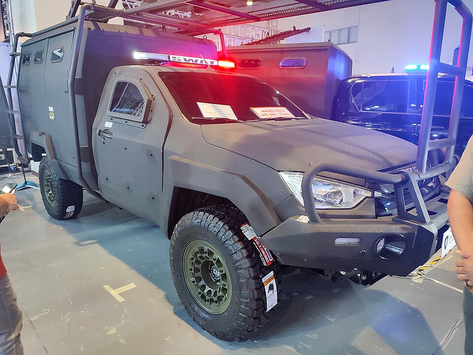

# Defense & Military Engineering

> *Warriors in armor gather at a historical site to practice their skills. They carry swords and shields while preparing for a reenactment. The setting shows an old castle wall in the background.*

> *Image: Shixart1985, CC BY 2.0*

Capabilities in this domain:

<!-- TODO: source image for Weapons & edged tools -->
- [Weapons & edged tools](weapons.md) — Weapons progression from stone blades through bronze swords, iron-age weapons, steel swords and polearms, to black powder firearms (matchlock, flintlock, percussion cap). Blade hardness requirements: stone (Mohs 5-7), bronze (HB 80-120), wrought iron (HB 90-120), medium-carbon steel (HRC 45-55 for swords, HRC 58-62 for knife edges).
<!-- TODO: source image for Fortification Engineering -->
- [Fortification Engineering](fortifications.md) — Defensive construction from simple palisades and earthworks through stone curtain walls, moats, gatehouses, and castles to star forts and bastioned trace italienne. Wall dimensions: palisade (2-4 m height), earthen rampart (3-8 m height), stone curtain wall (6-12 m height, 1.5-3.0 m thickness).

> *Image: Ethan Llamas, CC BY 4.0*

- [Armor & Protective Systems](armor.md) — Personal and structural armor progression: leather, scale, mail, and plate armor. Plate armor: 1.5-3.0 mm tempered steel, ~20-25 kg full harness. Mail: riveted iron rings, 8-10 mm internal diameter, 1.5-2.0 mm wire gauge.
<!-- TODO: source image for Siege Engineering & Military Logistics -->
- [Siege Engineering & Military Logistics](siege-warfare.md) — Siege engines (battering rams, trebuchets, siege towers), cannon artillery, and military logistics. Trebuchet counterweight: 5-15 tonnes for 100-300 kg projectile at 150-300 m range. Cannon bore progression: 50-200 mm by 15th century.

[↑ Back to Tech Tree](../index.md)
