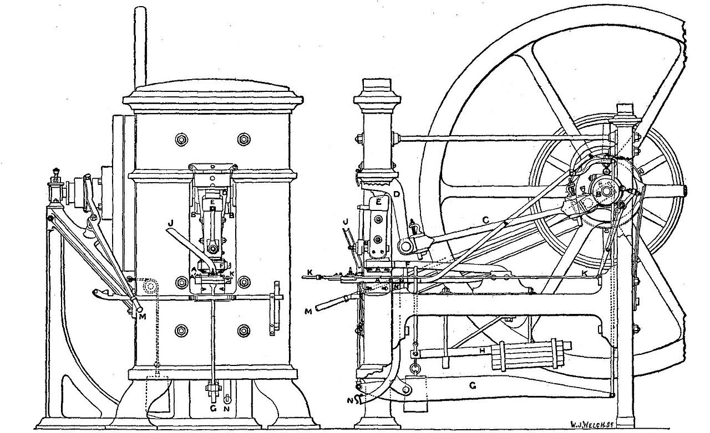

# Coinage & Precision Minting

> **Node ID**: economics-organization.coinage
> **Domain**: [Economics-Organization](./index.md)
> **Dependencies**: [`Currency & Standardized Exchange`](currency.md)
> **Enables**: [`Primary Metal Forming`](../metals/forming.md), [`Metal Finishing & Surface Treatment`](../metals/finishing.md)
> **Timeline**: Years 10-20
> **Outputs**: coins, struck-alloy-discs
> **Critical**: No

## Overview

Precision striking of standardized metal discs into coins with controlled weight, alloy composition, and anti-counterfeiting features.

This technology is characteristic of the Iron Age era of industrial development. It builds on earlier foundational techniques while enabling more precise and controlled manufacturing outcomes.

Primary outputs: `coins`, `struck-alloy-discs`. These materials or products serve as inputs for downstream manufacturing and processing steps.

Coinage is simultaneously a metallurgical process, a precision manufacturing operation, and an instrument of economic policy. The coin must contain exactly the specified amount of precious metal, bear marks that identify its issuer and denomination, and incorporate features that make counterfeiting detectable. The precision requirements of die engraving, blank preparation, and striking drove the development of metallurgy and press technology. A coinage operation demonstrates that a civilization can assay metals, engrave steel, and apply controlled force in precise alignment — capabilities that transfer to any precision metalworking application.

The history of coinage parallels the history of precision manufacturing. Lydian electrum coins (circa 600 BCE) were made by pouring molten metal into crude molds and striking with rough punches. Roman coins achieved consistent weight through careful casting and hand-striking. Medieval coins were hammered between dies held by hand. The screw press (invented in the 16th century) enabled machine-struck coins with consistent centering and depth. Each advance in coinage precision was driven by the same need: preventing counterfeiting by making the official product more precise than any unauthorized copy could match.

## Prerequisites

### Materials

- **Precious metals**: Gold, silver, or electrum (natural gold-silver alloy) for high-value coinage. Must be assayed to determine fineness before use.
- **Base metals**: Copper, bronze, brass, or iron for token coinage (value by decree rather than intrinsic metal value). Copper is added to gold and silver to harden them for circulation wear resistance.
- **Die steel**: High-carbon tool steel for engraving dies. Must be hardenable to hold the engraved design through thousands of strikes, but not so hard as to be brittle.

### Equipment

- **Melting furnace**: Crucible furnace for melting and alloying precious metals. Graphite or clay crucibles. Temperature control sufficient to achieve full melt without excessive oxidation.
- **Rolling mill**: Hand-powered or water-powered rollers for reducing ingot thickness to strip. Adjustable gap for progressive reduction. Rollers must be parallel to produce uniform strip thickness.
- **Blank cutter**: Punch press or hand-operated cutting tool for punching circular blanks from strip. The punch must be sharp and closely matched to the die diameter.
- **Annealing furnace**: For softening blanks and rolled strip between working operations. Controlled atmosphere reduces oxide formation.
- **Screw press or hammer**: For striking coins. A screw press with guided ram provides the most consistent striking force. Hand-hammer striking is the low-technology alternative.
- **Balance scale and weights**: Precision weighing equipment for assaying blanks and finished coins. Weights traceable to a primary standard.
- **Engraving tools**: Gravers, punches, and small chisels for die cutting. Magnification lens for fine detail work.
- [Currency & Standardized Exchange](currency.md) — material dependency

### Knowledge

- Understanding of precious metal alloys — fineness, hardening additions, and assaying methods
- Familiarity with die engraving technique — negative image cutting, relief design, punch-making
- Ability to operate a screw press with controlled force and timing
- Knowledge of weight standards and their enforcement
- Safety training for furnace operation, press operation, and handling of heavy metal components

### Infrastructure

- **Mint facility**: Secure building with separate areas for melting, rolling, blanking, striking, and inspection. Security is a primary concern — the precious metal inventory is valuable.
- **Furnace area**: Ventilated space for melting and annealing. Heat-resistant construction.
- **Press room**: Heavy foundation for the coin press to absorb vibration. Adequate lighting for die alignment and coin inspection.
- **Strong room**: Secure storage for precious metal stock, dies, and finished coins. Access controlled and documented.
- **Assay office**: Balance room with stable temperature for precise weighing. Assay equipment for testing alloy composition.

## Process Description

Coinage production involves three main operations: die engraving, blank preparation, and striking. Each requires different skills and equipment but must be coordinated precisely — a die that does not match the blank size, or a blank that is too hard for the press, produces defective coins.

### Step-by-Step Procedure

1. **Assay and prepare the metal stock**: Determine the precise alloy composition. For precious-metal coins (gold, silver), the fineness must be accurately controlled — debasement destroys confidence in the currency. Melt the metal with the specified alloy additions (copper for hardening silver, copper or silver for gold) and cast into ingots.
2. **Roll the ingots to strip**: Pass the cast ingots through rollers repeatedly, reducing thickness to the target strip gauge. Anneal between passes to prevent work hardening and cracking. The strip must be uniform in thickness — variation causes weight variation in the finished coins.
3. **Cut blanks (planchets)**: Punch circular discs from the rolled strip using a cutting press or hand-operated cutter. The blank diameter must be closely controlled — too large and the coin will not fit the collar die; too small and the rim will not form properly.
4. **Prepare the blanks**: Anneal the cut blanks to soften them for striking. Clean in an acid pickle to remove oxide scale. Edge-roll if the design requires a milled or lettered edge (adds anti-counterfeiting protection).
5. **Engrave the dies**: Cut the obverse (heads) and reverse (tails) designs into hardened steel die blocks. The design is engraved in negative (incuse) so that it strikes positive (in relief) on the coin. Die engraving is the highest-skill operation — the engraver must produce a mirror-image design that will render crisply when struck at speed.
6. **Strike the coins**: Place a blank between the obverse and reverse dies in a screw press. Apply pressure — the dies impress their design into the blank simultaneously. For collar-struck coins, the blank sits inside a ring (collar) that restrains lateral metal flow, forming a raised rim. The press must apply sufficient force to fill the die design completely in a single stroke.
7. **Inspect and count**: Weigh-struck coins against the standard. Check diameter and impression quality. Reject underweight, overweight, off-center, or weakly struck coins. Count, bag, and seal accepted coins for issue.

### Die Making

Die making is the precision bottleneck of the coinage process:

- **Master hub**: Engrave the original design in positive (relief) on a steel hub. This is the master from which all working dies are produced. The engraver uses gravers, punches, and small chisels to cut the design. The hub is hardened after engraving. Hub material: high-carbon tool steel (0.8-1.2% carbon), 40-60 mm diameter × 40-80 mm tall. Engraving time: 40-200 hours depending on design complexity. Maximum relief height: 0.3-0.8 mm (portrait, lettering, border beads).
- **Working dies**: Place the master hub against a softened steel die blank and press under high force (100-300 kN) in a reducing press or hubbing press. The hub's relief design is impressed into the die blank as an incuse (negative) image. Multiple hubbings may be needed for deep relief, typically 2-5 impressions with intermediate annealing at 650-700°C. Harden the working die after hubbing: heat to 800-850°C, quench in oil or brine, temper at 200-250°C for 1 hour to reach HRC 58-62.
- **Die life**: A steel die can strike 10,000-100,000 coins before the design wears smooth. Bronze dies wear out faster (3,000-10,000 coins) because bronze is softer than hardened steel. Die wear appears first on the highest-relief features (portrait nose, border beads). Worn dies produce coins with blurred or missing details. Replace dies proactively to maintain consistent quality. Track die life by serial number and retire at 70% of expected lifespan.
- **Anti-counterfeiting features**: Complex relief, fine border beading (0.3-0.5 mm diameter beads at 0.5-0.8 mm spacing), micro-lettering (0.3-0.5 mm character height), milled edges (120-180 reeds around circumference), and bimetallic construction all increase the difficulty of counterfeiting. Each additional feature doubles or triples the engraving time but also multiplies the difficulty of producing a convincing fake. The die engraver must incorporate these features without compromising the die's ability to fill completely during striking.

**Why die quality determines coinage viability**: A coin's resistance to counterfeiting depends entirely on the precision of its die. If the official coin has a crude, simple design, any competent metalworker can copy it. The more intricate the die, the more specialized the tooling and skill required to replicate it. This is why coinage drove the development of precision steel engraving: the survival of the currency system depends on making the official product more precise than any unauthorized copy.

### Striking Standards

The precision of the striking process directly determines the coin's usefulness as currency:

- **Weight tolerance**: Ancient and medieval coins typically had weight tolerances of ±2-5%. Modern machine-struck coins achieve ±0.1%. Every coin must be within tolerance — underweight coins are suspected of clipping; overweight coins cost the issuer precious metal.
- **Alloy fineness**: For silver coins, the standard was typically 90-92.5% silver (sterling). For gold coins, 90-92% gold (crowns, doubloons). Copper addition hardens the coin and improves wear resistance but reduces intrinsic value. The fineness must be consistent within a denomination — debasement erodes confidence and causes inflation.
- **Diameter tolerance**: ±0.5 mm for hand-struck coins, ±0.1 mm for machine-struck. Consistent diameter ensures coins stack properly and fit counting machines.
- **Impression quality**: The full design must be visible, well-centered, and free of doubling (caused by die bounce or multiple strikes). Weak strikes (incomplete design fill) are rejected.

### Process Parameters

| Parameter | Copper Coin | Silver Coin | Gold Coin |
|-----------|-------------|-------------|-----------|
| Blank diameter | 18-30 mm | 15-25 mm | 15-25 mm |
| Blank thickness | 2.0-4.0 mm | 0.8-2.0 mm | 0.8-1.5 mm |
| Blank weight (5 g coin) | 4.9-5.1 g | 4.9-5.1 g | 4.9-5.1 g |
| Die relief depth | 0.3-0.8 mm | 0.2-0.5 mm | 0.2-0.5 mm |
| Striking force (screw press) | 15-40 kN | 10-25 kN | 10-20 kN |
| Striking force (hammer, 2 kg) | 8-20 kN (variable) | 5-15 kN | 5-12 kN |
| Annealing temperature | 600-800°C | 600-700°C | 600-700°C |
| Annealing hold time | 20-40 min | 15-30 min | 15-30 min |
| Die hardness (HRC) | 58-62 | 58-62 | 58-62 |
| Die face diameter | 16-28 mm | 13-23 mm | 13-23 mm |
| Roll gap reduction per pass | 10-25% | 10-20% | 10-20% |
| Rolling temperature | Cold (room temp) | Cold or warm (200°C max) | Cold |
| Weight tolerance (machine) | ±0.5% | ±0.3% | ±0.3% |
| Weight tolerance (hand-struck) | ±2-5% | ±2-5% | ±2-5% |
| Strip thickness uniformity | ±0.05 mm | ±0.03 mm | ±0.03 mm |

**Why these parameters matter**: The blank thickness must exceed the die relief depth by at least 1.5x to ensure enough metal flows into the die cavity during striking. If the blank is too thin, the highest relief points (usually the border bead or portrait) will be weak or absent. If the blank is too thick, the press cannot push enough metal into the die in a single stroke, producing a blurred, incomplete impression. Annealing temperature is critical because overheating softens the metal excessively, causing it to stick to the dies; underheating leaves the blank too hard for clean metal flow into the die details.

**Striking force calculation**: The force needed to fill a coin die depends on blank area, metal hardness, and relief depth. Approximate formula: F = σ × A × (1 + 2μr/h), where σ is the metal's yield strength (copper: 70 MPa annealed, silver: 55 MPa, gold: 40 MPa), A is the blank area, μ is the friction coefficient between die and blank (~0.15-0.25 with lubrication), r is the blank radius, and h is the blank thickness. A 20 mm copper blank (area 314 mm²) at 70 MPa requires approximately 22-30 kN for complete fill.

**Alloy composition effects on hardness**: Pure copper (Vickers hardness ~50 HV) is too soft for durable coinage. Adding 5% tin raises hardness to ~100 HV and improves wear resistance by 2-3x. Silver at 92.5% (sterling) with 7.5% copper reaches ~80 HV, significantly harder than pure silver (~25 HV). Gold at 90% with 10% copper reaches ~90 HV versus pure gold at ~25 HV. Harder alloys extend circulation life but require greater striking force and produce more die wear.

## Safety Considerations

This process involves specific hazards requiring trained personnel and protective measures:

- **Forge injuries**: Burns from molten metal splatter and hot furnace surfaces. Wear appropriate PPE when tending the melt.
- **Heavy metal exposure**: Lead, copper, and other coinage metals are toxic with chronic exposure. Ventilation required for melting and annealing operations. Wash hands before eating.
- **Crush injuries**: Coin presses exert enormous force. Never place hands in the die area. Use feeding tools. Ensure press guards are in place.
- **Chemical exposure**: Pickling acids for cleaning blanks. Handle with appropriate gloves and eye protection. Work in ventilated area.
- **Eye damage**: Flying metal fragments from cutting blanks and striking operations. Safety glasses mandatory in the press room.

### Personal Protective Equipment

- Safety glasses or face shield — mandatory for all press, furnace, and cutting operations
- Heat-resistant gloves for handling hot metal, ingots, and annealed blanks
- Leather apron for protection from metal splashes during melting
- Respiratory protection during melting and pickling operations
- Steel-toe boots for handling heavy ingots and press components
- Hearing protection in the press room — striking operations produce sharp impact noise

### Emergency Procedures

- Maintain first aid kit with burn treatment and eye wash. Molten metal splatter is the most common serious injury.
- Know locations of emergency shutoffs for the press and furnace.
- Establish evacuation routes from the furnace area — metal fires (magnesium, aluminum) cannot be extinguished with water. Use dry sand.
- Train all personnel on crush injury response. If a hand is caught in the press, do not attempt to reverse the press — call emergency services immediately.
- Maintain a spill kit for precious metal spills. Recover all precious metal — every gram has economic value.

## Quality Control

### Acceptance Criteria

- **Coins**: Weight within specified tolerance. Diameter within tolerance. Alloy composition verified by assay. Design fully struck, well-centered, with all features visible. Edge marking correct (milled, lettered, or plain as specified).
- **Struck Alloy Discs**: Dimensional and compositional specifications met. Surface free of cracks, inclusions, and deep scratches that would affect the struck impression.

### Testing Methods

- **Weight check**: Balance scale against a standard weight. Every coin in a sample is weighed. Historic tolerance: ±2-5% of standard. Outliers are remelted.
- **Diameter check**: Go/no-go gauge — a plate with holes of minimum and maximum diameter. Coins must pass through the large hole but not the small hole.
- **Visual inspection**: Check for weak strike (missing details), off-center strike (design shifted to one side), double strike (ghost image), and surface defects. Reject defective coins.
- **Alloy assay**: Test the metal composition of each melt batch before striking. Methods: touchstone assay (gold/silver — streak the metal on a dark stone and compare acid reaction to known standards), cupellation (quantitative separation of precious from base metals), or specific gravity measurement.
- **Ring test**: Drop the coin on a hard surface. Genuine coins of the correct alloy produce a characteristic ring; debased or counterfeit coins produce a dull thud. A quick field test.

### Sampling Protocol

- Weigh every finished coin individually (or sample at high production rates). Reject any coin outside the weight tolerance.
- Inspect every coin visually for strike quality — the press operator performs this check as part of the striking cycle.
- Assay each melt batch before striking. Record the fineness. If the assay shows deviation from specification, adjust the next melt rather than striking coins with incorrect fineness.
- Record all measurements for trend analysis. Track die wear by monitoring the quality of struck details over the die's lifetime.
- Reject and investigate any out-of-specification results. Underweight coins may indicate blank-cutting problems; overweight coins waste precious metal.
- Audit finished coin bags by sampling — weigh and inspect a random sample from each sealed bag before release.

## Scaling Notes

Transitioning from bench-scale to production involves these considerations:

- **Bench scale (hammer striking)**: Dies held in a vice or hand-held; blank placed between them; struck with a sledgehammer. The earliest method. One coin per stroke. Produces coins with variable centering and depth. Output: 50-200 coins per day. Adequate for small community currency. Dies last 2,000-5,000 strikes before relief blurs beyond recognition. Metal consumption: 250-1,000 g copper/day at 5 g/coin.
- **Pilot scale (screw press)**: Mechanical screw press applies controlled, repeatable force of 15-40 kN. Dies mounted in the press. Blank placed by hand. Collar die restrains the blank for a consistent rim. Output: 500-2,000 coins per day. Consistent quality. Die life improves to 10,000-50,000 strikes due to controlled, centered force. Requires 1 operator + 1 blank feeder. Strip throughput: 5-10 kg/hour through hand-cranked rolling mill.
- **Production scale (steam-powered press)**: Steam-powered knuckle-joint press strikes coins at 50-100 strokes per minute with 30-80 kN force. Automatic blank feeding. Continuous production. Output: 20,000-50,000 coins per day. Requires steam engine infrastructure (10-20 kW). Metal consumption: 100-250 kg copper/day. The standard for national mints from the 19th century onward. Rolling mill powered by water or steam: 50-100 kg strip/hour.

**Labor requirements by scale**:

| Scale | Workers | Output (coins/day) | Metal Processed (kg/day) | Key Roles |
|-------|---------|-------------------|--------------------------|-----------|
| Hammer (bench) | 2-3 | 50-200 | 0.25-1.0 | Striker, melter, engraver |
| Screw press (pilot) | 4-6 | 500-2,000 | 2.5-10.0 | Press operator, blank feeder, roller, melter, engraver, inspector |
| Steam press (production) | 8-15 | 20,000-50,000 | 100-250 | Press operators (2-3), roller operator, melter (2), blank cutter, inspectors (2-3), die engraver, foreman |

## Troubleshooting

| Problem | Probable Cause | Solution |
|---------|---------------|----------|
| Weak strike (missing details) | Insufficient press force or blank too hard | Increase press pressure; anneal blanks at 600-800°C for 20-40 min; verify die relief depth is <0.8 mm for copper |
| Off-center strike | Blank not centered on die | Improve blank positioning; use a locating collar (steel ring with 0.1 mm clearance); train operators |
| Die breakage | Die steel too brittle or design too deep | Use tougher die steel (HRC 58-60 instead of 62+); reduce relief depth below 0.6 mm; pre-stress dies with light strikes before full production |
| Weight variation exceeds tolerance | Strip thickness uneven or blank diameter inconsistent | Re-roll strip to ±0.05 mm uniformity; recalibrate blank cutter; check roller parallelism with feeler gauge |
| Surface cracks on struck coin | Blank contaminated or alloy segregation in casting | Improve melt stirring (stir 60+ seconds before pour); filter melt through graphite filter; clean blanks in 10% vinegar solution |
| Edge defects (flashing, cracks) | Collar die worn or blank oversize | Replace collar die after 30,000+ strikes; verify blank diameter is 0.2-0.5 mm smaller than collar inner diameter |
| Fineness below standard | Alloy proportion wrong or segregation during solidification | Re-assay melt with cupellation before casting; stir melt thoroughly; use smaller ingot molds (faster solidification reduces segregation) |
| Coins sticking to dies | Blank too soft (over-annealed) or dies not lubricated | Reduce annealing temperature by 50-100°C; apply thin film of soot or graphite to die faces between strikes |
| Die wear too rapid (blurring after <5,000 strikes) | Die steel not properly hardened or relief too deep | Re-harden dies: heat to 800-850°C, quench in oil, temper at 200-250°C for 1 hour; reduce maximum relief to 0.5 mm |
| Clipped or undersize blanks from cutter | Cutting punch dull or strip too thick | Sharpen or replace cutting punch (edge angle 15-20°); roll strip to thinner gauge before cutting |
| Coin color wrong (reddish copper instead of yellow bronze) | Tin content too low or absent | Verify alloy composition with touchstone assay; adjust tin to 8-12% for bronze coinage |
| Bubbles or pits on coin surface | Gas trapped in melt or damp mold | Preheat molds to 200°C; skim slag from melt surface before pouring; use dry charcoal cover over melt to reduce oxidation |
| Cracked blanks after cutting | Work-hardened strip not annealed before cutting | Anneal strip at 600°C for 30 min before blanking; cut blanks with sharp punch (dull punch tears metal) |
| Inconsistent diameter after striking | Blank weight varies or die-to-collar fit loose | Sort blanks by weight before striking (±1% bands); replace worn collar die |

## Variations and Alternatives

- **Hammer striking (manual)**: The earliest method. Dies held in hand or set in an anvil. Blank placed between them. Struck with a hammer. Simple but inconsistent — coins vary in centering, depth, and sometimes shape. The standard method from antiquity through the medieval period.
- **Screw press (semi-mechanized)**: A threaded screw drives the upper die down onto the blank. Consistent force and alignment. Coin quality improves dramatically — centered strikes, uniform depth, and repeatable results. The screw press is the technology that separates medieval from modern coinage.
- **Steam-powered press (industrial)**: Steam engine drives a knuckle-joint mechanism that delivers a powerful, rapid stroke. High throughput for national-scale coin production. Requires steam engine infrastructure.
- **Cast coinage (alternative)**: Pour molten metal into molds instead of striking. Used for base-metal coins where precision is less critical. Simpler than striking but produces less detailed designs and cannot incorporate anti-counterfeiting features as effectively.

## References

- [Economics & Organization](index.md) — parent capability
- [Economics-Organization Domain](./index.md) — domain overview and related capabilities
- [Currency & Standardized Exchange](currency.md) — upstream dependency (material)
- [Primary Metal Forming](../metals/forming.md) — downstream capability
- [Metal Finishing & Surface Treatment](../metals/finishing.md) — downstream capability

Coinage connects to [Metals](../metals/index.md) through alloy preparation and assaying, to [Machine Tools](../machine-tools/index.md) through die engraving and press construction, and to [Measurement](../measurement/index.md) through weight and dimensional standards. The precision required for reliable coinage — consistent weight, diameter, and alloy composition — establishes the measurement standards that underpin trade and manufacturing.

Coinage also serves as a technology transfer mechanism. The same screw press used for striking coins can stamp washers, blanks for buttons, and other small metal parts. The rolling mill used for coin strip also produces sheet metal for other applications. The die engraving skills developed for coins transfer directly to any precision metal stamping operation, including the production of gauges, measuring instruments, and machine components.

Proper handling of input materials and products is essential for consistent results:

- Store precious metal stock under secure conditions. Account for every gram — precious metal loss is direct economic loss.
- Use FIFO (first-in, first-out) for alloy additions (copper, silver) and blank stock.
- Label all containers with contents, alloy specification, weight, and date received.
- Inspect blanks before striking — reject any with surface cracks, deep scratches, or inclusions visible to the naked eye.
- Segregate rejected coins and scrap for remelting. Record the weight of all scrap returned to the furnace.
- Finished coins must be counted, sealed in bags with the count and value marked, and stored securely until issued.

---

*Part of the [Bootciv Tech Tree](../index.md) · [Economics-Organization](./index.md) · [All Domains](../index.md)*

