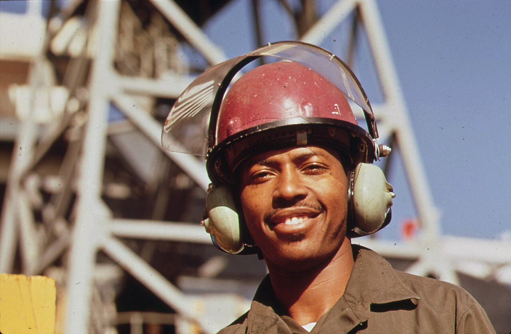
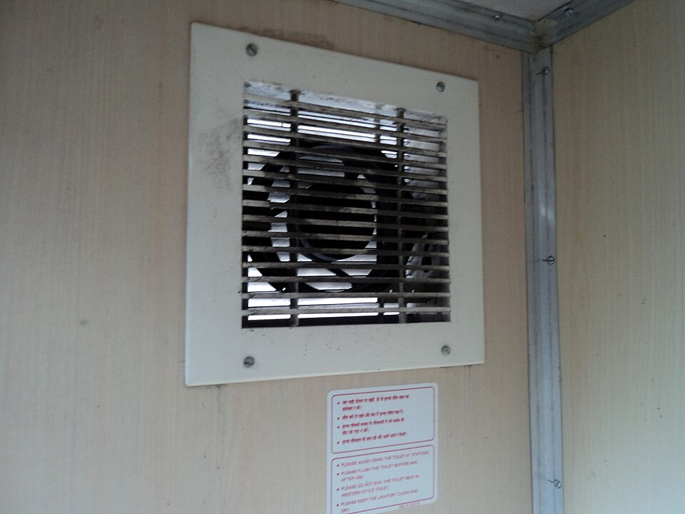
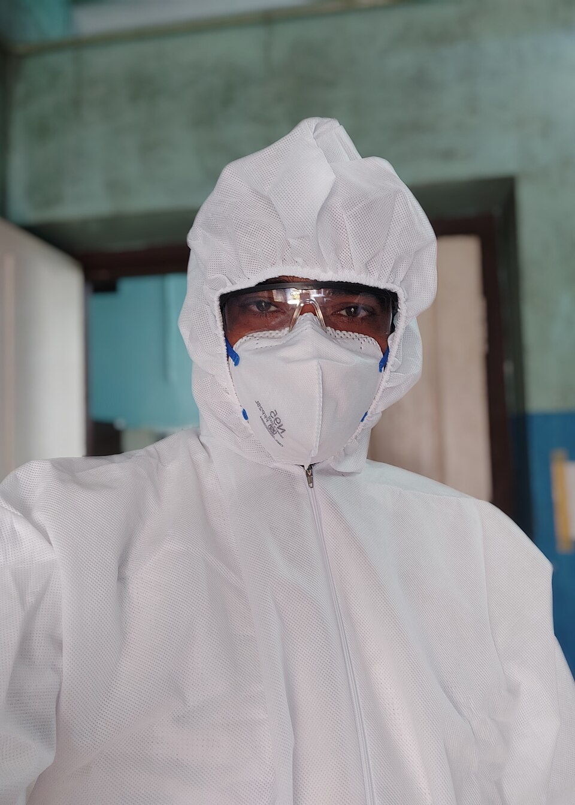
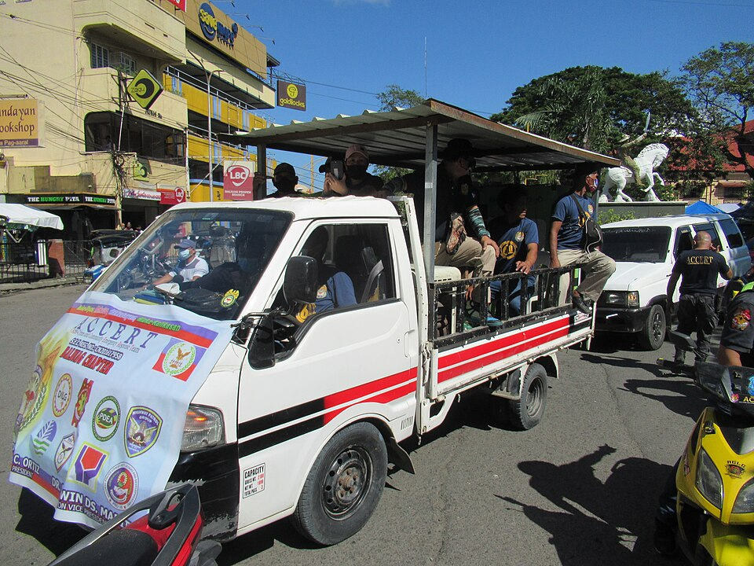
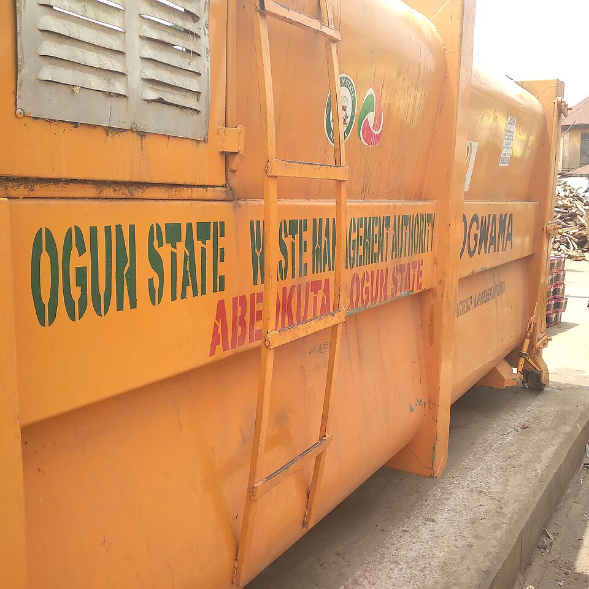
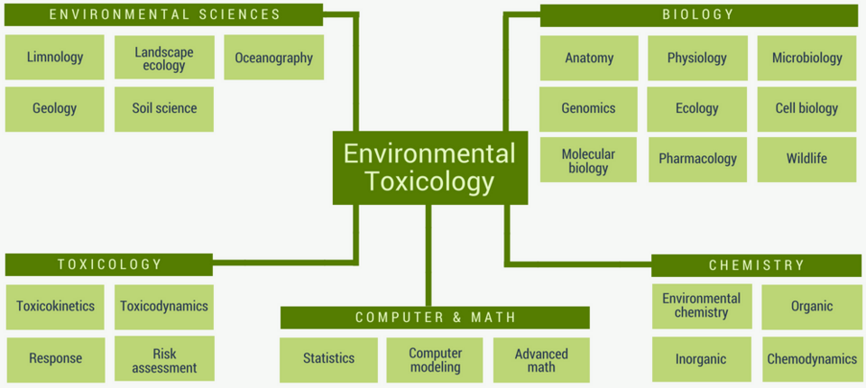
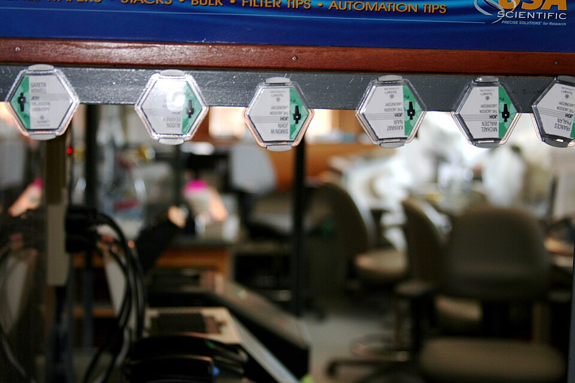

# Environmental Health & Safety

> *A shipyard worker wearing ear protection against industrial noise pollution, demonstrating personal protective equipment (PPE) in a heavy industrial environment.*

> *Image: John Messina, Public domain*

Capabilities in this domain:

<!-- TODO: source image for Chemical Safety & Toxicology -->
- [Chemical Safety & Toxicology](chemical-safety.md) — Semiconductor process chemical hazards, TLV/IDLH limits, NFPA diamond ratings, hydride gas safety, and acid handling protocols.

> *Image: Tha-uzhavan, CC BY-SA 3.0*

- [Ventilation & Exhaust Systems](ventilation-exhaust.md) — Local exhaust ventilation, gas cabinets, abatement systems, scrubbers, and semiconductor fab air management.

> *Image: Dr. Javed Anees, CC0*

- [Personal Protective Equipment](ppe.md) — Respiratory protection, chemical suits, gloves, eye protection, and PPE selection matrices for semiconductor manufacturing.

> *Image: RamaGaspar, CC BY-SA 4.0*

- [Emergency Response](emergency-response.md) — Spill response, eyewash and deluge shower placement, gas leak procedures, evacuation planning, and first aid for chemical exposures.

> *Image: Munir The Illuminator, CC BY-SA 4.0*

- [Waste Management](waste-management.md) — Acid waste neutralization, solvent waste recovery, heavy metal precipitation, and semiconductor effluent treatment.

> *Image: Toxtutor, CC BY-SA 3.0*

- [Toxicology](toxicology.md) — Toxic substance identification, TLV-TWA exposure limits, LD50 data, antidote protocols, and biological monitoring for industrial chemicals.

> *Image: Wladimir Labeikovsky, CC BY-SA 2.0*

- [Radiation Safety](radiation-safety.md) — Ionizing radiation protection, shielding design, dosimetry, contamination control, and dose limits for occupational and public exposure.

[↑ Back to Tech Tree](../../index.md)
