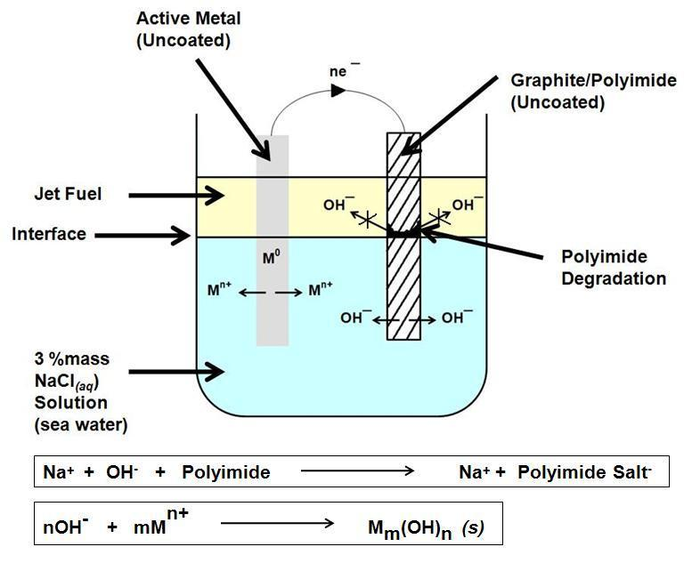
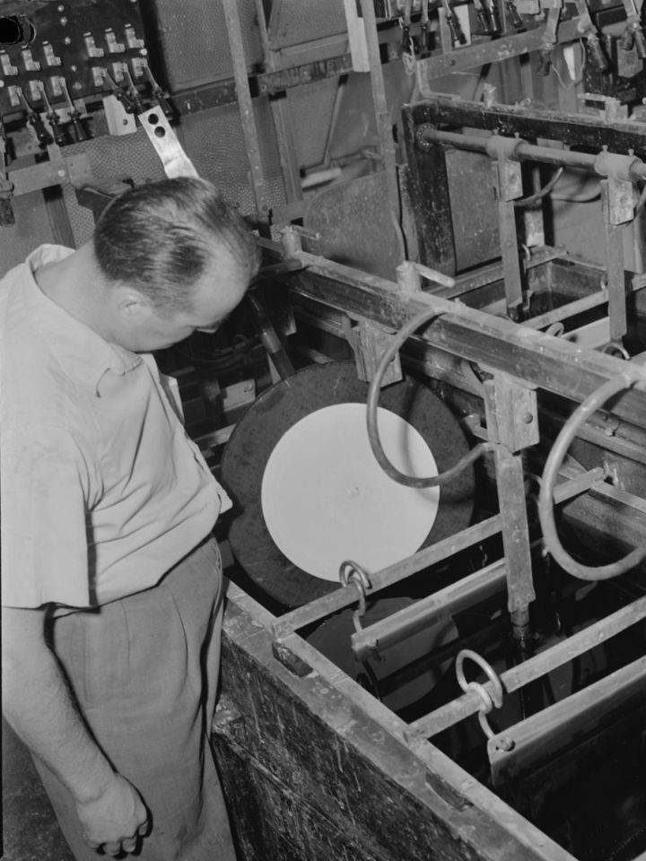
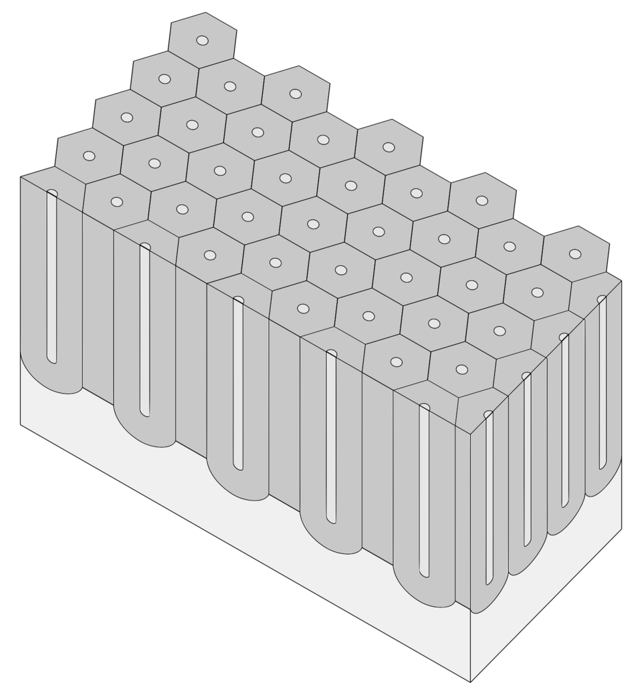
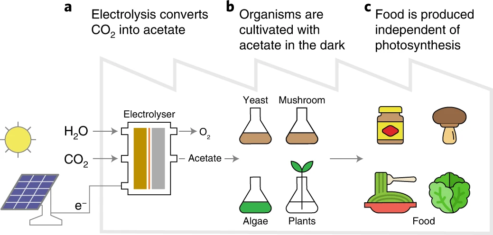
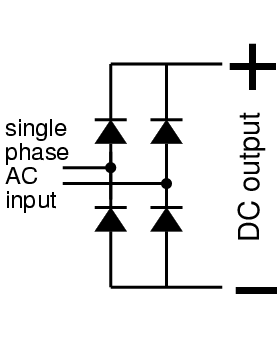

# Electrochemistry & Plating

> *This illustration depicts mechanism of degradation of thermoset polymer (plastic) by galvanic action first published in the literature in 1990. When carbon fiber reinforced polymer (CFRP) is in contact with an active metal such as aluminum or iron, and in contact with salt water, a galvanic circu...*

> *Image: Geometric777, CC0*

> **Node ID**: electrochemistry
> **Domain**: Electrochemistry & Plating
> **Timeline**: Years 30-80
> **Organizing Axis**: Process Chain — capabilities ordered by material flow from metal ion to functional surface coating

Capabilities in this domain:

> *Image: Conrad Poirier, Public domain*

- [Electroplating](electroplating.md) — Copper damascene electroplating for semiconductor interconnects (acid sulfate bath, pulse reverse plating, via/trench fill). Nickel, gold, tin, and alloy plating for electronics. Strike plating, adhesion layers, and thickness control via Faraday's law.

> *Image: Matteo Bordiga, CC BY-SA 4.0*

- [Anodizing](anodizing.md) — Electrochemical oxide growth on aluminum (Type II sulfuric acid, Type III hard anodizing) and titanium (voltage-controlled oxide thickness, color anodizing). Barrier layer formation kinetics, pore structure engineering, and sealing processes.

> *Image: Authors of the study: Elizabeth C. Hann, Sean Overa, Marcus Harland-Dunaway, Andrés F. Narvaez, Dang N. Le, Martha L. Orozco-Cárdenas, Feng Jiao &amp; Robert E. Jinkerson, CC BY 4.0*

- [Electrochemical Surface Processes](electrochemical-processes.md) — Electropolishing for ultrapure surfaces, electroforming for precision microstructures and stampers, electroless plating (ENIG for PCBs, electroless copper for through-hole metallization). Process control, bath chemistry management, and waste treatment.

### SIK Placement Test Decision

The electrochemistry domain was evaluated against two existing domains:

**vs. chemistry.electrolysis** (industrial electrolysis):
- Infrastructure overlap: ~30%. Electrolysis uses large-scale cells (200-500 kA), brine/gas handling, industrial rectifiers. Electrochemistry uses precision plating baths, pulse rectifiers, clean room environments, CMP tools.
- Knowledge overlap: ~35%. Both use Faraday's laws and basic electrode kinetics. Electrochemistry adds semiconductor process engineering, thin film physics, damascene fill dynamics, and sub-micron feature control.
- Practitioner overlap: ~20%. Chemical/industrial engineers vs. semiconductor process engineers.

**vs. metals.finishing** (metal finishing):
- Infrastructure overlap: ~45%. Shared plating baths, DC power supplies, anodizing equipment. Electrochemistry adds clean rooms, pulse reverse generators, CMP, and precision metrology for semiconductor features.
- Knowledge overlap: ~40%. Surface chemistry overlaps but electrochemistry requires semiconductor-grade process control, via/trench fill modeling, and barrier layer integration.
- Practitioner overlap: ~30%. General metal finishers vs. semiconductor fab engineers with specialized training.

**Result**: All overlaps are <50% on at least two dimensions against both existing domains. The electrochemistry domain is justified as a separate domain because:

1. **Distinct infrastructure**: Semiconductor-grade plating requires clean rooms (Class 100-1000), CMP planarization tools, pulse reverse rectifiers, and wafer handling robots — none of which exist in conventional metal finishing or electrolysis operations.

2. **Distinct knowledge base**: Copper damascene fill modeling, electroless nickel immersion gold (ENIG) process windows, and electropolishing of semiconductor process chambers require specialized electrochemical engineering knowledge not shared with bulk electrolysis or decorative/protective metal finishing.

3. **Distinct practitioner profile**: Semiconductor process engineers who optimize electroplating baths for sub-25 nm feature fill have fundamentally different training than metal finishers who plate decorative chromium or galvanize structural steel.

4. **Sufficient domain size**: Three capabilities (electroplating, anodizing, electrochemical surface processes) each with multiple process-level nodes exceeds the minimum domain size threshold.

No override conditions apply — no circular dependencies exist with chemistry or metals domains, and the bootstrap sequence does not demand co-presentation.

---

> *Image: Glogger at English Wikipedia, CC BY-SA 3.0*

- [DC Rectifier](dc-rectifier.md) — Thyristor and IGBT DC power supplies providing controlled current/voltage for electroplating, anodizing, and electrolysis.
*Part of the [Bootciv Tech Tree](../index.md) • [All Domains](../index.md)*
