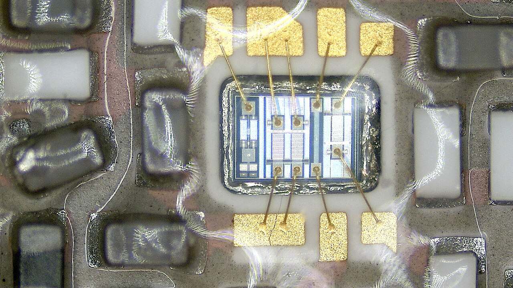
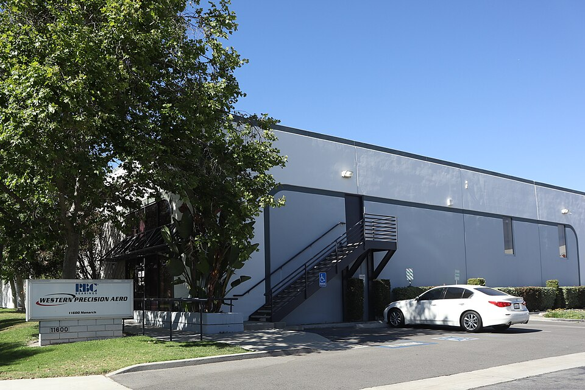
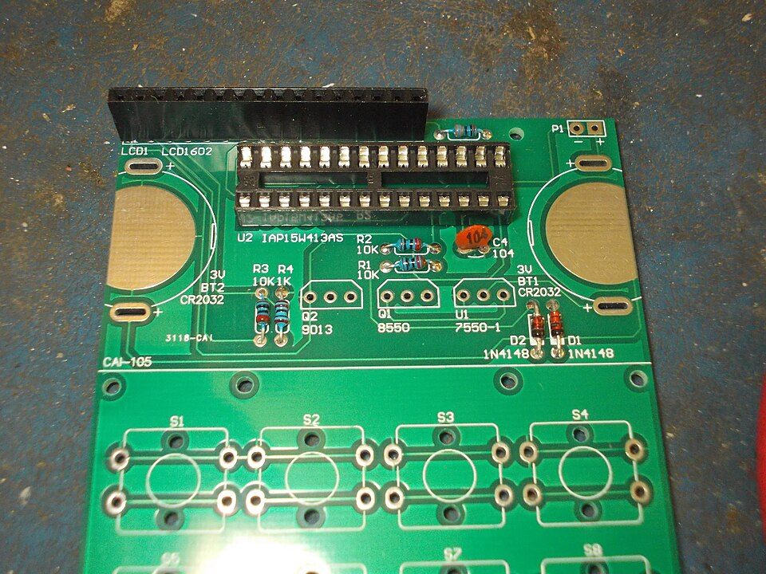
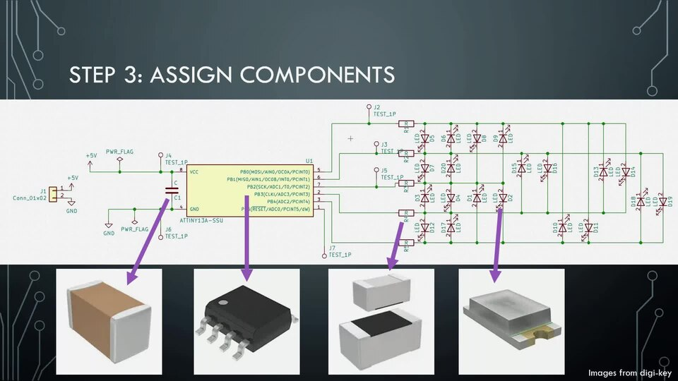
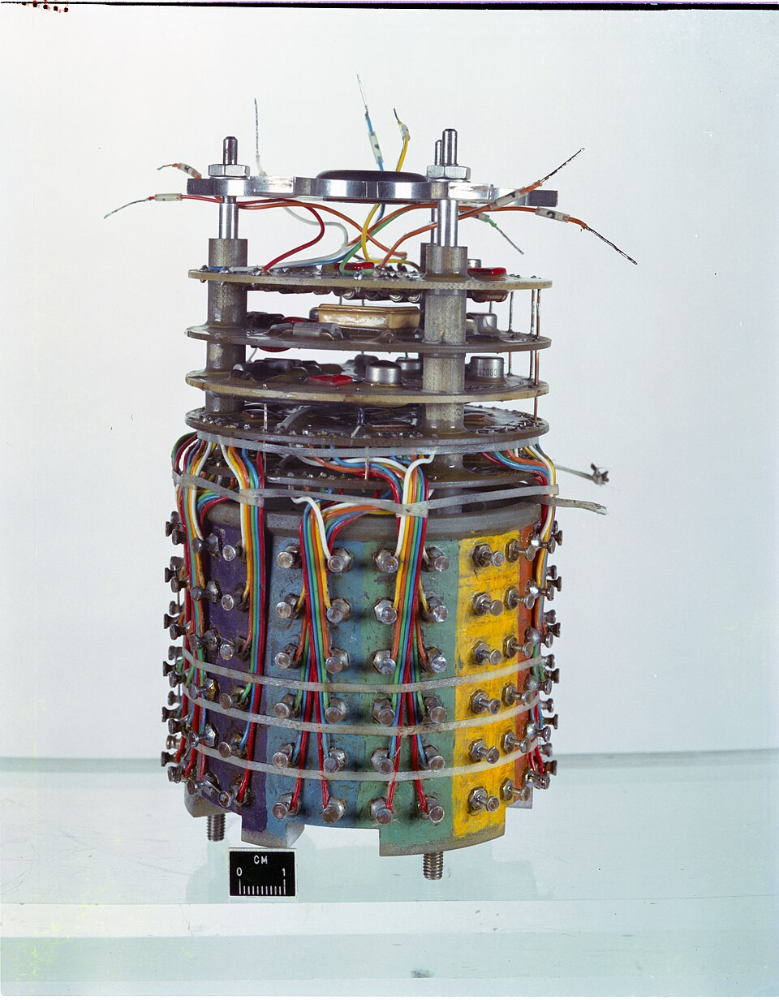
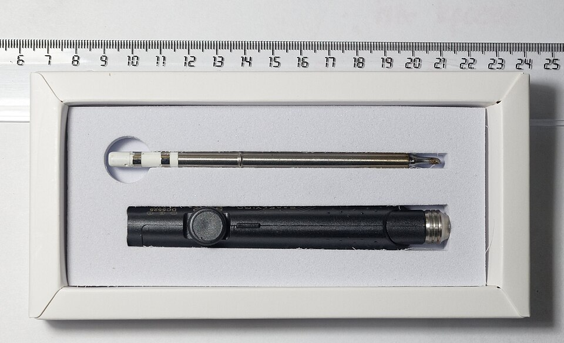
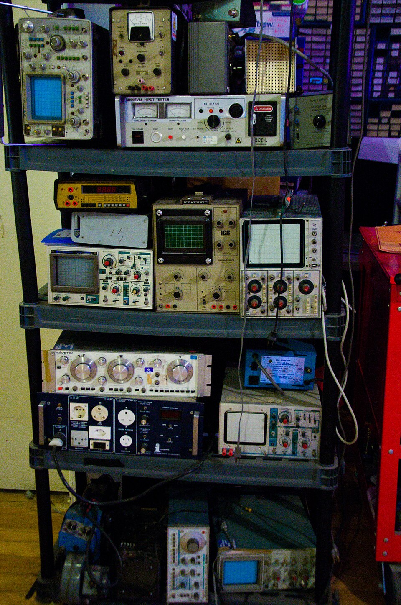

# Electronics

> *Microphoto of an electronics circuit board, likely from a smartphone, taken with a digital microscope.*

> *Image: Jan Helebrant, CC0*

Capabilities in this domain:

> *Image: Oak Ridge National Laboratory, CC BY 2.0*

- [Electrical Systems](electrical-systems.md) — Power distribution wiring, switches, connectors, fuses, breakers, transformers, motor-generator sets, and power electronics.

> *Image: tony_duell, CC BY 2.0*

- [Passive Components](passive-components.md) — Resistors, capacitors, and inductors as fundamental circuit building blocks for filtering, timing, impedance matching, and energy storage.
<!-- TODO: source image for Semiconductor Devices -->
- [Semiconductor Devices](semiconductor-devices.md) — Discrete semiconductor components: diodes, BJTs, FETs, and thyristors for amplification, switching, rectification, and logic.

> *Image: Swoolverton, CC BY-SA 3.0*

- [PCB Fabrication](pcb-fabrication.md) — Copper-clad substrate processing into patterned circuit interconnects providing mechanical support, electrical connections, and thermal management.
<!-- TODO: source image for Power Electronics -->
- [Power Electronics](power-electronics.md) — Semiconductor-based power conversion and control: rectifiers, inverters, DC-DC converters, and motor drives for efficient energy conversion and grid integration.

> *Image: U.S. Navy photo by Photographer's Mate 2nd Class Brandon A. Teeples, Public domain*

- [Electronics Assembly](assembly.md) — PCB fabrication, component placement, soldering (through-hole and surface mount), conformal coating, IC packaging, and testing.

> *Image: Drausch, CC BY-SA 4.0*

- [Wire Insulation and Enameling](wire-insulation.md) — Magnet wire enameling (polyurethane, polyester, polyesterimide), rubber cable extrusion, cloth/paper wrapping, and varnish dipping for dielectric isolation in wound components.

> *Image: Retired electrician, CC0*

- [Soldering Iron](soldering-iron.md) — Temperature-controlled soldering irons for electronics assembly, repair, and wire joining.

> *Image: www.mgaylard.co.uk and thanks for looking, CC BY 2.0*

- [Electronic Test Equipment](test-equipment.md) — Multimeters, oscilloscopes, signal generators, and power supplies for circuit testing and characterization.
[↑ Back to Tech Tree](../index.md)
