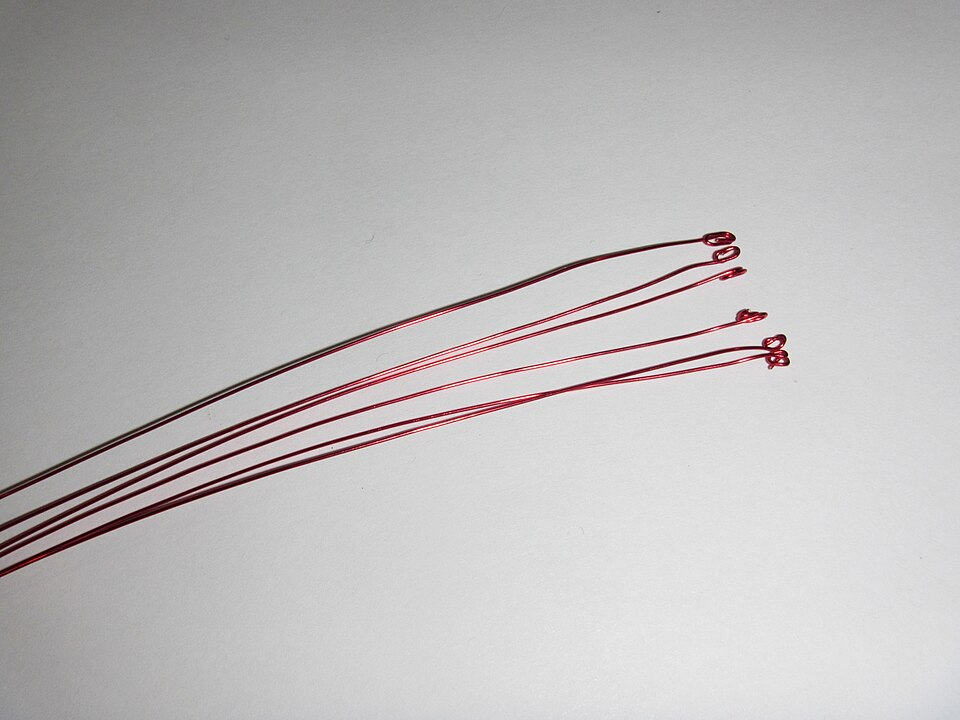

# Wire Insulation and Enameling

> **Node ID**: electronics.wire-insulation
> **Domain**: [Electronics](./index.md)
> **Dependencies**: [`polymers.rubber`](../polymers/rubber.md), [`electronics.electrical-systems`](electrical-systems.md)
> **Enables**: [`electronics.electrical-systems`](electrical-systems.md), [`electronics.assembly`](assembly.md)
> **Timeline**: Years 15-25
> **Outputs**: enamelled_magnet_wire, rubber_insulated_cable, varnish_dipped_windings
> **Critical**: Yes — magnet wire is the enabling material for all electromagnetic devices (transformers, motors, inductors, relays); without reliable insulation on windings, every wound component short-circuits internally

## Overview

> *Image: cool3dpictures, CC BY-SA 2.0*

Wire insulation coats bare metal conductors with a dielectric layer that prevents electrical contact between adjacent turns in a coil, between conductors in a cable bundle, and between conductors and grounded structures. The dominant form for electromagnetic components is **magnet wire** — copper or aluminum conductor coated with a thin (0.01-0.10 mm) cured enamel film. Magnet wire accounts for the majority of insulated conductor production by length because every transformer, motor, inductor, relay, and solenoid requires it.

The insulation must simultaneously satisfy competing demands: thin enough to pack maximum conductor into a given winding window, mechanically tough enough to survive winding tension and deformation over corners, thermally stable at continuous operating temperatures (105-220°C depending on class), and electrically strong enough to withstand turn-to-turn voltage stress (typically 20-200 V per layer in power transformers, up to several kV in high-voltage machines).

This capability covers four insulation methods: **enameling** (the critical path for magnet wire), **cloth/paper wrapping** (high-voltage machine windings), **rubber and plastic extrusion** (power cable), and **varnish dipping** (post-winding impregnation for completed coils).

## Prerequisites

- **Copper wire**: Drawn from [electrolytic copper](../chemistry/electrolysis.md) to required diameter (0.05-5.0 mm), cleaned and annealed. Surface contamination (drawing lubricant, oxides) prevents enamel adhesion.
- **Enamel resin components**: Polyurethane (polyester polyol + isocyanate), polyester (terephthalic acid + ethylene glycol), or polyesterimide formulations. From [chemistry](../chemistry/index.md) organic synthesis.
- **Solvents**: Cresylic acid (cresol isomers), phenol, N-methylpyrrolidone (NMP), or dimethylformamide (DMF). Solvent choice determines enamel solids content (20-40% by weight) and curing behavior.
- **Rubber or thermoplastic compound**: From [rubber processing](../polymers/rubber.md) for cable insulation extrusion.
- **Varnish**: Alkyd, epoxy, or silicone-based impregnating varnishes for post-winding dip treatment.
- **Curing oven**: Gas-fired or electric, 2-10 m length, capable of 200-500°C continuous operation with forced-air circulation and solvent vapor extraction.
- **Insulation resistance tester (megger)**: 500-5000 V DC for dielectric strength verification.

## Bill of Materials

| Material | Quantity (per 1000 m of 1.0 mm magnet wire) | Source | Alternatives |
|----------|-----------------------------------------------|--------|-------------|
| Copper wire (1.0 mm diameter, bare) | 7.85 kg | [Electrolysis](../chemistry/electrolysis.md) | Aluminum wire (2.7 kg, 61% conductivity, larger diameter for same resistance) |
| Polyesterimide enamel (40% solids in solvent) | 0.4-0.8 kg enamel solution | [Chemistry](../chemistry/index.md) organic synthesis | Polyurethane (lower thermal class, solderable), polyester (intermediate) |
| Cresylic acid solvent (for enamel formulation) | 0.6-1.2 kg | [Petroleum](../petroleum/index.md) coal tar or petroleum refining | NMP (less toxic, higher cost), phenol |
| Natural gas or electricity (oven curing) | 15-30 kWh or 2-5 m³ gas | [Energy](../energy/index.md) | Biomass-fired oven (lower throughput, harder temperature control) |

| Material | Quantity (per 100 m of 3-conductor 14 AWG rubber-insulated cable) | Source | Alternatives |
|----------|---------------------------------------------------------------------|--------|-------------|
| Copper conductor (14 AWG, 2.08 mm² × 3) | 5.6 kg | [Electrolysis](../chemistry/electrolysis.md) | Aluminum conductor (1.7 kg, requires larger gauge) |
| Rubber compound (SBR + fillers + vulcanizing agents) | 3.0-4.0 kg | [Rubber](../polymers/rubber.md) | PVC (lower temp rating, 75°C vs 90°C for rubber), XLPE (higher cost, better performance) |
| Vulcanizing agents (sulfur, accelerators, zinc oxide) | 0.15-0.30 kg | [Chemistry](../chemistry/index.md) | Peroxide cure (different properties) |

## Process Description

### Enameling (Magnet Wire)

**Principle**: A bare copper wire passes through an enamel bath (or is coated by a die) and then through a curing oven. The solvent evaporates and the resin cross-links into a continuous, adherent film. Multiple passes (4-12) build the insulation to target thickness. Each pass adds 0.005-0.015 mm of cured film.

**Procedure** (die coating method, production scale):

1. **Wire preparation**: Pay off bare copper wire from spool through a tensioning device (2-8 N for 1.0 mm wire, proportional to cross-section). Pass wire through an electrolytic cleaner (sulfuric acid 5-10% at 40-60°C) or mechanical abrasive buffing to remove drawing lubricant and surface oxides. Rinse in deionized water and dry with forced air at 80-100°C.
2. **First enamel coat**: Pass wire through a coating die (tungsten carbide or diamond die, bore diameter = wire diameter + 2 × wet film thickness). The die meters a uniform wet film of enamel solution onto the wire surface. Enamel solids content: 25-40% by weight depending on formulation.
3. **First cure pass**: Wire enters the curing oven at wire speed 5-30 m/min (speed inversely proportional to wire diameter). Oven temperature profile: 200-250°C entry zone → 300-400°C peak zone → 250-300°C exit zone. Residence time in oven: 10-60 seconds depending on oven length and wire speed. Solvent evaporates in the entry zone; resin cross-links in the peak zone. Exhaust ventilation captures solvent vapors (mandatory — solvents are flammable and toxic).
4. **Repeat coating and curing**: Wire re-enters the coating die for the next pass. Typical builds: 4-6 passes for polyurethane (Class 130°C), 6-8 passes for polyester (Class 155°C), 8-12 passes for polyesterimide (Class 180-220°C). Target cured film thickness: 0.01-0.03 mm for fine wire (< 0.5 mm), 0.03-0.08 mm for medium wire (0.5-2.0 mm), 0.05-0.10 mm for heavy wire (> 2.0 mm).
5. **Final pass and cooling**: After the last coat, wire passes through the oven for final cure. Then air-cool on a long cooling section (2-5 m) before spooling. Wire temperature at take-up: < 60°C (hot wire softens enamel and deforms on the spool).
6. **Take-up**: Wind finished magnet wire onto spools at controlled tension (1-5 N for 1.0 mm wire). Spool capacity: 5-50 kg depending on wire gauge.

**Dip coating alternative**: For short runs or large-diameter wire (> 3 mm), pass wire through an open enamel bath (no die) and let excess drain. Dip coating gives less uniform film thickness than die coating but requires no precision dies.

**Spray coating alternative**: Used for flat wire or rectangular conductor. Spray nozzles apply enamel to the flat surfaces. Lower material efficiency (30-50% overspray loss) but handles non-circular cross-sections.

### Cloth and Paper Insulation

**Principle**: Wrap bare or enameled conductor with overlapping layers of insulating tape (cotton, silk, polyester glass cloth, or kraft paper) for additional dielectric and mechanical protection in rotating machinery and high-voltage transformers.

**Procedure**:

1. **Tape preparation**: Slit insulating cloth or paper to required width (5-25 mm for round wire, full-width sheets for flat conductor). Cotton tape: 0.10-0.20 mm thick, rated Class 105°C. Polyester-glass tape: 0.10-0.15 mm thick, rated Class 155-180°C. Kraft paper: 0.05-0.13 mm thick, rated Class 105°C (dry) or Class 120°C (oil-impregnated).
2. **Wrapping**: Pass conductor through a taping head that spiral-wraps the tape with 50% overlap (each layer covers half the previous turn). Number of layers: 1-4 depending on voltage rating. Wrap tension: 5-20 N for 10 mm wide tape.
3. **Consolidation**: After wrapping, pass the taped conductor through light roller compression to bed the tape layers together. No heat cure required for mechanical wrapping.

### Rubber Insulation Extrusion

**Principle**: Force compounded rubber (SBR, EPR, or neoprene) through a cross-head extruder die that applies a concentric layer over the moving conductor. Vulcanize (cross-link) the rubber in a continuous curing tube.

**Procedure**:

1. **Compound preparation**: Mix rubber polymer with fillers (carbon black, clay, calcium carbonate — 30-60% by weight), plasticizers, antioxidants, and vulcanizing agents (sulfur 1-3 phr, accelerators 0.5-2.0 phr, zinc oxide 3-5 phr) in an internal mixer (Banbury type) or two-roll mill. Compound viscosity: 40-80 Mooney units at 100°C.
2. **Extrusion**: Feed compound strip into a cross-head extruder (screw diameter 40-90 mm, L/D ratio 15:1 to 20:1). Extruder barrel temperatures: 50-80°C feed zone, 70-100°C compression zone, 80-110°C metering zone. Die temperature: 90-120°C. Conductor passes through the die center at 10-100 m/min. Rubber exits the die as a concentric tube around the conductor. Insulation wall thickness: 0.5-5.0 mm depending on voltage rating.
3. **Continuous vulcanization (CV) tube**: Extruded cable enters a steam-heated tube (steam pressure 1.0-2.5 MPa, corresponding to 185-225°C). Tube length: 30-100 m depending on line speed and cure time. Residence time: 30-120 seconds. The rubber cross-links to its final elastomeric state inside the tube.
4. **Cooling and take-up**: Cable exits the CV tube into a water cooling trough (10-30 m length, water at 20-30°C). Cool to < 50°C before take-up on drums.

### Varnish Dipping

**Principle**: Immerse a completed wound coil (stator, transformer, inductor) in insulating varnish. The varnish penetrates between turns and layers, filling voids. After curing, the varnish locks turns in place, improves heat transfer, and increases dielectric strength.

**Procedure**:

1. **Pre-heat coil**: Warm the wound coil to 100-120°C for 1-2 hours to drive out moisture and reduce viscosity of the varnish at the coil surface.
2. **Dip immersion**: Lower the hot coil into a varnish tank. Alkyd varnish (Class 130°C) or epoxy varnish (Class 155°C) or silicone varnish (Class 180-220°C). Submerge fully. Hold for 10-30 minutes to allow penetration. Bubbles rising from the coil indicate air displacement — continue dipping until bubbling stops.
3. **Drain**: Lift coil from tank. Hang over drip tray for 15-60 minutes until surface varnish runs off. Excessive varnish retention on the surface wastes material and causes uneven curing.
4. **Bake cure**: Place drained coil in curing oven. Alkyd: 130-150°C for 4-8 hours. Epoxy: 140-160°C for 4-6 hours. Silicone: 180-200°C for 6-12 hours. Multi-dip cycles (dip → drain → bake → repeat 2-3 times) build better void filling than a single extended dip.
5. **Cool and test**: Cool to room temperature. Test insulation resistance (megger) and dielectric strength before placing coil in service.

## Quantitative Parameters

### Enamel Formulation Properties

| Parameter | Polyurethane | Polyester | Polyesterimide |
|-----------|-------------|-----------|----------------|
| Thermal class | 130°C (Class B) | 155°C (Class F) | 180-220°C (Class H/C) |
| Curing temperature | 200-300°C | 300-400°C | 350-450°C |
| Dielectric strength | 40-60 kV/mm | 50-80 kV/mm | 60-90 kV/mm |
| Film build per pass (cured) | 0.005-0.012 mm | 0.008-0.015 mm | 0.008-0.015 mm |
| Typical total passes | 4-6 | 6-8 | 8-12 |
| Solderability | Solder-strippable at 350-400°C | Not solderable (must be stripped mechanically) | Not solderable |
| Solvent | Cresylic acid or NMP | Cresylic acid or phenol | NMP or DMF |
| Solids content (by weight) | 25-35% | 30-40% | 30-40% |
| Cut-through temperature | 170-200°C | 240-280°C | 280-340°C |
| Applications | Fine wire transformers, relays, coils requiring solder termination | General-purpose motors, transformers, magnetic devices | High-temperature motors, hermetic (sealed) compressors, traction motors |

### Insulation Class Ratings (IEC 60085 / NEMA MW 1000)

| Insulation Class | Maximum Operating Temperature | Common Enamel | Typical Application |
|-----------------|------------------------------|---------------|-------------------|
| Class A | 105°C | Older formulations, varnish-impregnated cotton/paper | Low-cost motors, consumer appliances |
| Class B | 130°C | Polyurethane | Control transformers, relay coils, small motors |
| Class F | 155°C | Polyester | Industrial motors, power transformers, welding machines |
| Class H | 180°C | Polyesterimide | Traction motors, hermetic compressors, high-temperature environments |
| Class C | 220°C | Polyesterimide + overcoat, polyimide | Aerospace motors, downhole pumps, extreme environments |

### Enameling Line Operating Parameters

| Parameter | Fine Wire (< 0.5 mm) | Medium Wire (0.5-2.0 mm) | Heavy Wire (> 2.0 mm) |
|-----------|----------------------|--------------------------|----------------------|
| Wire speed | 15-60 m/min | 5-30 m/min | 2-15 m/min |
| Oven temperature (peak) | 300-400°C | 300-450°C | 350-500°C |
| Number of passes | 4-6 | 6-10 | 8-12 |
| Target film build (total) | 0.01-0.03 mm | 0.03-0.08 mm | 0.05-0.10 mm |
| Wire tension | 0.5-3 N | 2-8 N | 5-25 N |
| Oven length (typical) | 2-4 m | 3-6 m | 4-10 m |
| Production rate | 5-20 kg/h | 15-60 kg/h | 30-120 kg/h |

### Dielectric Strength Test Voltages

| Wire Diameter (mm) | Test Voltage (V AC, 1 second) | Minimum Breakdown Voltage (V AC) |
|--------------------|-------------------------------|----------------------------------|
| 0.05-0.10 | 100-200 | 80 |
| 0.10-0.50 | 300-1000 | 200-800 |
| 0.50-1.00 | 1000-2000 | 800-1500 |
| 1.00-2.50 | 2000-4000 | 1500-3000 |
| 2.50-5.00 | 4000-8000 | 3000-6000 |

## Scaling Notes

- **Bench scale (Year 15)**: Hand-dip individual wire lengths through enamel solution. Cure in a small batch oven (1 m length, 200-400°C). Throughput: 10-50 m per batch cycle. Suitable for prototyping motors and transformers. No precision dies required — dip coating with gravity drainage produces adequate insulation for short runs.
- **Pilot scale (Year 18)**: Bench-top enameling machine with 2-3 m oven, single coating die, manual re-feed for multiple passes. Throughput: 100-500 m/h. Capable of producing magnet wire for small-batch motor and transformer production. One operator manages the full line.
- **Production scale (Year 20-25)**: Continuous vertical or horizontal enameling line with 4-10 m oven, automatic multi-pass (die stations inline or wire recirculates), tension control, and take-up spooling. Throughput: 1,000-10,000 m/h. Requires dedicated ventilation system for solvent fumes — 5-15 air changes per minute in the oven exhaust. Minimum economic batch: 500-1000 kg per wire gauge.
- **Scale bottleneck**: Oven curing capacity and solvent recovery. At production scale, the oven consumes 15-30 kW per meter of oven length for electric heating, or 2-5 m³/h natural gas per meter for gas-fired. Solvent recovery via condensation or carbon adsorption is required for environmental compliance and cost control (solvent cost is 30-50% of enamel raw material cost).

## Troubleshooting

| Problem | Probable Cause | Solution |
|---------|---------------|----------|
| Enamel pinholes (dielectric breakdown at low voltage) | Contaminated wire surface (drawing lubricant residue), or enamel bath contaminated with water or particles | Clean wire with electrolytic degreaser before enameling; filter enamel solution through 5-10 μm cartridge filter |
| Enamel flaking off wire during winding | Insufficient cure (oven too cold or wire speed too fast), or enamel applied to oxidized copper | Verify oven temperature with thermocouple at wire position; increase cure temperature 10-20°C or reduce wire speed 10-20%; ensure wire is bright-annealed and clean |
| Uneven coating thickness (wire eccentricity) | Worn coating die, or misaligned die bore relative to wire path | Inspect die bore for wear (target bore diameter tolerance ±0.005 mm); realign die holder; replace die after 50,000-200,000 m of production |
| Blistering during cure | Solvent boiling in the film (oven entry zone too hot), or trapped moisture | Lower entry zone temperature 20-30°C; pre-dry enamel solution; ensure wire is dry before coating |
| Low dielectric strength after multiple passes | Incomplete inter-pass cure — each layer traps uncured solvent from the layer below | Extend cure time per pass by reducing wire speed 10-15%; or add an intermediate drying zone at 150-200°C before the main cure zone |
| Rubber insulation cracks after vulcanization | Under-cure (insufficient steam pressure or time in CV tube), or compound contaminated with moisture | Increase steam pressure 0.2-0.5 MPa; verify compound storage is dry (moisture causes porosity) |
| Varnish drip pooling on bottom of dipped coil | Insufficient drain time, or varnish viscosity too low | Extend drain time to 30-60 minutes; warm varnish to reduce viscosity during dip, cool before bake to set viscosity and prevent sag |
| Wire sticks to oven rollers | Enamel not fully cured at contact point, or wire tension too low allowing slack | Increase oven temperature at the roller position; verify wire tension is maintained throughout the line |

## Safety

**Enamel solvent hazards**: Cresylic acid (mixed cresol isomers) — TLV 5 ppm (21 mg/m³), absorbed through skin, causes chemical burns and systemic toxicity. Phenol — TLV 5 ppm (19 mg/m³), corrosive, readily absorbed dermally, causes liver and kidney damage. NMP — reproductive hazard, TLV 10 ppm (40 mg/m³). DMF — liver toxin, TLV 10 ppm (30 mg/m³), readily absorbed through skin.

**Ventilation requirements**: Oven exhaust must capture 100% of evaporated solvent. Minimum exhaust rate: 0.25 m³/s per meter of oven length. Exhaust air must pass through a solvent recovery system (activated carbon adsorption or thermal oxidizer) before discharge. Solvent vapor concentration in the workroom must remain below 25% of the lower explosive limit (LEL) — monitor with calibrated LEL meters.

**Fire risk**: Enamel solvents have flash points of 60-120°C. Oven temperatures exceed these flash points. Fire occurs when solvent vapor concentration reaches the explosive range (typically 1-12% by volume in air) with an ignition source (hot wire, static discharge, oven element). Prevention: maintain vapor concentration below 25% LEL through exhaust ventilation; interlock oven heat to exhaust fan operation (oven cannot heat if exhaust fan is off); install UV/IR flame detectors in oven zones; provide automatic CO₂ or dry chemical fire suppression.

**Curing oven burn hazard**: Oven surfaces reach 80-150°C on the exterior (insulated) and 200-500°C internally. Guard all hot surfaces within 2.5 m of the floor. Label oven access doors with temperature warning. Oven entry and exit ports present pinch points — wire under tension can amputate fingers.

**PPE**: Chemical-resistant gloves (nitrile or butyl rubber, not latex — cresol penetrates latex in < 10 minutes), safety goggles, long-sleeved chemical-resistant apron when handling enamel solutions or solvents. Respiratory protection (organic vapor cartridge, NIOSH-approved) when solvent exposure exceeds TLV.

**First aid — cresol/phenol skin contact**: Immediately flush with large volumes of water for 15 minutes minimum. Remove contaminated clothing while flushing. Phenol and cresol penetrate skin rapidly — do not delay. Seek medical attention. Do not use solvent to wash phenol off skin (increases absorption).

## Quality Control

**Incoming wire inspection**: Measure bare wire diameter with micrometer (tolerance ±1% of nominal for wire < 1.0 mm, ±0.5% for wire > 1.0 mm). Verify surface cleanliness: white cloth wipe test — cloth must show no discoloration. Check tensile strength: annealed copper wire must elongate 20-35% before fracture (soft temper for magnet wire).

**In-process enamel checks**:
- **Film build measurement**: Micrometer measurement of coated wire diameter minus bare wire diameter, divided by 2, gives single-wall film thickness. Measure at 3 points per 1000 m. Tolerance: ±10% of target film build.
- **Visual inspection**: Inspect wire surface under 10× magnification for pinholes, blisters, bare spots, and inclusions. Reject any wire with visible defects. Pinhole test: wrap wire tightly around a 10 mm mandrel (10 turns) and apply test voltage — breakdown indicates pinhole defect.

**Dielectric strength test**: Apply specified AC voltage (see table in Quantitative Parameters) between the wire conductor and a conductive wrapping (aluminum foil or mercury bath electrode) for 1 second. No breakdown permitted. Test frequency: every spool, 3 samples per spool.

**Elongation and flexibility**: Wrap enamelled wire tightly around a mandrel of specified diameter (typically 1× wire diameter for heavy build, 2× for standard build). No cracking or loss of adhesion after 10 wraps. Test per IEC 60851 or NEMA MW 1000.

**Heat shock test**: Place wire sample in oven at specified temperature (20°C above thermal class rating) for 30 minutes. Remove and wrap around mandrel (3× wire diameter). No cracking permitted. Verifies thermal-mechanical integrity of the cured film.

**Thermal aging test (type test)**: Apply 200°C thermal class polyesterimide wire runs at 220°C for 240 hours minimum, then test dielectric strength. Must retain > 50% of original breakdown voltage. This is an acceptance test for new enamel formulations, not a routine production test.

## Variations and Alternatives

### Enameling Method Comparison

| Method | Coating Uniformity | Throughput | Capital Cost | Best For |
|--------|-------------------|------------|-------------|----------|
| Die coating | ±5% of target thickness | High (continuous) | Medium (precision dies required) | Production magnet wire, all gauges |
| Dip coating | ±15-20% of target thickness | Low (batch or slow line) | Low (simple bath + oven) | Short runs, large-diameter wire (> 3 mm), prototyping |
| Spray coating | ±10-15% on flats, poor on edges | Medium | Medium (spray equipment) | Flat/rectangular conductor, limited runs |
| Felt pad applicator | ±10% of target thickness | Medium | Low (felt pads + drip feed) | Medium-scale production without precision dies |

### Insulation System Selection

| Insulation System | Voltage Range | Thermal Class | Mechanical Toughness | Typical Application |
|-------------------|--------------|---------------|---------------------|-------------------|
| Enamel only (magnet wire) | < 1000 V turn-to-turn | 130-220°C | Moderate (scratch-sensitive) | Transformers, motors, inductors, relays |
| Enamel + varnish dip | < 5000 V | 130-220°C | High (varnish locks turns) | Production motors, power transformers |
| Enamel + paper layer | 1000-35,000 V | 105-130°C | Very high | High-voltage transformers, oil-filled |
| Cloth/paper wrap (no enamel) | 1000-15,000 V | 105-155°C | Very high | Large rotating machines, hydro generators |
| Rubber extruded | 300-35,000 V (cable) | 75-90°C | High (flexible) | Power cable, portable cord, welding cable |
| Silicone rubber | 300-15,000 V | 180-200°C | High (flexible, high-temp) | High-temperature cable, appliance leads |

### Historical and Bootstrap Sequence

1. **Simplest first (Year 15)**: Cloth wrapping — wrap bare copper wire with cotton strip, dip in shellac or drying oil, bake dry. Produces Class 105°C insulated wire. No precision equipment needed. Adequate for early motors and transformers under 1 kV.
2. **Enamel development (Year 17-20)**: As organic chemistry capability matures, synthesize polyurethane enamel. Start with dip-coating on a small oven line. Produces Class 130°C magnet wire with thinner insulation and better space factor than cloth wrapping.
3. **High-temperature enamel (Year 20-25)**: Polyester and polyesterimide formulations enable Class 155-180°C wire. Required for industrial motors and sealed (hermetic) compressors. Die coating machines with multi-pass ovens.
4. **Rubber cable (Year 18-22)**: Extruded rubber insulation for power cable, concurrent with [rubber processing](../polymers/rubber.md) capability. Vulcanization line requires steam supply at 1.0-2.5 MPa.

## References

- **[Electrical Systems](electrical-systems.md)** — wire drawing, cable ratings, transformer and motor construction that consume magnet wire
- **[Rubber Processing](../polymers/rubber.md)** — rubber compound preparation and vulcanization for cable insulation
- **[Electronics Assembly](assembly.md)** — soldering and termination of enameled magnet wire leads
- **[Thermoplastics](../polymers/thermoplastics.md)** — PVC and XLPE cable insulation alternatives to rubber
- IEC 60851 — test methods for enamelled magnet wire (dimensional, mechanical, electrical, thermal)
- NEMA MW 1000 — magnet wire standard (US), dimensional and performance requirements by wire gauge and insulation type
- IEC 60085 — thermal evaluation and classification of electrical insulation (Class A through Class H definitions)

---

*Part of the [Bootciv Tech Tree](../index.md) • [Electronics](./index.md) • [All Domains](../index.md)*
