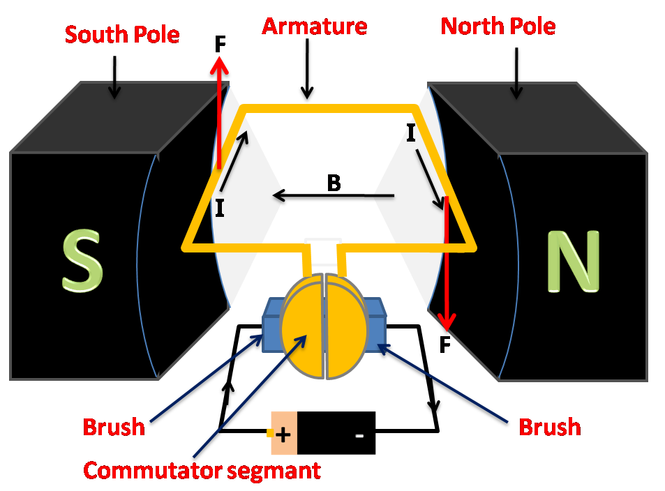

# Electric Motor

> **Node ID**: energy.electricity.motor
> **Domain**: [Energy](./index.md)
> **Dependencies**: [`energy.electricity`](electricity.md), [`machine-tools.machining`](../machine-tools/machining.md), [`metals.iron-steel`](../metals/iron-steel.md)
> **Enables**: all factory mechanization, pumps, fans, compressors, conveyors
> **Timeline**: Years 15-25
> **Outputs**: rotary_mechanical_power_electric
> **Critical**: Yes — electric motors are the universal prime mover for factory mechanization, replacing line shafts and enabling individual machine drive

## Overview

> *Electric motor working process diagram*

> *Image: K.Venkataramana, CC BY-SA 4.0*

An electric motor converts electrical energy into mechanical rotation through the interaction of magnetic fields. Current-carrying conductors in a magnetic field experience a force (Lorentz force): F = I × L × B, where I is current, L is conductor length, and B is magnetic flux density. In a motor, the armature (rotor) windings carry current in a magnetic field produced by field poles (stator), creating torque that rotates the shaft.

Electric motors are the universal prime mover for factory mechanization. Once [electricity generation](electricity.md) is established, motors replace line shafts, belts, and steam engines for individual machine drive — each machine gets its own motor, eliminating the mechanical complexity and danger of shaft-and-belt power distribution. A civilization that can build motors and generators has the foundation for all modern manufacturing: machine tools, pumps, compressors, conveyors, and fans all run on electric motors.

The two dominant motor types — DC and AC induction — each have distinct roles in the bootstrap sequence. DC motors arrive first because they work with early battery and generator systems and offer straightforward speed control by varying armature voltage. AC induction motors arrive once three-phase power distribution is established and become the workhorse of industrial electrification due to their simplicity, reliability, and low cost per kilowatt. Cross-reference: [Generator](generator.md) for the reverse conversion; [Power Distribution](power-distribution.md) for motor protection and wiring.

**DC motors** use a commutator to reverse current direction each half-turn, maintaining continuous torque in one direction. Three winding configurations exist: series-wound (field and armature in series — high starting torque, variable speed), shunt-wound (field and armature in parallel — constant speed, moderate starting torque), and compound-wound (combination of both). A DC motor is mechanically identical to a DC generator — any dynamo can operate as a motor.

**AC induction motors** (the most common industrial motor) operate on a different principle: the stator's three-phase winding creates a rotating magnetic field that sweeps past the rotor conductors, inducing current in them (by transformer action). The induced current in the rotor interacts with the rotating field, producing torque. The rotor always spins slightly slower than the rotating field (slip), typically 2-5% below synchronous speed. No commutator, no brushes — the induction motor is simpler, more robust, and lower-maintenance than any DC motor.

Synchronous speed: n_s = 120 × f / p, where f = supply frequency (Hz) and p = number of poles. At 50 Hz with 4 poles: n_s = 1500 RPM. Actual rotor speed: 1425-1470 RPM (3-5% slip).

## Prerequisites

- [Copper wire](electricity.md) — drawn and insulated
- [Silicon steel laminations](../metals/iron-steel.md) — for stator and rotor cores
- [Lathe](../machine-tools/machining.md) — for shaft and housing machining
- [Die-casting or casting](../metals/casting.md) — for aluminum rotor bars (induction motor)
- [Insulating materials](../polymers/thermoplastics.md) — enamel, kraft paper, varnish

## Bill of Materials

### DC Motor (5 kW, 220V, 1500 RPM)

| Material | Quantity | Specifications | Source | Alternatives |
|----------|----------|----------------|--------|-------------|
| [Copper magnet wire (armature)](electricity.md) | 5-10 kg | 0.8-1.5 mm diameter, enamel insulated | [Wire Drawing](electricity.md) | Aluminum wire (60% conductivity) |
| [Copper magnet wire (field)](electricity.md) | 3-6 kg | 0.5-1.0 mm diameter, enamel insulated | [Wire Drawing](electricity.md) | — |
| [Silicon steel laminations](../metals/iron-steel.md) | 20-40 kg | 0.35-0.50 mm thick, 3% Si | [Iron & Steel](../metals/iron-steel.md) | Low-carbon steel (higher loss) |
| [Steel shaft](../metals/iron-steel.md) | 1 piece | 35-50 mm diameter × 250-400 mm | [Machining](../machine-tools/machining.md) | — |
| [Cast iron frame](../metals/casting.md) | 1 piece | 150-250 mm diameter | [Foundry](../metals/casting.md) | Fabricated steel |
| [Copper commutator](../metals/copper-bronze.md) | 1 assembly | 20-40 segments, hard-drawn copper | [Wire Drawing](electricity.md) | — |
| [Carbon brushes](../chemistry/index.md) | 4 pcs | Carbon-graphite, matched to commutator size | [Chemistry](../chemistry/index.md) | Copper gauze (high wear) |
| [Bearings](../machine-tools/bearings-abrasives.md) | 2 pcs | Ball bearings, shaft diameter matched | [Machine Tools](../machine-tools/index.md) | Sleeve bearings |
| [Insulation](../polymers/thermoplastics.md) | 1-3 kg | Shellac, kraft paper, cotton tape | [Polymers](../polymers/index.md) | Silk, mica |

### AC Induction Motor (7.5 kW, 400V three-phase, 4-pole)

| Material | Quantity | Specifications | Source | Alternatives |
|----------|----------|----------------|--------|-------------|
| [Copper magnet wire (stator)](electricity.md) | 10-20 kg | 0.8-1.5 mm, enamel insulated, three-phase | [Wire Drawing](electricity.md) | Aluminum wire (larger gauge) |
| [Silicon steel laminations (stator)](../metals/iron-steel.md) | 40-70 kg | 0.35-0.50 mm, internal slots | [Iron & Steel](../metals/iron-steel.md) | Low-carbon steel |
| [Silicon steel laminations (rotor)](../metals/iron-steel.md) | 15-30 kg | 0.35-0.50 mm, external slots | [Iron & Steel](../metals/iron-steel.md) | Solid iron rotor (very inefficient) |
| [Aluminum rotor bars](../metals/aluminum.md) | 2-5 kg | Cast into rotor slots, end rings | [Casting](../metals/casting.md) | Copper bars (more expensive, lower loss) |
| [Steel shaft](../metals/iron-steel.md) | 1 piece | 40-55 mm diameter × 300-450 mm | [Machining](../machine-tools/machining.md) | — |
| [Cast iron frame](../metals/casting.md) | 1 piece | 200-300 mm diameter, with cooling fins | [Foundry](../metals/casting.md) | Fabricated steel |
| [Bearings](../machine-tools/bearings-abrasives.md) | 2 pcs | Ball bearings, sealed | [Machine Tools](../machine-tools/index.md) | Sleeve bearings |
| [Insulation](../polymers/thermoplastics.md) | 2-4 kg | Enamel, kraft paper, pressboard, varnish | [Polymers](../polymers/index.md) | Mica, glass fiber |
| [Cooling fan](../metals/iron-steel.md) | 1 piece | Aluminum or steel, mounted on shaft | [Casting](../metals/casting.md) | Fabricated |

## Process Description

### DC Motor

1. **Fabricate the armature core** by stacking silicon steel laminations on the shaft with keyway alignment. Clamp with end plates. Each lamination has slots for winding conductors.

2. **Wind the armature coils** into the slots. Calculate turns per coil based on the back-EMF equation: E = V - I_a × R_a - brush_drop. Each coil is wound into two slots approximately one pole pitch apart. Insulate slots with kraft paper before winding. Secure with fiber wedges.

3. **Connect coil leads to commutator segments** in sequence. Solder all joints. The commutator assembly must be concentric with the shaft within 0.02 mm to prevent brush bouncing at speed.

4. **Wind the field poles** on laminated pole pieces mounted inside the frame. For a shunt motor, the field winding has many turns of fine wire (high resistance, low current). For a series motor, fewer turns of thick wire (low resistance, high current). For compound: both windings on each pole.

5. **Assemble the motor**: Install the armature in the frame with bearings. Adjust the air gap between armature and field poles to 0.5-1.5 mm uniformly. Mount brush holders with carbon brushes positioned at the geometric neutral plane (where armature coils have zero EMF).

6. **Set brush position** for sparkless commutation. Shift the brush holder slightly in the direction of rotation until sparking is minimized under load. Lock the position.

**Strengths**:
- Excellent speed control over a wide range (10:1 by armature voltage, 4:1 by field weakening) — unmatched by any other motor type without electronic drives
- High starting torque (3-5× rated for series-wound) — ideal for traction, hoists, and crushers
- Mechanically identical to a DC generator — any dynamo can operate as a motor, simplifying bootstrap manufacturing

**Weaknesses**:
- Commutator and brushes wear out (2,000-10,000 hour brush life) — regular maintenance required
- Sparking at the commutator limits use in hazardous atmospheres (dust, gas, vapor)
- Brush friction and commutator losses reduce efficiency below induction motors at equivalent power

### AC Induction Motor

7. **Fabricate the stator core** by stacking laminations with internal slots in a steel frame. The frame has cooling fins cast integrally for surface cooling. Clamp laminations with end rings and through-bolts.

8. **Wind the stator** with three-phase distributed windings. Each phase occupies approximately one-third of the total slots. Use double-layer winding (two coil sides per slot) with 120° electrical displacement between phases. Insulate between phases and between layers.

9. **Connect the windings** in star (wye) configuration for 400V operation, or delta for 230V. Bring six leads out (three phase starts, three phase ends) to a terminal box, allowing field conversion between star and delta. Star-delta starting uses delta for running and star for reduced-voltage starting.

10. **Fabricate the rotor core** from silicon steel laminations with external slots (semi-closed or closed). Stack on the shaft with keyway.

11. **Cast aluminum rotor bars** using die-casting or centrifugal casting: heat the stacked rotor laminatures to 400-500°C, inject molten aluminum (660°C) into the rotor slots under pressure. The aluminum fills the slots and forms end rings at both ends simultaneously, creating the squirrel-cage winding. This is a single short-circuited winding — no external connections needed.

12. **Turn the rotor OD** on a lathe to achieve the designed air gap: 0.3-0.8 mm between rotor surface and stator bore. Surface finish: Ra 1.6 μm. The air gap must be uniform around the entire circumference.

13. **Assemble the motor**: Install the rotor in the stator frame with bearings at both ends. Mount the cooling fan on the non-drive end of the shaft. Install end shields (bearing housings) and verify rotor spins freely.

14. **Varnish-impregnate the stator** by dipping the wound stator in insulating varnish, draining excess, and baking at 130-150°C for 4-6 hours. This locks windings in place and improves heat transfer and moisture resistance.

**Strengths**:
- No commutator or brushes — zero maintenance on the rotor, the most reliable motor type available
- Robust and simple construction — squirrel-cage rotor is a solid aluminum casting with no windings, connections, or wearing parts
- Lowest cost per kW of any motor type — no permanent magnets, no commutator, minimal copper in the rotor
- Inherently explosion-proof — no sparking parts, safe for hazardous atmospheres (with appropriate enclosure)

**Weaknesses**:
- Poor speed control without a variable-frequency drive — speed is fixed by supply frequency and pole count
- Low starting torque relative to starting current (draws 4-8× rated current but produces only 1.5-2.5× rated torque on direct-on-line start)
- Draws reactive power (low power factor when lightly loaded), increasing supply cable and generator sizing
- Fixed speed determined by supply frequency and pole count — not adjustable by simple electrical means

## Calibration and Verification

1. **Insulation resistance**: Megger between windings and frame at 500V DC. Minimum: 20 MΩ cold. Below 5 MΩ — do not energize (moisture or insulation damage).

2. **No-load test**: Apply rated voltage, run unloaded. Measure current (no-load current should be 25-40% of rated current for induction motors), speed (should be close to synchronous speed with minimal slip), and input power (core loss + friction and windage).

3. **Locked-rotor test** (induction motor): Lock the rotor, apply reduced voltage (25-40% of rated), measure current and torque. This determines starting torque and starting current. Starting current is typically 4-8× rated current for direct-on-line starting.

4. **Load test**: Run at rated load for 2 hours. Monitor winding temperature (by resistance or embedded thermocouple). Temperature rise must not exceed insulation class limit: Class B = 80°C rise, Class F = 105°C rise, Class H = 125°C rise.

5. **Vibration check**: Measure vibration at each bearing housing. Acceptable: <2.5 mm/s RMS for 1500 RPM motors. Excessive vibration indicates rotor imbalance, misalignment, or bearing defect.

## Quantitative Parameters

### DC Motor

| Parameter | Value |
|-----------|-------|
| Power range | 0.1-500 kW |
| Speed range | 100-3000 RPM (adjustable by voltage or field control) |
| Efficiency | 80-92% (larger units higher) |
| Starting torque (series) | 3-5× rated torque |
| Starting torque (shunt) | 1.5-2.5× rated torque |
| Speed regulation (shunt) | 5-10% no-load to full-load |
| Speed control range | 10:1 by armature voltage, 4:1 by field weakening |
| Brush life | 2,000-10,000 hours |

### AC Induction Motor

| Parameter | Value |
|-----------|-------|
| Power range | 0.1-50,000+ kW |
| Speed (4-pole, 50 Hz) | 1440-1470 RPM (synchronous: 1500 RPM) |
| Slip at full load | 2-5% |
| Efficiency | 85-96% (larger units higher) |
| Starting current | 4-8× rated current (direct-on-line) |
| Starting torque | 1.5-2.5× rated torque |
| Power factor at full load | 0.80-0.90 |
| Service life (bearings) | 20,000-100,000 hours |

## Scaling Notes

| Scale | Power | Application | Typical Frame Size | Weight |
|-------|-------|-------------|-------------------|--------|
| Fractional | 0.05-0.75 kW | Fans, small pumps, power tools | 80-100 mm frame | 5-15 kg |
| Small industrial | 1-15 kW | Machine tools, conveyors, compressors | 140-200 mm frame | 20-150 kg |
| Medium industrial | 15-150 kW | Large pumps, fans, crushers | 250-400 mm frame | 150-1500 kg |
| Large industrial | 150-1000 kW | Mine hoists, rolling mills, large compressors | 500-800 mm frame | 1500-8000 kg |
| Power station | 1-50+ MW | Power plant auxiliaries, ship propulsion | Custom | 10-200 tonnes |

Motor sizing scales roughly as P ∝ D² × L × n, where D = rotor diameter, L = rotor length, n = speed. Doubling power at the same speed requires ~41% increase in linear dimensions. Above ~500 kW, synchronous motors (with wound rotor fed by DC excitation) replace induction motors for constant-speed applications because they can operate at unity power factor, reducing the reactive power burden on the electrical system.

Minimum practical size for bootstrap manufacturing: a 1 kW induction motor (140 mm frame, 4-pole, 1400 RPM) can be built with basic lathe and winding capabilities. Below 100 W, the precision required for small air gaps (<0.3 mm) and fine wire winding makes hand construction impractical.

## Troubleshooting

| Problem | Probable Cause | Solution |
|---------|---------------|----------|
| Motor hums but does not start (single-phase) | Failed start capacitor or open centrifugal switch | Test capacitor with multimeter (should show capacitance within ±10% of rating); check centrifugal switch contacts |
| Motor hums but does not start (three-phase) | Single-phasing — one phase lost | Check all three supply phases with a voltmeter; check fuses and contactors. Do not run a three-phase motor on two phases — it will overheat rapidly |
| Excessive vibration | Rotor imbalance or misalignment | Balance the rotor (static balance for low speed, dynamic balance above 1500 RPM); align motor-to-load coupling within 0.05 mm |
| Bearing noise (grinding, whining) | Bearing wear or contamination | Replace bearings; check lubrication — over-greasing causes heating, under-greasing causes wear |
| Overheating under load | Excessive load or poor ventilation | Measure current — if above nameplate rating, reduce load. Clean cooling fins and check fan rotation. Ambient temperature above 40°C requires derating |
| Sparking at brushes (DC) | Worn brushes, rough commutator, or brush misalignment | Replace brushes if worn below 50% of original length; resurface commutator (turn on lathe to 0.8 μm finish); undercut mica between segments 1-1.5 mm below copper |
| Low insulation resistance | Moisture or contaminant ingress | Dry windings by baking at 100-110°C for 12-24 hours. Re-test insulation resistance. If still below 5 MΩ, re-varnish windings |
| High current at no load | Shorted turns in stator winding or worn bearings | Measure no-load current — should be 25-40% of rated for induction motors. Higher indicates internal short circuit — rewind affected coil |

## Quality Control

- **Insulation resistance**: Megger test at 500V DC between windings and frame before first operation and after any maintenance. Minimum 20 MΩ cold. Below 5 MΩ — do not energize. Moisture is the most common cause; dry before re-testing.
- **Winding resistance balance**: Measure resistance of each phase winding with a low-resistance ohmmeter (four-wire method). Maximum imbalance between phases: 2%. Greater imbalance indicates a shorted turn or poor connection.
- **No-load current**: Run at rated voltage with no load. Record current on each phase. No-load current should be 25-40% of rated current (induction) or 10-20% (DC shunt). High no-load current indicates core damage or shorted turns.
- **Locked-rotor torque**: For induction motors, verify starting torque meets specification by locking the rotor and applying rated voltage briefly (<5 seconds to avoid overheating). Measure torque with a lever arm and spring scale. Starting torque should be 1.5-2.5× rated torque.
- **Temperature rise test**: Run at full rated load for 2 hours minimum (4 hours for motors >50 kW). Measure winding temperature by resistance: T = (R_hot/R_cold - 1)/0.004 + T_cold. Temperature rise must not exceed insulation class rating: Class B = 80°C, Class F = 105°C, Class H = 125°C (all measured by resistance method above ambient).
- **Vibration**: Measure at each bearing housing with a vibration meter. Acceptable limits: <1.8 mm/s RMS for 3000 RPM, <2.8 mm/s for 1500 RPM (ISO 10816 Grade A). Exceeding Grade B indicates a problem requiring correction.

## Variations and Alternatives

### Universal Motor (AC/DC)

A series-wound motor that operates on both AC and DC power. The commutator reverses both armature and field current simultaneously, maintaining torque direction regardless of supply polarity. Speed: 5,000-20,000 RPM — much faster than induction motors at 50/60 Hz. Used in power tools, appliances, and traction applications. Brush wear limits service life to 500-2,000 hours. Efficiency: 50-70%. Suitable for bootstrap contexts where only one motor type can be manufactured for both AC and DC systems.

### Synchronous Motor

The rotor rotates at exactly the synchronous speed (no slip). Requires DC excitation of the rotor field winding. Used where constant speed is essential (clocks, record players) and for power factor correction in industrial plants (over-excited synchronous motors supply reactive power). Not self-starting — requires a starting mechanism (pony motor, damper windings, or variable-frequency start). Efficiency: 90-97%. Manufacturing complexity is higher than induction motors due to the wound rotor and slip rings.

### Stepper Motor

A brushless DC motor that rotates in discrete steps (typically 1.8° or 7.5° per step) in response to electrical pulses. Used for precision positioning in machine tools and instruments. Not covered in detail here — requires electronic drive circuitry that arrives later in the bootstrap sequence. Relevant to [Precision Motion](../precision-motion/index.md) and [Automation](../automation/index.md).

## Safety

- **Electrical shock**: Motor terminals carry lethal voltage (220V+). Ground the motor frame to earth. De-energize and lock out/tag out before servicing. Use insulated tools. A 220V shock across the chest can cause ventricular fibrillation at currents as low as 30 mA.
- **Rotating parts**: Couplings, belts, and pulleys rotating at 750-3600 RPM can entangle clothing, hair, or fingers. Guard all rotating parts with sheet metal or mesh guards. A lathe chuck driven by a 5 kW motor at 1500 RPM has enough torque to amputate a finger in milliseconds.
- **Thermal**: Overloaded motors overheat, damaging insulation and potentially igniting nearby combustible materials. Install overload relays on all motor circuits (trip at 115% of rated current within 2 hours). Class H insulation (180°C hot-spot limit) provides the highest thermal margin.
- **Starting current**: Large induction motors draw 4-8× rated current on direct-on-line start, causing voltage dips that affect other equipment and mechanical shock that shortens bearing and coupling life. Use star-delta starters for motors >15 kW, auto-transformer starters for >75 kW, or variable-frequency drives for smooth acceleration.
- **Dust and moisture**: Motors in dusty environments (workshops, mines) must be totally-enclosed fan-cooled (TEFC) — no ventilating openings. In wet environments, use IP55 or IP65 rated enclosures. Open drip-proof (ODP) motors are acceptable only in clean, dry indoor locations.

## References

- [Electricity Generation](electricity.md) — power supply for motors, wire drawing, electrical fundamentals
- [Generator](generator.md) — reverse conversion (mechanical to electrical)
- [Transformer & Power Distribution](power-distribution.md) — power supply and motor protection
- [Machine Tools](../machine-tools/machining.md) — precision machining of shafts and housings
- [Bearings & Abrasives](../machine-tools/bearings-abrasives.md) — bearing selection and lubrication
- [Variable Frequency Drive](../electronics/power-electronics.md) — speed control for AC motors

---

*Part of the [Bootciv Tech Tree](../../index.md) • [Energy](./index.md) • [All Domains](../../index.md)*
