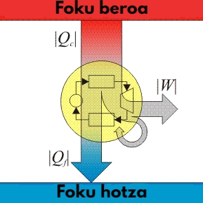

# Heat Engines

> **Node ID**: energy.engine
> **Domain**: [Energy](./index.md)
> **Dependencies**: [`energy.fuels`](fuels.md), `metals`, [`petroleum.refining`](../petroleum/refining.md)
> **Enables**: [`energy.electricity.power-systems`](electricity.md), [`marine.propulsion`](../marine/propulsion.md), `transport`, [`transport.aviation`](../transport/aviation.md)
> **Timeline**: Years 15-50+
> **Outputs**: mechanical_power, internal_combustion_engines, gas_turbine_power
> **Critical**: No — engines enable motorized transport and portable power but are not on the critical path to semiconductor manufacturing

Converting chemical energy stored in fuel into mechanical work is the transformation that powers industrial civilization. Before heat engines, the only practical sources of mechanical power were human and animal muscle, water wheels, and windmills, each limited by geography, weather, and modest power output. Heat engines broke this constraint by unlocking the energy density of solid, liquid, and gaseous fuels. A liter of gasoline contains roughly 34 MJ of energy, equivalent to a day of hard manual labor compressed into a few minutes of combustion.

Four engine types form a natural progression, each building on the capabilities established by its predecessors. The [Stirling engine](stirling-engine.md), an external combustion design with closed-cycle operation, serves as a bridge from steam technology. The [Otto cycle](internal-combustion.md) gasoline engine introduces internal combustion with spark ignition. The [Diesel cycle](internal-combustion.md) pushes compression higher for better efficiency. [Gas turbines](gas-turbine.md), the most demanding to manufacture, achieve the highest power density and enable jet aviation. [Steam engines](steam-engine.md), external combustion predecessors, launched the Industrial Revolution but carry inherent weight limitations.

## Focused Articles

> *Image: Andy Dingley (scanner), Public domain*

Each engine type has a dedicated article with full detail:

- [Stirling Engine](stirling-engine.md) — Closed-cycle external combustion. Any heat source works (solar, biomass, waste heat). Achievable with lathe and basic foundry.
- [Internal Combustion Engines](internal-combustion.md) — Otto cycle (gasoline, spark ignition) and Diesel cycle (compression ignition). Precision machining at 10-25 μm tolerances. The backbone of motorized transport and stationary power.
- [Gas Turbines](gas-turbine.md) — Brayton cycle continuous-flow engines. Highest power-to-weight ratio. Combined cycle achieves 55-60%+ efficiency. Requires nickel superalloys and investment casting.
- [Steam Engine](steam-engine.md) — Reciprocating steam engines. External combustion, any boiler fuel. The first practical mechanical prime mover independent of geography.

## Selection Guide

| Engine Type | Thermal Efficiency | Power/Weight (kW/kg) | Fuel | Best Use |
|------------|-------------------|---------------------|------|----------|
| Stirling | 5-40% | 0.001-0.05 | Any heat source | Small-scale power from solar, biomass, waste heat |
| Otto (gasoline) | 25-35% | 0.5-5 | Gasoline, producer gas | Road vehicles, small aircraft, portable generators |
| Diesel | 35-45% (up to 50% marine) | 0.1-1 | Diesel, biodiesel | Trucks, ships, generators, locomotives |
| Gas turbine (simple cycle) | 20-40% | 2-10 | Kerosene, natural gas | Aviation, peaking power, mechanical drive |
| Gas turbine (combined cycle) | 55-60% | 0.5-2 | Natural gas | Baseload power generation |

**Selection guidance**: For a bootstrap economy, the choice of engine type is driven primarily by what fuel and manufacturing capability are available, not by theoretical efficiency. If only biomass and basic foundry work are available, the Stirling engine is the only option. If petroleum distillation exists and machine tools can grind to 10 μm tolerance, the Otto cycle gasoline engine becomes feasible. If the additional precision for fuel injection nozzles can be achieved, the diesel engine is preferred for all stationary and heavy transport applications due to higher efficiency and longer life. Gas turbines should be pursued only after substantial experience with piston engines.

## Key Deliverables

- **Tier 1** (Years 15-25): Stirling engines for small-scale power generation from any heat source. Achievable with lathe and basic foundry work. Power output in the tens of watts to a few kilowatts.
- **Tier 2** (Years 20-30): Gasoline (Otto cycle) engines for road vehicles, small aircraft, and portable generators. 25-35% thermal efficiency, 0.5-5 kW/kg. Requires full machine tool chain and petroleum distillation.
- **Tier 3** (Years 25-40): Diesel engines for trucks, ships, industrial generators, and locomotives. 35-45% thermal efficiency. Requires precision fuel injection (0.1-0.3 mm nozzle orifices at 1000-2000 bar).
- **Tier 4** (Years 35-50+): Gas turbines for aviation and combined-cycle power generation at 55-60%+ efficiency. Requires nickel superalloys, investment casting, single-crystal blade technology.

## Efficiency Comparison

| Engine Type | Compression Ratio | Peak Pressure (bar) | Thermal Efficiency | Exhaust Temp (°C) |
|------------|-------------------|---------------------|-------------------|-------------------|
| Stirling | N/A (external) | 50-200 (working gas) | 5-40% | 100-300 |
| Otto (gasoline) | 8:1 to 12:1 | 50-80 | 25-35% | 600-900 |
| Diesel | 14:1 to 24:1 | 80-200 | 35-45% | 400-700 |
| Marine diesel | 14:1 to 24:1 | 80-150 | 45-50% | 250-400 |
| Gas turbine (simple) | 10:1 to 30:1 (pressure) | N/A (continuous flow) | 25-40% | 450-600 |
| Gas turbine (combined) | 10:1 to 30:1 (pressure) | N/A (continuous flow) | 55-60% | 80-120 |

## General Safety & Hazards

- **Exhaust carbon monoxide (CO)**: Colorless, odorless, lethal gas. Gasoline engines produce 1-10% CO in exhaust. Diesel engines produce 0.05-0.5% CO. Always operate in well-ventilated areas or route exhaust outside.
- **Noise**: Unmuffled engines produce 100-120 dB. Hearing protection required for extended operation.
- **Rotating machinery guards**: Install guards over all rotating components. Maintenance only with engine stopped.
- **Hot surfaces**: Exhaust manifolds reach 300-600°C. Allow 30+ minutes cooling before touching.
- **Fuel fires**: Gasoline ignites easily (flash point -43°C). Diesel is safer but atomized spray ignites readily. Fire extinguisher required near all operating engines.
- **Battery hazards**: Lead-acid batteries produce hydrogen gas during charging. Connect and disconnect with loads off.

## Engine Glossary

- **Bore**: Cylinder internal diameter. Typical range 60-120 mm for automotive engines, up to 960 mm for marine diesels.
- **Stroke**: Distance the piston travels from TDC to BDC.
- **Displacement**: Total swept volume of all cylinders. Calculated as π/4 × bore² × stroke × number of cylinders.
- **Compression ratio**: Ratio of cylinder volume at BDC to volume at TDC. Higher ratios yield higher efficiency but require stronger construction and (for gasoline) higher octane fuel.
- **TDC/BDC**: Top dead center (piston at highest position) / Bottom dead center (piston at lowest position).
- **BSFC**: Brake specific fuel consumption. Fuel consumed per unit of mechanical energy produced. Typical values: gasoline 250-350 g/kWh, diesel 190-240 g/kWh.
- **Volumetric efficiency**: Ratio of actual air mass drawn into the cylinder to the theoretical maximum. Naturally aspirated engines achieve 75-95%. Turbocharged engines exceed 100%.
- **Mean effective pressure (MEP)**: Theoretical constant pressure that would produce the same work as the actual pressure cycle. Typical: gasoline 8-12 bar, turbocharged diesel 15-25 bar.
- **Detonation (knock)**: Abnormal combustion where unburned mixture auto-ignites explosively. Causes rapid engine damage.
- **Supercharging**: Compressing intake air above atmospheric pressure. Mechanically driven (supercharger) or exhaust-driven (turbocharger).
- **Intercooler**: Heat exchanger cooling compressed air from turbocharger before it enters the engine.

## Bootstrap Progression

Heat engines follow a strict dependency chain — each generation builds on the materials, machining, and thermal management skills developed by its predecessor:

**Stage 1 — Stirling Engine (Years 15-25)**: Achievable with a lathe and basic foundry. The Stirling engine's external combustion means any heat source works — concentrated solar, biomass, waste heat. No petroleum refining needed, no precision fuel injection, no high-temperature combustion chamber design. Power output is modest (10 W to 5 kW) and efficiency is low (5-30%), but this is the first engine that converts heat to continuous mechanical work without geographic constraints (unlike water wheels and windmills). A Stirling engine driving a generator produces electricity for the first time from stored chemical energy (biomass) or concentrated solar thermal.

**Stage 2 — Steam Engine (Years 15-30)**: External combustion like the Stirling, but with higher power density and a larger industrial knowledge base. Requires boiler construction (pressure vessel at 5-20 bar), water treatment, and condenser design. Boiler explosions were the primary safety hazard of the early Industrial Revolution — thousands died before pressure vessel standards and safety valves became routine. Steam engines launched rail transport, steamships, and factory mechanization. Efficiency: 5-20%.

**Stage 3 — Otto Cycle Gasoline Engine (Years 20-30)**: The leap to internal combustion requires petroleum distillation (or producer gas from biomass gasification) and precision machining at 10-25 μm tolerance for cylinder bores, piston rings, and valve seats. The reward: 25-35% thermal efficiency in a package 10-50× lighter per kW than steam or Stirling engines. Gasoline engines enable road vehicles, small aircraft, and portable generators — the foundation of mobile industrial civilization.

**Stage 4 — Diesel Engine (Years 25-40)**: Higher compression ratio (14:1 to 24:1 vs. 8:1 to 12:1 for gasoline) yields 35-45% thermal efficiency. The critical manufacturing challenge is the fuel injection system: nozzle orifices of 0.1-0.3 mm diameter operating at 1000-2000 bar injection pressure. This requires precision grinding and hardening of injection pump components. Diesel engines become the backbone of heavy transport (trucks, ships, locomotives) and stationary power generation due to superior efficiency and durability.

**Stage 5 — Gas Turbine (Years 35-50+)**: Continuous-flow Brayton cycle. The turbine inlet temperature (1200-1600°C) exceeds the melting point of the nickel superalloy blades (1300-1400°C), requiring internal air cooling passages investment-cast into each blade. Single-crystal blade technology (eliminating grain boundaries that cause creep failure) is needed for long service life. Combined-cycle power plants (gas turbine + steam turbine on the exhaust heat) achieve 55-60%+ thermal efficiency — the most efficient heat-to-electricity conversion available. Gas turbines enable jet aviation and high-power-density electricity generation.

## Integration Points

| Technology Domain | Engine Contribution | Engine Dependency |
|-------------------|--------------------|-------------------|
| Agriculture | Tractors (diesel), irrigation pumps (diesel/stirling) | — |
| Mining | Haul trucks (diesel), ventilation fans (electric from engines), compressors | — |
| Metallurgy | Blowers for furnaces (early: steam, later: electric from engines), rolling mill drives | Steel for engine blocks, crankshafts |
| Machine Tools | Electric motor power (from engine-driven generators), hydraulic presses | Precision machining for engine components |
| Chemistry | Compressors for gas handling, mixers, pumps | Lubricants for engine oil |
| Petroleum | Pump jacks, pipeline compressors, refinery process heat | Petroleum distillation for gasoline/diesel fuel |
| Transport | Road vehicles (gasoline/diesel), railways (diesel-electric), ships (diesel), aircraft (gas turbine) | — |
| Electricity | Prime movers for generators: diesel gensets, gas turbine combined cycle, steam turbine | — |
| Construction | Excavators, bulldozers, cranes (diesel hydraulic) | — |
| Textiles | Power looms (early: steam, later: electric from engines) | — |
| Semiconductors | Cleanroom HVAC (electric from engine-driven power), process cooling | Ultra-precise temperature control (thermostats) |
| Computing | Data center power (diesel backup, gas turbine baseload) | — |

## Engine Materials by Component

| Component | Material | Key Properties | Manufacturing |
|-----------|----------|---------------|--------------|
| Cylinder block | Cast iron (class 25-40) or aluminum alloy | Wear resistance, thermal conductivity, damping | Sand casting, then machining |
| Piston | Aluminum alloy (forged) or cast iron | Low weight (aluminum), thermal expansion match | Forging + machining |
| Piston rings | Cast iron or steel | Wear resistance, spring tension, sealing | Centrifugal casting, machining |
| Crankshaft | Forged steel (4140, 4340) | Fatigue strength, torsional rigidity | Forging, turning, grinding |
| Connecting rod | Forged steel or powdered metal | Tensile and fatigue strength | Forging + machining |
| Valves (intake) | Steel (Silchrome, 21-4N) | Heat resistance, oxidation resistance | Forging, machining, heat treatment |
| Valves (exhaust) | Nickel superalloy (Inconel, Nimonic) | Creep resistance at 700-900°C | Forging, machining |
| Turbine blades | Nickel superalloy (CMSX-4, René N5) | Single-crystal creep resistance at 1100-1400°C | Investment casting, directional solidification |
| Bearings | Babbitt (SnSbCu) or copper-lead | Embeddability, fatigue strength | Casting into steel shell |
| Gaskets | Copper, steel, or composite | Seal under compression | Stamping, forming |

## See Also

- [Stirling Engine](stirling-engine.md) — closed-cycle external combustion
- [Internal Combustion Engines](internal-combustion.md) — Otto and Diesel cycle engines
- [Gas Turbines](gas-turbine.md) — Brayton cycle engines
- [Steam Engine](steam-engine.md) — reciprocating steam engines
- [Fuels](fuels.md) — Liquid fuel properties and alternatives
- [Steam Power](steam-power.md) — External combustion predecessor
- [Electricity Generation](electricity.md) — Generators driven by engines
- [Railways](../transport/railways.md) — Diesel locomotive applications
- [Aviation](../transport/aviation.md) — Aircraft engine requirements
- [Lubricants](../chemistry/lubricants.md) — Engine oil and lubrication
- [Machining](../machine-tools/machining.md) — Precision machining for engine components

## Scaling Notes

Heat engine production scales dramatically with precision manufacturing capability:

- **Workshop scale** (1-10 engines/year): Hand-finished cast iron cylinder blocks bored on a lathe. File-fitted piston rings. Sand-cast crankshafts with hand-ground journals. Fuel systems using simple carburetors or gravity-feed drip systems. Stirling and simple steam engines are feasible. Gasoline engines possible but with short service life (500-2,000 hours). One skilled machinist + one foundry worker.

- **Factory scale** (100-10,000 engines/year): Machined cylinder blocks on milling machines. Precision-bored cylinders to ±10 μm. Ground crankshafts with ±5 μm journal tolerance. Die-cast pistons. Mass-produced carburetors or simple mechanical fuel injection. Diesel engines with basic fuel injection pumps. 50-200 workers. This scale supports regional transport, agriculture, and power generation needs.

- **Industrial scale** (100,000+ engines/year): CNC-machined components. Automated assembly lines. Electronic fuel injection with ECU-controlled injection timing. Turbochargers. Catalytic converters for emissions control. 1,000-10,000 workers. This scale supplies an industrialized nation's vehicle fleet and power generation.

- **Advanced scale** (gas turbines, low volume): Investment-cast nickel superalloy turbine blades with internal cooling passages. Single-crystal directional solidification furnaces. Automated welding and brazing of hot-section components. 100-500 workers, highly specialized. Production rate: 10-1,000 turbine engines/year.

**Critical bottleneck**: The jump from Otto cycle to Diesel cycle is limited by fuel injection precision. A diesel injection nozzle must meter 5-50 mm³ of fuel per injection event at 1000-2000 bar through orifices of 0.1-0.3 mm diameter. This requires grinding and lapping capability that exceeds what is needed for any other engine component. The jump to gas turbines is limited by turbine blade materials — operating at 1200-1600°C while under centrifugal stress of 150-250 MPa requires nickel superalloys with internal cooling, which in turn require investment casting and often single-crystal solidification.

## Quality Control

| Check | Method | Acceptance Criteria |
|-------|--------|-------------------|
| Cylinder bore diameter | Dial bore gauge at 3 positions | ±10 μm taper, ±5 μm out-of-round |
| Cylinder bore surface finish | Profilometer | Ra 0.2-0.8 μm (honed finish) |
| Piston-to-cylinder clearance | Outside micrometer (piston) + bore gauge (cylinder) | 25-75 μm depending on bore diameter and material |
| Crankshaft journal diameter | Outside micrometer | ±5 μm on main and crankpin journals |
| Crankshaft runout | Dial indicator on journals | <0.02 mm total runout |
| Valve seat sealing | Vacuum test or liquid penetrant | Zero leakage at 0.5 bar vacuum |
| Compression ratio verification | BDC/TDC volume measurement (burette method) | ±0.2 of specified ratio |
| Oil pressure (running engine) | Oil pressure gauge at operating temp | 200-500 kPa at idle, 300-600 kPa at speed |
| Coolant system pressure test | Pressurize to 1.0-1.5 bar, hold 15 min | Zero pressure drop |
| Exhaust emissions (if regulated) | Exhaust gas analyzer | CO <1%, HC <100 ppm (varies by regulation) |

## Variations and Alternatives

| Power Source | Efficiency | Power/Weight | Fuel | Best Use | Limitation |
|-------------|-----------|-------------|------|----------|-----------|
| Human muscle | ~25% (metabolic) | ~0.001 kW/kg | Food | Emergency backup | Extremely low power |
| Animal (ox, horse) | ~25% | ~0.003 kW/kg | Fodder | Pre-industrial agriculture | Geography-limited |
| Water wheel | 30-60% (hydraulic) | N/A | Flowing water | Milling, early factories | Requires river/flow |
| Windmill | 15-35% | N/A | Wind | Milling, pumping | Weather-dependent |
| Stirling engine | 5-40% | 0.001-0.05 kW/kg | Any heat source | Solar thermal, waste heat | Low power density |
| Steam engine | 5-20% | 0.01-0.1 kW/kg | Any boiler fuel | Industrial, historical | Heavy, boiler explosion risk |
| Steam turbine | 30-45% | 0.1-1 kW/kg | Any boiler fuel | Power generation | High capital cost |
| Otto (gasoline) | 25-35% | 0.5-5 kW/kg | Gasoline, producer gas | Road vehicles, aircraft | Knock-limited compression |
| Diesel | 35-50% | 0.1-1 kW/kg | Diesel, biodiesel | Trucks, ships, generators | Fuel injection precision |
| Gas turbine (simple) | 25-40% | 2-10 kW/kg | Kerosene, natural gas | Aviation, peaking power | Blade materials |
| Gas turbine (combined) | 55-60% | 0.5-2 kW/kg | Natural gas | Baseload power | High capital cost |
| Fuel cell | 40-60% | 0.01-1 kW/kg | Hydrogen, natural gas | Distributed power | Requires pure hydrogen or reformer |
| Photovoltaic | 15-25% | 0.01-0.1 kW/kg | Sunlight | Distributed solar | Intermittent, area-intensive |

**Key insight for bootstrapping**: No single power source dominates at all stages. A bootstrapping civilization starts with water wheels and windmills (geography-dependent but zero fuel cost), adds Stirling and steam engines (fuel-flexible, moderate efficiency), then progresses to internal combustion (high power density, requires petroleum). The transition from one stage to the next is driven by manufacturing capability, not by efficiency alone. A 10% efficient Stirling engine built with a lathe and foundry is more useful than a 40% efficient diesel engine that cannot yet be manufactured.

## Fuel Requirements by Engine Type

| Engine | Primary Fuel | Alternative Fuels | Energy Density (MJ/kg) | Storage Requirements |
|--------|------------|------------------|----------------------|---------------------|
| Stirling | Any heat source | Solar, biomass, waste heat | N/A (external combustion) | Fuel pile, solar concentrator, or waste heat stream |
| Steam | Coal, wood, biomass | Any combustible solid/liquid | 15-30 (coal), 8-15 (wood) | Coal pile or wood lot; water treatment for boiler |
| Otto (gasoline) | Gasoline | Producer gas, ethanol, LPG | 44-46 (gasoline), 20-26 (ethanol) | Sealed metal tank; gasoline flash point -43°C (fire hazard) |
| Diesel | Diesel fuel | Biodiesel, vegetable oil, kerosene | 42-45 (diesel), 37-40 (biodiesel) | Sealed metal tank; diesel flash point 52-96°C (safer than gasoline) |
| Gas turbine | Kerosene, natural gas | Jet A, propane, biogas | 42-46 (kerosene), 38-50 (NG by volume) | Pressure vessels (NG), sealed tanks (kerosene) |

**Fuel chain dependency**: Each engine type requires a specific fuel supply chain. Stirling engines are the least constrained (any heat source). Steam engines require only combustible fuel and water. Gasoline engines require petroleum distillation (or biomass gasification for producer gas). Diesel engines require the same but with additional distillation cuts. Gas turbines require high-quality kerosene or natural gas. The availability of the fuel supply chain often determines which engine type is practical, independent of the engine's thermodynamic efficiency.

---

*Part of the [Bootciv Tech Tree](../index.md) · [Energy](./index.md) · [All Domains](../index.md)*
