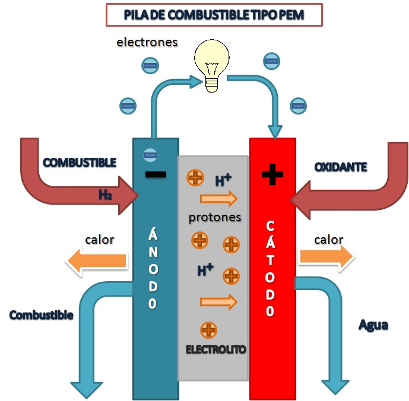

# Fuel Cell

> **Node ID**: energy.fuel-cell
> **Domain**: [Energy](./index.md)
> **Dependencies**: [`Electrolysis`](../chemistry/electrolysis.md), [`Water Electrolysis`](../chemistry/water-electrolysis.md), [`Energy Storage & Diversification`](storage.md)
> **Enables**: [`Chemistry`](../chemistry/index.md), [`Water Electrolysis (H₂/O₂)`](../chemistry/water-splitting.md)
> **Timeline**: Years 30-50
> **Outputs**: electricity, water, heat
> **Critical**: No

## Overview

> *Diagrama de pila de combustilbe tipo PEM*

> *Image: Amalia1983, CC BY-SA 3.0*

Proton exchange membrane fuel cells converting hydrogen and oxygen to electricity, water, and heat. Provides efficient distributed power generation for applications requiring clean, quiet energy conversion.

Several fuel cell types serve different operating regimes. PEM fuel cells operate at moderate temperatures with a solid polymer electrolyte membrane, offering fast startup and compact form factor. Solid oxide fuel cells (SOFC) run at much higher temperatures with a ceramic electrolyte, achieving higher electrical efficiency and tolerating a wider range of hydrocarbon fuels including natural gas and biogas. Molten carbonate fuel cells (MCFC) operate at intermediate high temperatures and are suited for large-scale stationary power generation.

The choice of fuel cell type depends on the application. PEM cells dominate transportation and portable power due to their rapid response and compact size. SOFC systems excel in combined heat and power installations where the high-temperature exhaust provides process heat or building heating. For bootstrap industrial scenarios, PEM cells using electrolytic hydrogen offer the simplest path to fuel cell power generation.

The modular nature of fuel cell systems, with power output scaling by adding cells to the stack, allows incremental capacity expansion that matches demand growth, unlike large centralized power plants that must be built to full capacity from the outset.

## Prerequisites

### Materials

- Hydrogen fuel (electrolytic purity, or reformed from hydrocarbons with CO cleanup)
- Platinum or platinum-group metal catalysts for PEM anode and cathode
- Nafion or equivalent perfluorosulfonic acid membrane for PEM electrolyte
- Ceramic electrolyte (yttria-stabilized zirconia) for SOFC
- Bipolar plates (graphite composite or stainless steel)

### Equipment

- [Electrolysis](../chemistry/electrodialysis.md) — tool dependency
- [Water Electrolysis](../chemistry/water-electrolysis.md) — material dependency
- [Energy Storage & Diversification](storage.md) — tool dependency
- Fuel cell stack with membrane electrode assemblies
- Gas management and humidification system

### Knowledge

- Knowledge of electrochemistry: anode/cathode half-reactions, ion transport through membranes, and polarization behavior
- Understanding of hydrogen storage and handling safety protocols (flammmability range, ignition energy, embrittlement)
- Ability to interpret polarization curves and individual cell voltage monitoring data
- Safety training for high-voltage DC systems and hydrogen gas hazards
- Familiarity with membrane electrode assembly construction and degradation mechanisms
- Understanding of reactant gas humidification requirements and water management in PEM cells

### Infrastructure

- Hydrogen storage and delivery infrastructure with leak detection and ventilation
- Power conditioning equipment (DC-DC converter or inverter) for electrical output
- Thermal management system for heat recovery or rejection
- Water supply for reactant humidification and cooling
- Ventilated enclosure or dedicated fuel cell room with hydrogen detectors
- Nitrogen purge system for emergency hydrogen line clearing

## Process Description

A fuel cell converts the chemical energy of hydrogen and oxygen directly to electricity through electrochemical reactions separated by an electrolyte membrane. No combustion occurs. The process is governed by the thermodynamics of the H₂/O₂ reaction and the kinetics of the electrode catalysts.

### Step-by-Step Procedure

1. Supply hydrogen gas to the anode side of the fuel cell stack. Verify gas purity meets the minimum requirement for the cell type. PEM cells require CO content below 10 ppm to prevent platinum catalyst poisoning.
2. Supply oxygen or air to the cathode side. Humidify the reactant gases if required by the membrane type to maintain Nafion electrolyte hydration. Dry membranes lose proton conductivity and develop hot spots.
3. At the anode, the platinum catalyst dissociates H₂ into protons (H⁺) and electrons. Protons migrate through the Nafion membrane electrolyte to the cathode. Electrons cannot cross the membrane and flow through the external circuit as usable electrical current.
4. At the cathode, oxygen combines with the arriving protons and electrons on the platinum catalyst surface to form water. Manage water removal from the flow channels to prevent flooding of the gas diffusion layers, which blocks reactant access to the catalyst.
5. Collect the electrical output through the current collectors and bipolar plates. Multiple cells are stacked in series to achieve the desired voltage. A typical PEM cell produces 0.6-0.7 V under load; a 100-cell stack produces 60-70 V DC.
6. Manage thermal output. Fuel cells generate waste heat that must be removed to maintain operating temperature. For PEM cells, cooling water circuits maintain the 60-80°C operating range. For SOFC, the 600-1000°C exhaust heat is recovered for combined heat and power applications.

### Process Parameters

| Parameter | Range | Notes |
|-----------|-------|-------|
| PEM operating temperature | 60–80°C | Polymer membrane hydration range |
| SOFC operating temperature | 600–1000°C | Ceramic electrolyte ionic conductivity range |
| PEM cell voltage (loaded) | 0.6–0.7 V | Per cell under typical current density |
| Current density | 0.5–1.5 A/cm² | Higher current reduces cell voltage |
| Hydrogen purity requirement | >99.99% | PEM; CO must be below 10 ppm |
| Stack electrical efficiency | 40–60% | Higher at partial load |

The electrochemical efficiency of fuel cells is inherently higher than heat engines because they convert chemical energy directly to electricity without an intermediate thermal cycle. A PEM fuel cell achieves electrical efficiency in the range of 40-60% depending on operating conditions and load, while a combined-cycle fuel cell system that captures waste heat can exceed 80% total energy utilization. This efficiency advantage is most pronounced at small scales where heat engines suffer disproportionately from scaling losses.

## Safety Considerations

Fuel cell systems combine hydrogen gas hazards, high-voltage DC electricity, and (for SOFC/MCFC) extreme surface temperatures:

- **Hydrogen explosion**: Hydrogen gas leaks in enclosed spaces create explosion risk at concentrations above 4% in air. Hydrogen has an extremely wide flammability range (4-75%) and very low ignition energy (0.02 mJ), meaning virtually any spark or hot surface can ignite it. Continuous hydrogen leak detection with automatic nitrogen purge activation is mandatory.
- **High-voltage DC shock**: Fuel cell stacks produce hundreds of volts DC at high current. Contact with energized terminals causes sustained DC arcs that are more difficult to extinguish than AC arcs. All maintenance requires stack disconnect and voltage verification.
- **Carbon monoxide poisoning**: Reformate gas fed to some fuel cell types contains CO, which is lethal at low concentrations. Fuel processing equipment must include CO shift reactors and preferential oxidation cleanup stages.
- **Thermal burns (SOFC/MCFC)**: SOFC systems operate at 600-1000°C. All hot surfaces must be shielded or insulated. MCFC systems use molten alkali carbonate electrolyte that is corrosive and causes severe chemical burns on contact.
- **Pressure vessel hazards**: Compressed hydrogen storage cylinders and reactant gas lines are pressure vessels that require relief devices and periodic inspection.

### Personal Protective Equipment

- Electrical insulating gloves rated for the stack DC voltage when performing any electrical work
- Face shield and flame-resistant clothing when working with hydrogen connections
- Heat-resistant gloves and arm protection when working near SOFC/MCFC systems
- Portable hydrogen detector when entering fuel cell enclosure
- Hearing protection near air compressors and cooling fans

### Emergency Procedures

- Install hydrogen detectors in fuel cell enclosure with alarm thresholds at 1% (warning) and 2% (emergency shutdown and nitrogen purge)
- Maintain emergency nitrogen purge capability for all hydrogen lines, triggered automatically on leak detection
- Establish hydrogen fire response protocol: shut off supply, do not attempt to extinguish a hydrogen flame (it is invisible), ventilate the area
- Train all personnel on high-voltage DC rescue procedures — never touch a victim in contact with energized DC until the circuit is de-energized
- Post emergency contact numbers for hydrogen supplier and fire department with hazmat capability

## Quality Control

### Acceptance Criteria

- **Electricity**: Output voltage, current, and power within stack rating at specified hydrogen flow
- **Water**: Product water quality suitable for recovery or discharge
- **Heat**: Thermal output temperature and rate matching CHP design specifications

### Testing Methods

- Polarization curve measurement to characterize cell performance across the full current range
- Stack voltage monitoring per cell to detect individual cell degradation or failure
- Hydrogen purity analysis at inlet to prevent catalyst poisoning
- Electrochemical impedance spectroscopy to assess membrane resistance and catalyst activity
- Product water conductivity and pH measurement
- Thermal imaging of stack under load to detect hot spots from non-uniform gas distribution

### Sampling Protocol

- Record individual cell voltages at rated current every operating shift
- Measure hydrogen consumption rate versus electrical output weekly to track stack efficiency trend
- Monitor cumulative operating hours against membrane and catalyst replacement schedule
- Perform full polarization curve characterization quarterly or after any thermal transient event
- Reject and investigate any cell whose voltage drops more than 10% below the stack average
- Track product water quality monthly — increasing conductivity indicates membrane degradation

## Scaling Notes

Fuel cell stack scaling is accomplished by increasing the active area of individual cells and by adding more cells to each stack. Larger active area improves power per cell but requires more uniform gas distribution across the electrode surface. Multi-stack systems provide modularity for maintenance and load following.

- **Single cell**: 25-100 cm² active area. Used for membrane and catalyst research. Output: tens of watts. Validates materials and operating conditions.
- **Small stack**: 10-50 cells, 100-500 cm² per cell. Powers portable equipment or provides backup power for telecommunications. Output: 1-25 kW.
- **Large stack system**: Multiple stacks of 100-500 cells each, 500-2000 cm² per cell. Stationary power, vehicle propulsion, or combined heat and power. Output: 50 kW to multi-MW.

Electrolyte membrane durability limits operational lifetime. PEM membranes degrade through chemical attack from peroxide radicals, mechanical stress from humidity cycling, and thermal cycling. Catalyst layers suffer from platinum sintering and carbon support corrosion over time. Stack refurbishment, replacing membranes and electrodes while reusing bipolar plates, reduces lifecycle cost for large installations.

Hydrogen storage and delivery infrastructure often represents a larger capital investment than the fuel cell stack itself. For stationary applications, hydrogen can be produced on-site via electrolysis using surplus renewable electricity, stored in pressure vessels or underground caverns, and dispatched through the fuel cell during periods of low renewable generation.

## Troubleshooting

| Problem | Probable Cause | Solution |
|---------|---------------|----------|
| Gradual voltage decline across all cells | Membrane drying or catalyst sintering | Verify humidification system; check membrane hydration |
| Single cell voltage drop | Gas starvation or membrane pinhole | Ensure adequate reactant flow to all cells; inspect MEA |
| Water flooding in cathode channels | Excess humidification or poor drainage | Adjust humidification dew point; improve flow channel design |
| Rapid stack degradation | CO poisoning of Pt catalyst | Install CO cleanup stage on hydrogen feed; verify reformate quality |
| Stack overheating | Cooling water flow failure or excessive current | Verify coolant pump and heat exchanger; reduce load |
| Hydrogen crossover detected | Membrane thinning or mechanical damage | Replace affected MEA; investigate cause of membrane failure |

## Variations and Alternatives

- **PEMFC (proton exchange membrane)**: 60-80°C, solid polymer electrolyte, platinum catalyst. Fast startup, compact, sensitive to CO. Dominates transport and portable power applications.
- **SOFC (solid oxide fuel cell)**: 600-1000°C, ceramic (YSZ) electrolyte, no precious metal catalyst. Tolerates hydrocarbon fuels including natural gas and biogas. High efficiency in combined heat and power. Slow startup due to thermal mass. Best for stationary power.
- **MCFC (molten carbonate fuel cell)**: 600-700°C, molten alkali carbonate electrolyte. Internal reforming of natural gas. Large-scale stationary power and CHP. Corrosive electrolyte requires careful material selection.
- **AFC (alkaline fuel cell)**: 60-90°C, aqueous KOH electrolyte. Used in space applications. High efficiency but sensitive to CO₂ which degrades the electrolyte. Requires pure hydrogen and oxygen.

Fuel cell systems paired with electrolyzers create a reversible energy storage cycle: excess electricity produces hydrogen via electrolysis, and the fuel cell dispatches that energy on demand. The round-trip efficiency of this hydrogen cycle is lower than battery storage but scales more economically to very large capacities and long discharge durations, making it suitable for seasonal energy storage.

The membrane electrode assembly (MEA) is the heart of a PEM fuel cell. It consists of the Nafion electrolyte membrane sandwiched between two catalyst layers (typically platinum on carbon support) and two gas diffusion layers (carbon fiber paper or cloth). The catalyst loading, typically 0.2-0.5 mg Pt/cm², is a major cost driver. Reducing platinum loading while maintaining power density is an active area of development, with approaches including alloy catalysts (Pt-Ni, Pt-Co) and nanostructured thin-film electrodes.

Water management in PEM cells is a delicate balance. The membrane must stay hydrated for proton conductivity, but liquid water must not flood the gas diffusion layers and block reactant access. Operating temperature, reactant humidification, and air flow rate are coordinated to maintain the membrane at the right moisture level. In cold climates, the residual water in the membrane freezes during shutdown, requiring a purging procedure before extended cold storage to prevent membrane damage from ice expansion.

Bipolar plates distribute reactant gases across the electrode surface, conduct current between cells, and provide mechanical compression to the MEA stack. Graphite composite plates offer excellent corrosion resistance but are brittle and expensive to machine. Stainless steel plates are cheaper and more robust but require protective coatings to prevent corrosion in the acidic fuel cell environment. The flow field pattern machined into the plate surface (serpentine, parallel, interdigitated, or pin-type) affects reactant distribution and water removal.

SOFC systems can internally reform hydrocarbon fuels, eliminating the need for an external reformer. Natural gas fed to the anode undergoes steam reforming and water-gas shift reactions at the cell operating temperature, producing hydrogen and CO that are electrochemically oxidized. This internal reforming simplifies the system and improves overall efficiency by using waste heat to drive the endothermic reforming reactions.

Fuel cell degradation rates, typically measured as voltage loss per thousand hours of operation, determine the economic lifetime of the stack. PEM fuel cells for stationary power target degradation rates below 1% per 1,000 hours, yielding a 5-7 year stack life before performance drops below the economic threshold. SOFC degradation is dominated by electrode microstructural changes and chromium poisoning from metallic interconnects, while PEM degradation is dominated by membrane thinning and catalyst particle growth.

## References

- [Energy](index.md) — parent capability
- [Energy Domain](./index.md) — domain overview and related capabilities
- [Electrolysis](../chemistry/electrolysis.md) — upstream dependency (tool)
- [Water Electrolysis](../chemistry/water-electrolysis.md) — upstream dependency (material)
- [Energy Storage & Diversification](storage.md) — upstream dependency (tool)
- [Chemistry](../chemistry/index.md) — downstream capability
- [Water Electrolysis (H₂/O₂)](../chemistry/water-splitting.md) — downstream capability

### Material Handling

Proper handling of hydrogen, membrane components, and catalyst materials is essential for safe and efficient fuel cell operation:

- Store and handle hydrogen in accordance with applicable fire codes and NFPA 2 guidelines
- Protect membrane electrode assemblies from moisture and mechanical damage during storage; keep sealed in original packaging until installation
- Handle platinum catalyst materials with care to avoid loss — platinum group metals are expensive and recovered from spent MEAs for recycling
- Keep Nafion membrane material hydrated during storage (in sealed bags with deionized water) to prevent embrittlement
- Segregate hydrogen and oxygen storage with adequate separation distance per fire code requirements
- Label all gas lines clearly with flow direction, gas type, and operating pressure
- Keep replacement MEAs in sealed packaging until moment of installation to prevent membrane contamination
- Monitor hydrogen supply pressure at the stack inlet for early detection of supply system issues
---
*Part of the [Bootciv Tech Tree](../index.md) · [Energy](./index.md) · [All Domains](../index.md)*
