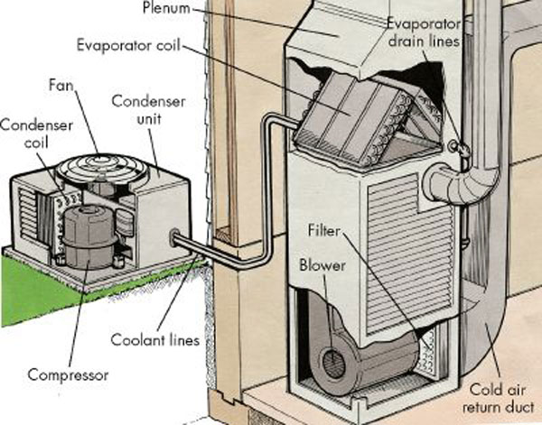

# HVAC for General Industry

> **Node ID**: energy.hvac
> **Domain**: [Energy](./index.md)
> **Dependencies**: [`Clean Room Technology`](../photolithography/cleanrooms.md), [`Industrial Buildings & Heavy Foundations`](../construction/industrial-buildings.md)
> **Enables**: [`Energy`](index.md), [`Temperature & Pressure Measurement`](../measurement/temperature-pressure.md)
> **Timeline**: Years 15-30
> **Outputs**: hvac-systems, industrial-ventilation, climate-control-units
> **Critical**: No

## Overview

> *This is a diagram of a standard household HVAC system.*

> *Image: sammsheatingandair, CC BY-SA 2.0*

Heating, ventilation, and air conditioning systems for industrial environments, including cleanrooms and precision manufacturing facilities.

Industrial HVAC differs from residential systems in scale, precision, and reliability requirements. Cleanroom HVAC must maintain particulate counts to ISO Class standards through high-efficiency filtration and laminar airflow design, while simultaneously controlling temperature and humidity within tight tolerances. Semiconductor fabs require the most demanding HVAC specifications: temperature control within a narrow band and humidity maintained at precise levels to prevent static discharge and photoresist variability.

The core components of an industrial HVAC system include air handling units with heating and cooling coils, humidifiers and dehumidifiers, supply and return ductwork with dampers for zone control, filtration stages from coarse pre-filters through HEPA or ULPA final filters, and exhaust systems for removing contaminated air. Chillers provide cooling capacity, while boilers or electric heaters supply heating. Control systems integrate temperature, humidity, pressure, and particulate sensors to maintain setpoints through feedback loops.

HVAC system design for semiconductor fabs requires collaboration between mechanical engineers, cleanroom specialists, and process tool vendors to ensure that environmental conditions support the lithography, etch, and deposition processes that define semiconductor yield.

## Prerequisites

### Materials

- Sheet metal ductwork (galvanized steel for general use, stainless steel for corrosive environments, aluminum for lightweight installations)
- Insulation materials (fiberglass duct wrap, foam board for equipment housings)
- Refrigerants and heat transfer fluids (water, glycol, ammonia, or synthetic refrigerants)
- HEPA and ULPA filter media and filter housings
- Sealants, gaskets, and duct connection hardware rated for system pressure class

### Equipment

- [Clean Room Technology](../photolithography/cleanrooms.md) — tool dependency
- [Industrial Buildings & Heavy Foundations](../construction/industrial-buildings.md) — tool dependency
- Chillers (compression or absorption type), boilers, and air handling units
- HEPA and ULPA filtration systems with DOP/PAO testing capability

### Knowledge

- Knowledge of psychrometrics: dry-bulb, wet-bulb, dew point, relative humidity, and enthalpy relationships on the psychrometric chart
- Understanding of cleanroom classification standards (ISO 14644) and testing methods
- Ability to calculate heat loads from equipment, occupants, lighting, and envelope gains
- Safety training for refrigerant handling, electrical work on HVAC controls, and work at heights
- Familiarity with duct pressure class design and leakage testing procedures
- Understanding of air balance principles: supply, return, exhaust, and pressurization relationships

### Infrastructure

- Roof or mechanical room space for air handling equipment, chillers, and boilers
- Chilled water and hot water piping distribution from central plant to air handling units
- Electrical supply for compressors, fans, and control systems (often hundreds of kW for large installations)
- Cooling tower or dry cooler for heat rejection from chiller condensers
- Building management system (BMS) network for centralized monitoring and control
- Makeup water supply and water treatment for cooling towers and boilers

## Process Description

Industrial HVAC system design, installation, and commissioning follows a systematic process from load calculation through performance validation.

### Step-by-Step Procedure

1. Assess the conditioned space requirements: heat load from equipment and occupants, required air changes per hour (6-20 for general industrial, 100-600+ for cleanrooms), contamination control level, and acceptable temperature and humidity ranges.
2. Size the air handling unit, chiller, boiler, and filtration system to meet peak load conditions with appropriate safety margins. Calculate supply air volume from the greater of ventilation, cooling, or pressurization requirements.
3. Install ductwork with sealed joints (sealed per SMACNA standards for the applicable pressure class) and pressure-tested connections. Insulate supply ducts in unconditioned spaces to prevent condensation and energy loss.
4. Commission the system by balancing airflow to each zone using hood measurements at supply and return grilles. Calibrate temperature, humidity, and pressure sensors. Verify HEPA filtration integrity through DOP or PAO challenge testing at each filter bank.
5. Establish control sequences for normal operation, setback modes, and alarm conditions. Program fail-safe responses: on sensor failure, maintain last known good setpoint; on equipment malfunction, activate standby unit and alarm.
6. Validate system performance under full load conditions. Measure temperature uniformity across the space, verify pressurization differentials between zones, and confirm particulate counts meet the target ISO class. Document baseline operating parameters for ongoing comparison during preventive maintenance.

### Process Parameters

| Parameter | Range | Notes |
|-----------|-------|-------|
| Temperature (general industrial) | 18–27°C | ±2°C tolerance typical |
| Temperature (cleanroom) | 21–23°C | ±0.5°C to ±1°C for semiconductor fabs |
| Relative humidity (general) | 30–60% | ±5% tolerance |
| Relative humidity (cleanroom) | 40–45% | ±2% to prevent static and photoresist variation |
| Air changes/hour | 6–600+ | 6-20 general, 100-600+ cleanrooms |
| Filtration efficiency | HEPA 99.97% @ 0.3 μm | ULPA 99.999% @ 0.12 μm for ISO Class 1-3 |
| Room pressurization | +5 to +25 Pa | Positive pressure keeps contamination out |

The psychrometric chart is the fundamental tool for HVAC design, mapping the relationships between dry-bulb temperature, wet-bulb temperature, relative humidity, and enthalpy of moist air. All heating, cooling, humidification, and dehumidification processes can be plotted as paths on this chart, allowing engineers to calculate the energy required for each process step.

## Safety Considerations

Industrial HVAC presents hazards from electrical equipment, refrigerant chemicals, work at heights, and moving machinery:

- **Refrigerant toxicity and asphyxiation**: Ammonia refrigeration systems (common in industrial HVAC) release highly toxic gas on leak; even low concentrations irritate eyes and respiratory tract. Fluorocarbon refrigerants are less toxic but heavier than air and displace oxygen in confined spaces, creating asphyxiation risk.
- **Legionella in cooling towers**: Warm water in cooling towers provides ideal growth conditions for Legionella bacteria. Water treatment with biocides and regular Legionella testing are mandatory. Drift eliminators reduce aerosol escape.
- **Duct fire spread**: HVAC ductwork can transmit fire and smoke between building zones. Fire dampers at rated wall and floor penetrations close automatically on duct temperature rise. Smoke dampers connected to fire alarm systems prevent smoke migration.
- **Rotating equipment entanglement**: Air handling unit fans, chiller compressors, and pump motors have rotating shafts and couplings that can entangle clothing or hair. Guards must be in place and maintained.
- **Work at heights**: Rooftop installation of HVAC equipment introduces fall hazards. Ductwork installation in ceiling spaces requires proper scaffolding and tie-off points.

### Personal Protective Equipment

- Safety glasses and hearing protection when working near air handling units and chiller plants
- Chemical-resistant gloves and face shield when handling refrigerant cylinders or water treatment chemicals
- Hard hat, safety harness, and tie-off lanyard when working on rooftops or elevated platforms
- Respiratory protection when changing filter media or working in dusty ductwork
- Insulated gloves when handling hot water piping or steam connections

### Emergency Procedures

- Post refrigerant leak response procedures near all mechanical rooms with ammonia systems
- Maintain smoke damper testing and fire alarm integration verification on annual schedule
- Train all personnel on cooling tower biocide handling and spill containment
- Establish lockout/tagout procedures for all air handling units, with energy isolation points clearly labeled
- Keep spill containment booms and neutralization agents in chiller plant areas

## Quality Control

### Acceptance Criteria

- **HVAC Systems**: Temperature, humidity, and pressurization within specified tolerances at all monitored locations
- **Industrial Ventilation**: Exhaust capture velocity at contaminant sources meets industrial hygiene requirements
- **Climate Control Units**: Air changes per hour, particulate counts, and filtration efficiency verified at commissioning

### Testing Methods

- Particle count measurement per ISO 14644-1 cleanroom classification at specified sampling locations
- Duct leakage testing at specified pressure class using orifice plate or blower door method
- Airflow balancing verification at each supply and return grille using calibrated flow hood
- Sound level measurement at occupied positions for noise compliance
- HEPA filter integrity testing using DOP or PAO photometer challenge upstream of each filter
- Temperature and humidity mapping across the conditioned space at multiple elevations

### Sampling Protocol

- Log temperature and humidity data continuously at each zone controller; review daily for excursions
- Record filter pressure drop readings on preventive maintenance schedule; replace when differential exceeds rated final pressure
- Measure particle counts at cleanroom verification locations weekly during routine operation and after any maintenance activity
- Verify airflow balance at all supply grilles quarterly and after any ductwork modification
- Reject and investigate any HEPA filter that fails DOP/PAO integrity test; replace immediately
- Review building management system trend data monthly for developing control loop instability or sensor drift

## Scaling Notes

Energy consumption is the dominant ongoing cost for industrial HVAC. Cleanroom recirculation systems move enormous volumes of air through HEPA filters, which present significant pressure drop. Variable frequency drives on supply fans reduce energy use during partial-load conditions. Heat recovery wheels and enthalpy exchangers capture energy from exhaust air to precondition fresh makeup air, reducing heating and cooling loads.

- **Workshop HVAC**: Single-zone system with basic heating, cooling, and filtration. Packaged rooftop unit or split system. Serves small manufacturing spaces. Air changes: 4-8 per hour.
- **Industrial HVAC**: Multi-zone system with central chiller and boiler plant, VAV or CAV air handling units, standard filtration. Serves large manufacturing buildings. Air changes: 8-20 per hour.
- **Cleanroom HVAC**: Dedicated recirculation air handlers with HEPA/ULPA filtration, precise temperature and humidity control, pressurization management. Air changes: 100-600+ per hour. Energy intensity 10-100× general industrial per unit floor area.

Redundancy design is driven by the cost of downtime. Semiconductor fabs typically employ N+1 or 2N chiller and air handler configurations to ensure uninterrupted temperature control. Hospital operating theaters and pharmaceutical cleanrooms have similar redundancy requirements driven by regulatory standards.

Maintenance scheduling for industrial HVAC follows a preventive maintenance calendar based on equipment runtime hours. Filter replacement intervals depend on particulate loading. Pre-filters may require monthly replacement while final HEPA filters last several years in cleanroom service. Chiller tube cleaning, cooling tower treatment, and boiler water chemistry maintenance are seasonal tasks that prevent efficiency degradation and equipment failure.

The design air changes per hour for a given space depend on the contamination generation rate within the space and the required cleanliness level. General industrial areas may need only a few air changes per hour, while semiconductor cleanrooms require hundreds of air changes to maintain particulate counts at ISO Class 1 through Class 5 levels. The air handling capacity, and corresponding energy consumption, scales roughly linearly with the required air change rate.

## Troubleshooting

| Problem | Probable Cause | Solution |
|---------|---------------|----------|
| Temperature excursions in zone | Sensor drift or valve actuator failure | Recalibrate sensors; inspect valve stem and actuator linkage |
| High particle counts in cleanroom | Filter breach, seal leak, or gasket failure | Inspect filter housing seals; replace damaged gaskets; retest with DOP/PAO |
| Humidity swings above tolerance | Steam humidifier valve hunting or chilled water control issue | Tune PID loop; verify steam supply pressure; check dehumidification coil |
| Excessive energy consumption | Simultaneous heating and cooling, or failed economizer | Verify economizer dampers operating correctly; check valve overlap |
| Insufficient airflow at remote grilles | Duct leakage or plenum pressure loss | Perform duct leakage test; inspect connections and sealant |
| Cooling tower approach temperature rising | Fill degradation or water chemistry imbalance | Inspect and clean fill media; verify water treatment chemical dosing |
| VFD tripping on overcurrent | Filter clogging increasing static pressure | Replace pre-filters; verify VFD programming and current limit settings |

## Variations and Alternatives

- **Packaged rooftop units**: Factory-assembled heating, cooling, and fan section in a single enclosure. Simple installation and low first cost. Suitable for general industrial spaces without precision requirements.
- **Chilled beam systems**: Ceiling-mounted heat exchangers using chilled water for sensible cooling. Lower air volume than conventional VAV, reducing fan energy. Requires careful dew point control to prevent condensation.
- **Evaporative cooling**: Uses water evaporation to cool supply air directly. Very low energy consumption in dry climates. Limited to applications where humidity addition is acceptable.
- **District heating and cooling**: Central plant produces chilled water and steam, distributed to multiple buildings. Enables shared infrastructure and higher efficiency chillers. Requires significant capital investment in distribution piping.

The integration of building management systems with HVAC controls enables centralized monitoring and optimization across all zones. Modern BMS platforms can identify opportunities for energy savings through schedule adjustments, setpoint optimization, and demand-based ventilation control. Data logging from thousands of sensors provides the historical baseline needed to detect degradation trends in cooling capacity, filter loading, and control valve response.

Steam humidifiers, common in industrial HVAC, present additional safety considerations. Live steam injection into the air stream provides precise humidity control but introduces scald hazard from steam piping and requires water treatment to prevent mineral carryover into the conditioned space. Electric and ultrasonic humidifiers avoid the scald hazard but may introduce mineral dust if fed with hard water.

Variable air volume (VAV) systems modulate supply air flow to each zone based on cooling demand, reducing fan energy at part load compared to constant air volume (CAV) systems. VAV boxes at each zone contain a damper actuator controlled by the zone thermostat. In cleanroom applications, VAV is less common because the air change rate is dictated by particulate control rather than cooling load, and reducing airflow would compromise cleanliness.

Cooling load calculations must account for heat generated by process equipment, which often dominates over envelope and occupancy loads in industrial facilities. Semiconductor tools generate 10-50 kW each, and a fab with dozens of tools presents a cooling load of several megawatts. Accurate equipment heat dissipation data from tool vendors is essential for chiller and air handler sizing.

Makeup air requirements are determined by exhaust volumes and pressurization needs. Industrial processes that generate fumes, dust, or hazardous vapors require local exhaust ventilation (LEV) at the source, and the exhausted air must be replaced with conditioned makeup air to maintain building pressurization. The makeup air volume directly determines the heating and cooling load on the air handling system, particularly in cold climates where heating outside air to room temperature consumes significant energy.

## References

- [Energy](index.md) — parent capability
- [Energy Domain](./index.md) — domain overview and related capabilities
- [Clean Room Technology](../photolithography/cleanrooms.md) — upstream dependency (tool)
- [Industrial Buildings & Heavy Foundations](../construction/industrial-buildings.md) — upstream dependency (tool)
- [Energy](index.md) — downstream capability
- [Temperature & Pressure Measurement](../measurement/temperature-pressure.md) — downstream capability

### Material Handling

Proper handling of filters, refrigerants, and HVAC components maintains system performance and safety:

- Change filters on schedule. Delayed filter replacement increases energy cost and risks bypass contamination in cleanroom applications.
- Handle refrigerant cylinders per safety data sheet requirements and applicable regulations. Weigh cylinders before and after charging to track charge quantity.
- Protect HEPA filter media from physical damage during transport and storage. Damaged media cannot be repaired and must be replaced.
- Store duct sealant and insulation materials in dry conditions. Moisture-contaminated fiberglass insulation loses thermal resistance and supports mold growth.
- Maintain cooling tower water treatment chemical inventory and dosing logs per water management plan for Legionella control.
- Segregate used refrigerant for recovery and recycling per EPA regulations. Venting refrigerant to atmosphere is prohibited.
- Verify damper actuator position against BMS display readings during annual commissioning checks
- Inspect cooling tower fill media and drift eliminators annually for biological growth and physical damage
---
*Part of the [Bootciv Tech Tree](../../index.md) · [Energy](./index.md) · [All Domains](../../index.md)*

