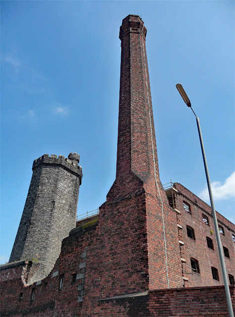

# Hydraulic Power

> **Node ID**: energy.hydraulics
> **Domain**: [Energy](./index.md)
> **Dependencies**: [`Mining Engineering & Extractive Metallurgy`](../mining/index.md)
> **Enables**: [`Primary Metal Forming`](../metals/forming.md), [`Lubricants, Oils & Fluid Mechanics`](../chemistry/lubricants.md)
> **Timeline**: Years 15-30
> **Outputs**: hydraulic-presses, hydraulic-jacks, hydraulic-actuators
> **Critical**: No

## Overview

> *Hydraulic power centre, Stanley Dock, Liverpool*

> *Image: Stephen Richards, CC BY-SA 2.0*

Generation and control of mechanical force through pressurized fluid systems. Hydraulic presses, jacks, and actuators multiply small input forces into enormous output forces, enabling heavy forming, lifting, and clamping operations essential for construction, metalworking, and industrial machinery.

A hydraulic system transmits force through an incompressible fluid, typically mineral oil, confined in sealed circuits. Pascal's principle dictates that pressure applied at any point in a confined fluid transmits equally throughout the fluid, allowing a small piston driving fluid into a large piston to multiply force proportionally to the area ratio. This force multiplication, combined with precise control through directional valves and pressure regulators, makes hydraulics indispensable for applications requiring both high force and controllable motion.

The key components of a hydraulic system are the reservoir, pump (gear, vane, or piston type), control valves, actuators (cylinders or motors), filters, and return lines. Pump selection determines the maximum system pressure and flow rate, which together define the available power. Piston pumps deliver the highest pressures and are standard for press applications, while gear pumps provide economical lower-pressure service for less demanding tasks.

The principles of hydraulic power transmission were first codified by Pascal in the 17th century, but practical application required the development of precision cylinder boring, reliable seal materials, and high-pressure pumping technology that only became available during the Industrial Revolution. The development of hydraulic power transmission was a key enabler of heavy industry, allowing forces that were previously achievable only through massive mechanical advantage systems (block and tackle, screw presses) to be generated in compact, controllable packages.

## Prerequisites

### Materials

- Hydraulic fluid (mineral oil with anti-wear additives, or synthetic fluid for high-temperature service)
- Steel tubing, high-pressure hoses, and fittings rated for system working pressure
- Seal materials compatible with system fluid: nitrile rubber (Buna-N) for mineral oil, Viton for high temperature, polyurethane for abrasion resistance
- Filter elements (beta-rated to target cleanliness ISO code)

### Equipment

- [Mining Engineering & Extractive Metallurgy](../mining/index.md) — tool dependency
- Hydraulic pumps (gear, vane, piston types)
- Control valves (directional, pressure relief, flow control, proportional, servo)
- Cylinders and rotary actuators

### Knowledge

- Knowledge of fluid mechanics and Pascal's pressure-force-area relationships
- Understanding of hydraulic circuit design: series, parallel, regenerative, and counterbalance configurations
- Ability to read hydraulic schematic symbols and trace circuit function
- Safety training for high-pressure fluid injection hazards and stored energy in accumulators
- Familiarity with hydraulic fluid cleanliness standards (ISO 4406) and filtration sizing
- Understanding of pump types and their pressure/flow characteristics for proper selection

### Infrastructure

- Fluid power test stand with calibrated pressure gauges and flow meters for circuit validation
- Oil storage and waste oil collection facilities with spill containment
- Hose crimping equipment and tubing bender for field fabrication of hydraulic lines
- Clean assembly area for valve and cylinder rebuild work (contamination control)
- Power supply for electric motor-driven hydraulic power units
- Overhead crane or hoist for handling heavy cylinders and press frames

## Process Description

A hydraulic power system converts mechanical input (from an electric motor or engine) into pressurized fluid flow, distributes that flow through control valves to actuators, and returns the fluid to the reservoir in a continuous circuit. The system pressure and flow rate determine the available force and speed at the actuator.

### Step-by-Step Procedure

1. Fill the reservoir with filtered hydraulic fluid to the sight glass level. Verify fluid viscosity grade matches the pump manufacturer specification for the operating temperature range. Confirm fluid cleanliness by drawing a sample through a clean-port sampling valve.
2. Prime the pump by filling the suction line and pump case with fluid. Start the pump at reduced pressure (relief valve backed off) and check for cavitation noise, which indicates air in the suction line or a blocked inlet strainer.
3. Set the main relief valve to the system design pressure. Adjust pressure compensators on variable displacement pumps. Verify that all pressure gauges read within calibration tolerance.
4. Operate each directional valve to extend and retract every cylinder. Bleed trapped air from the highest point in each circuit. Verify that cylinder speeds match the calculated flow rate at the set pressure.
5. Check for external leaks at all fittings, hose connections, and cylinder rod seals. Tighten or replace any fitting that weeps. No hydraulic leak is acceptable, even a slow seep, because of the injection injury hazard.
6. Verify pressure settings on all relief valves, counterbalance valves, and sequence valves. Record baseline pressure and flow readings for each circuit. Tag each valve with its set pressure.

### Process Parameters

| Parameter | Range | Notes |
|-----------|-------|-------|
| System pressure | 70–350 bar | 70-140 bar general industrial; 210-350 bar presses and mobile equipment |
| Flow rate | Determined by actuator speed requirement | Pump displacement × speed = flow |
| Fluid viscosity | 15–100 cSt at operating temp | Must stay within pump's rated viscosity range |
| Fluid cleanliness | ISO 4406 18/16/13 or better | Proportional/servo valves require cleaner fluid |
| Reservoir temperature | 40–60°C | Above 65°C degrades fluid and seals rapidly |

## Cylinder Sizing and Force Calculations

The fundamental relationship governing all hydraulic actuator design:

    Force = Pressure × Area

For a double-acting cylinder (force on the extension stroke):
- F_extend = P × π × (Bore/2)²
- F_retract = P × π × ((Bore/2)² - (Rod/2)²)

**Standard cylinder bore sizes and force output at 210 bar**:

| Bore (mm) | Rod (mm) | Extension Force (kN) | Retraction Force (kN) | Extension Force (tonnes) |
|-----------|----------|---------------------|-----------------------|--------------------------|
| 40 | 25 | 26.4 | 16.1 | 2.7 |
| 63 | 40 | 65.5 | 39.1 | 6.7 |
| 80 | 50 | 105.6 | 64.3 | 10.8 |
| 100 | 63 | 165.0 | 99.6 | 16.8 |
| 125 | 80 | 257.7 | 152.2 | 26.3 |
| 160 | 100 | 422.4 | 257.4 | 43.1 |
| 200 | 125 | 659.7 | 401.9 | 67.3 |
| 250 | 160 | 1,031 | 608 | 105 |
| 320 | 200 | 1,690 | 1,030 | 172 |

**Example**: A hydraulic press that must deliver 100 tonnes (980 kN) of force requires, at 210 bar, a cylinder bore of at least 250 mm (which produces 105 tonnes extension force). The pump must deliver sufficient flow to achieve the desired ram speed: ram speed (m/s) = flow rate (m³/s) / bore area (m²). For a 250 mm bore cylinder extending at 10 mm/s: Q = 0.01 × π × (0.125)² = 0.49 L/s ≈ 30 L/min.

**Pump sizing**: Hydraulic power input (kW) = Pressure (bar) × Flow (L/min) / 600. A system requiring 210 bar and 30 L/min needs P_hydraulic = 210 × 30 / 600 = 10.5 kW. Assuming 85% pump efficiency, the electric motor must be rated at 10.5 / 0.85 ≈ 12.4 kW (typically a 15 kW motor).

**Pipe sizing by flow velocity**: Recommended fluid velocities to balance pressure drop against pipe cost:
- Suction lines: 0.5-1.5 m/s (larger diameter to prevent cavitation)
- Pressure lines: 3-6 m/s (smaller diameter for responsiveness)
- Return lines: 1-3 m/s (moderate diameter)

Required pipe inside diameter: d = √(4 × Q / (π × v)), where Q is flow rate (m³/s) and v is target velocity (m/s). For 30 L/min (0.0005 m³/s) at 4 m/s in a pressure line: d = √(4 × 0.0005 / (π × 4)) = 0.0126 m ≈ 13 mm ID. Use 15 mm (1/2 inch) nominal pipe size.

The relationship between force, pressure, and area in hydraulic systems allows dramatic force multiplication. A modest hand pump generating pressure in a small-bore cylinder can produce enormous force at a large-bore working cylinder. This principle enabled the construction of hydraulic presses capable of forging large steel components long before electric motors of equivalent power were available. The same principle underlies hydraulic jacks used for lifting heavy loads with minimal operator effort.

## Safety Considerations

Hydraulic systems present unique hazards from high-pressure fluid injection, stored energy, and mechanical forces:

- **High-pressure fluid injection injury**: Hydraulic fluid injected through the skin under pressure causes immediate tissue necrosis and requires emergency surgical decompression. Even small leaks at fittings can produce a high-velocity fluid jet capable of penetrating skin. Pinhole leaks in high-pressure hoses are difficult to see but extremely dangerous. Never use hands or fingers to search for leaks; use a piece of cardboard or paper instead.
- **Stored energy in accumulators and charged cylinders**: Hydraulic accumulators store energy in compressed gas. Charged cylinders can extend violently if the rod-side is inadvertently pressurized. Always depressurize systems and bleed accumulators before disconnecting any fitting.
- **Hose burst and fitting failure**: High-pressure hoses have a finite service life and must be replaced on schedule, not when they fail. A burst hose whips violently and sprays hot hydraulic fluid. Hose routings must include restraints and guards to limit whip range.
- **Fluid flammability**: Mineral oil hydraulic fluid will ignite if sprayed onto a hot surface or exposed to an ignition source. Water-glycol or phosphate ester fluids provide fire resistance at higher cost.
- **Mechanical crush and pinch**: Hydraulic presses and heavy cylinders generate forces sufficient to crush limbs. Never reach into a press or cylinder area without verifying that the system is locked out and mechanically blocked.

### Personal Protective Equipment

- Safety glasses with side shields and face shield when pressurizing or testing circuits
- Leather work gloves when handling hoses, fittings, and cylinder rods (not when searching for leaks)
- Steel-toe boots with metatarsal protection where heavy cylinders and press platens are handled
- Hearing protection near hydraulic power units with engine drives or high-flow pumps
- Long sleeves and chemical-resistant apron when handling hydraulic fluid or cleaning solvent

### Emergency Procedures

- Post procedures for hydraulic fluid injection injury emergency response: immediate transport to emergency room with surgical capability, do not delay for wound assessment
- Maintain spill containment booms, absorbent pads, and waste drums near hydraulic power units
- Know the location of the main pump emergency stop and system depressurization valve
- Train all personnel that injection injuries may appear minor (small puncture) but require immediate surgical intervention
- Have fire extinguisher rated for flammable liquid (Class B) accessible near all hydraulic power units

## Quality Control

### Acceptance Criteria

- **Hydraulic Presses**: Force output within rated capacity, ram speed within specification, parallelism of platens within tolerance
- **Hydraulic Jacks**: Lifting capacity verified at rated load, holding valve leakage below threshold, travel distance within specification
- **Hydraulic Actuators**: Breakout pressure within specification, internal leakage below maximum, stroke length and speed matching design

### Testing Methods

- Pressure testing of circuits at 1.5× working pressure (proof test) with hold time to verify no leaks
- Fluid cleanliness analysis to target ISO code using automatic particle counter
- Internal leakage measurement on cylinders (by-pass test: pressurize one side, measure flow from return)
- Cylinder drift test: apply load, measure position change over 30 minutes
- Pump flow measurement at rated pressure and speed using calibrated flow meter
- Valve response time and hysteresis measurement for proportional and servo valves

### Sampling Protocol

- Sample hydraulic fluid quarterly for particle count, water content, and viscosity trending
- Log cylinder and valve internal leakage rates during scheduled shutdowns
- Measure pump case drain flow monthly; increasing case drain indicates internal wear
- Verify relief valve cracking pressure every six months using calibrated gauge
- Record system operating temperature and pressure at each power unit daily
- Reject and replace filter elements when differential pressure reaches the bypass indicator threshold

## Scaling Notes

Hydraulic fluid cleanliness is the primary determinant of component life. Particulate contamination accelerates wear in pumps and valves, while water contamination degrades fluid lubricity and promotes corrosion. Inline and return-line filters with beta-rated elements maintain fluid cleanliness to target ISO codes. Regular fluid sampling and analysis detect contamination trends before they cause failures.

- **Small workshop systems**: Single pump, 70-140 bar, manual directional valves, open-center circuit. Powers a shop press, bottle jack, or simple clamping fixture. Reservoir 20-100 liters.
- **Industrial press systems**: Variable displacement piston pump, 210-280 bar, servo or proportional valves, closed-center circuit. Forces from 50 to 10,000+ tonnes. Requires cooled reservoir, high-pressure filtration, and fluid cleanliness management.
- **Mobile equipment systems**: Engine-driven pump, 250-350 bar, load-sensing circuit with multiple actuators. Excavators, cranes, loaders. Vibration and contamination exposure require robust filtration and regular fluid analysis.

Heat generation from pressure drops across valves and internal leakage limits continuous duty cycle. Oil coolers, either air-blast or water-cooled, maintain fluid temperature within the acceptable operating range. Excessive temperature thins the fluid, reducing viscosity below the minimum for proper pump lubrication and increasing internal leakage.

Seals are the most failure-prone components in hydraulic systems. O-rings, lip seals, and backup rings must be selected for compatibility with the hydraulic fluid and the operating temperature range. Seal extrusion under high pressure is prevented by proper gland design with backup rings. Seal hardening and loss of elasticity over time leads to increased internal leakage and reduced actuator response speed. A proactive seal replacement program during scheduled shutdowns prevents in-service failures.

Proportional control valves enable variable speed and force control in hydraulic systems, allowing smooth acceleration and deceleration of actuators. Servo valves provide even finer control for applications requiring precise position or force regulation, such as machine tool feeds and materials testing machines. The control bandwidth of these valves determines the responsiveness of the hydraulic system to command changes.

## Troubleshooting

| Problem | Probable Cause | Solution |
|---------|---------------|----------|
| Slow or sluggish actuator response (speed <70% of rated) | Internal leakage in cylinder or valve, or air entrained in fluid | Bleed air from circuit at the highest point. Check cylinder seal condition: measure internal leakage by pressurizing one side to 70 bar and measuring flow from the return port — leakage >50 mL/min per 100 mm bore diameter indicates worn seals. For a 100 mm bore cylinder, internal leakage exceeding 50 mL/min at 70 bar warrants seal replacement |
| Pump cavitation (whining noise, pressure fluctuations) | Clogged inlet filter, low reservoir level, or excessive suction lift | Clean inlet strainer. Maintain fluid level above the minimum mark on the sight glass. Suction lift should not exceed 0.5 m for petroleum-based fluids at 40°C — the vapor pressure of warm oil causes cavitation easily. Verify suction line diameter is at least 1.5× the pump inlet port diameter. Suction line velocity must stay below 1.5 m/s |
| Excessive system heating (reservoir >65°C) | Relief valve set too low (pumping over relief — all excess flow converts to heat), or undersized cooler | Verify pressure settings match load requirements. A pump delivering 50 L/min over a relief valve set 20 bar above load pressure wastes: P_waste = 20 × 50 / 600 = 1.67 kW of continuous heat input to the fluid. Size cooler for the total heat rejection load (typically 20-30% of input power). For a 15 kW system, the cooler should reject 3-5 kW at the design ambient temperature |
| Erratic actuator motion (jittering, jerking) | Sticking valve spool from contamination, or excessive friction in cylinder | Flush system; replace fluid and filter. Inspect valve spool for scoring — contamination particles larger than 5-10 μm can jam a servo valve spool (tolerance 2-5 μm). For cylinder friction, measure breakout pressure: extend cylinder with no load — pressure required to initiate motion should be <5% of system pressure. A 100 mm bore cylinder at 210 bar should start moving with <10 bar |
| Cylinder drift under load (>1 mm/30 minutes) | Piston seal leakage or counterbalance valve out of adjustment | Measure drift rate under a known load. Apply rated load to the fully extended cylinder, mark rod position, and measure drift after 30 minutes. Drift exceeding 1 mm indicates seal leakage. For counterbalance valves, verify setting is 1.1-1.3× the load-induced pressure. Example: a 50 kN load on a 100 mm bore cylinder produces 63.7 bar — set counterbalance to 70-83 bar |
| Pump losing prime (no flow at startup) | Air leak in suction line or worn shaft seal | Tighten suction fittings — even a tiny air leak on the suction side prevents priming. Check pump shaft seal: oil weeping from the shaft indicates a worn seal that also admits air on the suction side. Replace shaft seal and re-prime by filling the pump case with clean fluid before starting |
| Pump output flow below rated capacity | Pump internal wear — gear or piston clearances increased from contamination or age | Measure pump flow at rated pressure with a calibrated flow meter. Compare to nameplate rating. Flow loss >10% indicates significant internal wear. Measure case drain flow: for piston pumps, case drain exceeding 5% of rated flow indicates worn pistons or valve plate. Example: a 50 L/min pump with case drain >2.5 L/min needs overhaul or replacement |
| System pressure not reaching setpoint | Main relief valve stuck open or worn, or pump bypass internally | Remove and inspect relief valve: check for debris holding the poppet off its seat, worn seat surface, or broken spring. Lap the valve seat if scored. Verify the pump reaches deadhead pressure (outlet blocked): it should reach 1.0-1.1× the relief valve setting. If pump cannot reach deadhead pressure, the pump is worn internally |
| Hydraulic motor speed too low | Motor inlet pressure below specification, or excessive back-pressure on the return side | Measure pressure at the motor inlet and outlet. The motor requires a specific pressure differential (typically 100-350 bar) to deliver rated torque at rated speed. If inlet pressure is adequate but speed is low, check return line back-pressure — return line restriction from undersized piping or clogged filter causes back-pressure that opposes the motor. Return line pressure should be <5 bar |
| Oil discoloration (dark, milky, or foamy) | Oxidation (dark brown), water contamination (milky), or air entrainment (foamy) | Dark oil: oxidation from overheating — test Total Acid Number (TAN), replace if >2.0 mg KOH/g (new oil: <0.1). Milky oil: water ingress — check heat exchanger for internal leaks, test water content (acceptable: <0.1% by volume). Foamy oil: air entrainment from low reservoir level or suction line leak — check that return line discharges below fluid level to prevent splashing and air entrainment |

## Variations and Alternatives

- **Open-center circuit**: Fluid circulates freely through the directional valve center position back to tank when no actuator is in motion. Simple, low-cost. Used with fixed-displacement pumps and manual valves.
- **Closed-center circuit**: System maintains pressure at all times; directional valves block flow until actuated. Used with variable-displacement pumps and servo/proportional valves. More precise control at higher cost.
- **Load-sensing circuit**: Pump delivers only the flow and pressure demanded by the active circuit, minimizing energy waste. Standard on modern mobile equipment.
- **Accumulator circuits**: Hydraulic accumulators (gas-charged bladder or piston type) store energy for peak demand supplementation, pulsation dampening, and emergency actuator return.

Hydraulic power transmission competes with mechanical, pneumatic, and electrical alternatives. Mechanical drives (gear trains, belts, chains) are simpler but cannot multiply force over distance as compactly. Pneumatic systems are faster and cleaner but limited to lower forces due to air compressibility. Electric actuators provide precise control without fluid leakage risk but cannot match the force density of hydraulics for very heavy loads. The choice depends on force requirements, duty cycle, precision needs, and environmental constraints.

Hydraulic system design begins with defining the force and speed requirements at each actuator, selecting pump type and size, choosing appropriate valve types for the required control precision, and sizing piping to keep fluid velocity within recommended limits (pressure lines: 3-6 m/s, return lines: 1-3 m/s, suction lines: 0.5-1.5 m/s). The reservoir volume is typically sized at 2-3 times the pump flow rate per minute to allow adequate deaeration and cooling time.

Cavitation in hydraulic pumps occurs when the suction line cannot deliver fluid fast enough to fill the pump chambers, causing vapor bubbles that collapse violently inside the pump, eroding metal surfaces. Symptoms include a loud whining or rattling noise and erratic pressure output. Prevention requires adequate suction line diameter, minimal suction lift, clean inlet strainers, and proper fluid viscosity at operating temperature.

Hydraulic cylinders are specified by bore diameter, rod diameter, stroke length, and mounting style. The bore diameter and system pressure determine the force output. The rod diameter must be sized to resist column buckling at full extension under maximum load. Cushion sleeves at the end of stroke decelerate the piston to prevent impact damage. Cylinder drift under load (unwanted motion when held in position) indicates internal leakage past the piston seal.

Hydraulic hoses have a finite service life regardless of appearance. Industry guidelines recommend replacement based on time in service (typically 5-7 years) rather than waiting for visible deterioration. Hose failure modes include inner tube fatigue, reinforcement wire corrosion, and cover cracking from ozone and UV exposure. Hoses routed near hot surfaces or in high-vibration locations fail faster and require more frequent inspection.

Mobile hydraulic systems (excavators, cranes, loaders) face additional challenges from vibration, shock loading, and environmental contamination. Cylinder rod seals must exclude abrasive dust and mud while containing high-pressure fluid. Rod wipers (dust seals) scrape contaminants from the rod surface before the rod retracts into the cylinder. Broken wipers allow grit to destroy the primary seal, leading to rapid cylinder failure.

Hydraulic power units (HPUs) integrate the reservoir, pump, motor, filters, and control valves into a single assembly for convenient installation. HPU sizing requires matching pump flow and pressure to the simultaneous demands of all actuators in the circuit. Accumulators can supplement pump flow during peak demand periods, allowing the pump to be sized for average rather than peak demand.

## References

- [Energy](index.md) — parent capability
- [Energy Domain](./index.md) — domain overview and related capabilities
- [Mining Engineering & Extractive Metallurgy](../mining/index.md) — upstream dependency (tool)
- [Primary Metal Forming](../metals/forming.md) — downstream capability
- [Lubricants, Oils & Fluid Mechanics](../chemistry/lubricants.md) — downstream capability

### Material Handling

Proper handling of hydraulic fluid, seals, and replacement components preserves system cleanliness and reliability:

- Store hydraulic fluid in sealed containers to prevent moisture absorption and particulate ingress
- Use clean, dedicated transfer containers. Never mix hydraulic fluid with other petroleum products.
- Keep replacement seals (O-rings, lip seals, backup rings) in original packaging away from UV light and ozone, which accelerate rubber degradation.
- Flush all new hose assemblies and tubing runs before connecting to the system. Manufacturing debris in new hoses is a common source of contamination.
- Collect and segregate waste hydraulic fluid for recycling. Used fluid contains wear metals that make it unsuitable for reuse without reprocessing.
- Label all fluid containers with type, viscosity grade, and date received to prevent accidental mixing of incompatible fluids.
- Maintain a spare seal kit inventory for every cylinder and valve type in the system
- Record fluid analysis results trend to predict pump and valve replacement intervals
- Install magnetic plugs in reservoir drain ports to catch ferrous wear particles before they circulate
---
*Part of the [Bootciv Tech Tree](../../index.md) · [Energy](./index.md) · [All Domains](../../index.md)*
