# Energy

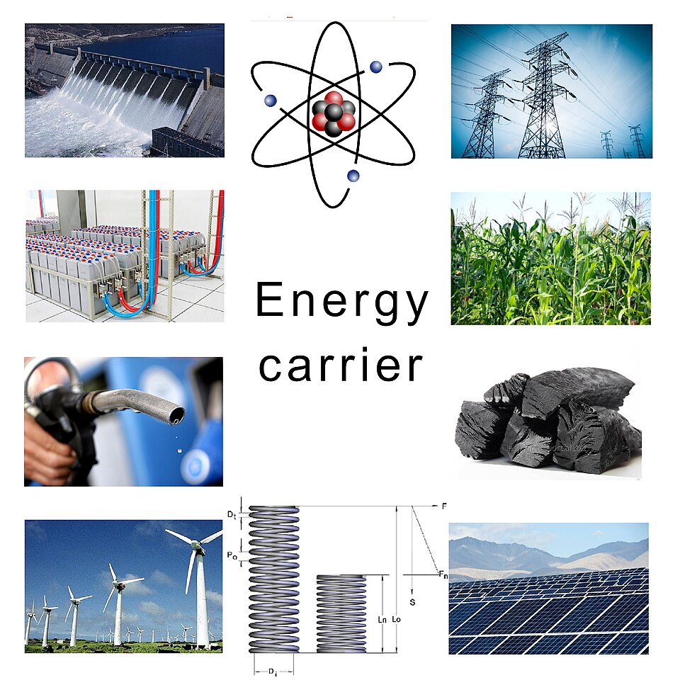
> *Image: Brian Stansberry (photographer), CC BY 4.0*

> *The power grids section includes transmission, distribution, and storage. Low-carbon power generation includes nuclear and renewables. EV's includes the manufacturing of batteries. This graphic was published as part of the World Energy Employment report.*

> *Image: International Energy Agency, CC BY 4.0*

Capabilities in this domain:

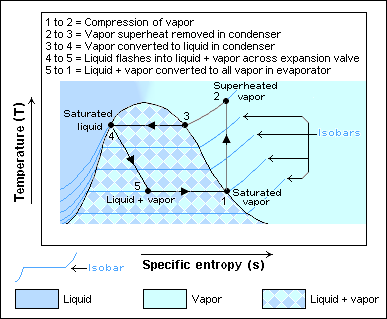
> *Image: IncrentaWiki, CC BY-SA 4.0*

- [Cooling Systems & Refrigeration](cooling.md) — Refrigeration cycles, ice production, cooling systems for industrial processes and climate control.
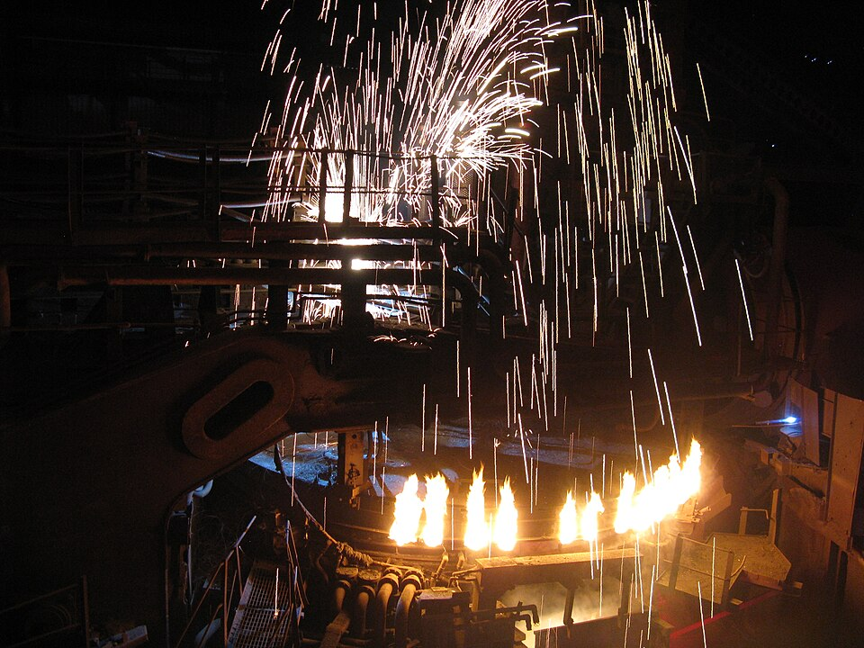
> *Image: Alan Murray-Rust, CC BY-SA 2.0*

- [Electric Furnaces](electric-furnaces.md) — Electric arc furnace (EAF) for steelmaking and silicon reduction, submerged arc furnace for continuous production, and resistance heating elements (Nichrome, Kanthal, SiC).
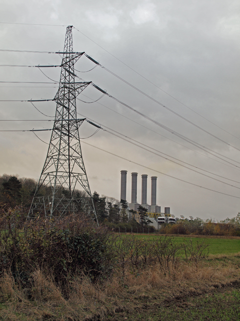
> *Image: U.S. Government Accountability Office from Washington, DC, United States, Public domain*

- [Electricity Generation & Distribution](electricity.md) — Voltaic piles and Daniell cells, wire drawing, generators (Faraday magneto → self-exciting dynamo), DC and AC motors, transformers for voltage step-up/step-down, power distribution (AC wins long-term), and clean power systems for semiconductor fabrication (UPS, backup generators, PDUs, power quality monitoring).
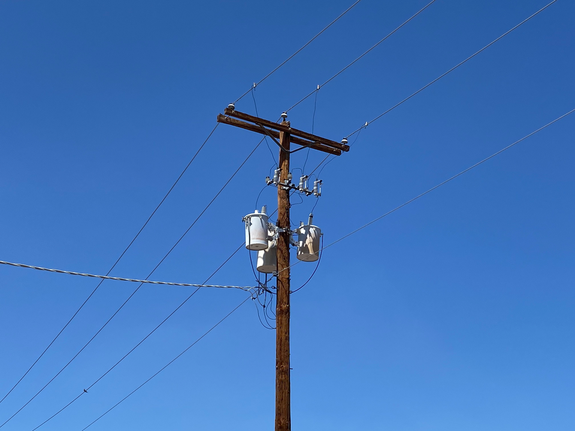
> *Image: Rsparks3, CC0*

- [Transformer & Power Distribution](power-distribution.md) — Transformers for voltage conversion and AC power distribution infrastructure enabling long-distance electricity transmission and centralized generation.
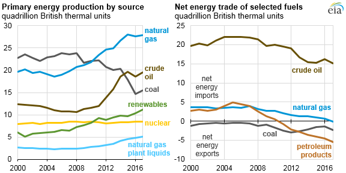
> *Image: U.S. Energy Information Administration, Public domain*

- [Fuel Production](fuels.md) — Solid, liquid, and gaseous fuel production from coal, coke, charcoal, and petroleum sources.
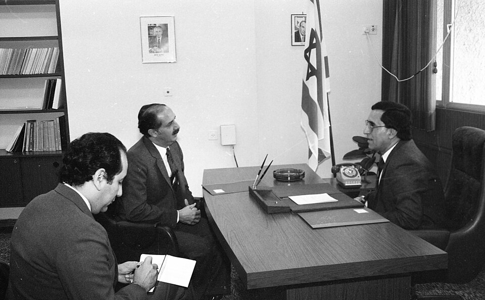
> *Image: IPPA photographer, CC BY 4.0*

- [Energy Refining](refining.md) — Processing crude fuels into usable forms through fractional distillation, coal tar distillation, and thermal cracking.

> *Image: Amalia1983, CC BY-SA 3.0*

- [SEM Tech Fuel Cells](sem-tech-fuel-cells.md) — electrochemical power generation
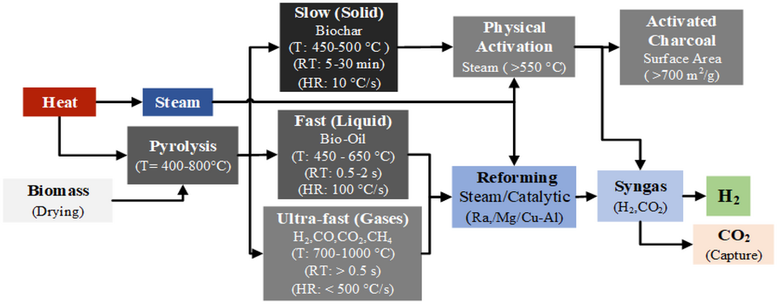
> *Image: Rey, José Ramón Copa, Cecilia Mateos-Pedrero, Andrei Longo, Bruna Rijo, Paulo Brito, Paulo Ferreira, and Catarina Nobre., CC BY-SA 4.0*

- [Charcoal Production](charcoal.md) — Charcoal production via earth-covered pit and simple kiln methods.
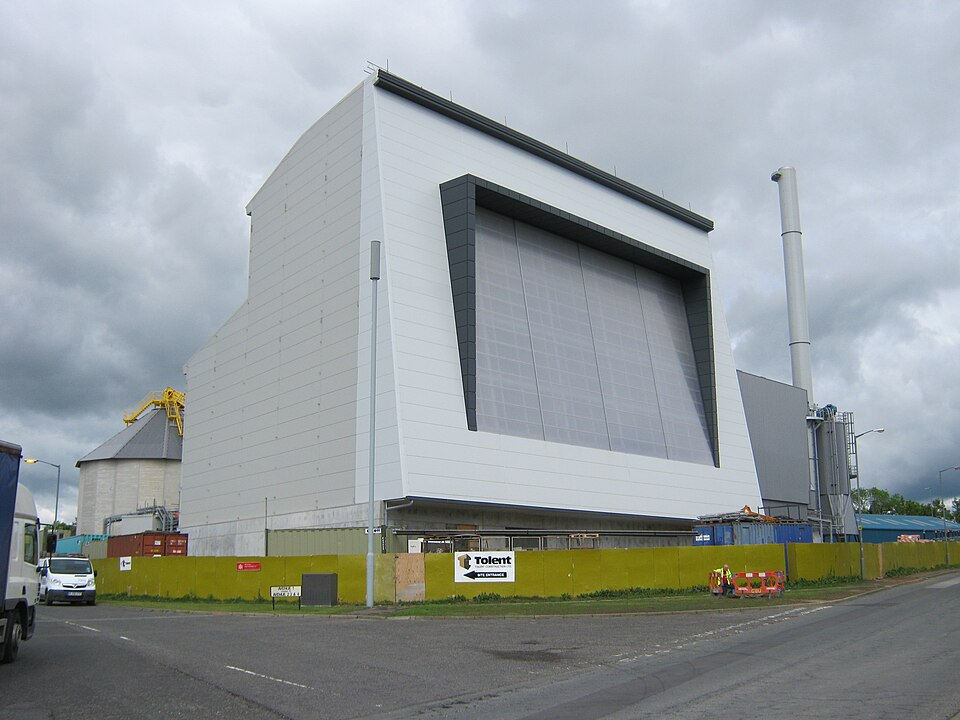
> *Image: John Edwards, CC BY-SA 2.0*

- [Biomass Energy](biomass-energy.md) — Converts organic material — wood, agricultural residues, and energy crops — into useful heat, combustible gas, or liquid fuels for dispatchable renewable energy.
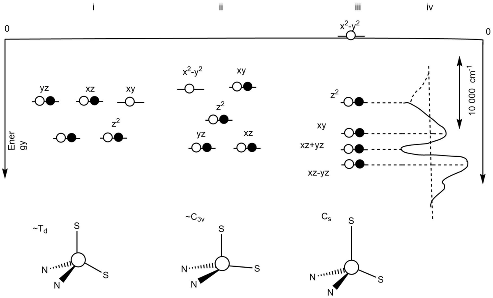
> *Image: ScienceBubble, CC BY-SA 4.0*

- [SEM Tech Blue Energy](sem-tech-blue-energy.md) — salinity-gradient power generation

> *Image: Kgara Kevin Rack, CC BY-SA 4.0*

- [Coal Mining & Combustion](coal.md) — Bituminous and anthracite coal mining, preparation, and combustion for steam generation and industrial heating.
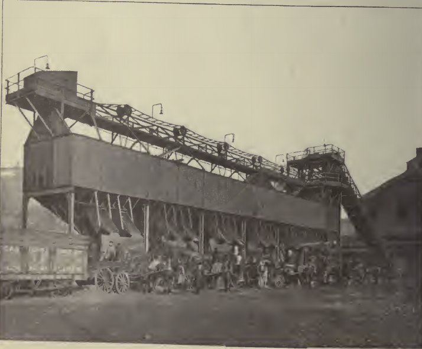
> *Image: Gas Light &amp; Coke Company, Public domain*

- [Coke Production](coke.md) — Beehive and by-product recovery coke ovens converting bituminous coal to coke (60-70% yield).
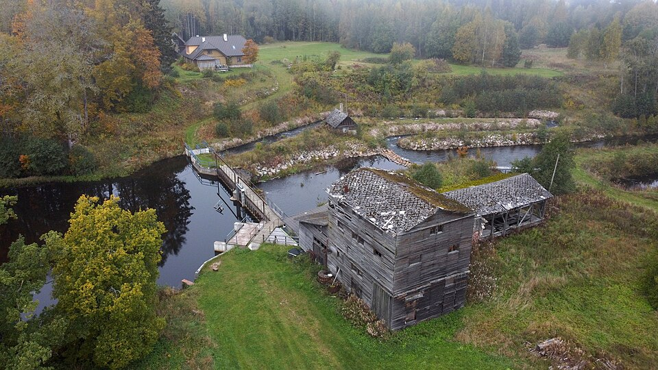
> *Image: Rohanstorey, CC BY 4.0*

- [Water Power](gravity.md) — Undershot and overshot water wheels (1-5 HP) using gravitational water flow for mechanical power.
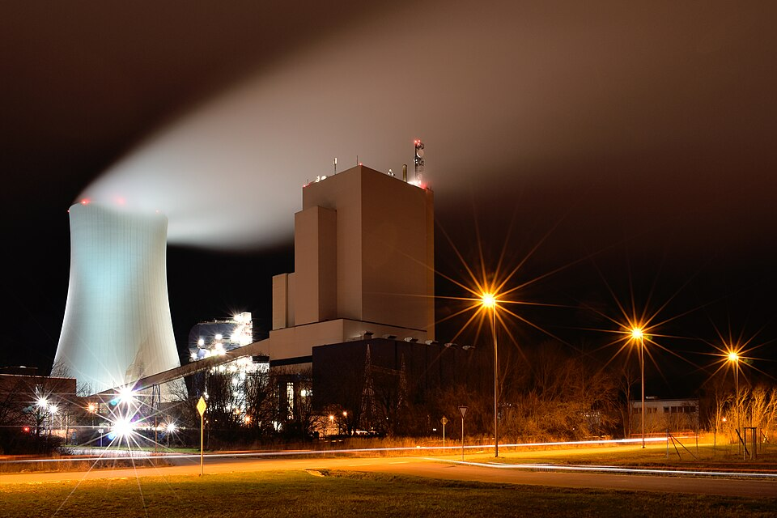
> *Image: Chris Allen, CC BY-SA 2.0*

- [Steam Power](steam-power.md) — Newcomen atmospheric engine (5-15 HP, 0.5-1% efficiency) and Watt separate condenser engine (10-100+ HP, 3-5% efficiency).

> *Image: Andy Dingley (scanner), Public domain*

- [Heat Engines](engine.md) — Overview of all heat engine types (Stirling, Otto, Diesel, gas turbine, steam) with selection guide and efficiency comparison.
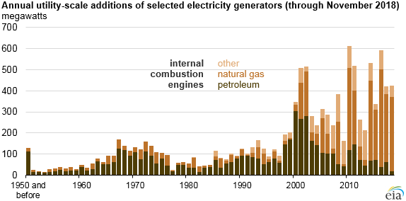
> *Image: U.S. Energy Information Administration, Public domain*

- [Internal Combustion Engines](internal-combustion.md) — Otto cycle (gasoline, spark ignition) and Diesel cycle (compression ignition) engines. Precision machining at 10-25 μm tolerances. Road vehicles, aircraft, generators, ships.

> *Image: Andy Dingley (scanner), Public domain*

- [Stirling Engine](stirling-engine.md) — Closed-cycle external combustion engine. Any heat source works (solar, biomass, waste heat). Achievable with lathe and basic foundry.
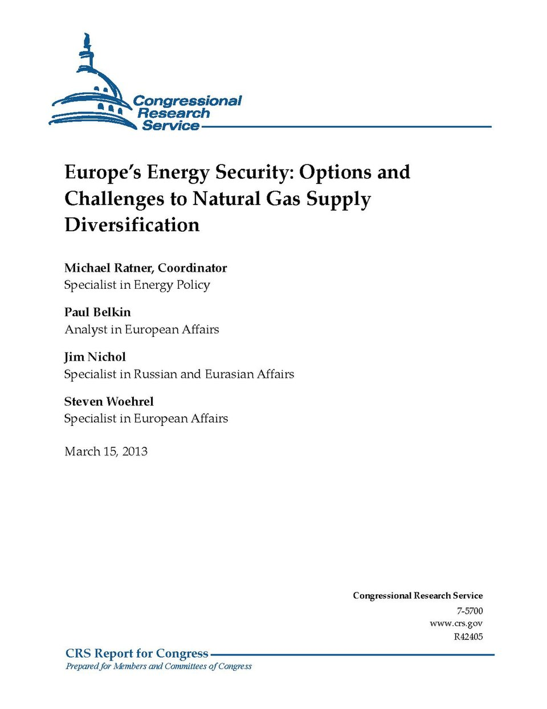
> *Image: KyleVBurnett, CC BY-SA 4.0*

- [Energy Storage & Diversification](storage.md) — Lead-acid batteries, nickel-iron batteries, mechanical storage (pumped hydro, flywheels, compressed air), energy diversification (hydroelectric, wind, solar PV, biomass), grid infrastructure, and UPS systems for semiconductor fab equipment.
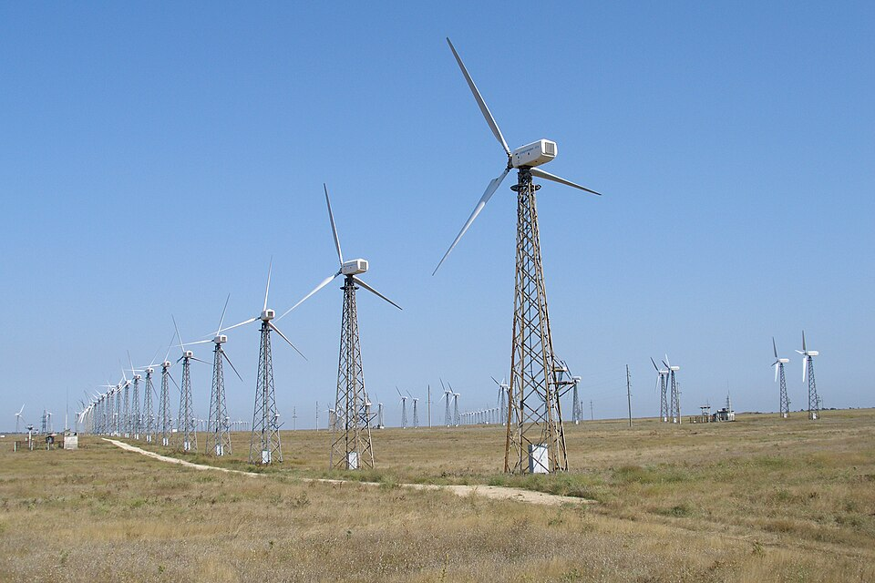
> *Image: Vyacheslav Argenberg, CC BY 4.0*

- [Wind Power](wind.md) — Windmills for mechanical power: grain grinding, sawing, and water pumping.
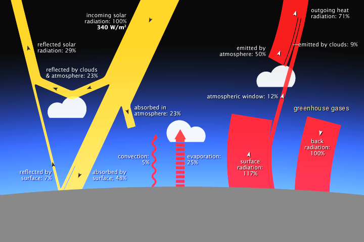
> *Image: U.S. Energy Information Administration, Public domain*

- [Solar Thermal Energy](solar-thermal.md) — Concentrated sunlight for heat production from water heating to solar furnaces, powering steam turbines and industrial processes without fuel consumption.
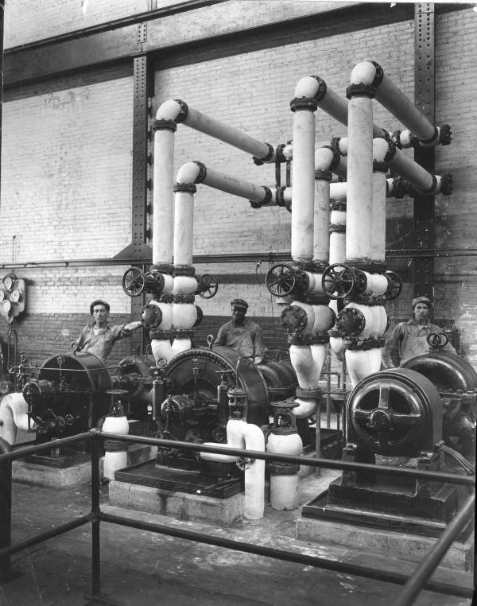
> *Image: Brandy Frisky, CC BY-SA 3.0*

- [Steam Turbines](steam-turbines.md) — Impulse and reaction steam turbines for large-scale continuous power generation at 30-40% thermal efficiency.
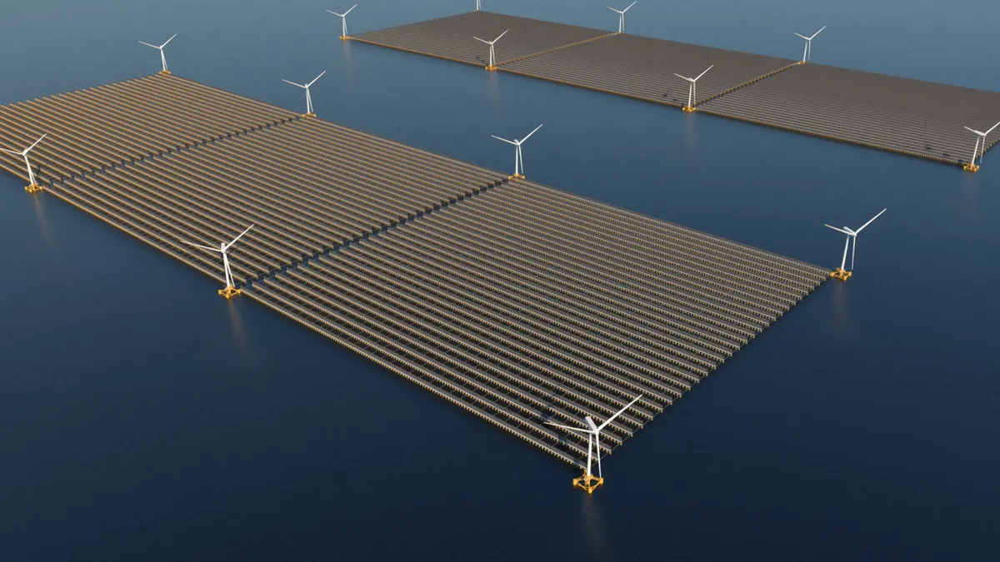
> *Image: Wikideas1, CC0*

- [Water Turbines](water-turbines.md) — Pelton, Francis, and Kaplan hydraulic turbines for efficient water power conversion.
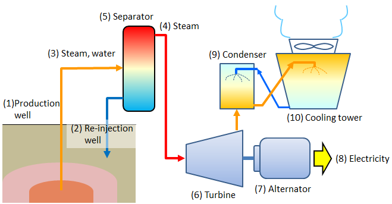
> *Image: S-kei, CC0*

- [Geothermal Energy](geothermal.md) — Harnesses Earth's interior heat for continuous baseload power generation with 90-95% capacity factor, unaffected by weather or seasons.

> *Image: Jeff Buck, CC BY-SA 2.0*

- [Pumped Hydroelectric Storage](pumped-hydro.md) — Reversible pump-turbine systems for grid-scale energy storage with 70-85% round-trip efficiency.
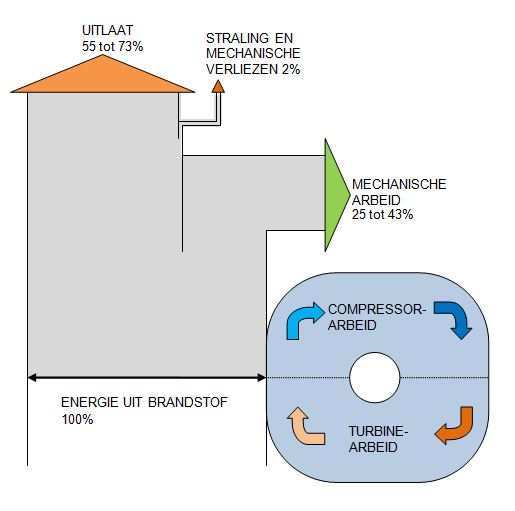
> *Image: Janhuisman42, CC BY-SA 3.0*

- **[Gas Turbines](gas-turbine.md)** — Brayton cycle gas turbines for combined-cycle power plants (55-60%+ efficiency), industrial process heat, and mechanical drive applications.
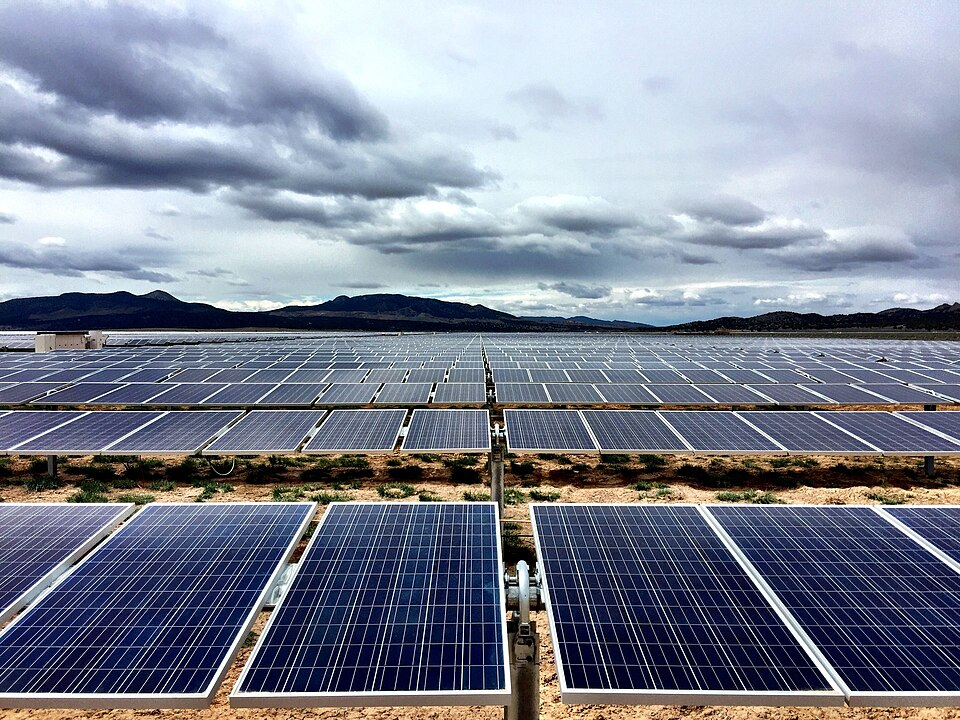
> *Image: Photo by Reegan Moen. – U.S. Department of Energy from United States, Public domain*

- **[Photovoltaics](photovoltaics.md)** — Solar photovoltaic power from p-n junction cells through module assembly to grid-connected systems. Monocrystalline ~22%, polycrystalline ~18%, amorphous ~10% efficiency.
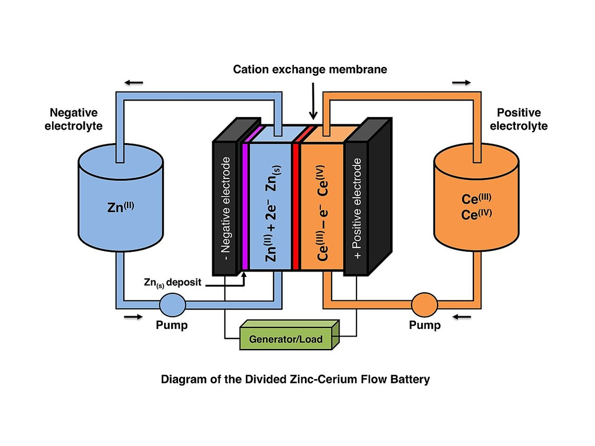
> *Image: Earth-Rare, CC BY-SA 3.0*

- [SEM Tech Redox Flow Batteries](redox-flow-battery.md) — grid-scale energy storage
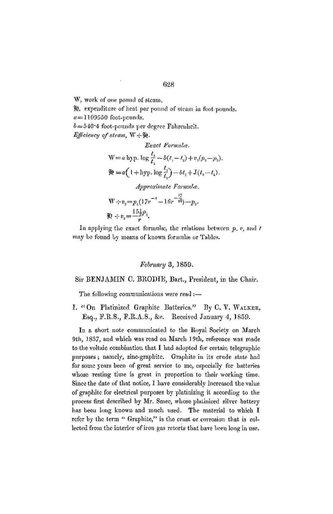
> *Image: Credit: Dark Energy Survey/DOE/FNAL/DECam/CTIO/NOIRLab/NSF/AURA

Image processing: R. Colombari &amp; M. Zamani (NSF NOIRLab), CC BY 4.0*

- [Graphite Electrode Manufacturing](electrode-manufacturing.md) — Production of graphite electrodes for electric arc furnaces from petroleum coke and coal tar pitch.
<!-- TODO: source image for Furnace Design Principles -->
- [Furnace Design Principles](furnace-design.md) — Heat transfer, combustion stoichiometry, refractory selection, furnace geometry, insulation design, flue gas handling, and fuel-to-heat efficiency applicable to all furnace types.

> *Image: Ferguson Brothers Ltd., CC BY 2.5*

- [Steam Engine](steam-engine.md) — Reciprocating steam engines (5-500+ HP) converting pressurized steam to rotational power for industrial drives and electricity generation.
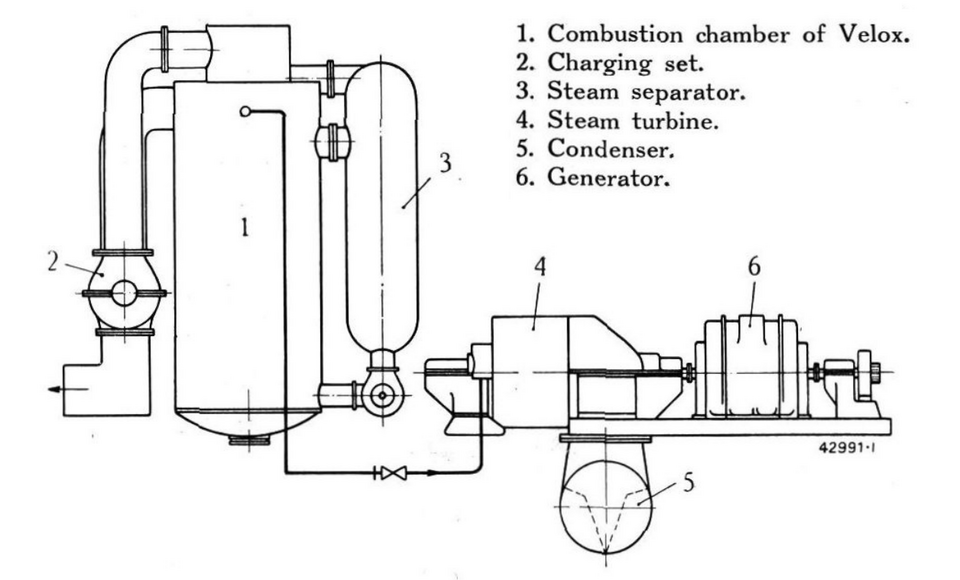
> *Image: Unknown, not credited in publication., Public domain*

- [Boiler](boiler.md) — Steam generation vessels (fire-tube and water-tube) producing pressurized steam for power, heating, and process applications.

> *Image: K.Venkataramana, CC BY-SA 4.0*

- [Electric Motor](electric-motor.md) — DC and AC electric motors converting electrical energy to mechanical rotation for industrial drives.
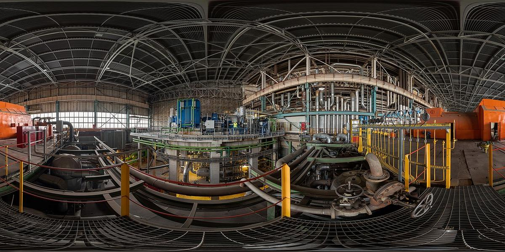
> *Image: Lauri Veerde, CC BY-SA 4.0*

- [Generator](generator.md) — Electromagnetic generators (dynamos and alternators) converting mechanical rotation into electrical power.
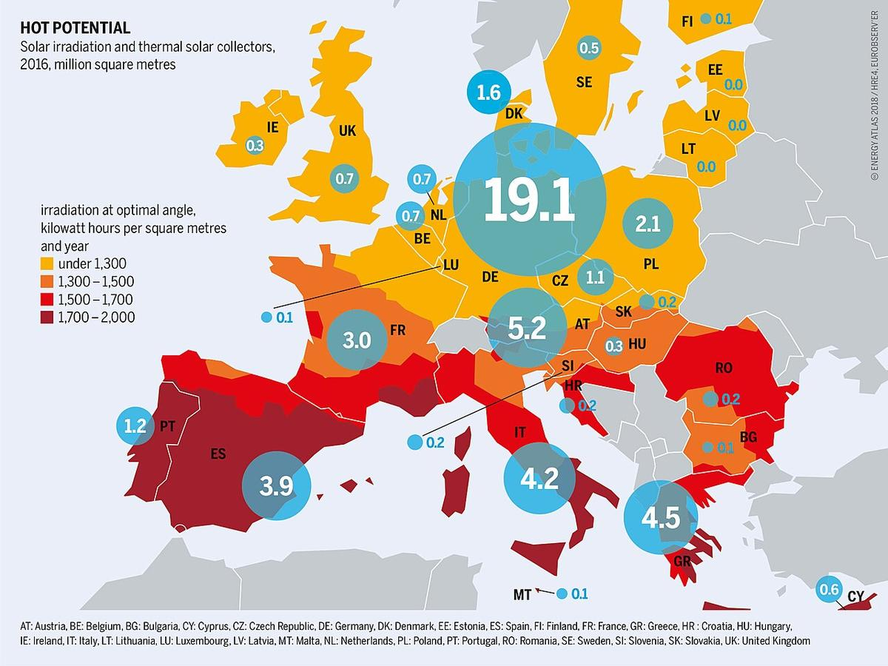
> *Image: Bartz/Stockmar, CC BY-SA 4.0*

- [Solar Collector](solar-collector.md) — Solar thermal collectors (flat plate and concentrating) for converting sunlight to useful heat.
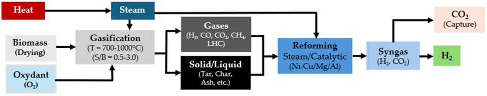
> *Image: Rey, José Ramón Copa, Cecilia Mateos-Pedrero, Andrei Longo, Bruna Rijo, Paulo Brito, Paulo Ferreira, and Catarina Nobre., CC BY-SA 4.0*

- [Gasifier](gasifier.md) — Biomass and coal gasification reactors converting solid fuel to combustible producer gas for engines and synthesis.
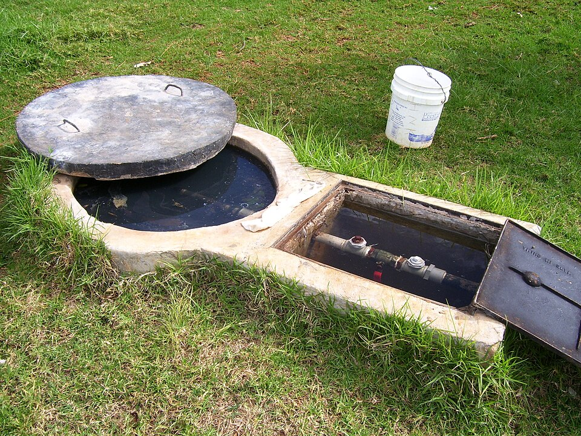
> *Image: Chris, CC BY-SA 2.0*

- [Biogas Digester](biogas-digester.md) — Anaerobic digestion systems converting organic waste to methane biogas for cooking, heating, and power generation.
[↑ Back to Tech Tree](../index.md)

> *Image: International Energy Agency, CC BY 4.0*
