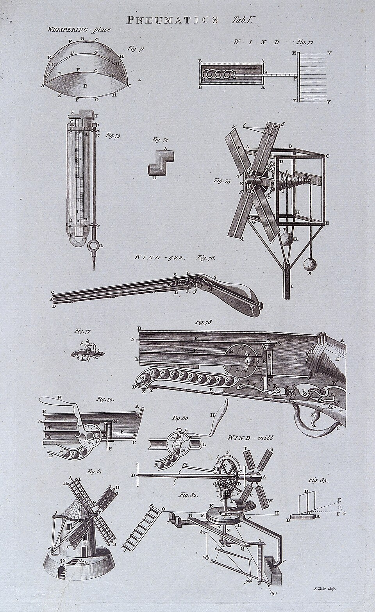

# Pneumatics

> **Node ID**: energy.pneumatics
> **Domain**: [Energy](./index.md)
> **Dependencies**: [`Construction & Structural Engineering`](../construction/index.md)
> **Enables**: [`Gas Handling`](../gas-handling/index.md), [`Energy`](index.md)
> **Timeline**: Years 15-25
> **Outputs**: compressed-air-systems, pneumatic-tools
> **Critical**: No

## Overview

> *Pneumatics Iconographic Collections*

> *Image: Wikimedia Commons contributor, CC BY 4.0*

Compression, storage, and distribution of air at pressure for mechanical work. Pneumatic systems use compressed air to power drills, hammers, hoists, and actuators in mining, construction, and manufacturing. Enables safe energy transmission in wet or explosive environments where electric motors are hazardous.

Compressed air systems consist of a compressor (reciprocating, rotary screw, or centrifugal), an air receiver tank for storage and pulsation dampening, aftercoolers and dryers to remove moisture, filters to remove oil and particulates, and a distribution network of pipes and fittings delivering air to point-of-use tools and actuators. Pressure regulators at each drop maintain consistent tool performance regardless of upstream pressure variations.

The primary advantage of pneumatics over other power transmission methods is safety in hazardous environments. Compressed air tools produce no sparks, are unaffected by water immersion, and pose no electrocution risk. The exhaust air provides natural cooling to the tool. These characteristics made pneumatic tools the standard for mining operations long before electric tools were considered safe for underground use.

The historical development of pneumatic technology closely parallels the development of mining and construction, with pneumatic drills enabling the tunneling projects that created the first continental rail networks and pneumatic hammers driving the rivets that held early steel bridges and skyscrapers together.

## Prerequisites

### Materials

- Steel or aluminum piping for distribution mains (schedule 40 pipe minimum for screw compressor systems)
- Rubber or polyurethane hoses for tool connections with appropriate pressure rating
- Compressor lubricants (ISO VG 32 or 46 for rotary screw compressors)
- Desiccant (activated alumina or silica gel) for regenerative dryers
- Filter elements (coalescing, particulate, activated carbon) for air treatment

### Equipment

- [Construction & Structural Engineering](../construction/index.md) — tool dependency
- Air compressors (reciprocating, rotary screw, centrifugal)
- Air receivers, aftercoolers, dryers (refrigerated or desiccant), and filtration units
- Pneumatic tools (drills, grinders, impact wrenches, hoists, cylinders)

### Knowledge

- Knowledge of compressor types and their pressure/flow characteristics: reciprocating for high pressure, rotary screw for continuous duty, centrifugal for high volume
- Understanding of air treatment: drying (refrigerated and desiccant), filtration (particulate, coalescing, activated carbon), and lubrication (FRL units)
- Ability to size compressed air distribution piping to minimize pressure drop at design flow
- Safety training for pressure vessel inspection and compressed air hazards
- Familiarity with ISO 8573 air quality classes for particles, water, and oil content
- Understanding of compressor capacity control methods (load/unload, variable displacement, VFD)

### Infrastructure

- Compressor room with noise isolation and cooling ventilation (compressors reject significant heat)
- Pressurized distribution piping network from compressor room to all points of use
- Air receiver(s) sized for pulsation dampening and stored emergency air volume
- Electrical supply sized for compressor motor starting current (often 5-10× running current for across-the-line start)
- Condensate drain and oil-water separator for compressed air moisture removal
- Backup compressor or redundant capacity for critical applications

## Process Description

A compressed air system draws ambient air through intake filters, compresses it to system pressure, cools and dries it, stores it in receivers, and distributes it through piping to pneumatic tools and actuators. Each stage removes specific contaminants: intake filters remove dust, aftercoolers condense water, dryers reduce dew point, and filters remove oil aerosol and fine particulates.

### Step-by-Step Procedure

1. Verify compressor intake filter is clean. Check oil level in the compressor sump. Confirm that condensate drain valves on the receiver and aftercooler are functioning (automatic drains cycle periodically; manual drains must be operated daily).
2. Start the compressor and allow it to load. Monitor discharge pressure and temperature. Discharge temperature above 100°C on a rotary screw compressor indicates potential cooler fouling or low oil level.
3. Verify that the aftercooler reduces air temperature to within 10°C of ambient. If air enters the dryer too hot, the refrigerated dryer cannot achieve rated dew point. Check dryer dew point indicator.
4. Confirm that the air receiver is maintaining system pressure within the load/unload pressure band. If the compressor short-cycles (loads and unloads rapidly), there is either a leak downstream or the receiver is undersized.
5. At each point of use, verify that the FRL (filter-regulator-lubricator) unit is delivering the correct pressure. Adjust regulators to tool manufacturer specification. Check that the lubricator contains oil and is dispensing at the correct drip rate.
6. Walk the distribution system listening for leaks. Use ultrasonic leak detector for difficult-to-reach fittings. Tag and repair all leaks found. Document system pressure drop from compressor discharge to farthest point of use; if it exceeds 10% of system pressure, piping is undersized or leakage is excessive.

### Process Parameters

| Parameter | Range | Notes |
|-----------|-------|-------|
| System pressure | 6–10 bar | 7 bar is standard industrial; 10 bar for heavy tools |
| Air quality (ISO 8573) | Class 1-7 | Class 1 (ultra-clean) for instruments; Class 7 (general) for blow guns |
| Pressure dew point | +3°C to -40°C | Refrigerated dryer: +3°C. Desiccant dryer: -40°C or lower |
| Distribution velocity | <6 m/s in mains | Higher velocity increases pressure drop and turbulence |
| Compressor discharge temp | <100°C | Higher indicates cooler fouling or mechanical issue |

## Cylinder Sizing and Air Consumption

Pneumatic cylinders produce force through air pressure on the piston area. Because air is compressible, the actual force delivered depends on the working pressure in the cylinder during the stroke, not just the supply pressure.

**Cylinder force at 7 bar (gauge) supply**:

| Bore (mm) | Extension Force (N) | Extension Force (kgf) | Air Volume per Stroke (L/100mm) |
|-----------|--------------------|-----------------------|--------------------------------|
| 25 | 344 | 35 | 0.05 |
| 32 | 563 | 57 | 0.08 |
| 40 | 880 | 90 | 0.13 |
| 50 | 1,375 | 140 | 0.20 |
| 63 | 2,181 | 222 | 0.31 |
| 80 | 3,519 | 359 | 0.50 |
| 100 | 5,498 | 561 | 0.79 |
| 125 | 8,593 | 876 | 1.23 |
| 160 | 14,080 | 1,436 | 2.01 |
| 200 | 21,991 | 2,242 | 3.14 |

**Force formula**: F = P × π × (d/2)², where P = gauge pressure (Pa) and d = bore (m). At 7 bar (700,000 Pa), a 50 mm bore cylinder: F = 700,000 × π × (0.025)² = 1,375 N.

**Air consumption calculation**: The volume of free air (atmospheric conditions) consumed per stroke is much larger than the cylinder volume because the air is compressed. Free air consumption per stroke: V_free = V_cylinder × (P_gauge + 1.013) / 1.013, where V_cylinder = π × (d/2)² × stroke. A 50 mm bore, 200 mm stroke cylinder at 7 bar: V_cylinder = 0.393 L, V_free = 0.393 × 8.013 / 1.013 = 3.1 L of free air per stroke. At 30 cycles/minute, consumption = 93 L/min free air (0.093 m³/min).

**Compressor sizing rule**: Total the free air consumption of all actuators, add 20-30% for leakage (a well-maintained system leaks 10-20% of capacity; typical industrial plants leak 20-30%), then select a compressor rated for 1.2-1.5× the total. A workshop with three 50 mm bore cylinders running at 30 cycles/min each needs: 3 × 93 = 279 L/min + 30% leakage = 363 L/min. Select a compressor rated for at least 440 L/min (0.44 m³/min) free air delivery.

**Pipe sizing**: For a main distribution line carrying 500 L/min free air at 7 bar, the compressed air volume flow is 500/8 ≈ 62.5 L/min. At a target velocity of 6 m/s: pipe area = 62.5 / (1000 × 60 × 6) = 0.000174 m², giving pipe ID = √(4 × 0.000174 / π) ≈ 15 mm. Use 20-25 mm nominal pipe for this flow to keep pressure drop below 0.1 bar per 100 m of pipe.

The compressibility of air, while making pneumatics less energy-efficient than hydraulics for force multiplication, provides an inherent cushioning effect that protects both equipment and workpieces from shock loads. Pneumatic cylinders can stall against a hard stop without damage, whereas hydraulic cylinders would generate destructive pressures. This compliance makes pneumatic actuators well-suited for pick-and-place operations, clamping, and applications where the load position varies unpredictably.

## Safety Considerations

Pneumatic systems present hazards from pressure vessel rupture, air blast injury, noise exposure, and compressor mechanical failure:

- **Pressure vessel explosion**: Compressed air receivers are pressure vessels that can explode catastrophically if corroded, over-pressurized, or damaged. Regular internal inspection and hydrostatic testing at specified intervals is mandatory. Pressure relief valves must be tested and verified on schedule.
- **Air blast injection injury**: Air discharged from pneumatic tools or open hoses can inject air into the bloodstream through skin contact at close range, causing fatal embolism. Never point compressed air at any body part, even at low pressure. Never use compressed air to blow dust off clothing.
- **Noise exposure**: Pneumatic tools and compressor exhaust frequently exceed 100 dB(A). Hearing protection is mandatory for all personnel in compressor rooms and near operating pneumatic tools.
- **Compressor fire**: Oil-flooded rotary screw compressors carry large volumes of lubricating oil. Carbon deposits in discharge piping from degraded oil can ignite, causing fires or explosions in the air system. Regular oil analysis and discharge pipe inspection prevent carbon buildup.
- **Hose whip**: A disconnected pressurized hose whips violently. Hose connections must include whip checks (safety chains or cables) on all flexible connections.

### Personal Protective Equipment

- Safety glasses with side shields and face shield when using pneumatic grinding or chipping tools
- Hearing protection rated for the tool and environment (often 25+ dB NRR for compressor rooms)
- Steel-toe boots when operating pneumatic tools that produce recoil (jackhammers, impact wrenches)
- Respiratory protection when blowing dust or working in enclosed spaces with exhaust air
- Anti-vibration gloves for sustained use of percussive pneumatic tools (chipping hammers, riveters)

### Emergency Procedures

- Test pressure relief valves on receivers at specified intervals; tag with test date and set pressure
- Verify automatic drain valve operation on receivers and filters daily
- Post compressor emergency shutdown procedure at the compressor control panel
- Establish lockout/tagout procedure for compressor motor and receiver isolation valve during maintenance
- Train personnel on first aid for air blast injection injury: immediate transport to emergency room even if wound appears minor

## Quality Control

### Acceptance Criteria

- **Compressed Air Systems**: System pressure maintained within ±0.5 bar at all points of use; dew point within specification for the application; oil content below ISO 8573 class limit
- **Pneumatic Tools**: Operating speed and power within manufacturer specification at rated pressure; exhaust air quality acceptable for the work environment

### Testing Methods

- Pressure vessel inspection per applicable boiler and pressure vessel code (visual, thickness measurement, hydrostatic test)
- Dew point measurement at point of use using calibrated hygrometer for moisture-sensitive applications
- Leak rate survey using ultrasonic detection equipment; quantify total leakage as percentage of compressor capacity
- Oil content measurement at point of use using oil aerosol detector for paint spray and instrument air applications
- Flow capacity test at each major drop: verify that pressure drop at design flow is within specification
- Particle count measurement for ISO 8573-1 compliance in cleanroom or pharmaceutical air systems

### Sampling Protocol

- Measure dew point at point of use weekly during humid seasons; compare to dryer specification
- Track compressor discharge temperature daily as an indicator of valve condition and cooler performance
- Perform leak survey monthly using ultrasonic detector; document total leak count and estimated leakage rate
- Sample compressor oil quarterly for viscosity, acidity, and particulate content to schedule oil changes
- Test receiver pressure relief valve annually and record pop pressure
- Verify automatic drain operation on all receivers and filters during each shift walkdown

## Scaling Notes

Compressed air is among the most expensive industrial utilities when measured per unit of energy delivered. Compression efficiency is inherently limited by thermodynamics, as much of the input energy converts to heat in the compressed air. Waste heat recovery from compressor intercoolers and aftercoolers can improve overall system economics by providing space heating or process heat.

- **Small workshop**: Single reciprocating compressor, 3-10 kW, feeding a small receiver and short distribution lines. Powers nail guns, small impact wrenches, spray guns. System pressure: 7-8 bar.
- **Industrial plant**: Rotary screw compressor(s), 50-200 kW, with refrigerated dryer, wet and dry receivers, and loop distribution mains. Powers production tools, pneumatic cylinders, and process equipment. Air treatment to ISO 8573 Class 1.4.1 or better.
- **Mining or heavy construction**: High-pressure reciprocating compressors, 100-500+ kW, feeding extensive distribution networks underground or across large sites. Desiccant dryers for freeze protection in cold climates. Redundant compressors for reliability.

Leakage in distribution piping is a chronic source of energy waste in pneumatic systems. A single 3 mm leak at 7 bar wastes approximately 0.6 m³/min of compressed air, representing significant compressor power running continuously. Ultrasonic leak detection and regular inspection of joints and fittings are standard maintenance practices. Distribution piping should be sized to minimize pressure drop from friction, with loop mains providing multiple paths to each point of use.

Air preparation at each point of use includes a filter, regulator, and lubricator (FRL unit). The filter removes moisture and particulates carried from the distribution piping. The regulator reduces line pressure to the tool's operating pressure. The lubricator injects a fine mist of oil into the air stream to lubricate pneumatic tool internals. Some modern pneumatic tools are designed for oil-free operation and do not require the lubricator, simplifying maintenance.

## Troubleshooting

| Problem | Probable Cause | Solution |
|---------|---------------|----------|
| Pressure drop at farthest tools (>0.5 bar below compressor discharge) | Leaks in distribution or undersized piping | Locate and repair leaks using ultrasonic detector. A single 3 mm hole at 7 bar wastes ~0.6 m³/min of free air — at ~8 kW per m³/min compressor power, that leak costs ~4.8 kW continuously. Verify pipe sizing matches flow demand: for 500 L/min at 7 bar, main line should be ≥20 mm ID. If total leakage exceeds 20% of compressor capacity, institute a systematic leak repair program |
| Water in airlines reaching tools | Failed dryer, undersized aftercooler, or clogged drain | Service dryer (replace refrigerant compressor if not cooling; replace desiccant if dew point rising above -20°C). Clean aftercooler tubes. Verify automatic drain valve cycles correctly — stuck-closed drains allow water to accumulate and carry over into distribution lines. A properly functioning aftercooler should reduce air temperature to within 10°C of ambient, condensing 60-80% of the moisture |
| Short pneumatic tool life (seals failing in <6 months) | Contaminated air (oil, water, particulates) reaching tool | Check and replace filters. Install point-of-use coalescing filter for oil removal (target: <0.01 mg/m³ oil content). Verify dryer performance with dew point meter at point of use. For pneumatic tools rated at 7 bar, water contamination above 0.5 g/m³ washes out internal lubrication and corrodes precision surfaces. Install point-of-use lubricator set to 1-3 drops/minute for tools requiring lubrication |
| Compressor short-cycling (loading/unloading more than 6 times per minute) | Excessive leakage or undersized receiver | Perform leak survey with ultrasonic detector. The receiver should be sized at 15-30% of the compressor free air delivery per minute to buffer the load/unload cycle. Example: a compressor delivering 500 L/min needs a receiver of 75-150 liters minimum. If the existing receiver is smaller, add a second receiver in parallel. Short-cycling wastes energy (each load cycle draws peak motor current) and shortens compressor valve life |
| Compressor overheating (discharge >100°C) | Fouled oil cooler or low oil level in screw compressor | Clean cooler fins with compressed air or steam — a 10% reduction in cooler airflow raises discharge temperature ~15-20°C. Check and top up oil: rotary screw compressors carry 30-80 liters of lubricant; low oil reduces both cooling and sealing. Verify thermostat operation. For reciprocating compressors, check intercooler tubes for carbon buildup (common after 5,000+ hours on mineral oil) and clean mechanically |
| High energy consumption (kW per m³/min above rated) | System leaks, restricted intake filter, or compressor unload valve failure | Fix leaks first — they are the cheapest to address. Measure compressor specific power: a rotary screw compressor at 7 bar should draw 6-8 kW per m³/min of free air delivered. If drawing >10 kW per m³/min, the compressor is worn or controls are malfunctioning. Check load/unload solenoid valve: if stuck in load position, the compressor runs at full power even during no-demand periods |
| Cylinder moving too slowly | Supply pressure too low at the cylinder, or flow restriction in the piping | Measure pressure at the cylinder inlet with a gauge while the cylinder is moving — not at rest. If pressure drops more than 1 bar below setpoint during motion, the supply line is restricting flow. Check FRL regulator setting (should be 6.3 bar for a 7 bar system). Verify quick-connect fittings are fully seated — partially engaged fittings restrict flow by 50-80%. For a 50 mm bore cylinder, a flow restriction that reduces effective pressure from 6.3 to 4 bar reduces force by 37% and speed proportionally |
| Cylinder not extending at all | Pilot valve not actuated, or muffler/exhaust blocked | Check that the pilot signal reaches the directional valve (measure pilot pressure at the valve — needs >2.5 bar to shift). Verify exhaust is not blocked — a blocked muffler on the exhaust port creates back-pressure that prevents the spool from shifting. For spring-return cylinders, check that the spring is not broken (extend cylinder with air, then vent — it should retract under spring force within 1-2 seconds) |
| Excessive moisture in system during humid months | Dryer undersized for peak summer humidity, or dryer not maintaining dew point | Size dryer for worst-case conditions: 35°C ambient, 90% RH inlet air requires 30-40% more drying capacity than the same compressor at 20°C, 50% RH. Check dryer dew point indicator — if showing above +5°C on a refrigerated dryer rated for +3°C, the dryer needs service (refrigerant charge, condenser cleaning, or evaporator cleaning). For critical applications, install a desiccant dryer as a backup for high-humidity months |

## Variations and Alternatives

- **Pneumatic logic circuits**: Networks of valves that perform sequencing, timing, and safety interlock functions without electrical controls. Useful in environments with high electromagnetic interference or where intrinsic safety requirements preclude electrical components. Simple circuits built from AND, OR, NOT, and memory valve elements, analogous to electronic logic gates.
- **Vacuum pneumatics**: Vacuum generators (ejectors or vacuum pumps) create suction for lifting, holding, and pick-and-place applications using vacuum cups and pads. Common in packaging and material handling.
- **Electropneumatic systems**: Solenoid valves controlled by PLC outputs combine the safety and force of pneumatics with the flexibility of electronic control. The standard approach for modern automated manufacturing.
- **Compressed air energy storage**: Large-scale compression of air into underground caverns for grid energy storage. At utility scale, this is a bulk energy storage technology rather than a power transmission method.

Pneumatic actuators are available in linear cylinder, rotary vane, and gripper configurations, providing a range of motion types suitable for pick-and-place, clamping, and positioning tasks in automated manufacturing systems.

The dew point of compressed air, the temperature at which moisture condenses, must be controlled to prevent water from reaching pneumatic tools and actuators. Refrigerated dryers reduce dew point to a few degrees above freezing, while desiccant dryers can achieve dew points well below freezing for instrument air and paint spray applications where even trace moisture is unacceptable.

The economics of compressed air systems often suffer from neglect of leakage and inadequate maintenance. Studies consistently find that 20-30% of compressor output in typical industrial plants is lost to leakage. A systematic leak detection and repair program, combined with proper pipe sizing and regulator adjustment, can reduce compressed air energy consumption by 20-40% at modest cost.

Reciprocating compressors use pistons to compress air in cylinders. They are the oldest compressor type, capable of delivering the highest pressures (up to 30+ bar for multi-stage units), but produce pulsating flow that requires receiver dampening. Rotary screw compressors trap air between intermeshing helical rotors, providing smooth, continuous output suitable for constant-demand applications. Centrifugal compressors use impeller velocity to compress air and are used for very high volume, lower-pressure applications.

The compressor oil carryover into the compressed air stream is a concern for pneumatic tool life and product quality. Oil-flooded rotary screw compressors rely on efficient oil separation (typically multi-stage coalescing separators) to keep oil content below acceptable limits. For applications requiring oil-free air (food processing, pharmaceutical, electronics), dry screw compressors or oil-free reciprocating designs eliminate oil contamination at the source, though at higher capital cost.

Pneumatic conveying systems use compressed air to transport powders and granular materials through pipelines. Dilute-phase conveying suspends particles in a high-velocity air stream, suitable for light, non-abrasive materials. Dense-phase conveying pushes slugs of material at lower velocity, reducing particle degradation and pipeline wear. Both require careful air volume and pressure calculation based on material density, particle size, conveying distance, and elevation change.

Compressed air motors convert pneumatic energy to rotary motion for applications where electric motors are unsuitable (explosive atmospheres, wet environments, frequent stall conditions). Vane-type air motors provide smooth output and can stall without damage, restarting automatically when load is removed. Gear-type air motors deliver higher starting torque but with more pulsation.

Pneumatic safety circuits use air pressure to hold safety interlocks in the safe state. Loss of air pressure (from compressor failure or line breakage) causes the safety devices to fail safe, dropping loads, applying brakes, or shutting down equipment. This fail-to-safe behavior without electrical power is the reason pneumatic interlocks are required on many types of industrial machinery.

## References

- [Energy](index.md) — parent capability
- [Energy Domain](./index.md) — domain overview and related capabilities
- [Construction & Structural Engineering](../construction/index.md) — upstream dependency (tool)
- [Gas Handling](../gas-handling/index.md) — downstream capability
- [Energy](index.md) — downstream capability

### Material Handling

Proper handling of compressor consumables, filters, and pneumatic components maintains air quality and system reliability:

- Drain receiver tanks daily to prevent water accumulation and internal corrosion. Automatic drains should be verified, not assumed.
- Keep compressor intake filters clean and replace on scheduled intervals. A dirty intake filter reduces compressor capacity and increases discharge temperature.
- Store desiccant dryer media in sealed containers. Exposed desiccant absorbs atmospheric moisture and loses capacity before it is even installed.
- Replace lubricator oil with pneumatic-grade oil only. Motor oil and general-purpose lubricants cause valve sticking and seal swelling in pneumatic tools.
- Store pneumatic cylinders and valves with ports plugged to prevent contamination ingress before installation.
- Label all hoses and quick-disconnect fittings with rated pressure to prevent using low-pressure hoses on high-pressure circuits.
- Conduct annual pressure vessel inspection of all receivers per applicable code and record inspection results
- Verify compressor unload valve operation during weekly no-load test runs
- Log compressor running hours to schedule preventive maintenance per manufacturer intervals
---
*Part of the [Bootciv Tech Tree](../index.md) · [Energy](./index.md) · [All Domains](../index.md)*
