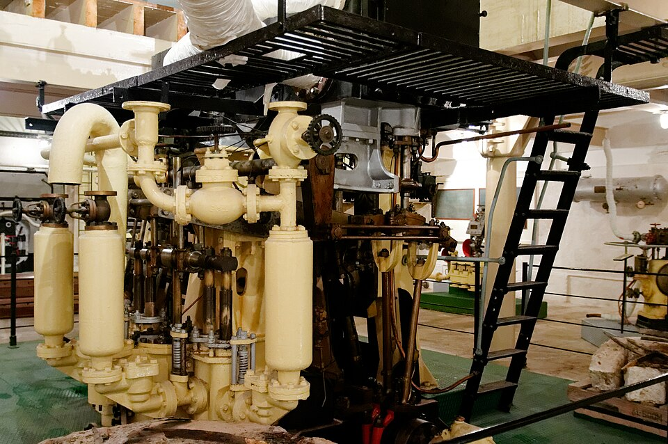

# Steam Engine (Reciprocating)

> **Node ID**: energy.steam-power.steam-engine
> **Domain**: [Energy](./index.md)
> **Dependencies**: [`energy.steam-power`](steam-power.md), [`machine-tools.machining`](../machine-tools/machining.md), [`metals.iron-steel`](../metals/iron-steel.md), [`machine-tools.casting`](../metals/casting.md)
> **Enables**: [`energy.steam-power.steam-turbines`](steam-turbines.md), [`transport.railways`](../transport/railways.md), [`marine.propulsion`](../marine/propulsion.md), [`mining.drilling`](../mining/drilling.md)
> **Timeline**: Years 15-25
> **Outputs**: rotary_mechanical_power, reciprocating_steam_power
> **Critical**: Yes — the reciprocating steam engine is the first practical mechanical prime mover independent of geography; required before steam turbines or large-scale electricity generation

## Overview

> *Image: Ferguson Brothers Ltd., CC BY 2.5*

A reciprocating steam engine converts the pressure energy of steam into mechanical work through a piston moving in a cylinder. High-pressure steam from a [boiler](boiler.md) enters the cylinder, pushing the piston through its power stroke. The steam is then exhausted — either to atmosphere (non-condensing) or to a condenser that creates vacuum on the exhaust side, increasing the pressure differential and efficiency. A crankshaft and connecting rod convert the piston's linear motion to rotary output.

The governing relationship is: Force = Pressure × Area. A piston of 400 mm diameter at 10 bar steam pressure produces F = 10 × 10⁵ Pa × π × (0.2)² m² ≈ 125,700 N ≈ 12.8 tonnes of force. This force, applied over the stroke length at several cycles per minute, produces continuous rotary power. Efficiency improves with higher boiler pressure, earlier steam cutoff (expansive working), condenser vacuum, and multiple expansion stages.

Position in the dependency chain: the steam engine depends on [Steam Power](steam-power.md) (boiler, steam supply, condenser), [Casting](../metals/casting.md) (cylinder block, flywheel, valve chest), [Machining](../machine-tools/machining.md) (precision cylinder boring), and [Iron & Steel](../metals/iron-steel.md) (structural materials, piston rod, connecting rod). It enables [Steam Turbines](steam-turbines.md) (the turbine evolved directly from the reciprocating engine), [Railways](../transport/railways.md) (steam locomotives), [Marine Propulsion](../marine/propulsion.md) (steamships), and [Mining](../mining/drilling.md) (pumping and hoisting). The steam engine is the first practical mechanical prime mover independent of geography — unlike waterwheels and windmills, it works anywhere fuel and water are available.

## Prerequisites

- [Cast iron cylinder](../metals/casting.md) — bored to ±0.1 mm tolerance on a boring machine
- [Wrought iron or steel plate](../metals/iron-steel.md) — for boiler, steam pipes, and structural frame
- [Boiler](boiler.md) — producing steam at 5-15 bar for high-pressure engines, or 0.5-2 bar for early Watt-style engines
- [Boring machine](../machine-tools/machining.md) — for cylinder precision
- [Foundry](../metals/casting.md) — for cylinder block, flywheel, and valve chest castings
- [Lubricants](../chemistry/lubricants.md) — tallow or mineral oil for cylinder and bearing lubrication

## Bill of Materials

| Material | Quantity | Specifications | Source | Alternatives |
|----------|----------|----------------|--------|-------------|
| [Cast iron cylinder block](../metals/casting.md) | 1 piece | 300-500 mm bore × 400-800 mm stroke, 400-800 kg | Foundry | Steel fabrication (welded, heavier) |
| [Wrought iron or steel piston rod](../metals/iron-steel.md) | 1 piece | 60-120 mm diameter × 1.5-3 m long, turned | Forge/machine shop | None — precision-turned shaft required |
| [Cast iron flywheel](../metals/casting.md) | 1 piece | 1.5-3 m diameter, 500-1500 kg | Foundry | Built-up flywheel (plate + spokes) |
| [Wrought iron or steel connecting rod](../metals/iron-steel.md) | 1 piece | 50-80 mm × 100-150 mm cross-section, forged | Forge | Steel casting |
| [Brass valve fittings](../metals/copper-bronze.md) | 5-10 kg | Steam valve, throttle valve, drain cocks | Foundry | Bronze fittings |
| [Hemp or leather packing](../plants/fiber-plants.md) | 2-5 kg | Piston rings and gland packing | Agriculture | Asbestos rope (historical, avoid) |
| [Wrought iron steam pipes](../metals/iron-steel.md) | 20-50 kg | 50-100 mm bore, flanged joints | Forge/machine shop | Copper pipes (expensive) |
| [Steel bolts and nuts](../metals/steelmaking.md) | 10-20 kg | M16-M30, Grade 5.8+ | Machine shop | Riveted joints |
| [Lubricating oil](../chemistry/lubricants.md) | 10-20 liters | Cylinder oil + bearing oil | Chemistry | Tallow (shorter life) |
| [Cast iron bed plate](../metals/casting.md) | 1 piece | 2-4 m × 1-2 m × 100-200 mm thick, 500-2000 kg | Foundry | Fabricated steel frame |

## Process Description

### Cylinder and Valve Chest

1. **Cast the cylinder block** in gray cast iron (Grade 20-25). Use a foundry sand mold with a core for the bore. Include integrally cast valve chest, steam inlet, and exhaust ports. Casting weight: 400-800 kg depending on size. Allow 2-3 mm machining allowance on bore.

2. **Bore the cylinder** on a horizontal boring machine to final diameter. Target tolerance: ±0.10 mm cylindricity over full stroke length. Surface finish: Ra 1.6-3.2 μm (the piston packing will conform to surface irregularities, but bore must be round and straight).

3. **Machine the valve chest face** flat for the slide valve or valve cover mounting. Surface finish Ra 3.2 μm. Drill and tap bolt holes on 100-150 mm spacing around the port face perimeter.

4. **Cut steam ports** in the valve face: one admission port and one exhaust port, each approximately 10-15% of bore cross-sectional area. Port edges should be smooth to minimize throttling losses.

### Piston and Running Gear

5. **Turn the piston** from cast iron to fit the bore with 0.20-0.40 mm diametral clearance. Cut two to four ring grooves for hemp packing rings. The piston body should be 50-80 mm thick, lightweight enough to reduce reciprocating mass but rigid under steam pressure.

6. **Forge the piston rod** from wrought iron or medium-carbon steel (1045). Turn to final diameter, thread both ends (one for piston attachment, one for crosshead). Surface finish: Ra 0.8 μm on the gland sealing area.

7. **Fabricate the crosshead** from cast iron or steel. Bore for piston rod fit, machine flat slides on either side for crosshead guide. Crosshead pin diameter: 40-80 mm, hardened and ground.

8. **Forge the connecting rod** from wrought iron or steel. Big end bore for crankpin: 60-100 mm diameter, split for bearing insertion. Small end bore for crosshead pin. Length: 2-4× the stroke. Machine bearing surfaces and drill for lubrication passages.

### Crankshaft and Flywheel

9. **Forge or build up the crankshaft**. For smaller engines (<50 HP), forge from a single billet of medium-carbon steel with a crank throw equal to half the stroke. For larger engines, build up from separate crank web forgings and a crankpin, shrunk and keyed together. Crankpin diameter: 80-150 mm, hardened to HRC 40-50.

10. **Turn the main bearing journals** on a lathe to ±0.05 mm tolerance. Surface finish: Ra 0.8 μm. Install in split bearing housings with babbitt-lined shells. Bearing clearance: 0.1% of shaft diameter.

11. **Mount the flywheel** on the crankshaft using a keyed shrink fit. The flywheel stores energy during the power stroke and returns it during the exhaust and return strokes, maintaining smooth rotation. Flywheel weight: 500-1500 kg depending on engine size and speed.

### Valve Gear and Governor

12. **Install the slide valve or piston valve** in the valve chest. A simple D-slide valve (cast iron, lap-fitted to port face) moves back and forth, alternately opening steam and exhaust ports. For higher efficiency, use a Corliss rotary valve gear with separate admission and exhaust valves at each cylinder end.

13. **Mount the eccentric(s)** on the crankshaft to drive the valve. One eccentric for single-acting (simple forward/reverse), two eccentrics for double-acting with Stephenson valve gear. Eccentric throw: 25-50 mm, keyed to shaft.

14. **Install the centrifugal governor** (flyball type). Two rotating balls on hinged arms, driven from the crankshaft via bevel gears or belt. As speed increases, balls swing outward, raising a sleeve that partially closes the throttle valve. Calibrate by adjusting the spring or counterweight to maintain rated speed within ±5%.

### Assembly and Steam Connections

15. **Mount the cylinder on the bedplate** with the crankshaft main bearings aligned. Use a machinist's level to verify that the cylinder bore is parallel to the crankshaft axis within 0.05 mm/m. Shim as needed.

16. **Install the crosshead guides** and verify that the piston rod moves through the gland packing without binding through the full stroke. Adjust guide alignment until crosshead slides freely.

17. **Connect the steam supply** from the [boiler](boiler.md) via a throttle valve and steam pipe (50-100 mm bore, rated for 1.5× working pressure). Install a drain cock at the lowest point of the steam pipe to remove condensate before starting.

18. **Install the exhaust system** — either a pipe to atmosphere (non-condensing, simpler) or a connection to a surface condenser (condensing, higher efficiency). For condensing operation, see [Steam Turbines](steam-turbines.md) for condenser design.

19. **Pressure-test the entire steam side** at 1.5× working pressure with the throttle valve open and cylinder disconnected. Verify no leaks at flanges, valve chest cover, and gland packing.

## Calibration and Verification

1. **Bar the engine over** by hand (using a bar in the flywheel spoke holes). The engine must rotate through the full 360° without binding. If resistance is felt, locate and correct the interference before applying steam.

2. **Check valve timing**: With the flywheel at top dead center (TDC), the steam admission port should begin to open. Adjust the eccentric position on the crankshaft to achieve correct admission timing. Verify cutoff occurs at the design point (typically 25-50% of stroke for expansive working).

3. **First steam test**: Open drain cocks. Crack the throttle valve to admit low-pressure steam. The engine should rotate slowly, with condensate blowing out of drain cocks. When drains blow clear steam (cylinder is warm), close drain cocks and gradually open throttle to full.

4. **Measure speed**: Use a tachometer to verify the engine runs at rated speed (typically 100-300 RPM for stationary engines). Adjust governor spring to set the desired speed. Speed regulation should be within ±5% from no-load to full-load.

5. **Check bearing temperatures** after 30 minutes of running at full load. Babbitt bearing temperatures should not exceed 80°C. Hot bearings indicate misalignment, insufficient clearance, or inadequate lubrication.

## Quantitative Parameters

| Parameter | Value |
|-----------|-------|
| Power output (50 HP class) | 30-55 kW (40-70 HP) |
| Operating speed | 100-300 RPM |
| Steam pressure (early Watt) | 0.5-2 bar |
| Steam pressure (high-pressure) | 5-15 bar |
| Thermal efficiency (single-expansion) | 5-8% |
| Thermal efficiency (compound) | 8-12% |
| Steam consumption | 8-15 kg/HP-hour (non-condensing), 5-8 kg/HP-hour (condensing) |
| Cylinder bore | 200-800 mm (design-dependent) |
| Stroke | 300-1500 mm (design-dependent) |
| Flywheel diameter | 1.5-3 m |
| Dry weight (complete engine) | 3-15 tonnes |
| Service life before major overhaul | 10,000-30,000 hours |

## Strengths

- Burns any fuel — coal, wood, oil, gas, agricultural waste — unlike internal combustion engines that require refined fuel
- External combustion allows continuous, clean burning at optimal conditions
- High starting torque — full torque at zero speed, ideal for driving machinery from rest
- Simplicity at low pressures — early atmospheric and Watt-style engines require only basic foundry and boring capability

## Weaknesses

- Low power-to-weight ratio (0.01-0.05 kW/kg) — far heavier than internal combustion or electric motors for equivalent power
- Slow startup — 30 minutes to several hours to raise steam from cold
- Requires continuous boiler attention — water level, fuel feed, pressure monitoring
- Low thermal efficiency (5-12%) compared to steam turbines (30-40%) or diesel engines (35-45%)

## Compound and Multiple-Expansion Engines

Single-expansion engines exhaust steam at full pressure, wasting most of the steam's energy. A compound engine expands steam sequentially through two cylinders (high-pressure and low-pressure) of increasing bore, extracting more work from each unit of steam. A triple-expansion engine uses three cylinders (HP, IP, LP).

| Configuration | Cylinder Bores (example) | Steam Pressure | Thermal Efficiency | Steam Consumption |
|--------------|------------------------|----------------|-------------------|-------------------|
| Single-expansion | 400 mm | 5-10 bar | 5-8% | 8-15 kg/HP-hour |
| Compound (double) | HP: 250 mm, LP: 500 mm | 8-15 bar | 8-12% | 5-8 kg/HP-hour |
| Triple-expansion | HP: 200, IP: 350, LP: 600 mm | 12-20 bar | 10-14% | 4-6 kg/HP-hour |

The low-pressure cylinder must be large enough to accommodate the expanded steam volume. At 10 bar admission pressure exhausting to 0.15 bar (condenser vacuum), the steam expands ~30× in volume — the LP cylinder must be ~30× the HP cylinder volume. This geometric scaling is why triple-expansion engines are physically large: a 500 HP triple-expansion engine weighs 25-40 tonnes.

### Reciprocating vs. Turbine

| Parameter | Reciprocating Engine | Steam Turbine |
|-----------|---------------------|---------------|
| Power range | 1-5,000 kW | 50 kW - 1,000+ MW |
| Thermal efficiency | 5-14% (up to 20% uniflow) | 25-40% (combined cycle: 55-60%) |
| Steam pressure | 5-20 bar | 60-240 bar |
| Speed | 50-300 RPM | 1,500-10,000 RPM |
| Starting torque | Full torque at zero speed | Low starting torque — needs starter motor |
| Maintenance | Piston rings, valves, packing — frequent | Bearings and seals — less frequent |
| Complexity | Moderate (precision machining of cylinders) | High (precision blades, balanced rotor) |
| Fuel flexibility | Any boiler fuel | Any boiler fuel (requires clean steam) |
| Bootstrap accessibility | Year 15-25 (boring machine + foundry) | Year 25-40 (precision blade manufacture) |

Reciprocating steam engines are the bootstrap technology — they arrive first because the machining requirements (cylinder boring, flat surfaces, simple castings) are achievable with basic machine tools. Steam turbines produce higher efficiency at larger scale but require precision blade profiles, dynamically balanced rotors, and higher-pressure boilers, all of which arrive decades later.

## Scaling Notes

| Scale | Power | Cylinder Bore | Speed | Boiler Required | Weight | Application |
|-------|-------|-------------|-------|----------------|--------|-------------|
| Small stationary | 3-10 kW | 150-200 mm | 200-300 RPM | 0.5-2 bar (low-pressure) | 0.5-2 tonnes | Water pump, small workshop |
| Medium stationary | 20-75 kW | 300-500 mm | 100-200 RPM | 5-10 bar | 3-15 tonnes | Factory line shaft, mine pump |
| Large stationary | 100-500 kW | 500-800 mm | 60-120 RPM | 10-15 bar | 15-50 tonnes | Power generation, large mill |
| Marine | 200-5,000 kW | Multiple cylinders | 60-120 RPM | 12-20 bar | 50-200 tonnes | Ship propulsion |
| Railway locomotive | 200-2,000 kW | 2-4 cylinders | 200-400 RPM | 12-20 bar | 30-150 tonnes | Freight and passenger service |

Power scales approximately as P ∝ bore² × stroke × pressure × speed. Doubling power at the same speed and pressure requires ~41% increase in bore. Above 500 kW, steam turbines are more efficient and compact — reciprocating engines become uneconomical due to the size of the low-pressure cylinder(s) required.

Minimum economic scale: a 5 kW single-cylinder engine (200 mm bore × 300 mm stroke, 5 bar, 200 RPM) driving a small generator or water pump. Below 3 kW, direct mechanical power (water wheel, windmill, animal) is more practical because the boiler and engine together cost more in materials and labor than the alternative power source.

## Troubleshooting

| Problem | Probable Cause | Solution |
|---------|---------------|----------|
| Engine will not start (stuck) | Condensate in cylinder (hydraulic lock) | Open cylinder drain cocks; manually rotate flywheel to expel water; never admit steam to a cylinder containing water — it can bend the connecting rod |
| Engine will not start (stuck) | Piston rusted or scored in cylinder | Apply penetrating oil at the packing gland; warm the cylinder slowly with low-pressure steam; if severely scored, remove piston and hone the bore |
| Knocking sound in cylinder | Excessive clearance (worn bearings) or water hammer | Check bearing clearances (should be 0.1% of shaft diameter); verify drain cocks are open during startup; reduce steam admission rate |
| Knocking sound in cylinder | Loose crosshead or worn slides | Check crosshead guide clearances (should be 0.05-0.10 mm); resurface or shim guides |
| Loss of power | Valve timing incorrect (eccentric slipped) | Re-set eccentric position on crankshaft; verify admission begins at TDC and cutoff occurs at design point (25-50% of stroke) |
| Loss of power | Worn piston packing (steam blowing past piston) | Replace hemp packing rings; check bore for scoring — scored bores prevent packing seal |
| Excessive steam consumption | Steam cutting (wire-drawing) through partially open valves | Check valve face for grooving; re-lap the valve to port face; verify valve travel is correct |
| Excessive steam consumption | Leaking stuffing box (gland packing) | Tighten gland nuts evenly; if still leaking, repack with fresh hemp packing soaked in tallow |
| Governor hunting (speed oscillating) | Sticky governor linkage or worn throttle valve | Clean and lubricate all governor pivot points; check that throttle valve moves freely; adjust governor spring sensitivity |
| Overheating bearings | Insufficient lubrication or misalignment | Increase oil feed rate; verify alignment between cylinder bore and crankshaft (within 0.05 mm/m); check that babbitt lining is not worn through |

## Quality Control

- **Cylinder bore measurement**: Measure bore at three positions along the stroke (top, middle, bottom) and in two perpendicular planes. Maximum out-of-round: 0.10 mm over the full stroke. Maximum taper: 0.10 mm. Record measurements for each cylinder — they determine piston clearance requirements.
- **Valve timing verification**: With the flywheel at TDC, verify the admission port begins to open. Rotate through a full cycle and confirm: admission opens at 0-5° past TDC, cutoff at 25-50% of stroke (design-dependent), release at 80-90% of stroke, compression begins at 85-95% of return stroke. Adjust eccentric position to correct timing.
- **Governor speed test**: Run the engine at no load and verify rated speed ±2%. Apply full load and verify speed does not drop more than 5% (governor regulation). If speed drop exceeds 5%, adjust governor spring tension or counterweight position.
- **Steam consumption test**: Run at rated power for 1 hour, measuring steam consumed (weigh condensate from exhaust, or measure boiler water level drop). Compare to design steam rate (5-15 kg/HP-hour depending on configuration). Excessive consumption indicates steam leakage past piston or valves.
- **Bearing temperature monitoring**: After 30 minutes at rated load, measure bearing temperatures with a contact thermometer or infrared gun. Maximum: 80°C for babbitt bearings, 70°C for rolling-element bearings. Temperature above limits indicates misalignment, insufficient clearance, or inadequate lubrication.
- **Compression test**: With steam shut off and engine coasting to a stop, measure compression pressure in each cylinder with a pressure gauge. Compression should be consistent between cylinders in a compound engine — unequal compression indicates unequal clearances or valve leakage.

## Safety

- **Boiler explosion**: The engine is only as safe as its boiler. A boiler at 10 bar stores enough energy to level a building. Never operate with defective safety valves or low water. See [Boiler](boiler.md) for detailed boiler safety procedures.
- **Steam burns**: Steam at 10 bar is 180°C and carries 5× more heat energy than water at the same temperature. Flash steam causes severe burns within 1 second at contact. Insulate all steam pipes and fittings. Never open a steam valve without verifying the downstream system is prepared. Wear leather gloves and face shield when operating steam valves.
- **Rotating machinery**: The flywheel and crankshaft have enormous rotational inertia. A 1000 kg flywheel at 200 RPM stores ~550 kJ of rotational energy — sufficient to propel fragments hundreds of meters if the flywheel fractures. Guard all moving parts. Never reach into the engine while it is running. Stay clear of the crankshaft sweep area.
- **Water hammer**: Admitting steam to a cold cylinder containing condensate causes an instantaneous pressure spike that can crack the cylinder or bend the connecting rod. Always open drain cocks before admitting steam; blow condensate clear before closing drains. Start with low-pressure steam and warm the cylinder gradually.
- **Blowdown scalding**: Blowdown water from the boiler is at boiling temperature (100-180°C depending on pressure). Discharge blowdown to a safe drain, never onto the floor. Blowdown water can cause instantaneous scald burns.
- **Oil fire hazard**: Lubricating oil on hot surfaces (cylinder, steam pipes) can ignite at temperatures above 200°C. Keep engine room clean; wipe up oil spills immediately. Install a CO₂ or dry chemical fire extinguisher within reach of the operator.

## References

- [Steam Power](steam-power.md) — overview of steam power systems, engine types, and efficiency improvements
- [Boiler](boiler.md) — boiler construction for steam supply
- [Steam Turbines](steam-turbines.md) — turbine replacement for reciprocating engines in power generation
- [Electricity Generation](electricity.md) — generators driven by steam engines
- [Iron & Steel](../metals/iron-steel.md) — materials for engine construction
- [Casting](../metals/casting.md) — cylinder block and flywheel casting
- [Machining](../machine-tools/machining.md) — precision boring of cylinders
- [Lubricants](../chemistry/lubricants.md) — cylinder oil and bearing lubrication

---

*Part of the [Bootciv Tech Tree](../index.md) • [Energy](./index.md) • [All Domains](../index.md)*
