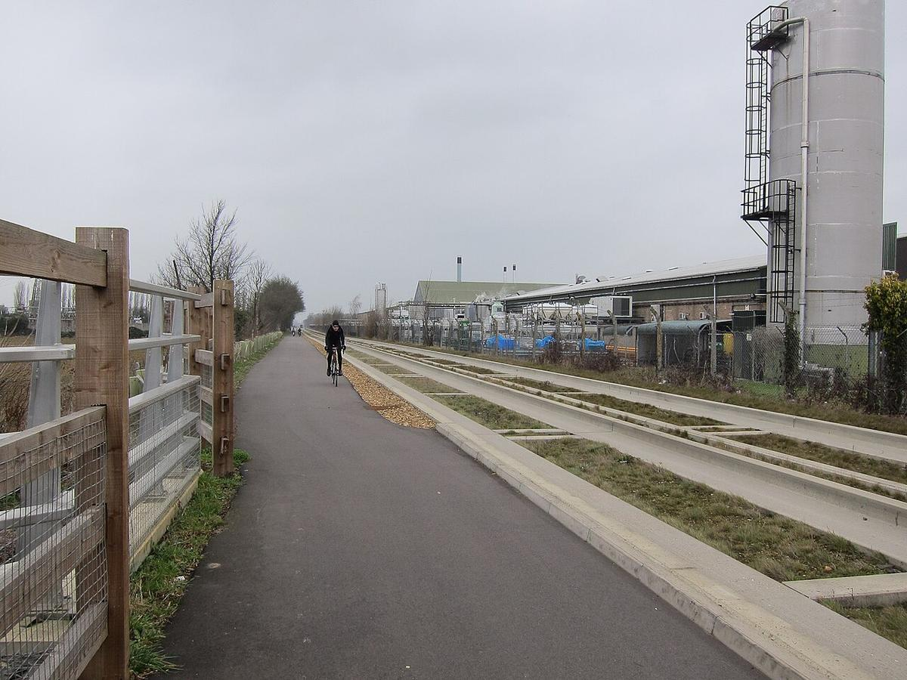
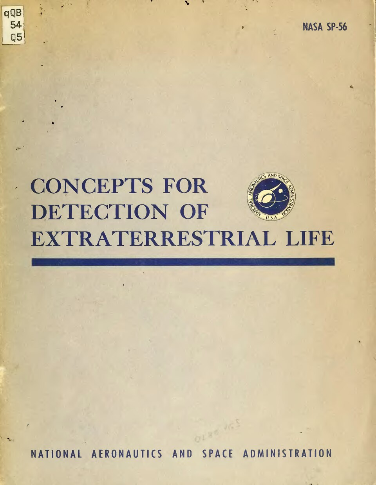
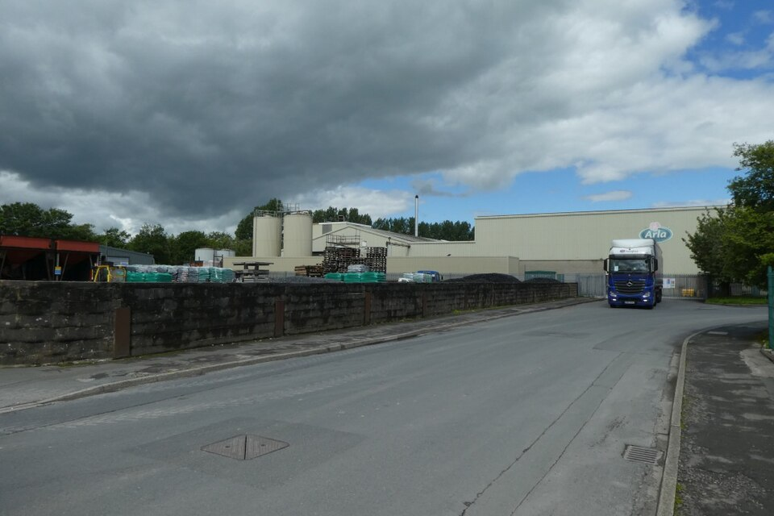
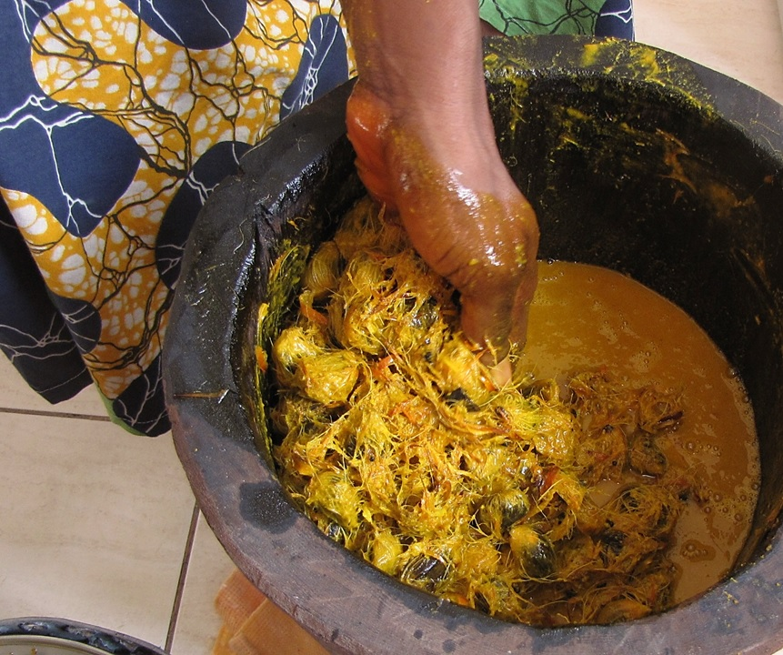
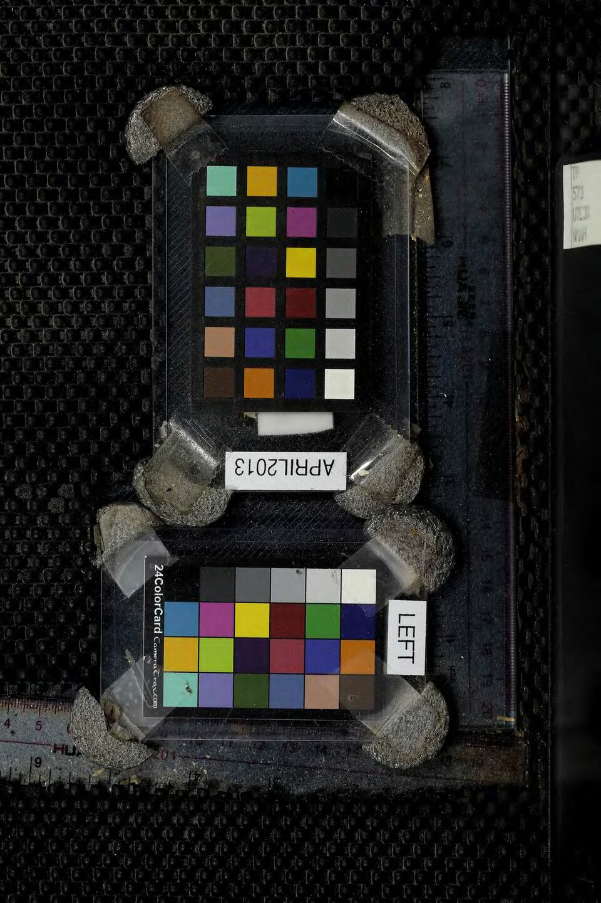
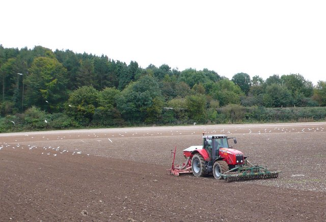
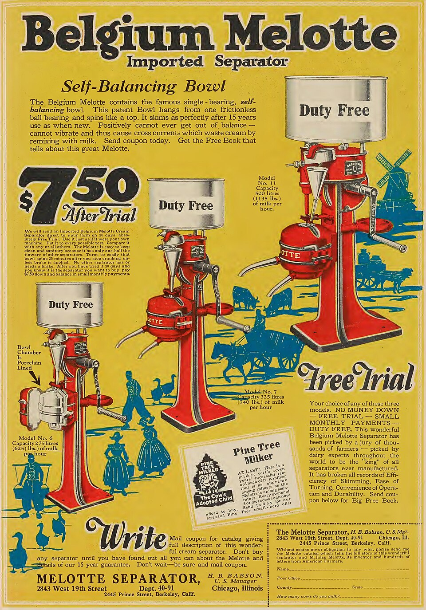

# Food Processing

> *Food processing plant*

> *Image: Hugh Venables, CC BY-SA 2.0*

Capabilities in this domain:

<!-- TODO: source image for Grain Milling -->
- [Grain Milling](milling.md) — Stone querns through water/wind-powered millstones to industrial roller milling. Flour is the foundation of workforce nutrition.
<!-- TODO: source image for Food Fermentation -->
- [Food Fermentation](fermentation.md) — Controlled cultivation of microorganisms to transform raw foods into more stable, nutritious, and digestible products: sauerkraut, soy sauce, tempeh, sourdough, and vinegar.
<!-- TODO: source image for Food Preservation -->
- [Food Preservation](preservation.md) — Drying, salting, smoking, fermentation, canning, pasteurization, and refrigeration. Eliminates seasonal starvation and enables urban workforce concentration.

> *Image: Mydans, Carl, Public domain*

- [Canning & Thermal Sterilization](canning.md) — Preserves food by heating in hermetically sealed containers for multi-year shelf-stable storage without refrigeration, enabling long-distance food logistics.

> *Image: DS Pugh, CC BY-SA 2.0*

- [Dairy Processing](dairy.md) — Milk separation, butter churning, cheese making, and fermented dairy. Converts hours-perishable milk into months-stable protein.

> *Image: T.K. Naliaka, CC BY-SA 4.0*

- [Oil & Fat Processing](oil-processing.md) — Extracts edible and industrial lipids from plant seeds, fruit pulp, and animal tissues for cooking, soap-making, and industrial applications.

> *Image: George Ehret, Public domain*

- [Brewing & Distilling](brewing.md) — Beer, wine, and spirit production. The earliest industrial biotechnology, simultaneously food preservation and calorie concentration.

> *Image: The U.S. Food and Drug Administration, Public domain*

- [Seed Press](seed-press.md) — Screw presses and expellers for extracting oil from seeds, nuts, and other oil-bearing materials.

> *Image: Unknown authorUnknown author, Public domain*

- [Cream Separator](cream-separator.md) — Centrifugal cream separators for dividing whole milk into cream and skim milk.
[↑ Back to Tech Tree](../index.md)
