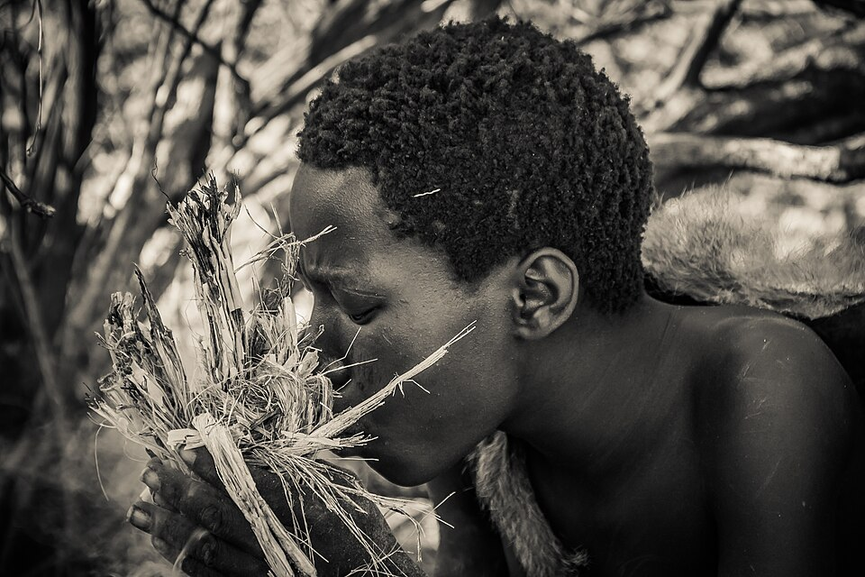
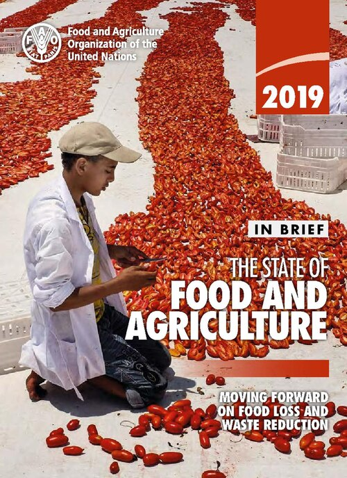
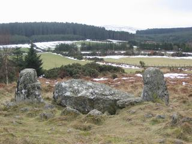

# Foundations

> *Image: Walter Hough, Public domain*

Capabilities in this domain:

> *Image: Walter Hough, Public domain*

- [Fire-Making](fire.md) — Fire-making techniques: friction fire, flint-and-steel ignition, fire maintenance, and heat management.

> *Image: Missouri News Horizon, CC BY 2.0*

- [Agriculture & Food Production](food-agriculture.md) — Grain cultivation, food preservation, irrigation, crop rotation, and dairy processing.

> *Image: Gary Todd, CC0*

- [Stone & Wood Tools](tools-basic.md) — Flint knapping, ground stone tools, wooden implements, basket weaving, basic pottery, and simple machines.
<!-- TODO: source image for Water Procurement -->
- [Water Procurement](water-procurement.md) — Water finding, rainwater harvesting, spring development, and water storage.

[↑ Back to Tech Tree](../../index.md)
