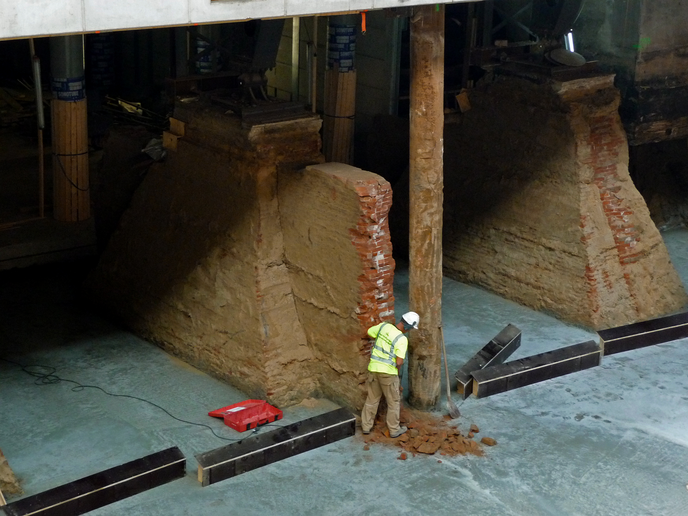
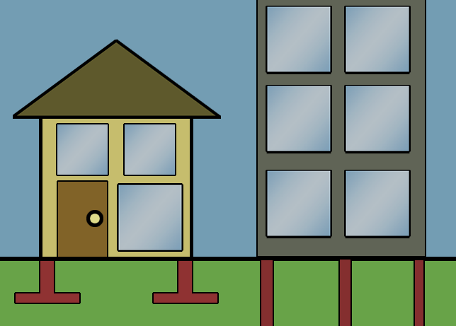

# Foundations

> *Old and new foundation constructions under Central Station Amsterdam*

> *Image: Fons Heijnsbroek, CC0*

Capabilities in this domain:

- [Fire-Making](fire.md) — Fire-making techniques: friction fire, flint-and-steel ignition, fire maintenance, and heat management.
- [Agriculture & Food Production](food-agriculture.md) — Grain cultivation, food preservation, irrigation, crop rotation, and dairy processing.
- [Stone & Wood Tools](tools-basic.md) — Flint knapping, ground stone tools, wooden implements, basket weaving, basic pottery, and simple machines.
- [Water Procurement](water-procurement.md) — Water finding, rainwater harvesting, spring development, and water storage.

[↑ Back to Tech Tree](../index.md)

