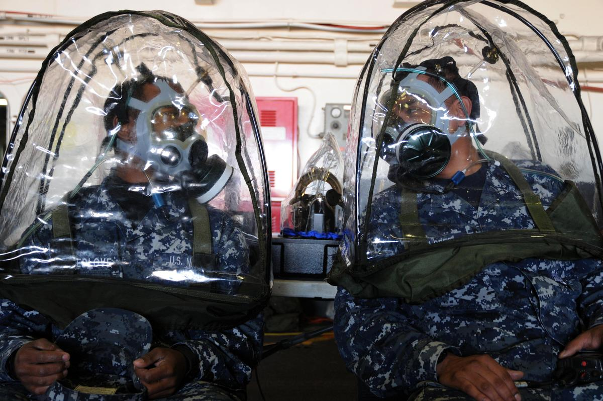
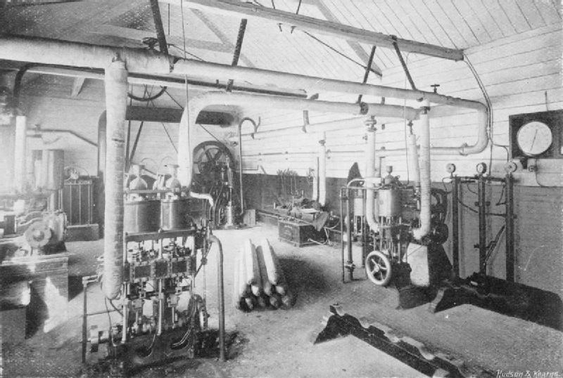
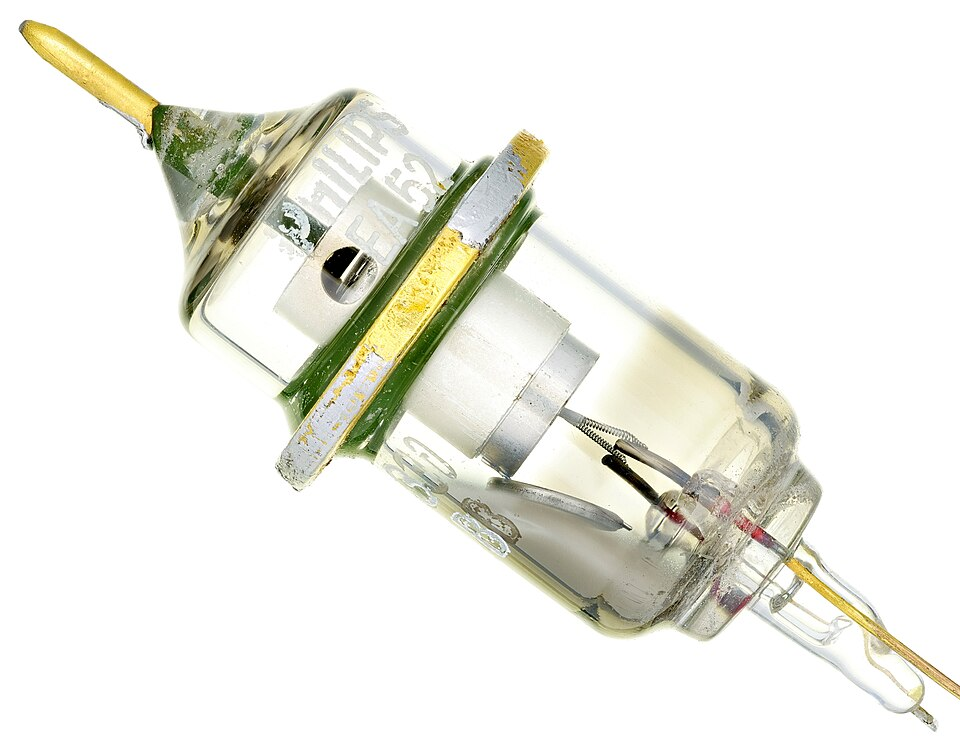
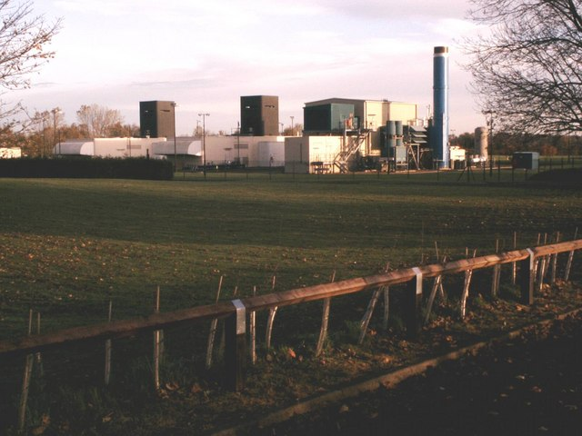
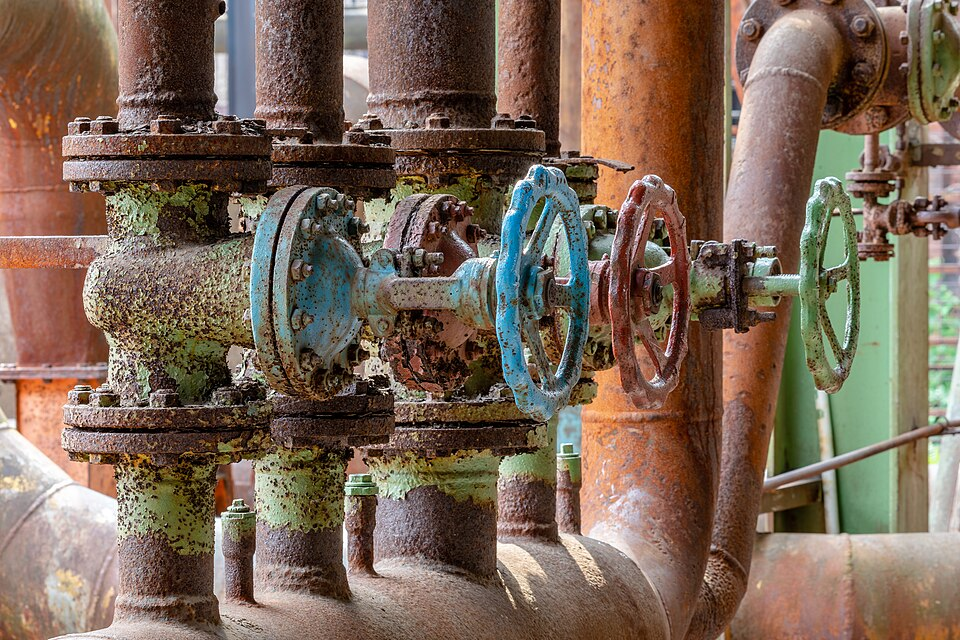

# Gas Handling

> *Image: ecom, CC BY-SA 3.0*

> *US Navy Aviation Boatswain's Mate handling operations aboard USS Ronald Reagan*

> *Image: U.S. Navy, Public domain*

Capabilities in this domain:

> *Image: The U.S. Army, CC BY 3.0*

- [Basic Gas Handling](basic.md) — Gas compression, storage, and purification infrastructure including piping, valves, and pumps for corrosive service.
<!-- TODO: source image for Gas Purification -->
- [Gas Purification](gas-purification.md) — Removes contaminants from process gas streams to meet purity requirements from industrial to semiconductor-grade (5N-6N purity).
<!-- TODO: source image for Gas Distribution Piping Systems -->
- [Gas Distribution Piping Systems](piping-systems.md) — System-level design, installation, and commissioning of complete gas distribution networks from central supply to point-of-use.

> *Image: Unknown authorUnknown author, Public domain*

- [Cylinder Filling](cylinder-filling.md) — Compressing purified gases into high-pressure steel or composite vessels for storage, transport, and point-of-use delivery.

> *Image: Shixart1985, CC BY 2.0*

- [Vacuum Technology](vacuum.md) — Foundational vacuum technology: piston pumps, rotary vane pumps, diffusion pumps, basic vacuum chambers, and vacuum measurement. For advanced vacuum engineering (UHV pumps, chamber design, RGA, leak detection), see the [Vacuum Technology](../vacuum/index.md) domain.

> *Image: Steve F, CC BY-SA 2.0*

- [Compressor](compressor.md) — Reciprocating, rotary screw, and centrifugal compressors for gas compression, storage, and process applications.

> *Image: Dietmar Rabich, CC BY-SA 4.0*

- [Industrial Process Valves](process-valves.md) — Gate, globe, ball, butterfly, check, and control valves for chemical, steam, gas, and high-temperature/high-pressure service.

[↑ Back to Tech Tree](../index.md)

> *Image: U.S. Navy photo by Mass Communication Specialist Seaman Benjamin Jernigan, Public domain*
