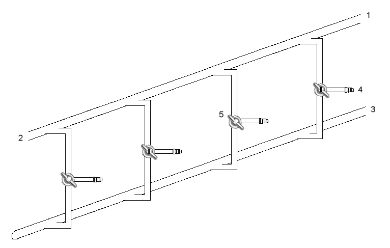

# Gas Handling

> *vacuum gas manifold 3 way tap  1:  Inert gas in 2:  Inert gas out 3:  Vacuum 4:  Reaction line 5:  Double oblique stopcock (i.e. a glass tap with 2 separate parallel 'channels/lines' that run diagonal to the axis of the tap.)*

> *Image: Quantockgoblin, Public domain*

Capabilities in this domain:

- [Basic Gas Handling](basic.md) — Gas compression, storage, and purification infrastructure including piping, valves, and pumps for corrosive service.
- [Gas Purification](gas-purification.md) — Removes contaminants from process gas streams to meet purity requirements from industrial to semiconductor-grade (5N-6N purity).
- [Gas Distribution Piping Systems](piping-systems.md) — System-level design, installation, and commissioning of complete gas distribution networks from central supply to point-of-use.
- [Cylinder Filling](cylinder-filling.md) — Compressing purified gases into high-pressure steel or composite vessels for storage, transport, and point-of-use delivery.
- [Vacuum Technology](vacuum.md) — Foundational vacuum technology: piston pumps, rotary vane pumps, diffusion pumps, basic vacuum chambers, and vacuum measurement. For advanced vacuum engineering (UHV pumps, chamber design, RGA, leak detection), see the [Vacuum Technology](../vacuum/index.md) domain.

- [Compressor](compressor.md) — Reciprocating, rotary screw, and centrifugal compressors for gas compression, storage, and process applications.
- [Industrial Process Valves](process-valves.md) — Gate, globe, ball, butterfly, check, and control valves for chemical, steam, gas, and high-temperature/high-pressure service.

[↑ Back to Tech Tree](../index.md)

