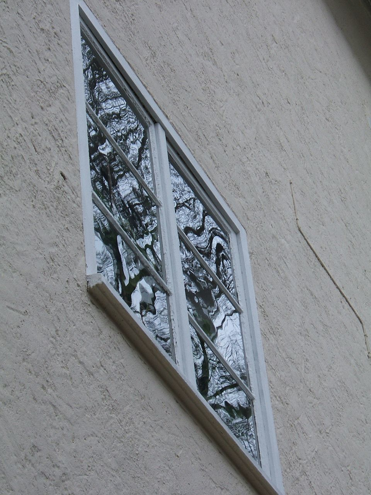

# Float Glass Process

> **Node ID**: glass.basic.float-glass
> **Domain**: [Glass](./index.md)
> **Dependencies**: See prerequisites
> **Enables**: [`Non-Ferrous Metal Production`](../metals/non-ferrous.md), [`Basic Gas Handling`](basic.md), [`Electric Furnaces`](../energy/electric-furnaces.md)
> **Timeline**: Years 30-50
> **Outputs**: float_glass, flat_glass_ribbon
> **Critical**: No

## Overview

> *Old window made from soda-lime flat glass. Interesting are the distorted reflections of a tree that give an indication that the flat glass was possibly not made by the float glass process.*

> *Image: Alexander Fluegel, Public domain*

The Pilkington float glass process produces perfectly flat, parallel-surface glass ribbon without grinding or polishing. Molten glass is poured onto a bath of molten tin at roughly 1000 degrees C inside a sealed chamber filled with a nitrogen-hydrogen atmosphere. The glass floats on the tin because its density (about 2.3 g/cm3) is lower than that of liquid tin (about 6.5 g/cm3). Surface tension and gravity together flatten the glass into a ribbon with naturally smooth surfaces on both sides. The ribbon is drawn off the tin bath, enters a long annealing lehr where it cools slowly enough to relieve internal stresses, and emerges as continuous flat glass ready for cutting.

Before the float process, flat glass was made by drawing a sheet vertically from a tank of molten glass, or by grinding and polishing plate glass cast on a metal table. Both methods produced surface distortions. The float process, developed by Alastair Pilkington in the 1950s, eliminated grinding entirely. Pilkington spent seven years developing the process from laboratory concept to industrial scale, with the first commercial float line starting production in 1959. It now accounts for over 90 percent of worldwide flat glass production for windows, mirrors, and architectural glazing. A single modern float line can produce 500 to 1000 tons of glass per day in ribbon widths up to 4 meters.

The physics that makes floating work deserves attention. Two forces govern the glass on the tin bath: gravity pulls it flat, while surface tension resists further thinning. These reach equilibrium at a ribbon thickness of about 6 to 7 mm when the glass is allowed to spread freely. Thinner glass (down to 2 mm) requires top rollers that stretch the ribbon. Thicker glass (up to 25 mm) is made by constraining the spread with fender bars along the bath edges. The ability to produce a range of thicknesses without changing the glass composition is one of the process's key advantages.

The glass-tin interface is remarkably smooth because both materials are liquid and have no crystal structure to imprint on each other. The bottom surface of float glass is smoother than the top surface produced by any other flat glass method. This smoothness is visible when examining a piece of float glass under grazing illumination: the tin-side surface shows a slight iridescence under ultraviolet light due to tin diffusion into the glass surface, a property used in quality control to distinguish the tin side from the air side during subsequent processing.

Primary outputs: `float_glass`, `flat_glass_ribbon`.

## Glass Composition

The batch ingredients (silica sand, soda ash, limestone, dolomite) are not the same as the final glass oxide composition. Carbonates in the batch release CO2 during melting, so the oxide percentages in the finished glass differ from the raw batch percentages.

**Standard soda-lime float glass composition (final oxide weight %)**:

| Oxide | Weight % | Function |
|-------|----------|----------|
| SiO2 | 72-74% | Glass network former. The structural backbone. Without flux, pure silica melts at 1713 degrees C |
| Na2O | 13-15% | Primary flux. Lowers melting temperature from 1713 to roughly 1000 degrees C by breaking Si-O-Si bonds in the network. Makes the glass workable at reasonable temperatures |
| CaO | 8-10% | Stabilizer. Prevents the glass from dissolving in water (pure Na2O-SiO2 glass is water-soluble). Also improves hardness and chemical durability |
| MgO | 3-4% | Secondary stabilizer. Reduces devitrification tendency and improves workability during forming. Replaces part of the CaO to lower the liquidus temperature |
| Al2O3 | 1-2% | Improves chemical durability and resistance to weathering. Also raises the annealing point by about 10 degrees C per 1% addition |
| K2O | 0-0.5% | Trace flux. Usually present as an impurity from feldspar in the sand. Minor effect on properties |
| Fe2O3 | 0.05-0.15% | Impurity from the sand. Gives the characteristic green edge color visible in thick sections. Low-iron sands (less than 0.01% Fe2O3) produce extra-clear glass for solar panels and premium architectural applications |

**Viscosity reference temperatures for soda-lime glass**:

| Reference Point | Temperature (degrees C) | Viscosity (poise) | Significance |
|----------------|------------------------|-------------------|--------------|
| Strain point | 510 | 10^14.5 | Below this temperature, viscous flow is negligible. Residual stress is frozen in |
| Annealing point | 550 | 10^13 | Stress relaxes in about 15 minutes. This is the target for the annealing lehr hot zone |
| Softening point | 730 | 10^7.6 | Glass deforms under its own weight. The upper limit for handling without support |
| Working point | 1000 | 10^4 | Glass is fluid enough for forming (blowing, pressing, floating). The target viscosity at the tin bath entrance |
| Melting temperature | 1500-1600 | 10^1.5 to 10^2 | Batch reactions complete, bubbles rise and escape. The furnace operating range |

**Batch-to-oxide conversion example**:

For a typical float glass producing 74% SiO2, 14% Na2O, 10% CaO, and 2% MgO in the final product, the raw batch mix would be approximately:

| Raw Material | Batch Weight % | Oxide Delivered | CO2 Lost |
|-------------|---------------|-----------------|----------|
| Silica sand (SiO2) | 59% | 59% SiO2 | None |
| Soda ash (Na2CO3) | 24% | 14% Na2O | 10% CO2 |
| Limestone (CaCO3) | 10% | 5.6% CaO | 4.4% CO2 |
| Dolomite (CaMg(CO3)2) | 8% | 2.3% CaO + 2% MgO | 3.7% CO2 |
| Feldspar (KAlSi3O8) | 2% | 1.3% SiO2 + 0.4% Al2O3 + 0.3% K2O | None |
| Cullet (recycled glass) | 25% of total | Same as finished glass | None |

The CO2 losses (about 15-18% of raw batch weight) escape as gas during melting and contribute to the bubbling that must be removed in the refining zone.

## Prerequisites

### Materials

- **Silica sand** (SiO2): The glass former, making up 70 to 74 percent of the batch by weight. Must be high purity. Iron oxide impurities impart a green tint, which is why most float glass has a slight greenish edge
- **Soda ash** (Na2CO3): The primary flux, lowering the melting temperature of silica from about 1700 to roughly 1000 degrees C. Comprises 13 to 15 percent of the batch
- **Limestone** (CaCO3): A stabilizer that makes the glass chemically durable. Without it, soda-lime glass dissolves slowly in water. Comprises 10 to 12 percent of the batch
- **Dolomite** (CaMg(CO3)2): Provides both calcium and magnesium. Magnesium improves the workability of the glass and reduces devitrification tendency
- **Cullet** (recycled glass): Added at 20 to 30 percent of the batch to reduce melting energy and accelerate homogenization
- **Tin**: The float bath medium. A single float line holds 100 to 200 tons of molten tin. Tin is chosen because it has a low vapor pressure at bath temperature, does not oxidize in a reducing atmosphere, and is denser than glass. Tin must be at least 99.9 percent pure. Lead and antimony impurities above trace levels cause optical defects in the glass bottom surface

### Equipment

- **Batch house**: Storage silos for raw materials, automated weighing and mixing systems, and conveyors to transport the mixed batch to the furnace. The batch house operates continuously, weighing and blending materials in the exact proportions specified by the glass formulation. Accuracy is critical: a 1 percent error in the soda ash ratio changes the glass viscosity enough to affect the ribbon thickness
- **Melting furnace**: A large regenerative or recuperative furnace fired by natural gas. The tank holds several hundred tons of molten glass at 1500 to 1600 degrees C. Refractory-lined, with electrodes for optional electric boosting. Regenerative furnaces use checker brick stacks to recover heat from exhaust gases, preheating the combustion air and reducing fuel consumption by 30 to 40 percent compared to a non-regenerative design
- **Tin bath (float bath)**: A sealed, refractory-lined chamber 50 to 70 meters long and 4 to 6 meters wide, filled with molten tin to a depth of about 100 mm. Top rollers and edge rollers control ribbon width and thickness. The bath is divided into zones with independent temperature control. The entry zone is the hottest, the exit zone the coolest. This temperature gradient is what solidifies the glass enough to be lifted off the tin
- **Annealing lehr**: A 70 to 100 meter long tunnel furnace with controlled temperature zones that cool the ribbon from 600 degrees C to ambient over 30 to 60 minutes. The controlled cooling rate prevents residual thermal stress. The lehr has multiple independently controlled heating zones that create a precise, gradual temperature profile from hot end to cold end
- **Cutting and snapping table**: Diamond-tipped scoring wheels scribe the ribbon, which is then snapped along the score lines by applying bending stress. The cutting system operates on the moving ribbon, so scoring must be synchronized with the ribbon speed. Automated cutting systems can produce standard sizes at a rate of several hundred sheets per hour. Edge trim is fed directly back into the cullet system

### Knowledge

- Glass batch chemistry: how the ratio of silica, soda, and lime controls melting temperature, viscosity, and chemical durability. Small changes in batch composition produce measurable changes in glass properties. For example, increasing the alumina content by 1 percent raises the annealing point by about 10 degrees C and improves chemical durability
- Viscosity-temperature relationship for soda-lime glass: working point (1000 degrees C), softening point (730 degrees C), annealing point (550 degrees C), strain point (510 degrees C). These reference temperatures define the processing windows for forming, annealing, and subsequent tempering or bending operations
- Tin bath atmosphere control: why a reducing atmosphere (nitrogen with 2 to 5 percent hydrogen) is needed to prevent tin oxide formation on the bath surface. Even trace oxygen causes tin to oxidize, forming a hazy deposit on the glass bottom surface
- Ribbon mechanics: how top roller speed and angle control the final glass thickness

### Infrastructure

- A natural gas supply capable of sustaining a continuous furnace at 5 to 15 MW thermal input. A float furnace cannot be easily shut down and restarted, so the gas supply must be reliable with backup fuel storage
- A nitrogen and hydrogen generation plant (pressure swing adsorption or cracked ammonia) to supply the tin bath atmosphere at 1000 to 2000 cubic meters per hour. The atmosphere composition must be continuously monitored for oxygen content (target below 5 ppm)
- Cullet return logistics: a stream of recycled glass feeding back into the batch. Post-consumer cullet requires sorting to remove ceramics, metals, and non-soda-lime glass (borosilicate, lead glass) that would contaminate the melt
- Water cooling for the furnace superstructure and tin bath casing. The cooling system must operate continuously and have backup pumps

## Process Description

### Step-by-Step Procedure

The float glass process is a single continuous operation that never stops during the life of the furnace campaign (typically 10 to 15 years). Raw materials enter one end and finished glass sheets emerge from the other, 24 hours a day, 365 days a year. Every step must operate in balance with the others, because there is no buffer storage between the furnace, the tin bath, and the lehr.

1. **Batch mixing**: Raw materials are weighed, blended in a mixer, and supplemented with cullet. The batch is fed into the doghouse (the charging end of the melting furnace) by a mechanical pusher or screw conveyor
2. **Melting and refining**: The batch melts at 1500 to 1600 degrees C in the furnace crown. Gases from carbonate decomposition (CO2 from soda ash and limestone) rise through the melt as bubbles. The refining zone at higher temperature allows bubbles to rise and escape. Glass leaving the refining zone must be homogeneous and bubble-free. Refining agents such as sodium sulfate or antimony oxide are added to the batch to generate fining bubbles that help sweep smaller bubbles to the surface. The refining process takes several hours as the melt traverses the length of the furnace tank
3. **Conditioning**: The melt passes through a throat into a cooler conditioning section (1100 to 1200 degrees C) where the viscosity increases to the correct range for forming. The target viscosity at the tin bath entrance is about 1000 poise. Stirring in the conditioning section homogenizes the temperature and composition. Any temperature gradients at this stage would produce thickness variation in the final ribbon
4. **Float bath entry**: The conditioned glass flows over a refractory lip onto the tin bath surface. It spreads laterally and is met by top rollers that grip the ribbon edges and control its advance speed. The nitrogen-hydrogen atmosphere (typically 90 to 95 percent N2, 5 to 10 percent H2) prevents tin oxidation
5. **Ribbon formation on the tin bath**: The glass ribbon traverses the 50 to 70 meter bath at 0.5 to 25 meters per minute (speed determines thickness). The first section is the spreading zone where the glass reaches equilibrium thickness. The middle and exit sections are the stretching or constraining zones where top rollers set the final dimensions. The glass surface in contact with tin develops an extremely smooth finish. The top surface, in contact with the atmosphere, is equally smooth due to surface tension. The tin bath is the heart of the process and the most technically demanding component to operate. Small variations in bath temperature, atmosphere composition, or top roller alignment can produce optical defects visible in the final product
6. **Lift-off**: At the bath exit, the glass ribbon has cooled to about 600 degrees C. It is lifted off the tin by a set of rollers and enters the annealing lehr. The transition must be smooth to avoid marking the glass. The lift-off rollers must be perfectly aligned and clean, because any imperfection on the roller surface will imprint on the hot glass
7. **Annealing**: The ribbon passes through the lehr, cooling from 600 to about 50 degrees C over 30 to 60 minutes. The cooling rate through the annealing range (550 to 510 degrees C) is tightly controlled, typically 2 to 5 degrees C per minute, to eliminate residual thermal stress. Glass cooled too quickly retains stress and shatters unpredictably when cut. The lehr has 20 to 40 independently controlled temperature zones, each set to maintain a precise point on the cooling curve. Any deviation from the target profile creates stress that shows up as breakage during cutting or subsequent processing
8. **Cutting**: Diamond scoring wheels scribe the ribbon at the desired dimensions. Automated snapping arms bend the ribbon along the score line. Edges are trimmed. Standard cut sizes range from 1 to 6 square meters. Off-cuts and edge trim are fed directly back into the cullet system and recycled into the furnace batch, closing the material loop

The entire line, from batch house to cutting table, runs 24 hours a day, 365 days a year. A float line is not designed to stop. The furnace contains hundreds of tons of molten glass that would solidify in the refractory tank if allowed to cool, destroying the furnace. The tin bath would also freeze, potentially damaging the bath lining. Planned shutdowns (called "cold repairs") occur every 10 to 15 years and involve completely rebuilding the furnace and draining and replacing the tin. A cold repair costs tens of millions of dollars and takes 3 to 6 months.

### Process Parameters

| Parameter | Range | Notes |
|-----------|-------|-------|
| Furnace melting temperature | 1500 to 1600 degrees C | Natural gas or gas + electric boost |
| Tin bath temperature (entry) | 1000 to 1050 degrees C | Glass viscosity about 1000 poise |
| Tin bath temperature (exit) | 580 to 620 degrees C | Glass stiff enough to lift off |
| Ribbon speed | 0.5 to 25 m/min | Slower speed = thicker glass |
| Ribbon thickness | 2 to 25 mm | Free float equilibrium ~6.5 mm |
| Tin bath atmosphere | 90 to 95% N2, 5 to 10% H2 | Reducing, prevents SnO formation |
| Annealing lehr cooling rate | 2 to 5 degrees C/min | Through the annealing range (550 to 510 degrees C) |
| Cullet ratio | 20 to 30% of batch | Reduces melting energy by 2 to 3% per 10% cullet |

Cullet plays an important role beyond energy savings. It also acts as a seed for melting, accelerating the dissolution of the raw batch materials. High-cullet batches melt faster and homogenize more quickly. However, cullet quality must be controlled: ceramic contaminants (pottery, bricks) do not melt at glass temperatures and appear as stones in the final product. Non-soda-lime glass (borosilicate, lead crystal) has a different viscosity and will cause defects if mixed in.

### Annealing Schedule Detail

The annealing lehr is 70 to 100 meters long and divided into 20 to 40 independently controlled heating zones. The cooling profile through the annealing range (550 to 510 degrees C) is the most critical section. Glass that cools too quickly through this range retains permanent thermal stress because the surface solidifies while the interior is still contracting. The result is glass that shatters unpredictably during cutting or later processing.

**Typical annealing lehr temperature profile (4 mm soda-lime float glass)**:

| Zone | Temperature Range | Cooling Rate | Purpose |
|------|------------------|--------------|---------|
| Entry | 600 to 550 degrees C | 5-8 degrees C/min | Initial equalization. Glass enters from the tin bath at about 600 degrees C |
| Annealing (critical) | 550 to 510 degrees C | 2-3 degrees C/min | Slowest rate. Stress relaxation zone. Glass viscosity transitions from fluid to rigid. A 1 degree C/min deviation here creates measurable stress |
| Strain point transition | 510 to 480 degrees C | 3-5 degrees C/min | Below the strain point, viscous flow stops. Faster cooling is now safe because stress can no longer relax |
| Accelerated cooling | 480 to 200 degrees C | 8-12 degrees C/min | Glass is solid and can tolerate faster cooling. Heating elements taper off |
| Final cooling | 200 to 50 degrees C | 5-8 degrees C/min | Ambient air cooling in the final open section. Fans assist if needed |
| Exit | Below 50 degrees C | Natural | Glass is safe to handle and cut |

Total lehr transit time: 30 to 60 minutes depending on glass thickness. Thicker glass (12-25 mm) requires slower cooling through the annealing range (1-2 degrees C/min) and proportionally longer lehr time.

Residual stress is checked with a polariscope. Unacceptable stress shows up as bright colored bands under polarized light. A well-annealed sheet shows uniform dark gray with no bright fringes. The stress measurement is expressed as the retardation in nanometers per centimeter of path length. For architectural float glass, the maximum acceptable retardation is 30 nm/cm. For optical-grade glass (mirror substrates, photomask blanks), the limit is 10 nm/cm or lower.

## Safety Considerations

Working near a float glass line is one of the more hazardous environments in manufacturing. The furnace runs at 1500+ degrees C, the tin bath holds 100 to 200 tons of molten metal, and the ribbon moves continuously at speeds up to 25 meters per minute. The hazards are manageable with proper engineering controls, training, and PPE, but the margin for error is thin. The most dangerous period is during cold repair, when workers enter the furnace to replace refractory brick in a confined space that was recently at 1500 degrees C.

- **Molten glass burns**: Glass at 1500 degrees C causes severe, deep thermal burns. The furnace area requires heat-resistant barriers. Workers near the furnace or tin bath wear aluminized heat suits and face shields
- **Tin vapor toxicity**: At bath operating temperatures, tin can volatilize. Tin oxide fumes are a respiratory irritant. The reducing atmosphere and sealed bath enclosure limit exposure, but maintenance access requires respirators and ventilation
- **Furnace heat stress**: The melting furnace radiates intense heat across the entire working area. Heat stroke is a risk during extended shifts near the furnace. Mandatory rest breaks, hydration stations, and cooling vests for furnace crew
- **Glass cut lacerations**: The edges of freshly cut glass ribbon are razor sharp. Cut-resistant gloves (Level A4 or higher) are mandatory on the cutting line. Automated handling reduces direct contact
- **Chemical burns from batch materials**: Soda ash and other batch components are alkaline and can cause chemical burns with prolonged skin contact. Dust from the batch house is an irritant. Batch house workers should wear dust masks and safety glasses during material handling and cleaning operations

### Personal Protective Equipment

- Aluminized heat suit or fire-resistant coveralls near the furnace and tin bath
- Face shield and safety glasses with side shields in the furnace hall
- Cut-resistant gloves on the cutting and handling line
- Respirators (P100 or supplied air) during tin bath maintenance or batch house operations
- Steel-toe, heat-resistant boots throughout the plant

### Emergency Procedures

- Glass leak from furnace: evacuate the area, shut off fuel, allow the glass to solidify in place before attempting repair. Never use water on molten glass (steam explosion). The solidified glass can be chipped away from the damaged area and the refractory repaired during a planned cold repair
- Tin bath atmosphere loss: the reducing atmosphere is critical. If nitrogen or hydrogen supply fails, seal the bath and shut down. Tin oxide contamination ruins the glass surface and is extremely difficult to remove from the bath once formed. Preventing tin oxidation is far easier than cleaning it up
- Cullet or glass jam on the line: stop the ribbon drive immediately. Clear jams with long-handled tools, never by hand. A moving glass ribbon carries enough momentum to sever a hand or arm if contact is made
- Hydrogen fire (tin bath): hydrogen is supplied at low concentration (5 to 10 percent) in nitrogen, which is below the flammability limit. If a leak in the hydrogen supply line creates a higher concentration near an ignition source, shut off hydrogen, seal the bath, and purge with nitrogen. Hydrogen flames are nearly invisible in daylight. Use a thermal imaging camera to locate the fire
- Furnace refractory failure: if the furnace sidewall develops a hot spot (visible as a glowing area on the exterior), cool the area with an emergency water spray shield and begin a controlled drainage of the glass into an emergency pit. Do not attempt to continue production with a compromised furnace wall

## Quality Control

### Acceptance Criteria

- **Float glass**: Optical distortion within Zebra board test limits. Thickness tolerance of plus or minus 0.2 mm for standard 4 mm glass. No visible inclusions (stones, bubbles) larger than 0.5 mm in the central zone
- **Flat glass ribbon**: Flatness deviation less than 0.5 mm per 300 mm of length. Edge quality free of chips and shelling

The quality requirements for float glass vary by end use. Architectural glazing for commercial buildings demands the tightest optical quality, since distortion is immediately visible in large window walls. Automotive glass has strict requirements for freedom from inclusions that could interfere with driver vision. Mirror-grade glass must be nearly perfect, since any surface irregularity is magnified by the reflective coating. Solar panel cover glass requires high light transmission and freedom from defects that would create shadows on the photovoltaic cells beneath.

### Testing Methods

- **Zebra board test**: An observer views a striped board through the glass. Distortion of the stripes reveals waviness and optical defects. This is the primary in-line quality check, performed continuously on the moving ribbon

The Zebra board test exploits the human eye's sensitivity to straight-line distortion. A board painted with alternating black and white stripes (typically 25 mm wide) is placed on one side of the glass ribbon. An inspector on the other side observes the stripes through the moving glass. Any waviness, roller distortion, or thickness variation causes the stripes to appear wavy or broken. This simple test catches defects that thickness gauges alone would miss.

- **Thickness measurement**: Laser or X-ray gauges scan the ribbon continuously. Thickness is recorded and plotted against the target profile. Any deviation beyond the tolerance band triggers an alarm
- **Bubble and stone detection**: Automated optical inspection systems scan the ribbon for inclusions. Stones (unmelted batch particles) and bubbles above the size limit trigger rejection of that section. The system uses high-resolution cameras and image processing to distinguish defects from harmless surface marks
- **Edge quality inspection**: Visual and automated checks for chips, shells, and cracks at cut edges. Defective edges are re-cut or the sheet is downgraded
- **Annealing check (photoelastic stress)**: A polariscope reveals residual stress patterns in the glass. Uneven stress causes breakage during subsequent processing (tempering, bending, cutting)

### Sampling Protocol

- Continuous optical inspection of the entire ribbon surface
- Thickness logged at 1-meter intervals along the ribbon
- Zebra board checks at the start and end of each shift
- Photoelastic stress checks on one sample per shift, taken from the edge trim

The float glass industry has largely automated quality inspection. Modern lines use laser scanning, infrared cameras, and machine vision to detect defects at line speed. Despite automation, human inspectors still perform the Zebra board test because the eye catches distortion that machines miss.

## Scaling Notes

Float glass production is inherently a large-scale, continuous process. The economics favor large lines because the furnace, tin bath, and lehr operate 24 hours a day, 365 days a year. Stopping and restarting costs hundreds of thousands in lost production and furnace wear. The minimum economic scale for a float line is approximately 300 tons per day. Below this threshold, the fixed costs (tin inventory, atmosphere system, staffing) are spread over too few tons to be competitive.

- **Small batch furnace** (10 to 50 tons/day): Can produce flat glass by rolling, but cannot replicate the float process economically. The tin bath alone requires a minimum throughput to maintain stable thermal conditions. A float line smaller than about 300 tons/day is rarely competitive
- **Standard float line** (500 to 700 tons/day): The most common scale. Ribbon width of 3.3 to 4 meters. Produces glass from 2 to 19 mm thick. Furnace power: 8 to 12 MW. Total line length: furnace (40 to 60 m) plus tin bath (50 to 70 m) plus lehr (70 to 100 m). Capital cost runs into hundreds of millions
- **Jumbo float line** (800 to 1000+ tons/day): The largest lines, producing jumbo sheets up to 6 meters wide for architectural applications. The tin bath must be wider, requiring more tin (200+ tons) and more precise atmosphere control

Key scaling challenges: maintaining glass homogeneity in larger furnace tanks (stirring convection patterns change with tank geometry), controlling ribbon thickness uniformity over wider baths, and managing the thermal profile across the full lehr width.

A float line runs continuously for 10 to 15 years between major rebuilds. The furnace refractory gradually erodes from contact with the molten glass, and the tin bath accumulates contaminants over time. The decision to shut down and rebuild is driven by glass quality: when the frequency of defects (stones, bubbles, tin pickup) exceeds the tolerable limit, the line is drained and rebuilt. This means that float glass production is a long-term capital commitment, not something that can be started and stopped to match demand fluctuations. During a cold repair, the entire furnace is dismantled and rebuilt with new refractory brick, the tin bath is drained and cleaned, and the lehr is inspected and repaired. A cold repair typically takes 3 to 6 months and costs tens of millions.

The tin bath itself represents a substantial ongoing cost. Tin oxidizes slowly despite the reducing atmosphere, forming a slag on the surface that must be skimmed off. Tin losses run to several tons per year, which at tin market prices represents a significant operating expense. The nitrogen-hydrogen atmosphere must be continuously supplied and purified, adding to the utility cost. These factors contribute to the high minimum economic scale of the float process. A smaller float line still needs the same atmosphere system, the same tin inventory, and the same continuous staffing, so the per-ton overhead cost is much higher at low throughput.

## Troubleshooting

| Problem | Probable Cause | Solution |
|---------|---------------|----------|
| Optical distortion (waviness) | Uneven tin bath temperature or top roller misalignment | Check bath heating zones. Recalibrate top roller speed and angle. Inspect roller bearings for wear |
| Tin pickup on bottom surface | Excessive tin oxide formation on bath surface from atmosphere leak | Check nitrogen and hydrogen flow rates. Inspect bath seals for air ingress. Reduce oxygen content below 5 ppm |
| Bubbles in the glass | Insufficient refining in the furnace. Carbonate decomposition incomplete | Increase furnace temperature in the refining zone. Add fining agents (sodium sulfate or antimony oxide) to the batch |
| Stones (unmelted particles) | Batch homogenization failure. Raw material particle size too large | Check the batch mixer. Screen raw materials to reject oversize particles. Increase cullet ratio to improve melting rate |
| Devitrification (crystallization on ribbon) | Glass temperature dropping below the liquidus in the tin bath before full forming | Raise the entry-end bath temperature. Increase ribbon speed through the early bath zones |
| Breakage during cutting | Insufficient annealing. Residual thermal stress in the ribbon | Slow the lehr cooling rate through the annealing range. Check lehr zone temperatures for cold spots |
| Scratch marks on glass surface | Debris on lehr rollers or top rollers in poor condition | Clean and inspect lehr rollers. Replace worn top roller sleeves. Check that no cullet or glass chips are being carried through the lehr on the rollers |
| Roller wave distortion (undulations) | Top rollers vibrating or running at inconsistent speed | Check top roller bearings and drive motors. Ensure uniform temperature across the ribbon at the roller contact point. Balance the roller load across the ribbon width |
| Tin bloom (hazy bottom surface after reheating) | Tin that penetrated the glass bottom surface during float process oxidizes during subsequent heat treatment | Control tin penetration by maintaining the reducing atmosphere. Limit the time glass spends at high temperature in downstream processing. Use lower tin bath temperatures where possible |

A recurring challenge in float glass production is maintaining the balance between furnace pull rate (how fast glass is produced) and glass quality. Pushing the furnace beyond its design capacity increases the risk of bubbles and stones because the melt has less residence time for refining and homogenization. Plant managers face a constant tension between production volume and defect rate.

## Variations and Alternatives

- **Rolled glass**: Molten glass is poured between a pair of water-cooled steel rollers, producing a ribbon with a textured surface. Simpler than float, but one surface bears roller marks. Used for patterned glass and wired glass where optical quality is not required. The rolled process requires far less capital than float and can be economical at throughputs of 10 to 50 tons per day, making it the starting point for civilizations that have not yet developed the full float process
- **Sheet glass (Fourcault or Pittsburgh process)**: A slot or debiteuse draws a ribbon of glass vertically from the melt. The surfaces are fire-finished but not as flat as float glass. Largely superseded by the float process, but requires less capital. The Fourcault process was the dominant flat glass method before the float process was commercialized
- **Plate glass (ground and polished)**: Cast glass slabs ground flat on both sides with abrasives and then polished. The pre-float method. Labor-intensive, wasteful of material (20 to 30 percent lost as grinding dust), but produces optically superior surfaces without needing a tin bath
- **Patterned glass**: Rolled glass with one patterned roller, producing a decorative surface. Used for bathroom windows and privacy glazing where light transmission is desired but transparency is not
- **Tinted and coated float glass**: Colorants (iron, cobalt, selenium) added to the batch produce tinted glass. Green tint (from iron) is the most common and cheapest. Blue (cobalt), bronze (selenium), and gray (combination) are also produced. Low-emissivity coatings applied by chemical vapor deposition (CVD) inside the tin bath or by magnetron sputtering after annealing produce energy-efficient glazing that reflects infrared radiation while transmitting visible light
- **Tempered (toughened) glass**: Float glass reheated to near its softening point and then rapidly cooled with air jets. The surface is put into compression and the interior into tension. Tempered glass is 4 to 5 times stronger than annealed glass and, when it breaks, shatters into small granular chunks rather than sharp shards. Required for automotive side windows, shower doors, and glass table tops
- **Laminated glass**: A sandwich of two glass layers with a polyvinyl butyral (PVB) interlayer. When broken, the glass adheres to the PVB and the pane holds together rather than falling apart. Used for automotive windshields, skylights, and security glazing

The float process has also enabled a range of value-added products. Coated glass (low-E, reflective, self-cleaning) accounts for a growing share of float glass production. The coatings are applied either on the tin bath (online CVD) or after annealing (offline sputtering). Online coatings are cheaper but limited in composition. Offline coatings offer unlimited options but require a separate coating line. Insulated glass units (double glazing) combine two or more sheets of float glass with a sealed air gap, dramatically improving thermal performance for building applications. Solar panel cover glass is another high-volume application that requires specific optical and transmission properties.

## References

- [Basic Glass Production](basic.md) — parent capability
- [Glass Domain](./index.md) — domain overview and related capabilities
- [Non-Ferrous Metal Production](../metals/non-ferrous.md) — downstream capability
- [Basic Gas Handling](basic.md) — downstream capability
- [Electric Furnaces](../energy/electric-furnaces.md) — downstream capability

---

*Part of the [Bootciv Tech Tree](../index.md) · [Glass](./index.md) · [All Domains](../index.md)*
