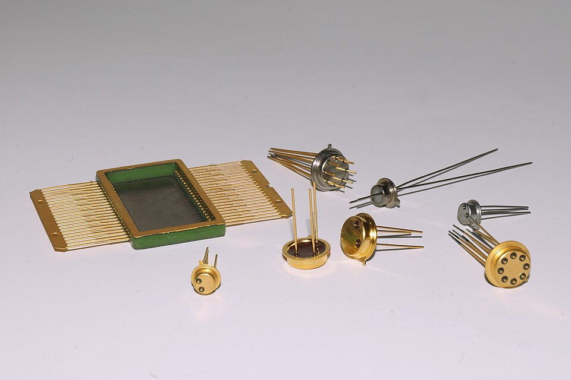

# Glass-to-Metal Seals

> **Node ID**: glass.glass-to-metal-seals
> **Domain**: [Glass](./index.md)
> **Dependencies**: [`glass.advanced`](advanced.md), [`metals.alloys`](../metals/alloys.md), [`vacuum.chambers`](../vacuum/chambers.md)
> **Enables**: [`semiconductor device packaging`](../electronics/semiconductor-devices.md), [`hermetic sensor housings`](../electronics/assembly.md), [`vacuum feedthroughs`](../vacuum/chambers.md)
> **Timeline**: Years 25-40
> **Outputs**: glass_to_metal_seals, hermetic_feedthroughs, matched_seals, compression_seals, fritted_seals
> **Critical**: Yes — hermetic glass-to-metal seals are essential for vacuum tubes (the first active electronic devices), transistor packages, and all feedthrough connectors that pass electrical signals through vacuum or pressurized enclosures.

Glass-to-metal seals join glass to metal with a vacuum-tight bond that survives thermal cycling. The central challenge is the mismatch in coefficients of thermal expansion (CTE) between glass (typically 3–9 × 10⁻⁶/°C) and metal (typically 5–20 × 10⁻⁶/°C). If the CTE difference is too large, cooling from the sealing temperature (800–1100°C) creates stresses that crack the glass or break the bond.

Three fundamental strategies solve this problem: **matched seals** where glass and metal have nearly identical CTEs, **unmatched (compression) seals** where the metal contracts more than the glass and squeezes it in compression, and **fritted seals** using a low-melting glass powder interlayer. Each approach has distinct material requirements, manufacturing processes, and application domains.

Without glass-to-metal seals: no vacuum tubes (the anode, cathode, and grid leads must pass through the glass envelope), no hermetic transistor packages (TO-5, TO-18 metal cans with glass feedthroughs), no high-reliability connectors for aerospace or medical implants, and no electrical feedthroughs for [vacuum chambers](../vacuum/chambers.md).

## Prerequisites

> *Přizpůsobené zátavy kovu a skla*

> *Image: Antonín Ryska, CC BY-SA 4.0*

- **Materials**: [Borosilicate glass](advanced.md) tubing and rod (CTE 3.3 × 10⁻⁶/°C for matched seals), [specialty alloys](../metals/alloys.md) (Kovar — Fe-29Ni-17Co, CTE ~5.0 × 10⁻⁶/°C), soda-lime glass (CTE ~9 × 10⁻⁶/°C for compression seals), mild steel or stainless steel (CTE 11–17 × 10⁻⁶/°C for compression seals), frit glass powder (low-melting lead borosilicate or zinc borate glass), hydrogen and forming gas (5% H₂ / 95% N₂) for oxide control
- **Tools**: Sealing furnace (800–1100°C with controlled atmosphere), glassworking lathe ([advanced glassblowing](advanced-glassblowing.md)), diamond saw for metal pin preparation, furnace with hydrogen or forming gas atmosphere for pre-oxidation, optical pyrometer for temperature control
- **Knowledge**: Thermal expansion matching principles, glass wetting and adhesion on metal oxides, stress analysis in cylindrical and disk seals, annealing schedules for stress relief, metal pre-oxidation protocols for chemical bonding
- **Infrastructure**: Controlled-atmosphere furnace (H₂/ forming gas), [vacuum system](../vacuum/chambers.md) for leak testing (helium mass spectrometer, 10⁻⁹ Pa·m³/s sensitivity), annealing oven with ±5°C uniformity, clean handling area for frit preparation

## Coefficients of Thermal Expansion — Key Material Pairs

Understanding CTE matching is the core engineering challenge. The table below shows the critical material pairs:

| Material | CTE (× 10⁻⁶/°C) | Seal Type | Notes |
|----------|------------------|-----------|-------|
| **Kovar** (Fe-29Ni-17Co) | 5.0–5.5 | Matched | Specifically designed for glass sealing; matches borosilicate |
| **Borosilicate glass** (Pyrex-type) | 3.2–3.4 | Matched | The standard glass for matched seals with Kovar |
| **Tungsten** | 4.4–4.5 | Matched | Used with borosilicate glass in high-temperature applications |
| **Molybdenum** | 4.8–5.2 | Matched | Alternative to tungsten; slightly closer to borosilicate CTE |
| **Mild steel** (low carbon) | 11–12 | Compression | Much higher CTE than soda-lime glass; creates radial compression |
| **Stainless steel 304** | 16–17 | Compression | Highest CTE common seal metal; maximum compression |
| **Soda-lime glass** | 8.5–9.5 | Compression | Lower CTE than steel; outer steel sleeve contracts onto glass |
| **Copper** (OFHC) | 16.5–17 | Compression (disk) | Used in disk/annular seals; ductile enough to absorb stress |
| **Frit glass** (lead borosilicate) | 6–9 | Fritted | Low melting point (400–600°C); interlayer between metal and glass |

## Matched Seals — Kovar to Borosilicate

**Principle**: Kovar alloy (Fe-29Ni-17Co) was developed by Westinghouse in the 1930s specifically to match the CTE of borosilicate glass. Both materials expand at ~5 × 10⁻⁶/°C over the range 25–450°C. The seal is made by heating the metal-glass interface to 900–1050°C in a controlled atmosphere, where the molten glass wets and chemically bonds to a thin oxide layer on the metal surface.

**Process**:

1. **Metal preparation**: Machine Kovar pins or flanges to specification. Degrease in solvent. Pre-oxidize in wet hydrogen or air at 800–900°C to form a thin (~1 μm) adherent oxide layer (Fe₃O₄ with dissolved Ni and Co). The oxide must be uniform — too thin and the glass won't bond, too thick and it flakes off.

2. **Glass preparation**: Cut borosilicate glass tubing or preform to size. Clean in acid (10% HF dip for 10–30 seconds, then DI water rinse) to ensure a pristine surface.

3. **Sealing**: In a hydrogen-forming gas atmosphere furnace, heat the assembly to 950–1050°C. The glass softens, flows, and wets the oxidized metal surface. Chemical bonding occurs as the glass dissolves the metal oxide layer, creating a gradient interface. Hold for 5–15 minutes depending on seal geometry.

4. **Annealing**: Cool at a controlled rate (2–5°C/min through the annealing range 560–510°C for borosilicate) to relieve thermal stress. The matched CTE means stresses are minimal, but proper annealing ensures long-term reliability.

**Applications**: Vacuum tube envelopes (the classic visible example), transistor headers (TO-5, TO-18 packages — each has a Kovar disk with glass-sealed pins), hermetic relays, high-reliability military electronics, sensor housings for pressure transducers and accelerometers.

**Strengths**:
- Highest hermeticity of any seal type (<10⁻⁹ Pa·m³/s helium leak rate) — suitable for long-life vacuum applications
- Operating temperature up to 450°C — highest thermal budget of the three seal types
- CTE match produces minimal residual stress — glass and metal expand and contract together, resisting thermal cycling damage
- Well-characterized: Kovar-to-borosilicate is the most extensively tested glass-to-metal seal system, with 90+ years of production history

**Weaknesses**:
- Requires Kovar alloy (Fe-29Ni-17Co) — a controlled-composition specialty metal that is expensive and not producible until advanced metallurgy is established
- CTE match must be within ±0.5 × 10⁻⁶/°C — tight material specification requires batch-by-batch CTE certification
- Pre-oxidation step is process-critical: oxide layer must be 0.5–2 μm thick, uniform, and of the correct phase (Fe₃O₄ with dissolved Ni/Co). Too thin = poor adhesion; too thick = spalling
- Sealing temperature 950–1050°C requires controlled-atmosphere furnace with hydrogen or forming gas — significant infrastructure investment

**Helium leak rate**: A properly made matched seal achieves <10⁻⁹ Pa·m³/s — essentially perfect hermeticity.

## Unmatched (Compression) Seals — Steel to Soda-Lime Glass

**Principle**: When the metal has a higher CTE than the glass (e.g., steel at 11–17 × 10⁻⁶/°C vs. soda-lime glass at ~9 × 10⁻⁶/°C), the metal contracts more on cooling, squeezing the glass in radial compression. Glass is extremely strong in compression (~1000 MPa) but weak in tension (~50 MPa), so this arrangement puts the glass in its strongest loading mode.

**Process**:

1. **Sleeve design**: A steel outer sleeve is machined with an interference fit over the glass insulator and inner conductor pin. The glass bead or disk sits between the outer shell and the center pin.

2. **Assembly**: Stack the components — steel shell, glass preform (bead or ring), steel or copper pin. The glass preform may be pressed powder or a pre-melted shape.

3. **Firing**: Heat to 900–1000°C in a controlled atmosphere. The glass melts and flows to fill the gap between shell and pin. Surface tension and gravity shape the seal.

4. **Cooling**: As the assembly cools, the steel contracts more than the glass, creating compressive stress on the glass. The glass remains intact because compressive stress closes (rather than opens) microcracks.

**Design rule**: The steel shell wall thickness must be sufficient to maintain compression at all operating temperatures. Typically, the wall-to-glass ratio is 1:3 to 1:5. The operating temperature range is limited by the point where the steel relaxes enough to lose compression (typically 200–350°C maximum).

**Applications**: Automotive spark plug insulators (steel shell → alumina or soda-lime glass → steel electrode), high-current feedthroughs for plasma chambers, military connector inserts, low-cost hermetic packages where weight and size are less critical.

**Strengths**:
- No expensive specialty alloy required — uses common mild steel, stainless steel, or copper, all widely available
- Glass is loaded in compression (~100–300 MPa), and glass withstands ~1000 MPa in compression — the seal is mechanically robust against shock and vibration
- Tolerant of wider CTE variation than matched seals — the compression principle works as long as the metal CTE exceeds the glass CTE
- Lower material cost per seal: steel + soda-lime glass costs 5–10× less than Kovar + borosilicate glass

**Weaknesses**:
- Maximum operating temperature 200–350°C — above this, the steel relaxes and loses compression on the glass
- Bulkier than matched seals — the steel sleeve must have sufficient wall thickness to maintain compressive force, increasing package size
- Hermeticity is one order of magnitude worse than matched seals (<10⁻⁸ Pa·m³/s vs <10⁻⁹ Pa·m³/s) — may be insufficient for long-life vacuum applications
- Radial stress on glass is uniaxial — asymmetric loading can cause cracking if the sleeve is not machined concentrically within ±0.05 mm

## Fritted Seals

**Principle**: A low-melting-point glass powder (frit) is applied as a paste between the metal and glass components. When heated to 400–600°C (well below the softening point of the structural glass), the frit melts, flows, and bonds to both surfaces. This allows sealing glasses and metals with incompatible CTEs because the frit layer is thin and compliant.

**Process**:

1. **Frit preparation**: Grind sealing glass to fine powder (<50 μm). Mix with organic binder (ethyl cellulose in terpineol) and solvent to form a printable paste.

2. **Application**: Screen-print or dispense the frit paste onto the sealing surface. Dry at 100–150°C to remove solvent.

3. **Burnout**: Heat slowly to 300–350°C to decompose the organic binder without bubbling.

4. **Sealing**: Raise temperature to the frit sealing point (typically 430–500°C for lead-based frits, 500–600°C for lead-free zinc borate frits). Hold 10–30 minutes. The frit wets both surfaces and forms a chemical bond.

5. **Cooling**: Cool at 2–5°C/min through the frit's annealing range.

**Strengths**:
- Low sealing temperature (400–600°C) preserves metallization, solder joints, and prior processing on semiconductor devices — the key advantage for packaging already-fabricated ICs
- Can join dissimilar materials with incompatible CTEs — the thin, compliant frit layer absorbs the mismatch
- Compatible with flat-panel display manufacturing (frit-sealed OLED and LCD packages) and high-throughput screen printing processes
- No controlled-atmosphere furnace required for sealing — can be done in N₂ or air, reducing infrastructure cost

**Weaknesses**:
- Lower mechanical strength than matched or compression seals — frit bond strength is typically 10–30 MPa vs 50–100 MPa for matched seals
- Limited temperature cycling range (typically -40°C to +150°C for lead-free frits) — the frit gradually devitrifies and cracks under repeated cycling
- Lead-based frits pose environmental and health hazards; ROHS compliance requires lead-free alternatives (zinc borate), which have narrower processing windows and lower wetting
- Hermeticity is the worst of the three types (<10⁻⁷ Pa·m³/s) — inadequate for ultra-high vacuum applications

**Applications**: Flat panel display sealing, semiconductor package lid attach, solar cell interconnect sealing, MEMS device encapsulation.

## Bill of Materials — Matched Seal Production Setup

| Material | Specification | Quantity per 100 seals | Source |
|----------|--------------|----------------------|--------|
| Kovar rod/wire | Fe-29Ni-17Co, 1–5 mm diameter | 200–500 g | [Specialty alloys](../metals/alloys.md) |
| Borosilicate glass tubing | CTE 3.3 × 10⁻⁶/°C, 5–25 mm OD | 500–1000 g | [Advanced glass](advanced.md) |
| Hydrogen gas (H₂) | 99.999% purity, cylinder | 2–5 m³ | [Electrolysis](../chemistry/electrolysis.md) |
| Forming gas (5% H₂ / 95% N₂) | Cylinder, 200 bar | 1–3 m³ | [Air separation](../chemistry/air-separation.md) |
| HF solution (10%) | For glass etching | 0.5 L | [Acids and bases](../chemistry/acids-bases.md) |
| Acetone | For degreasing | 1 L | [Organic chemistry](../chemistry/index.md) |

## Scaling Notes

**Bench scale (1–10 seals per batch)**: A single-operator setup using a tube furnace with H₂/forming gas atmosphere. Hand-loaded assemblies on ceramic boats. Throughput: 5–20 seals per day. Bottleneck is cooling time (1–2 hours per batch through the annealing range). Adequate for prototype development and small-batch sensor packaging.

**Pilot scale (50–200 seals per batch)**: A conveyor belt furnace with multiple temperature zones (preheat → sealing → anneal → cool) running under continuous H₂/forming gas flow. Parts ride through on ceramic fixtures. Throughput: 200–1000 seals per day depending on seal size. The critical addition is automated CTE certification of incoming material batches — a single out-of-spec Kovar lot will produce 100% scrap at this scale. Invest in a dilatometer for incoming inspection before committing to pilot production.

**Production scale (1000+ seals per batch)**: Continuous belt furnace with automatic loading, atmosphere control with O₂ monitoring, and inline helium leak testing. Matched seal production at this scale requires statistical process control on pre-oxidation thickness (target 0.8–1.2 μm, measured by weight gain on witness coupons). Compression seal production requires concentricity inspection on machined sleeves (±0.03 mm runout) before firing. Fritted seal production requires screen printer with vision alignment (±0.1 mm placement accuracy) for consistent frit deposition.

## Quality Control and Testing

Every glass-to-metal seal must be verified for hermeticity:

1. **Visual inspection**: Check for cracks, bubbles, and incomplete wetting. The glass-to-metal interface should show a smooth meniscus with no visible gaps.

2. **Helium leak testing**: Place the sealed assembly in a helium mass spectrometer leak detector. Acceptable leak rate: <10⁻⁹ Pa·m³/s for vacuum applications, <10⁻⁷ Pa·m³/s for general hermetic packages.

3. **Thermal cycling**: Cycle between -65°C and +150°C (military spec) or -40°C and +125°C (industrial) for 10–100 cycles. Re-test leak rate after cycling.

4. **Cross-polarized light inspection**: View through crossed polarizers to reveal stress birefringence in the glass. Matched seals should show minimal stress; compression seals will show uniform compressive stress patterns.

5. **Dielectric withstanding voltage**: For electrical feedthroughs, apply 500–1500 VDC (depending on pin spacing) and verify no breakdown through the glass.

## Process Parameters Summary

| Parameter | Matched Seal | Compression Seal | Fritted Seal |
|-----------|-------------|-----------------|-------------|
| Sealing temperature | 950–1050°C | 900–1000°C | 400–600°C |
| Atmosphere | H₂ or forming gas | H₂ or forming gas | N₂ or air |
| CTE match required | Yes (±0.5 × 10⁻⁶/°C) | No (metal > glass) | No (frit is compliant) |
| Typical glass | Borosilicate | Soda-lime | Frit glass powder |
| Typical metal | Kovar, W, Mo | Steel, SS 304 | Any (with frit interlayer) |
| Hermeticity | <10⁻⁹ Pa·m³/s | <10⁻⁸ Pa·m³/s | <10⁻⁷ Pa·m³/s |
| Max operating temp | 450°C | 350°C | 200–300°C |
| Mechanical strength | High | Very high (compression) | Moderate |

## Failure Modes

- **Cracking from CTE mismatch**: The most common failure. Occurs when the CTE difference exceeds ~1 × 10⁻⁶/°C for matched seals, or when the compression ratio is wrong for unmatched seals. Prevention: rigorous material certification and CTE measurement before production.
- **Poor oxide adhesion**: If the metal pre-oxidation is too thick, too thin, or non-uniform, the glass won't bond. Prevention: controlled atmosphere furnace with calibrated temperature and dwell time.
- **Thermal shock during cooling**: Rapid cooling through the strain point creates permanent stress. Prevention: programmable furnace with controlled cooling rates.
- **Bubble formation**: Dissolved gases in the glass or moisture on surfaces create bubbles at the seal interface. Prevention: dry all components, use clean glass, fire in controlled atmosphere.

## Safety

**Hydrofluoric acid (HF)**: The 10% HF solution used for glass etching causes deep tissue burns at concentrations as low as 0.1%. HF penetrates skin and chelates calcium and magnesium in tissue, causing progressive necrosis that may not be painful initially. Fatal absorption can occur through skin contact affecting >2.5% of body surface area. Always wear HF-rated nitrile gloves (minimum 0.5 mm thickness) over neoprene undergloves, face shield, and acid splash apron. Keep calcium gluconate gel (2.5% concentration) within arm's reach at the HF workstation. If skin contact occurs, apply calcium gluconate gel immediately and continuously while seeking emergency medical treatment. HF work must be done in a fume hood with calcium carbonate spill kit present. Never store HF in glass containers — use polyethylene or PTFE.

**Hydrogen atmosphere**: Sealing furnaces operate with pure H₂ or forming gas (5% H₂ / 95% N₂). H₂ is explosive at 4–75% concentration in air with a minimum ignition energy of only 0.017 mJ — a static spark is sufficient. Before introducing H₂ into the furnace, purge with inert gas (N₂ or Ar) for a minimum of 5 volume changes to displace all air. Verify O₂ concentration is below 1% with a portable analyzer before starting H₂ flow. Install flashback arrestors on all H₂ supply lines. Exhaust the furnace through a vent stack or flare — never vent H₂ into an enclosed workspace. H₂ leak detectors (catalytic bead type, alarm at 1% H₂ in air, which is 25% of LEL) are mandatory in any room containing H₂ piping.

**High-temperature furnace**: Sealing temperature range is 800–1100°C. Radiation burns occur within 2 m of an open furnace port. Wear a full-face heat shield (rated for 1500°C radiant exposure) and Kevlar sleeves when loading or unloading assemblies. Use extended tongs (minimum 600 mm length) for handling hot work. Infrared pyrometer temperature verification should be done from behind a heat shield. The furnace exterior may reach 60–80°C — label with contact burn warning. Allow furnace to cool below 200°C before internal maintenance. Thermal shock from cold tools contacting hot glass produces flying fragments — always preheat metal tools before contacting molten glass.

**Ductile metal dust (Kovar machining)**: Machining Kovar pins generates fine metallic dust containing nickel, cobalt, and iron. Nickel and cobalt are sensitizers and suspected carcinogens. Use local exhaust ventilation at the machining point. Wear a P100 respirator during machining and cleanup. Collect dust in sealed containers for metal recycling — do not blow off work surfaces with compressed air.

## Seal Type Selection Guide

| Requirement | Matched (Kovar/borosilicate) | Compression (steel/soda-lime) | Fritted |
|-------------|------------------------------|-------------------------------|---------|
| Ultra-high vacuum (<10⁻⁹ Pa·m³/s) | ✓ Best choice | Marginal | Insufficient |
| Operating temp >350°C | ✓ Up to 450°C | Up to 350°C | Up to 300°C |
| Low cost per seal | ✗ (Kovar is expensive) | ✓ Best choice | Moderate |
| Join dissimilar materials | ✗ (CTE must match) | Limited | ✓ Best choice |
| Preserve prior semiconductor processing | ✗ (950–1050°C) | ✗ (900–1000°C) | ✓ (400–600°C) |
| Mechanical shock resistance | Good | ✓ Best (compression) | Moderate |
| Mass production throughput | Good (belt furnace) | Good (belt furnace) | ✓ Best (screen print + batch) |

## See Also

- [Advanced Glass](advanced.md) — borosilicate and fused silica production for seal glass
- [Glassblowing](glassblowing.md) — manual glass forming for prototyping seals
- [Alloys](../metals/alloys.md) — Kovar, tungsten, molybdenum production for matched seals
- [Vacuum Chambers](../vacuum/chambers.md) — downstream application requiring hermetic feedthroughs
- [Semiconductor Devices](../electronics/semiconductor-devices.md) — transistor packages with glass-to-metal seals
- [Leak Detection](../vacuum/leak-detection.md) — helium mass spectrometry for seal verification

## Historical Note

The development of glass-to-metal seals was essential for the vacuum tube era (1904–1960s). Early tubes used platinum wire leads sealed through soda-lime glass — expensive but reliable because platinum's CTE (~9 × 10⁻⁶/°C) matches soda-lime glass. The invention of Kovar in 1930 by the Westinghouse Electric Corporation made mass-produced vacuum tubes economically feasible by replacing platinum with an affordable iron-nickel-cobalt alloy. This single material innovation reduced tube production costs by ~10× and enabled the consumer electronics revolution (radios, televisions) of the mid-20th century. The same Kovar-to-borosilicate seal technology carried over directly into early transistor packages (1950s–1960s) and remains in use today for high-reliability hermetic packages.

---
*Part of the [Bootciv Tech Tree](../index.md) • [Glass](./index.md) • [All Domains](../index.md)*
