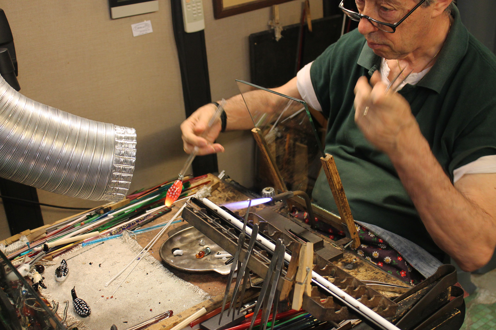
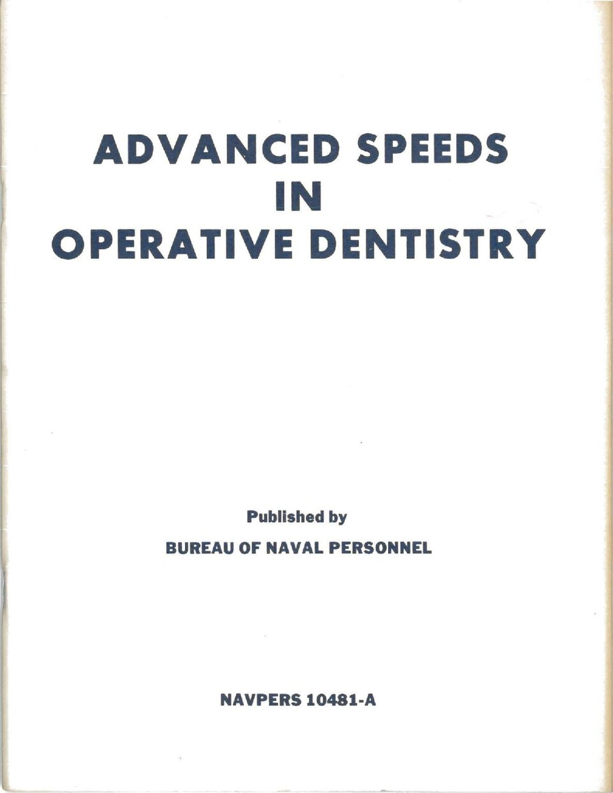
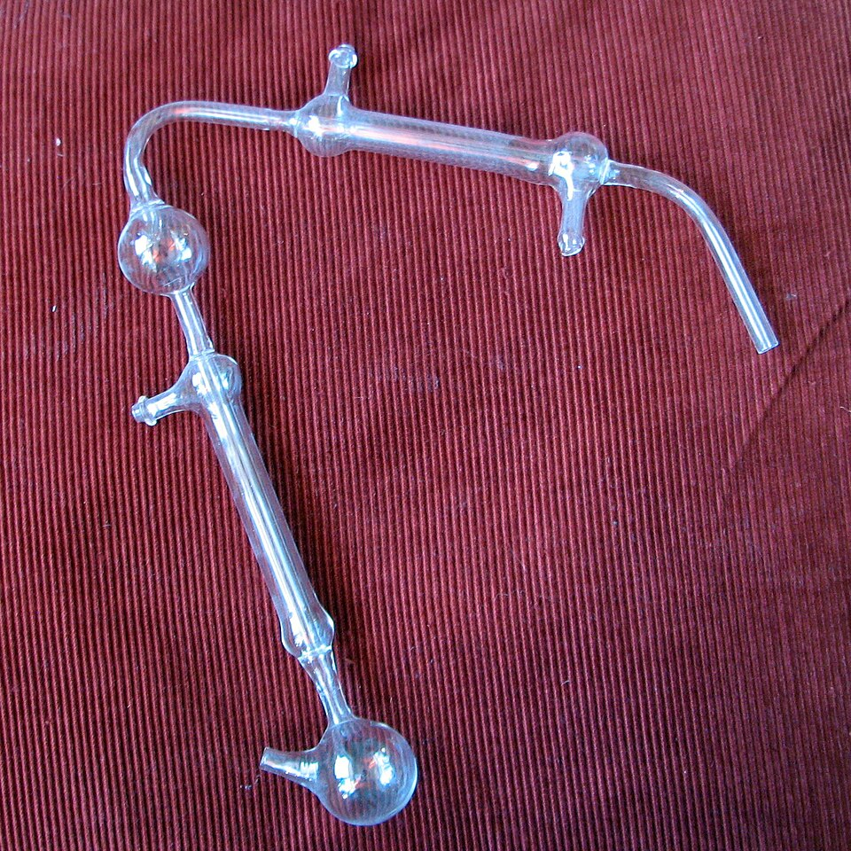
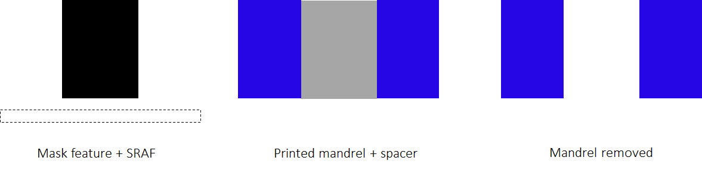
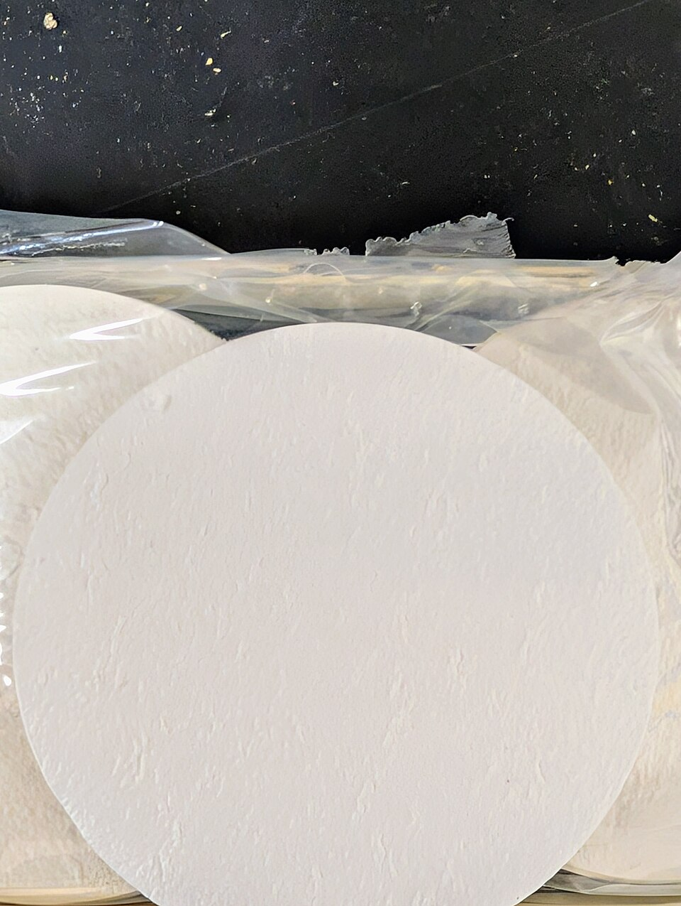
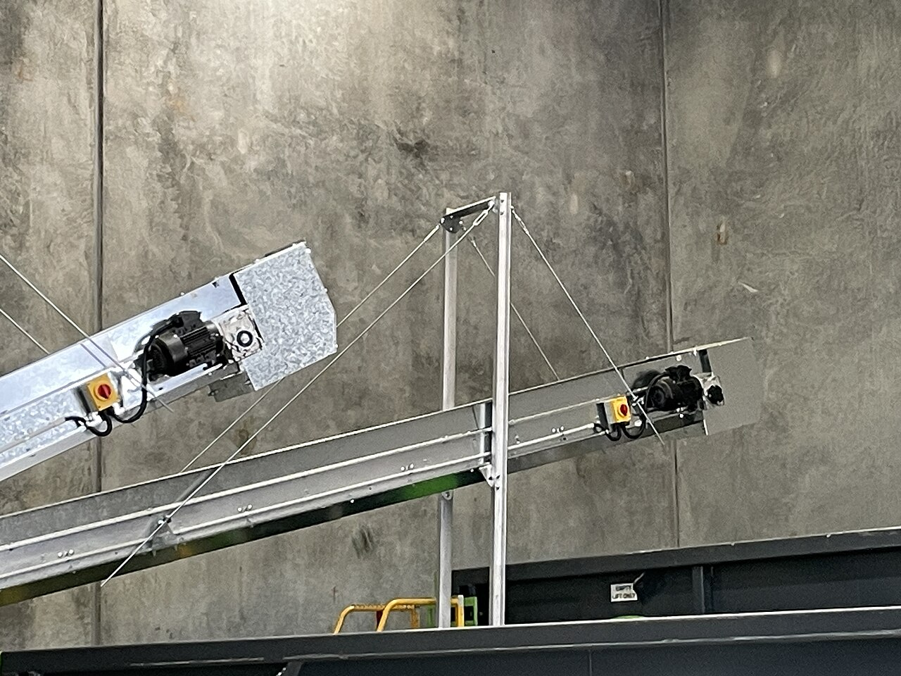

# Glass

> *Image: istolethetv, CC BY 2.0*

> *Artisan glassblowing*

> *Image: istolethetv, CC BY 2.0*

Capabilities in this domain:

> *Image: Michael Barera, CC BY-SA 4.0*

- [Basic Glass Production](basic.md) — Basic glass production from silica sand, potash, and limestone at 1100-1400°C for vessels, beads, and window panes.

> *Image: Gupta, Anurag.; Amirparviz, Babak; Sharma, Sumit; Raffle, Hayes S.; Wang, Chia-Jean, Public domain*

- [Advanced Glass Production](advanced.md) — Borosilicate glass (Pyrex-type, thermal shock resistant), fused silica/quartz glass (1700°C+, critical for CZ crucibles), glass tubing production, glassworking techniques (lampworking, sealing), and quartz crucible fabrication for semiconductor use.

> *Image: No machine-readable author provided. Ragesoss assumed (based on copyright claims)., Public domain*

- [Glassblowing & Scientific Apparatus](glassblowing.md) — Lampworking and glassblowing for laboratory glassware, scientific apparatus, and glass-to-metal seals.

> *Image: Guiding light, CC BY-SA 3.0*

- [Photomask Glass Substrates & ULE Glass](photomask-substrates.md) — Semiconductor-grade photomask substrates: fused silica blanks (<250 nm flatness over 152 mm), ULE titanium silicate glass (CTE 0±30 ppb/°C for EUV), precision polishing, chromium sputtering, and sub-micron defect inspection.

> *Image: istolethetv, CC BY 2.0*

- [Advanced Glassblowing](advanced-glassblowing.md) — Precision glassblowing with borosilicate glass, lathe-assisted forming, and controlled annealing for scientific apparatus, thermometer tubes, and vacuum enclosures.

> *Image: D.S. Soriano, CC BY-SA 4.0*

- [Glass Fibers](fibers.md) — Glass fiber production (fiberglass, insulation wool, optical fiber) from molten glass attenuated to 5-25 μm filaments for composites, insulation, and signal transmission.

> *Image: Antonín Ryska, CC BY-SA 4.0*

- [Glass-to-Metal Seals](glass-to-metal-seals.md) — Hermetic seals joining glass to metal for vacuum tube envelopes, transistor packages, and electrical feedthroughs. Matched seals (Kovar to borosilicate), compression seals (steel to soda-lime), and fritted seals.

> *Image: Pru.mitchell, CC BY 4.0*

- [Glass Recycling & Cullet Recovery](glass-recycling.md) — Reclaiming glass from end-of-life products as cullet feedstock, reducing raw material consumption and lowering melting energy for new glass production.

[↑ Back to Tech Tree](../index.md)
