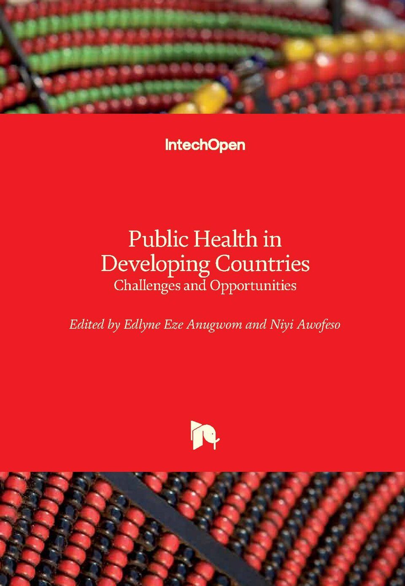
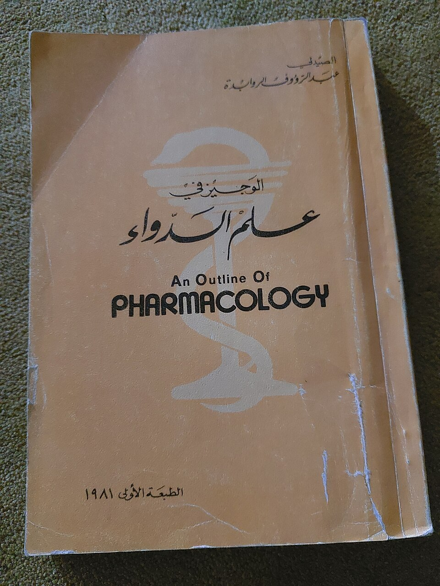
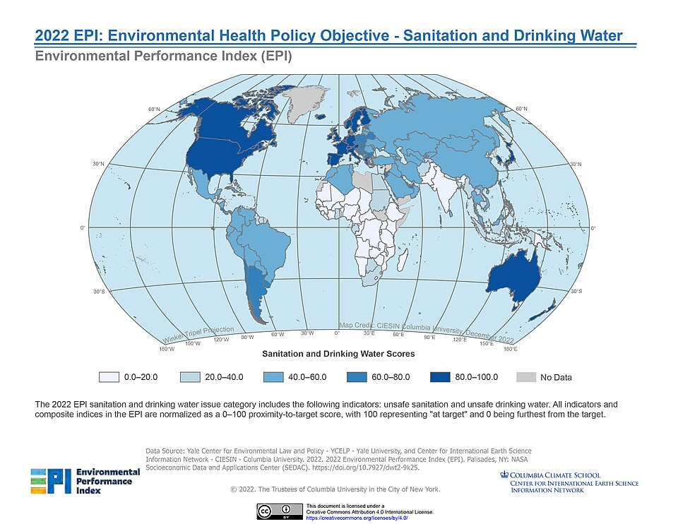
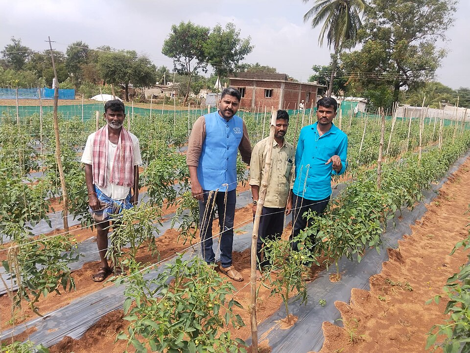
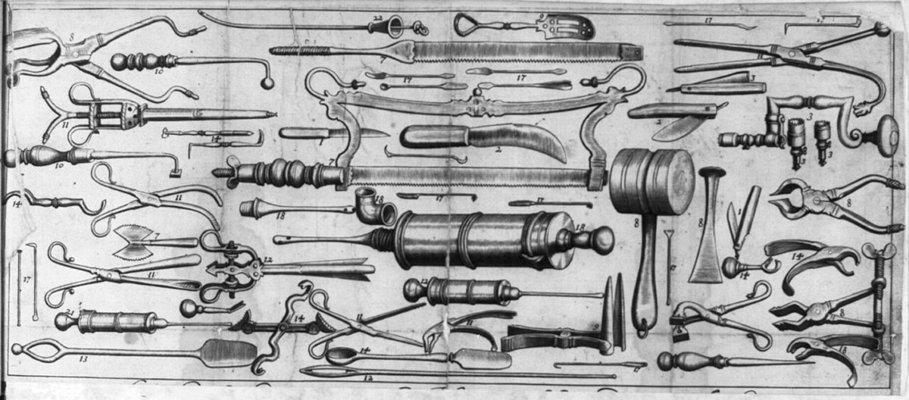
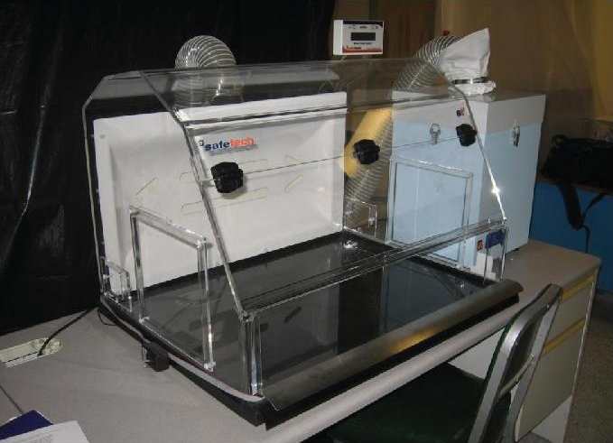
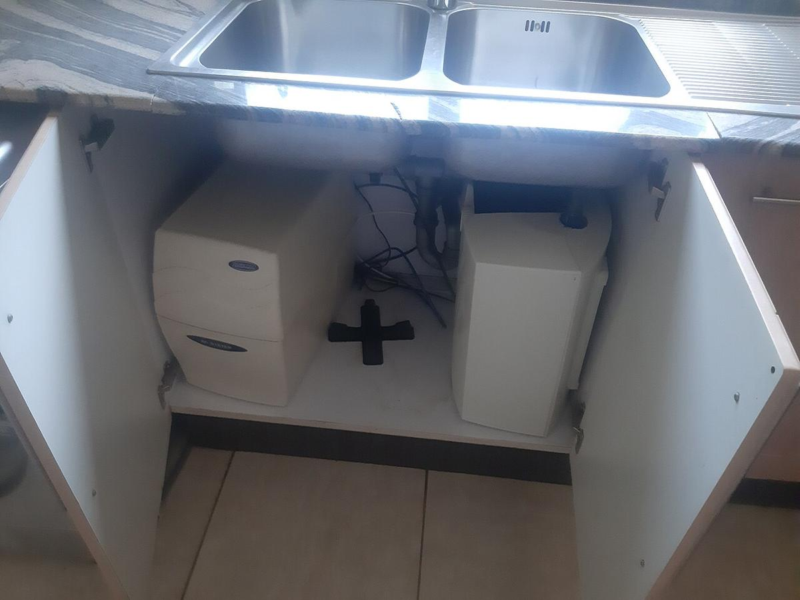
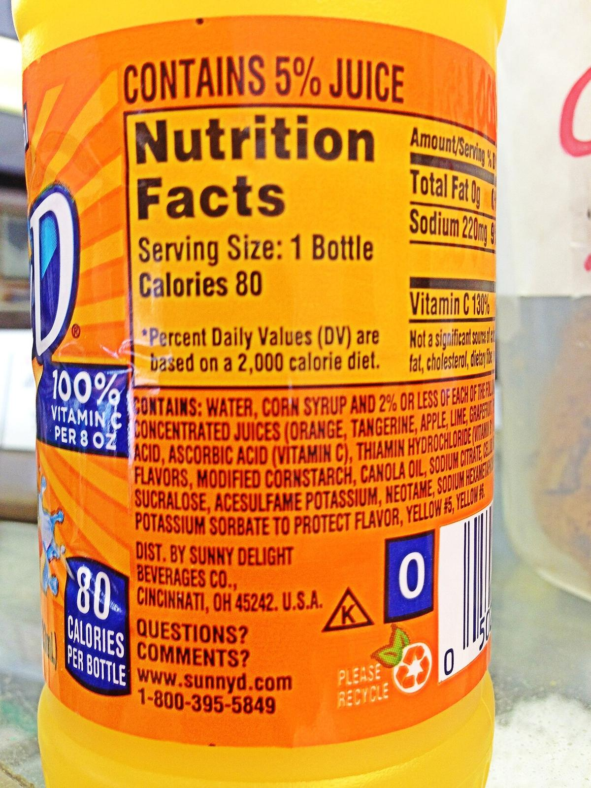

# Public Health, Sanitation & Medicine

> *Image: Ginevrajocosa88, CC BY-SA 4.0*

> *International Certificates of Vaccination - State of Vietnam & World Health Organisation*

> *Image: The government of the State of Vietnam, Public domain*

Capabilities in this domain:

> *Image: Cerevisae, CC BY-SA 4.0*

- [Medicine & Surgery](medicine.md) — Surgical capability, wound treatment, infection control, and basic medical diagnostics.

> *Image: Unknown photographer, Public domain*
Original remastering by Antonu, CC BY-SA 3.0*

- [Pharmacology](pharmacology.md) — Plant-derived and synthetic pharmaceutical production, dosage forms, and drug delivery.

> *Image: SEDACMaps, CC BY 2.0*

- [Water Supply & Sanitation](sanitation.md) — Water supply, purification, sewage treatment, hygiene protocols, and quarantine systems.

> *Image: Chidgk1, CC BY-SA 4.0*

- [Medical Instruments](medical-instruments.md) — Diagnostic, surgical, and therapeutic instruments: stethoscopes, surgical tools, sutures, sterilization equipment.

> *Image: Akhilan, CC BY-SA 4.0*

- [Occupational Health & Safety](occupational-health.md) — Hazard identification, exposure limits, PPE selection, ventilation, mining safety, and industrial hygiene.

> *Image: Miscellaneous Items in High Demand, PPOC, Library of Congress, Public domain*

- [Surgery Basics](surgery-basics.md) — Wound management, basic surgical techniques, sterilization, suture methods, and anesthesia fundamentals.
<!-- TODO: source image for Diagnostics -->
- [Diagnostics](diagnostics.md) — Physical examination, vital signs, basic laboratory testing, and fundamental imaging.

> *Image: U.S. National Institute for Occupational Safety and Health, Public domain*

- [Pharmaceutical Production](pharmaceutical-production.md) — Scaled drug manufacturing, tablet production, quality control, and sterile pharmaceutical preparation.

> *Image: Gangulybiswarup, CC BY 4.0*

- [Water Treatment](water-treatment.md) — Safe drinking water production through settling, sand filtration, boiling, chlorination, and UV treatment — the single most impactful public health intervention.

> *Image: U.S. Army photo by Spc. Thomas Dixon, Public domain*

- [Nutrition & Dietary Planning](nutrition.md) — Macronutrient and micronutrient requirements, deficiency disease prevention (scurvy, beriberi, rickets, anemia), food composition analysis, and workforce dietary planning.

[↑ Back to Tech Tree](../index.md)
